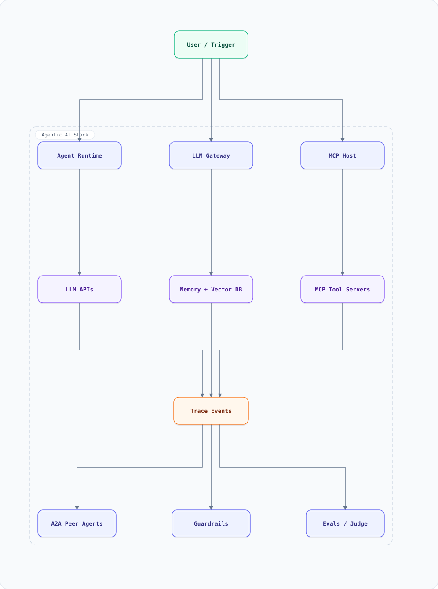

<div align="center">

# Agentic AI — LLM Fundamentals Guide with Basic Examples

</div>

A quick-reference catalog of the LLM and agentic-AI building blocks used in production agents: tokens & context windows, the agent loop, tool use, **MCP** (Model Context Protocol) for tool integration, **A2A** (Agent2Agent) for agent-to-agent work, context engineering, memory, RAG, orchestration patterns, guardrails, and evals — each with a small, concrete example.

**Agentic AI in one line:** an LLM wrapped in a **loop** — perceive (context) → reason (model) → act (tools) → observe (results) → repeat until done — with guardrails, memory, and evaluation bolted around it. The model is the brain; the architecture is the product.

### Agent stack at a glance



**Interactive diagram:** [diagrams/features/agentic-ai-at-a-glance.architecture.html](diagrams/features/agentic-ai-at-a-glance.architecture.html) — pan/zoom, search, dark/light theme, PNG/SVG export.


**Interactive diagram:** [diagrams/features/agentic-ai-at-a-glance.architecture.html](diagrams/features/agentic-ai-at-a-glance.architecture.html) — pan/zoom, search, dark/light theme, PNG/SVG export.

*Solid = inference/data flow. Agent loop §2, MCP §3, A2A §4, memory §6, RAG §7, orchestration §8, guardrails §9.

---

## Table of Contents

<details>
<summary><b>📑 Jump to a section</b></summary>

1. [LLM Primitives — Tokens, Context Windows, Sampling](#1-llm-primitives--tokens-context-windows-sampling)
2. [The Agent Loop — ReAct](#2-the-agent-loop--react)
3. [Tool Integration — MCP (Model Context Protocol)](#3-tool-integration--mcp-model-context-protocol)
4. [Agent-to-Agent — A2A](#4-agent-to-agent--a2a)
5. [Context Engineering](#5-context-engineering)
6. [Memory — Short-Term, Long-Term, Working](#6-memory--short-term-long-term-working)
7. [RAG — Retrieval-Augmented Generation](#7-rag--retrieval-augmented-generation)
8. [Orchestration Patterns — Supervisor, Handoffs, Graphs](#8-orchestration-patterns--supervisor-handoffs-graphs)
9. [Guardrails & Security](#9-guardrails--security)
10. [Evals & Observability](#10-evals--observability)
11. [Model Choice & Routing](#11-model-choice--routing)
12. [Production Concerns — Cost, Latency, Caching](#12-production-concerns--cost-latency-caching)
13. [Agentic AI in This Repo's Designs](#13-agentic-ai-in-this-repos-designs)
14. [Key Takeaways](#14-key-takeaways)
15. [Hidden Tips & Tricks](#15-hidden-tips--tricks)
16. [Do's & Don'ts](#16-dos--donts)

</details>

---

## 1. LLM Primitives — Tokens, Context Windows, Sampling

The vocabulary every other section assumes:

| Concept | What it is | Why it matters |
| :--- | :--- | :--- |
| **Token** | ~4 chars of text; the unit of input & billing | costs & limits are per-token |
| **Context window** | max tokens per request (100K–2M on modern models) | the agent's entire working memory |
| **System prompt** | persistent instructions + rules before the conversation | where behavior lives |
| **Temperature** | randomness (0 = deterministic, 1 = creative) | 0–0.3 for tools/code, higher for prose |
| **Structured output** | JSON-schema-constrained responses | machine-readable agent actions |
| **Streaming** | token-by-token responses | perceived latency; first token < 1s |

```javascript
// A minimal chat call (provider-agnostic shape)
const res = await llm.chat({
  model: "claude-sonnet-4-6",
  system: "You are a precise booking agent. Always call tools; never invent data.",
  messages: [{ role: "user", content: "Book me a table for 2 tonight" }],
  temperature: 0.2,
  max_tokens: 1024,
});
// Billing = input_tokens + output_tokens; latency ≈ time-to-first-token + tokens/rate
```

**Reasoning models** (o-series, extended-thinking, DeepSeek-R1 style) generate hidden chain-of-thought tokens before answering — better at math/planning, slower and pricier. Use them for the *planning* step of an agent, fast models for the *steps*.

---

## 2. The Agent Loop — ReAct

An agent is a while-loop around an LLM: the model decides **which tool to call**, the runtime executes it, results go back as context, repeat until the model stops or a budget is exhausted.

```text
        ┌────────────────────────────────────────┐
        │  1. assemble context (system + history │
        │     + tool schemas + retrieved docs)   │
        ▼                                        │
   ┌─────────┐   tool call     ┌────────────┐    │
   │   LLM   │ ──────────────► │  Runtime   │    │
   │ (think) │ ◄────────────── │ (execute)  │    │
   └─────────┘   observation  └────────────┘    │
        │  no more tool calls                   │
        ▼                                       │
     answer ────────────────────────────────────┘ (loop)
```

```javascript
async function runAgent(goal, tools, llm, maxSteps = 10) {
  const messages = [{ role: "user", content: goal }];
  for (let step = 0; step < maxSteps; step++) {
    const out = await llm.chat({ messages, tools: schemas(tools), temperature: 0.2 });
    messages.push(out.message);
    if (!out.toolCalls?.length) return out.text;        // model is done
    for (const call of out.toolCalls) {                 // execute each requested tool
      const result = await tools[call.name].run(call.args);
      messages.push({ role: "tool", tool_call_id: call.id, content: JSON.stringify(result) });
    }
  }
  throw new Error("step budget exhausted");             // hard stop beats infinite loop
}
```

**Two budgets on every agent:** step budget (loop safety) + token budget (cost safety). Without them, one confused run can spiral.

---

## 3. Tool Integration — MCP (Model Context Protocol)

**MCP** (Anthropic, open standard) is the USB-port of AI tools: any agent can talk to any tool server that speaks MCP — no bespoke glue per tool.

| MCP concept | Meaning |
| :--- | :--- |
| **Server** | exposes tools, resources, prompts over stdio or Streamable HTTP |
| **Tool** | a function the model can call (`book_table`, `run_sql`) with a JSON schema |
| **Resource** | read-only data the agent can load (`file:///repo/README.md`) |
| **Prompt** | reusable, parameterized prompt templates |

```jsonc
// The agent discovers tools from the server (tools/list response, simplified)
{ "tools": [{
    "name": "get_weather",
    "description": "Current weather for a city",
    "inputSchema": { "type": "object",
      "properties": { "city": { "type": "string" } },
      "required": ["city"] }
}]}
```

```bash
# Any MCP client can use any MCP server — one integration, every agent benefits
npx -y @modelcontextprotocol/server-postgres postgresql://app@db/shop   # SQL tool server
npx -y @modelcontextprotocol/server-filesystem /workspace               # file tool server
```

**Why MCP won:** tool definitions live with the tool, not the agent; permissions are per-server; servers are testable independently. Everything that used to be a custom "function calling integration" becomes config. (A2A, next section, is the same idea one level up.)

---

## 4. Agent-to-Agent — A2A

**A2A** (Google-initiated, Linux Foundation-hosted) standardizes how *agents* discover and talk to each other — orthogonal to MCP (tools ↓, peers ↔).

| A2A concept | Meaning |
| :--- | :--- |
| **Agent Card** | JSON at `/.well-known/agent-card.json` — identity, skills, endpoint, auth |
| **Task** | unit of work with lifecycle (submitted → working → completed/failed) |
| **Artifacts** | outputs of a task (files, structured data) |
| **Messages** | multi-part content exchanged during a task |

```jsonc
// /.well-known/agent-card.json — another agent discovers this and can delegate
{ "name": "FlightAgent", "description": "Books flights within budget",
  "url": "https://flights.internal/a2a",
  "skills": [{ "id": "book_flight", "description": "Find and book flights" }],
  "authentication": { "schemes": ["oauth2"] } }
```

**Pattern:** a travel *supervisor* agent gets "plan my Tokyo trip," then delegates over A2A to FlightAgent, HotelAgent, WeatherAgent (which itself uses MCP to reach a weather API). MCP connects agents to capabilities; A2A connects capabilities-owner agents to each other.

---

## 5. Context Engineering

Prompt engineering got a sibling: **context engineering** — deciding *what* enters the finite context window, because garbage context beats good models.

| Technique | What | When |
| :--- | :--- | :--- |
| **Just-in-time context** | load tool results/files only when needed | default — don't front-load |
| **Compaction** | summarize old turns, keep recent + summary | long conversations |
| **Sub-agents** | delegate a subtask to a fresh context, return only the answer | isolation + window savings |
| **Note-taking / scratchpad** | persistent plan file outside the window | tasks > context length |
| **Retrieval** | pull only relevant docs (RAG §7) | knowledge larger than window |

```javascript
// Compaction: keep the last N turns verbatim, summarize the rest into one message
async function compact(messages, llm, keepLast = 6) {
  if (messages.length <= keepLast) return messages;
  const old = messages.slice(0, -keepLast);
  const summary = await llm.chat({ messages: [
    { role: "system", content: "Summarize this agent trajectory: goals, decisions, state, open items." },
    { role: "user", content: JSON.stringify(old) }] });
  return [{ role: "user", content: `[summary of earlier steps]\n${summary.text}` }, ...messages.slice(-keepLast)];
}
```

---

## 6. Memory — Short-Term, Long-Term, Working

| Type | Lives | Lifespan | Example |
| :--- | :--- | :--- | :--- |
| Short-term | messages array / context window | one conversation | "as I said above…" |
| **Long-term** | vector DB / Postgres | across sessions | "user is vegetarian" |
| Working | scratchpad file / Redis | one task | plan + partial results |
| Episodic | event log (Kafka) | forever (replayable) | full trajectory for audit/evals |

```javascript
// Long-term memory: retrieve relevant facts, inject as context, write new ones back
const facts = await vectorDb.search("user_facts", { query: embed(goal), k: 5 });
const reply = await runAgent(`${facts.map(f => f.text).join("\n")}\n\n${goal}`, tools, llm);
await vectorDb.upsert("user_facts", [{ text: extractNewFact(reply), ts: Date.now() }]);
```

Schema note: long-term memory is just the RAG stack (§7) pointed at facts instead of documents — same embeddings, same vector search.

---

## 7. RAG — Retrieval-Augmented Generation

Ground the model in your data: chunk → embed → store → retrieve → generate.

```javascript
// 1) Ingest: chunk documents (300–800 tokens, overlap ~15%), embed each chunk
for (const chunk of chunks(doc, 600, 90)) {
  await pgvector.insert({ embedding: await embed(chunk), text: chunk, doc_id: doc.id });
}

// 2) Query: retrieve top-k, optionally rerank, then generate grounded
const hits = await pgvector.similarity(embed(question), { k: 20 });
const top = await rerank(question, hits, { k: 5 });          // cross-encoder reranker
const answer = await llm.chat({
  messages: [
    { role: "system", content: "Answer ONLY from the context. Cite [doc_id]." },
    { role: "user", content: `Context:\n${top.map(h => `[${h.doc_id}] ${h.text}`).join("\n")}\n\nQ: ${question}` }] });
```

| Decision | Guidance |
| :--- | :--- |
| Embedding model | 1536-dim class (OpenAI/Cohere/oss) — pick one, don't mix |
| k | retrieve 20–50, rerank to 5–10 (recall-then-precision) |
| Hybrid search | BM25 + vectors, merged — beats either alone |
| When NOT to RAG | task fits in context window — just paste the docs |

Serving options by scale: `pgvector` in managed Postgres (≤10M vectors) → dedicated vector DB / Vertex Vector Search / AI Search beyond → see `cloud.md` §11.

---

## 8. Orchestration Patterns — Supervisor, Handoffs, Graphs

| Pattern | Shape | Use |
| :--- | :--- | :--- |
| **Prompt chaining** | A → B → C pipeline | deterministic multi-step flows |
| **Routing** | classifier picks one branch | support triage |
| **Parallelize + aggregate** | fan-out LLM calls, merge | map-reduce over docs |
| **Supervisor** | orchestrator delegates to workers | multi-agent teams |
| **Handoff (swarm)** | agent transfers control + context to a peer | specialist escalation |
| **Graph (LangGraph-style)** | explicit state machine of nodes/edges | complex, auditable flows |
| **Reflection** | agent critiques own output, retries | quality-critical generation |

```javascript
// Supervisor: a router-LLM delegates to worker agents, each a mini agent loop
const workers = { flights: flightAgent, hotels: hotelAgent, budget: budgetAgent };
async function supervisor(goal) {
  const plan = await llm.chat({ messages: [
    { role: "system", content: "Decompose into steps naming a worker: flights|hotels|budget." },
    { role: "user", content: goal }] });
  const state = {};
  for (const step of plan.steps) state[step.id] = await workers[step.worker](step.instruction, state);
  return synthesize(goal, state);          // final LLM pass over worker outputs
}
```

**Guidance:** start single-agent; add patterns when *measured* failure (context overflow, tool sprawl, latency) demands them. Every layer adds failure modes faster than capability.

---

## 9. Guardrails & Security

Agents execute actions — the threat model is application security, not chatbots.

| Threat | Defense |
| :--- | :--- |
| **Prompt injection** (malicious docs/webpages instruct the agent) | treat retrieved content as data, never instructions; tool allowlists per surface; human approval for sensitive actions |
| Excessive agency | least-privilege MCP servers; per-tool confirmation gates; read-only defaults |
| Runaway loops/costs | step + token budgets (§2); per-user rate limits (`system-design-rate-limiter.md`) |
| Data exfiltration | egress allowlists; PII redaction before third-party LLM calls |
| Unsafe code execution | sandboxed runtimes (the `system-design-online-judge.md` isolation stack) |

```javascript
// Confirmation gate: side-effectful tools require explicit human approval
const SENSITIVE = new Set(["send_money", "delete_resource", "publish"]);
async function guardedToolCall(call) {
  if (SENSITIVE.has(call.name)) {
    const ok = await requestHumanApproval({ tool: call.name, args: call.args });
    if (!ok.approved) return { error: "denied by human review" };
  }
  return tools[call.name].run(call.args);
}
```

---

## 10. Evals & Observability

Untested agents are unshippable. Three layers:

1. **Tracing** — every LLM call, tool call, and token count recorded per span (OpenTelemetry GenAI conventions) — the `system-design-concepts.md` §38 stack with GenAI attributes
2. **Assertions** — deterministic checks on outputs (valid JSON, no PII, required citations)
3. **LLM-as-judge + golden sets** — score open-ended outputs against rubrics; regression-run on every prompt/model change

```javascript
// Tiny eval harness: golden inputs -> run agent -> score with rubric judge
const cases = JSON.parse(readFileSync("evals/booking.jsonl"));
let passed = 0;
for (const c of cases) {
  const out = await runAgent(c.input, tools, llm);
  const score = await judge(out, c.rubric);        // separate strong model as judge
  if (score >= c.minScore) passed++;
  trace.record({ case: c.id, score, tokens: out.usage });
}
console.log(`${passed}/${cases.length} eval cases passed`);
```

Ship a change only if eval scores hold — the CI gate for prompts, exactly as tests are for code (fits the `system-design-code-deployment.md` pipeline as a test stage).

---

## 11. Model Choice & Routing

| Job | Model class |
| :--- | :--- |
| Simple classification/extraction | small fast model (Haiku/4o-mini/flash class) |
| Tool-using agent steps | mid-tier (Sonnet/4.1 class) |
| Hard planning, reasoning models | o-series/extended-thinking/R1 class |
| Embeddings | dedicated embedding model (never chat models) |
| Cheap drafts + expensive checks | model cascade: small first, escalate on low confidence |

```javascript
// Cascade routing: 80% of traffic never needs the expensive model
async function route(task) {
  if (task.type === "classify" || task.tokens < 500) return "small-fast";
  if (task.needsPlanning || task.toolCount > 8) return "reasoning";
  return "mid-tier";
}
```

Multi-provider routing (Bedrock/Vertex/Azure OpenAI — `cloud.md` §11) also hedges rate limits and regional availability.

---

## 12. Production Concerns — Cost, Latency, Caching

| Concern | Technique |
| :--- | :--- |
| Cost | token budgets; cascade routing; batch API for offline jobs (50% cheaper) |
| Latency | streaming; parallel tool calls; speculative small-model prefill |
| **Prompt-prefix caching** | keep system prompt + tool schemas byte-identical across calls — providers cache them at ~10% cost |
| Rate limits | client-side token buckets per model (`system-design-concepts.md` §12) |
| Idempotency | tool calls carry idempotency keys — agents retry (§4 reliability of `system-design-payment-system.md`) |
| Fallbacks | provider outage → degraded model or "maintenance mode" response |

```javascript
// Prompt-prefix caching: static parts first, volatile parts last — byte-for-byte stable
const SYSTEM = `You are... ${toolSchemasJson}`;   // never reorder or reformat dynamically
const messages = [{ role: "system", content: SYSTEM },
                  { role: "user", content: volatileUserInput }];
```

---

## 13. Agentic AI in This Repo's Designs

| Doc | Connection |
| :--- | :--- |
| `system-design-llm-inference.md` | the serving layer every agent talks to (KV cache, batching) |
| `system-design-recommendation-system.md` | feature-store + two-stage funnel ≈ RAG retrieve-then-rank |
| `system-design-online-judge.md` | sandboxing model for agent code-execution tools |
| `system-design-code-deployment.md` | eval suites as the CI gate for prompt changes |
| `system-design-payment-system.md` | idempotency keys for side-effectful tool calls |
| `system-design-notification-system.md` | agent-initiated notifications with rate limiting |
| `cloud.md` §11 | managed model APIs, vector stores, GPU pools |
| `elasticsearch-features.md` §3 | `dense_vector` kNN as the RAG retrieval tier |

---

## 14. Key Takeaways

1. **An agent = LLM + loop + tools + guardrails** — the model is the smallest part
2. **MCP standardizes tools, A2A standardizes agents** — compose them; skip bespoke integrations
3. **Context engineering beats prompt tweaking** — compaction, sub-agents, and just-in-time loading are the levers
4. **Memory is RAG pointed at facts** — one embedding stack serves both
5. **Budgets everywhere**: steps, tokens, and money — with hard stops
6. **Treat model outputs as untrusted input** — injection defense and confirmation gates are table stakes
7. **Evals are the tests of AI engineering** — no green eval suite, no deploy
8. Related: `system-design-llm-inference.md` (self-hosted serving), `cloud.md` (managed AI stack), `postgresql-features.md` (pgvector)

## 15. Hidden Tips & Tricks

**1. Temperature 0 isn't determinism.** Batching, paging, and MoE routing make identical prompts diverge across runs and providers. Pin model *versions* (not aliases), set seeds where supported, and evaluate with N-run samples — "but it worked when I tried it" is not a test.

**2. Context quality beats context quantity.** Accuracy degrades as the window fills ("lost in the middle" — models recall the start and end best). Put hard instructions first and last; compress or drop the middle; retrieve less, retrieve better.

**3. Agent loops need a guillotine.** Cap tool-call iterations and token budget per run, and give the agent a literal `give_up` tool to emit. Runaway loops burn money silently at 3 a.m. — budget alarms are part of the agent, not the FinOps team.

**4. Prompt-prefix caching has an ordering contract.** Static content first, dynamic content last — reordering (even a timestamp early in the prompt) invalidates the cached prefix and 10×'s your token bill.

**5. Tool schemas are suggestions until validated.** The model *will* invent a parameter name you never defined. Validate tool args against the JSON schema before execution and return schema-violation errors as tool results — the model self-corrects next turn.

**6. Model upgrades are dependency upgrades.** "Better on benchmarks" can flip tool-call formatting or system-prompt obedience. Keep the golden-set eval suite (§14) as the gate: no model version change ships without it.

## 16. Do's & Don'ts

| ✅ Do | ❌ Don't |
| :--- | :--- |
| Pin model versions; gate changes behind golden-set evals | Don't swap model aliases in prod and hope behavior holds |
| Validate every tool call against its JSON schema before executing | Don't execute unvalidated model-invented arguments |
| Cap agent iterations and token budget; provide a `give_up` exit | Don't let the ReAct loop run unbounded overnight |
| Keep secrets in tool servers (MCP), scoped per agent | Don't paste API keys into system prompts |
| Log traces (inputs, tool calls, token counts) for every run | Don't debug agents from user screenshots — observability first |
