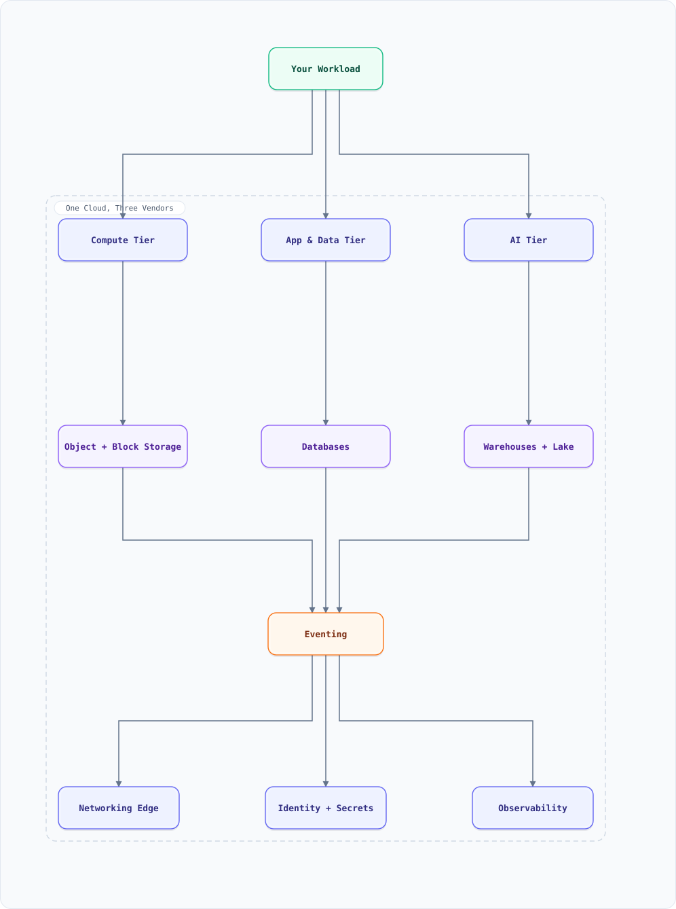

<div align="center">

# Cloud Services Guide — Which Tool, Where, and Why

</div>

A vendor-neutral map of cloud services across **AWS, GCP, and Azure**, organized by what you're actually building: object storage and archive tiers, block/file storage, compute and Kubernetes, databases, messaging, networking, AI/ML platforms, and observability. Each section ends with **"use it when"** guidance tied to the system designs in this repo.

**In one line:** every major cloud ships the same ~30 primitives (object store, managed Postgres, queue, Kubernetes, CDN…) under different names — interviews and migrations are easier once you can translate fluently between them.

### Multi-cloud service map at a glance



**Interactive diagram:** [diagrams/features/cloud-at-a-glance.architecture.html](diagrams/features/cloud-at-a-glance.architecture.html) — pan/zoom, search, dark/light theme, PNG/SVG export.

---

## Table of Contents

<details>
<summary><b>📑 Jump to a section</b></summary>

1. [Object Storage & Archive Tiers (S3 / GCS / Blob)](#1-object-storage--archive-tiers-s3--gcs--blob)
2. [Block & File Storage](#2-block--file-storage)
3. [Compute — VMs, Containers, Serverless](#3-compute--vms-containers-serverless)
4. [Kubernetes — EKS / GKE / AKS](#4-kubernetes--eks--gke--aks)
5. [Relational Databases](#5-relational-databases)
6. [NoSQL — Wide-Column, Document, Key-Value](#6-nosql--wide-column-document-key-value)
7. [Caching](#7-caching)
8. [Analytics Warehouses & Data Lakes](#8-analytics-warehouses--data-lakes)
9. [Messaging & Eventing](#9-messaging--eventing)
10. [Networking, CDN & DNS](#10-networking-cdn--dns)
11. [AI / ML Platforms & LLM APIs](#11-ai--ml-platforms--llm-apis)
12. [Identity, Secrets & Security](#12-identity-secrets--security)
13. [Observability](#13-observability)
14. [Which Tool When — Decision Table](#14-which-tool-when--decision-table)
15. [Mapping to This Repo's Designs](#15-mapping-to-this-repos-designs)
16. [Key Takeaways](#16-key-takeaways)
17. [Hidden Tips & Tricks](#17-hidden-tips--tricks)
18. [Do's & Don'ts](#18-dos--donts)
19. [Full Service Catalog — Everything Worth Knowing](#19-full-service-catalog--everything-worth-knowing)

</details>

---

## 1. Object Storage & Archive Tiers (S3 / GCS / Blob)

The backbone primitive: infinite, 11-nines-durable blob storage with lifecycle tiering.

| Need | AWS | GCP | Azure |
| :--- | :--- | :--- | :--- |
| Standard object store | S3 Standard | Cloud Storage Standard | Blob Storage Hot |
| Infrequent access | S3 Standard-IA / One-Zone-IA | Nearline / Coldline | Cool |
| Archive (cheap, slow) | S3 Glacier Instant / Flexible | Archive | Cold / Archive |
| Deep archive | S3 Glacier Deep Archive (~$1/TB-mo) | Archive | Archive |
| Requester-pays / egress partner | S3 | Cloud Storage | Blob |
| Eventing on change | S3 Event Notifications → SQS/Lambda | Pub/Sub notifications | Event Grid |

```bash
# AWS: lifecycle to archive + instant restore semantics
aws s3api put-bucket-lifecycle-configuration --bucket media --lifecycle-configuration '{
  "Rules": [{"ID":"tier","Status":"Enabled","Filter":{"Prefix":"videos/"},
    "Transitions":[{"Days":30,"StorageClass":"STANDARD_IA"},
                   {"Days":90,"StorageClass":"GLACIER_IR"},
                   {"Days":365,"StorageClass":"DEEP_ARCHIVE"}]}]}'
```

**Use it when:** video/image/blob workloads (Netflix, YouTube, file-storage designs), data-lake floors (Route IQ's Delta tables), snapshot targets (ES searchable snapshots, Postgres PITR). Archive tiers trade retrieval time (minutes–hours) and retrieval cost for ~10–20× cheaper storage — perfect for compliance video, never for hot reads. See `system-design-file-storage.md`, `system-design-netflix.md`.

---

## 2. Block & File Storage

| Need | AWS | GCP | Azure |
| :--- | :--- | :--- | :--- |
| Block (disk for VMs) | EBS (gp3/io2) | Persistent Disk / Hyperdisk | Managed Disk (Premium/Ultra) |
| Shared POSIX file system | EFS | Filestore | Azure Files |
| High-performance parallel FS | FSx for Lustre | Filestore High Scale | Azure HPC Cache |
| NVMe-local (ephemeral) | Instance store / i-series | Local SSD | Local (ephemeral) disks |

**Use it when:** EBS/PD for databases (IOPS provisioning on io2/Ultra), EFS/Filestore for shared app state, local NVMe for LSM-heavy engines (Kafka, ClickHouse, TSDB head blocks). Remember: local disks die with the VM — replication (Kafka ISR, Cassandra RF) or snapshotting is mandatory.

---

## 3. Compute — VMs, Containers, Serverless

| Need | AWS | GCP | Azure |
| :--- | :--- | :--- | :--- |
| VMs | EC2 | Compute Engine | Virtual Machines |
| Containers (own orchestration) | ECS / EKS | GKE (+ Autopilot) | AKS / Container Apps |
| Serverless containers | Fargate / App Runner | Cloud Run | Container Apps |
| Functions (FaaS) | Lambda | Cloud Functions (gen2) | Azure Functions |
| Spot/batch | Spot Fleet / Batch | Spot VMs / Batch | Spot VMs / Batch |

**Use it when:** ECS/Fargate if you want containers without Kubernetes complexity; EKS/GKE/AKS for standardized ops and portability (§4); Lambda/Cloud Run for spiky, event-driven, scale-to-zero work (see `system-design-serverless.md` for what you'd be building by hand); Batch/Spot for Spark pipelines (Route IQ cleaning jobs, ML training).

---

## 4. Kubernetes — EKS / GKE / AKS

| Dimension | AWS EKS | GCP GKE | Azure AKS |
| :--- | :--- | :--- | :--- |
| Control plane | Managed, per-cluster $0.10/h | Managed, Autopilot mode bills per-pod | Managed, free control plane tier |
| Differentiator | Deepest AWS integration (IRSA, ALB controller) | **Autopilot** (fully managed nodes), best-in-class networking | Best AD/Arc integration, free tier |
| Node auto-provisioning | Karpenter (open source, very fast) | NAP (built into Autopilot) | Cluster Autoscaler / NAP (Karpenter preview) |
| Upgrade cadence | You drive, standard vs extended support | Autopilot handles most | You drive, LTS channels |
| When to pick | Already AWS-heavy, IAM-centric | Want least Kubernetes ops burden | Microsoft-shop, hybrid with Arc |

```bash
# EKS: pod gets AWS permissions without secrets (IRSA)
eksctl create iamserviceaccount --cluster prod --name s3-reader \
  --attach-policy-arn arn:aws:iam::123:policy/readonly-s3 --approve
# GKE Autopilot: just deploy — nodes, sizing, scaling are managed
kubectl apply -f deployment.yaml   # cluster was created with --enable-autopilot
```

**Use it when:** you run many microservices with HPA/KEDA autoscaling, sidecars, and GitOps (ArgoCD — the code-deployment design). For 1–3 services, ECS/Fargate or Cloud Run is cheaper ops-wise. Every "Scaling Tiers" table in this repo assumes one of these runtimes.

---

## 5. Relational Databases

| Need | AWS | GCP | Azure |
| :--- | :--- | :--- | :--- |
| Managed MySQL/Postgres | RDS | Cloud SQL | Azure Database for PostgreSQL/MySQL |
| High-performance Postgres | Aurora PostgreSQL | AlloyDB | Azure Flexible Server (Premium) |
| Scale-out relational | Aurora (up to 15 replicas) | AlloyDB + columnar engine | Hyperscale (Citus) |
| Global | Aurora Global Database | Cloud SQL cross-region replicas | Cosmos DB for PostgreSQL |

```sql
-- RDS/Aurora: the Postgres dialect from postgresql-features.md applies as-is
SELECT count(*) FROM orders WHERE created_at > now() - interval '1 hour';
```

**Use it when:** the default choice for transactional systems (payments, orders, calendars — every "PostgreSQL" in this repo's diagrams). Aurora/AlloyDB when you need replicas beyond ~5 with faster failover; Citus/Hyperscale when sharding Postgres but keeping SQL (e-commerce order tables). PITR and read replicas are table stakes everywhere.

---

## 6. NoSQL — Wide-Column, Document, Key-Value

| Need | AWS | GCP | Azure |
| :--- | :--- | :--- | :--- |
| Document DB | **DocumentDB** (Mongo-compatible) | **Firestore** (serverless doc) | **Cosmos DB** (multi-API) |
| Mongo wire-compatible | DocumentDB | (MongoDB Atlas on GCP) | Cosmos DB for MongoDB |
| Wide-column / Dynamo-style | **DynamoDB** | Bigtable | Cosmos DB (Table/Cassandra API) |
| Managed MongoDB (native) | MongoDB Atlas on AWS | MongoDB Atlas on GCP | MongoDB Atlas on Azure |
| Key-value cache-first | DynamoDB DAX | Memorystore | Table Storage |

```javascript
// DynamoDB single-table access pattern (key-value-store design)
await ddb.query({ TableName: "orders", KeyConditionExpression: "pk = :u AND begins_with(sk, :o)",
  ExpressionAttributeValues: { ":u": { S: "user#42" }, ":o": { S: "order#" } } });
```

**Use it when:** DynamoDB/Bigtable/Cosmos for write-heavy, partition-keyed systems (telemetry, carts, session stores, IRCTC-style booking with high write fan-in). Firestore for mobile-first apps with offline sync. For Mongo-shaped workloads, Atlas (native) usually beats the API-compatible emulators on feature parity — see `mongodb-features.md` §9 for why replica-set semantics matter.

---

## 7. Caching

| Need | AWS | GCP | Azure |
| :--- | :--- | :--- | :--- |
| Managed Redis | ElastiCache (Redis OSS/Valkey) | Memorystore for Redis | Azure Managed Redis |
| Managed Memcached | ElastiCache Memcached | — | — |
| Redis Enterprise features | ElastiCache for Redis (cluster mode) | Memorystore for Redis Cluster | Azure Cache for Redis (Enterprise) |
| Serverless edge cache | CloudFront Functions | Media CDN | CDN rules engine |

**Use it when:** every "Redis" box in this repo's diagrams — ElastiCache/Memorystore/Azure Cache are the managed forms (`redis-features.md` covers the engine itself). Cluster mode when >~25GB or >100K ops/s; Sentinel-style replication for HA. Memcached only for dead-simple string caching with no persistence needs.

---

## 8. Analytics Warehouses & Data Lakes

| Need | AWS | GCP | Azure |
| :--- | :--- | :--- | :--- |
| Data warehouse | Redshift | BigQuery | Synapse / Fabric |
| Data lake format | S3 + Iceberg | BigLake (Iceberg) | ADLS + Delta/Iceberg |
| Lakehouse processing | EMR (Spark) | Dataproc | Databricks / Fabric Spark |
| Stream analytics | Kinesis Analytics / Flink on EMR | Dataflow (Beam) | Stream Analytics |
| ClickHouse-style OLAP | Redshift Serverless | BigQuery | Synapse SQL |

```sql
-- BigQuery: pay per column scanned — partition + cluster or go broke
SELECT user_id, sum(amount) FROM prod.orders
WHERE _PARTITIONTIME >= TIMESTAMP_SUB(CURRENT_TIMESTAMP(), INTERVAL 7 DAY)
GROUP BY user_id;
```

**Use it when:** BigQuery is the least-ops warehouse (serverless, per-query billing); Redshift/Synapse when you want reserved-capacity economics. Spark-on-EMR/Dataproc/Databricks is the Route IQ pattern (mapInPandas over Delta/Iceberg tables). All three feed the offline training loop in `system-design-recommendation-system.md`.

---

## 9. Messaging & Eventing

| Need | AWS | GCP | Azure |
| :--- | :--- | :--- | :--- |
| Kafka (managed) | MSK | Managed Kafka (recently GA) | Event Hubs (Kafka protocol) |
| Simple queue | **SQS** (standard + FIFO) | Pub/Sub (pull/push) | Service Bus Queues |
| Pub/Sub topics | SNS | Pub/Sub | Event Grid / Service Bus Topics |
| RabbitMQ-compatible | Amazon MQ | — (RabbitMQ on GKE/Cloud Run) | — (or CloudAMQP partner) |
| Streaming + replay | Kinesis Data Streams | Pub/Sub (with ordering keys) | Event Hubs Capture |

```bash
# SQS: the "dumb queue" that just works — visibility timeout = lease
aws sqs send-message --queue-url tasks --message-body '{"job":"render","id":"7"}' \
  --message-deduplication-id 7 --message-group-id renders   # FIFO variant
```

**Use it when:** SQS/Pub/Sub/Service Bus for work queues (jobs, emails, webhooks); MSK/Event Hubs/managed-Kafka for event streaming with replay (event backbone in every architecture diagram here); Amazon MQ when you need actual RabbitMQ/ActiveMQ semantics — see `rabbitmq-features.md` §12 for the Kafka-vs-RabbitMQ decision and `kafka-features.md` for the streaming side.

---

## 10. Networking, CDN & DNS

| Need | AWS | GCP | Azure |
| :--- | :--- | :--- | :--- |
| VPC | VPC | VPC | VNet |
| DNS | Route 53 | Cloud DNS | Azure DNS |
| CDN | CloudFront | Cloud CDN / Media CDN | Azure Front Door / CDN |
| L7 load balancer | ALB | Global External LB (HTTPS) | Application Gateway / Front Door |
| L4 load balancer | NLB | External Passthrough LB | Load Balancer (Standard) |
| API management | API Gateway + (AppSync for GraphQL) | Apigee / API Gateway | API Management |
| Private service link | PrivateLink | Private Service Connect | Private Link |

**Use it when:** CloudFront/Cloud CDN/Front Door in front of every "CDN" box in this repo's diagrams; ALB-class L7 LBs with WAF for the "WAF / API Gateway" tier; PrivateLink/PSC to keep S3/databases off the public internet. Route 53 latency-based routing + health checks = the global entry point of every multi-tier design.

---

## 11. AI / ML Platforms & LLM APIs

| Need | AWS | GCP | Azure |
| :--- | :--- | :--- | :--- |
| Model training/serving platform | SageMaker | Vertex AI | Azure ML |
| Managed LLM APIs | Bedrock (Claude, Llama, Nova…) | Vertex AI Model Garden (Gemini…) | Azure OpenAI (GPT…) |
| Vector store | Aurora pgvector / OpenSearch / S3 Vectors | Vertex Vector Search / pgvector | AI Search (vectors) |
| Embeddings API | Bedrock / Titan | Vertex Embeddings | Azure OpenAI embeddings |
| Notebooks/GPUs | SageMaker Studio / EC2 P/G | Colab Enterprise / A100 pools | ML Studio / NC-series |

**Use it when:** Bedrock/Vertex/Azure OpenAI for LLM features without owning inference; SageMaker/Vertex/AML for custom training; pgvector inside managed Postgres for "good enough" RAG below ~10M vectors, dedicated vector search beyond (see `agentic-ai-features.md` and `system-design-llm-inference.md` for the self-hosted path).

---

## 12. Identity, Secrets & Security

| Need | AWS | GCP | Azure |
| :--- | :--- | :--- | :--- |
| IAM | IAM (users/roles/policies) | IAM (bindings/conditions) | Entra ID + RBAC |
| Workload identity (no keys) | IRSA / Instance profiles | Workload Identity Federation | Managed Identities |
| Secrets | Secrets Manager / Parameter Store | Secret Manager | Key Vault |
| KMS | KMS | Cloud KMS | Key Vault (keys) |
| WAF | AWS WAF | Cloud Armor | Front Door WAF |
| DDoS | Shield | Cloud Armor | DDoS Protection |

**Use it when:** workload identity everywhere — never long-lived keys in code (the #1 cloud security finding); Secrets Manager/KMS for the credential layer every design's "Security" section assumes; WAF at the edge (the "WAF / API Gateway" component).

---

## 13. Observability

| Need | AWS | GCP | Azure |
| :--- | :--- | :--- | :--- |
| Metrics/logs | CloudWatch | Cloud Monitoring/Logging | Monitor / Log Analytics |
| Tracing | X-Ray | Cloud Trace (OpenTelemetry native) | Application Insights |
| Managed Prometheus/Grafana | Amazon Managed Prometheus | GMP (Google Managed Prometheus) | Azure Managed Grafana |

**Use it when:** OpenTelemetry SDKs from day one — then CloudWatch/GMP/App Insights become backends you can swap (see `system-design-concepts.md` §38 and the alerting design for the architecture these plug into).

---

## 14. Which Tool When — Decision Table

| Requirement | Reach for | Avoid |
| :--- | :--- | :--- |
| Files/media with 11-nines | S3/GCS/Blob standard | EBS, filesystems |
| Compliance video kept 7 years | Glacier Deep Archive / Archive tier | Standard-IA (10× cost) |
| Postgres with HA + PITR | RDS/Cloud SQL/Flexible | Self-managed on VMs |
| Write 100K rows/s keyed by device | DynamoDB/Bigtable/Cosmos | Postgres without sharding |
| Hot cache < 5ms | ElastiCache/Memorystore | DynamoDB DAX only for item-cache |
| 50K background jobs/min | SQS FIFO / Pub/Sub | Lambda recursion "queues" |
| Event log, replay for 7 days | Kinesis/Event Hubs/Pub/Sub | SQS (delete-on-read) |
| 5 microservices, no k8s team | ECS Fargate / Cloud Run / Container Apps | EKS "because resume" |
| 50+ microservices, HPA + GitOps | EKS / GKE Autopilot / AKS | One giant EC2 fleet |
| Spark over petabytes weekly | EMR/Dataproc/Databricks + Delta/Iceberg | Lambda chunk-processing |
| LLM feature in one sprint | Bedrock/Vertex/Azure OpenAI | Self-hosting vLLM day one |
| RAG under 10M vectors | pgvector in managed Postgres | Dedicated vector DB + ops burden |

---

## 15. Mapping to This Repo's Designs

| Design doc | Cloud pieces it implies |
| :--- | :--- |
| `system-design-file-storage.md` | S3/GCS/Blob + lifecycle tiers + CloudFront |
| `system-design-alerting.md` | Managed Prometheus + object-store TSDB blocks |
| `system-design-netflix.md` / `youtube.md` | S3 + Glacier tiers + Media CDN + transcoding fleet |
| `system-design-ecommerce.md` | RDS/Aurora + ElastiCache + SQS/MSK + CloudFront |
| `system-design-key-value-store.md` | DynamoDB (the doc literally designs it) |
| `system-design-route-reconstruction.md` | EMR/Dataproc Spark + S3 Delta + OSRM on EKS |
| `system-design-llm-inference.md` | GPU node pools on EKS/GKE/AKS + S3 model weights |
| `agentic-ai-features.md` | Bedrock/Vertex/Azure OpenAI + pgvector + Lambda/FaaS |
| `system-design-code-deployment.md` | EKS + ArgoCD + ECR + CodeBuild-class CI |

---

## 16. Key Takeaways

1. **Learn primitives, not consoles** — object store, managed PG, queue, k8s, CDN exist on all three clouds with different names
2. **Tiers are the cost lever** — S3 IA/Glacier, Blob Cool/Archive: 10–20× storage savings for patience
3. **Managed first** — DynamoDB/SQS/BigQuery eliminate ops you'd otherwise own; self-host Kafka/Cassandra only when the managed form's limits bind
4. **Workload identity, never keys** — IRSA / Workload Identity Federation / Managed Identities
5. **Kubernetes is a commitment** — EKS/GKE/AKS pay off at scale; below that pick Fargate/Cloud Run/Container Apps
6. **Egress is the hidden bill** — multi-cloud looks cheap until data crosses providers
7. Related guides: `postgresql-features.md`, `redis-features.md`, `kafka-features.md`, `mongodb-features.md`, `elasticsearch-features.md`, `rabbitmq-features.md`, `agentic-ai-features.md`

## 17. Hidden Tips & Tricks

**1. Egress is the silent bill.** ~$90/TB out of AWS — a "cheap" $50 EC2 box streaming 5 TB/month is a $500 mistake. CDN egress is usually cheaper than raw origin egress; architect the bytes path before the compute.

**2. Cross-AZ traffic costs money *both* ways.** Chatty microservices spread across AZs can out-bill the compute running them. AZ-aware routing isn't just latency hygiene, it's line-item savings.

**3. One NAT Gateway = cross-AZ charges + a single point of failure.** Per-AZ NAT costs more upfront and less at scale — and survives an AZ outage.

**4. Spot isn't a discount, it's a contract: eviction with 2 minutes' notice.** Stateless, checkpointable, or shard-replicated workloads take the 60–90% off; anything stateful needs the eviction path *designed* (drain, checkpoint, rebalance).

**5. Object storage pricing is request-shaped, not just byte-shaped.** Millions of small GET/PUTs can out-bill the storage itself — batch, compress, cache at the edge; tier cold data (S3 Glacier ↔ GCS Archive ↔ Azure Archive) *with* the retrieval-cost table in hand.

**6. DR doesn't replicate by default.** Most managed services are regional — cross-region replication is an explicit enable per service (S3 CRR, Aurora Global, geo-DR). The first DR drill is where you learn which ones you forgot.

## 18. Do's & Don'ts

| ✅ Do | ❌ Don't |
| :--- | :--- |
| Budget egress before architecture; use CDNs for repeated bytes | Don't discover the egress line item on the first invoice |
| Spread NAT gateways per AZ; keep traffic AZ-local where possible | Don't funnel a whole region through one NAT Gateway |
| Use spot for stateless/checkpointable work with drain paths | Don't run an unreplicated stateful primary on spot instances |
| Tier cold data to archive classes deliberately (with retrieval costs) | Don't leave 500 TB of once-a-year data in Standard "just in case" |
| Enable cross-region replication explicitly per service; drill the DR runbook | Don't assume "it's in the cloud" means it survived a region outage |
| Tag everything (owner, cost-center, env) from day one | Don't build cost allocation as a forensic archaeology project later |

## 19. Full Service Catalog — Everything Worth Knowing

The sections above are the daily-driver core. This is the **long tail**, organized by category: every service you might name-drop in a design or reach for in production, with the one-liner that tells you when it's the right tool. Rule of thumb still applies: master the §14 decision table first — catalogs are for lookup, not for choosing.

### 19.1 Compute & Serverless (beyond EC2/EKS)

| AWS | GCP | Azure | Pick it when |
| :-- | :-- | :-- | :-- |
| **Lambda** (15 min max, 10 GB RAM, SnapStart for Java) | **Cloud Functions gen2** (Cloud Run under the hood) | **Azure Functions** (durable functions for state) | Event-driven glue; scale-to-zero; spiky fan-out. Never for long-running stateful work |
| **Fargate** (serverless containers) | **Cloud Run** (concurrency per instance!) | **Container Apps** (KEDA scaling) | Containers without node management |
| **App Runner** | **Cloud Run services** | **App Service** | Simple web apps from repo/container to URL |
| **App Engine** (standard/flexible) | — | — | Legacy PaaS; still fine for simple Python/Node/PHP apps |
| **Lightsail** | — | — | Fixed-price VPS-style for tiny projects |
| **Batch** / **Fargate Spot** | **Batch** | **Batch** | Embarrassingly parallel jobs with queue-based scheduling |
| Outposts / Local Zones | GDC (distributed cloud) | Azure Stack / Arc | Cloud APIs in your datacenter / on-prem |

### 19.2 Workflow & Integration Orchestration

| AWS | GCP | Azure | Pick it when |
| :-- | :-- | :-- | :-- |
| **Step Functions** (Standard vs Express) | **Workflows** | **Logic Apps** (low-code) / **Durable Functions** | Multi-step orchestration with retries, branches, human approval. Standard for long (up to 1 yr), Express for high-volume short |
| **EventBridge** (bus + scheduler + schema registry) | **Eventarc** | **Event Grid** | Event routing between services with filtering; cron without servers |
| **SWF** (legacy) | **Tasks** (queue + lease) | — | Don't start new work here; Step Functions replaced it |
| Amazon AppFlow | Application Integration | Logic Apps connectors | SaaS-to-SaaS data sync (Salesforce → S3 etc.) |

### 19.3 Messaging — the full menu (beyond SQS/MSK)

| AWS | GCP | Azure | Pick it when |
| :-- | :-- | :-- | :-- |
| **SQS** (standard vs FIFO) | — | **Queue Storage** | Dumb reliable buffer; FIFO when order+exactly-once matter (max 300 TPS batching) |
| **SNS** (topics; fan-out; mobile push) | **Pub/Sub** (the GCP default) | **Service Bus** (topics+sessions, DLQ, AMQP) | Pub/sub fan-out; Service Bus when you need message sessions, transactions, geo-DR |
| **EventBridge** | **Eventarc** | **Event Grid** | Fine-grained event routing/filtering (not payloads-in-flight) |
| **MSK** (Kafka) / MSK Serverless | **Managed Kafka / Confluent** | **Event Hubs** (Kafka protocol endpoint!) | Kafka ecosystem; Event Hubs if you want Kafka API on Azure |
| **Kinesis Data Streams** (shards) | **Pub/Sub** (ordering keys) | **Event Hubs** (partitions/throughput units) | High-volume telemetry ingest with shard-level ordering |
| Kinesis Data Firehose | — | — | Stream → S3/Redshift/OpenSearch delivery with transform |
| IoT Core (device MQTT) | IoT Core | IoT Hub | Device fleets at scale with per-device identity |

### 19.4 Databases — the specialized engines

| AWS | GCP | Azure | Pick it when |
| :-- | :-- | :-- | :-- |
| **DynamoDB** (single-digit ms, any scale) | **Bigtable** (wide-column, PB) / **Firestore** (doc, real-time) | **Cosmos DB** (multi-model, 5 consistency levels) | Key-value/wide-column at massive scale. Dynamo: known access patterns + partition-key design; Cosmos: global distribution + tunable consistency |
| **DocumentDB** (Mongo API) / **Keyspaces** (Cassandra API) | — | Cosmos DB (Mongo/Cassandra APIs) | Compatibility with existing drivers; native engines usually outperform |
| **Neptune** (graph: Gremlin/openCypher/SPARQL) | **Spanner Graph** / Neo4j EO | Cosmos DB Gremlin | Relationship queries: fraud rings, social graphs, knowledge graphs |
| **QLDB** (ledger, immutable journal) | — | — | Cryptographic audit trail (now legacy-notice: prefer Aurora w/ ledger-like design) |
| **Timestream** | **BigQuery** (time-series patterns) | **Azure Data Explorer** (Kusto!) | IoT/metrics time-series; ADX is the strongest of the three for ad-hoc analytics |
| **MemoryDB** (Redis-compatible, durable) / **ElastiCache** | **Memorystore** (Redis/Valkey) | **Cache for Redis** (Enterprise = Raft) | Cache vs durable-primary: ElastiCache/Memorystore = cache; MemoryDB/Enterprise = write-durable |
| Aurora (MySQL/PG) + Aurora Serverless v2 + Aurora DSQL | **AlloyDB** / Cloud SQL / **Spanner** (99.999%) | **Azure SQL** / Database for PG/MySQL | Spanner is the only truly global strongly-consistent relational; pick it for planetary ACID |

### 19.5 Analytics, Warehouses & Streaming Data

| AWS | GCP | Azure | Pick it when |
| :-- | :-- | :-- | :-- |
| **Redshift** (+ Redshift Serverless) | **BigQuery** (serverless, storage-compute split) | **Synapse** / **Fabric** (OneLake) | BigQuery is the lowest-ops; Redshift when deep AWS/RA3; Fabric is the new MS default |
| **Glue** (ETL + catalog) / **Athena** (SQL on S3) | **Dataform** / **Dataproc** | **Data Factory** / **Databricks** | Glue catalog is the AWS metastore; Athena = pay-per-query S3 SQL; Data Factory for Azure pipelines |
| **EMR** (Hadoop/Spark) | **Dataproc** | **HDInsight** / Databricks | Managed Spark clusters; Databricks on Azure is first-class |
| **MSK + Kinesis Data Analytics** / Managed Flink | **Dataflow** (Beam) | **Stream Analytics** | Streaming SQL over Kafka/Kinesis (Dataflow over Pub/Sub) |
| **QuickSight** | **Looker / Looker Studio** | **Power BI** | BI dashboards; Power BI dominates enterprises |
| **OpenSearch** (search + logs) | **Elastic Cloud** (partner) | **Azure AI Search** (was Cognitive Search) | Full-text search + log analytics; AI Search when you need vector+keyword hybrid for RAG |

### 19.6 AI/ML — the model services (beyond SageMaker/Vertex/AML)

| AWS | GCP | Azure | Pick it when |
| :-- | :-- | :-- | :-- |
| **Bedrock** (Claude/Llama/Nova/Mistral; Agents, Knowledge Bases, Guardrails) | **Vertex AI Model Garden** (Gemini; Agent Builder) | **Azure OpenAI** (GPT-5/o-series) + **AI Foundry** | Managed LLM APIs + RAG/agent scaffolding without owning inference |
| **SageMaker** (train/host/tune; Studio; AI) | **Vertex AI** (Pipelines, Feature Store) | **Azure ML** | Custom training/fine-tuning with full MLOps |
| **Rekognition** (vision) | Vision AI | Computer Vision | Labels, moderation, face search — prebuilt vision |
| **Textract** (documents) | **Document AI** | Document Intelligence | Forms/invoices/tables extraction |
| **Transcribe / Polly / Translate** | Speech-to-Text / TTS / Translation | Speech / Translator | ASR + TTS + translation |
| **Comprehend** (NLP) | Natural Language AI | Language Service | Entity/sentiment/classification |
| **Personalize** | Recommendations AI | Personalizer (retired→AI Foundry) | Recsys without building one |
| Bedrock **Agents** + Knowledge Bases | Vertex **Agent Builder** / ADK | **AI Foundry agents** | Agentic AI on managed rails (see `agentic-ai-features.md` for self-built) |

### 19.7 Networking — the advanced pieces

| AWS | GCP | Azure | Pick it when |
| :-- | :-- | :-- | :-- |
| **Global Accelerator** (anycast IPs → regional endpoints) | **Premium Tier** (Google backbone) | — | TCP/UDP acceleration; GA gives static anycast IPs + health-based failover |
| **Transit Gateway** (hub-and-spoke) | **Network Connectivity Center** | **Virtual WAN** | Many VPCs/VNets — hub-spoke instead of peering mesh |
| **PrivateLink / VPC endpoints** | **Private Service Connect** | **Private Endpoints** | Private service access without internet detours |
| **Direct Connect** | **Cloud Interconnect** | **ExpressRoute** | Dedicated private circuits (1/10/100 Gbps) |
| **CloudFront** (+ Functions @ edge) | **Cloud CDN + Media CDN** | **Front Door** (+ CDN) | Global edge; Front Door = Azure's smart L7 global LB |
| **Route 53** (latency/geo/failover policies) | **Cloud DNS** | **Traffic Manager 
| **API Gateway** (REST/HTTP/WS) | **API Gateway / Apigee** | **API Management** | Managed API front door; Apigee for enterprise monetization |
| **AppSync** (GraphQL) | — (GraphQL hosting via Cloud Run) | — | Managed GraphQL with subscriptions + JS resolvers |

### 19.8 Identity, Security & Secrets

| AWS | GCP | Azure | Pick it when |
| :-- | :-- | :-- | :-- |
| **Cognito** (user pools; OIDC/SAML) | **Identity Platform** | **Entra External ID** (was B2C) | Consumer/B2B app auth without building it |
| **IAM Identity Center** (SSO) | **Cloud Identity** | **Entra ID** (was AAD) | Workforce SSO + federation |
| **Secrets Manager** (rotation) / SSM Parameter Store | **Secret Manager** | **Key Vault** | Secrets with rotation & audit; Parameter Store for cheap config |
| **KMS** / CloudHSM | Cloud KMS / Cloud HSM | Key Vault HSM | Envelope encryption; HSM for compliance (FIPS 140-2 L3) |
| **WAF + Shield** (DDoS) | **Cloud Armor** | **Front Door WAF + DDoS protection** | L7 rules + volumetric DDoS absorption |
| **GuardDuty / Inspector / Macie / Security Hub** | **Security Command Center** | **Defender for Cloud / Sentinel** | Threat detection posture; Sentinel = cloud-native SIEM |
| **Certificate Manager** (ACM) | Certificate Manager | Key Vault / App Service Certs | Free managed TLS with auto-renewal |

### 19.9 Developer Tooling & Governance

| AWS | GCP | Azure | Pick it when |
| :-- | :-- | :-- | :-- |
| **ECR** (registry + scanning) | **Artifact Registry** | **Container Registry / ACR** | First-party registries with vulnerability scans |
| **CodePipeline / CodeBuild / CodeDeploy** | **Cloud Build / Cloud Deploy** | **Azure DevOps / GitHub Actions** | Native CI/CD; most teams standardize on Actions + deploy hooks |
| **CloudFormation** / **CDK** | **Infrastructure Manager** | **ARM / Bicep** | IaC; CDK/Bicep beat raw JSON/YAML; Terraform stays the multi-cloud default |
| **Systems Manager** (fleet ops, patch, run command) | OS Config | **Arc + Guest Configuration** | Fleet management without SSH |
| **Control Tower / Organizations / SCPs** | **Organization / Folders / Org Policies** | **Management Groups / Azure Policy / Landing Zones** | Multi-account governance; guardrails-as-code |

### 19.10 Observability & Cost Management

| AWS | GCP | Azure | Pick it when |
| :-- | :-- | :-- | :-- |
| **CloudWatch** (logs/metrics/alarms; Logs Insights) | **Cloud Logging / Monitoring** | **Azure Monitor + Log Analytics** | First-party telemetry; all three are OpenTelemetry-friendly now |
| **X-Ray** (traces) | **Cloud Trace** | **Application Insights** (KQL) | Distributed tracing; App Insights is the deepest of the three |
| **Cost Explorer / Budgets / CUR** | **Billing export / Recommender** | **Cost Management + Advisor** | FinOps: the CUR/billing export is the source of truth for showback |
| **Compute Optimizer / Trusted Advisor** | **Recommender** | **Advisor** | Rightsizing recommendations from actual utilization |

**How to use this catalog:** (1) find the **capability**, not the brand — "I need pub/sub" before "I want SNS"; (2) check the §14 decision table for the top-80% choices; (3) the deciding factors are almost always the same four: **ops burden vs control, egress/data gravity, consistency needs, and exit cost**; (4) map what you pick back to this repo's designs — §15 lists which doc drills each capability's internals (Kafka → `kafka-features.md`, Spanner-style → `system-design-key-value-store.md`, Bedrock → `agentic-ai-features.md`, Lambda → `system-design-serverless.md`, CloudFront → `system-design-url-shortener.md`).
