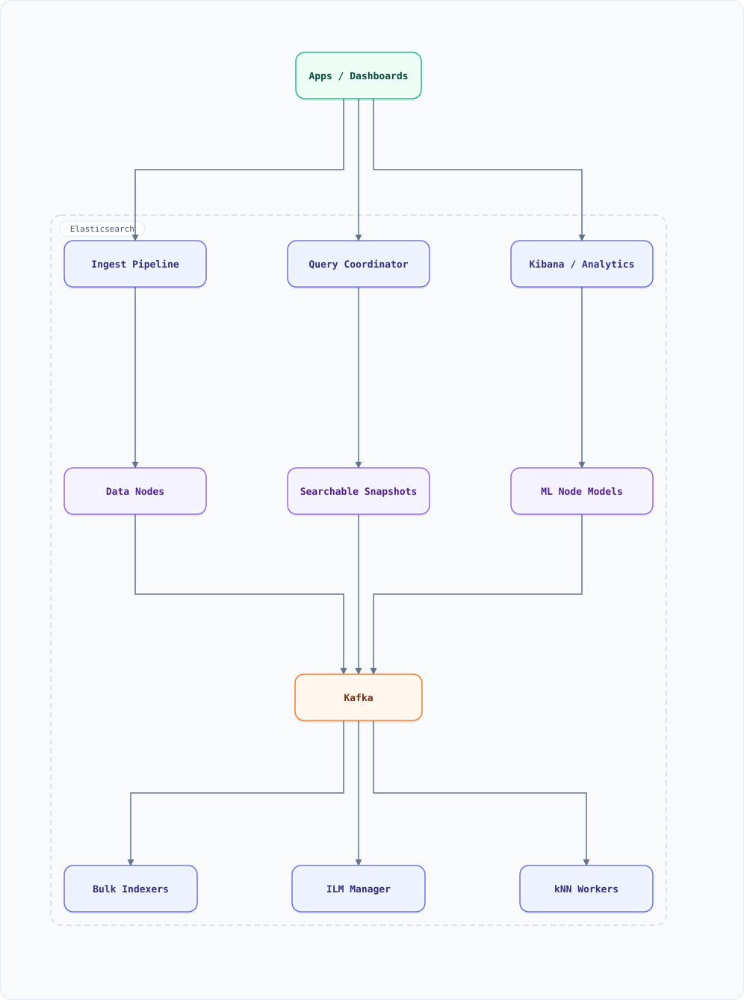

<div align="center">

# Elasticsearch — Features Guide with Basic Examples

</div>

A quick-reference catalog of Elasticsearch features used in search-heavy backends: inverted indexes & analyzers, mappings, CRUD & bulk indexing, queries (full-text vs term), aggregations, scoring (BM25), completion & fuzzy search, sharding & replication, near-real-time refresh, ILM (index lifecycle), and security — each with a small, concrete example.

**Elasticsearch in one line:** a distributed **search and analytics engine** built on Apache Lucene — you index JSON documents, it maintains an inverted index, and queries scatter across shards with sub-second latency. It is the default answer to "make this searchable" between Postgres FTS and a bespoke postings engine.
> **Latest stable (Sep 2026): Elasticsearch 9.5** (9.5.4, Sep 2026) — the "context and retrieval layer for AI" release line: better vector/BM25 hybrid retrieval, ES|QL everywhere. 8.x is in security-only maintenance.


### Search engine at a glance



**Interactive diagram:** [diagrams/features/elasticsearch-at-a-glance.architecture.html](diagrams/features/elasticsearch-at-a-glance.architecture.html) — pan/zoom, search, dark/light theme, PNG/SVG export.


*Solid = data/query flow. Shards & replicas §9, analyzers §2, queries §5, aggregations §6, ILM §10.

---

## Table of Contents

<details>
<summary><b>📑 Jump to a section</b></summary>

1. [Core Concepts — Index, Shard, Document](#1-core-concepts--index-shard-document)
2. [Analysis — Text to Terms](#2-analysis--text-to-terms)
3. [Mappings & Field Types](#3-mappings--field-types)
4. [Indexing — Single & Bulk](#4-indexing--single--bulk)
5. [Queries — Full-Text, Term, Compound](#5-queries--full-text-term-compound)
6. [Aggregations — Analytics Inside the Engine](#6-aggregations--analytics-inside-the-engine)
7. [Scoring — BM25 & Relevance Tuning](#7-scoring--bm25--relevance-tuning)
8. [Search UX — Fuzzy, Completion, Highlighting](#8-search-ux--fuzzy-completion-highlighting)
9. [Sharding, Replication & Routing](#9-sharding-replication--routing)
10. [Near-Real-Time & Index Lifecycle Management](#10-near-real-time--index-lifecycle-management)
11. [Geo Search](#11-geo-search)
12. [Security](#12-security)
13. [Elasticsearch in This Repo's Designs](#13-elasticsearch-in-this-repos-designs)
14. [Key Takeaways](#14-key-takeaways)
15. [Hidden Tips & Tricks](#15-hidden-tips--tricks)
16. [Do's & Don'ts](#16-dos--donts)

</details>

---

## 1. Core Concepts — Index, Shard, Document

| Concept | What it is | Analogy |
| :--- | :--- | :--- |
| **Index** | a logical dataset (like a table) | table |
| **Shard** | a physical Lucene instance; index = N shards | partition |
| **Replica** | a shard copy for HA + read scaling | replica |
| **Document** | a JSON record with `_id` | row |
| **Node/Cluster** | servers holding shards; coordinated automatically | instance/DB |

```bash
PUT /products
{ "settings": { "number_of_shards": 3, "number_of_replicas": 1 } }
```

**Sizing rule of thumb:** shard = 10–50GB; shard count fixed at creation (re-sharding = reindex). Over-sharding kills (per-shard overhead), under-sharding caps throughput.

---

## 2. Analysis — Text to Terms

The analyzer converts text into indexed **terms**: character filters → tokenizer → token filters. This is where search quality is born.

```bash
PUT /products
{ "settings": { "analysis": {
    "analyzer": {
      "my_english": {
        "type": "custom",
        "tokenizer": "standard",
        "filter": ["lowercase", "asciifolding", "my_stop", "my_stem"]
      }
    },
    "filter": {
      "my_stop": { "type": "stop", "stopwords": ["the", "a", "is"] },
      "my_stem": { "type": "stemmer", "language": "english" }
    }
}}}
```

```bash
POST /products/_analyze
{ "analyzer": "my_english", "text": "Running Shoes are QUICK!" }
→ [ "running", "shoe", "quick" ]       # stemmed, lowercased, stopwords dropped
```

Variants that matter: `standard` (default), `keyword` (no tokenization — exact), `ngram`/`edge_ngram` (autocomplete — see `system-design-search-autocomplete.md`), `language` analyzers per locale.

---

## 3. Mappings & Field Types

```bash
PUT /products/_mapping
{ "properties": {
    "sku":     { "type": "keyword" },            # exact match, aggregations, sorting
    "title":   { "type": "text", "analyzer": "my_english",
                 "fields": { "raw": { "type": "keyword" } } },  # multi-field
    "price":   { "type": "scaled_float", "scaling_factor": 100 },
    "tags":    { "type": "keyword" },
    "stock":   { "type": "integer" },
    "attrs":   { "type": "flattened" },          # arbitrary sub-fields, one field
    "vector":  { "type": "dense_vector", "dims": 128, "index": true,
                 "similarity": "cosine" },       # kNN search
    "location":{ "type": "geo_point" }
}}
```

| Type | Use |
| :--- | :--- |
| `text` vs `keyword` | analyzed full-text vs exact token |
| `flattened` | unbounded JSON (audit logs) without mapping explosion |
| `dense_vector` | semantic search / RAG retrieval (kNN HNSW) |
| `nested` | arrays of objects queried independently |
| `date` + ranges | time-series and windowed queries |

---

## 4. Indexing — Single & Bulk

```bash
PUT /products/_doc/p1
{ "sku": "A1", "title": "Running Shoes", "price": 89.99 }

POST /_bulk
{ "index": { "_index": "products", "_id": "p2" } }
{ "sku": "B2", "title": "Winter Jacket", "price": 129.00 }
{ "update": { "_index": "products", "_id": "p1" } }
{ "doc": { "price": 79.99 } }
{ "delete": { "_index": "products", "_id": "p0" } }
```

**Bulk is the only way at scale:** 5–15MB batches, partial failures are per-item (inspect `errors`), idempotent by `_id` (retries safe — re-index overwrites). Retry with backoff on `429` (see `system-design-concepts.md` §39).

---

## 5. Queries — Full-Text, Term, Compound

The #1 interview-confusion point: **`match` analyzes the query text; `term` does not.**

```bash
GET /products/_search
{ "query": {
    "bool": {
      "must":     [{ "match": { "title": "running shoes" } }],      # analyzed, scored
      "filter":   [{ "term": { "tags": "sale" } },
                   { "range": { "price": { "lte": 100 } } }],       # no scoring, cacheable
      "should":   [{ "term": { "brand.raw": "Nike" } }],            # relevance boost
      "must_not": [{ "term": { "status": "deleted" } }]
}}}
```

| Clause | Behavior |
| :--- | :--- |
| `match` | analyzed → OR/AND of terms, relevance-scored |
| `term` | exact token lookup — for `keyword`, ids, status |
| `filter` | inside `bool`: no score, cached, always the perf move |
| `match_phrase` | positional match ("shoes running" ≠ "running shoes") |
| `multi_match` | one query across several fields with boosts |

---

## 6. Aggregations — Analytics Inside the Engine

```bash
GET /products/_search?size=0
{ "aggs": {
    "by_brand":  { "terms": { "field": "brand.raw", "size": 10 } },
    "avg_price": { "avg": { "field": "price" } },
    "hist":      { "histogram": { "field": "price", "interval": 25 } },
    "per_day":   { "date_histogram": { "field": "created_at", "calendar_interval": "day" },
                   "aggs": { "revenue": { "sum": { "field": "price" } } } },
    "price_stats": { "percentiles": { "field": "price", "percents": [50, 95, 99] } }
}}
```

Nesting is the power move (terms → sub-aggs = group-bys). Approximate aggregations (`terms` on huge cardinalities, `cardinality` = HyperLogLog+, `percentiles` = TDigest) trade exactness for bounded memory — same sketches as `system-design-concepts.md` Part II.

---

## 7. Scoring — BM25 & Relevance Tuning

Default similarity is **BM25**: `score = IDF × tf·(k₁+1) / (tf + k₁·(1 − b + b·docLen/avgDocLen))` — saturation (tf diminishing returns) and length normalization built in.

```bash
GET /products/_search
{ "query": { "function_score": {
    "query": { "match": { "title": "running shoes" } },
    "functions": [
      { "gauss": { "created_at": { "origin": "now", "scale": "30d" } }, "weight": 2 },  # freshness decay
      { "field_value_factor": { "field": "popularity", "modifier": "log1p", "factor": 1.5 } }
    ],
    "score_mode": "sum", "boost_mode": "multiply"
}}}
```

Tuning moves: `boost` per field, freshness/popularity `function_score`, tie-break by explicit sort. At web scale this is the "cheap first stage" before ML re-ranking — exactly the two-stage design in `system-design-search-engine.md` and `system-design-recommendation-system.md`.

---

## 8. Search UX — Fuzzy, Completion, Highlighting

```bash
# 1) Type-ahead: edge_ngram on an index-time analyzer (scales; unlike match_phrase_prefix)
PUT /suggest
{ "mappings": { "properties": {
    "name": { "type": "text",
              "analyzer": "edge_ngram_analyzer",
              "search_analyzer": "standard" } }}}
GET /suggest/_search
{ "query": { "match": { "name": "run" } } }

# 2) Fuzzy (typo tolerance) — edit-distance on terms
GET /products/_search
{ "query": { "match": { "title": { "query": "runing shooes", "fuzziness": "AUTO" } } } }

# 3) Highlighting for snippets
GET /products/_search
{ "query": { "match": { "title": "running" } },
  "highlight": { "fields": { "title": { "fragment_size": 80 } } } }
```

---

## 9. Sharding, Replication & Routing

A search request scatters to all shards of the index, each returns top-N, the coordinator merges global top-N — the same scatter-gather math as `system-design-search-engine.md`.

```bash
# Custom routing: all docs of a tenant land on one shard (faster, but hot-key risk)
PUT /orders/_doc/o1?routing=tenant_42
{ ... }
GET /orders/_search?routing=tenant_42
{ "query": { "term": { "tenant_id": "tenant_42" } } }
```

**Consistency model:** near-real-time (§10) + async replication means replicas *can* briefly lag — reads-your-writes need `?refresh=wait_for` or versioned reads. Total data ≈ shards × (1 + replicas); replicas consume the same storage as primaries.

---

## 10. Near-Real-Time & Index Lifecycle Management

Writes go to an in-memory buffer → **refresh** (default 1s) makes them searchable as a new immutable Lucene segment → **merge** compacts segments → **translog** makes refresh loss survivable. This is the LSM/segment architecture of `system-design-concepts.md` §32 applied to search.

```bash
PUT /logs-2026.09.20
{ "settings": { "refresh_interval": "30s",   # heavy ingest: relax NRT
                "number_of_shards": 3 } }

# ILM: hot → warm → cold → delete, automatically
PUT /_ilm/policy/logs_policy
{ "policy": { "phases": {
    "hot":  { "actions": { "rollover": { "max_size": "50gb", "max_age": "1d" } } },
    "warm": { "min_age": "7d",  "actions": { "forcemerge": { "max_num_segments": 1 },
                                             "shrink": { "number_of_shards": 1 } } },
    "cold": { "min_age": "30d", "actions": { "searchable_snapshot": { "snapshot_repository": "s3" } } },
    "delete": { "min_age": "90d", "actions": { "delete": {} } }
}}}
```

---

## 11. Geo Search

```bash
PUT /places/_doc/r1
{ "name": "Cafe", "location": { "lat": 12.97, "lon": 77.59 } }

GET /places/_search
{ "query": {
    "bool": { "must": { "match": { "name": "cafe" } },
              "filter": { "geo_distance": { "distance": "2km",
                                            "location": { "lat": 12.96, "lon": 77.60 } } } }
}}
```

Uses the same geohash-cell foundations as `system-design-proximity-service.md` and `system-design-uber.md`; for "find nearest K ranked by distance" prefer `sort` by `_geo_distance` with a bounding-box pre-filter.

---

## 12. Security

| Layer | Feature |
| :--- | :--- |
| Auth | API keys, basic auth, OIDC/SAML/LDAP |
| Authorization | role-based; **document-level** and **field-level** security |
| Network | TLS on transport + HTTP layers |
| At rest | encrypted nodes, snapshot encryption (S3/SSE) |
| Audit | audit logging of auth failures & data access |

```bash
PUT /_security/role/analyst_readonly
{ "indices": [{ "names": ["orders-*"], "privileges": ["read"],
                "field_security": { "grant": ["order_id", "status", "total"], "except": ["customer_email"] } }] }
```

---

## 13. Elasticsearch in This Repo's Designs

| Design | Why Elasticsearch fits |
| :--- | :--- |
| `system-design-search-engine.md` | the ES tier until ~1B docs; beyond that custom postings |
| `system-design-search-autocomplete.md` | edge_ngram analyzers + completion suggesters |
| `system-design-reddit.md` | post/comment full-text search tier |
| `system-design-online-judge.md` | plagiarism search (code similarity documents) |
| `system-design-ecommerce.md` | faceted catalog search (terms aggs = facets) |
| `system-design-alerting.md` | log storage tier alongside the TSDB |

---

## 14. Key Takeaways

1. **`text` vs `keyword`** decides query correctness; **`filter` context** decides performance
2. Analyzer choice is search quality — ngrams for autocomplete, stemming + stopwords for relevance
3. Bulk-index everything; idempotency by `_id` makes retries free
4. Segments are immutable: refresh (1s NRT) → merge → translog is LSM-in-disguise
5. ILM automates the hot/warm/cold tiering that cost-estimation sections assume
6. kNN + `dense_vector` make ES a legit RAG retrieval tier (see `agentic-ai-features.md`)
7. Related guides: `postgresql-features.md` (full-text alternative below 1B docs), `kafka-features.md` (ingest backbone), `cloud.md` (managed offerings)

## 15. Hidden Tips & Tricks

**1. `filter` context is the free lunch.** Filters skip scoring **and** are cached — `bool: { must: [score this], filter: [everything else] }` is routinely 10× faster than putting the same clauses in `must`.

**2. Deep pagination is a trap.** `from: 10000` asks *every* shard for 10,010 docs to sort globally — ES refuses past 10K for a reason. UI pagination: `search_after` + PIT; crawlers: scroll.

**3. `term` on a `text` field almost never matches.** `text` is analyzed (lowercased, split); `term` compares raw. Query the raw value via the `field.keyword` sub-field — or map the field as `keyword` if you never analyze it.

**4. Indexed ≠ searchable.** A doc is invisible for ~1 s until the next refresh (near-real-time). `?refresh=wait_for` is for tests; design production flows for eventual visibility instead.

**5. Shard count is chosen at index creation.** Over-sharding (tiny 1 GB indices × 50 shards) drowns the cluster in per-shard overhead; under-sharding caps parallelism. Target ~10–50 GB per shard and use ILM to roll time-series indices.

**6. Deletes don't free space.** Deleted docs are tombstones until segment merge — disk keeps climbing during heavy delete churn. Watch merge pressure; force-merge read-only indices.

## 16. Do's & Don'ts

| ✅ Do | ❌ Don't |
| :--- | :--- |
| Put non-scoring clauses in `filter` context (cached, fast) | Don't score what you only need to match |
| Use `search_after` + PIT for deep pagination | Don't `from: 10000` — every shard sorts 10,010 docs for you |
| Query `field.keyword` (or map `keyword`) for exact matches | Don't `term`-query analyzed `text` fields and expect hits |
| Size shards ~10–50 GB with ILM rolling time-series indices | Don't create 50 shards for a 1 GB index (or 1 shard for 1 TB) |
| Model aliases + zero-downtime reindex flows | Don't reindex in place and hold your breath — mappings are near-immutable |
