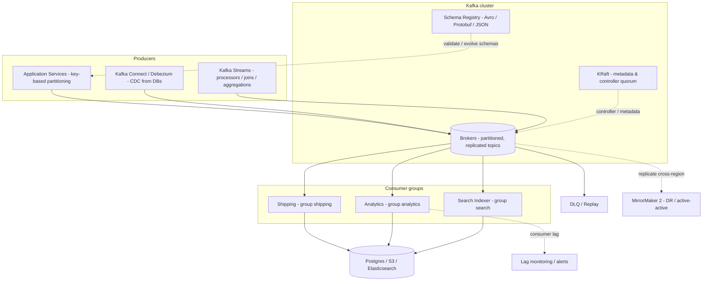

# Apache Kafka — Features Guide with Basic Examples

A quick-reference catalog of Apache Kafka features used in event-driven backends: topics, partitions, offsets, ordering, producers, consumer groups, replication, retention & compaction, delivery semantics, exactly-once, Kafka Connect, Kafka Streams, Schema Registry, and the classic use cases (event sourcing, CDC, log aggregation, outbox) — each with a small, concrete example.

**Kafka in one line:** a distributed, partitioned, replicated **commit log** — you publish immutable events to topics; consumers read them in order, at their own pace, and can replay from any point in history. It is the backbone of event-driven architectures.

### Event streaming at a glance



*Solid = event flow, dashed = control/infrastructure. Partitioning & ordering §2–§4, consumer groups & lag §5, replication/ISR & KRaft §8/§15, Schema Registry §12, DLQ §13, MirrorMaker 2 §15.

---

## Table of Contents

1. [Core Concepts — Topic, Partition, Offset](#1-core-concepts--topic-partition-offset)
2. [Topics & Partitions (CLI)](#2-topics--partitions-cli)
3. [Producers — Publishing Events](#3-producers--publishing-events)
4. [Partitioning & Key-Based Ordering](#4-partitioning--key-based-ordering)
5. [Consumers & Consumer Groups](#5-consumers--consumer-groups)
6. [Delivery Semantics (at-most / at-least / exactly-once)](#6-delivery-semantics-at-most--at-least--exactly-once)
7. [Exactly-Once Semantics with Transactions](#7-exactly-once-semantics-with-transactions)
8. [Replication, ISR & Durability](#8-replication-isr--durability)
9. [Retention & Log Compaction](#9-retention--log-compaction)
10. [Kafka Connect (Source/Sink) & CDC](#10-kafka-connect-sourcesink--cdc)
11. [Kafka Streams — Stream Processing](#11-kafka-streams--stream-processing)
12. [Schema Registry & Avro](#12-schema-registry--avro)
13. [Dead Letter Queues & Failure Handling](#13-dead-letter-queues--failure-handling)
14. [Kafka as the Backbone — Classic Use Cases](#14-kafka-as-the-backbone--classic-use-cases)
15. [Operational Features](#15-operational-features)
16. [Key Takeaways](#16-key-takeaways)

---

## 1. Core Concepts — Topic, Partition, Offset

```
                 producer  producer  producer
                    |         |         |
                    v         v         v
   topic "orders" ──┴─────────┴─────────┴──►  (a named, immutable event stream)

   partition 0: [o1] [o4] [o7] ...        offsets grow monotonically per partition
   partition 1: [o2] [o5] [o8] ...
   partition 2: [o3] [o6] [o9] ...

                    |    |    |
                    v    v    v
              consumer group "shipping"
              (each partition is read by ONE consumer in the group)
```

| Term | Meaning |
| ---- | ------- |
| **Topic** | Named stream of events (like a table in a DB). |
| **Partition** | The unit of parallelism & ordering — an append-only log. |
| **Offset** | Per-partition monotonically increasing position of a record. |
| **Record** | `key` + `value` (+ headers + timestamp). Key is optional; both are bytes. |
| **Broker** | A Kafka server. A topic's partitions are spread across brokers. |
| **Consumer group** | Set of consumers that share a topic's load; each partition → exactly one member. |
| **Leader / follower** | Partition copies; one leader serves reads/writes, followers replicate. |

Key mental model: **Kafka never deletes a consumed message by default** — retention is time/size based, and consumers *re-read* freely (new consumer can start from the beginning). It is a *log*, not a queue.

**Five core APIs** (Java/Scala) sit on top of the brokers: **Admin** (manage topics & brokers), **Producer**, **Consumer**, **Kafka Streams** (§11) and **Kafka Connect** (§10). The CLI tools used below are thin wrappers over the same Admin/Producer/Consumer APIs.

---

## 2. Topics & Partitions (CLI)

```bash
# Create a topic: 3 partitions, replicated 3x across brokers
kafka-topics.sh --bootstrap-server localhost:9092 \
  --create --topic orders --partitions 3 --replication-factor 3

# Inspect
kafka-topics.sh --bootstrap-server localhost:9092 --describe --topic orders
#   Topic: orders   PartitionCount: 3   ReplicationFactor: 3
#   Partition 0: Leader: 1  Replicas: 1,2,3  Isr: 1,2,3
#   Partition 1: Leader: 2  Replicas: 2,3,1  Isr: 2,3,1
#   Partition 2: Leader: 3  Replicas: 3,1,2  Isr: 3,1,2

# Produce a few messages from the CLI
kafka-console-producer.sh --bootstrap-server localhost:9092 --topic orders
> {"orderId": 1001, "amount": 99.5}
> {"orderId": 1002, "amount": 12.0}

# Consume from the very beginning (replay!)
kafka-console-consumer.sh --bootstrap-server localhost:9092 \
  --topic orders --from-beginning

# See where a consumer group is (lag = messages behind)
kafka-consumer-groups.sh --bootstrap-server localhost:9092 \
  --group shipping --describe
#   TOPIC  PARTITION  CURRENT-OFFSET  LOG-END-OFFSET  LAG
#   orders 0          12              15              3
```

---

## 3. Producers — Publishing Events

Producers choose a partition per record and append. Tuning knobs control durability vs latency vs throughput:

| Producer setting | Meaning |
| ---------------- | ------- |
| `acks=0` | fire and forget — fastest, can lose data |
| `acks=1` (default) | leader wrote to its log |
| `acks=all` | leader + all in-sync replicas wrote — no loss on leader crash |
| `enable.idempotence=true` | prevents duplicate records from producer retries |
| `retries` | retry transient broker errors |
| `linger.ms` / `batch.size` | hold records to send bigger batches (throughput ↑ latency ↑) |
| `compression.type=lz4/zstd` | shrink network + storage |
| `key` | same key → same partition → ordered per key |

```java
// Producer (Java) — durable + idempotent
Properties props = new Properties();
props.put("bootstrap.servers", "localhost:9092");
props.put("key.serializer",   "org.apache.kafka.common.serialization.StringSerializer");
props.put("value.serializer", "org.apache.kafka.common.serialization.StringSerializer");
props.put("acks", "all");
props.put("enable.idempotence", "true");

KafkaProducer<String, String> producer = new KafkaProducer<>(props);

producer.send(new ProducerRecord<>("orders", "user-42", "{\"amount\": 99.5}"),
    (metadata, exception) -> {
        if (exception != null) { /* retry / DLQ */ }
        else System.out.println("offset " + metadata.offset());
    });
producer.flush();
```

```js
// Same idea in Node.js (kafkajs) — pseudo-code for brevity
const producer = kafka.producer();
await producer.connect();
await producer.send({
  topic: 'orders',
  messages: [{ key: 'user-42', value: '{"amount": 99.5}' }],
});
```

---

## 4. Partitioning & Key-Based Ordering

- No key → records are round-robined across partitions (**no cross-partition order**).
- With a key → `hash(key) % numPartitions` sends every record with that key to the *same* partition, so **per-key order is guaranteed** as long as partitions never change.
- **Ordering guarantee:** ordered *within* a partition, never across partitions. Global order needs a 1-partition topic (kills parallelism — only for rare cases like a global changelog).
- Default partitioner: **murmur2 hash of the key** (`hash % numPartitions`) — override it for custom routing (e.g. sticky by region, size balance).

```bash
# Keyed messages land on the same partition every time
kafka-console-producer.sh --topic orders --property parse.key=true \
  --property key.separator=:
> user-42:{"amount": 99.5}
> user-42:{"amount": 12.0}      # same partition as above → ordered
```

Common partition keys: `user_id` (per-user event ordering), `order_id` (per-order state machine), `tenant_id` (tenant isolation). Be careful with **hot keys** — one key = one partition, so a single huge customer can skew one partition.

---

## 5. Consumers & Consumer Groups

A **consumer group** splits a topic's partitions among its members: partition 0 → one member only, etc. This gives both **scalability** (add consumers → more parallelism) and **reliability** (member dies → partitions rebalance to survivors).

- Parallelism ceiling = number of partitions (5 partitions, 10 consumers → 5 idle).
- Offset management: auto-commit (default, can lose/duplicate) vs manual commit (`enable.auto.commit=false` + `commitSync` after processing).

```java
// Consumer (Java) — manual commit after processing (at-least-once safe)
Properties props = new Properties();
props.put("bootstrap.servers", "localhost:9092");
props.put("group.id", "shipping");
props.put("enable.auto.commit", "false");
props.put("key.deserializer",   "...StringDeserializer");
props.put("value.deserializer", "...StringDeserializer");

try (KafkaConsumer<String, String> consumer = new KafkaConsumer<>(props)) {
    consumer.subscribe(List.of("orders"));
    while (true) {
        ConsumerRecords<String, String> records = consumer.poll(Duration.ofMillis(100));
        for (ConsumerRecord<String, String> r : records) {
            process(r.value());              // process...
        }
        consumer.commitSync();               // ...THEN commit the offset
    }
}
```

**Rebalancing** happens when a member joins/leaves — while it runs, partitions move between consumers. Modern Kafka supports **cooperative rebalancing** (incremental, less stop-the-world) and **static group membership** (instance IDs survive restarts so no rebalance at all on redeploy).

Consumer **lag** (see CLI in §2) is the #1 operational metric: partitions growing without the group catching up means downstream is too slow.

---

## 6. Delivery Semantics (at-most / at-least / exactly-once)

| Semantics | What it means | How to get it |
| --------- | ------------- | ------------- |
| **At-most-once** | A record may be lost, never duplicated | auto-commit *before* processing; `acks=0` producer |
| **At-least-once** | A record is never lost, may be processed twice | commit *after* processing (the Java example above). **Default & most common.** |
| **Exactly-once** | Processed once, end-to-end effect | idempotent producer + transactions (§7) + idempotent consumer (make the *effect* idempotent) |

The consumer side decides duplicates: crash between `process()` and `commitSync()` → on restart the same record is redelivered. So even with `enable.idempotence=true` on the producer, downstream **effects** must be idempotent (e.g. upsert by event id, dedupe table, or store offsets + result in one transaction).

---

## 7. Exactly-Once Semantics with Transactions

Kafka transactions let a producer **atomically** write to multiple partitions/topics and commit consumer offsets **in the same transaction** — the classic "read from topic A, process, write to topic B" pipeline becomes all-or-nothing.

```java
props.put("transactional.id", "shipping-app-1");   // must be unique & stable
KafkaProducer<String, String> txProducer = new KafkaProducer<>(props);
txProducer.initTransactions();

// atomic unit of work
txProducer.beginTransaction();
txProducer.send(new ProducerRecord<>("orders-processed", key, value));
txProducer.sendOffsetsToTransaction(offsets, consumer.groupMetadata());  // commit consumer offset atomically!
txProducer.commitTransaction();      // on failure: abortTransaction()
```

Consumers opt in to only seeing committed data with `isolation.level=read_committed`. End-to-end exactly-once across *external* systems (your DB, an API) still requires idempotency on your side — Kafka only makes its own log + offsets atomic.

---

## 8. Replication, ISR & Durability

Each partition has replicas across brokers; one is the **leader** (all reads/writes), the rest are **followers** replicating from it. The **ISR** (in-sync replicas) set = replicas caught up with the leader.

- `acks=all` + `min.insync.replicas=2` → a write is committed only when the leader **and** at least one follower acked it. If too few replicas are healthy, writes are rejected (fail-stop, no silent loss).
- Broker crash → a follower in the ISR is elected leader; committed data is never lost.
- **Unclean leader election** (allowing a lagging replica to become leader) trades durability for availability — off by default for good reason.

```bash
# Topic-level durability settings
kafka-topics.sh --bootstrap-server localhost:9092 \
  --alter --topic orders --config min.insync.replicas=2
# Producer pairs this with: acks=all
```

Replication factor 3 with `min.insync.replicas=2` survives a single-broker loss without losing a single committed record.

---

## 9. Retention & Log Compaction

Two ways Kafka "deletes" data:

**1. Time/size retention** (default) — delete records older than `retention.ms` or beyond `retention.bytes`. Perfect for event streams (keep 7 days, replay window).

**2. Log compaction** (`cleanup.policy=compact`) — keep only the *latest value per key*. Kafka remembers the state of each entity, not its history. Compaction keeps the log bounded and lets a new consumer rebuild current state by reading from the start.

```bash
# A "state" topic: latest value per key wins (like a changelog / KTable source)
kafka-topics.sh --bootstrap-server localhost:9092 \
  --create --topic user-profiles --partitions 6 \
  --config cleanup.policy=compact --config delete.retention.ms=100

# Tombstone: send a record with the key and a NULL value → deletes the key entirely
# (after delete.retention.ms, the key disappears)
```

Compacted topics underpin Kafka Streams' `KTable` state and event-sourcing snapshots: replay the whole compacted log and you reconstruct the current state of the world.

Kafka's performance stays ~constant as retained data grows (mostly sequential I/O), so keeping days or weeks of events is normal — not a last resort.

---

## 10. Kafka Connect (Source/Sink) & CDC

**Kafka Connect** is the built-in integration framework: prebuilt connectors move data in (source) and out (sink) without writing code.

- **Source connectors:** PostgreSQL (Debezium CDC), JDBC, S3, MongoDB, etc. → Kafka.
- **Sink connectors:** Kafka → Elasticsearch, S3/iceberg, Redis, etc.

**CDC (Change Data Capture)** is the flagship pattern: Debezium reads Postgres's logical replication log and emits every insert/update/delete as an event — so other services react to DB changes without the app writing to both DB and Kafka (see the Outbox pattern in `system-design-concepts.md`).

```json
// Debezium PostgreSQL source connector config (minimal)
{
  "name": "orders-connector",
  "config": {
    "connector.class": "io.debezium.connector.postgresql.PostgresConnector",
    "database.hostname": "postgres",
    "database.dbname": "app",
    "database.user": "debezium",
    "database.plugin.name": "pgoutput",
    "table.include.list": "public.orders",
    "topic.prefix": "cdc",
    "key.converter": "org.apache.kafka.connect.json.JsonConverter",
    "value.converter": "org.apache.kafka.connect.json.JsonConverter"
  }
}
// → every committed row change lands on topic "cdc.public.orders"
```

Connect also handles **exactly-once-ish** semantics via its own offsets and is operated with REST APIs (`curl localhost:8083/connectors`).

---

## 11. Kafka Streams — Stream Processing

**Kafka Streams** is a Java/Scala library for stream processing *inside* your app: filtering, joining, windowing, aggregating — with state (RocksDB) and exactly-once, no separate cluster needed.

```java
// Word count over a stream of sentences — the hello-world of stream processing
KStream<String, String> text = builder.stream("sentences", Consumed.with(Serdes.String(), Serdes.String()));

text.flatMapValues(line -> Arrays.asList(line.toLowerCase().split("\\W+")))
    .groupBy((key, word) -> word)
    .count(Materialized.<String, Long, KeyValueStore<Bytes, byte[]>>as("counts"))
    .toStream()
    .to("word-counts", Produced.with(Serdes.String(), Serdes.Long()));

KafkaStreams streams = new KafkaStreams(builder.build(), props);
streams.start();
```

Concepts worth knowing: `KStream` (event stream) vs `KTable` (changelog/state, backed by a compacted topic), windowing (`TumblingWindow`, `SlidingWindow`, session windows), interactive queries (read the state store directly), and exactly-once processing.

---

## 12. Schema Registry & Avro

Kafka messages are bytes — producers and consumers must agree on the format, and schemas **evolve**. The **Schema Registry** stores schemas by id, and Avro/Protobuf/JSON-schema serializers embed the id in each record so consumers always decode correctly.

- Producers register a schema → get an id → serialize with it.
- Consumers read the id → fetch the schema → deserialize.
- Compatibility rules (`BACKWARD`, `FORWARD`, `FULL`) control what changes are allowed without breaking old consumers.

```avro
// order.avsc — registered in the schema registry
{
  "type": "record",
  "name": "Order",
  "namespace": "com.example",
  "fields": [
    { "name": "orderId",  "type": "long" },
    { "name": "amount",   "type": "double" },
    { "name": "currency", "type": "string", "default": "USD" }  // default ⇒ backward compatible
  ]
}
```

Avro's binary format is compact; adding a field *with a default* stays backward-compatible — this is how teams evolve schemas across hundreds of services without coordinated deploys.

---

## 13. Dead Letter Queues & Failure Handling

When a consumer cannot process a record (poison message, schema mismatch, bug), retrying forever stalls the partition. Standard practice: after N failed attempts, park the record on a **dead letter topic** and keep going.

```text
orders ──► shipping-consumer
              │ retry x3 (with backoff)
              ▼ fail
        orders-dlq  ──► alert + manual/automated reprocessing later
```

```bash
# Manual inspection / replay of poison messages
kafka-console-consumer.sh --bootstrap-server localhost:9092 \
  --topic orders-dlq --from-beginning
```

DLQ topics themselves follow normal retention rules, so you can replay them after a fix. Every serious Kafka deployment has one (see `system-design-concepts.md` for the general pattern).

---

## 14. Kafka as the Backbone — Classic Use Cases

| Use case | What Kafka does | Example |
| -------- | --------------- | ------- |
| **Event sourcing** | Append-only store of facts; state = replay | Bank account: `MoneyDeposited`, `MoneyWithdrawn` events |
| **CDC** | Mirror DB changes to the rest of the world | Debezium → search index, cache, analytics |
| **Outbox pattern** | Reliably publish what your DB committed | app writes event row + entity in one tx; relay publishes to Kafka |
| **Log aggregation** | Central pipeline for app logs/metrics | all services → `app-logs` topic → S3/Elasticsearch |
| **Stream processing** | Real-time joins/aggregates | fraud scoring, inventory counts, live dashboards |
| **Decoupling services** | Async integration without point-to-point APIs | order service → email/shipping/analytics consumers |
| **Replay / backfill** | Reprocess history for new logic | consumer starts at offset 0 with a new algorithm |

A representative event-sourced flow:

```text
OrderService ──(writes order + outbox row in one DB tx)──► PostgreSQL
OutboxRelay ──reads committed outbox rows──► Kafka topic "orders"
  ├─► ShippingService (group "shipping")
  ├─► AnalyticsService (group "analytics")     ← each group reads ALL orders
  └─► SearchIndexer (group "search")
```

Different consumer groups = different views of the same stream; the same group = competing workers.

---

## 15. Operational Features

| Feature | Purpose | Notes |
| ------- | ------- | ----- |
| **KRaft (ZooKeeper removal)** | Internal metadata quorum | Modern Kafka (3.3+) runs without ZooKeeper |
| **Quotas** | Throttle producers/consumers per client | `--alter --config producer_byte_rate=...` |
| **Rack awareness** | Replicas spread across racks/AZs | replica placement avoids correlated failure |
| **MirrorMaker 2** | Cross-cluster / cross-region replication | disaster recovery, active-active |
| **`kafka-reassign-partitions`** | Move partitions between brokers | rebalancing, scaling, decommission |
| **Consumer lag monitoring** | Health of the pipeline | Burrow / Prometheus exporters |
| **Message size** | `message.max.bytes` (default 1 MB) | raise for large payloads; prefer storing big blobs elsewhere + reference |
| **Security (TLS + SASL/ACLs)** | Encrypt, authenticate, authorize clients | SASL_SSL, SCRAM/mTLS, per-topic ACLs |
| **Admin API** | Manage topics/brokers programmatically | create/alter/describe/config from client code |
| **Tiered storage** | Offload old log segments to object storage | near-unlimited retention; hot tail stays on brokers |

### Security & access control

Kafka secures the wire with TLS and authenticates clients via SASL (SCRAM-SHA-256, PLAIN, OAUTHBEARER) or mutual TLS; fine-grained ACLs then authorize access per topic/group:

```bash
kafka-acls.sh --bootstrap-server localhost:9092 --add \
  --allow-principal User:shipping --operation read \
  --topic orders --group shipping
# Client config (properties file) for SASL_SSL:
#   security.protocol=SASL_SSL
#   sasl.mechanism=SCRAM-SHA-256
#   sasl.jaas.config=org.apache.kafka.common.security.scram.ScramLoginModule required \
#     username="app" password="secret";
```

---

## 16. Key Takeaways

1. **Kafka is a durable, replayable log** — that's what makes it different from RabbitMQ/Redis queues: consumers read at their own speed and can rewind to the beginning.
2. **Order is per-partition, parallelism is per-partition** — pick the partition key that matches the ordering you need (usually entity id); never expect global order.
3. **`acks=all` + `min.insync.replicas=2` + replication factor 3** is the durable default; idempotent producers remove retry duplicates.
4. **At-least-once is the default reality** — design downstream effects to be idempotent; reach for transactions only when you truly need atomic multi-topic writes.
5. **Consumer groups scale reads; lag is the health metric to watch.**
6. **Log compaction** turns an event stream into "latest state per key" — the trick behind KTables and event-sourcing snapshots.
7. **Connect + Schema Registry + DLQs** are what make Kafka production-grade: standard integrations, safe schema evolution, and a place for poison messages.

---

## Related System Design Documents

- [Notification System](system-design-notification-system.md)
- [Delayed Job Scheduler](system-design-delayed-job-scheduler.md)
- [Rate Limiter](system-design-rate-limiter.md)
- [PostgreSQL Features Guide](postgresql-features.md) — logical replication / CDC source
- [Redis Features Guide](redis-features.md) — the lighter-weight queue/cache alternative
- [System Design Concepts](system-design-concepts.md) — outbox, event sourcing, DLQ
