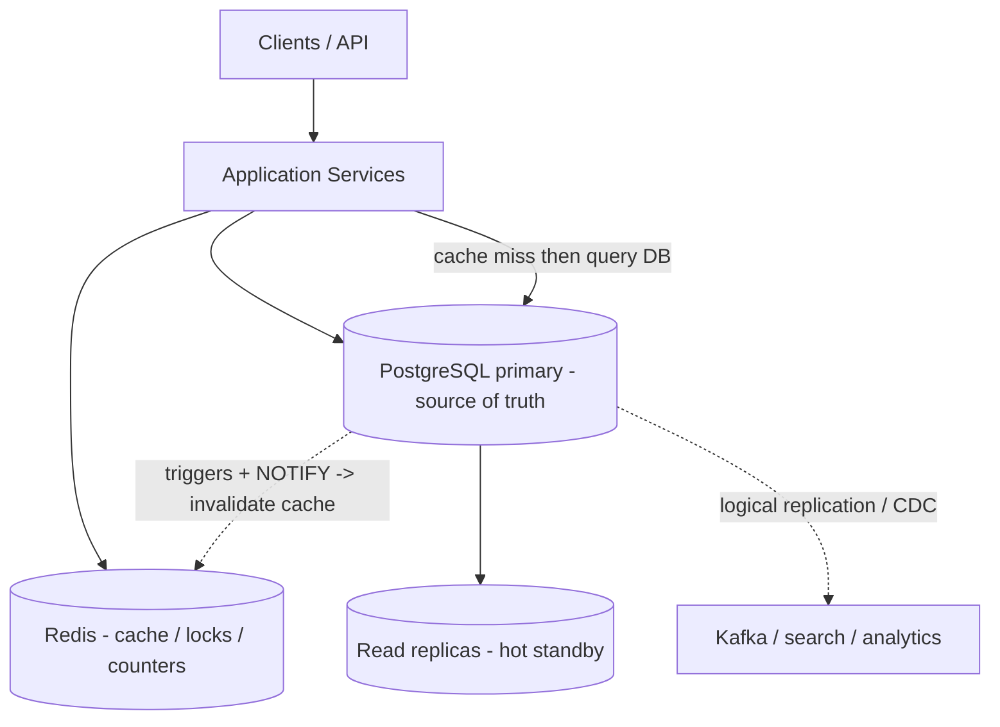

# PostgreSQL — Features Guide with Basic Examples

A quick-reference catalog of PostgreSQL features used in everyday backends: data types, constraints, indexes, triggers, `LISTEN`/`NOTIFY`, stored functions, CTEs, window functions, full-text search, JSONB, MVCC & transactions, locking, partitioning, replication, CDC, caching, and the extension ecosystem — each with a small, copy-paste-able example.

**PostgreSQL in one line:** an advanced open-source relational database that is fully ACID, uses MVCC for concurrency, speaks strong SQL, stores JSONB documents, does full-text search, supports triggers / pub-sub (`LISTEN`/`NOTIFY`) / stored procedures, scales with partitioning + streaming & logical replication, and grows via extensions (PostGIS, pgvector, pg_trgm, ...). In system design it is usually the *system of record*, often fronted by Redis as a cache.

### PostgreSQL in a typical stack



---

## Table of Contents

1. [Data Types](#1-data-types)
2. [Constraints & Integrity](#2-constraints--integrity)
3. [Indexes](#3-indexes)
4. [Triggers](#4-triggers)
5. [LISTEN / NOTIFY (Postgres as Pub/Sub)](#5-listen--notify-postgres-as-pubsub)
6. [Stored Functions & Procedures](#6-stored-functions--procedures)
7. [CTEs & Recursive CTEs](#7-ctes--recursive-ctes)
8. [Window Functions & Advanced Grouping](#8-window-functions--advanced-grouping)
9. [Full-Text Search](#9-full-text-search)
10. [JSONB — JSON as a First-Class Type](#10-jsonb--json-as-a-first-class-type)
11. [Upsert, RETURNING & Other SQL Productivity Features](#11-upsert-returning--other-sql-productivity-features)
12. [Transactions, MVCC & Isolation Levels](#12-transactions-mvcc--isolation-levels)
13. [Locking (Rows, Tables, Advisory)](#13-locking-rows-tables-advisory)
14. [Views & Materialized Views (Postgres as a Cache)](#14-views--materialized-views-postgres-as-a-cache)
15. [Declarative Table Partitioning](#15-declarative-table-partitioning)
16. [Replication & High Availability](#16-replication--high-availability)
17. [Logical Replication & Change Data Capture (CDC)](#17-logical-replication--change-data-capture-cdc)
18. [Caching Inside Postgres](#18-caching-inside-postgres)
19. [VACUUM, Bloat & Performance Tuning](#19-vacuum-bloat--performance-tuning)
20. [Extensions — the Superpowers](#20-extensions--the-superpowers)
21. [Row-Level Security & Access Control](#21-row-level-security--access-control)
22. [Foreign Data Wrappers (Cross-DB Queries)](#22-foreign-data-wrappers-cross-db-queries)
23. [Bulk Load & Data Movement](#23-bulk-load--data-movement)
24. [Key Takeaways](#24-key-takeaways)

---

## 1. Data Types

Postgres ships an unusually rich type system — including JSON, arrays, ranges, network types, and user-defined enums — which removes the need for separate stores in many cases.

| Category | Examples | Typical use |
| -------- | -------- | ----------- |
| Numeric | `INTEGER`, `BIGINT`, `NUMERIC(12,2)` | Exact money → `NUMERIC`, ids → `BIGINT` |
| Identity / Sequence | `GENERATED ALWAYS AS IDENTITY` | Auto-increment primary keys |
| Text | `TEXT`, `VARCHAR(n)`, `CITEXT` | `CITEXT` = case-insensitive text |
| Date / Time | `TIMESTAMPTZ`, `DATE`, `INTERVAL` | Always store UTC timestamps |
| UUID | `UUID` | Distributed-friendly keys (no central counter) |
| JSON | `JSONB` | Flexible / semi-structured documents |
| Array | `TEXT[]`, `INT[]` | Tags, lists stored inline |
| Range | `TSRANGE`, `INT4RANGE` | Booking windows, versioned validity |
| Enum | `CREATE TYPE ... AS ENUM` | Fixed vocabularies |
| Network | `INET`, `CIDR`, `MACADDR` | IP addresses (indexable, comparable) |
| Geometric | `POINT`, `POLYGON`, `PATH` | Simple geo without PostGIS |
| Binary | `BYTEA` | Raw blobs (prefer object storage for big files) |
| XML | `XML` | Legacy document exchange (JSONB is usually the better pick today) |
| Multirange | `TSMULTIRANGE`, `INT8MULTIRANGE` | Several disjoint ranges in one value |
| Composite | `CREATE TYPE ... AS (...)` | A whole row/object stored as one column |

```sql
-- Create an enum type first, then use it
CREATE TYPE user_status AS ENUM ('active', 'banned', 'pending');

CREATE TABLE profile (
    id          UUID PRIMARY KEY DEFAULT gen_random_uuid(),  -- core since PG 13
    email       CITEXT NOT NULL UNIQUE,        -- case-insensitive: 'A@B.com' == 'a@b.com'
    tags        TEXT[] DEFAULT '{}',           -- array column
    meta        JSONB DEFAULT '{}'::jsonb,     -- flexible document
    status      user_status DEFAULT 'pending',
    balance     NUMERIC(12, 2) NOT NULL DEFAULT 0,   -- exact decimal, never float for money
    visit_hours TSRANGE,                       -- range: when the user can visit
    created_at  TIMESTAMPTZ NOT NULL DEFAULT now()
);

-- Array + JSONB queries
SELECT unnest(tags)            FROM profile;              -- one row per tag
SELECT meta->>'theme'          FROM profile;              -- extract JSON field
SELECT * FROM profile WHERE tags @> ARRAY['java'];        -- contains tag

-- Custom composite type: a whole object as one column
CREATE TYPE address AS (street TEXT, city TEXT, zip VARCHAR(10));
CREATE TABLE customers (id BIGINT PRIMARY KEY, name TEXT, home address);
SELECT (home).city FROM customers;

-- Multirange: several disjoint ranges in one value
SELECT tsmultirange(tsrange('2026-01-01', '2026-01-05'),
                    tsrange('2026-02-01', '2026-02-05'));

-- XML is supported too (JSONB is usually the better choice today)
SELECT xmlparse(document '<note><to>Tove</to></note>');

-- Collations: per-column sort/compare rules; ICU supports case/accent-insensitive
CREATE COLLATION ci (provider = icu, locale = 'und-u-ks-level2');  -- case-insensitive
CREATE TABLE names (name TEXT COLLATE ci);
```

---

## 2. Constraints & Integrity

Constraints are enforced by the database itself — never trust the application layer alone.

- `PRIMARY KEY` — unique, not-null identity of a row.
- `FOREIGN KEY ... REFERENCES` — referential integrity (`ON DELETE CASCADE / SET NULL / RESTRICT`).
- `UNIQUE` — uniqueness (can be composite).
- `CHECK` — row-level business rules.
- `NOT NULL`, `DEFAULT`, `EXCLUDE` (generalized: e.g. no overlapping bookings).

```sql
CREATE TABLE orders (
    id           BIGINT GENERATED ALWAYS AS IDENTITY PRIMARY KEY,
    user_id      BIGINT NOT NULL REFERENCES users(id) ON DELETE CASCADE,
    order_number TEXT NOT NULL,
    status       TEXT NOT NULL DEFAULT 'created'
                 CHECK (status IN ('created', 'paid', 'shipped', 'cancelled')),
    total        NUMERIC(12, 2) NOT NULL CHECK (total >= 0),
    -- one order number per user
    UNIQUE (user_id, order_number)
);

-- Exclusion constraint: no two bookings for the same room may overlap in time.
-- (GiST required; btree_gist lets GiST index plain int equality too.)
CREATE EXTENSION IF NOT EXISTS btree_gist;

CREATE TABLE bookings (
    id      BIGINT GENERATED ALWAYS AS IDENTITY PRIMARY KEY,
    room_id INT NOT NULL,
    during  TSRANGE NOT NULL,
    EXCLUDE USING gist (room_id WITH =, during WITH &&)   -- && = "overlaps"
);
-- INSERT of an overlapping booking now fails automatically.
```

---

## 3. Indexes

| Index type | Best for | Example |
| ---------- | -------- | ------- |
| **B-tree** (default) | Equality + range + `ORDER BY` | `WHERE email = ?`, `WHERE price BETWEEN` |
| **Unique** | Uniqueness enforcement | emails, order numbers |
| **Partial** | Index only a hot subset of rows | only `WHERE active = true` |
| **Expression** | Query on transformed values | `lower(email)` |
| **INCLUDE (covering)** | Answer query from index only | avoid heap lookups |
| **GIN** | JSONB, arrays, full-text `tsvector` | `payload @> '{"a":1}'` |
| **GiST** | Ranges, geometry (PostGIS), trigram | overlapping bookings, nearest-neighbor |
| **BRIN** | Huge append-only tables, sorted data | time-series logs (tiny index) |
| **Multicolumn** | queries filtering on several columns | `WHERE user_id = ? AND status = ?` |
| **SP-GiST** | partitioned data: quadtrees, radix/prefix trees | IP ranges, text tries |
| **KNN GiST** | nearest-neighbor (`ORDER BY col <-> ... LIMIT n`) | "3 nearest restaurants" |
| **Bloom** (`bloom` ext.) | equality on many columns, tiny index | catch-all equality filters |
| **Hash** | Equality only, large keys | rarely better than btree — usually skip |

```sql
CREATE INDEX idx_orders_user       ON orders(user_id);                 -- B-tree (default)
CREATE UNIQUE INDEX uq_users_email ON users (lower(email));            -- unique + expression
CREATE INDEX idx_users_active      ON users (last_login) WHERE active; -- partial
CREATE INDEX idx_orders_covering   ON orders (user_id, status) INCLUDE (total); -- covering

-- JSONB: index a sub-document for fast containment / equality
CREATE INDEX idx_events_payload ON events USING GIN (payload);
SELECT * FROM events WHERE payload @> '{"type": "purchase", "amount": 100}';

-- Text similarity search with pg_trgm
CREATE EXTENSION IF NOT EXISTS pg_trgm;
CREATE INDEX idx_users_name_trgm ON users USING GIN (name gin_trgm_ops);
SELECT * FROM users WHERE name ILIKE '%alic%';

-- Append-only logs: BRIN index is kilobytes, not gigabytes
CREATE INDEX idx_logs_created ON logs USING BRIN (created_at);

-- Multicolumn: for queries filtering on several columns together
CREATE INDEX idx_orders_user_status ON orders (user_id, status);
-- Covering indexes (INCLUDE) enable index-only scans — no heap lookup needed.

-- SP-GiST: quadtree / radix-tree style indexing (IP ranges, text prefixes, points)
CREATE INDEX idx_places_spgist ON places USING spgist (point);

-- KNN GiST: nearest-neighbor ORDER BY with a distance operator
SELECT name FROM places ORDER BY location <-> point '(28.61, 77.20)' LIMIT 5;

-- Bloom index (extension): tiny equality index across many columns
CREATE EXTENSION IF NOT EXISTS bloom;
CREATE INDEX idx_users_bloom ON users USING bloom (email, name, city);

-- Extended statistics teach the planner about correlated columns
CREATE STATISTICS orders_corr (dependencies, ndistinct, mcv)
ON (user_id, status) FROM orders;
```

---

## 4. Triggers

Triggers run server-side code when a DML event happens — no app code needed, impossible to forget.

- **Timing:** `BEFORE`, `AFTER`, or `INSTEAD OF` (the last for views).
- **Granularity:** `FOR EACH ROW` vs `FOR EACH STATEMENT`.
- **Events:** `INSERT`, `UPDATE`, `DELETE`, `TRUNCATE`.
- Guard rails: `WHEN (OLD.x IS DISTINCT FROM NEW.x)`, recursion guard `pg_trigger_depth()`.

```sql
-- 1) Keep updated_at honest: BEFORE UPDATE trigger
CREATE OR REPLACE FUNCTION set_updated_at() RETURNS trigger AS $$
BEGIN
    NEW.updated_at = now();
    RETURN NEW;                  -- RETURN NEW is required for BEFORE ROW triggers
END;
$$ LANGUAGE plpgsql;

CREATE TRIGGER trg_users_touch
    BEFORE UPDATE ON users
    FOR EACH ROW
    EXECUTE FUNCTION set_updated_at();

-- 2) Audit log: AFTER trigger, capture the operation via TG_OP
CREATE TABLE audit_log (
    id         BIGINT GENERATED ALWAYS AS IDENTITY PRIMARY KEY,
    table_name TEXT NOT NULL,
    row_id     BIGINT NOT NULL,
    action     TEXT NOT NULL,          -- INSERT / UPDATE / DELETE
    changed_at TIMESTAMPTZ NOT NULL DEFAULT now()
);

CREATE OR REPLACE FUNCTION audit_user_changes() RETURNS trigger AS $$
BEGIN
    INSERT INTO audit_log (table_name, row_id, action)
    VALUES ('users', COALESCE(NEW.id, OLD.id), TG_OP);
    RETURN COALESCE(NEW, OLD);          -- for DELETE, NEW is NULL
END;
$$ LANGUAGE plpgsql;

CREATE TRIGGER trg_users_audit
    AFTER INSERT OR UPDATE OR DELETE ON users
    FOR EACH ROW
    EXECUTE FUNCTION audit_user_changes();
```

---

## 5. LISTEN / NOTIFY (Postgres as Pub/Sub)

Postgres itself can be a lightweight message bus: `NOTIFY` pushes an event to every session that is `LISTEN`ing on the channel. The canonical backend use is **cache invalidation**: the writer notifies, the cache layer evicts the key.

```sql
-- Session 1 (e.g. the cache / API process)
LISTEN user_changed;

-- Session 2 (the writer, or a trigger on the writer)
SELECT pg_notify('user_changed', 'user_id=42');
--   or:  NOTIFY user_changed, 'user_id=42';
```

Session 1 then receives:

```text
Asynchronous notification "user_changed" with payload "user_id=42" received from server process with PID 12345.
```

Practical pattern — invalidate cache on every user write, from a trigger:

```sql
CREATE OR REPLACE FUNCTION notify_user_changed() RETURNS trigger AS $$
BEGIN
    PERFORM pg_notify('user_changed', 'user_id=' || COALESCE(NEW.id, OLD.id));
    RETURN NULL;                       -- AFTER trigger: return value ignored
END;
$$ LANGUAGE plpgsql;

CREATE TRIGGER trg_users_notify
    AFTER INSERT OR UPDATE OR DELETE ON users
    FOR EACH ROW
    EXECUTE FUNCTION notify_user_changed();
```

Notes: payload is text (≤ 8000 bytes), notifications are *not* durable (lost if no listener / session drops), so use it for signals, not for message delivery you cannot lose — that is what Kafka/Redis Streams are for.

---

## 6. Stored Functions & Procedures

Move logic next to the data: reusable, transactional, and callable over any driver. `FUNCTION` runs inside a transaction; `PROCEDURE` can `COMMIT`/`ROLLBACK` internally.

```sql
-- FUNCTION returning a result set
CREATE OR REPLACE FUNCTION user_orders(p_user_id BIGINT)
RETURNS TABLE (order_id BIGINT, total NUMERIC, status TEXT) AS $$
BEGIN
    RETURN QUERY
    SELECT o.id, o.total, o.status
    FROM orders o
    WHERE o.user_id = p_user_id
    ORDER BY o.id DESC
    LIMIT 20;
END;
$$ LANGUAGE plpgsql;

SELECT * FROM user_orders(7);

-- PROCEDURE that can manage its own transactions
CREATE OR REPLACE PROCEDURE cancel_order(p_order_id BIGINT) AS $$
DECLARE v_status TEXT;
BEGIN
    SELECT status INTO v_status FROM orders WHERE id = p_order_id FOR UPDATE;
    IF v_status = 'shipped' THEN
        RAISE EXCEPTION 'cannot cancel a shipped order';
    END IF;
    UPDATE orders SET status = 'cancelled' WHERE id = p_order_id;
    COMMIT;                              -- allowed inside procedures
END;
$$ LANGUAGE plpgsql;

CALL cancel_order(1001);
```

---

## 7. CTEs & Recursive CTEs

`WITH` clauses make complex queries readable; the `RECURSIVE` variant can walk trees and graphs — org charts, comment threads, BOMs, pathfinding.

```sql
-- Plain CTE: chain transformations
WITH paid_orders AS (
    SELECT * FROM orders WHERE status IN ('paid', 'shipped')
), revenue AS (
    SELECT user_id, SUM(total) AS lifetime_value FROM paid_orders GROUP BY user_id
)
SELECT u.name, r.lifetime_value
FROM users u JOIN revenue r USING (user_id)
ORDER BY r.lifetime_value DESC;

-- Recursive CTE: org chart under a given manager
WITH RECURSIVE team AS (
    -- anchor: the manager herself
    SELECT id, name, manager_id, 0 AS depth
    FROM employees WHERE id = 1
    UNION ALL
    -- recursive step: everyone whose manager is already in the result
    SELECT e.id, e.name, e.manager_id, t.depth + 1
    FROM employees e
    JOIN team t ON e.manager_id = t.id
)
SELECT id, name, depth FROM team ORDER BY depth, id;
```

---

## 8. Window Functions & Advanced Grouping

Window functions compute a value **per row** using a sliding frame of related rows — ideal for rankings, running totals, "previous row" comparisons, and deduplication. Unlike `GROUP BY` they never collapse rows.

```sql
SELECT name, department_id, salary,
       RANK()        OVER (PARTITION BY department_id ORDER BY salary DESC) AS dept_rank,
       ROW_NUMBER()  OVER (PARTITION BY department_id ORDER BY salary DESC) AS rn,
       LAG(salary)   OVER (PARTITION BY department_id ORDER BY salary)      AS prev_salary,
       AVG(salary)   OVER (PARTITION BY department_id)                      AS dept_avg
FROM employees;

-- Dedupe with ROW_NUMBER: keep the newest row per (user_id, order_number)
WITH ranked AS (
    SELECT *, ROW_NUMBER() OVER (PARTITION BY user_id, order_number ORDER BY id DESC) AS rn
    FROM orders_import
)
DELETE FROM orders_import WHERE id IN (SELECT id FROM ranked WHERE rn > 1);

-- FILTER clause: conditional aggregates without CASE
SELECT department_id,
       COUNT(*)                                   AS total,
       COUNT(*) FILTER (WHERE status = 'paid')    AS paid,
       SUM(total) FILTER (WHERE created_at > now() - interval '1 day') AS today_revenue
FROM orders GROUP BY department_id;

-- GROUPING SETS: subtotals + grand total in one pass
SELECT user_id, status, COUNT(*)
FROM orders
GROUP BY GROUPING SETS ((user_id), (user_id, status), ());
```

---

## 9. Full-Text Search

Postgres has built-in full-text search: tokenize text into a `tsvector`, match against a parsed `tsquery`, rank results, and support prefix / phrase / negation queries — no Elasticsearch needed for many apps.

```sql
CREATE TABLE posts (
    id      BIGINT PRIMARY KEY,
    title   TEXT NOT NULL,
    body    TEXT NOT NULL
);

-- Auto-maintained search column (PG 12+ generated column)
ALTER TABLE posts ADD COLUMN search tsvector GENERATED ALWAYS AS
    (to_tsvector('english', coalesce(title, '') || ' ' || coalesce(body, ''))) STORED;

CREATE INDEX idx_posts_search ON posts USING GIN (search);

-- Match + rank
SELECT id, ts_rank(search, q) AS rank
FROM posts, to_tsquery('english', 'postgres & caching') AS q
WHERE search @@ q
ORDER BY rank DESC;

-- Phrase + prefix
SELECT id FROM posts WHERE search @@ to_tsquery('english', 'postgres <-> cache:*');
```

---

## 10. JSONB — JSON as a First-Class Type

Use a relational schema for what is relational, and JSONB for flexible/evolving shapes: event payloads, config, feature flags, product attributes.

| Operator | Meaning | Example |
| -------- | ------- | ------- |
| `->` / `->>` | extract JSON / as text | `payload->'user'`, `payload->>'name'` |
| `@>` / `<@` | contains / contained in | `payload @> '{"a":1}'` |
| `?` / `?|` / `?&` | key exists (any/all) | `payload ? 'email'` |
| `||` | concatenate / merge | `payload || '{"new": true}'::jsonb` |
| `#>>` | path extraction | `payload #>> '{user,address,city}'` |
| `jsonb_set`, `jsonb_build_object` | update / build | `jsonb_set(payload, '{a}', '2')` |
| `jsonb_path_query` | JSONPath | SQL/JSON standard queries |

```sql
SELECT payload->>'event_type'         AS type,
       payload->'user'->>'id'         AS user_id,
       payload #>> '{meta,device,os}' AS os
FROM events;

-- Containment uses the GIN index above: fast
SELECT * FROM events WHERE payload @> '{"event_type": "purchase"}';

-- Update one nested key (immutable — returns a new jsonb)
UPDATE events
SET payload = jsonb_set(payload, '{attempts}', '3'::jsonb)
WHERE id = 1;

-- Build a JSON response straight from SQL
SELECT jsonb_build_object(
    'user', u.name,
    'order_count', (SELECT COUNT(*) FROM orders o WHERE o.user_id = u.id)
) AS profile_json
FROM users u WHERE u.id = 42;

-- SQL/JSON standard: JSON_TABLE turns a JSON array into rows (PG 17+)
SELECT id, name
FROM json_table(
    '[{"id":1,"name":"Alice"},{"id":2,"name":"Bob"}]'::jsonb,
    '$[*]' COLUMNS (
        id   INT  PATH '$.id',
        name TEXT PATH '$.name'
    )
);

-- JSONPath predicates in plain SQL (can use a GIN index)
-- SELECT * FROM events WHERE payload @@ '$.event_type == "purchase"';
```

---

## 11. Upsert, RETURNING & Other SQL Productivity Features

- **`ON CONFLICT` (upsert)** — insert or update in one atomic statement, no race.
- **`RETURNING`** — get modified rows back in one round trip (no second `SELECT`).
- **`DISTINCT ON`** — first row per group (handy "latest per key").
- **`LATERAL`** — reference previous `FROM` items inside a subquery.
- **`SAVEPOINT`** — partial rollback inside a transaction.

```sql
-- Upsert by natural key; DO NOTHING to skip silently
INSERT INTO users (email, name)
VALUES ('alice@example.com', 'Alice')
ON CONFLICT (email)
DO UPDATE SET name = EXCLUDED.name, updated_at = now()
RETURNING id;                                -- works for INSERT or UPDATE path

-- Latest order per user without window functions
SELECT DISTINCT ON (user_id) user_id, id, total, created_at
FROM orders
ORDER BY user_id, created_at DESC;

-- LATERAL: top post per user, one query
SELECT u.name, top.title
FROM users u
LEFT JOIN LATERAL (
    SELECT title FROM posts WHERE author_id = u.id
    ORDER BY created_at DESC LIMIT 1
) top ON true;

-- Savepoint: keep the good insert, undo only the bad one
BEGIN;
INSERT INTO orders (user_id, total) VALUES (1, 10);
SAVEPOINT before_second;
INSERT INTO orders (user_id, total) VALUES (1, 'not-a-number');  -- fails
ROLLBACK TO SAVEPOINT before_second;         -- first insert survives
COMMIT;
```

---

## 12. Transactions, MVCC & Isolation Levels

Postgres uses **MVCC** (Multi-Version Concurrency Control): readers see a consistent snapshot and **never block writers**, and writers never block readers. Every statement runs inside a transaction.

| Isolation level | Dirty read | Non-repeatable read | Phantom read | Use case |
| --------------- | ---------- | ------------------- | ------------ | -------- |
| `READ UNCOMMITTED` | possible | possible | possible | (in Postgres behaves like READ COMMITTED) |
| `READ COMMITTED` (default) | no | possible | possible | general OLTP |
| `REPEATABLE READ` | no | no | possible* | long reports, balance math |
| `SERIALIZABLE` | no | no | no | true serializability, hardest contention |

\* Postgres `REPEATABLE READ` actually also blocks phantoms via snapshot isolation; `SERIALIZABLE` additionally detects write-skew with SSI.

```sql
-- Money transfer: one atomic unit of work
BEGIN;
UPDATE accounts SET balance = balance - 100 WHERE id = 1;
UPDATE accounts SET balance = balance + 100 WHERE id = 2;
-- both statements commit or both roll back
COMMIT;

-- An error aborts only the transaction, not the connection
BEGIN;
UPDATE accounts SET balance = balance - 100 WHERE id = 1;
-- ... something fails:
ROLLBACK;

-- Higher isolation for a report that must not see mid-flight changes
BEGIN ISOLATION LEVEL REPEATABLE READ READ ONLY;
SELECT user_id, SUM(total) FROM orders GROUP BY user_id;
COMMIT;

-- Serializability: repeat the transaction on serialization_failure
BEGIN ISOLATION LEVEL SERIALIZABLE;
-- conflicting writes here will raise: could not serialize access due to concurrent update
COMMIT;

-- Parallel queries: big SELECTs (scans, sorts, joins, aggregates) can automatically
-- run across several worker processes
SET max_parallel_workers_per_gather = 4;
EXPLAIN (ANALYZE) SELECT COUNT(*) FROM events;    -- look for "Workers Planned: 4"
-- JIT (jit = on) compiles repeated expressions in expensive plans; SET jit to toggle
```

Because MVCC keeps old row versions around, updates create **dead tuples** — that is exactly what `VACUUM` cleans up (see [§19](#19-vacuum-bloat--performance-tuning)).

---

## 13. Locking (Rows, Tables, Advisory)

- **Row locks** — `SELECT ... FOR UPDATE` locks matching rows so concurrent transactions cannot modify them until commit.
- **`NOWAIT`** — fail immediately instead of waiting.
- **`SKIP LOCKED`** — grab a disjoint batch of rows: the standard pattern for a **Postgres-backed job queue**.
- **Advisory locks** — app-level named locks (numbers or strings), perfect for "run once per key" jobs and leader election.

```sql
-- Job queue: each worker atomically claims rows nobody else is working on
BEGIN;
SELECT id FROM jobs
WHERE status = 'pending'
ORDER BY created_at
LIMIT 10
FOR UPDATE SKIP LOCKED;               -- workers never fight over the same rows
UPDATE jobs SET status = 'running', started_at = now() WHERE id IN (...claimed ids...);
COMMIT;

-- Row lock with no waiting
SELECT * FROM accounts WHERE id = 1 FOR UPDATE NOWAIT;

-- Advisory lock: only one session may run the daily rollup
SELECT pg_try_advisory_lock(424242);   -- true => we got it; false => someone else has it
-- ... do critical work ...
SELECT pg_advisory_unlock(424242);

-- Advisory lock keyed by a real entity (e.g. "rebalance wallet 7")
SELECT pg_advisory_xact_lock(hashtext('wallet_rebalance'), 7);  -- auto-release at COMMIT
```

---

## 14. Views & Materialized Views (Postgres as a Cache)

- **Views** — saved queries; always current, add no speed.
- **Materialized views** — the query result is **physically stored**: Postgres acting as a cache for expensive aggregates. Refresh on demand or by schedule; `CONCURRENTLY` avoids blocking reads (requires a unique index).

```sql
-- View: convenient, live, zero storage
CREATE VIEW active_orders AS
SELECT o.*, u.name AS customer
FROM orders o JOIN users u ON u.id = o.user_id
WHERE o.status NOT IN ('cancelled');

SELECT * FROM active_orders;

-- Materialized view: cache yesterday-style analytics for fast dashboards
CREATE MATERIALIZED VIEW daily_revenue AS
SELECT created_at::date AS day,
       COUNT(*)          AS orders,
       SUM(total)        AS revenue
FROM orders
GROUP BY created_at::date;

-- Needed for CONCURRENT refresh + fast point lookups
CREATE UNIQUE INDEX uq_daily_revenue ON daily_revenue (day);

REFRESH MATERIALIZED VIEW CONCURRENTLY daily_revenue;   -- non-blocking refresh
```

Combine with [LISTEN/NOTIFY](#5-listen--notify-postgres-as-pubsub) to invalidate/refresh when source tables change.

---

## 15. Declarative Table Partitioning

Split one logical table across many physical tables by a partition key. The planner prunes partitions that cannot match the query — huge win for time-series and archiving.

```sql
-- Parent: partitioned, holds no rows itself
CREATE TABLE events (
    id          BIGINT GENERATED ALWAYS AS IDENTITY,
    occurred_at TIMESTAMPTZ NOT NULL,
    payload     JSONB NOT NULL
) PARTITION BY RANGE (occurred_at);

-- Partitions by month
CREATE TABLE events_2026_01 PARTITION OF events
    FOR VALUES FROM ('2026-01-01') TO ('2026-02-01');
CREATE TABLE events_2026_02 PARTITION OF events
    FOR VALUES FROM ('2026-02-01') TO ('2026-03-01');

-- Normal inserts — routing is automatic
INSERT INTO events (occurred_at, payload) VALUES (now(), '{"a": 1}');

-- Query: only matching partition(s) are scanned
SELECT COUNT(*) FROM events WHERE occurred_at >= '2026-02-01' AND occurred_at < '2026-02-15';

-- Cheap "delete" of old data: drop the whole partition instead of DELETE millions of rows
-- (detach first for safety, then drop)
ALTER TABLE events DETACH PARTITION events_2026_01;
DROP TABLE events_2026_01;

-- Also possible: LIST (by tenant/region) and HASH partitioning for uniform distribution.
```

---

## 16. Replication & High Availability

- **Streaming (physical) replication** — copy the entire WAL to standby servers. Standbys are **hot**: they can serve read traffic. On primary failure, promote a standby (manually, or via Patroni/repmgr — never manually split-brain).
- **Synchronous vs asynchronous** — sync replica = no data loss but higher commit latency; async = fast but can lose recent commits on failover.
- **Read replicas** — scale horizontal reads; keep **write traffic on the primary** (async replica reads can lag).

```sql
-- On the primary: turn on WAL shipping
ALTER SYSTEM SET wal_level = replica;         -- streaming needs this
ALTER SYSTEM SET max_wal_senders = 10;
ALTER SYSTEM SET synchronous_commit = on;     -- optional: 0 lost commits
-- then restart and create a replication user:
CREATE ROLE replica LOGIN REPLICATION PASSWORD 'secret';

-- On the standby (run once):
-- pg_basebackup -h <primary> -D /var/lib/postgresql/data -U replica -P -R
--   -R writes: primary_conninfo = 'host=<primary> ... application_name=standby1'
--   Standby serves reads: hot_standby = on
```

```sql
-- Continuous archiving → Point-in-Time Recovery (PITR): replay WAL to any instant
-- postgresql.conf (primary):
wal_level = replica
archive_mode = on
archive_command = 'test ! -f /archive/%f && cp %p /archive/%f'
-- restoring a base backup: replay archived WAL up to a chosen moment
restore_command = 'cp /archive/%f %p'
recovery_target_time = '2026-09-04 12:30:00 UTC'
-- (Patroni/repmgr automate promotion & failover; pg_ctl promote for manual)

-- Tablespaces: pin tables/indexes to specific disks (NVMe for hot, HDD for archives)
CREATE TABLESPACE fast_disk LOCATION '/mnt/nvme/pg';
CREATE TABLE hot_data (...) TABLESPACE fast_disk;
```

Scaling reads further: put a connection pooler (PgBouncer) and cache (Redis) in front, and only send writes to the primary.

---

## 17. Logical Replication & Change Data Capture (CDC)

**Logical replication** decodes WAL into row changes and ships them to subscribers — great for replicating a subset of tables, cross-version upgrades, or feeding downstream systems.

```sql
-- Publisher (source DB): which tables are published
ALTER SYSTEM SET wal_level = logical;
CREATE PUBLICATION pub_orders FOR TABLE orders WHERE (status = 'paid');  -- row filter

-- Subscriber (target DB): consume the stream
CREATE SUBSCRIPTION sub_orders
CONNECTION 'host=publisher dbname=app user=repl password=secret'
PUBLICATION pub_orders;
-- New/updated/deleted rows now appear on the subscriber automatically
```

**CDC (Change Data Capture)** builds on the same mechanism: tools such as **Debezium** subscribe to logical decoding (`pgoutput`/`wal2json`) and emit every change to **Kafka** — the standard bridge between Postgres and event-driven systems (search the CDC topic in `system-design-concepts.md` and `kafka-features.md`).

```sql
-- Minimal "tap": decode changes as JSON without a subscriber DB
-- Debezium-style connector config points at this database and reads pgoutput.
-- Each insert/update/delete becomes an event: {"op":"c","after":{...}}
```

---

## 18. Caching Inside Postgres

Before adding an external cache, know what Postgres already does:

- `shared_buffers` — Postgres's own in-memory page cache (hot rows live in RAM).
- `effective_cache_size` — tells the planner how much OS page cache to assume (affects index vs seq scan choice).
- `pg_buffercache` — inspect which tables/blocks are actually cached.
- Materialized views — app-level query-result cache ([§14](#14-views--materialized-views-postgres-as-a-cache)).
- `LISTEN/NOTIFY` — cheap invalidation channel to keep a Redis layer coherent.

```sql
CREATE EXTENSION IF NOT EXISTS pg_buffercache;

-- Which relations occupy the most shared buffers right now?
SELECT c.relname,
       count(*) AS buffers,
       count(*) * current_setting('block_size')::int / 1024 AS kb
FROM pg_buffercache b
JOIN pg_class c ON c.relfilenode = b.relfilenode
GROUP BY c.relname
ORDER BY buffers DESC LIMIT 10;
```

For hot-but-cheap-to-recompute reads (profiles, feed snippets), add **Redis** in front with cache-aside — see `redis-features.md`.

---

## 19. VACUUM, Bloat & Performance Tuning

MVCC leaves dead row versions behind; **autovacuum** reclaims them automatically, but hot tables may need attention. A bloated table means wasted I/O and slower seq scans.

```sql
-- Manual vacuum + statistics refresh on a heavily churned table
VACUUM (VERBOSE, ANALYZE) orders;

-- Rebuild an index that grew bloated
REINDEX INDEX idx_orders_user;

-- Watch for tables that autovacuum is struggling to keep up with
SELECT relname, n_live_tup, n_dead_tup, last_autovacuum
FROM pg_stat_user_tables
WHERE n_dead_tup > 10000
ORDER BY n_dead_tup DESC;
```

| Knob | Rough default advice |
| ---- | -------------------- |
| `shared_buffers` | ~25% of RAM (not more) |
| `work_mem` | small (4–64 MB); big sorts need more |
| `maintenance_work_mem` | 64 MB–1 GB; helps VACUUM/INDEX |
| `max_connections` | keep low + use **PgBouncer** (pooling) |
| `checkpoint_timeout` | larger → fewer, bigger checkpoints |

---

## 20. Extensions — the Superpowers

| Extension | Gives Postgres |
| --------- | -------------- |
| `postgis` | Real geospatial: points, polygons, distance, `ST_*` functions, GiST spatial indexes |
| `pgvector` | Vector embeddings + ANN search (`ivfflat`/`hnsw`) for AI/RAG apps |
| `pg_trgm` | Fuzzy `ILIKE` / similarity search with trigram GIN indexes |
| `pg_stat_statements` | Query performance analytics (top slow queries) |
| `pgcrypto` | `gen_random_uuid()`, hashing, encryption functions |
| `hstore` | Key-value pairs (pre-JSONB era; mostly superseded) |
| `citext` | Case-insensitive text type |
| `tablefunc` | Pivot with `crosstab()` |
| `bloom` | Tiny equality index across many columns (see §3) |
| `postgres_fdw` | Query another Postgres/DB as a local table |
| `pg_partman` | Automated partition management |
| `pg_repack` | Online table/index rebuild without long locks |
| `wal2json`, `pgoutput` | Logical decoding for CDC |
| `timescaledb` | Time-series hypertables + compression |
| `pg_audit` | Fine-grained audit logging |

```sql
CREATE EXTENSION IF NOT EXISTS pg_stat_statements;  -- must also be in shared_preload_libraries
-- Top 10 slowest queries:
SELECT query, calls, mean_exec_time, rows
FROM pg_stat_statements
ORDER BY mean_exec_time DESC
LIMIT 10;

CREATE EXTENSION IF NOT EXISTS pgcrypto;
SELECT gen_random_uuid();

CREATE EXTENSION IF NOT EXISTS pg_trgm;
SELECT similarity('alice', 'alicia');   -- 0.45... fuzzy match score

CREATE EXTENSION IF NOT EXISTS vector;  -- pgvector
CREATE TABLE docs (id INT PRIMARY KEY, embedding vector(1536));
CREATE INDEX ON docs USING hnsw (embedding vector_cosine_ops);   -- fast ANN search
SELECT id FROM docs ORDER BY embedding <=> $1 LIMIT 5;           -- nearest neighbors
```

---

## 21. Row-Level Security & Access Control

**RLS** enforces per-row visibility inside the database — the core of multi-tenant isolation done right: even if an app bug forgets `WHERE tenant_id = ?`, the database refuses to leak another tenant's rows.

```sql
-- Multi-tenant orders table
ALTER TABLE orders ADD COLUMN tenant_id INT NOT NULL;

ALTER TABLE orders ENABLE ROW LEVEL SECURITY;
-- (Optionally: FORCE ROW LEVEL SECURITY so even the table owner is filtered.)

-- The app sets its tenant once per session/connection pool checkout
-- SELECT set_config('app.tenant_id', '7', false);  -- per-transaction: true

CREATE POLICY orders_tenant_isolation ON orders
    USING (tenant_id = current_setting('app.tenant_id')::int);   -- read
-- add WITH CHECK (...same predicate...) for writes, plus a policy for admins.

-- Now even this leaks nothing from other tenants:
SELECT * FROM orders;   -- only rows where tenant_id = current session's tenant
```

Access control basics: `CREATE ROLE`, `GRANT SELECT/INSERT/UPDATE/DELETE ON ...`, `GRANT ... ON ALL TABLES IN SCHEMA public TO app`, default privileges, and `REVOKE`. Connections are governed by `pg_hba.conf` + TLS/SSL.

**Column-level security:** hide columns from roles that don't need them:

```sql
GRANT SELECT (id, name, email) ON employees TO app_role;  -- app sees only these columns
REVOKE SELECT (salary) ON employees FROM app_role;        -- salary stays invisible
-- (RLS filters rows; column GRANTs filter columns — the two compose)
```

**Authentication methods** (configured per connection rule in `pg_hba.conf`):
SCRAM-SHA-256 (default password), certificate / mTLS, LDAP, SSPI/GSSAPI (Kerberos), and OAuth 2.0 (PG 18+); encrypt traffic with SSL/TLS (`ssl = on`).

---

## 22. Foreign Data Wrappers (Cross-DB Queries)

FDWs let one Postgres query another database (Postgres, MySQL, ...) or even a file/API, using ordinary SQL — handy for reporting across microservice DBs without ETL.

```sql
CREATE EXTENSION IF NOT EXISTS postgres_fdw;

CREATE SERVER analytics_db
    FOREIGN DATA WRAPPER postgres_fdw
    OPTIONS (host 'db-analytics.internal', dbname 'analytics', port '5432');

CREATE USER MAPPING FOR CURRENT_USER
    SERVER analytics_db
    OPTIONS (user 'reporter', password 'secret');

CREATE FOREIGN TABLE remote_pageviews (
    page_url TEXT,
    views    BIGINT
) SERVER analytics_db OPTIONS (schema_name 'public', table_name 'pageviews');

-- Join local orders with remote analytics in one query
SELECT o.id, r.views
FROM orders o
JOIN remote_pageviews r ON r.page_url = '/order/' || o.id;
```

---

## 23. Bulk Load & Data Movement

```sql
-- Fast CSV import (server-side file, or STDIN from client tools like psql \copy)
COPY users (email, name)
FROM '/tmp/users.csv'
WITH (FORMAT csv, HEADER true);

-- Export a query result
COPY (SELECT id, total FROM orders WHERE created_at > now() - interval '1 day')
TO '/tmp/todays_orders.csv' WITH (FORMAT csv, HEADER true);

-- Backup / restore
-- pg_dump -Fc mydb > mydb.dump
-- pg_restore -d mydb mydb.dump
```

Also useful: **UNLOGGED** tables (fast, crash-unsafe — great for staging), **TEMP** tables (per-session scratch), `GENERATED ALWAYS AS (expr) STORED` columns, identity columns instead of `SERIAL`, and `nextval()`/sequences for fast number generation.

---

## 24. Key Takeaways

1. **System of record first.** Postgres handles relational integrity, JSONB documents, and even full-text / geo via extensions — reach for a second store only when there is a real reason.
2. **Triggers + NOTIFY** keep derived data (audit logs, caches, search columns) correct no matter which app writes.
3. **MVCC** means reads never block writes — pick the isolation level per workload; `REPEATABLE READ` and `SERIALIZABLE` have real costs.
4. **`SKIP LOCKED` + advisory locks** turn Postgres into a reliable distributed-ish job queue for moderate scale.
5. **Partitioning + BRIN + materialized views + VACUUM discipline** keep big tables fast without leaving Postgres.
6. **Logical replication / CDC** feeds Kafka and event-driven systems without writing dual-write code.
7. Beyond some scale, add **Redis** (cache/hot path) and **Kafka** (async events) in front of Postgres — see the companion files.

---

## Related System Design Documents

- [Distributed Cache (Redis)](system-design-distributed-cache.md)
- [Key-Value Store (DynamoDB)](system-design-key-value-store.md)
- [E-Commerce (Amazon)](system-design-ecommerce.md)
- [Payment System (Stripe)](system-design-payment-system.md)
- [IRCTC (Railway Booking)](system-design-irctc.md)
- [Uber (Ride-Hailing)](system-design-uber.md) — PostGIS + geospatial indexing
