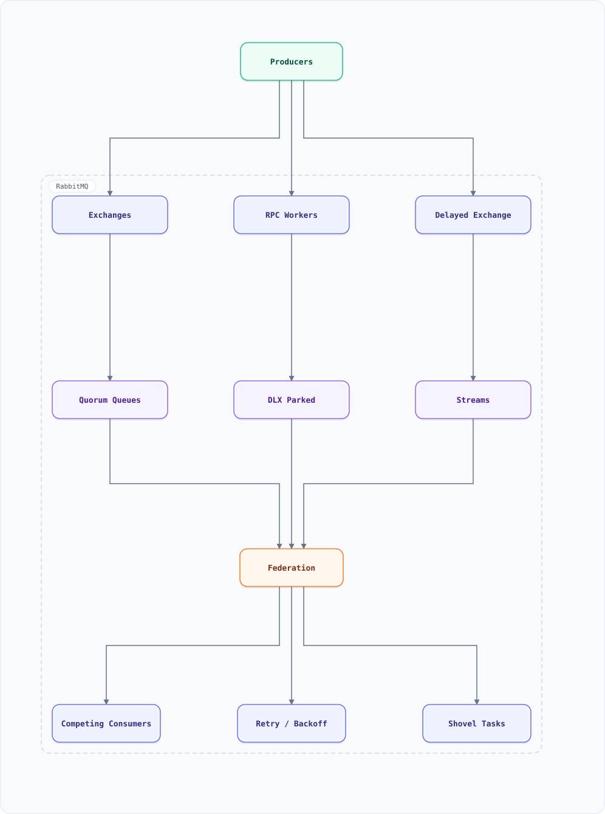

<div align="center">

# RabbitMQ — Features Guide with Basic Examples

</div>

A quick-reference catalog of RabbitMQ features used in task-oriented messaging: queues & exchanges, the four exchange types, routing keys & bindings, acknowledgment & reliability modes, dead-letter exchanges, TTL & expiry, quorum queues, delayed messages, RPC over AMQP, and the RabbitMQ-vs-Kafka decision — each with a small, concrete example.

**RabbitMQ in one line:** a **smart broker / dumb consumer** message broker implementing AMQP 0-9-1 — producers publish to *exchanges*, exchanges route to *queues* by bindings, consumers pull and acknowledge. Where Kafka is a replayable log, RabbitMQ is a work-distribution router with rich per-message semantics.
> **Latest stable (Sep 2026): RabbitMQ 4.3** (4.3.6 maintenance) — quorum-queue enhancements, Khepri (Raft-based metadata store) matured, AMQP 1.0 native since 4.2. Note: 4.2 reached EOL Jul 2026 — upgrade path is 4.2 → 4.3 only.


### Task messaging at a glance



**Interactive diagram:** [diagrams/features/rabbitmq-at-a-glance.architecture.html](diagrams/features/rabbitmq-at-a-glance.architecture.html) — pan/zoom, search, dark/light theme, PNG/SVG export.


**Interactive diagram:** [diagrams/features/rabbitmq-at-a-glance.architecture.html](diagrams/features/rabbitmq-at-a-glance.architecture.html) — pan/zoom, search, dark/light theme, PNG/SVG export.

*Solid = message flow. Exchanges §2, reliability §4, DLX §6, quorum queues §7, delays §8.

---

## Table of Contents

<details>
<summary><b>📑 Jump to a section</b></summary>

1. [Core Model — Producer, Exchange, Queue, Consumer](#1-core-model--producer-exchange-queue-consumer)
2. [Exchange Types — Direct, Fanout, Topic, Headers](#2-exchange-types--direct-fanout-topic-headers)
3. [Publishing — Routing Keys & Mandatory Delivery](#3-publishing--routing-keys--mandatory-delivery)
4. [Reliability — Acks, Publisher Confirms, Durability](#4-reliability--acks-publisher-confirms-durability)
5. [Prefetch & Backpressure](#5-prefetch--backpressure)
6. [Dead-Letter Exchanges (DLX)](#6-dead-letter-exchanges-dlx)
7. [Quorum Queues & Streams](#7-quorum-queues--streams)
8. [Delayed Messages & Scheduled Jobs](#8-delayed-messages--scheduled-jobs)
9. [Priority Queues & Fair Dispatch](#9-priority-queues--fair-dispatch)
10. [RPC Over AMQP](#10-rpc-over-amqp)
11. [Federation & Shovel](#11-federation--shovel)
12. [RabbitMQ vs Kafka — The Real Decision](#12-rabbitmq-vs-kafka--the-real-decision)
13. [RabbitMQ in This Repo's Designs](#13-rabbitmq-in-this-repos-designs)
14. [Key Takeaways](#14-key-takeaways)
15. [Hidden Tips & Tricks](#15-hidden-tips--tricks)
16. [Do's & Don'ts](#16-dos--donts)

</details>

---

## 1. Core Model — Producer, Exchange, Queue, Consumer

Producers never publish *to queues* — they publish to **exchanges**, which copy messages to queues per **bindings**. This indirection is RabbitMQ's whole routing power.

```bash
# CLI
rabbitmqadmin declare exchange name=orders type=topic
rabbitmqadmin declare queue name=orders.eu durable=true
rabbitmqadmin declare binding source=orders destination=orders.eu routing_key="order.eu.*"
```

```python
# pika
channel.exchange_declare(exchange="orders", exchange_type="topic", durable=True)
channel.queue_declare(queue="orders.eu", durable=True)
channel.queue_bind(exchange="orders", queue="orders.eu", routing_key="order.eu.*")
```

| Concept | Role |
| :--- | :--- |
| Exchange | stateless router — receives, copies, forwards |
| Queue | the buffer — holds messages until consumed |
| Binding | exchange → queue rule (with optional key pattern) |
| Consumer | pulls with acknowledgments (§4) |

---

## 2. Exchange Types — Direct, Fanout, Topic, Headers

| Type | Routing | Use case |
| :--- | :--- | :--- |
| **direct** | exact routing-key match | point-to-point tasks (`email.send`) |
| **fanout** | broadcast to all bound queues | cache invalidation, fan-out to services |
| **topic** | wildcard patterns (`*.eu.*`, `order.#`) | flexible pub/sub (`order.created.eu`) |
| **headers** | match on message headers instead of key | multi-attribute routing, no key hierarchy |

```bash
# Topic example: one publisher, three consumers, pattern-based
rabbitmqadmin declare binding source=orders destination=audit.all  routing_key="order.#"
rabbitmqadmin declare binding source=orders destination=eu.stats   routing_key="order.eu.*"
rabbitmqadmin declare binding source=orders destination=returns    routing_key="order.*.returned"
# "order.eu.returned" hits all three; "order.us.created" hits only audit.all
```

---

## 3. Publishing — Routing Keys & Mandatory Delivery

```python
channel.basic_publish(
    exchange="orders", routing_key="order.eu.created",
    body=json.dumps(payload),
    properties=pika.BasicProperties(
        delivery_mode=2,              # persistent (survives broker restart, with durable queue)
        message_id=str(uuid4()),      # idempotency key for consumers
        headers={"trace_id": tid},    # distributed tracing propagation
        expiration="60000",           # per-message TTL ms (§6 alternative)
    ),
    mandatory=True,                   # broker returns message if unroutable
)
# + publisher confirms (§4) = the full "it's safe" story
```

---

## 4. Reliability — Acks, Publisher Confirms, Durability

Three independent layers — you need all three for at-least-once end to end.

| Layer | Mechanism | Failure covered |
| :--- | :--- | :--- |
| Broker holds it | **durable queue + persistent message** | broker restart |
| Consumer processed it | **manual ack** (`basic_ack` after work) | consumer crash mid-job |
| Broker accepted it | **publisher confirms** (`confirm_delivery`) | message lost pre-queue |

```python
channel.confirm_delivery()                     # per-connection publisher confirms
channel.basic_consume(queue="orders.eu", on_message_callback=handler)
# handler: process first, THEN channel.basic_ack(delivery_tag) — never auto-ack for real work
# nack + requeue=False routes to the DLX instead of hot-looping (§6)
```

**At-least-once, not exactly-once:** redeliveries happen; consumers dedupe via `message_id` (idempotency — `system-design-concepts.md` §10).

---

## 5. Prefetch & Backpressure

`prefetch` = unacked messages per consumer. This single number is RabbitMQ's backpressure model.

```bash
channel.basic_qos(prefetch_count=10)   # worker holds ≤10 unacked; slow workers get less
```

| Prefetch | Behavior |
| :--- | :--- |
| 1 | strict fair dispatch; lowest throughput |
| 10–50 | the sweet spot for mixed task durations |
| ∞ (default) | one fast consumer hoards the queue — avoid |

Ties to `system-design-concepts.md` §21 (backpressure): queue-depth alarms + prefetch caps keep latency bounded; shedding happens upstream, not in the broker.

---

## 6. Dead-Letter Exchanges (DLX)

Where poison messages go — the Kafka-DLQ analog for RabbitMQ.

```bash
rabbitmqadmin declare queue name=orders.dlx.queue durable=true
rabbitmqadmin declare exchange name=orders.dlx type=direct
rabbitmqadmin declare binding source=orders.dlx destination=orders.dlx.queue routing_key="orders"

# main queue: dead-letters on reject AND on TTL expiry
rabbitmqadmin declare queue name=orders.eu durable=true \
  arguments='{"x-dead-letter-exchange":"orders.dlx","x-dead-letter-routing-key":"orders","x-message-ttl":3600000}'
```

Messages land in the DLX on: explicit `nack(requeue=False)`, TTL expiry, or queue-length overflow. Retry pattern: DLX consumer inspects → transient failures re-enqueue with backoff (or to a delayed retry queue, §8) → permanent failures park for humans. Same lifecycle as `system-design-concepts.md` §20.

---

## 7. Quorum Queues & Streams

| Type | What | When |
| :--- | :--- | :--- |
| Classic (mirrored) | legacy HA | don't start new ones |
| **Quorum queue** | Raft-replicated queue (majority commit) | default choice for durability |
| **Streams** | append-only replicated log with offsets | replayable reads, Kafka-lite |

```bash
rabbitmqadmin declare queue name=payments.quorum queue_type=quorum \
  arguments='{"x-quorum-initial-group-size":3,"x-max-length":1000000}'
```

Quorum queues trade throughput for safety (majority fsync per op) — right default for money-adjacent flows (payments, inventory). Streams add offset-based reads + replay when a queue isn't enough, but Kafka (see `kafka-features.md`) still owns high-throughput event streaming.

---

## 8. Delayed Messages & Scheduled Jobs

Two native mechanisms (the delayed-job-scheduler doc's patterns, in RabbitMQ dialect):

```bash
# 1) TTL + DLX = delayed queue (dead-letter on expiry = "fire now")
rabbitmqadmin declare queue name=retry.30s arguments='{"x-message-ttl":30000,"x-dead-letter-exchange":"orders","x-dead-letter-routing-key":"order.eu.created"}'

# 2) rabbitmq_delayed_message_exchange plugin: delay at exchange level
rabbitmqadmin declare exchange name=delayed type=x-delayed-message \
  arguments='{"x-delayed-type":"direct"}'
# publish with header x-delay=30000; exchange holds and releases after 30s
```

Caveats: TTL+DLX delays only work head-of-line (one TTL per queue) — use it for uniform retry waits; the plugin handles per-message delays up to ~2³²−1 ms. Reminder/notification systems (`system-design-notification-system.md`) use exactly this shape.

---

## 9. Priority Queues & Fair Dispatch

```bash
rabbitmqadmin declare queue name=tickets arguments='{"x-max-priority":10}'
# publish with properties={"priority": 8} — higher numbers consumed first
```

Use for support-ticket/vip-lane semantics; combine with prefetch=1 for strict fairness. Don't confuse with per-consumer round-robin — priority reorders within the queue, round-robin distributes across consumers.

---

## 10. RPC Over AMQP

Request/reply over the same broker — the client publishes to a request queue with a `reply_to` queue, the server answers to it, both correlate by `correlation_id`.

```python
# client
result = channel.queue_declare(queue="", exclusive=True)      # anonymous reply queue
props = pika.BasicProperties(reply_to=result.method.queue,
                            correlation_id=str(uuid4()))
channel.basic_publish(exchange="", routing_key="calc.rpc", properties=props, body=b"...")
# server: consume calc.rpc -> compute -> publish to props.reply_to with same correlation_id
```

Fine for control-plane/request flows at moderate rates; at high throughput prefer explicit request topics or gRPC (see `system-design-concepts.md` API-style section).

---

## 11. Federation & Shovel

| Plugin | Direction | Use |
| :--- | :--- | :--- |
| **Federation** | continuous exchange/queue replication | multi-DC pub/sub, regional consumers |
| **Shovel** | point-to-point queue move | draining, cross-cluster migration, bridging regions |

```bash
rabbitmqctl set_parameter federation-upstream dc2 '{"uri":"amqps://dc2..."}'
rabbitmqctl set_policy f-for-orders "^orders\." '{"federation-upstream":{"dc2":[]}}'
```

---

## 12. RabbitMQ vs Kafka — The Real Decision

| Dimension | RabbitMQ | Kafka |
| :--- | :--- | :--- |
| Model | routed queues, delete-on-ack | durable log, offset-based replay |
| Routing | rich (exchange types, wildcard) | topic-partition only |
| Replay | no (message gone after ack) | yes — consumers rewind |
| Ordering | per-queue (FIFO) | per-partition |
| Throughput | ~50K msg/s/queue | millions/s/broker |
| Best at | **task distribution**, RPC, per-message TTL/priority | **event streaming**, CDC, fan-in pipelines |
| Consumer model | push, competing workers | pull, consumer groups |

**Heuristic:** if messages are *work items* that disappear when done → RabbitMQ. If messages are *facts* multiple systems must process and re-process → Kafka. Many real systems run both (Kafka backbone, RabbitMQ for per-tenant task queues — see `system-design-food-delivery.md`, `system-design-ecommerce.md`).

---

## 13. RabbitMQ in This Repo's Designs

| Design | Role |
| :--- | :--- |
| `system-design-ecommerce.md` | order workflow tasks (reserve stock → charge → ship) |
| `system-design-food-delivery.md` | rider-assignment tasks, per-city queues |
| `system-design-notification-system.md` | per-channel send queues with retries + DLX |
| `system-design-delayed-job-scheduler.md` | TTL+DLX delayed queues as a scheduler primitive |
| `system-design-pastebin.md` | expiration/preview jobs |
| `system-design-metro-ticketing.md` | fare-calculation workers |

Kafka counterparts live in each doc's architecture diagram — most designs show both by role.

---

## 14. Key Takeaways

1. **Exchanges route, queues buffer** — designing bindings (not queue names) is the skill
2. Reliability = durable queue + persistent messages + manual acks + publisher confirms, together
3. **Prefetch is the backpressure knob** — tune it before adding infrastructure
4. DLX + TTL give you retries, parking lots, and delayed jobs without a scheduler
5. Quorum queues are the default; streams add replay when a queue isn't enough
6. RabbitMQ for work items, Kafka for facts — most platforms eventually use both
7. Related guides: `kafka-features.md` (the streaming alternative), `redis-features.md` (Streams & delayed queues), `cloud.md` (managed offerings: Amazon MQ, CloudAMQP)

## 15. Hidden Tips & Tricks

**1. Prefetch is the throughput dial.** `prefetch=1`: perfectly fair, brutally slow (a round-trip per message). `prefetch=∞`: one fast consumer hoards the queue while others starve. Start around 10–100 and tune from ack patterns.

**2. Unacked messages aren't lost — they're *pending*.** Consumer dies → broker redelivers everything unacked (at-least-once). Downstream must dedupe; "it processed exactly once because we didn't ack" is wrong twice over.

**3. Durability needs BOTH knobs.** Durable queue + persistent messages (+ durable exchange) survives a broker restart; miss the message flag and everything in the queue evaporates on restart.

**4. `requeue: true` on a poison message = infinite loop.** Bad payload → reject → requeue → crash → repeat, burning the broker. Cap redeliveries (x-death header count) and route to a DLX — never raw-requeue blindly.

**5. vhosts are the isolation unit.** A publish to the wrong vhost isn't an error — the exchange simply doesn't exist there, and the message vanishes. Use `mandatory` + returned-message handlers for critical publishes.

**6. Quorum queues change the feature matrix.** Quorum ≠ classic: no priority queues, no transient mode, different TTL semantics — flipping a fleet to quorum for safety silently drops features you depended on.

## 16. Do's & Don'ts

| ✅ Do | ❌ Don't |
| :--- | :--- |
| Set prefetch to a tuned finite value per consumer | Don't ship `prefetch=1` everywhere (slow) or unbounded (hoarding) |
| Make queues durable AND messages persistent for anything that must survive restart | Don't flip one knob and call the pipeline durable |
| Cap redeliveries and route failures to a DLX | Don't `requeue: true` poison messages into an infinite crash loop |
| Dedupe downstream (idempotent consumers) | Don't assume ack-later semantics give you exactly-once |
| Use `mandatory` + returned-message handlers for critical publishes | Don't publish to a wrong-vhost exchange and watch messages vanish silently |
