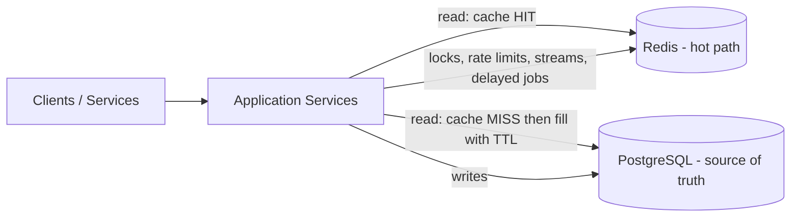

# Redis — Features Guide with Basic Examples

A quick-reference catalog of Redis features used in real backends: the data structures (String, Hash, List, Set, Sorted Set, Bitmap, Bitfield, HyperLogLog, Geo, Stream — plus module types JSON, Time Series, Vector set, Array, and probabilistic filters), caching patterns, distributed locking, rate limiting, Pub/Sub, reliable queues via Streams, transactions, Lua scripting, persistence, and high availability — each with a small, copy-paste-able `redis-cli` example.

**Redis in one line:** an in-memory, single-threaded data-structure server with sub-millisecond operations, built-in replication/clustering, optional persistence (RDB/AOF), and scripting — the default cache, lock, counter, and lightweight queue in system design.

### Where Redis sits in a system



---

## Table of Contents

1. [Data Structures (Core Types & Modules)](#1-data-structures-core-types--modules)
2. [Caching (TTL, Eviction, Patterns)](#2-caching-ttl-eviction-patterns)
3. [Distributed Locking](#3-distributed-locking)
4. [Rate Limiting](#4-rate-limiting)
5. [Counters & Analytics](#5-counters--analytics)
6. [Leaderboards & Ranking](#6-leaderboards--ranking)
7. [Pub/Sub (Fan-out Messages)](#7-pubsub-fan-out-messages)
8. [Streams — the Reliable Message Queue](#8-streams--the-reliable-message-queue)
9. [Delayed / Scheduled Jobs (Sorted-Set Queue)](#9-delayed--scheduled-jobs-sorted-set-queue)
10. [Sessions & Token Storage](#10-sessions--token-storage)
11. [Transactions (MULTI/EXEC/WATCH)](#11-transactions-multiexecwatch)
12. [Lua Scripting — Atomic Custom Logic](#12-lua-scripting--atomic-custom-logic)
13. [Pipelining & Batching](#13-pipelining--batching)
14. [Probabilistic, Time-Series & Vector Types](#14-probabilistic-time-series--vector-types)
15. [Keyspace Notifications](#15-keyspace-notifications)
16. [Persistence — RDB & AOF](#16-persistence--rdb--aof)
17. [High Availability — Sentinel & Cluster](#17-high-availability--sentinel--cluster)
18. [Caching Anti-Patterns & Pitfalls](#18-caching-anti-patterns--pitfalls)
19. [Key Takeaways](#19-key-takeaways)

---

## 1. Data Structures (Core Types & Modules)

### String — the swiss army knife

```bash
SET user:1:name "Alice"          # basic set
SETEX user:1:session "abc123" 60 # set + expire in 60s (atomic)
GET user:1:name                  # "Alice"
INCR page:views                  # 1 — atomic counter
INCRBY user:1:points 50          # += 50
SETNX lock:job:123 "me"          # 1 if key absent (set-if-not-exists) → used for locks
APPEND log:today "line\n"        # append to a string
STRLEN user:1:name               # length
```

### Hash — one object, many fields

```bash
HSET user:1 name "Alice" age 30 city "NYC"
HGET user:1 name                 # "Alice"
HGETALL user:1                   # every field
HINCRBY user:1 age 1             # atomic increment of one field
HDEL user:1 city
# Typical: store a whole DB row / profile as a hash keyed by entity id.
```

### List — ordered, fast head/tail ops

```bash
LPUSH queue:emails "a@x.com"     # push to head
RPUSH queue:emails "b@y.com"     # push to tail
LPOP queue:emails                # pop from head ("a@x.com")
RPOP queue:emails                # pop from tail
LRANGE queue:emails 0 -1         # view whole list
BLPOP queue:emails 5             # blocking pop — wait up to 5s (polling-free!)
# Typical: simple FIFO queue, latest-N feed (LPUSH + LTRIM).
```

### Set — unique unordered collection

```bash
SADD user:1:follows 2 3 4        # 3 (unique, order doesn't matter)
SADD user:2:follows 3 5
SISMEMBER user:1:follows 2       # 1 (is following?)
SINTER user:1:follows user:2:follows   # {3} common follows
SUNION / SDIFF ...               # union / difference
SPOP online_users 1              # random member (raffles)
SCARD user:1:follows             # count
# Typical: tags, follows, online presence, dedupe, membership checks.
```

### Sorted Set — every member carries a score

```bash
ZADD leaderboard 1200 "alice"    # score 1200
ZADD leaderboard 900 "bob"
ZINCRBY leaderboard 100 "bob"    # bob → 1000
ZREVRANGE leaderboard 0 2 WITHSCORES  # top 3 by score
ZRANK leaderboard "bob"          # position from low to high
ZSCORE leaderboard "bob"         # 1000
ZRANGEBYSCORE queue 0 now()      # members within a score window
# Typical: leaderboards, delayed queues (score = timestamp), rate windows,
#          "top N", range queries on scores.
```

### Bitmap — bits inside a string

```bash
SETBIT online:2026-09-04 42 1     # user 42 online that day (offset = user id)
GETBIT online:2026-09-04 42       # 1
BITCOUNT online:2026-09-04        # total online users that day
BITOP AND active:7d online:2026-09-04 online:2026-09-03
# Typical: daily-active-users in O(1) memory per user per day, feature flags.
```

### HyperLogLog — approximate unique counts

```bash
PFADD page:visitors "ip-1" "ip-2" "ip-1"
PFCOUNT page:visitors             # ≈2 (standard error 0.81%)
PFMERGE monthly page:visitors     # merge daily HLLs into a monthly one
# Typical: "how many unique users/ips saw this", at ~12 KB regardless of count.
```

### Geo — latitude/longitude with distance queries

```bash
GEOADD drivers 77.1025 28.7041 "cab-1"
GEOADD drivers 77.2090 28.6139 "cab-2"
GEOSEARCH drivers FROMLONLAT 77.12 28.65 BYRADIUS 5 km ASC
# → cab-1, cab-2 (nearest first)
GEODIST drivers "cab-1" "cab-2" km   # distance between two members
# Typical: "find nearby drivers/restaurants" — simple geo without PostGIS.
```

### Stream — the append-only event log with consumer groups

```bash
XADD orders "*" user 42 total 99.5    # id auto-generated: 1725...-0
XLEN orders
XREAD COUNT 10 STREAMS orders 0       # read from beginning (replay!)
XADD orders "100-0" user 43 total 5   # custom id
# Consumer groups let multiple workers share the load reliably (see §8).
```

### Bitfield — many compact counters in one string (native)

```bash
BITFIELD stats:user:42 SET u8 0 5        # store 5 at byte offset 0
BITFIELD stats:user:42 INCRBY u8 0 1     # atomic increment → 6
BITFIELD stats:user:42 GET u8 0          # 6
# Overflow policies (WRAP / SAT / FAIL) stop silent wraparound.
```

### JSON (RedisJSON module) — query & edit nested documents

```bash
JSON.SET user:42 $ '{"name":"Alice","orders":[{"id":1,"total":10}]}'
JSON.GET user:42 $.name                  # "Alice"
JSON.GET user:42 $.orders[0].total       # 10
JSON.ARRAPPEND user:42 $.orders '{"id":2,"total":20}'
JSON.NUMINCRBY user:42 $.orders[1].total 5
# JSONPath everywhere: JSON.GET user:42 '$.orders[?(@.total > 10)]'
```

**Decision table — which type when?**

| Need | Type |
| ---- | ---- |
| Cache value, counter, lock, token | String |
| Object / DB row | Hash |
| FIFO queue, latest-N | List |
| Uniqueness, tags, membership | Set |
| Ranking, window by score, delayed jobs | Sorted Set |
| Active-user tracking | Bitmap / HyperLogLog |
| Nearby search | Geo |
| Durable event log / reliable queue | Stream |
| Compact multi-counters in one key | Bitfield |
| Nested documents & arrays | JSON (module) |
| Time-series metric samples | Time Series (module) |
| Embeddings / similarity search | Vector set (Redis 8+) |
| Sparse index-addressable arrays | Array (Redis 8.8+) |

---

## 2. Caching (TTL, Eviction, Patterns)

Redis is the classic **cache-aside** store: hot data lives in RAM next to the app; a miss falls through to the database and refills the cache.

### TTL — every key can expire

```bash
SET profile:42 '{"name":"Alice"}' EX 300     # expire after 300s
EXPIRE profile:42 300                        # set TTL on existing key
TTL profile:42                               # seconds remaining (-1 = none, -2 = gone)
PERSIST profile:42                           # remove the TTL
# One command can also do it: SETEX / PSETEX (ms)
```

### Eviction policies (`maxmemory`)

When Redis hits `maxmemory`, it evicts per policy:

| Policy | Behavior |
| ------ | -------- |
| `noeviction` (default) | return errors on writes — safe but OOM for writes |
| `allkeys-lru` | evict least-recently-used key of any key |
| `volatile-lru` | LRU among keys **with** a TTL |
| `allkeys-lfu` | evict least-frequently-used key |
| `allkeys-random` | evict random key |
| `volatile-ttl` | evict the key with the soonest expiry |

```bash
# redis.conf
maxmemory 2gb
maxmemory-policy allkeys-lru
```

Use **`allkeys-lru`/`allkeys-lfu` for pure caches**; keep `noeviction` only if Redis holds data you cannot lose.

### Cache-aside (lazy loading) — the pattern to memorize

```text
function getUser(id):
    key = "user:" + id
    value = redis.GET(key)
    if value is not None:
        return value                  # cache HIT
    row = db.query("SELECT * FROM users WHERE id = ?", id)   # cache MISS
    if row is None:
        return None
    redis.SET(key, row, EX=300)       # populate with TTL
    return row

# on write: UPDATE db row  →  redis.DEL(key)   (invalidate, don't update)
```

Other caching write patterns:

| Pattern | Behavior | Use when |
| ------- | -------- | -------- |
| **Cache-aside** | app reads cache, fills on miss, deletes on write | default choice |
| **Read-through** | cache itself loads from DB on miss | cache is a component (library) |
| **Write-through** | write DB + cache together, always fresh | strong read consistency wanted |
| **Write-behind** | write cache now, flush to DB async | heavy write bursts, tolerate loss |

**Cache invalidation is the hard part.** Reliable options: short TTLs, explicit `DEL` on writes, `LISTEN/NOTIFY` from PostgreSQL (see `postgresql-features.md`), or a versioned key that bumps on every write.

---

## 3. Distributed Locking

Multiple app servers must not run the same job twice. Redis gives an atomic lock primitive:

```bash
# Acquire: succeed only if key doesn't exist, auto-expire after 30s (anti-deadlock)
SET lock:payroll:run "worker-42" NX PX 30000
#   → OK          (we hold the lock)
#   → (nil)       (someone else holds it — retry later)

# Check who holds it
GET lock:payroll:run

# Release — MUST verify ownership first (Lua, to be atomic):
```

```lua
-- release.lua : only the holder may delete the lock
if redis.call("GET", KEYS[1]) == ARGV[1] then
    return redis.call("DEL", KEYS[1])
else
    return 0
end
```

```bash
EVAL "$(cat release.lua)" 1 lock:payroll:run "worker-42"
```

Key rules:
- **Never release a lock you don't own** (hence the Lua ownership check).
- **Always set a TTL** (the `PX 30000`) or a crashed holder deadlocks everyone.
- **Renew** (watchdog) if the critical section may outlive the TTL; `SET ... PX` again while holding.
- Critical section must be short; the lock protects coordination, not long jobs.
- For stronger guarantees across many Redis nodes: the **Redlock** algorithm (locks a majority of N independent nodes) — controversial but common in interviews; most teams use a single Redis + TTL and accept the tiny failure window.

Use cases: leader election, cron dedupe across replicas, "one worker processes this id" (can also use a sorted set / `SETNX`-style claim).

---

## 4. Rate Limiting

### Fixed window — atomic and simple

```bash
# Allow N requests per minute per user
INCR rate:user:42:minute:1725300000     # 1 (first)
EXPIRE rate:user:42:minute:1725300000 60
# if the counter exceeds N → reject (HTTP 429)
```

(Do the check+increment atomically with a tiny Lua script to avoid races — see §12.)

### Sliding window — precise, via sorted set

```bash
# Each request = a member with score = now. Window = now-60s..now
ZREMRANGEBYSCORE rate:user:42 0 1725300000     # drop old entries (now-60s)
ZCARD rate:user:42                              # requests in last 60s
ZADD rate:user:42 1725300061 "req-abc"          # record this request
EXPIRE rate:user:42 60
```

### Token bucket — allow bursts, cap average

```lua
-- KEYS[1]=key  ARGV[1]=capacity  ARGV[2]=refillPerSec  ARGV[3]=now
local tokens = tonumber(redis.call("GET", KEYS[1] .. ":tokens") or "0")
local last   = tonumber(redis.call("GET", KEYS[1] .. ":last") or ARGV[3])
local fill   = math.min(ARGV[1], tokens + (ARGV[3] - last) * ARGV[2])
if fill >= 1 then
    redis.call("SET", KEYS[1] .. ":tokens", fill - 1, "PX", 60000)
    redis.call("SET", KEYS[1] .. ":last", ARGV[3], "PX", 60000)
    return 1          -- allow
end
return 0              -- deny
```

---

## 5. Counters & Analytics

```bash
INCRBY user:42:points 10           # points
INCR page:views                    # hit counter (single key, 64-bit safe)
INCR video:9:views                 # per-entity counters at massive scale

# Per-minute buckets for dashboards: key per minute, TTL 24h
INCR stats:video:9:minute:1725300060
EXPIRE stats:video:9:minute:1725300060 86400

# Global unique ID / sequence (careful: single point, use DB sequence at scale)
INCR global:order_seq
```

Redis counters are atomic because the server is single-threaded — **no `INCR` race condition ever**.

---

## 6. Leaderboards & Ranking

```bash
ZADD game:scores 1500 "alice"
ZADD game:scores 1200 "bob" 2100 "carol"
ZINCRBY game:scores 200 "bob"              # live scoring
ZREVRANGE game:scores 0 9 WITHSCORES       # top 10
ZREVRANK game:scores "alice"               # alice's rank
ZSCORE game:scores "alice"                 # her score

# "Top of the last 7 days": merge daily boards into a weekly one
ZUNIONSTORE game:scores:weekly 7 game:scores:day:1 ... game:scores:day:7
```

---

## 7. Pub/Sub (Fan-out Messages)

Fire-and-forget broadcast: publishers push to a channel, all subscribers receive it. No retention — if nobody is listening, the message is gone.

```bash
# Terminal 1 — subscribe
SUBSCRIBE news:tech
# Terminal 2 — publish
PUBLISH news:tech "Redis 8 released"
# Terminal 1 prints the message
```

```bash
PSUBSCRIBE news:*        # pattern subscribe (wildcards)
PUBSUB CHANNELS          # inspect active channels
```

Use cases: cache invalidation broadcasts, chat rooms, pushing config changes to every server. **Not** for reliable delivery — that's Streams (next) or Kafka (`kafka-features.md`).

---

## 8. Streams — the Reliable Message Queue

Redis Streams = an append-only log with **consumer groups**: messages persist until acknowledged, survive restarts (if AOF enabled), and can be replayed. This is the "Redis as a real queue" answer to Kafka-lite.

```bash
# Producer
XADD order:events "*" orderId 1001 status created
XADD order:events "*" orderId 1001 status paid

# Create a consumer group ("workers") starting from the beginning (0)
XGROUP CREATE order:events workers 0

# Consumers 1..N read their fair share (each gets distinct messages)
XREADGROUP GROUP workers consumer-1 COUNT 10 STREAMS order:events ">"
XREADGROUP GROUP workers consumer-2 COUNT 10 STREAMS order:events ">"

# Ack after processing — this is what makes delivery reliable
XACK order:events workers 1725300061000-0

# Inspect pending-but-unacked (crashed consumers)
XPENDING order:events workers
# Claim + retry messages stuck with dead consumers
XAUTOCLAIM order:events workers consumer-1 60000 0
```

Group semantics make it a **competing-consumers queue** (each message to one worker), while plain `XREAD` is fan-out. Messages live until trimmed (`XTRIM`/`MAXLEN`), so slow consumers never lose data — they just lag.

---

## 9. Delayed / Scheduled Jobs (Sorted-Set Queue)

Score = run-at timestamp. Workers poll for due jobs and atomically remove them.

```bash
# Schedule a job 10 minutes from now
ZADD delayed:email 1725300600 "email-552"

# Worker loop (pseudo-code)
while true:
    # pop the single earliest due job atomically
    job = redis.ZRANGEBYSCORE(delayed:email, 0, now, LIMIT 0 1)
    if job is empty: sleep(100ms); continue
    if redis.ZREM(delayed:email, job[0]) == 1:    # only one worker wins
        process(job[0])
```

A Lua one-liner makes pop-and-remove fully atomic:

```lua
-- pop-due.lua: return one due job, removed atomically
local jobs = redis.call("ZRANGEBYSCORE", KEYS[1], 0, ARGV[1], "LIMIT", 0, 1)
if #jobs > 0 then redis.call("ZREM", KEYS[1], jobs[1]) end
return jobs[1]
```

Use: retry queues, reminders, email digests, delayed payments — no separate scheduler needed. See the [Delayed Job Scheduler](system-design-delayed-job-scheduler.md) doc.

---

## 10. Sessions & Token Storage

```bash
# Login → create session with TTL = "sliding" refresh on every request
SET session:tok-xyz '{"user_id":42}' EX 3600
# Every authenticated request:
GET session:tok-xyz                      # valid?
EXPIRE session:tok-xyz 3600              # sliding expiry
# Logout → kill the session server-side instantly
DEL session:tok-xyz
```

Bonus: store the session as a Hash and bump fields (`HSET`, `HINCRBY`) without rewriting the JSON. Distributed rate-limit / session state is shared across all app servers because Redis is shared.

---

## 11. Transactions (MULTI/EXEC/WATCH)

`MULTI` queues commands; `EXEC` runs them **uninterleaved** (no other client's commands slip in between). Note: Redis has no rollback — if a queued command is syntactically wrong, `EXEC` aborts everything; runtime errors leave the others executed.

```bash
MULTI
SET account:1:balance 90
SET account:2:balance 110
EXEC                       # both applied atomically (but no UNDO)

# Optimistic concurrency with WATCH (compare-and-set)
WATCH cart:user:42         # watch a key
# ... read it, compute new value in the app ...
MULTI
SET cart:user:42 "new-value"
EXEC
# → if cart changed between WATCH and EXEC → EXEC returns (nil), retry the whole loop
```

Typical: balance transfers, stock decrement+history in one shot, "do X only if Y didn't change". For **read-modify-write with logic**, prefer Lua (§12) — truly atomic and faster.

---

## 12. Lua Scripting — Atomic Custom Logic

`EVAL` runs a Lua script server-side. Because Redis is single-threaded, the whole script executes **atomically** — the standard tool for lock release, rate limiting, and inventory checks.

```lua
-- Atomic inventory: decrement only if stock remains >= 0
-- KEYS[1] = stock key ; ARGV[1] = qty wanted
local stock = tonumber(redis.call("GET", KEYS[1]) or "0")
if stock < tonumber(ARGV[1]) then
    return -1                       -- not enough stock
end
redis.call("DECRBY", KEYS[1], ARGV[1])
return stock - tonumber(ARGV[1])    -- remaining
```

```bash
EVAL "..." 1 stock:sku:9 2
```

Scripts are cached with `SCRIPT LOAD`/`EVALSHA` so the app sends only the hash. Modern Redis (7+) also has server-side **functions** (`FUNCTION LOAD`) for versioned, deployable scripts.

---

## 13. Pipelining & Batching

Round trips dominate latency. **Pipelining** sends many commands in one shot and reads all replies:

```text
// Without pipelining: 3 RTTs
client.SET("a", "1"); client.SET("b", "2"); client.GET("a");

// With pipelining: 1 RTT for all three
pipe = client.pipeline()
pipe.set("a", "1"); pipe.set("b", "2"); pipe.get("a")
results = pipe.execute()
```

On a 1 ms RTT network that is 3 ms → 1 ms, and with many commands the win compounds. Real client libraries (ioredis, redis-py, lettuce) all expose pipelines; also look at `MSET`/`MGET`/`HMGET` for multi-key single round trips.

---

## 14. Probabilistic, Time-Series & Vector Types

### Bitmap recap (native)

```bash
SETBIT da:2026-09-04 12345 1     # user 12345 active
BITCOUNT da:2026-09-04           # DAU
```

### Bloom filter — "maybe in set" at tiny memory cost (RedisBloom)

```bash
BF.RESERVE emails 0.01 1000000    # 1% false-positive rate, ~1M expected items
BF.ADD emails "a@x.com"           # 1 (definitely new — probably)
BF.EXISTS emails "a@x.com"        # 1
BF.EXISTS emails "never@seen.io"  # 0 (definitely absent — never a false negative)
```

Bloom filters **never produce false negatives**: "definitely absent" is a hard guarantee. Use: cache stampede protection (only query DB if key *might* exist), dedupe at ingest, cheap "have we seen this url/user" checks. Memory far below a real set — see the concept in `system-design-concepts.md`.

### Cuckoo filter — like Bloom, but supports deletion

```bash
CF.ADD cf:urls "https://b.com"   # 1
CF.EXISTS cf:urls "https://b.com"  # 1
CF.DEL cf:urls "https://b.com"   # Bloom can't delete; cuckoo can
```

### Count-min sketch — frequency estimates in tiny memory

```bash
CMS.INCRBY freq:clicks "sku:9" 3    # record 3 clicks for sku:9
CMS.QUERY freq:clicks "sku:9"       # ≈3 (approximate, bounded error)
```

### t-digest — percentile estimates from a stream

```bash
TDIGEST.ADD latency:ms 120 95 220 80 310    # feed raw samples
TDIGEST.QUANTILE latency:ms 0.5 0.95 0.99   # p50 / p95 / p99 estimates
```

### Top-K — approximate most-frequent items

```bash
TOPK.ADD trending:items "iphone" "iphone" "pixel" "iphone"
TOPK.LIST trending:items
```

### Time series (RedisTimeSeries module) — timestamped metric samples

```bash
TS.CREATE cpu:server1 RETENTION 86400000 LABELS host server1
TS.ADD cpu:server1 * 42.5           # '*' = now
TS.RANGE cpu:server1 - + AGGREGATION avg 60000   # 1-minute averages
```

### Vector sets (Redis 8+, native) — embedding similarity search (HNSW, cosine)

```bash
VADD vec:products "item-1" FLOAT32 4 0.1 0.2 0.3 0.4   # insert an embedding
VSIM vec:products 4 0.1 0.2 0.3 0.4 COUNT 3            # top-3 most similar
VEMB vec:products "item-1"                              # read a stored vector
# RAG / recommendation systems query similarity right inside Redis.
```

---

## 15. Keyspace Notifications

Redis can publish an event whenever a key changes or **expires** — great glue for "do something when a TTL key dies".

```bash
# redis.conf
notify-keyspace-events Ex        # E = keyevent, x = expired
```

```bash
# Terminal 1
PSUBSCRIBE __keyevent@0__:expired
# Terminal 2
SET temp:job 1 EX 5
# ~5s later Terminal 1 receives: __keyevent@0__:expired → temp:job
```

Caveat: expiry events are **not guaranteed** (lazy expiry, eviction, TTL removed). Use it for best-effort hooks, not critical correctness.

---

## 16. Persistence — RDB & AOF

Redis is memory-first, but persistence exists:

| Mechanism | What it does | Trade-off |
| --------- | ------------ | --------- |
| **RDB** (snapshot) | Point-in-time dump (`SAVE`/`BGSAVE`, configurable intervals) | Tiny file, fast restart — can lose everything since last snapshot |
| **AOF** (append-only file) | Every write logged, `fsync` policy: `always` / `everysec` / `no` | `everysec` ≈ 1s of loss; `always` = durable but slow |
| **Both (default)** | RDB for fast restart + AOF for durability | Best safety, more disk I/O |

```bash
# redis.conf essentials
save 900 1          # RDB: snapshot if ≥1 write in 900s
appendonly yes
appendfsync everysec
```

**Cache vs store:** if Redis is a pure cache, persistence may be unnecessary (worst case = cold cache, refill from DB). If it holds locks/sessions/queues you care about, enable AOF.

---

## 17. High Availability — Sentinel & Cluster

### Redis Sentinel — failover + discovery

Sentinel watches the master; on failure it promotes a replica and repoints clients. Clients ask Sentinel for the current master — no hardcoded addresses.

```text
redis-sentinel sentinel.conf        # 3+ sentinels for quorum
# sentinel.conf:
sentinel monitor mymaster 10.0.0.1 6379 2     # 2 sentinels must agree
sentinel auth-pass mymaster secret
```

### Redis Cluster — sharding across many masters

Data is split across **16,384 hash slots** (`CRC16(key) % 16384`); each master owns a range of slots, and replicas back it up. Clients follow `MOVED`/`ASK` redirects to the right node.

```bash
redis-cli --cluster create 10.0.0.1:7000 10.0.0.2:7000 10.0.0.3:7000 \
  --cluster-replicas 1
redis-cli -c -p 7000                 # -c = cluster mode client
SET user:1 name Alice                # transparently routed to the right shard
```

**Consistent hashing on the client side** is an alternative to Cluster when you need hash-slot freedom — see `system-design-concepts.md`. Either way the goal is the same: keys for the same user land on the same node, and adding/removing nodes moves only a fraction of keys.

### Security: ACLs, TLS & least privilege

ACLs (Redis 6+) replace the single shared password with per-user keyspace + command permissions:

```bash
ACL SETUSER alice on >s3cret ~cache:* +@read          # read-only on cache:* keys
ACL SETUSER worker on >pw123 ~jobs:* +@write -del     # write on jobs:*, but no DEL
AUTH alice s3cret                                     # log in as alice
ACL LIST / ACL GETUSER alice / ACL WHOAMI

# Wire security: TLS everywhere (port 6380); mTLS for client certs in production.
# Disable/rename dangerous commands on untrusted networks (redis.conf):
#   rename-command CONFIG ""
# Observability built in:
INFO                # memory, ops/sec, hit ratio, evictions
SLOWLOG GET 10      # slow commands (> slowlog-log-slower-than)
CLIENT LIST         # connected clients / blocked connections
```

---

## 18. Caching Anti-Patterns & Pitfalls

| Pitfall | Symptom | Fix |
| ------- | ------- | --- |
| **No TTL** | memory grows forever, stale data | always set `EX`/`EXPIRE` |
| **Thundering herd / stampede** | DB melts when hot key expires | probabilistic early expiry, `SETNX`-based single-filler, per-key jitter on TTL |
| **Hot key** | one shard overloaded while others idle | replicate the hot key with suffixes (`user:42` → `user:42:a/b/c`), local cache |
| **Big keys** | slow ops, uneven shards | hash/list fields instead of giant strings, split by design |
| **`KEYS *` in production** | blocks the single thread | `SCAN` cursor iteration |
| **Update-then-invalidate race** | stale cache after write | delete after commit + short TTL backstop, or versioned keys |
| **No eviction policy** | writes error at `maxmemory` | `allkeys-lru` for caches |
| **Redis as source of truth w/o AOF** | data loss on restart | AOF, or treat Redis as disposable cache |
| **Sync calls in hot path** | latency pile-up | pipeline, `MGET`, client-side caching (Redis 6 RESP3) |
| **Ignoring `maxmemory`/monitoring** | surprise evictions | monitor `INFO memory`, `evicted_keys`, hit ratio |

---

## 19. Key Takeaways

1. **Nine data structures, nine answers** — choose the type that matches the query: counter → String, object → Hash, queue → List/Stream, uniqueness → Set, ranking/window → Sorted Set, geo → Geo, cardinality → HyperLogLog.
2. **Cache-aside + TTL + delete-on-write** is the default caching pattern; add jitter to avoid stampedes.
3. **Locks and rate limits need atomicity** — `SET NX PX`, Lua scripts, or `MULTI/EXEC/WATCH`. Never write these in plain app code with check-then-act.
4. **Streams > Pub/Sub for anything you can't lose**; consumer groups give Kafka-like semantics at lower operational weight.
5. **AOF for data you care about, RDB-only acceptable for pure cache.**
6. **Sentinel for failover, Cluster (hash slots) or client-side consistent hashing for scale.**
7. Redis complements PostgreSQL (durable truth) and Kafka (durable event bus) — it is the *hot path* in front of both.

---

## Related System Design Documents

- [Distributed Cache (Redis)](system-design-distributed-cache.md)
- [Rate Limiter](system-design-rate-limiter.md)
- [Delayed Job Scheduler](system-design-delayed-job-scheduler.md)
- [Key-Value Store (DynamoDB)](system-design-key-value-store.md)
- [PostgreSQL Features Guide](postgresql-features.md)
- [Kafka Features Guide](kafka-features.md)
