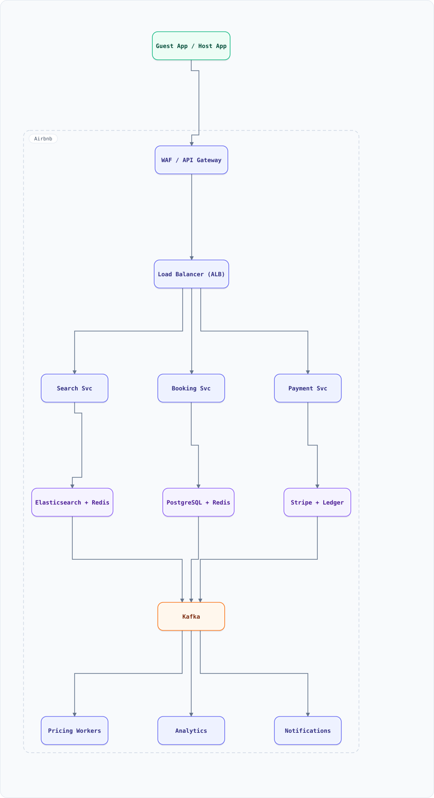

<div align="center">

# System Design: Airbnb (Property Rental Marketplace)

</div>

> [!TIP]
> **TL;DR** — Two-sided marketplace connecting hosts and guests with search, booking, payments, reviews, and trust/safety systems.

## Table of Contents

<details>
<summary><b>📑 Jump to a section</b></summary>

1. [Overview](#overview)
2. [Requirements](#requirements)
3. [High-Level Architecture](#high-level-architecture)
4. [Microservices](#microservices)
5. [Database Design](#database-design)
6. [Scaling Tiers](#scaling-tiers)
7. [Key Techniques & Patterns](#key-techniques--patterns)
8. [Key Design Decisions](#key-design-decisions)
9. [Failure Modes & Recovery](#failure-modes--recovery)
10. [Cost Estimation (1M Users)](#cost-estimation-1m-users)
11. [Trade-off Analysis](#trade-off-analysis)
12. [Key Metrics to Monitor](#key-metrics-to-monitor)
13. [Deep Dive Prompts](#deep-dive-prompts)
14. [Common Interview Follow-ups](#common-interview-follow-ups)
15. [Low-Level Design (LLD)](#low-level-design-lld)
16. [Do's & Don'ts](#dos--donts)

</details>

---


## Overview

Two-sided marketplace connecting hosts and guests with search, booking, payments, reviews, and trust/safety systems.

### Key Numbers

| Metric | Value |
| :--- | :--- |
| **users, 7M+ listings, 190+ countries** | 150M+ |
| **guest arrivals, Sub-500ms search** | 500M+ |

---

## Requirements

### Functional Requirements

- Search properties by location, dates, price, amenities
- Book property with calendar availability check
- Host listing management with pricing tools
- Two-way review system (guest + host)
- Secure payment with escrow hold
- Messaging between host and guest

### Non-Functional Requirements

| Attribute | Target |
| :--- | :--- |
| **Latency** | Search < 500ms, Booking < 2s |
| **Availability** | 99.99% |
| **Consistency** | Strong for bookings (no double-book) |
| **Scale** | 150M+ users, 7M+ listings |

---

## High-Level Architecture

### Architecture Diagram



**Interactive diagram:** [diagrams/system-design/airbnb.architecture.html](diagrams/system-design/airbnb.architecture.html) — pan/zoom, search, dark/light theme, PNG/SVG export.


*Solid = data flow, dashed = control plane / monitoring.*

### Data Flow

1. Guest searches - Search Service filters by location, dates, price
2. Pricing ML: dynamic pricing based on demand, season, events
3. Guest requests booking - Booking Service holds (48h TTL)
4. Host confirms - Payment Service charges (split payment)
5. Review system: bilateral reviews after checkout
6. Kafka events: booking, cancellation, review - Analytics
7. Notifications: booking request, confirmation, check-in reminder

## Microservices
How the system is decomposed into independently deployed services:

| Service | Responsibility | Tech Stack | Pattern |
| --------- | --------------- | ------------ | --------- |
| Search Service | Property search with filters | Elasticsearch, Redis | Geo Search |
| Booking Service | Reservation management | Java, PostgreSQL | Saga Pattern |
| Payment Service | Multi-currency payments, escrow | Java, PostgreSQL | Double-entry |
| Review Service | Two-way reviews, trust score | Node.js, PostgreSQL | Event Sourcing |
| Pricing Service | Dynamic pricing, Smart Pricing | Python, ML | ML Inference |
| Messaging Service | Host-guest communication | Node.js, Cassandra | WebSocket |

---

## Database Design
The data stores, schemas, and access patterns behind each service:

```sql
CREATE TABLE listings (
    listing_id UUID PRIMARY KEY, host_id UUID,
    title VARCHAR(255), price_per_night DECIMAL(10,2),
    lat DOUBLE PRECISION, lng DOUBLE PRECISION,
    amenities JSONB, created_at TIMESTAMP DEFAULT NOW()
);

CREATE TABLE bookings (
    booking_id UUID PRIMARY KEY, listing_id UUID,
    guest_id UUID, check_in DATE, check_out DATE,
    total_price DECIMAL(10,2), status VARCHAR(20),
    created_at TIMESTAMP DEFAULT NOW()
);
```

---

## Scaling Tiers

### 1K - 10K Users ($500/mo)

- Single PostgreSQL, 2 Redis, S3 for images

### 10K - 1M Users ($20K/mo)

- PostgreSQL read replicas, Redis cluster, Elasticsearch

### 1M - 10M+ Users ($800K/mo)

- Cassandra for messaging, multi-region, ML pricing

---

## Key Techniques & Patterns
The recurring techniques and patterns this design applies, mapped to where they are used:

| Technique | Description | Used In |
| ----------- | ------------- | ---------- |
| Geospatial Indexing | PostGIS + Elasticsearch geo queries | Search Service |
| Saga Pattern | Distributed booking transactions | Booking Service |
| Redis Locking | Prevent double-bookings with atomic locks | Booking Service |
| Escrow Payment | Hold funds until check-in confirmed | Payment Service |
| ML Dynamic Pricing | Adjust prices based on demand/season | Pricing Service |
| Elasticsearch | Full-text search with geo + filters | Search Service |
| CDN Image Caching | Property photos served from edge | All services |
| SOLID Principles | Single Responsibility per microservice | All services |

---

## Key Design Decisions
The choices that shape this architecture, and why each was made:

| Decision | Choice | Why |
| ---------- | -------- | ----- |
| Booking Lock | Redis atomic SET NX | Prevent double-bookings |
| Payment Flow | Escrow with hold | Protect both guest and host |
| Search Engine | Elasticsearch with geo | Full-text + location queries |
| Pricing | ML dynamic pricing | Maximize host revenue |

---

## Failure Modes & Recovery
What can go wrong in production, and how the system detects and recovers:

| Failure | Impact | Recovery |
| --------- | -------- | ---------- |
| Booking lock failure | Possible double-book | Database constraint as fallback |
| Payment gateway down | Cannot process payments | Queue payments, retry later |
| Search index corrupt | No search results | Rebuild from PostgreSQL |

---

## Cost Estimation (1M Users)
Rough monthly cost of running this design for one million users:

| Component | Monthly Cost |
| ----------- | ------------- |
| Compute (6 microservices) | $8,000 |
| PostgreSQL cluster | $3,000 |
| Elasticsearch cluster | $2,500 |
| Redis cluster (50GB) | $2,500 |
| S3 (images, 10TB) | $230 |
| ML inference (pricing) | $2,000 |
| Monitoring | $1,000 |
| Total | ~$19,230 |

---

## Trade-off Analysis
The alternatives considered, and which one won and why:

| Trade-off | Option A | Option B | Winner | Why |
| ----------- | ---------- | ---------- | -------- | ----- |
| Booking Lock | Pessimistic (DB) | Optimistic (Redis) | Redis | Faster |
| Payment | Direct charge | Escrow | Escrow | Protects both parties |
| Pricing | Fixed | Dynamic ML | Dynamic | Maximizes revenue |
| Search | SQL LIKE | Elasticsearch | Elasticsearch | Full-text + geo |

---

## Key Metrics to Monitor
The metrics that signal system health, with alert thresholds:

| Metric | Target | Alert Threshold |
| -------- | -------- | ----------------- |
| Search Latency P99 | < 500ms | > 1s |
| Booking Success Rate | > 99% | < 98% |
| Payment Success Rate | > 99.9% | < 99% |
| Double-Book Rate | 0% | > 0% |

---

## Deep Dive Prompts

1. **How do you prevent double-bookings during high concurrency?**
2. **Design the escrow payment flow for multi-day stays.**
3. **How does the ML dynamic pricing algorithm work?**
4. **Explain the two-way review system and trust scoring.**
5. **How would you implement the calendar availability system?**
6. **Design the search ranking algorithm (relevance + price + reviews).**

---

## Common Interview Follow-ups

**Q: How do you prevent double-bookings?**
A: Use Redis atomic SET NX to acquire a lock on listing+dates before booking. If lock fails, dates are already booked. Database UNIQUE constraint as final guard.

**Q: How does escrow payment work?**
A: Guest pays at booking time. Funds held in escrow. On check-in, funds released to host minus commission. On cancellation, refund policy determines payout.

---

## Low-Level Design (LLD)

### 1. Booking Lock with Redis

```text
class BookingLock {
  constructor(redisClient) {
    this.redis = redisClient;
  }

  async tryLock(listingId, checkIn, checkOut, userId, ttl = 30) {
    const lockKey = `lock:${listingId}:${checkIn}:${checkOut}`;
    const acquired = await this.redis.set(lockKey, userId, {
      NX: true, EX: ttl
    });
    return acquired === "OK";
  }

  async releaseLock(listingId, checkIn, checkOut) {
    const lockKey = `lock:${listingId}:${checkIn}:${checkOut}`;
    await this.redis.del(lockKey);
  }
}
```

### 2. Calendar Availability Checker

```text
class CalendarChecker {
  constructor(db) {
    this.db = db;
  }

  async isAvailable(listingId, checkIn, checkOut) {
    const result = await this.db.query(
      "SELECT COUNT(*) as c FROM bookings WHERE listing_id = ? AND status IN (confirmed, pending) AND check_in < ? AND check_out > ?",
      [listingId, checkOut, checkIn]
    );
    return result.rows[0].c === 0;
  }
}

const search = new SearchService(); console.log("Search service ready");
```

## Do's & Don'ts

| ✅ Do | ❌ Don't |
| :-- | :-- |
| Pin down the key numbers before drawing boxes | Don't hand-wave the hardest component — airbnb lives or dies there |
| Justify the functional requirements choice against one alternative out loud | Don't default to the trendiest store without a consistency/scale argument |
| State the failure mode of non-functional requirements explicitly (what breaks first?) | Don't present a sunny-day design only — the follow-up question is always "and when it fails?" |
| Anchor capacity numbers before proposing shards/replicas | Don't introduce a component you can't cost or size with the numbers on the board |

*More cross-topic rules: [Interview Q&A §81](interview-qa.md#81-universal-dos--donts) · Concepts: [Networking](networking.md) · [Operating Systems](operating-systems.md)*

---

<nav>[📖 All guides](README.md) · [alerting](system-design-alerting.md) →</nav>
