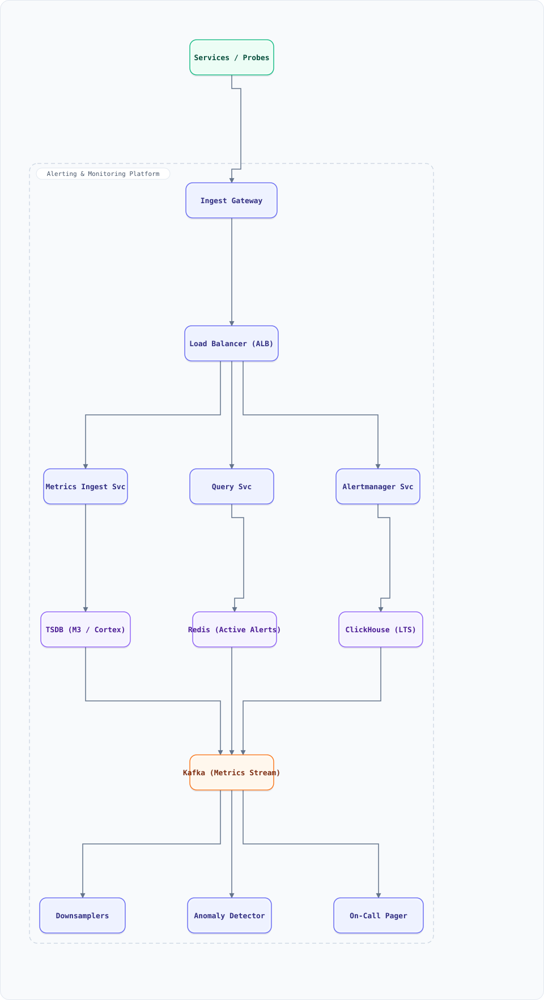

<div align="center">

# System Design: Alerting & Monitoring Platform (Prometheus-class)

</div>

> [!TIP]
> **TL;DR** — Design the observability backend for a fleet of thousands of services: metrics are scraped/emitted at scale, stored in a time-series database, queried by dashboards, evaluated by rule engines, and converted into deduplicated, routed, escalating **alerts** with on-call paging.

## Overview

Design the observability backend for a fleet of thousands of services: metrics are scraped/emitted at scale, stored in a time-series database, queried by dashboards, evaluated by rule engines, and converted into deduplicated, routed, escalating **alerts** with on-call paging. The hard problems are **write-heavy cardinality** (millions of active series), cheap **downsampling/retention** so 2-year-old data stays queryable, **anomaly detection** that doesn't cry wolf, and an alert pipeline whose own failure must never go unnoticed (meta-monitoring). This is the system that watches all the other systems — it must be the most reliable one you own.

### Key Numbers

| Metric | Value |
| ------ | ----- |
| Monitored services | 5,000+ services, 200K pods |
| Active time series | 50M active (100M total incl. stale) |
| Ingestion rate | 1M samples/sec steady, 3M/sec peak |
| Scrape/emit interval | 15s scrape, 5s agent push |
| Query load | 50K dashboard queries/min, 200 heavy queries/min |
| Retention | 15d raw (2s), 13mo downsampled (1m), 5yr (1h) |
| Alert evaluations | 500K rule evaluations/min |
| Pages during a major incident | 5-50 on-call notifications, 99% auto-resolved within 30 min |
| Storage | ~120 TB/year compressed (raw + rollups) |

## Requirements

### Functional Requirements

- Ingest metrics via pull (Prometheus scrape) and push (OTLP/StatsD) with relabeling/filtering
- Store time series with labels; support PromQL-style range/selectors/aggregations
- Dashboards: sub-second p50 panel loads, graphable 2-year ranges
- Alert rules: threshold, rate-of-change, and anomaly-based; `for:` durations to flap-guard
- Alert lifecycle: firing → dedup → group → route → escalate → resolve, with silences & maintenance windows
- On-call: schedules, rotations, escalations, acks, overrides (PagerDuty-style)
- Logs/traces correlation: link an alert panel to exemplars and traces

### Non-Functional Requirements

- Ingest path never blocks queries; 99.99% alert-pipeline availability — **an alert system that misses a page is a catastrophe**
- Query p95 < 300 ms on 6h ranges; < 2 s on 30d rollups
- Rules evaluate within 30s of data availability (15s scrape + eval slack)
- Horizontal scale by sharding series/rings; backpressure, not drops, on overload
- Multi-tenancy: per-team quota, isolated query load, cardinality limits at ingest

## High-Level Architecture

### Architecture Diagram



**Interactive diagram:** [diagrams/system-design/alerting.architecture.html](diagrams/system-design/alerting.architecture.html) — pan/zoom, search, dark/light theme, PNG/SVG export.


*Solid = metrics/alert flow, dashed = control plane / monitoring.*

### Data Flow

1. Services expose `/metrics` (pull) or push via agents; the **Ingest Gateway** validates, enforces per-team cardinality quotas, batches, and produces to **Kafka** (durable buffer — the query path never gates ingest)
2. **Metrics Ingest Svc** consumes Kafka, writes head blocks to the **TSDB** (LSM: in-memory head + WAL, flushed to immutable chunks), appends to out-of-order queue on clock skew
3. **Query Svc** fans range queries to TSDB shards, merges partially-merged results; `--downsampling` flag routes old ranges to 1m/1h rollup tables transparently
4. Rule engines (part of Alertmanager Svc) evaluate 500K rules/min against the TSDB; threshold breaches start a `for:` timer — sustained breaches become **alert instances**
5. **Alertmanager** dedups identical instances (label fingerprint), groups by routing tree, applies silences, and dispatches to the **On-Call Pager** (PagerDuty/Slack) with escalation policies
6. **Downsamplers** roll raw data into 1m/1h aggregates; **Anomaly Detector** maintains per-series EMA baselines and injects deviation series; ClickHouse keeps LTS + incident history

## Microservices

| Service | Responsibility | Scaling |
| :--- | :--- | :--- |
| Ingest Gateway | Auth, quota, relabel, batch to Kafka | Stateless, N replicas |
| Metrics Ingest Svc | Kafka → TSDB head blocks, WAL | Sharded by series hash ring |
| Query Svc | PromQL parse/plan/fan-out/merge | Stateless, N replicas |
| Alertmanager Svc | Rule eval, dedup, group, route | HA pair (gossip), sharded rules |
| Downsamplers | 1m/1h rollups, retention enforcement | Scheduled workers |
| Anomaly Detector | EMA/seasonal baselines, deviation series | Stream consumers (reads TSDB) |
| On-Call Pager | Schedules, escalations, acks | HA, stateful |
| Meta-Monitor | Watches the monitoring stack itself | Separate, independent stack |

## Database Design

### Time-Series Store (LSM, Prometheus/M3/Cortex-style)

```
series = metric name + sorted label set -> uint64 series ID (inverted index)
head:  in-memory chunks (2h), WAL (fsync batch 1s)   -> flush -> immutable segment
index: inverted label index ( postings lists, O(1) label match )
blocks: 2h immutable, compaction -> 2d -> 14d; retention GC by block age
downsample: 1m (13mo), 1h (5yr) aggregates: min/max/sum/count
```

- Write path: append to WAL + head chunk, O(1); reads: inverted index → postings intersection → chunk scan
- Dedup: identical (series, timestamp) samples idempotent — re-delivery from Kafka is safe

### Alert & Routing Store (PostgreSQL + Redis)

```sql
CREATE TABLE alert_rules (
  rule_id     BIGSERIAL PRIMARY KEY,
  team_id     INT NOT NULL,
  expr        TEXT NOT NULL,          -- PromQL
  for_dur     INTERVAL DEFAULT '5 minutes',
  severity    VARCHAR(10) NOT NULL,   -- critical | warning | info
  labels      JSONB NOT NULL,
  updated_at  TIMESTAMPTZ DEFAULT now()
);
CREATE TABLE alert_instances (
  fingerprint TEXT NOT NULL,          -- hash(labels)
  rule_id     BIGINT REFERENCES alert_rules(rule_id),
  state       VARCHAR(10) NOT NULL,   -- pending | firing | resolved
  started_at  TIMESTAMPTZ,
  last_sent   TIMESTAMPTZ,
  PRIMARY KEY (fingerprint, rule_id)
);
```

- Redis: active-alert fingerprints + group state (sub-ms checks in the dedup path), silence matchers, escalation timers (sorted sets by `fire_at`)
- Postgres: rules, schedules, incident history (audit: every state transition of every alert)

## Scaling Tiers

How the platform grows with the fleet it watches:

| Tier | Users | Infrastructure | Monthly Cost |
| ------ | ------- | --------------- | -------------- |
| 1K-10K | 10K series, 1 team | 1 Prometheus + Alertmanager + Grafana | $300 |
| 10K-1M | 1M series, 20 teams | 6 TSDB shards + HA pair + Kafka 3 + ClickHouse | $6,000 |
| 1M-10M+ | 50M series, 200 teams | 30 TSDB shards + query tier + 18-node Kafka + CH LTS + meta-stack | $60,000 |

## Key Techniques & Patterns

- **LSM-tree TSDB**: WAL + in-memory head + immutable chunks — writes are appends; compaction amortizes reads
- **Inverted label index**: series lookup by label intersection, not name scan — the trick that makes high-cardinality queries tractable
- **Kafka as ingest buffer**: decouples scrape storms from TSDB writes; replays recover failed flushes
- **Downsampling + retention tiering**: raw 2s for 15d, 1m for 13mo, 1h for 5yr — keeps dashboards fast and storage bounded
- **`for:` durations + inhibition**: flap-guarding and alert storms suppressed at the source (child alerts inhibited by parent)
- **Fingerprint dedup + grouping**: hash of labels → one notification per group per interval, not per series
- **EMA/seasonal anomaly baselines**: cheap streaming deviation detection — alarm on residual, not raw value
- **Meta-monitoring**: an independent, smaller stack watches the alerting stack itself; the watchdog cannot share fate with the watched
- **Multi-tenancy quotas**: per-team cardinality + QPS limits enforced at ingest and query — one team's label explosion can't melt the cluster

## Key Design Decisions

| Decision | Rationale | Trade-off |
| :--- | :--- | :--- |
| Kafka between ingest and TSDB | Ingest never blocks; replay on TSDB failure | Seconds of extra latency (fine for 15s scrapes) |
| LSM TSDB over B-tree | Write-heavy workload (1M samples/sec) | Compaction tuning; reads slower than B-tree for point lookups |
| Downsampling tiers | 5yr retention affordable; dashboards stay fast | Some queries need raw granularity windows |
| HA-pair Alertmanager with gossip | No SPOF on the paging path | Duplicate-notification risk → dedup via fingerprint + cluster awareness |
| Rules as data in Postgres | Versioned, auditable, per-team RBAC | Extra hop vs config files; worth it at 200 teams |
| EMA baselines over fancy ML | Explainable, streaming, cheap | Misses novel patterns — acceptable for tier-1 paging |

## Failure Modes & Recovery

| Failure | Detection | Recovery |
| :--- | :--- | :--- |
| TSDB shard down | Meta-monitor health | Kafka replays into replica shard; queries served stale-free from remaining shards with partial results flag |
| Alertmanager split | Gossip membership | HA quorum: only the leader sends; on heal, state reconciles by fingerprint |
| Kafka consumer lag | Lag per group | TSDB absorbs via backpressure; scrape interval unchanged; queries unaffected |
| Cardinality explosion (bad deploy) | Per-team series-count alarm | Ingest rejects excess labels for that team only; quota dashboards show the offender |
| On-call provider outage (PagerDuty down) | Send-failure alarm | Fallback channels: SMS/voice via second provider; escalations queue and replay |
| Anomaly detector false-positives | Page-to-ack ratio alarm | Auto-raise `for:` duration; channel to #alerts-info until recalibrated |
| Whole monitoring stack down | External watchdog (independent stack) | Last-known configs cached in agents; independent meta-stack pages via separate provider |

## Cost Estimation (1M users)

| Component | Spec | Monthly |
| ------ | ------ | ------ |
| TSDB shards | 12 × 8 vCPU/64 GB, 10 TB NVMe each | $14,000 |
| Query tier | 10 nodes | $5,000 |
| Kafka | 9 brokers, 15-day retention | $10,000 |
| ClickHouse LTS | 8 nodes, 500 TB | $16,000 |
| Alertmanager + Pager + Meta | 12 nodes + 2 paging providers | $6,000 |
| Dashboards + ops | Grafana HA + tooling | $4,000 |
| **Total** | | **~$55,000** |

## Trade-off Analysis

| Decision | Gain | Cost |
| :--- | :--- | :--- |
| Pull scraping | Auto service discovery, liveness for free | NAT/egress complexity vs push |
| Kafka ingest buffer | Resilience to TSDB outages | +1 system to operate; seconds of lag |
| Tiered downsampling | 5yr storage at 1/100th raw cost | Multi-resolution query planning |
| EMA anomaly baselines | Streaming, explainable, cheap | No multivariate/novel-pattern detection |
| Rules as Postgres data | Audit, RBAC, per-team quotas | Slower deploys than git-ops config |
| Independent meta-stack | Alerting stack itself is watched | Duplicate smaller stack to run |

## Key Metrics to Monitor

- **Ingest**: samples/sec, rejected-by-quota, out-of-order rate, WAL fsync p99
- **Query**: p50/p95 latency by range, fan-out merges/sec, cache hit rate
- **Alerting**: rules evaluated/min, eval duration p99, firing count, page-to-ack ratio, auto-resolve rate
- **Storage**: block compaction lag, head-block memory, downsample freshness, retention GC lag
- **Meta**: stack self-checks, watchdog heartbeat (alert if *this* goes quiet)

## Production Readiness Checklist

- [ ] **HA** — Alertmanager HA pair with gossip quorum; TSDB shards N+2; meta-monitoring stack in an independent failure domain
- [ ] **DR** — WAL + block replication to a second region; on-call schedules + pager config exported daily; paging-path RTO < 5 min
- [ ] **Security** — per-team ingest auth; query RBAC; silence/routing changes audited
- [ ] **Paging integrity** — dual paging providers with end-to-end delivery receipts; watchdog pages if the stack itself goes quiet
- [ ] **Quota guardrails** — per-team cardinality + QPS limits enforced at ingest; reject alarms wired to the owning team
- [ ] **Alert hygiene** — page-to-ack ratio < 20%; every rule links a runbook; flapping rules auto-quarantined to info channels
- [ ] **Data integrity** — weekly spot checks of downsampled vs raw; retention GC dry-run alarms

## Deep Dive Prompts

- Design the compaction policy: how do 2h blocks merge without stalling queries?
- How would you implement PromQL's `rate()` efficiently on out-of-order data?
- Design cardinality enforcement: where exactly do you reject, and what does the error path look like?
- How do you guarantee at-least-once *page* delivery exactly once in practice?
- Design multi-cluster federation: how do regional stacks roll up to a global view without losing 15s freshness?

## Common Interview Follow-ups (with answers)

**Q1. Why is the alerting pipeline considered the most critical path — more than the TSDB?**
Because its failure mode is silent: if the TSDB is down you lose dashboards (bad but visible); if Alertmanager fails, nothing pages while production burns — nobody notices until the incident call. That's why the pager path is an HA pair with gossip, deduped by fingerprint, and why an *independent* meta-stack (separate storage, separate paging provider, different failure domain) watches it. A watchdog must not share fate with what it watches.

**Q2. How do you prevent alert storms during a real incident?**
Three layers: (1) **grouping** — alerts sharing labels (same team/service/severity) collapse into one notification with a count; (2) **inhibition** — a "datacenter down" critical alert inhibits all its child alerts (the 400 derivative symptoms); (3) **`for:` durations + rate-of-change rules** so a flap doesn't fire until it persists. And after routing, per-channel rate limits with escalation replay anything that got squeezed.

**Q3. Why Kafka between the scrape gateway and the TSDB? Doesn't 15s freshness already tolerate delay?**
The TSDB is the component that does expensive compaction and can be down for minutes during upgrades or shard failures. Without the buffer, a TSDB outage means dropping samples forever — gaps in the record of exactly the incident you were having. Kafka turns that into *delayed* writes (replay catches up in seconds) at the cost of a few seconds of extra latency, which the 15s scrape interval already hides. Ingest is also bursty (3× peak); Kafka smooths it.

**Q4. Threshold alerts vs anomaly detection — when do you use which?**
Thresholds where the "normal" band is stable and known (disk > 85%, 5xx > 1%) — they're explainable and debuggable. Anomaly baselines (EMA with seasonal awareness) where normal is fluid — traffic-shaped metrics like QPS, latency, queue depth — because fixed thresholds either always fire at 3 a.m. lulls or never fire at peaks. The pragmatic rule: thresholds page for *known-bad*, anomalies page for *sudden-change*, and both carry reason codes ("deviation 7.2× baseline") so the on-call trusts them.

**Q5. A team's new deploy explodes label cardinality (user_id as a label). What happens?**
Per-team cardinality quotas reject the excess *at ingest* — the team's series cap is enforced in the gateway before Kafka, so the blast radius is one team, not the cluster. The team gets an immediate 4xx with a reason, a dashboard entry on the quota panel, and their pre-deploy series count keeps serving. This is why quotas are at ingest, not at query: by query time, the 50M-series flood would already be in the index and shards.

**Q6. How do you store 5 years of data without going bankrupt?**
Tiered downsampling: raw 2s samples for 15 days (incident forensics), 1m rollups (min/max/sum/count) for 13 months (seasonality, SLOs), 1h rollups for 5 years (capacity planning, compliance). Rollups compress ~100-1000× versus raw. Dashboards query the finest tier their range allows — a 30-day graph reads 1m data, not raw — and ClickHouse holds long-tail LTS. Storage math: 120 TB/yr raw becomes ~15 TB/yr of rollups.

## Low-Level Design (LLD) - Algorithms & Data Structures

### Anomaly Baseline (EMA) + Alert Dedup & Grouping

Per-series EMA baselines computed in a single streaming pass; alerts deduplicated by label fingerprint and grouped per routing key before notification.

```javascript
// Streaming EMA anomaly detector + fingerprint dedup/grouping for alerts.
class EmaBaseline {
  constructor(alpha = 0.05, devAlpha = 0.05, threshold = 6) {
    this.alpha = alpha;             // level smoothing
    this.devAlpha = devAlpha;       // deviation smoothing
    this.threshold = threshold;     // page when |residual| > threshold * sigma
    this.level = null; this.sigma = null; this.n = 0;
  }
  observe(x) {
    this.n++;
    if (this.level === null) { this.level = x; this.sigma = Math.abs(x) * 0.2 || 1; return { z: 0, page: false }; }
    const residual = x - this.level;
    this.level += this.alpha * residual;
    this.sigma = Math.sqrt((1 - this.devAlpha) * this.sigma ** 2 + this.devAlpha * residual ** 2);
    const z = residual / (this.sigma || 1);
    return { z: +z.toFixed(2), page: Math.abs(z) > this.threshold };
  }
}

class AlertGrouper {
  constructor(silenceMs = 5 * 60_000) { this.active = new Map(); this.silenceMs = silenceMs; }
  #fingerprint(labels) {
    return Object.keys(labels).sort().map(k => `${k}=${labels[k]}`).join(','); // deterministic
  }
  raise(labels, now = Date.now()) {
    const fp = this.#fingerprint(labels);
    const route = `${labels.team ?? 'default'}|${labels.severity ?? 'warning'}`;
    let g = this.active.get(route);
    if (!g) { g = { route, alerts: new Map(), lastNotified: 0 }; this.active.set(route, g); }
    const isNew = !g.alerts.has(fp);
    g.alerts.set(fp, now);
    const silenced = now - g.lastNotified < this.silenceMs;
    const shouldNotify = isNew && !silenced;
    if (shouldNotify) g.lastNotified = now;
    return { fingerprint: fp, route, shouldNotify, groupSize: g.alerts.size };
  }
  resolve(labels, now = Date.now()) {
    const fp = this.#fingerprint(labels);
    let notified = false;
    for (const g of this.active.values()) {
      if (g.alerts.delete(fp)) notified = true;
      if (g.alerts.size === 0) this.active.delete(g.route);
    }
    return { fingerprint: fp, resolved: notified };
  }
}

// --- demo: traffic spike pages once, group collapses duplicates (deterministic output) ---
const base = new EmaBaseline(0.05, 0.05, 6);
const qps = [100, 102, 98, 105, 100, 104, 99, 300, 310, 95]; // spike at index 7
qps.forEach((x, i) => { const r = base.observe(x); if (r.page) console.log(`sample ${i}: qps=${x} z=${r.z} -> PAGE`); });

const grouper = new AlertGrouper();
const mk = (svc) => ({ team: 'payments', severity: 'critical', service: svc, env: 'prod' });
console.log('raise api:', JSON.stringify(grouper.raise(mk('api'), 1000)));        // notify
console.log('raise api again:', JSON.stringify(grouper.raise(mk('api'), 2000)));  // dup, silenced
console.log('raise db:', JSON.stringify(grouper.raise(mk('db'), 3000)));          // same group, silenced
console.log('resolve api:', JSON.stringify(grouper.resolve(mk('api'), 4000)));
```

Expected: the QPS spike at sample 7 (and its echo at 8) exceed z=6 → page once; in the grouper, the first `api` alert notifies, its repeat and the `db` alert are deduped/silenced into the same `payments|critical` group, and resolve removes only the matching fingerprint — demonstrating dedup, grouping, and silencing in one trace.

## Do's & Don'ts

| ✅ Do | ❌ Don't |
| :-- | :-- |
| Pin down the key numbers before drawing boxes | Don't hand-wave the hardest component — alerting lives or dies there |
| Justify the functional requirements choice against one alternative out loud | Don't default to the trendiest store without a consistency/scale argument |
| State the failure mode of non-functional requirements explicitly (what breaks first?) | Don't present a sunny-day design only — the follow-up question is always "and when it fails?" |
| Anchor capacity numbers before proposing shards/replicas | Don't introduce a component you can't cost or size with the numbers on the board |

*More cross-topic rules: [Interview Q&A §81](interview-qa.md#81-universal-dos--donts) · Concepts: [Networking](networking.md) · [Operating Systems](operating-systems.md)*
