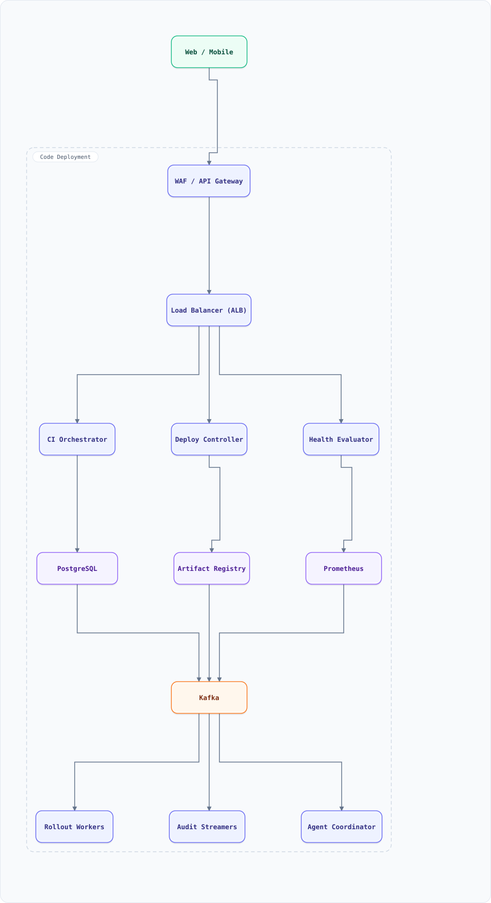

<div align="center">

# System Design: Code Deployment System (CI/CD Pipeline)

</div>

> [!TIP]
> **TL;DR** — The system that takes a git commit to thousands of production hosts safely: artifact builds, staged environments, health-checked canary rollouts, automatic rollback — blue-green and canary as first-class state machines, not vibes.

## Overview

Every commit flows: build → test → artifact → register → deploy through stages (dev/staging/prod) → canary → full fleet, with health signals and automated rollback. The design core is a **rollout state machine** plus **fleet orchestration** — deploying to 10K hosts in minutes without downtime, and undoing it faster.

### Key Numbers

| Metric | Value |
| :--- | :--- |
| **Builds/day** | 50K+ (one per merge, per service) |
| **Fleet size** | 10K–100K hosts / pods |
| **Deploy time** | full fleet in < 30 min |
| **Rollback time** | < 5 min, one command |

---

## Requirements

### Functional Requirements

- Build artifact from commit (immutable, content-addressed)
- Run test stages; gate deploys on green
- Deploy strategies: rolling, blue-green, canary with % traffic
- Automatic health-based rollback (error rate, latency, saturation)
- Deploy freezes (holidays, incidents); approvals for prod
- Full audit: who deployed what, where, when, and why

### Non-Functional Requirements

| Attribute | Target |
| :--- | :--- |
| **Pipeline latency** | commit → prod-ready artifact < 20 min |
| **Fleet rollout** | 10K hosts in < 30 min |
| **Downtime** | zero-downtime deployments mandatory |
| **Auditability** | 100% — every change attributable |

---

## High-Level Architecture

### Architecture Diagram



**Interactive diagram:** [diagrams/system-design/code-deployment.architecture.html](diagrams/system-design/code-deployment.architecture.html) — pan/zoom, search, dark/light theme, PNG/SVG export.


**Interactive diagram:** [diagrams/system-design/code-deployment.architecture.html](diagrams/system-design/code-deployment.architecture.html) — pan/zoom, search, dark/light theme, PNG/SVG export.

### Data Flow

1. Commit → webhook → CI Orchestrator: build container (cache layers), run test matrix
2. Artifact pushed to registry, content-addressed by commit SHA + config hash
3. Deploy Controller picks strategy; **Rollout Workers** apply batches to hosts (drain → update → health-check → resume)
4. Health Evaluator watches metrics/alarms per batch; breach → **pause → auto-rollback**
5. Load balancers shift traffic per strategy (canary %, blue/green flip)
6. Audit events (SSE/audit log) for every state transition; manifests in Git (GitOps)

## Microservices

| Service | Tech Stack | Database | Pattern |
| --------- | ------------ | ---------- | ---------- |
| CI Orchestrator | Go | PostgreSQL + object storage | DAG pipeline |
| Artifact Registry | Java | S3 + PostgreSQL | Content-addressed store |
| Deploy Controller | Go | PostgreSQL | Rollout state machine |
| Rollout Workers | Rust | none (lease per host) | Fleet agent protocol |
| Health Evaluator | Python | Prometheus + Kafka | SLO-based gating |

---

## Database Design

### PostgreSQL

```sql
CREATE TABLE artifacts (
  id UUID PRIMARY KEY, service TEXT, git_sha TEXT, config_hash TEXT,
  image_uri TEXT, built_at TIMESTAMPTZ, UNIQUE (service, git_sha, config_hash)
);
CREATE TABLE rollouts (
  id UUID PRIMARY KEY, service TEXT, artifact_id UUID,
  strategy TEXT,          -- rolling | blue_green | canary
  state TEXT,             -- pending|building|canary_10|canary_50|full|paused|rolled_back|done
  current_step INT, target_hosts INT, started_at TIMESTAMPTZ, finished_at TIMESTAMPTZ
);
CREATE TABLE rollout_batches (
  rollout_id UUID, seq INT, host_ids BIGINT[], state TEXT,  -- pending|draining|updated|healthy|failed
  health_snapshot JSONB, PRIMARY KEY (rollout_id, seq)
);
CREATE TABLE approvals (
  rollout_id UUID, approver TEXT, decided_at TIMESTAMPTZ, decision TEXT,
  PRIMARY KEY (rollout_id, approver)
);
```

---

## Scaling Tiers

| Tier | Users | Infrastructure | Monthly Cost |
| ------ | ------- | -------------- | ------------- |
| 1K-10K | 10K | GitHub Actions + ArgoCD | $100 |
| 10K-1M | 1M | CI cluster + registry + Deploy Controller + Kafka | $4,000 |
| 1M-10M+ | 10M+ | Multi-region CI + 100K-host agent fleet + registry CDN | $40,000 |

---

## Key Techniques & Patterns

- **Rollout state machine**: explicit states & transitions; every deploy is a resumable state, not a script run
- **Canary analysis**: compare error rate/latency of canary vs baseline cohorts (statistical gates, not eyeballs)
- **Deployment Strategies**: blue-green, rolling, canary (concepts §47)
- **Leases**: per-host update leases so two workers never touch one host
- **Idempotency**: batch application is idempotent per (rollout, batch) — retries safe
- **GitOps**: desired state in Git; controller reconciles drift

---

## Key Design Decisions

1. **Immutable, content-addressed artifacts**: same SHA + config = same bytes; promotes (not rebuilds) across environments
2. **Health-gated batches over blind rolling update**: fleet-wide brokenness caught at batch 2 of 100
3. **Agent pull, not controller push**: hosts pull work; controller never needs inbound access to fleets
4. **Deployment ≠ release**: deploy to fleet, release via LB/feature-flag % — independent risk levers
5. **One-click rollback = redeploy previous artifact**: no special code path; rollback is just another rollout

---

## Failure Modes & Recovery

| Failure | Impact | Mitigation |
| --------- | -------- | ----------- |
| Canary regression | User-facing errors | Auto-rollback on SLO breach (2-min window) |
| Worker crash mid-batch | Half-updated batch | Leases expire → another worker resumes; idempotent steps |
| Registry outage | No new deploys (current fleet fine) | Registry HA + edge pull-through cache |
| Bad health signal | Healthy deploys roll back | Multi-signal gates; baseline comparison |
| Config drift | Host diverges from Git | Reconciliation loop re-converges |

---

## Cost Estimation (1M Users)

| Component | Configuration | Monthly Cost |
| ----------- | -------------- | ------------- |
| CI runners (auto-scaled) | 200 vCPU spot | $1,500 |
| Registry + storage | 5TB artifacts | $400 |
| Deploy Controller HA | c7g.large ×3 | $300 |
| Rollout agents (on hosts) | negligible | $50 |
| Kafka + metrics | m7g.large ×3 | $900 |
| **Total** | | **~$3,150** |

---

## Trade-off Analysis

| Decision | Option A | Option B | Choice | Why |
| ---------- | ---------- | ---------- | -------- | ----- |
| Strategy default | Rolling | Canary + auto-rollback | Canary | Catches regressions at 1% blast radius |
| Host update | Controller pushes | Agent pulls | Pull | NAT-friendly, scales to 100K hosts |
| Artifact | Rebuild per env | Promote artifact | Promote | Same bytes tested = same bytes prod |
| State | Ephemeral script | DB state machine | State machine | Resumable, auditable, pausable |
| Config | Beside code | Separate repo + envs | GitOps repo | Audit + drift detection |

---

## Key Metrics to Monitor

1. Build success rate & pipeline duration P95
2. Rollout duration per service; batches/minute
3. Auto-rollback rate (any spike = investigate)
4. Canary-vs-baseline error/latency delta
5. Agent check-in success rate
6. Registry pull latency (cold vs warm)
7. Deployment freeze violations (target: 0)

---

## Deep Dive Prompts

1. Design canary analysis without a "baseline" when the service is new.
2. How would you deploy a schema migration *before* the code that needs it (expand→migrate→contract)?
3. Design multi-region deployment ordering (e.g., internal regions first).
4. How would you deploy ML models (shadow traffic, champion/challenger)?
5. Design a build cache that makes 95% of builds < 2 min (content-addressed CAS).

---

## Common Interview Follow-ups

1. Blue-green vs canary — when does the choice flip?
2. How do you handle stateful services (DBs, queues) during rollout?
3. How do you keep 100K agents from hammering the controller at 9am? (jittered pull)
4. How do you deploy to a fleet where 3% of hosts are unhealthy pre-deploy?
5. What does "deployment" vs "release" mean and why does the separation matter?

---

## Low-Level Design (LLD) - Algorithms & Data Structures

### Canary Rollout State Machine + Auto-Rollback

```text
class Rollout {
  constructor(service, hosts, artifact) {
    this.service = service; this.artifact = artifact;
    this.steps = [1, 5, 10, 25, 50, 100];           // % of hosts
    this.stepIdx = 0; this.state = "pending"; this.health = { errorRate: 0, p99: 120 };
  }

  tick() {                                            // evaluator runs each tick
    if (this.state === "running") {
      if (this.unhealthy()) { this.state = "rolled_back"; return this.report("SLO breach -> rollback"); }
      if (this.progressed()) this.state = this.stepIdx >= this.steps.length ? "done" : "running";
      else this.nextBatch();
    }
    return this.state;
  }
  progressed() { return false; }                      // batches complete asynchronously
  nextBatch() { this.stepIdx++; this.state = "running"; }
  unhealthy() { return this.health.errorRate > 0.01 || this.health.p99 > 400; }
  report(m) { return `${this.service} @ ${this.steps[this.stepIdx]}%: ${m}`; }
}

const r = new Rollout("checkout", 1000, "sha:abc123");
r.state = "running"; r.health = { errorRate: 0.02, p99: 450 }; // breach at 5%
console.log(r.tick()); // "checkout @ 5%: SLO breach -> rollback"

// Jittered agent pull so 100K hosts don't stampede at 9:00:00
function jitteredInterval(hostCount, windowSec = 300) {
  return (hostId) => (hostId * 2654435761 % windowSec);  // Knuth spread over 5 min
}
```
### Deployment State Machine (the safe-transition core)

Every deploy is a state machine; every "how did prod break" story is an illegal transition. Encode the legal ones.

```js
const LEGAL = {
  idle:         ['building', 'failed'],                // failed → building = retry
  building:     ['deploying', 'failed', 'cancelled'],
  deploying:    ['verifying', 'failed', 'rolling_back'],
  verifying:    ['completed', 'rolling_back'],         // canary metrics decide
  completed:    ['idle'],                              // terminal → next deploy starts fresh
  rolling_back: ['idle', 'failed'],                    // rollback_ok → idle, else failed
  failed:       ['building'],
  cancelled:    ['idle'],
};
const EVENTS = {
  start_build: 'building',  build_ok: 'deploying', build_fail: 'failed',
  deploy_ok: 'verifying',   deploy_fail: 'failed',  canary_bad: 'rolling_back',
  verify_ok: 'completed',   verify_bad: 'rolling_back',
  rollback_ok: 'idle',      rollback_fail: 'failed', cancel: 'cancelled',
};
class DeployFSM {
  constructor() { this.state = 'idle'; this.epoch = 0; }
  transition(event) {
    const next = EVENTS[event];
    if (!(LEGAL[this.state] || []).includes(next)) throw new Error(`illegal: ${event} in ${this.state}`);
    if (next === 'rolling_back') this.epoch++;          // fencing token (§34): stale workers stop
    this.state = next;
    return this.epoch;
  }
}
const fsm = new DeployFSM();
['start_build','build_ok','deploy_ok','canary_bad','rollback_ok'].forEach(e => fsm.transition(e));
console.log(fsm.state, 'epoch', fsm.epoch);             // idle epoch 1 — rolled back cleanly
```

The **epoch counter** is the interview-grade detail: when a rollback starts, the epoch increments and every still-running canary worker embeds the token in its requests — the LB rejects stale-epoch traffic, so a zombie canary can never serve after the rollback it lost the race to.
