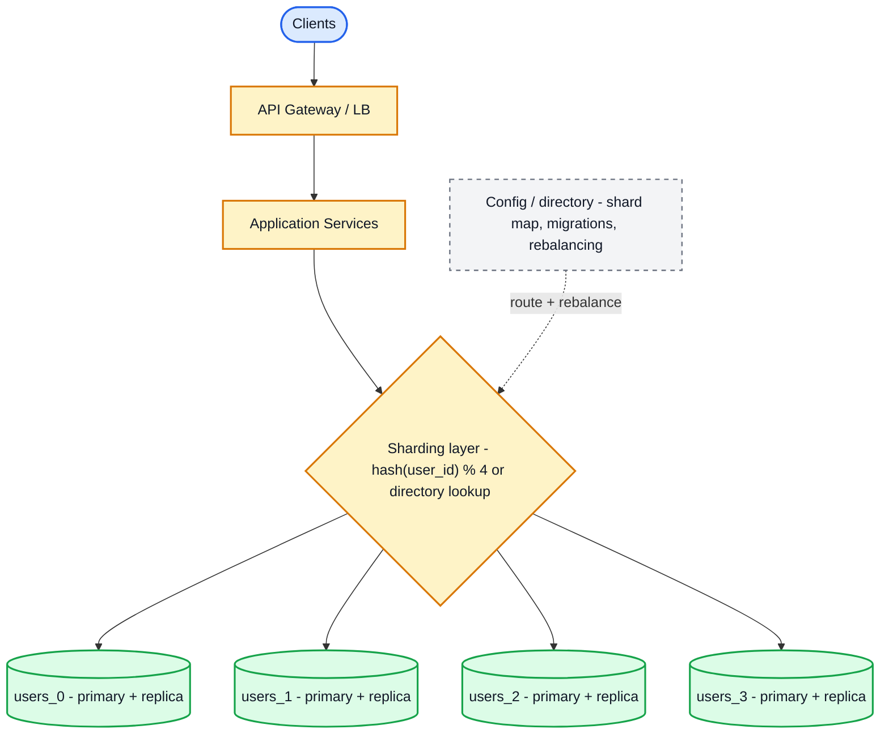
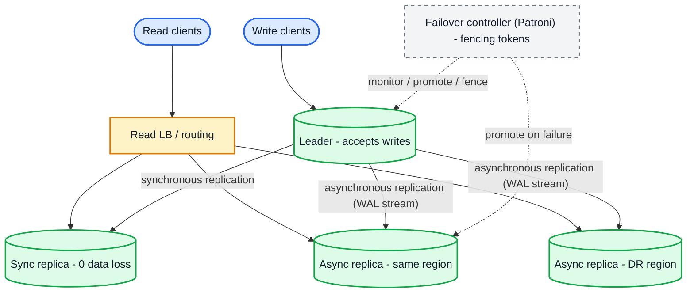

# System Design Concepts — Quick Reference with Basic Examples

The foundational concepts behind every distributed system, each explained in a few lines with a tiny, concrete example: **sharding, consistent hashing, CAP, ACID vs BASE, SOLID, CQRS, event sourcing, saga, outbox, idempotency, circuit breaker, rate limiting, load balancing, leader election, replication, caching, bloom filters, gossip, vector clocks, Merkle trees, consensus (Raft/Paxos), two-phase commit, CRDTs, event-driven architecture, DLQs and backpressure.**

---

## Table of Contents

1. [Sharding (Data Partitioning)](#1-sharding-data-partitioning)
2. [Consistent Hashing](#2-consistent-hashing)
3. [CAP Theorem](#3-cap-theorem)
4. [ACID vs BASE](#4-acid-vs-base)
5. [SOLID Principles](#5-solid-principles)
6. [CQRS (Command Query Responsibility Segregation)](#6-cqrs-command-query-responsibility-segregation)
7. [Event Sourcing](#7-event-sourcing)
8. [Saga Pattern](#8-saga-pattern)
9. [Outbox Pattern](#9-outbox-pattern)
10. [Idempotency](#10-idempotency)
11. [Circuit Breaker](#11-circuit-breaker)
12. [Rate Limiting](#12-rate-limiting)
13. [Load Balancing](#13-load-balancing)
14. [Leader Election](#14-leader-election)
15. [Replication Topologies](#15-replication-topologies)
16. [Caching Strategies](#16-caching-strategies)
17. [Bloom Filter](#17-bloom-filter)
18. [Gossip Protocol](#18-gossip-protocol)
19. [Vector Clocks & Conflict Resolution](#19-vector-clocks--conflict-resolution)
20. [Dead Letter Queue](#20-dead-letter-queue)
21. [Backpressure](#21-backpressure)
22. [Merkle Trees (Anti-Entropy)](#22-merkle-trees-anti-entropy)
23. [Consensus Algorithms (Raft & Paxos)](#23-consensus-algorithms-raft--paxos)
24. [Two-Phase Commit (2PC) vs Saga](#24-two-phase-commit-2pc-vs-saga)
25. [CRDTs — Conflict-Free Replicated Data Types](#25-crdts--conflict-free-replicated-data-types)
26. [Event-Driven Architecture](#26-event-driven-architecture)
27. [Quick Map: Concept → Problem Solved](#27-quick-map-concept--problem-solved)

---

## 1. Sharding (Data Partitioning)

**Problem:** one database can't hold the writes/reads of a billion users.
**Idea:** split the data horizontally across many database nodes; each node ("shard") owns a disjoint subset of rows. Together they serve the whole dataset.



*Every query must carry the shard key so the router stays stateless; config service supports directory-based sharding and re-sharding (see below).*

Three common strategies:

| Strategy | Rule for choosing a shard | Strength | Weakness |
| -------- | ------------------------- | -------- | -------- |
| **Hash-based** | `shard = hash(shard_key) % N` | even distribution | range queries hit all shards; re-sharding moves almost everything |
| **Range-based** | shard owns `id 1..1M`, next owns `1M..2M`, ... | great for range scans (time series, id ranges) | hot shard for new data (e.g. latest ids) |
| **Directory-based** | lookup table: `key → shard` | full control, easy migration | the directory is a single point / extra hop |

```text
// Hash sharding
shardId = hash(userId) % 4        // user 99 → shard 3
// DB shards
users_0   users_1   users_2   users_3

// Query must ALWAYS carry the shard key
SELECT * FROM users_3 WHERE id = 99        // knows the shard from the key

// Range sharding (time-series)
events_2026_Q1   events_2026_Q2   events_2026_Q3
```

```sql
-- Real example: shard orders by tenant/user so one user's rows stay together
CREATE TABLE orders_0 (LIKE orders INCLUDING ALL);  -- schema copy per shard
CREATE TABLE orders_1 (LIKE orders INCLUDING ALL);
-- app: shard = user_id % 2  →  route the query to orders_0 or orders_1
```

**Costs & rules of thumb:**

- Pick a **shard key with high cardinality and even access** (user_id good; country bad — a few giant countries overheat).
- **Secondary indexes don't span shards** — index by non-shard-key = query every shard (scatter-gather).
- **Joins & transactions across shards are painful** — shard by the entity that must stay together (a user and all their data).
- Re-sharding (adding shards) with `% N` moves ~all keys — that's exactly why **consistent hashing** (§2) exists.

---

## 2. Consistent Hashing

**Problem:** with `hash(key) % N`, adding or removing one node remaps almost every key → mass cache misses / data migration.
**Idea:** put both nodes and keys on a hash **ring** (0..2³²); each key goes clockwise to the *first* node it meets. When a node joins/leaves, **only the keys between it and its clockwise neighbor move**.

```text
       node C ◄─────────────── key 5, key 9, key 1
      /
  ring (hash space 0..2^32)
      \
       node A ◄── key 3, key 8        ← key 3 lands on A
```

```js
// Minimal consistent-hash ring
const ring = new Map();            // position -> node
const NODE_COUNT = 3;

function hash(x) {                 // pretend: uniform in [0, 360)
  let h = 0;
  for (const c of String(x)) h = (h * 31 + c.charCodeAt(0)) % 360;
  return h;
}

function addNode(node)  { ring.set(hash(node), node); }
function removeNode(node){ ring.delete(hash(node)); }

function findNode(key) {
  const pos = hash(key);
  // first node clockwise (wrap around); keys() sorted ascending
  for (const [p, node] of ring) if (p >= pos) return node;
  return ring.values().next().value;   // wrapped past 360
}

addNode("A"); addNode("B"); addNode("C");

// Adding node D moves only the keys between D and its clockwise neighbor
console.log(findNode("user:42"));   // always the SAME node while ring is unchanged
```

**Virtual nodes** fix the balance problem: each physical node occupies *many* ring positions (e.g. `A-0..A-199`), so hash randomness evens out and removals redistribute smoothly. When one node dies, its keys spread across *all* remaining nodes (not just one neighbor).

Used in: DynamoDB/Cassandra, Memcached/Redis client-side sharding, CDN edge caches, load balancers that need sticky routing.

---

## 3. CAP Theorem

**Problem:** in a distributed system, a network partition (P) is not a matter of *if* but *when*.
**Idea:** during a partition you must choose between **Consistency** (all nodes return the latest write or an error) and **Availability** (every request gets a response, possibly stale). You can't have all three simultaneously — pick **CP** or **AP** per system.

```
        Consistency
            ▲
           / \
          /   \
         /  CA  \     ← impossible during a real partition
        /  (rare) \
       ▼───────────▶ Availability
      CP            AP
   (ZooKeeper,  (Cassandra, DynamoDB,
    HBase,       Redis Cluster AP mode,
    Postgres     most caches)
    single-node)
```

```text
// Network partition between replica R1 and R2. Client asks R2:
//   "what is the balance of account 42?"
CP answer  → "error: can't confirm with majority"   (correct, but unavailable)
AP answer  → "here's my copy: $100"                  (available, may be stale)
```

**Trade-off in practice:** banks & payment systems → CP (never double-spend). Feeds, likes, leaderboards → AP (eventual consistency is fine). Databases are usually CP (or CA within one node); caches lean AP.

---

## 4. ACID vs BASE

Two philosophies for how a data store behaves under concurrency and failure.

| | ACID (relational) | BASE (distributed NoSQL / caches) |
| -- | ----------------- | --------------------------------- |
| A | **Atomicity** — all-or-nothing | **Basically Available** — system stays up |
| C | **Consistency** — constraints hold after every tx | **Soft state** — data may drift between nodes |
| I | **Isolation** — concurrent txs don't interfere | **Eventually consistent** — converges over time |
| D | **Durability** — committed = survives crash | (still want replication for durability) |
| Example | PostgreSQL, MySQL | Cassandra, DynamoDB, Redis-as-cache |

```sql
-- ACID example (Postgres): transfer is atomic — both updates or neither
BEGIN;
UPDATE accounts SET balance = balance - 100 WHERE id = 1;
UPDATE accounts SET balance = balance + 100 WHERE id = 2;
COMMIT;
```

```text
-- BASE example: a "like counter" propagated via async events
like-service increments → publishes to Kafka → followers apply it.
Read your own like a moment later? It may not be reflected yet (soft state).
Read it 500 ms later? Consistent (eventually).
```

Rule of thumb: start ACID for anything involving money/truth; add BASE components (caches, analytics, feeds) around it deliberately.

---

## 5. SOLID Principles

Five object-oriented design rules that keep code maintainable. Each one with a tiny before/after.

### S — Single Responsibility

A class should have **one reason to change**.

```js
// ✗ BAD: this class changes when reporting, storage, OR user rules change
class UserService {
  saveUser(u) { /* db */ }
  sendWelcomeEmail(u) { /* smtp */ }
  buildUserReport() { /* csv */ }
}

// ✓ GOOD: three classes, each with one job
class UserRepository { saveUser(u) { /* db */ } }
class WelcomeMailer   { send(u) { /* smtp */ } }
class UserReporter    { buildReport() { /* csv */ } }
```

### O — Open/Closed

Open for **extension**, closed for **modification**: add behavior by adding code, not editing existing code.

```js
// ✗ BAD: adding a new payment type means editing this method
class PaymentProcessor {
  charge(type, amount) {
    if (type === 'card') { /* card logic */ }
    else if (type === 'upi') { /* upi logic */ }   // ← edit here each time
  }
}

// ✓ GOOD: extend by adding a strategy
const strategies = {
  card: { charge: (a) => { /* card */ } },
  upi:  { charge: (a) => { /* upi */ } },
};
function charge(type, amount) { return strategies[type].charge(amount); }
// new type → new entry in `strategies`, existing code untouched
```

### L — Liskov Substitution

Subtypes must be usable wherever their base type is expected, **without breaking behavior**.

```js
// ✗ BAD: a Square is-a Rectangle, but breaks setWidth's contract
class Rectangle { setWidth(w) { this.w = w; } }
class Square extends Rectangle {
  setWidth(w) { this.w = w; this.h = w; }   // breaks callers that set w then read h
}

// ✓ GOOD: don't force inheritance; separate shape
class Square { constructor(side) { this.side = side; } }
```

### I — Interface Segregation

Don't force clients to depend on methods they don't use — split fat interfaces.

```js
// ✗ BAD: an InkjetPrinter must implement scan(), which it can't do
class Printer { print(); scan(); fax(); }

// ✓ GOOD: small, focused interfaces the client chooses from
class Printer { print(); }
class Scanner { scan(); }
class MultiFunctionPrinter extends Printer, Scanner { /* has both */ }
```

### D — Dependency Inversion

Depend on **abstractions**, not concrete details.

```js
// ✗ BAD: NotificationService is welded to the concrete email sender
class NotificationService {
  constructor() { this.sender = new EmailSender(); }  // hard to test / swap
}

// ✓ GOOD: depend on the abstraction; inject the implementation
class MessageSender { send(msg) {} }                 // the abstraction (interface)
class EmailSender extends MessageSender { send(m) { /* SMTP */ } }
class SmsSender   extends MessageSender { send(m) { /* SMS */ } }
class FakeSender  extends MessageSender { send(m) { /* tests */ } }
class NotificationService {
  constructor(sender) { this.sender = sender; }      // any MessageSender works
}
new NotificationService(new EmailSender());          // prod
new NotificationService(new SmsSender());            // added later — no edit to service
new NotificationService(new FakeSender());           // tests
```

---

## 6. CQRS (Command Query Responsibility Segregation)

**Problem:** the same model can't be optimal for both *writes* (normalized, transactional) and *reads* (denormalized, aggregated, searchable).
**Idea:** split the model — **commands** (writes) go to one store, **queries** (reads) go to a separate read-optimized store. A projection keeps the read model in sync (sync call, CDC, or events).

```
                 ┌─────────────── write path ───────────────┐
  client ──POST──► CommandService ──► PostgreSQL (source of truth)
                 └──────────────────────────────────────────┘
                 ┌─────────────── read path ────────────────┐
  client ──GET───► QueryService ──► Elasticsearch / read replica
                    ▲                    ▲
                    └──── projection (events / CDC) ────────┘
```

```text
// Example: order service
// WRITE (command): validate stock, insert order row in Postgres  → status 'created'
// READ (query):    dashboard shows pre-joined "orders + products + customer"
//                  served from a denormalized projection in Elasticsearch
// Sync: the order insert publishes an event; a projection worker updates the read model.
```

**When:** read-heavy apps with complex queries, event-sourced systems, reporting. **When not:** CRUD apps where reads are simple — CQRS is extra machinery.

---

## 7. Event Sourcing

**Problem:** storing only the current state loses *why* it became that state (audit, replay, debugging, rebuilding projections).
**Idea:** instead of (or alongside) the current state, store the **append-only sequence of events** that changed it. Current state = fold/replay the events.

```
Bank account 42 — events (append-only, immutable):
  AccountOpened        { amount: 0    }
  MoneyDeposited       { amount: +500 }
  MoneyWithdrawn       { amount: -100 }
  MoneyDeposited       { amount: +25  }

balance now = 0 + 500 - 100 + 25 = $425     ← derived by replay
```

```js
// Replay = reduce over events
const balance = events
  .filter(e => e.accountId === 42)
  .reduce((bal, e) =>
    e.type === 'MoneyDeposited'  ? bal + e.amount :
    e.type === 'MoneyWithdrawn'  ? bal - e.amount : bal, 0);

// A NEW projection (e.g. "monthly statement") can be built from history
// without re-running the business logic that produced today's rows.
```

**Rules:** events are immutable (never edit history — append corrections); event schema evolves (versioning); snapshot every N events to avoid replaying forever. Kafka is the natural event log (see `kafka-features.md`); CQRS usually pairs with it (write events, project read models).

---

## 8. Saga Pattern

**Problem:** a business flow spans several services, each with its own DB — there is no cross-service transaction.
**Idea:** split the flow into local transactions; if one fails, run **compensating actions** for the already-completed steps. Two flavors:

| | Choreography | Orchestration |
| -- | ------------ | ------------- |
| Coordination | each service listens for events and acts | a central orchestrator calls each service |
| Example | order → event → inventory → event → payment | OrderSaga service drives step by step |
| Pro | no central point, simple | easy to see/control the flow |
| Con | flow is implicit, hard to debug | orchestrator is a single point |

```
Orchestrated "place order" saga:

  OrderSaga: 1) OrderService.createOrder ───────────────► OK
             2) InventoryService.reserve(id) ───────────► OK
             3) PaymentService.charge(card) ────────────► FAIL ❌
  compensation: 2b) InventoryService.release(id)         ← undo step 2
                1b) OrderService.cancelOrder(id)         ← undo step 1
  final state: order cancelled, stock released, no money moved
```

```text
// Choreography version — each service reacts to events and emits the next:
OrderService  creates order          → publishes OrderCreated
InventorySvc  OrderCreated → reserve → publishes StockReserved   (or StockFailed)
PaymentSvc    StockReserved → charge → publishes PaymentCharged (or PaymentFailed → StockReleased)
ShippingSvc   PaymentCharged → ship → publishes OrderShipped
```

**Key:** compensations must be *idempotent* (re-running them is safe) — that's why §10 matters.

---

## 9. Outbox Pattern

**Problem:** "write to my DB **and** publish to Kafka" in two steps can half-fail (DB committed, event lost → other services never hear about it).
**Idea:** write the entity **and** the event row in the **same DB transaction**. A separate **relay/outbox publisher** reads committed outbox rows and publishes them to Kafka, deleting/marking them after. If the publish fails, the row is still there to retry.

```sql
-- 1) app code: ONE transaction does both
BEGIN;
INSERT INTO orders (id, user_id, total) VALUES (1001, 42, 99.50);
INSERT INTO outbox (event_id, topic, payload, created_at)
VALUES ('evt_1', 'order-created', '{"orderId":1001,"userId":42}', now());
COMMIT;                       -- both or neither — no half state

-- 2) outbox relay worker (separate process):
--    SELECT * FROM outbox ORDER BY created_at LIMIT 100
--    → publish each row to Kafka → DELETE row (or mark published)
--    retries forever on Kafka failure; exactly-once-ish via idempotent consumers
```

**Why it exists:** dual-write (call DB, then call Kafka from the app) has a race — DB commit succeeds, process crashes before Kafka call → event permanently lost. The outbox makes the DB the single source of truth for both data *and* events. (Debezium CDC on the outbox table is an even more decoupled variant — see `kafka-features.md`.)

---

## 10. Idempotency

**Problem:** retries (timeouts, at-least-once delivery, double-clicks) cause duplicate charges/orders/emails.
**Idea:** make an operation safe to repeat — the **first** attempt has an effect; repeats return the same result. Enforce at the API (idempotency key), at the store (unique constraint), and at the worker (dedupe).

```text
// API level: client sends an idempotency key on retries
POST /payments        { amount: 100, idempotencyKey: "abc-123" }
   → server: if key "abc-123" seen before, return the SAME stored response
   → else process and cache response under the key for ~24h

// Store level: a unique constraint makes double-insert impossible
```

```sql
CREATE TABLE payment_attempts (
  idempotency_key TEXT PRIMARY KEY,   -- duplicate insert fails with a unique violation
  order_id BIGINT NOT NULL,
  status   TEXT NOT NULL DEFAULT 'processing'
);

INSERT INTO payment_attempts (idempotency_key, order_id)
VALUES ('abc-123', 1001)
ON CONFLICT (idempotency_key) DO NOTHING;   -- second attempt: no-op, not a double charge
```

**Where to enforce:** 1) API with `Idempotency-Key` headers; 2) DB with unique constraints / `ON CONFLICT`; 3) consumers by tracking processed event ids (`processed_events` table or a Redis `SET`). Do at least two layers for payments.

---

## 11. Circuit Breaker

**Problem:** when a downstream service is failing, every caller retrying synchronously makes it worse (retry storm, thread exhaustion) and calls fail slowly.
**Idea:** wrap calls in a breaker with three states — **closed** (normal), **open** (fail fast, don't call), **half-open** (probe with a few requests to see if it recovered).

```
  closed ──(failure rate > threshold, e.g. 50% of last 20 calls)──► open
     ▲                                                              │
     │                 (after 30s cool-down → a few trial requests) │
     └────────────── success ───────────── half-open ◄──────────────┘
                            (failure → back to open)
```

```js
// Concept — the state machine behind libraries (resilience4j, Hystrix, Polly)
const breaker = { state: 'CLOSED', failures: 0, openedAt: null };

function callService() {
  if (breaker.state === 'OPEN') {
    if (Date.now() - breaker.openedAt > 30_000) breaker.state = 'HALF_OPEN';
    else return fallback();                      // fail fast
  }
  try {
    const result = downstream.call();
    breaker.failures = 0;                        // success resets
    if (breaker.state === 'HALF_OPEN') breaker.state = 'CLOSED';
    return result;
  } catch (e) {
    if (++breaker.failures >= 10) {              // 10 in a row → open
      breaker.state = 'OPEN';
      breaker.openedAt = Date.now();
    }
    return fallback();
  }
}
```

Always pair with a **fallback** (cached value, default, error) and stream **metrics** — a breaker is only useful if you can see it tripping. Compare: *retry* (with backoff) for transient errors, *circuit breaker* for sustained outages, *rate limiter* for protecting yourself, *bulkhead* for isolating failures per dependency.

---

## 12. Rate Limiting

**Problem:** one abusive client (or a buggy loop) can take down the whole service.
**Idea:** cap requests per key (user/IP/token) over a time window. Classic algorithms (implemented fully in `system-design-rate-limiter.md`):

| Algorithm | Behavior | Analogy |
| --------- | -------- | ------- |
| Fixed window | N requests per minute (per calendar minute) | cheap; boundary bursts (59→00 resets) |
| Sliding window log | exact count over last N seconds | precise, memory heavy |
| Sliding window counter | weighted previous + current window | good accuracy, low memory |
| Token bucket | refill r tokens/sec, burst up to capacity b | allows bursts, smooths average |
| Leaky bucket | fixed output rate, drops overflow | shapes traffic to a constant rate |

```js
// Token bucket — the interview favorite, in ~10 lines
class TokenBucket {
  constructor(capacity, refillPerSec) {
    this.capacity = capacity;
    this.tokens = capacity;
    this.rate = refillPerSec;
    this.last = Date.now();
  }
  allow() {
    const now = Date.now();
    this.tokens = Math.min(this.capacity,
                           this.tokens + ((now - this.last) / 1000) * this.rate);
    this.last = now;
    if (this.tokens < 1) return false;   // deny (HTTP 429 + Retry-After)
    this.tokens -= 1;
    return true;                         // allow
  }
}
```

Distributed rate limiting needs a shared atomic store — Redis `INCR`/Lua (see `redis-features.md` §4). Always answer: *what happens when the limiter itself is down?* (fail-open vs fail-closed).

---

## 13. Load Balancing

**Problem:** many servers, one entry point — who gets each request?
**Idea:** a load balancer (LB) distributes traffic across healthy backends and removes unhealthy ones (health checks).

| Strategy | How it picks | Use when |
| -------- | ------------ | -------- |
| Round robin | server 1, 2, 3, ... | uniform servers, uniform work |
| Weighted round robin | bigger servers get more | heterogeneous hardware |
| Least connections | fewest active requests | uneven request durations |
| Least response time | fastest recent p99 | latency-sensitive |
| IP hash / consistent hashing | same client → same server | sticky sessions, cache locality |
| Random | uniform random pick | simplicity |

```nginx
# nginx: round robin + health check (concept)
upstream api_servers {
    server 10.0.0.1:8080 weight=3;   # faster box gets 3x traffic
    server 10.0.0.2:8080;
    server 10.0.0.3:8080;
}
server { location / { proxy_pass http://api_servers; } }
```

Two layers: **L4** (TCP — fast, no content awareness) and **L7** (HTTP — path/host/cookie routing, used by API gateways). DNS round robin is the poor-man's LB (no health checking).

---

## 14. Leader Election

**Problem:** for many tasks exactly **one** replica must act (single writer, scheduler, coordinator) — and if it dies, another must take over.
**Idea:** replicas race to acquire a lock/lease with a **TTL (heartbeat)**; the holder renews periodically. When it stops renewing (crash, network split), the lease expires and another replica wins. Systems: ZooKeeper (ephemeral sequential znodes), etcd (leases), Redis (`SET NX PX`), or Postgres advisory locks.

```text
Replica A  → acquires lease: SET leader_lock "A" NX PX 10000   → A is leader
Replica B  → SET leader_lock ... → (nil)                       → A holds it; B is standby
A          → renews every ~3s (PX 10000)                        → stays leader
A crashes  → no renewals → after 10s the key expires
Replica B  → SET leader_lock "B" NX PX 10000 → OK               → B is the new leader
```

```js
// Pseudocode: the standby loop
while (true) {
  if (acquireLock('leader_lock', 'B', ttlMs)) {   // SET NX PX
    runAsLeader();                                 // heartbeat + work
  } else {
    await sleep(1000);                             // wait and retry
  }
}
```

**Danger — split brain:** with slow networks, the old leader may still think it's leader while the new one takes over (clock/latency). **Fencing tokens** fix it: each lease has an increasing token, and the resource (DB row, filesystem) rejects writes with a stale token. Async replica promotion has the same hazard — see §15.

---

## 15. Replication Topologies

**Problem:** one server = single point of failure + limited read throughput.
**Idea:** keep copies of data on multiple nodes and keep them in sync.



*Solid = data path, dashed = control. Async replicas serve reads and are promoted on failure; fencing tokens stop the old leader from writing after promotion (§14).*

| Topology | Writes | Reads | Example |
| -------- | ------ | ----- | ------- |
| **Single-leader** | all to the leader, followers replicate | followers (may lag) | PostgreSQL streaming, MySQL |
| **Multi-leader** | any leader (conflicts!) | any node | cross-region, collaborative editing |
| **Leaderless** | quorum `W + R > N` | any node | Cassandra, DynamoDB |

```text
Single-leader:
   app ──WRITE──► leader ──replicate──► follower1 ──READ──► app
                                   └──► follower2
   • async replication = fast, but a crash can lose the last writes + stale reads
   • sync = no loss, but a slow follower slows every write
   • promotion: follower → leader. If the old leader rejoins, it must not accept
     writes anymore (split brain!) — same fencing problem as §14

Leaderless quorum (N=3, W=2, R=2):
   write to 2 of 3, read from 2 of 3 → at least one node overlaps → strong-ish
   but concurrent writes need conflict handling → vector clocks (§19)
```

**Replication lag** causes: reading your own write (fix: read-your-writes routing), monotonic reads (fix: read from same replica per user), and lagged analytics (usually fine). Don't assume replicas are current — know your target staleness.

---

## 16. Caching Strategies

**Problem:** the DB can't serve every read; latency matters.
**Idea:** keep hot data in a faster layer (Redis, CDN, in-memory) close to the request.

| Pattern | Behavior | Notes |
| ------- | -------- | ----- |
| **Cache-aside** | app checks cache → miss → reads DB → fills cache | standard; cache holds only what's asked |
| **Read-through** | cache library loads from DB on miss | app code simpler |
| **Write-through** | writes go to cache AND DB | always fresh, write latency ↑ |
| **Write-back / behind** | write cache now, flush to DB later | fast writes, risk of loss |
| **Tiered** | L1 in-process → L2 Redis → DB | hot + shared |

```js
// Cache-aside (see redis-features.md §2 for the full example)
function getUser(id) {
  const hit = redis.get(`user:${id}`);
  if (hit) return JSON.parse(hit);                 // HIT
  const row = db.findUser(id);                     // MISS → fall through
  redis.set(`user:${id}`, JSON.stringify(row), 'EX', 300);
  return row;
}
// On update: db.updateUser(...); redis.del(`user:${id}`);   // invalidate, don't write-through
```

**Eviction** when full: LRU (recency), LFU (frequency), TTL (age) — Redis `allkeys-lru` etc. **Invalidation is the hard problem**: delete-on-write + short TTL backstop; PostgreSQL `LISTEN/NOTIFY` for cross-service invalidation (`postgresql-features.md` §5). **Stampede**: many requests miss simultaneously on expiry → add TTL jitter or a single-filler lock (Redis `SETNX`).

---

## 17. Bloom Filter

**Problem:** "have we seen this before?" checks (dedupe URL, cache-miss guard, DB lookup guard) over billions of items — a real set won't fit in memory.
**Idea:** a compact **bit array + k hash functions**. Insert = set k bits; membership = all k bits set. Answer is **"definitely not in set"** (no false negatives) or **"probably in set"** (small false-positive rate ε).

```js
// Minimal bloom filter (m = bit size, k = hash count)
class BloomFilter {
  constructor(m, k) { this.bits = new Uint8Array(m); this.k = k; }
  _hashes(x) {           // k different hash values
    const out = [];
    let h = 0;
    for (let i = 0; i < this.k; i++) {
      for (const c of x) h = (h * 31 + c.charCodeAt(0) + i * 97) >>> 0;
      out.push(h % this.bits.length);
    }
    return out;
  }
  add(x)    { for (const i of this._hashes(x)) this.bits[i] = 1; }
  maybeHas(x) { return this._hashes(x).every(i => this.bits[i] === 1); }
}

const bf = new BloomFilter(1000, 7);
bf.add("https://a.com/page");
bf.maybeHas("https://a.com/page");   // true
bf.maybeHas("https://b.com/other");  // false — guaranteed correct ("definitely not seen")
// occasionally a non-member returns true ("probably seen") — that's the price of 1 KB
```

**Where:** Cassandra/DynamoDB avoid disk reads for missing keys (before a read, check bloom — miss means skip the read), web crawlers dedupe URLs, CDNs decide "do we even have this cache key?", BigTable, Ethereum light clients, databases (RocksDB). Redis has it as `BF.*` (RedisBloom) — see `redis-features.md` §14.

---

## 18. Gossip Protocol

**Problem:** in a large cluster there's no central registry — how do nodes learn who's alive, who's new, and what data they hold?
**Idea:** each node periodically picks a random peer and **exchanges state** (membership + failure info + data summaries). Information spreads exponentially — like a rumor — and the cluster converges without a coordinator.

```text
  Node A: "I know: A(up), B(up), C(suspect)"  ──► B
  Node B merges: "A told me C looks suspect; D is new since last time"
  B ──► D ──► A ...  within a few rounds, every node knows C is down and D joined
```

- Membership: heartbeat counters; if no heartbeat for X rounds → mark suspect → after Y → dead.
- Used by: Cassandra/DynamoDB (no single point of failure), Redis Cluster, Consul, ScyllaDB.
- Failure detection is **probabilistic and eventually consistent** — a node partitioned off may be declared dead then rejoin; data must handle it (hinted handoff, read repair).
- Contrast: ZooKeeper/Raft use a *centralized quorum* — stronger guarantees, more coordination.

---

## 19. Vector Clocks & Conflict Resolution

**Problem:** with leaderless/multi-leader replication, two nodes can accept writes for the same key concurrently (no single "latest" — wall-clock timestamps lie under clock skew). Which value wins?
**Idea:** each node keeps a **version counter per node** — a vector clock. Comparing two clocks tells you if one write *happened-before* the other (causal) or if they're **concurrent** (conflict to resolve).

```text
key "cart" — vector clock = {A:0, B:0}

A accepts write w1        → clock {A:1, B:0}
B accepts write w2        → clock {A:0, B:1}
A and B replicate to each other:
  compare {A:1,B:0} vs {A:0,B:1} → neither dominates ⇒ CONCURRENT ⇒ keep both, resolve
A writes after seeing w1+w2 → {A:2,B:1}  → dominates both → the latest value
```

```js
// Comparison rule: clock X dominates Y if every entry of X >= Y and at least one is >
//   dominates → X happened after Y → X wins
//   incomparable → concurrent → surface both (or merge, e.g. union of cart items)
function dominates(x, y) {
  const keys = new Set([...Object.keys(x), ...Object.keys(y)]);
  let strictlyGreater = false;
  for (const k of keys) {
    if ((x[k] ?? 0) < (y[k] ?? 0)) return false;
    if ((x[k] ?? 0) > (y[k] ?? 0)) strictlyGreater = true;
  }
  return strictlyGreater;
}
```

Resolution strategies: last-writer-wins (LWW — simple but can lose data), merge (CRDTs, e.g. set union), or ask the user ("this document was edited in two places — keep both"). DynamoDB/Cassandra use vector clocks internally with LWW or merge on top.

---

## 20. Dead Letter Queue

**Problem:** a poison message (malformed payload, bug, schema mismatch) makes a consumer crash-loop; retrying forever blocks the queue and stalls healthy messages behind it.
**Idea:** after N failed attempts, move the message to a **dead letter queue** — inspected/alerted on, replayed later after a fix — and keep the main queue flowing.

```text
orders-queue ──► worker: process(order)
                   │ ok ────────────────────────► done
                   │ fail ×3 (with backoff)
                   ▼
              orders-dlq ──► alert on-call / dashboard
                              │ (after fix) replay back to orders-queue
```

```text
// Every broker has a flavor:
// RabbitMQ:   x-dead-letter-exchange → dlq + requeue rules
// SQS:        RedrivePolicy → DLQ (maxReceiveCount = 3)
// Kafka:      consumer catches poison record → publishes to orders-dlq topic (manual)
//             (see kafka-features.md §13)
```

Design decisions: max retries, backoff policy, DLQ retention, alerting on DLQ depth, and *who* replays (tooling) — otherwise a DLQ is just a quieter place for messages to die.

---

## 21. Backpressure

**Problem:** a fast producer can overwhelm a slow consumer (or an overloaded server can be buried by in-flight requests) until buffers explode and everything crashes.
**Idea:** slow down the *source* explicitly instead of letting queues/threads grow unbounded. Strategies, strongest first:

| Strategy | Mechanism | Example |
| -------- | --------- | ------- |
| **Load shedding / fail fast** | reject excess work early | return 503 when queue > X |
| **Bounded queues** | cap the buffer; block/reject when full | `ArrayBlockingQueue(1000)` |
| **Throttling / rate limiting** | limit how fast you accept | token bucket (§12) |
| **Window / credit based** | consumer tells producer how much it can send | TCP flow control, gRPC flow control |
| **Buffering to disk** | spill, don't drop | Kafka (durable log) is *the* backpressure tool: consumers lag instead of crashing |

```java
// Bounded queue + fail fast (concept) — Java's ArrayBlockingQueue
BlockingQueue<Task> queue = new ArrayBlockingQueue<>(1000);
if (!queue.offer(task)) {           // offer() returns false when full
  return 503;                       // shed load NOW instead of queueing forever
}
workerLoop(queue);                  // single consumer drains at its own pace
```

In stream processing, Kafka/Kinesis *are* the backpressure buffer — a slow consumer lags rather than losing data; monitor consumer lag (see `kafka-features.md` §5) and alert before lag turns into data loss at retention time.

---

## 22. Merkle Trees (Anti-Entropy)

**Problem:** two replicas hold terabytes of the same data, and somewhere they differ (bit rot, missed update) — comparing everything to find it is too expensive.
**Idea:** build a hash tree: leaf = hash of one data block; every internal node = hash of its children. Equal roots ⇒ identical data. Different roots ⇒ descend both trees to isolate exactly the divergent blocks and sync only those.

```text
root = H( H(a) || H(b) )
        /          \
      H12          H34
     /  \         /  \
   H1   H2      H3   H4      leaf Hn = hash(block n)
   a    b       c    d

replica1 root == replica2 root  → identical, stop
roots differ                     → compare children recursively
                                 → H3 differs → only block c needs syncing
```

- DynamoDB/Cassandra keep a Merkle tree per key range; background anti-entropy compares ranges and repairs the exact divergent blocks.
- Bitcoin hashes blocks into a Merkle tree; git's object model is Merkle-ish; ZFS/restic verify backups with them.

## 23. Consensus Algorithms (Raft & Paxos)

**Problem:** replicas must agree on the same value / log order / leader without a coordinator — even when servers crash or the network partitions, and never with two leaders (split brain).
**Idea:** majority quorum — a cluster of `2f + 1` nodes tolerates `f` failures because a majority must ack every decision. **Paxos** proved agreement is possible; **Raft** made it practical (leader election by term, log replication, commit on majority). Used by ZooKeeper (Zab), etcd & Consul (Raft), Kubernetes (etcd).

```text
3 nodes → quorum = 2 → tolerates 1 failure
leader appends entry → followers ack → 2 acks → committed → state machine applies
leader dies → followers vote → new leader (highest term wins)
old leader wakes up with a stale term → rejected (fencing token protects the system)
```

Strong and linearizable, but every write costs a quorum round trip. When latency matters more than strict agreement, gossip (§18) trades guarantees for speed.

## 24. Two-Phase Commit (2PC) vs Saga

**Problem:** one transaction touches two databases that don't coordinate (microservices with private DBs). SQL-style cross-DB atomicity is **2PC**; the distributed-systems answer is **Saga** (§8).
**Idea (2PC):** a coordinator asks every participant to *prepare* (phase 1 — write and hold locks, vote). All vote yes → *commit* (phase 2). Any no → *abort*. Participants hold locks until the decision arrives.

```sql
-- participant side (Postgres)
PREPARE TRANSACTION 'global-order-1';     -- phase 1: durable and ready
-- coordinator decides: all prepared → tell everyone to commit
COMMIT PREPARED 'global-order-1';
-- any NO, or coordinator timeout → ROLLBACK PREPARED 'global-order-1';
```

**The catch:** if the coordinator crashes *after* prepare, participants block holding locks — they cannot decide alone. 2PC works inside one database system (XA) but is avoided across microservices.

| | 2PC | Saga |
| -- | --- | ---- |
| Guarantee | atomic (all or nothing), blocking | eventually consistent, non-blocking |
| On failure | abort; wait for the coordinator | run compensating actions |
| Used for | single DB cluster / XA transactions | distributed business flows |
| Danger | coordinator crash → stuck locks | partial states visible between steps |

Rule of thumb: within one database → transaction. Across services → saga + idempotency + outbox.

## 25. CRDTs — Conflict-Free Replicated Data Types

**Problem:** replicas (offline devices, multi-region) accept writes with no coordinator; concurrent edits must converge to the *same* state everywhere without a merge server.
**Idea:** design the data type so its operations *commute* — order doesn't matter, so any replica that applied the same operations reaches the same state (strong eventual consistency). Vector clocks (§19) *detect* conflicts; CRDTs *eliminate* them by construction.

```js
// G-Counter: each replica only increments its own entry; merge = max per entry
const a = { r1: 5, r2: 0 };          // replica A saw 5 local increments
const b = { r1: 2, r2: 7 };          // replica B saw 7 local increments
const merged = { r1: Math.max(a.r1, b.r1), r2: Math.max(a.r2, b.r2) };
count(merged);                        // 12 on EVERY replica — no increments lost
```

| CRDT | How it converges |
| ---- | ---------------- |
| G-Counter / PN-Counter | per-replica counts (max / signed) |
| G-Set / OR-Set | set union (add-wins) |
| LWW-Register | last-writer-wins per replica clock |
| RGA / YATA (text) | concurrent text edits merge — Automerge & Yjs power collaborative editing |

CRDTs cost extra metadata per replica and constrain the API (a G-Counter can't just decrement) — in exchange you get coordinator-free convergence.

## 26. Event-Driven Architecture

**Problem:** synchronous service-to-service calls couple deployments and amplify failures (A down → B retries → B down); adding a new consumer means editing the producer.
**Idea:** services communicate through **events** on a broker (Kafka) — producers publish facts and never call consumers directly, so consumers scale, fail, and deploy independently.

```text
OrderService ──OrderCreated──► Kafka topic "orders"
                                 ├─► EmailService      (receipt)
                                 ├─► InventoryService  (reserve stock)
                                 ├─► FraudService      (score risk)
                                 └─► AnalyticsService  (dashboard)
   each consumer subscribes independently; new consumers just join the group
```

| Benefit | Cost |
| ------- | ---- |
| decoupled, independently scalable services | eventual consistency between services |
| replayable history (audit, backfill) | harder to trace one flow end-to-end |
| new consumers without touching producers | needs schema governance (Schema Registry) |
| natural backpressure: consumers lag, nothing crashes | must handle duplicates (idempotency) & poison messages (DLQ) |

Pairs with: outbox (§9) for reliable publishing, event sourcing (§7) when the log is the source of truth, and Kafka as the durable backbone (`kafka-features.md`).

## 27. Quick Map: Concept → Problem Solved
Lost? Start here - find the concept that matches the problem you are solving:

| Concept | Solves | See also |
| ------- | ------ | -------- |
| Sharding | one DB can't scale | — |
| Consistent hashing | cheap node add/remove in sharded caches | system-design-distributed-cache.md |
| CAP | consistency vs availability choice | system-design-key-value-store.md |
| ACID vs BASE | durability/consistency philosophy | — |
| SOLID | maintainable code | — |
| CQRS | read/write models optimized separately | google-docs, netflix, linkedin docs |
| Event sourcing | audit + replay of state changes | irctc, google-docs docs |
| Saga | transactions across services | ecommerce, payment docs |
| Outbox | reliable DB → Kafka publishing | kafka-features.md |
| Idempotency | safe retries / no duplicates | payment-system.md |
| Circuit breaker | graceful degradation | all systems |
| Rate limiting | protect against abuse | system-design-rate-limiter.md |
| Load balancing | spread traffic across servers | — |
| Leader election | one active coordinator | — |
| Replication | availability + read scaling | — |
| Caching | latency reduction | redis-features.md |
| Bloom filter | memory-cheap membership | key-value-store, web-crawler docs |
| Gossip | decentralized membership | key-value-store.md |
| Vector clocks | concurrent-write ordering | key-value-store.md |
| DLQ | poison messages don't stall queues | kafka-features.md |
| Backpressure | fast producer / slow consumer | kafka-features.md |
| Merkle trees | detect divergence between replicas cheaply | key-value-store.md |
| Consensus (Raft/Paxos) | crash-safe agreement, one leader | ZooKeeper / etcd topics |
| 2PC vs Saga | blocking 2-phase commit vs compensating saga | saga row above |
| CRDTs | coordinator-free convergence | google-docs (editing) |
| Event-driven architecture | decouple services via an event bus | kafka-features.md |

---

## Related System Design Documents

- [Distributed Cache (Redis)](system-design-distributed-cache.md) — consistent hashing, LRU, bloom, gossip in practice
- [Key-Value Store (DynamoDB)](system-design-key-value-store.md) — vector clocks, quorum, gossip
- [Rate Limiter](system-design-rate-limiter.md) — token bucket, sliding window implementations
- [Payment System (Stripe)](system-design-payment-system.md) — idempotency, saga
- [E-Commerce (Amazon)](system-design-ecommerce.md) — sharding, caching, outbox
- [PostgreSQL Features Guide](postgresql-features.md) · [Redis Features Guide](redis-features.md) · [Kafka Features Guide](kafka-features.md)
