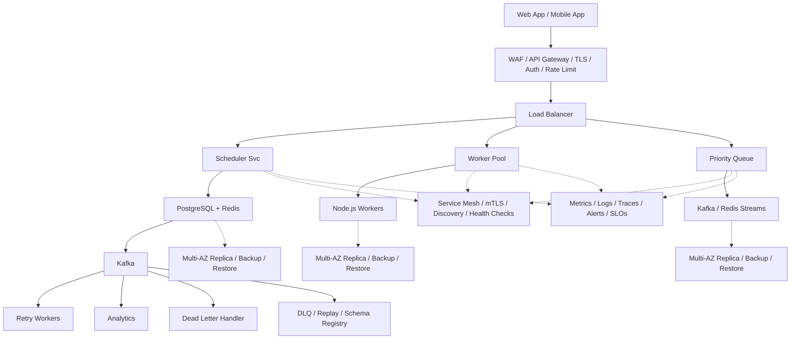

# System Design: Delayed Job Scheduler

## Overview

A distributed delayed job scheduling system (similar to Sidekiq, Celery, Bull, or Hangfire) that allows applications to enqueue jobs to be executed after a specified delay or at a specific time. The system must handle millions of delayed jobs with precise timing, at-least-once delivery, retry logic, and dead letter handling.

### Key Numbers

- 10M+ delayed jobs per day
- 100K+ jobs scheduled per minute at peak
- Sub-second scheduling accuracy
- 99.99% job delivery guarantee
- Support for 1000+ concurrent workers

---

## Requirements

### Functional Requirements

- Schedule jobs at specific time (cron)
- Delay jobs by N minutes/hours/days
- One-time and recurring jobs
- Retry with backoff
- Cancel pending jobs

### Non-Functional Requirements

- Latency: Scheduling < 200ms
- Throughput: 1M+ jobs/day
- Availability: 99.99% uptime
- Consistency: At-least-once with idempotency
- Scale: 100M+ pending jobs

---

---

---

## High-Level Architecture

### Architecture Diagram



### Data Flow

1. Client schedules job with delay (e.g. send email in 2 hours)
2. Scheduler stores job in PostgreSQL + Redis sorted set
3. Polling loop checks Redis ZRANGEBYSCORE every second for due jobs
4. Due jobs published to Kafka topic (partitioned by priority)
5. Worker Pool consumes from Kafka, executes job, updates status
6. Failed jobs retry with exponential backoff (1s, 2s, 4s...)
7. After max retries -> Dead Letter Queue for manual inspection

## Microservices

### 1. Job API Service

- **Responsibility**: Job creation/cancellation API, validation, idempotency check, job metadata enrichment, priority assignment
- **Tech**: Go / Node.js
- **DB**: PostgreSQL (job definitions, validation rules)
- **Cache**: Redis (idempotency keys, dedup)

### 2. Scheduler Service (Delayed Queue)

- **Responsibility**: Poll delayed jobs, move due jobs to ready queue, handle scheduling precision, timezone-aware scheduling, recurring job management
- **Tech**: Go
- **DB**: Redis (sorted sets for delayed queue), PostgreSQL (recurring job configs)
- **Pattern**: Redis ZSET with score = execution timestamp

### 3. Queue Manager Service

- **Responsibility**: Route jobs to appropriate worker pools, priority queuing, backpressure handling, queue health monitoring, rate limiting per queue
- **Tech**: Go / Java
- **Queue**: Kafka (durable, ordered delivery)
- **DB**: PostgreSQL (queue configurations)

### 4. Worker Pool Service

- **Responsibility**: Execute jobs, report status, handle timeouts, resource management, concurrency control, job isolation (sandboxed execution)
- **Tech**: Go / Python / Node.js (polyglot workers)
- **DB**: Redis (worker heartbeats, job locks)
- **Monitor**: Prometheus metrics per worker

### 5. Retry Manager Service

- **Responsibility**: Exponential backoff scheduling, retry policy management, circuit breaker patterns, failure classification, max retry enforcement
- **Tech**: Go
- **DB**: PostgreSQL (retry policies, failure history)
- **Queue**: Redis (retry delayed queue)

### 6. Dead Letter Handler Service

- **Responsibility**: Capture permanently failed jobs, manual requeue interface, failure analysis, alerting on DLQ growth, job forensic debugging
- **Tech**: Go / Python
- **DB**: PostgreSQL (dead letter store with full context)
- **Cache**: Redis (DLQ size counters)

### 7. Monitoring & Dashboard Service

- **Responsibility**: Real-time queue metrics, job execution history, latency tracking, throughput dashboards, SLA monitoring, alerting
- **Tech**: Python (analytics) + React (dashboard)
- **DB**: ClickHouse (metrics), PostgreSQL (dashboards)
- **Pipeline**: Kafka -> Flink -> ClickHouse

### 8. Admin & Management Service

- **Responsibility**: Queue management, worker management, job search/filter, bulk operations, job replay, configuration management, RBAC
- **Tech**: Go (API) + React (admin UI)
- **DB**: PostgreSQL

---

## Database Design

### PostgreSQL (Job Definitions & State)

```sql
-- Jobs (core table)
CREATE TABLE jobs (
    job_id          UUID PRIMARY KEY DEFAULT gen_random_uuid(),
    job_type        VARCHAR(255) NOT NULL, -- e.g. "SendEmailJob", "ProcessImage"
    payload         JSONB NOT NULL, -- job arguments
    queue           VARCHAR(100) NOT NULL DEFAULT 'default',
    priority        INT DEFAULT 5, -- 1 (highest) to 10 (lowest)
    status          VARCHAR(20) DEFAULT 'pending',
    -- pending, scheduled, ready, running, completed, failed, dead

    -- Scheduling
    scheduled_at    TIMESTAMP, -- null = execute immediately
    delay_seconds   INT, -- alternative: relative delay
    cron_expression VARCHAR(100), -- for recurring jobs

    -- Execution tracking
    attempts        INT DEFAULT 0,
    max_attempts    INT DEFAULT 3,
    last_attempt_at TIMESTAMP,
    next_retry_at   TIMESTAMP,
    started_at      TIMESTAMP,
    completed_at    TIMESTAMP,
    failed_at       TIMESTAMP,

    -- Result & error
    result          JSONB,
    error_message   TEXT,
    error_stack     TEXT,

    -- Metadata
    idempotency_key VARCHAR(255) UNIQUE,
    created_by      VARCHAR(255), -- service that created the job
    tags            JSONB, -- {"tenant_id": "x", "user_id": "y"}
    timeout_seconds INT DEFAULT 300,

    created_at      TIMESTAMP DEFAULT NOW(),
    updated_at      TIMESTAMP DEFAULT NOW()
);

-- Indexes for common queries
CREATE INDEX idx_jobs_status_scheduled ON jobs(status, scheduled_at)
    WHERE status IN ('pending', 'scheduled');
CREATE INDEX idx_jobs_queue_priority ON jobs(queue, priority, created_at)
    WHERE status = 'ready';
CREATE INDEX idx_jobs_created_by ON jobs(created_by, created_at);
CREATE INDEX idx_jobs_idempotency ON jobs(idempotency_key)
    WHERE idempotency_key IS NOT NULL;
CREATE INDEX idx_jobs_tags ON jobs USING GIN(tags);

-- Job State History (audit trail)
CREATE TABLE job_state_history (
    history_id      BIGSERIAL PRIMARY KEY,
    job_id          UUID REFERENCES jobs(job_id),
    from_status     VARCHAR(20),
    to_status       VARCHAR(20),
    worker_id       VARCHAR(100),
    error_message   TEXT,
    duration_ms     INT,
    created_at      TIMESTAMP DEFAULT NOW()
);

-- Recurring Job Definitions
CREATE TABLE recurring_jobs (
    recurring_id    UUID PRIMARY KEY DEFAULT gen_random_uuid(),
    job_type        VARCHAR(255) NOT NULL,
    payload_template JSONB NOT NULL,
    cron_expression VARCHAR(100) NOT NULL,
    queue           VARCHAR(100) DEFAULT 'default',
    priority        INT DEFAULT 5,
    max_instances   INT DEFAULT 1, -- prevent overlapping runs
    is_active       BOOLEAN DEFAULT TRUE,
    last_run_at     TIMESTAMP,
    next_run_at     TIMESTAMP,
    created_at      TIMESTAMP DEFAULT NOW()
);

-- Workers Registry
CREATE TABLE workers (
    worker_id       VARCHAR(100) PRIMARY KEY,
    host            VARCHAR(255),
    pid             INT,
    queues          TEXT[], -- ["email", "image-processing"]
    concurrency     INT DEFAULT 5,
    status          VARCHAR(20) DEFAULT 'active', -- active, paused, draining
    started_at      TIMESTAMP,
    last_heartbeat  TIMESTAMP,
    jobs_completed  BIGINT DEFAULT 0,
    jobs_failed     BIGINT DEFAULT 0
);
```

### Redis (Delayed Queue & Real-Time State)

```
# Delayed Job Queue (Sorted Set)
# Score = unix timestamp of when job should be executed
ZADD delayed:default 1725206400 "job:uuid:123"
ZADD delayed:email 1725206700 "job:uuid:456"
ZADD delayed:priority 1725206300 "job:uuid:789"

# Ready Queue (List - FIFO)
LPUSH ready:default "job:uuid:123"
RPOP ready:default  # Worker picks up

# Processing Queue (Set - for tracking active jobs)
SADD processing:worker-1 "job:uuid:123"
EXPIRE processing:worker-1 300  # Auto-cleanup on crash

# Worker Heartbeat
SETEX worker:{worker_id}:heartbeat 30 {timestamp}
SET worker:{worker_id}:info {json_metadata}

# Job Lock (prevent duplicate execution)
SETNX job:lock:{job_id} {worker_id}
EXPIRE job:lock:{job_id} 300

# Queue Stats (real-time counters)
INCR queue:default:enqueued
INCR queue:default:completed
INCR queue:default:failed

# Rate Limiting (per queue, per second)
EVAL "redis.call('incr', KEYS[1]); redis.call('expire', KEYS[1], 1)" 1 rate:{queue}:{timestamp}

# Idempotency Cache
SETEX idempotency:{key} 86400 {job_id}
```

### ClickHouse (Metrics & Analytics)

```sql
-- Job Execution Metrics (append-only, high throughput)
CREATE TABLE job_metrics (
    timestamp       DateTime,
    job_id          UUID,
    job_type        LowCardinality(String),
    queue           LowCardinality(String),
    status          LowCardinality(String),
    worker_id       String,
    duration_ms     UInt32,
    attempt         UInt8,
    payload_size    UInt32,
    error_code      LowCardinality(Nullable(String)),
    tags            Map(String, String)
) ENGINE = MergeTree()
PARTITION BY toYYYYMMDD(timestamp)
ORDER BY (queue, job_type, timestamp);

-- Queue Dashboard Metrics (aggregated)
CREATE MATERIALIZED VIEW queue_stats_hourly
ENGINE = SummingMergeTree()
PARTITION BY toYYYYMM(hour)
ORDER BY (hour, queue, status)
AS SELECT
    toStartOfHour(timestamp) AS hour,
    queue,
    status,
    count() AS job_count,
    avg(duration_ms) AS avg_duration,
    quantile(0.99)(duration_ms) AS p99_duration
FROM job_metrics
GROUP BY hour, queue, status;
```

---

## Scaling Tiers

### Tier 1: 1K - 10K Jobs/Day (MVP / Startup)

**Goal**: Simple delayed job execution for a small application

| Component | Choice | Why |
| ----------- | -------- | ----- |
| **Compute** | 1-2 EC2 instances (t3.medium) | Low throughput |
| **Database** | PostgreSQL RDS (db.t3.small) | All job data in one DB |
| **Queue** | Redis (single instance) | ZSET for delayed queue |
| **Workers** | 1-2 worker processes | Simple job execution |
| **Scheduler** | Single polling loop | ZRANGEBYSCORE every 1s |
| **Retry** | PostgreSQL-based | Simple retry with delay |
| **Monitoring** | CloudWatch + basic Grafana | Job count, failure rate |
| **Admin UI** | Simple React app | Job list, status |
| **CI/CD** | GitHub Actions | Deploy to EC2 |

**Architecture**: Monolithic worker with embedded scheduler. Redis for delayed queue, PostgreSQL for persistence.
**Cost**: ~$50-150/month

**Scheduler Loop (Simplified)**:

```
while true:
    due_jobs = ZRANGEBYSCORE(delayed:queue, 0, NOW())
    for job in due_jobs:
        ZREM(delayed:queue, job)
        LPUSH(ready:queue, job)
    sleep(1s)
```

---

### Tier 2: 10K - 1M Jobs/Day (Growth Phase)

**Goal**: Multi-queue, priority support, reliable delivery

| Component | Choice | Why |
| ----------- | -------- | ----- |
| **Compute** | ECS (10-30 containers) | Auto-scaling workers |
| **Database** | PostgreSQL RDS (r5.xlarge, 2 read replicas) | Read scaling for dashboard |
| **Queue** | Redis Cluster (6 nodes) | High-throughput delayed queue |
| **Message Broker** | Kafka (3 brokers) | Durable job delivery |
| **Workers** | K8s Deployment (10-50 pods) | Horizontal worker scaling |
| **Scheduler** | 3 instances (leader election) | HA scheduler with ZK/etcd |
| **Search** | Elasticsearch (3 nodes) | Job search, filtering |
| **Analytics** | ClickHouse (single node) | Real-time dashboards |
| **Monitoring** | Prometheus + Grafana + Jaeger | Full observability |
| **Dead Letter** | PostgreSQL (DLQ table) | Failed job storage |
| **Admin UI** | React + TypeScript | Full-featured admin |
| **CI/CD** | GitHub Actions + ArgoCD | GitOps |

**Architecture**: 6-8 microservices. Event-driven with Kafka. Redis ZSET for scheduling, Kafka for delivery. Worker pools per queue type.
**Cost**: ~$2K-8K/month

**Key Patterns**:

- **Lease-based execution**: Worker acquires lease (Redis SETNX), extends during execution, releases on complete
- **Leader election**: Only one scheduler instance polls the ZSET (using Redis or etcd)
- **Backpressure**: Workers report queue depth, auto-scale based on lag

---

### Tier 3: 1M - 10M+ Jobs/Day (Global Scale)

**Goal**: 100M+ jobs/day, multi-tenant, 99.99% delivery, sub-second scheduling

| Component | Choice | Why |
| ----------- | -------- | ----- |
| **Compute** | Multi-region K8s (500+ pods) | Global auto-scaling |
| **Database** | PostgreSQL (Citus sharding) + Aurora Global | Global consistency |
| **Queue** | Redis Cluster (30+ nodes, multi-DC) | Sub-ms scheduling |
| **Message Broker** | Kafka (15+ brokers, multi-DC) | Cross-region delivery |
| **Workers** | K8s HPA (100-500 pods, per-queue pools) | Granular scaling |
| **Scheduler** | Multi-region with RAFT consensus | Global scheduling |
| **Search** | Elasticsearch Cross-Cluster (10+ nodes) | Global job search |
| **Analytics** | Flink + ClickHouse Cluster + S3 | Petabyte analytics |
| **Dead Letter** | PostgreSQL + S3 (archival) | Long-term DLQ storage |
| **Service Mesh** | Istio | mTLS, traffic management |
| **Observability** | OpenTelemetry + Grafana Stack | Full stack visibility |
| **Feature Flags** | LaunchDarkly | Gradual rollouts |
| **Chaos Engineering** | Litmus Chaos | Resilience testing |
| **Multi-Tenancy** | Namespace isolation + resource quotas | Tenant isolation |

**Architecture**: Globally distributed. Multi-region scheduling with conflict resolution. Per-tenant queue isolation. Exactly-once semantics with idempotency keys.
**Cost**: ~$50K-200K/month

**Key Patterns**:

- **Multi-region scheduling**: Jobs sharded by tenant_id across regions
- **Conflict resolution**: Two-phase commit for cross-region job state
- **Exactly-once delivery**: Idempotency keys + dedup in Redis
- **Adaptive backoff**: ML-based retry timing based on failure patterns
- **Priority queues**: 10 priority levels with weighted fair queuing

---

## Key Design Decisions

### 1. Why Redis ZSET for Delayed Queue?

- O(log N) insertion and range query
- Atomic ZRANGEBYSCORE + ZREM for precise scheduling
- Sub-millisecond latency for polling
- Natural fit: score = timestamp, member = job_id

### 2. Why Separate Scheduler from Workers?

- Scheduler is CPU-bound (polling, moving jobs)
- Workers are I/O-bou

- Scheduler is CPU-bound (polling, moving jobs)
- Workers are I/O-bound (executing jobs)
- Independent scaling (scheduler: 3 instances, workers: 100+)
- Scheduler failure does not stop running jobs

### 3. Why Kafka for Job Delivery?

- Durable, ordered delivery (no job loss)
- Consumer groups for parallel processing
- Replay capability (reprocess failed jobs)
- Backpressure handling (lag-based scaling)

### 4. Why Lease-Based Execution?

- Prevents duplicate execution on worker crash
- Automatic timeout if worker dies (lease expires)
- Heartbeat extension for long-running jobs
- Clean handoff between workers

### 5. Why Idempotency Keys?

- Network retries can create duplicate job submissions
- Idempotency ensures exactly-once processing
- TTL-based dedup window (24 hours)
- Optional per-tenant dedup policies

---

## Failure Modes & Recovery

| Failure | Impact | Recovery |
| --------- | -------- | ---------- |
| Scheduler node crash | Jobs missed | Leader election, job lease TTL, failover |
| Job execution timeout | Worker hangs | Worker heartbeat, lease expiration, re-queue |
| Queue backlog spike | Jobs delayed hours | Auto-scale workers, priority queuing |
| Cron parsing bug | Recurring jobs never execute | Input validation, dry-run mode |
| Duplicate execution | Same job runs twice | Idempotency keys, distributed lock |
| Time zone error | Jobs execute wrong time | Store UTC, timezone conversion, DST handling |

---

## Cost Estimation (1M Users)

| Component | Specification | Monthly Cost |
| ----------- | -------------- | ------------- |
| Scheduler Nodes | 5x c5.xlarge | $700 |
| Worker Pool | 50x c5.xlarge | $7,000 |
| PostgreSQL | db.r5.xlarge + 3 replicas | $4,800 |
| Redis Cluster | 6x cache.r5.xlarge | $4,800 |
| Kafka (job queue) | 6x kafka.m5.large | $2,400 |
| Dead Letter Queue | 3x c5.large | $420 |
| Monitoring | Prometheus + Grafana | $500 |
| **Total** | | **~$20,620/month** |

---

## Trade-off Analysis

| Approach A | Approach B | Winner | Reason |
| ----------- | ----------- | -------- | -------- |
| Redis Sorted Set | Database table | Redis Sorted Set | O(log N) time-based queries |
| Lease-based | Lock-based | Lease-based | Auto-expiry prevents deadlocks |
| Exponential backoff | Fixed retry | Exponential backoff | Prevents thundering herd |
| Go workers | Python workers | Go | Higher concurrency, lower latency |
| Kafka | SQS | Kafka | Ordered job processing |

---

## Key Metrics to Monitor

| Metric | Target |
| -------- | -------- |
| Scheduling latency (due -> ready) | < 500ms |
| Job execution latency (ready -> complete) | < 5s (varies by job type) |
| Delivery guarantee | > 99.99% |
| Worker throughput | 10K+ jobs/worker/hour |
| Queue lag (ready queue depth) | < 1000 |
| Dead letter rate | < 0.1% |
| Retry success rate | > 80% |
| Scheduler uptime | 99.99% |
| API response time (p99) | < 100ms |
| Worker heartbeat interval | 10 seconds |

---

## Deep Dive Prompts

- How does time-bucketed dispatch work for millions of jobs?
- How do you prevent duplicate job execution with leases?
- How do you handle exponential backoff for failed jobs?
- How do you scale workers to process 1M+ jobs per hour?

---

## Key Techniques & Patterns

| Technique | Description | Used In |
| ----------- | ------------- | ---------- |
| Priority Queue (Binary Heap) | Applied in this system | Architecture + LLD |
| Lease-Based Worker Coordination | Applied in this system | Architecture + LLD |
| Jitter for Anti-Thundering Herd | Applied in this system | Architecture + LLD |
| Cron Expression Parsing | Applied in this system | Architecture + LLD |
| Dead Letter Queue | Applied in this system | Architecture + LLD |
| Idempotent Job Execution | Applied in this system | Architecture + LLD |

## Common Interview Follow-ups

**Q: How does time-bucketed dispatch work?**
A: Redis sorted sets by time bucket, poll current bucket, claim lease

**Q: How do you prevent duplicate execution?**
A: Idempotency keys, distributed lock with TTL, dead letter queue

**Q: How do you handle cron parsing?**
A: Field-by-field parsing, ranges and steps, DST handling

---

## Low-Level Design (LLD) - Algorithms & Data Structures

### 1. Time-Bucketed Dispatch Algorithm

```text
class JobScheduler {
  constructor(redisClient) { this.r = redisClient; }
  async schedule(jobId, payload, delayMs) {
    const executeAt = Date.now() + delayMs;
    await this.r.zadd('jobs:delayed', executeAt, JSON.stringify({ jobId, payload, executeAt }));
    return { scheduled: true, executeAt };
  }
  async poll(batchSize = 10) {
    const now = Date.now();
    const jobs = await this.r.zrangebyscore('jobs:delayed', 0, now, 'LIMIT', 0, batchSize);
    const ready = [];
    for (const j of jobs) {
      const removed = await this.r.zrem('jobs:delayed', j);
      if (removed) ready.push(JSON.parse(j));
    }
    return ready;
  }
  async ack(jobId) { await this.r.zrem('jobs:processing', jobId); }
}
```

### 2. Lease-Based Job Execution

```text
const uuid = require('uuid');

class LeaseManager {
    // Distributed lease to prevent double execution.
    // Flow:
    // 1. Worker claims the job with atomic SET NX EX
    // 2. If the lock succeeds, the worker owns the lease
    // 3. The worker renews the lease before expiry via heartbeat
    // 4. On completion, the lease is released
    // 5. If the lease expires, another worker can retry

    constructor(redisClient, leaseSeconds = 30) {
        this.r = redisClient;
        this.leaseSeconds = leaseSeconds;
    }
}
```

### 3. Jitter Calculation (Anti-Thundering Herd)

```text
const random = require('random');
const math = require('math');

class JitterCalculator {
    // Prevent thundering herd when many jobs share the same timestamp.
    // Problem: 10,000 jobs scheduled at midnight all fire simultaneously.
    // Solution: Add random jitter so execution is staggered.
    // Common strategies: fixed jitter, random jitter, or exponential backoff.

    calculate(baseTime, maxJitterMs) {
        return baseTime + random.uniform(0, maxJitterMs);
    }
}
```

### 4. Priority Queue (Binary Heap)

```text
const heapq = require('heapq');

class PriorityQueue {
    // Priority-based job scheduling.
  add(job, priority) {
    heap.push({ job, priority })
  }

  pop() {
    return heap.pop()
  }
}
```

### 5. Cron Expression Parser

```text
class CronParser {
  constructor() {
    this.monthDays = [0, 31, 28, 31, 30, 31, 30, 31, 31, 30, 31, 30, 31];
  }

  parse(cronExpr) {
    const parts = cronExpr.split(' ');
    return {
      minute: this._parseField(parts[0], 0, 59),
      hour: this._parseField(parts[1], 0, 23),
      dayOfMonth: this._parseField(parts[2], 1, 31),
      month: this._parseField(parts[3], 1, 12),
      dayOfWeek: this._parseField(parts[4], 0, 6)
    };
  }

  _parseField(field, minVal, maxVal) {
    if (field === '*') {
      return Array.from({length: maxVal - minVal + 1}, (_, i) => minVal + i);
    }
    if (field.includes(',')) {
      return field.split(',').map(v => parseInt(v));
    }
    if (field.includes('-')) {
      const [start, end] = field.split('-').map(Number);
      return Array.from({length: end - start + 1}, (_, i) => start + i);
    }
    if (field.includes('/')) {
      const [, step] = field.split('/');
      return Array.from({length: Math.floor((maxVal - minVal) / parseInt(step)) + 1},
        (_, i) => minVal + i * parseInt(step));
    }
    return [parseInt(field)];
  }
}
```

### Core Scheduling Algorithm

```text
class DelayedJobScheduler {
  constructor(redis, db, metrics) {
    this.redis = redis;
    this.db = db;
    this.metrics = metrics;
    this.pollInterval = 100; // ms
    this.batchSize = 100;
    this.lockTTL = 30; // seconds
    this.running = false;
  }

  async pollDelayedJobs() {
    this.running = true;
    while (this.running) {
      const lock = await this.acquireLock('scheduler:lock', this.lockTTL);
      if (lock) {
        try {
          const now = Date.now();
          const dueJobs = await this.redis.zrangebyscore(
            'delayed:default', 0, now, 'LIMIT', 0, this.batchSize
          );

          if (dueJobs.length > 0) {
            const pipe = this.redis.pipeline();
            for (const jobId of dueJobs) {
              pipe.zrem('delayed:default', jobId);
              pipe.lpush('ready:default', jobId);
              pipe.hset('job:' + jobId, 'status', 'ready');
            }
            await pipe.exec();
            this.metrics.increment('scheduler.moved', dueJobs.length);
          }
        } finally {
          await this.releaseLock('scheduler:lock');
        }
      }
      await this.sleep(this.pollInterval);
    }
  }

  async handleRecurringJobs() {
    const recurring = await this.db.query(
      'SELECT * FROM recurring_jobs WHERE is_active = true AND next_run_at <= NOW()'
    );
    for (const job of recurring) {
      await this.enqueueJob(job.job_type, job.payload_template, job.queue);
      await this.updateNextRun(job);
    }
  }

  async acquireLock(key, ttl) {
    const result = await this.redis.set(key, '1', 'NX', 'EX', ttl);
    return result === 'OK';
  }

  async releaseLock(key) {
    await this.redis.del(key);
  }

  sleep(ms) {
    return new Promise(resolve => setTimeout(resolve, ms));
  }
}

// Test
const scheduler = new DelayedJobScheduler(mockRedis, mockDB, mockMetrics);
console.log('Scheduler created with poll interval:', scheduler.pollInterval + 'ms');
console.log('Batch size:', scheduler.batchSize);
```

---

### Job Lifecycle State Machine

```
                    +----------+
                    | pending  |
                    +----+-----+
                         |
              enqueue (immediate or delayed)
                         |
                         v
                    +----------+
            +------>| scheduled |<------+
            |       +----+-----+       |
            |            |             |
            |   due (time reached)     |
            |            |             |
            |            v             |
            |       +----------+       |
            |       |  ready   |       |
            |       +----+-----+       |
            |            |             |
            |      worker picks up     |
            |            |             |
            |            v             |
            |       +----------+       |
            |       | running  |       |
            |       +----+-----+       |
            |            |             |
            |     +------+------+      |
            |     |             |      |
            |     v             v      |
            | +-------+   +--------+   |
            | |completed| | failed  |  |
            | +---------+ +----+---+   |
            |                  |       |
            |          retry (if retries left)
            |                  |       |
            |                  +-------+
            |
            +----> (exhausted retries)
                        |
                        v
                  +----------+
                  |   dead   |
                  +----------+
```

---

### Retry Strategy

```
Attempt 1: Immediate
Attempt 2: 30 seconds
Attempt 3: 2 minutes
Attempt 4: 10 minutes
Attempt 5: 1 hour
Attempt 6: 4 hours
Attempt 7: 12 hours
Attempt 8: 24 hours (final)
```

**Backoff Formula**: `delay = min(base * 2^attempt + jitter, max_delay)`

- Base: 30 seconds
- Jitter: random 0-5 seconds (prevent thundering herd)
- Max delay: 24 hours
- Max attempts: configurable per job type (default: 3)

---

### Real-World Insights & Best Practices (2024-2025)

### PhonePe Clockwork (2 Billion Jobs/Day)

**Architecture (Production System at PhonePe)**:

```
Clients -> Job Acceptor -> HBase (durable store)
                              |
                              v
                        Job Extractor (HBase scan)
                              |
                              v
                        RabbitMQ (message broker)
                              |
                              v
                        RMQ Consumer (HTTP callback to client)
```

**5 Modules**:

1. **Job Acceptor**: Accepts/validates requests, persists to HBase, assigns random Partition ID
2. **Job Extractor**: Runs HBase scans to find eligible jobs (scheduled_time <= now), pushes to RMQ
3. **Leader Elector**: Uses Zookeeper for leader election, assigns partitions to workers round-robin
4. **RMQ Publisher**: Publishes to RabbitMQ with rate limiter (Guava RateLimiter)
5. **RMQ Consumer**: Makes HTTP callbacks to clients, handles retries per client config

**Why HBase?**:

- Sparse, distributed, persistent, multidimensional sorted map
- Efficient scans by RowKey range (time-based queries)
- Handles billions of rows with sub-millisecond lookups
- Perfect for time-bucketed job extraction

**Why RabbitMQ over Kafka?**:

- HTTP callbacks are time-consuming, need decoupling
- RMQ provides durable message storage until consumed
- Consumer acknowledgments ensure at-least-once delivery
- Better for request-response patterns (vs Kafka's log-based model)

**Rate Limiting**:

- Guava RateLimiter caps publish rate to ~100K msg/sec
- Prevents fast-producer, slow-consumer problem
- Dynamic pausing when queue size exceeds threshold
- Prevents RMQ cluster instability from backlog

**Partitioning**:

- Each job gets a random Partition ID (e.g., 64 partitions)
- Leader assigns partitions to workers round-robin
- Ensures no two workers scan the same partition (no double execution)
- Allows 64 concurrent scans for higher throughput

**Relevancy Window**:

- Clients can set time limits for callback relevance
- Expired callbacks are not sent even when system recovers
- Prevents stale job execution after system downtime
- Supports callback sidelining for slow consumer recovery

### System Design School Framework

**Key Insight**: "The midnight herd, not the daily average, is what sizes the design."

**Peak vs Average Problem**:

- 1B jobs/day = 12K jobs/sec average
- 18% due at midnight = 180M jobs in 60 seconds = 3M jobs/sec peak
- Peak is 259x the average - design for peak, not average

**5 Fixes for Naive Cron Process**:

1. **Durable Store + Stateless Dispatchers**: No single point of failure
2. **Time-Partitioned Due Index**: One bucket per minute, read only current + lookback
3. **Atomic Lease Claim**: Conditional SET with expiry, only one dispatcher wins
4. **Jitter + Rate-Limited Dispatch**: Spread fire time, cap total dispatch
5. **Retries + Backoff + Dead Letter Queue**: Handle transient and permanent failures

**Effectively-Once Execution**:

- True exactly-once is impossible in distributed systems
- Achieve via at-least-once delivery + idempotent effect
- Job carries caller's idempotency key
- Repeat execution checks key before doing anything (safe no-op)

**Lease Duration Tradeoff**:

- Too short: healthy-but-slow workers get false reclaims
- Too long: crashed dispatcher delays recovery
- Sweet spot: 30-60 seconds with heartbeat renewal

### Best Practices Checklist

- [ ] Use time-bucketed dispatch (not full table scan)
- [ ] Implement atomic lease claims (prevent double execution)
- [ ] Add jitter to prevent thundering herd at hot timestamps
- [ ] Rate-limit dispatch to protect downstream systems
- [ ] Implement exponential backoff with jitter for retries
- [ ] Dead-letter queue for permanently failed jobs
- [ ] Idempotency keys for effectively-once execution
- [ ] Monitor queue lag (not just job count)
- [ ] Separate scheduler from workers (independent scaling)
- [ ] Use durable storage (HBase/PostgreSQL) not just Redis

---

---
