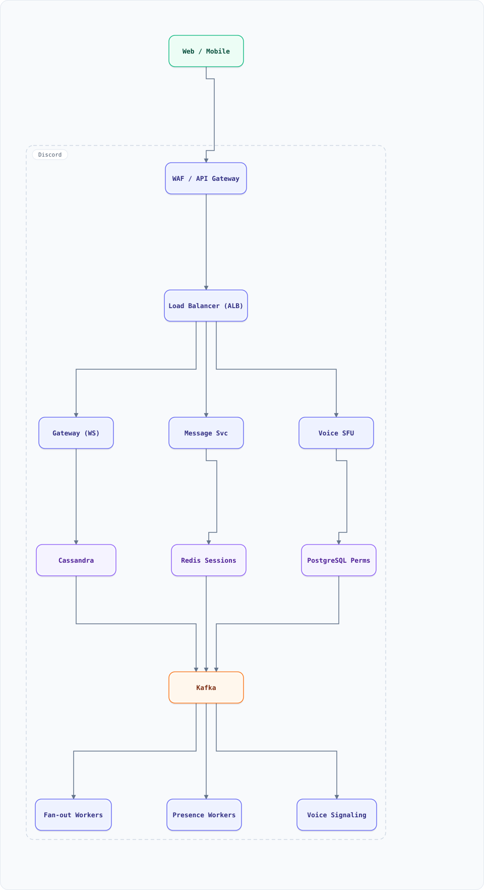

<div align="center">

# System Design: Discord (Community Chat, Massive Rooms & Voice)

</div>

> [!TIP]
> **TL;DR** — Group chat at Discord scale: servers with hundreds of thousands of members, millions of concurrent WebSocket sessions, voice/video over UDP — where naive fan-out breaks the moment a 100K-member room receives one message.

## Table of Contents

<details>
<summary><b>📑 Jump to a section</b></summary>

1. [Overview](#overview)
2. [Requirements](#requirements)
3. [High-Level Architecture](#high-level-architecture)
4. [Microservices](#microservices)
5. [Database Design](#database-design)
6. [Scaling Tiers](#scaling-tiers)
7. [Key Techniques & Patterns](#key-techniques--patterns)
8. [Key Design Decisions](#key-design-decisions)
9. [Failure Modes & Recovery](#failure-modes--recovery)
10. [Cost Estimation (1M Users)](#cost-estimation-1m-users)
11. [Trade-off Analysis](#trade-off-analysis)
12. [Key Metrics to Monitor](#key-metrics-to-monitor)
13. [Deep Dive Prompts](#deep-dive-prompts)
14. [Common Interview Follow-ups](#common-interview-follow-ups)
15. [Low-Level Design (LLD) - Algorithms & Data Structures](#low-level-design-lld---algorithms--data-structures)
16. [Do's & Don'ts](#dos--donts)

</details>

---


## Overview

Unlike WhatsApp (1:1 and small groups), Discord rooms (channels in servers) routinely have 100K+ members with only a few hundred active speakers. That asymmetry breaks naive fan-out: delivering one message to 100K sockets is not "send 100K times." Discord's real design (Elixir/Go gateway + separate voice servers) is the reference architecture.

### Key Numbers

| Metric | Value |
| :--- | :--- |
| **Concurrent sessions** | 5M+ WebSockets per gateway cluster |
| **Room size** | 100K–1M members, <1K typing at once |
| **Messages** | 4B+ messages/day across rooms |
| **Voice** | 25M+ concurrent UDP participants |

---

## Requirements

### Functional Requirements

- Servers (guilds) with text channels; join/leave; roles & permissions
- Send/receive messages; typing indicators; read state (unread counts)
- Presence (online/idle/DND) for massive member lists
- Voice channels: join, speak, mute, video
- History with pagination; pinning; reactions

### Non-Functional Requirements

| Attribute | Target |
| :--- | :--- |
| **Message delivery** | < 200ms P99 (typed → delivered) |
| **Presence** | eventual (seconds), batched — never per-user fan-out |
| **Session recovery** | resume after reconnect without message loss |
| **Scale per room** | 1M members, 100K concurrent viewers |

---

## High-Level Architecture

### Architecture Diagram



**Interactive diagram:** [diagrams/system-design/discord.architecture.html](diagrams/system-design/discord.architecture.html) — pan/zoom, search, dark/light theme, PNG/SVG export.


**Interactive diagram:** [diagrams/system-design/discord.architecture.html](diagrams/system-design/discord.architecture.html) — pan/zoom, search, dark/light theme, PNG/SVG export.

### Data Flow

1. Client connects to the **Gateway** (WebSocket) — session state in Redis (session id, subscriptions, cursor)
2. Message sent → Message Service → Cassandra (partitioned by channel_id + time bucket) → Kafka
3. Gateway fan-out workers consume Kafka; each worker holds only the sockets on its node
4. **Hierarchical fan-out**: room → subscribed gateway nodes → local sockets (not member-by-member)
5. Typing/presence events are **lossy**: dropped under load, no persistence, batched per room
6. Voice: signaling over gateway; media flows peer-to-**UDP voice server** (SFU), never through the chat path

## Microservices

| Service | Tech Stack | Database | Pattern |
| --------- | ------------ | ---------- | ---------- |
| Gateway | Elixir | Redis (sessions) | WS connection hub |
| Message Service | Rust/Go | Cassandra | Log storage |
| Presence Service | Go | Redis (bitmap sets) | Lossy broadcast |
| Voice Service (SFU) | C++/Go | none (stateless media) | UDP relay |
| Permission Service | Go | PostgreSQL | Role evaluation |

---

## Database Design

### Cassandra

```
messages:      PK (channel_id, bucket, message_id) bucket by day
user_channels: PK (user_id, channel_id)  -> last_read_message_id, settings
guild_members: PK (guild_id, user_id)    -> roles, joined_at
```

### Redis

```bash
session:{session_id}       -> gateway node, subscriptions, resume cursor
guild:{guild_id}:online    -> SET / roaring bitmap of online user_ids
channel:{channel_id}:typing -> SET with 8s TTLs (lossy, no persistence)
```

---

## Scaling Tiers

| Tier | Users | Infrastructure | Monthly Cost |
| ------ | ------- | -------------- | ------------- |
| 1K-10K | 10K | 2 gateway + PostgreSQL + Redis | $400 |
| 10K-1M | 1M | 8 gateway + Cassandra 3 + Redis + Kafka + SFU pool | $8,000 |
| 1M-10M+ | 10M+ | 60 gateway + Cassandra 12 + Redis cluster + Kafka + 100 SFU | $120,000 |

---

## Key Techniques & Patterns

- **Hierarchical fan-out**: room → nodes → sockets; never O(members) work per message
- **Lossy delivery for ephemeral events**: typing/presence dropped under load, never queued
- **Session resume cursor**: reconnect replays from last received message id
- **Event-Driven Architecture**: Kafka as the fan-out bus, per-node consumer groups
- **WebSockets** at millions of concurrent sessions (gateway = stateful, deliberate)
- **Backpressure**: per-room rate limiting; slow rooms never block fast rooms

---

## Key Design Decisions

1. **Stateful gateway over stateless LB**: sticky WS sessions with session store; resumable, cheaper than re-handshake storms
2. **Separate voice plane**: UDP media never touches chat infra (different failure domains, latency budgets)
3. **Cassandra bucketed by time**: message history reads are range scans; writes append
4. **Elixir/BEAM for gateway**: millions of cheap lightweight processes per node
5. **Presence as bitmaps, batched**: presence for a 1M-member server must cost ~nothing when idle

---

## Failure Modes & Recovery

| Failure | Impact | Mitigation |
| --------- | -------- | ----------- |
| Gateway node crash | 50K sockets drop | Clients auto-resume via cursor; sessions rebalance |
| Kafka partition lag | Delayed delivery | Per-room priority; lag alerting; shed typing events first |
| Redis down | Sessions lost | Clients reconnect fresh; resume best-effort |
| Voice SFU failure | Call drops | Region failover; client rejoins in <2s |
| Thundering reconnect (network event) | Reconnect storm | Exponential backoff + jitter; connection admission control |

---

## Cost Estimation (1M Users)

| Component | Configuration | Monthly Cost |
| ----------- | -------------- | ------------- |
| Gateway (12) | c7g.4xlarge | $4,500 |
| Cassandra (6) | i4i.2xlarge | $3,000 |
| Kafka (3) | m7g.large | $900 |
| Redis cluster | cache.r7g.large ×6 | $1,200 |
| SFU pool (20) | c7g.2xlarge | $1,600 |
| **Total** | | **~$11,200** |

---

## Trade-off Analysis

| Decision | Option A | Option B | Choice | Why |
| ---------- | ---------- | ---------- | -------- | ----- |
| Fan-out | Per member | Hierarchical via Kafka | Hierarchical | 1M-member rooms impossible otherwise |
| Typing events | Reliable queue | Lossy, TTL'd | Lossy | A 3s-old typing event is worthless |
| Voice | Relay via chat infra | Separate UDP SFU | SFU | Latency + failure isolation |
| Sessions | Stateless behind LB | Sticky + resume | Sticky + resume | Cheap reconnects |
| Presence | Per-user events | Bitmap + batching | Bitmap | 1M-member server presence ≈ free |

---

## Key Metrics to Monitor

1. Concurrent WS sessions per gateway
2. Message delivery latency P99 (send → remote socket)
3. Kafka fan-out lag per partition
4. Typing/presence drop rate (expected > 0 under load)
5. Resume success rate after reconnect
6. Voice: packet loss, jitter, RTT per region
7. Per-room event rate (abuse detection)

---

## Deep Dive Prompts

1. Design the permission system so checking a message send is O(1) (permission overfetch cache)
2. How would you implement slow mode / anti-spam per channel?
3. Design read-state/unread counts for a user in 500 servers.
4. How does Discord handle 1M-member "one-time" announcements (stage channels)?
5. How would you add end-to-end encryption for group DMs without breaking search?

---

## Common Interview Follow-ups

1. Why not MQTT or NATS instead of a custom gateway?
2. How do you deliver to a room whose members span 50 gateway nodes with one Kafka partition?
3. How do you keep voice out of the chat failure domain?
4. Why is "just use Firebase" not an answer at 1M-member rooms?
5. How do you test fan-out under 10× normal load?

---

## Low-Level Design (LLD) - Algorithms & Data Structures

### Hierarchical Fan-Out (room → nodes → sockets)

```text
// Gateway nodes register the guilds/channels their sockets subscribe to.
// Delivering one message = O(subscribed nodes), never O(members).
class FanOutRouter {
  constructor() { this.nodeByChannel = new Map(); this.socketsByNode = new Map(); }

  register(nodeId, channels) {
    for (const ch of channels) {
      if (!this.nodeByChannel.has(ch)) this.nodeByChannel.set(ch, new Set());
      this.nodeByChannel.get(ch).add(nodeId);
    }
  }
  route(channelId, message) {
    const nodes = this.nodeByChannel.get(channelId) ?? new Set();
    const deliveries = [];
    for (const n of nodes) deliveries.push({ node: n, sockets: (this.socketsByNode.get(n) ?? []).length });
    return deliveries; // e.g. a 1M-member room touches ~40 nodes, not 1M sockets
  }
}

const router = new FanOutRouter();
router.register("gw-1", ["general"]);
router.register("gw-2", ["general", "memes"]);
router.register("gw-3", ["memes"]);
console.log(router.route("general"));   // 2 nodes
console.log(router.route("memes"));     // 2 nodes

// Lossy typing indicator: keep only last 8s of events, drop under load
class TypingBuffer {
  constructor() { this.events = []; }
  add(userId) { this.events.push({ userId, t: Date.now() }); }
  current(maxEvents = 50) {
    const cutoff = Date.now() - 8000;
    this.events = this.events.filter(e => e.t >= cutoff);
    return this.events.slice(-maxEvents).map(e => e.userId); // drop, never queue
  }
}
```

### Consistent-Hash Ring for Gateway→Session Routing

A Discord-scale gateway fleet holds millions of live WebSocket sessions; every "send to user X" must find the gateway instance owning X's session. A hash ring with vnodes keeps that lookup O(1) and re-maps only K/N sessions when a gateway dies.

```js
class SessionRing {
  constructor(nodes = [], vnodes = 160) {
    this.ring = [];                                   // [{hash, node}]
    this.vnodes = vnodes;
    nodes.forEach(n => this.addNode(n));
  }
  _hash(s) { let h = 2166136261; for (const c of s) { h ^= c.charCodeAt(0); h = Math.imul(h, 16777619); } return h >>> 0; }
  addNode(node) {
    for (let i = 0; i < this.vnodes; i++)
      this.ring.push({ hash: this._hash(`${node}#${i}`), node });
    this.ring.sort((a, b) => a.hash - b.hash);
  }
  removeNode(node) { this.ring = this.ring.filter(p => !p.node.startsWith(node)); }
  route(sessionKey) {                                 // "user:42:device:3"
    const h = this._hash(sessionKey);
    let lo = 0, hi = this.ring.length - 1;
    while (lo < hi) { const mid = (lo + hi) >> 1; (this.ring[mid].hash < h) ? lo = mid + 1 : hi = mid; }
    return this.ring[lo % this.ring.length].node;     // clockwise successor
  }
}
const ring = new SessionRing(['gw-1', 'gw-2', 'gw-3']);
ring.route('user:42:device:3');            // always the same gateway while the ring is stable
ring.removeNode('gw-2');                   // only ~1/3 of sessions re-home (1/N with vnodes)
```

This is the same primitive as the sharding section (§2 concepts) applied to *connections instead of data* — and why the pub/sub layer fans out by session-ownership rather than broadcasting to every gateway.

## Do's & Don'ts

| ✅ Do | ❌ Don't |
| :-- | :-- |
| Pin down the key numbers before drawing boxes | Don't hand-wave the hardest component — discord lives or dies there |
| Justify the functional requirements choice against one alternative out loud | Don't default to the trendiest store without a consistency/scale argument |
| State the failure mode of non-functional requirements explicitly (what breaks first?) | Don't present a sunny-day design only — the follow-up question is always "and when it fails?" |
| Anchor capacity numbers before proposing shards/replicas | Don't introduce a component you can't cost or size with the numbers on the board |

*More cross-topic rules: [Interview Q&A §81](interview-qa.md#81-universal-dos--donts) · Concepts: [Networking](networking.md) · [Operating Systems](operating-systems.md)*

---

<nav>← [delayed job scheduler](system-design-delayed-job-scheduler.md) · [📖 All guides](README.md) · [distributed cache](system-design-distributed-cache.md) →</nav>
