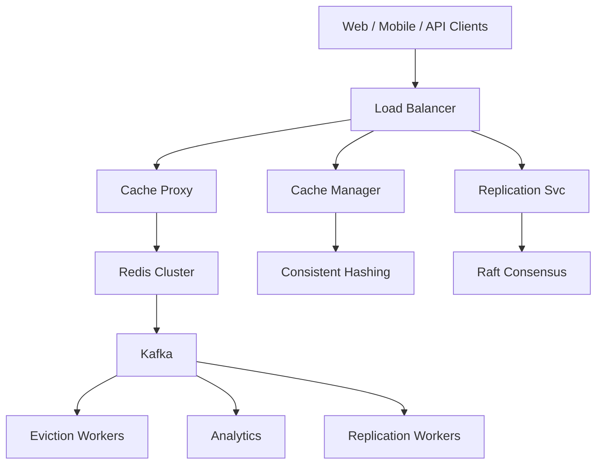

# System Design: Distributed Cache (Redis/Memcached)

## Overview

High-performance in-memory caching layer providing sub-millisecond reads for frequently accessed data, reducing database load.

### Key Numbers

- 1M+ ops/sec per node
- <1ms P99 latency
- 99.999% availability
- TB-scale capacity

---

## Requirements

### Functional Requirements

- Put(key, value, ttl) - Store key-value pair with expiration
- Get(key) - Retrieve value by key
- Delete(key) - Remove key-value pair
- Support multiple eviction policies (LRU, LFU, TTL)
- Support distributed sharding across nodes

### Non-Functional Requirements

- Latency: < 1ms P99
- Throughput: 1M+ ops/sec per node
- Availability: 99.999%
- Consistency: Tunable (strong to eventual)

---

## High-Level Architecture

### Architecture Diagram



### Data Flow

1. Client request - Cache Proxy hashes key to find shard
2. Consistent hashing maps key to virtual node -> physical node
3. Cache hit: return value (< 1ms latency)
4. Cache miss: fetch from origin DB, store in cache with TTL
5. Write-through or write-behind based on consistency needs
6. Replication: async to replicas for fault tolerance
7. Eviction: LRU/LFU when memory limit reached

## Microservices

| Service | Responsibility | Tech Stack | Pattern |
| --------- | --------------- | ------------ | --------- |
| Cache Proxy | Client routing, command parsing | Go/C++ | Connection Pool |
| Replication Mgr | Primary-replica sync, failover | Go | Raft Consensus |
| Eviction Manager | LRU/LFU/TTL eviction | C++ | Background Worker |
| Cluster Manager | Hash slot distribution | Go | Gossip Protocol |
| Persistence Svc | RDB snapshots, AOF logs | C++ | WAL |
| Monitoring Svc | Hit rate, memory, connections | Go, Prometheus | Metrics Export |

---

## Database Design

```sql
CREATE TABLE cache_metadata (
    slot_id     INT PRIMARY KEY,
    node_id     VARCHAR(50) NOT NULL,
    key_count   BIGINT DEFAULT 0,
    memory_used BIGINT DEFAULT 0,
    status      VARCHAR(20) DEFAULT 'active'
);

CREATE TABLE cache_stats (
    stat_id     BIGSERIAL PRIMARY KEY,
    node_id     VARCHAR(50),
    hit_count   BIGINT DEFAULT 0,
    miss_count  BIGINT DEFAULT 0,
    evict_count BIGINT DEFAULT 0,
    recorded_at TIMESTAMP DEFAULT NOW()
);
```

---

## Scaling Tiers

### 1K - 10K Users ($500/mo)

- Single Redis instance, 2GB RAM
- In-process cache (Node LRU)

### 10K - 1M Users ($20K/mo)

- Redis cluster (3 nodes), 32GB total
- Read replicas for read-heavy workloads
- Consistent hashing for key distribution

### 1M - 10M+ Users ($800K/mo)

- 100+ Redis instances, TB-scale
- Multi-region replication
- Custom eviction policies per workload
- Persistent caching with RDB + AOF

---

## Key Design Decisions

| Decision | Choice | Why |
| ---------- | -------- | ----- |
| Eviction Policy | LRU + TTL hybrid | LRU for hot data, TTL for temporary entries |
| Sharding | Consistent Hashing | Minimizes key movement on node add/remove |
| Replication | Primary-Replica with Raft | Strong consistency for writes, read scaling |
| Persistence | RDB + AOF | RDB for backups, AOF for durability |
| Protocol | RESP (Redis Serialization) | Simple, fast, widely supported |

---

## Failure Modes & Recovery

| Failure | Impact | Recovery |
| --------- | -------- | ---------- |
| Primary node crash | Write unavailability | Promote replica to primary via Raft |
| Replica lag | Stale reads | Increase replication priority, rebuild from primary |
| Memory exhaustion | Eviction storms | Scale horizontally, adjust eviction policy |
| Network partition | Split-brain | Raft consensus prevents dual writes |
| Cache stampede | DB overload | Use distributed locks, probabilistic early expiration |

---

## Cost Estimation (1M Users)

| Component | Monthly Cost |
| ----------- | ------------- |
| Redis cluster (100GB) | $4,000 |
| Compute (proxy + replication) | $3,000 |
| Monitoring (Prometheus) | $500 |
| Backup storage | $100 |
| Total | ~$7,600 |

---

## Trade-off Analysis

| Trade-off | Option A | Option B | Winner | Why |
| ----------- | ---------- | ---------- | -------- | ----- |
| Eviction | LRU | LFU | LRU | Simpler, better for most workloads |
| Persistence | RDB only | RDB + AOF | RDB + AOF | Durability + performance balance |
| Sharding | Consistent Hash | Range-based | Consistent Hash | Better load distribution |
| Replication | Sync | Async | Async | Better performance, accept small lag |

---

## Key Metrics to Monitor

| Metric | Target | Alert Threshold |
| -------- | -------- | ----------------- |
| Hit Rate | > 95% | < 85% |
| P99 Latency | < 1ms | > 5ms |
| Memory Usage | < 80% | > 90% |
| Eviction Rate | < 1% | > 5% |
| Replication Lag | < 100ms | > 1s |

---

## Deep Dive Prompts

1. **How does consistent hashing minimize key movement when nodes are added/removed?**
2. **Explain cache stampede and how to prevent it.**
3. **How would you handle cache invalidation across distributed nodes?**
4. **Design a cache warming strategy for cold starts.**
5. **How do you ensure cache consistency with the database?**
6. **Explain the trade-offs between Redis and Memcached.**

---

## Key Techniques & Patterns

| Technique | Description | Used In |
| ----------- | ------------- | ---------- |
| Consistent Hashing | Applied in this system | Architecture + LLD |
| LRU/LFU Eviction | Applied in this system | Architecture + LLD |
| Cache Stampede Prevention | Applied in this system | Architecture + LLD |
| Write-Through/Write-Behind | Applied in this system | Architecture + LLD |
| Redis Cluster (Hash Slots) | Applied in this system | Architecture + LLD |
| TTL-based Expiration | Applied in this system | Architecture + LLD |

## Common Interview Follow-ups

**Q: How do you handle cache invalidation?**
A: Use write-through (update cache + DB simultaneously), write-behind (update cache, async DB), or cache-aside (check cache first, fallback to DB). For distributed invalidation, publish invalidation events via Kafka.

**Q: How do you prevent cache stampede?**
A: Use distributed locks (only one thread rebuilds cache), probabilistic early expiration (randomly refresh before TTL), or background refresh threads that keep hot keys alive.

**Q: Redis vs Memcached?**
A: Redis supports data structures (lists, sets, sorted sets), persistence, replication, and pub/sub. Memcached is simpler, faster for pure key-value, and better for horizontal scaling. Use Redis for complex workloads, Memcached for simple caching.

---

## Low-Level Design (LLD)

### 1. LRU Cache Implementation

```text
class LRUCache {
  constructor(capacity) {
    this.capacity = capacity;
    this.cache = new Map();
  }

  get(key) {
    if (!this.cache.has(key)) return null;
    const value = this.cache.get(key);
    this.cache.delete(key);
    this.cache.set(key, value);
    return value;
  }

  put(key, value) {
    if (this.cache.has(key)) this.cache.delete(key);
    this.cache.set(key, value);
    if (this.cache.size > this.capacity) {
      const oldest = this.cache.keys().next().value;
      this.cache.delete(oldest);
    }
  }
}
```

### 2. Consistent Hashing

```text
class ConsistentHash {
  constructor(virtualNodes = 150) {
    this.ring = new Map();
    this.sortedKeys = [];
    this.virtualNodes = virtualNodes;
  }

  addNode(nodeId) {
    for (let i = 0; i < this.virtualNodes; i++) {
      const hash = this.hash(nodeId + ':' + i);
      this.ring.set(hash, nodeId);
      this.sortedKeys.push(hash);
    }
    this.sortedKeys.sort((a, b) => a - b);
  }

  getNode(key) {
    const hash = this.hash(key);
    for (const k of this.sortedKeys) {
      if (k >= hash) return this.ring.get(k);
    }
    return this.ring.get(this.sortedKeys[0]);
  }

  hash(key) {
    let h = 0;
    for (let i = 0; i < key.length; i++) {
      h = (h * 31 + key.charCodeAt(i)) & 0xffffffff;
    }
    return h;
  }
}

const cache = new LRUCache(1000); cache.put("key", "value"); console.log("Cache:", cache.get("key"));
```
