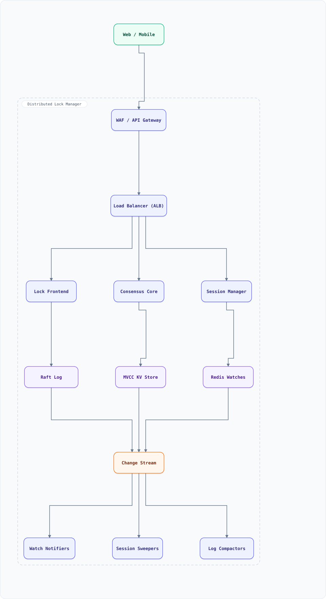

<div align="center">

# System Design: Distributed Lock Manager (Chubby / ZooKeeper-style)

</div>

> [!TIP]
> **TL;DR** — A coordination service: locks, leases, leader election, and small-config storage built on consensus. The design behind Chubby, ZooKeeper, and etcd — and the reason "just use Redis locks" fails under partition. Consensus-as-a-service.

## Table of Contents

<details>
<summary><b>📑 Jump to a section</b></summary>

1. [Overview](#overview)
2. [Requirements](#requirements)
3. [High-Level Architecture](#high-level-architecture)
4. [Microservices](#microservices)
5. [Database Design](#database-design)
6. [Scaling Tiers](#scaling-tiers)
7. [Key Techniques & Patterns](#key-techniques--patterns)
8. [Key Design Decisions](#key-design-decisions)
9. [Failure Modes & Recovery](#failure-modes--recovery)
10. [Cost Estimation (1M Users)](#cost-estimation-1m-users)
11. [Trade-off Analysis](#trade-off-analysis)
12. [Key Metrics to Monitor](#key-metrics-to-monitor)
13. [Deep Dive Prompts](#deep-dive-prompts)
14. [Common Interview Follow-ups](#common-interview-follow-ups)
15. [Low-Level Design (LLD) - Algorithms & Data Structures](#low-level-design-lld---algorithms--data-structures)
16. [Do's & Don'ts](#dos--donts)

</details>

---


## Overview

Services need to agree on "who is the leader," "who owns this shard," "is this config current." A lock manager provides **locks with leases + fencing tokens**, **leader election**, **ephemeral nodes** for liveness, and a small replicated config store — all on a **consensus core** (Raft/Paxos). This doc covers why correctness here is subtle (GC pauses, clock jumps, partitions) and how fencing solves it.

### Key Numbers

| Metric | Value |
| :--- | :--- |
| **Lock operations** | 50K / second (mixed lock/unlock/renew) |
| **Clients** | 10K+ connected sessions |
| **Lease duration** | 10–30s typical (liveness window) |
| **Config size** | ≤ 1MB per key — small data only |
| **Durability** | survive F failures with 2F+1 nodes |

---

## Requirements

### Functional Requirements

- Acquire/release **exclusive locks**; optional reader-writer locks
- **Leases** (auto-expire) with renewal; fencing tokens on grant
- Leader election per resource group
- Ephemeral nodes (die with session) and sequenced nodes (ordering)
- Small key-value config storage with watches
- Session keep-alives; client liveness detection

### Non-Functional Requirements

| Attribute | Target |
| :--- | :--- |
| **Lock latency** | < 10ms P99 within a region |
| **CP behavior** | consistency over availability (CAP) — refuses writes during partition |
| **Fencing** | every lock grant carries a monotonic token |
| **Durability** | committed ops survive node failure |

---

## High-Level Architecture

### Architecture Diagram



**Interactive diagram:** [diagrams/system-design/distributed-lock-manager.architecture.html](diagrams/system-design/distributed-lock-manager.architecture.html) — pan/zoom, search, dark/light theme, PNG/SVG export.


### Data Flow

1. Client session → Frontend → **consensus group (5 nodes, Raft)** — every lock/config op is a Raft log entry
2. Lock grant = log entry with `(lock_key, holder, lease_expiry, fencing_token++)`; token monotonic per lock, stored in log
3. Client holds lock until release **or lease expiry**; renewals extend the lease via keep-alive ops
4. Ephemeral node = session-scoped entry; session death (keep-alive timeout) deletes it → next waiter promoted
5. Watches: clients subscribe to key changes; consensus-applied changes notify subscribers
6. Protected resources (e.g., storage shard) **validate the fencing token** on every write — stale holders get rejected

## Microservices

| Service | Tech Stack | Database | Pattern |
| --------- | ------------ | ---------- | ---------- |
| Lock Frontend | Go | none (stateless) | Session mgmt |
| Consensus Core | Rust/Go | Raft log (WAL) | Consensus (§23) |
| Storage Engine | C++ | MVCC KV + Raft snapshot | Watch + versioning |
| Watch Notifier | Go | Redis pub/sub fan-out | Push updates |
| Session Manager | Go | Redis (ephemeral) | Keep-alive |

---

## Database Design

### Raft log + MVCC store

```
raft log:      [(term, index, op)]  op = lock|unlock|renew|put|delete|session_op
lock table:    key -> {holder_session, lease_expiry_ms, fencing_token, mode}
config store:  key -> (value, version)  MVCC: writers carry expected version
sessions:      session_id -> {node, last_keepalive, ephemerals[]}
watch reg:     key -> [client streams]
```

### Client-side contract

```bash
# The point of fencing: the protected resource checks the token, not the lock
acquire("shard-17")            -> { lease: 30s, fencing_token: 4182 }
storage.write(shard17, data)   -> must present fencing_token >= stored token
```

---

## Scaling Tiers

| Tier | Users | Infrastructure | Monthly Cost |
| ------ | ------- | -------------- | ------------- |
| 1K-10K | 10K | 3-node etcd (managed) | $150 |
| 10K-1M | 1M | 5-node custom Raft + frontends + Redis watch fan-out | $2,000 |
| 1M-10M+ | 10M+ | Sharded consensus groups (key-range routing) + multi-region witness | $20,000 |

---

## Key Techniques & Patterns

- **Consensus Algorithms (Raft/Paxos)** (§23): the core — every op through the log
- **Distributed Locking & Fencing** (§34): tokens make stale holders harmless
- **Leader Election** (§14): ephemeral + sequenced nodes
- **Leases over locks**: liveness without deadlock on client crash
- **Watches over polling**: change notification via session-scoped streams
- **Write-Ahead Log & Durability** (§31): Raft log IS the WAL

---

## Key Design Decisions

1. **CP, not AP**: a lock service that answers during a partition can grant two holders — the one failure that must never happen
2. **Fencing tokens mandatory**: locks are advisory; the *resource* enforces, so GC-paused holders can't corrupt state
3. **Small data only**: >1MB configs kill consensus throughput — big data belongs in a real store, referenced by key
4. **Session-scoped ephemerals**: crash-detection for free (ZooKeeper's core trick)
5. **Batch the log**: 50K ops/s × 5-node Raft needs batching + pipelining (or throughput dies)

---

## Failure Modes & Recovery

| Failure | Impact | Mitigation |
| --------- | -------- | ----------- |
| Network partition | Minority side must stop serving | Raft majority rule; clients fail fast |
| Client GC pause | Lock expired but holder unaware | Fencing token rejected by resource; holder re-acquires |
| Clock jump | Premature lease expiry | Leases counted in log-time (term/index), not wall clock |
| Slow disk on leader | Throughput collapse | WAL on NVMe; leader transfer on slowness |
| Thundering watch herd | Notification storm | Watch fan-out tree; batched notifications |

---

## Cost Estimation (1M Users)

| Component | Configuration | Monthly Cost |
| ----------- | -------------- | ------------- |
| Consensus nodes (5) | i4i.large NVMe | $1,200 |
| Frontends (4) | c7g.large | $400 |
| Watch fan-out (Redis) | cache.m7g.large ×2 | $500 |
| Monitoring | Prometheus | $100 |
| **Total** | | **~$2,200** |

---

## Trade-off Analysis

| Decision | Option A | Option B | Choice | Why |
| ---------- | ---------- | ---------- | -------- | ----- |
| Core | Raft | Multi-Paxos | Raft | Understandable, well-tooled |
| Liveness | Expiry via wall clock | Via log position | Log position | Clocks lie; log doesn't |
| Lock scope | Global lock service | Sharded groups | Sharded | 50K ops/s needs key-range split |
| Fencing | Optional | Mandatory | Mandatory | The difference between "mostly fine" and correct |
| Data size | Any value | ≤1MB keys | Small | Protects consensus latency |

---

## Key Metrics to Monitor

1. Consensus commit latency P99
2. Lease expiry vs renewal success rate
3. Fencing rejections (stale holder attempts — should be rare but nonzero)
4. Session keep-alive failure rate
5. Raft leader changes (any spike = incident)
6. Watch herd size per key change
7. Log compaction lag / snapshot health

---

## Deep Dive Prompts

1. Design multi-region lock fencing: can a stale region write after failover?
2. How would you implement read-your-writes for config reads (lease-read trade-off)?
3. Design distributed semaphores (N holders) with fairness guarantees.
4. How does Chubby's approach to sessions differ from ZooKeeper's? (keep-alives vs ephemerals)
5. When is a Redis lock actually safe? (single-instance + fencing; never Redlock-with-fencing-gaps)

---

## Common Interview Follow-ups

1. Why do we need fencing if Raft is correct? (correctness ≠ end-to-end: the resource must check)
2. What goes wrong with 2-node consensus? (split brain on partition)
3. How do locks interact with idempotency keys?
4. Why not use the lock manager as a database? (small-data rule)
5. How does etcd's revision number relate to fencing tokens?

---

## Low-Level Design (LLD) - Algorithms & Data Structures

### Leases with Fencing Tokens

```text
class LockManager {                       // single-node model; real impl = Raft log
  constructor() { this.locks = new Map(); this.tokenCounter = 1000; }

  acquire(key, sessionId, leaseMs = 30000) {
    const now = Date.now();
    const cur = this.locks.get(key);
    if (cur && cur.leaseExpiry > now && cur.session !== sessionId) return null;
    const token = ++this.tokenCounter;    // monotonic fencing token
    this.locks.set(key, { session: sessionId, leaseExpiry: now + leaseMs, token });
    return { token, leaseMs };
  }
  renew(key, sessionId, token, leaseMs = 30000) {
    const cur = this.locks.get(key);
    if (!cur || cur.session !== sessionId || cur.token !== token) return false;
    cur.leaseExpiry = Date.now() + leaseMs;
    return true;
  }
  release(key, sessionId, token) {
    const cur = this.locks.get(key);
    if (cur && cur.session === sessionId && cur.token === token) this.locks.delete(key);
  }
}

// The protected resource validates tokens — this is what makes it safe
class FencedStorage {
  constructor() { this.data = new Map(); this.maxToken = new Map(); }
  write(shard, data, fencingToken) {
    if (fencingToken < (this.maxToken.get(shard) ?? 0)) return { ok: false, reason: "stale holder" };
    this.maxToken.set(shard, fencingToken); this.data.set(shard, data);
    return { ok: true };
  }
}

const lm = new LockManager();
const a = lm.acquire("shard-17", "svc-A");          // token 1001
lm.release("shard-17", "svc-A", a.token);
const b = lm.acquire("shard-17", "svc-B");          // token 1002
const fs = new FencedStorage();
console.log(fs.write("shard-17", "new", b.token));  // ok
console.log(fs.write("shard-17", "stale!", a.token)); // rejected: stale holder
```

### Fencing at the Client (making a lock actually safe)

The lock service grants epoch tokens; the *storage* rejects stale ones. Here's the client-side wrapper that makes the guarantee concrete.

```js
class FencedResource {
  constructor(storage, lockManager) {
    this.storage = storage;            // implements write(record, fenceToken) — rejects tokens < lastSeen
    this.lockManager = lockManager;    // implements acquire(resource) → {token} | null
  }
  async guardedWrite(resource, mutate) {
    const lock = await this.lockManager.acquire(resource, { ttlMs: 10_000 });
    if (!lock) throw new Error('resource busy');
    try {
      await this.storage.compareAndWrite(resource, lock.token, last => mutate(last));
      // storage-side rule: reject token ≤ highest token it has ever accepted (monotonic check)
      // → a paused GC'd holder with epoch 7 cannot write after epoch 8 took over
    } finally {
      await this.lockManager.release(resource, lock.token);   // release WITH token: old owners can't free new locks
    }
  }
}
// the classic failure this prevents: holder pauses (GC, VM migration) past TTL →
// lock re-granted (epoch n+1) → old holder wakes and writes WITHOUT fencing → split-brain write.
```

Interview one-liner: **locks need leases, leases need fencing, fencing needs a storage layer that enforces monotonic tokens** — Chubby/ZooKeeper/etcd provide the first two; the third is always your data store's job.

## Do's & Don'ts

| ✅ Do | ❌ Don't |
| :-- | :-- |
| Pin down the key numbers before drawing boxes | Don't hand-wave the hardest component — distributed lock manager lives or dies there |
| Justify the functional requirements choice against one alternative out loud | Don't default to the trendiest store without a consistency/scale argument |
| State the failure mode of non-functional requirements explicitly (what breaks first?) | Don't present a sunny-day design only — the follow-up question is always "and when it fails?" |
| Anchor capacity numbers before proposing shards/replicas | Don't introduce a component you can't cost or size with the numbers on the board |

*More cross-topic rules: [Interview Q&A §81](interview-qa.md#81-universal-dos--donts) · Concepts: [Networking](networking.md) · [Operating Systems](operating-systems.md)*

---

<nav>← [distributed cache](system-design-distributed-cache.md) · [📖 All guides](README.md) · [ecommerce](system-design-ecommerce.md) →</nav>
