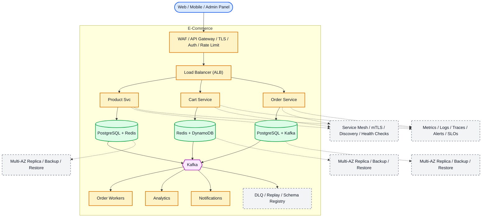

# System Design: E-Commerce Platform (Amazon)

## Overview

An e-commerce platform supporting product search, shopping cart, inventory management, order processing, payment, shipping, and reviews for millions of products and users.

### Key Numbers

- 300M+ active users
- 350M+ products
- 66K+ orders per minute (peak)
- $800B+ annual GMV

---

## Requirements

### Functional Requirements

- Search products with filters
- Cart and checkout with payment methods
- Track order status to delivery
- Real-time inventory updates
- Product reviews with ratings

### Non-Functional Requirements

- Latency: Search < 200ms, checkout < 3s
- Throughput: 100K orders/min peak
- Availability: 99.99% uptime
- Consistency: Strong for inventory
- Scale: 300M+ products, 200M+ customers

---

## High-Level Architecture

### Architecture Diagram



*Solid = data flow, dashed = control plane / monitoring.*

### Data Flow

1. User browses products - Product Service reads from Redis cache
2. Add to cart - Cart Service stores in Redis (TTL = 7 days)
3. Checkout - Order Service creates order (ACID transaction)
4. Payment Service processes via Stripe/Razorpay with idempotency
5. Inventory Service decrements stock (optimistic locking)
6. Kafka events: order_placed - Warehouse, Shipping, Notifications
7. Analytics pipeline: conversion funnel, revenue dashboard

## Microservices

### 1. Product Service

- **Responsibility**: Product catalog, categories, pricing, product details, seller management
- **Tech**: Java / Spring Boot
- **DB**: PostgreSQL (product data), S3 (product images)

### 2. Search Service

- **Responsibility**: Full-text search, filters, autocomplete, personalized search
- **Tech**: Python / Go
- **DB**: Elasticsearch (product indexing)
- **Cache**: Redis (popular searches)

### 3. Cart Service

- **Responsibility**: Shopping cart management, price calculation, coupon application
- **Tech**: Node.js / Go
- **DB**: Redis (cart data, TTL-based)
- **Pattern**: Session-based cart, logged-in cart persisted to DB

### 4. Inventory Service (Critical)

- **Responsibility**: Stock tracking, reservation, availability checking, warehouse management
- **Tech**: Java / Go
- **DB**: PostgreSQL (ACID for stock)
- **Pattern**: Optimistic locking for stock updates

### 5. Order Service (Critical)

- **Responsibility**: Order creation, order lifecycle, status tracking, cancellation
- **Tech**: Java / Spring Boot
- **DB**: PostgreSQL (ACID for orders)
- **Pattern**: Order state machine (pending -> confirmed -> shipped -> delivered)

### 6. Payment Service

- **Responsibility**: Payment processing, refunds, gift cards, wallets
- **Tech**: Java / Spring Boot
- **DB**: PostgreSQL (financial records)
- **Integrations**: Stripe, PayPal, Razorpay

### 7. Shipping Service

- **Responsibility**: Shipping calculation, carrier integration, tracking, delivery estimation
- **Tech**: Go
- **DB**: PostgreSQL
- **Integrations**: FedEx, UPS, DHL APIs

### 8. Review Service

- **Responsibility**: Product reviews, ratings, helpful votes, review moderation
- **Tech**: Go
- **DB**: PostgreSQL (reviews), Redis (rating cache)

### 9. Notification Service

- **Responsibility**: Order confirmations, shipping updates, promotional emails
- **Tech**: Node.js
- **Queue**: Kafka consumer
- **Channels**: Email (SendGrid), SMS (Twilio), Push (FCM)

---

## Database Design

### PostgreSQL

```sql
-- Products
CREATE TABLE products (
    product_id      UUID PRIMARY KEY DEFAULT gen_random_uuid(),
    seller_id       UUID NOT NULL,
    title           VARCHAR(500) NOT NULL,
    description     TEXT,
    category_id     UUID,
    price           DECIMAL(10,2) NOT NULL,
    currency        VARCHAR(3) DEFAULT 'USD',
    stock_quantity  INT NOT NULL DEFAULT 0,
    images          TEXT[],
    attributes      JSONB,
    rating_avg      DECIMAL(3,2) DEFAULT 0,
    rating_count    INT DEFAULT 0,
    is_active       BOOLEAN DEFAULT TRUE,
    created_at      TIMESTAMP DEFAULT NOW()
);

-- Orders
CREATE TABLE orders (
    order_id        UUID PRIMARY KEY DEFAULT gen_random_uuid(),
    user_id         UUID NOT NULL,
    status          VARCHAR(20) DEFAULT 'pending',
    total_amount    DECIMAL(10,2) NOT NULL,
    shipping_address JSONB,
    payment_id      UUID,
    created_at      TIMESTAMP DEFAULT NOW()
);

-- Order Items
CREATE TABLE order_items (
    item_id         UUID PRIMARY KEY DEFAULT gen_random_uuid(),
    order_id        UUID REFERENCES orders(order_id),
    product_id      UUID NOT NULL,
    quantity        INT NOT NULL,
    unit_price      DECIMAL(10,2) NOT NULL,
    total_price     DECIMAL(10,2) NOT NULL
);

-- Inventory (Optimistic Locking)
CREATE TABLE inventory (
    product_id      UUID PRIMARY KEY REFERENCES products(product_id),
    stock_quantity  INT NOT NULL,
    reserved        INT DEFAULT 0,
    version         INT DEFAULT 1,
    warehouse_id    UUID
);
```

### Redis (Cart & Caching)

```
# Shopping cart (Hash per user)
HSET cart:{user_id} {product_id} {quantity}

# Stock reservation (temporary)
SETEX reserve:{product_id}:{user_id} 900 {quantity}

# Product cache
SETEX product:{product_id} 3600 {json}

# Popular products
ZADD trending {score} {product_id}
```

---

## Scaling Tiers

### Tier 1: 1K - 10K Users

| Component | Choice |
| ----------- | -------- |
| **Compute** | 2-4 EC2 (t3.large) |
| **Database** | PostgreSQL RDS |
| **Cache** | Redis (single) |
| **Search** | PostgreSQL FTS |
| **Queue** | Redis Streams |
| **Payment** | Stripe |

### Tier 2: 10K - 1M Users

| Component | Choice |
| ----------- | -------- |
| **Compute** | ECS (20-50 containers) |
| **Database** | PostgreSQL (r5.xlarge, read replicas) |
| **Cache** | Redis Cluster (6 nodes) |
| **Search** | Elasticsearch (6 nodes) |
| **Queue** | Kafka (3 brokers) |
| **CDN** | CloudFront |

### Tier 3: 1M - 10M+ Users

| Component | Choice |
| ----------- | -------- |
| **Compute** | Multi-region K8s (500+ pods) |
| **Database** | PostgreSQL (Citus sharding) |
| **Cache** | Redis Cluster (30+ nodes) |
| **Search** | Elasticsearch Cross-Cluster (15+ nodes) |
| **Queue** | Kafka (15+ brokers) |
| **Inventory** | Event-sourced inventory |

---

## Key Design Decisions

### 1. Why Optimistic Locking for Inventory?

- Pessimistic locks cause deadlocks under high concurrency
- Optimistic: read version, try update, retry on conflict
- Works well when conflicts < 5%

### 2. Why Saga Pattern for Orders?

- Order creation spans multiple services (inventory, payment, shipping)
- Saga: Reserve stock -> Process payment -> Create order
- Compensating transactions for rollback

### 3. Why Redis for Cart?

- Sub-millisecond reads/writes
- TTL for abandoned cart expiry
- No database overhead for ephemeral data

### 4. Why Elasticsearch for Product Search?

- Full-text search with relevance ranking
- Faceted search (price range, brand, rating)
- Autocomplete with n-gram tokenizer

### 5. Order State Machine

```
pending -> confirmed -> shipped -> delivered -> completed
   |          |           |
   v          v           v
cancelled  refunded   returned
```

---

## Failure Modes & Recovery
What can go wrong in production, and how the system detects and recovers:

| Failure | Impact | Recovery |
| --------- | -------- | ---------- |
| Inventory oversell flash sale | More orders than stock | Optimistic locking, queue-based checkout |
| Search index lag | New product not findable | Near-real-time indexing via Kafka |
| Payment timeout | Order placed but unclear | Idempotency key + retry + reconciliation |
| Cart service down | Users lose carts | Persist to DB, local storage fallback |
| Recommendation slow | Homepage takes 5+ seconds | Cached recs, stale-while-revalidate |
| Order status inconsistent | Shows delivered but not received | Event sourcing, audit log |

---

## Cost Estimation (1M Users)
Rough monthly cost of running this design for one million users:

| Component | Specification | Monthly Cost |
| ----------- | -------------- | ------------- |
| API Servers | 30x c5.xlarge | $4,200 |
| PostgreSQL | db.r5.2xlarge + 5 replicas | $8,000 |
| Redis Cluster | 12x cache.r5.xlarge | $9,600 |
| Elasticsearch | 20x m5.xlarge | $8,400 |
| Kafka Cluster | 12x kafka.m5.large | $4,800 |
| S3 Product Images | 100TB | $2,300 |
| CDN | 50TB/month transfer | $4,000 |
| Payment Gateway | Stripe fees ~2.9% | variable |
| Recommendation ML | 5x c5.2xlarge | $2,800 |
| **Total** | | **~$44,100/month** |

---

## Trade-off Analysis
The alternatives considered, and which one won and why:

| Approach A | Approach B | Winner | Reason |
| ----------- | ----------- | -------- | -------- |
| Optimistic locking | Pessimistic locking | Optimistic | Better concurrency, no lock contention |
| Elasticsearch | PostgreSQL full-text | Elasticsearch | Better faceted search, typo tolerance |
| Redis cart | Database cart | Redis | Sub-ms reads, TTL for session expiry |
| Stripe | PayPal | Stripe | Better API, more customization |
| Kafka | SQS | Kafka | Higher throughput for flash sale events |

---

## Key Metrics to Monitor
The metrics that signal system health, with alert thresholds:

| Metric | Target |
| -------- | -------- |
| Search latency (p99) | < 200ms |
| Cart update latency | < 100ms |
| Order creation success rate | > 99.9% |
| Payment success rate | > 99.5% |
| Inventory accuracy | > 99.9% |
| Product page load time | < 1s |
| Checkout completion rate | > 70% |
| API response time (p99) | < 200ms |
| System availability | 99.95% |
| CDN cache hit ratio | > 95% |

---

---

## Deep Dive Prompts

- How do you prevent overselling during flash sales with 100x traffic?
- How does optimistic locking work for inventory management?
- How do you handle cart recovery across devices and sessions?
- How do you ensure payment idempotency to prevent double charges?

---

## Key Techniques & Patterns
The recurring techniques and patterns this design applies, mapped to where they are used:

| Technique | Description | Used In |
| ----------- | ------------- | ---------- |
| Inventory Management | Applied in this system | Architecture + LLD |
| Distributed Transactions (Saga) | Applied in this system | Architecture + LLD |
| Redis Session Cache | Applied in this system | Architecture + LLD |
| Elasticsearch Product Search | Applied in this system | Architecture + LLD |
| CDN for Product Images | Applied in this system | Architecture + LLD |
| Payment Gateway Integration | Applied in this system | Architecture + LLD |

## Common Interview Follow-ups

**Q: How do you prevent inventory oversell?**
A: Optimistic locking, queue-based checkout, reservation TTL, Redis hot inventory

**Q: How does search handle 300M+ products?**
A: Elasticsearch analyzers, BM25 relevance, semantic embeddings, faceted filtering

**Q: How do you handle payment failures?**
A: Idempotency keys, pending state with TTL, retry with backoff, reconciliation

---

## Low-Level Design (LLD) - Algorithms & Data Structures

### 1. Luhn's Algorithm (Credit Card Validation)

```text
class CartService {
  constructor(redisClient, dbClient) { this.r = redisClient; this.db = dbClient; }
  async addItem(userId, productId, qty = 1) {
    await this.r.hset('cart:' + userId, productId, qty.toString());
    await this.r.expire('cart:' + userId, 86400 * 30);
    return this.getCart(userId);
  }
  async removeItem(userId, productId) {
    await this.r.hdel('cart:' + userId, productId);
    return this.getCart(userId);
  }
  async getCart(userId) {
    const items = await this.r.hgetall('cart:' + userId);
    const cart = [];
    for (const [pid, qty] of Object.entries(items)) {
      const product = await this.db.getProduct(pid);
      if (product) cart.push({ ...product, quantity: parseInt(qty) });
    }
    return cart;
  }
  async clearCart(userId) { await this.r.del('cart:' + userId); }
}

const cart = new CartService(); console.log("Cart service ready");
```

### 2. Inventory Reservation (Optimistic Locking)

```text
function reserve_inventory(product_id, quantity, user_id) {
    // Reserve inventory with optimistic locking
    // - Prevents overselling
    // - Auto-release on timeout
    // Pseudocode:
    // 1. Read current stock and version
    // 2. Validate that stock - reserved >= quantity
    // 3. Atomically increment reserved and version
    // 4. If version mismatch, retry up to 3 times
    // 5. If all retries fail, return "conflict"

    UPDATE inventory
    SET reserved = reserved + quantity,
        version = version + 1
    WHERE product_id = product_id
      AND version = expected_version
      AND (stock_quantity - reserved) >= quantity;
}
```

### 3. Cart Merging (Logged-In vs Session)

```text
function merge_cart(user_id, session_cart) {
    // Merge session cart with logged-in cart
    // 1. Fetch logged-in cart from database
    // 2. For each session item:
    //    a. If same product exists, keep max quantity
    //    b. Otherwise add as a new cart item
    // 3. Persist merged cart
    // 4. Clear the temporary session cart
}
```

### 4. Order State Machine

```text
class OrderStateMachine {
    // Order lifecycle state machine:
    // pending -> confirmed -> shipped -> delivered -> completed
    // each step emits an event and updates status history
    // cancellation or refund may branch from confirmed/shipped states
}
```

### 5. Search Ranking (TF-IDF + BM25)

```text
function search_products(query, filters = undefined, page = 1, limit = 20) {
    // Product search with relevance ranking
    // - Uses Elasticsearch BM25 scoring
    // - Boosts popular products
    // - Applies filters and pagination
    // - Returns top-k products for the requested page

    query_terms = tokenize(query);
    scored_results = bm25_score(query_terms, filters);
    ranked_results = boost_popular_and_recent(scored_results);
    return paginate(ranked_results, page, limit);
}
```

---

### Real-Time Features

### Order Tracking (WebSocket)

- Real-time order status updates (placed → confirmed → shipped → delivered)
- Push notifications for status changes
- Live delivery tracking with driver location

### Inventory Updates (SSE)

- Stock level changes pushed to product pages
- Low-stock alerts for sellers
- Flash sale countdown timers

### Price Monitoring (Polling)

- Dynamic pricing updates
- Competitor price tracking
- Deal expiration timers
