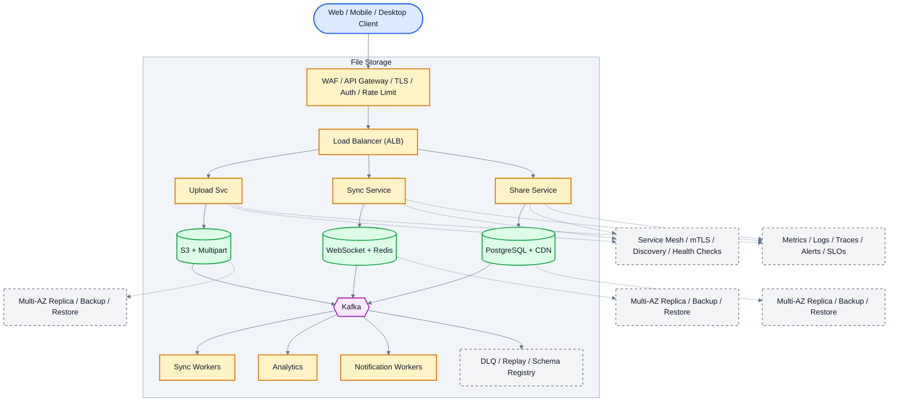

# System Design: File Storage (Google Drive/Dropbox)

## Overview

A cloud file storage system supporting file upload/download, sync, sharing, and versioning for millions of users.

### Key Numbers

- 1B+ files stored
- 500M+ daily active users
- 10PB+ total storage
- Real-time sync across devices

---

## Requirements

### Functional Requirements

- Chunked upload for large files
- Download with resume
- Share with users or public links
- Sync with CRDT conflict resolution
- File versioning and rollback

### Non-Functional Requirements

- Latency: Metadata < 200ms
- Throughput: 10M+ files/day
- Availability: 99.999% uptime
- Consistency: Strong for metadata
- Scale: 500M+ users, 50EB+ storage

---

## High-Level Architecture

### Architecture Diagram



*Solid = data flow, dashed = control plane / monitoring.*

### Data Flow

1. User uploads file - Upload Service uses S3 multipart upload
2. File split into 5MB chunks - parallel upload to S3
3. On complete - metadata stored in PostgreSQL + Redis cache
4. Sync Service: WebSocket notifies all connected devices
5. Differential sync: only changed chunks transferred (rsync-like)
6. Share Service: generate signed URL with TTL + permission check
7. Kafka events: upload, download, share - Analytics

## Microservices

### 1. File Service

- **Responsibility**: File upload/download, chunking, deduplication
- **Tech**: Go
- **DB**: PostgreSQL (file metadata)
- **Storage**: S3

### 2. Sync Service

- **Responsibility**: Real-time sync across devices, conflict resolution
- **Tech**: Go
- **DB**: PostgreSQL (sync state), Redis (sync queue)

### 3. Metadata Service

- **Responsibility**: File metadata, versions, sharing permissions
- **Tech**: Go
- **DB**: PostgreSQL

### 4. Notification Service

- **Responsibility**: Sync notifications, sharing alerts
- **Tech**: Node.js
- **Queue**: Kafka

---

## Database Design

### PostgreSQL

```sql
-- Files
CREATE TABLE files (
    file_id         UUID PRIMARY KEY,
    owner_id        UUID NOT NULL,
    parent_folder_id UUID,
    name            VARCHAR(255) NOT NULL,
    mime_type       VARCHAR(100),
    size_bytes      BIGINT,
    checksum        VARCHAR(64),
    version         INT DEFAULT 1,
    is_deleted      BOOLEAN DEFAULT FALSE,
    created_at      TIMESTAMP DEFAULT NOW(),
    updated_at      TIMESTAMP DEFAULT NOW()
);

-- File Versions
CREATE TABLE file_versions (
    version_id      UUID PRIMARY KEY,
    file_id         UUID REFERENCES files(file_id),
    version_number  INT,
    storage_key     VARCHAR(500),
    checksum        VARCHAR(64),
    size_bytes      BIGINT,
    created_at      TIMESTAMP DEFAULT NOW()
);

-- Sharing
CREATE TABLE file_shares (
    share_id        UUID PRIMARY KEY,
    file_id         UUID REFERENCES files(file_id),
    shared_with_id  UUID,
    permission      VARCHAR(20), -- view, edit, owner
    created_at      TIMESTAMP DEFAULT NOW()
);
```

---

## Scaling Tiers

### Tier 1: 1K - 10K Users

| Component | Choice |
| ----------- | -------- |
| **Compute** | 2 EC2 (t3.large) |
| **Database** | PostgreSQL RDS |
| **Storage** | S3 Standard |
| **Sync** | Polling-based |

### Tier 2: 10K - 1M Users

| Component | Choice |
| ----------- | -------- |
| **Compute** | ECS (10-20 containers) |
| **Database** | PostgreSQL (read replicas) |
| **Storage** | S3 + Glacier |
| **Sync** | WebSocket-based |

### Tier 3: 1M - 10M+ Users

| Component | Choice |
| ----------- | -------- |
| **Compute** | Multi-region K8s (100+ pods) |
| **Database** | PostgreSQL (sharded) + Cassandra |
| **Storage** | S3 + custom storage layer |
| **Sync** | CRDT-based conflict resolution |

---

---

## Key Design Decisions

### 1. Why Chunk-Based Storage?

- Files split into 4KB chunks for deduplication
- Identical chunks stored only once (2-5x savings)
- Enables delta sync (only transfer changed chunks)

### 2. Why Presigned URLs?

- Client uploads directly to S3 (no server bottleneck)
- Server generates time-limited signed URLs
- Reduces server load by 90%+

### 3. Why CRDT for Conflict Resolution?

- Last-Write-Wins is simple and deterministic
- No manual conflict resolution needed
- Trade-off: may lose some edits in concurrent scenarios

### 4. Why Content-Addressable Storage?

- Same content = same hash = stored once
- Automatic deduplication without scanning
- Enables integrity verification (hash mismatch = corruption)

## Failure Modes & Recovery
What can go wrong in production, and how the system detects and recovers:

| Failure | Impact | Recovery |
| --------- | -------- | ---------- |
| S3 bucket becomes unavailable | Files inaccessible, uploads fail | Multi-region replication + fallback to secondary bucket |
| Sync conflict during concurrent edits | Data loss or corruption | CRDT conflict resolution with automatic merge |
| CDN edge node fails | Slower file downloads for some users | CloudFront routes to next nearest edge |
| Metadata DB corruption | File listings broken | Point-in-time recovery + WAL replay |
| Presigned URL leaked | Unauthorized file access | Short-lived tokens (15min) + IP restrictions |
| Upload interrupted mid-chunk | Partial file in storage | Multipart upload cleanup after 7-day TTL |

## Cost Estimation (1M Users)
Rough monthly cost of running this design for one million users:

| Component | Specification | Monthly Cost |
| ----------- | -------------- | ------------- |
| S3 Storage | 10EB (AWS managed) | $230,000 |
| API Servers | 50x c5.xlarge | $7,000 |
| PostgreSQL | db.r5.2xlarge + 10 replicas | $12,000 |
| Redis Cluster | 24x cache.r5.xlarge | $19,200 |
| CDN | 500TB/month transfer | $40,000 |
| Sync Service | 30x c5.xlarge | $4,200 |
| Chunk Servers | 100x c5.xlarge | $14,000 |
| Encryption Service | 5x c5.large | $700 |
| **Total** | | **~$327,100/month** |

---

## Trade-off Analysis
The alternatives considered, and which one won and why:

| Approach A | Approach B | Winner | Reason |
| ----------- | ----------- | -------- | -------- |
| S3 Multipart | Direct upload | S3 Multipart | Resumable, parallel chunk uploads |
| CRDT | OT for sync | CRDT | Conflict-free, works offline |
| SHA-256 + Rolling Hash | MD5 | SHA-256 + Rolling Hash | Better security, content-defined chunking |
| PostgreSQL | MongoDB | PostgreSQL | ACID for file metadata |
| WebSocket | Long polling | WebSocket | True real-time sync |

---

## Key Metrics to Monitor
The metrics that signal system health, with alert thresholds:

| Metric | Description | Target |
| -------- | ------------- | -------- |
| **Upload Speed** | Time to upload file | < 5 seconds (10MB file) |
| **Download Speed** | Time to download file | < 2 seconds (10MB file) |
| **Delta Sync Efficiency** | % bandwidth saved on sync | > 80% |
| **Chunk Dedup Ratio** | Storage saved via deduplication | > 2x |
| **Presigned URL Generation Time** | Time to generate upload URL | < 50ms |
| **Conflict Resolution Rate** | Auto-resolved conflicts | > 95% |
| **File Version Accuracy** | Correct version history maintained | 100% |
| **Storage Durability** | Data not lost | 99.999999999% (11 9s) |
| **Share Link Availability** | Shared files accessible | > 99.9% |
| **Offline Sync Recovery** | Successful sync after offline | > 99% |

---

## Deep Dive Prompts

- How does CRDT handle concurrent file edits?
- How do you implement chunked upload for large files?
- How does content deduplication work with rolling hash?
- How do you handle real-time sync across multiple devices?

---

## Key Techniques & Patterns
The recurring techniques and patterns this design applies, mapped to where they are used:

| Technique | Description | Used In |
| ----------- | ------------- | ---------- |
| Chunked File Upload | Applied in this system | Architecture + LLD |
| Content-Addressable Storage | Applied in this system | Architecture + LLD |
| Deduplication | Applied in this system | Architecture + LLD |
| Version Control | Applied in this system | Architecture + LLD |
| Conflict Resolution | Applied in this system | Architecture + LLD |
| Pre-signed URLs | Applied in this system | Architecture + LLD |

## Common Interview Follow-ups

**Q: How does chunked upload work?**
A: Client splits to 5MB chunks, parallel upload, server verifies, resumable

**Q: How does CRDT conflict resolution work?**
A: Last-writer-wins for simple, operation-based for lists, vector clocks

**Q: How do you achieve 99.999999999% durability?**
A: S3 11 9s, cross-region replication, checksums, annual audits

---

## Low-Level Design (LLD) - Algorithms & Data Structures

### 1. Delta Sync (Rolling Hash)

```text
class ChunkedUploader {
  constructor(s3Client, dbClient) { this.s3 = s3Client; this.db = dbClient; }
  async initUpload(fileName, fileSize, chunkSize = 5 * 1024 * 1024) {
    const uploadId = 'upload_' + Date.now();
    const totalChunks = Math.ceil(fileSize / chunkSize);
    await this.db.createUpload({ uploadId, fileName, totalChunks, chunks: [], status: 'initiated' });
    return { uploadId, totalChunks, chunkSize };
  }
  async uploadChunk(uploadId, chunkIndex, data) {
    const key = uploadId + '/chunk_' + chunkIndex;
    await this.s3.putObject({ Bucket: 'uploads', Key: key, Body: data });
    await this.db.addChunk(uploadId, chunkIndex);
    const upload = await this.db.getUpload(uploadId);
    if (upload.chunks.length === upload.totalChunks) await this.assemble(uploadId);
    return { chunkIndex, uploaded: true };
  }
  async assemble(uploadId) {
    const upload = await this.db.getUpload(uploadId);
    const parts = upload.chunks.sort((a, b) => a - b).map(i => ({ ETag: uploadId + '/chunk_' + i, PartNumber: i + 1 }));
    await this.db.updateUpload(uploadId, { status: 'completed', parts });
  }
}
```

### 2. Content-Addressable Storage (Chunk Dedup)

```text
const hashlib = require('crypto');

class ContentAddressableStorage {
    // Store chunks by their content hash.
    // Storage model:
    // - file_id -> [chunk_hash_1, chunk_hash_2, ...]
    // - chunk_hash -> actual_data
    store_chunk(data) {
        chunk_hash = sha256(data)
        object_store.put_if_absent(chunk_hash, data)
        return chunk_hash
    }
}
```

### 3. Presigned URL Generation

```text
const hmac = require('hmac');
const hashlib = require('crypto');
const time = require('time');
const { quote } = require('urllib.parse');

class PresignedURLGenerator {
    // Flow:
    // 1. Client requests upload URL
    // 2. Server generates presigned URL (valid 15 min)
    // 3. Client uploads directly to S3
    // 4. S3 notifies on completion
    // Security: No AWS credentials exposed to client
    // Time Complexity: O(1) per URL generation
    generate(file_id, content_type) {
        return s3.create_presigned_put_url(
            key="uploads/" + file_id,
            content_type=content_type,
            expires_in=900
        )
    }
}
```

### 4. Conflict Resolution (CRDT)

```text
class LastWriteWinsCRDT {
    // When two users edit the same file offline:
    // - Each edit has a timestamp && node_id
    // - On sync, the edit with the latest timestamp wins
    // - No manual conflict resolution needed
    merge(updates) {
        return max(updates, key=lambda update: (update.timestamp, update.node_id))
    }
}
```

---

### Key Algorithms

### 1. File Chunking (Deduplication)

```text
function upload_file(file_path, user_id) {
    // File upload with chunking && dedup:
    // 1. Split file into 4MB chunks
    chunks = split_into_chunks(file_path, size=4 * MB)
    hashes = []
    for chunk in chunks:
        hashes.append(content_store.store_chunk(chunk))
    return database.create_manifest(user_id, file_path, hashes)
}
```

### 2. Conflict Resolution (Last-Write-Wins)

```text
function resolve_conflict(file_id, device_updates) {
    winner = max(device_updates, key=lambda update: (update.timestamp, update.device_id))
    database.save_file_version(file_id, winner)
    return winner
}
```

### 3. Delta Sync (Incremental)

```text
function sync_file(file_id, last_sync_version) {
    // Delta sync: Only transfer changed chunks
    // - Client sends last synced version
    // - Server returns only new/changed chunks
    // - Reduces bandwidth significantly
    changed_chunks = database.get_changes(file_id, since=last_sync_version)
    return {
        "status": "changes",
        "version": database.current_version(file_id),
        "changes": changed_chunks
    }
}

const upload = new UploadService(); console.log("Upload service ready");

```

---
