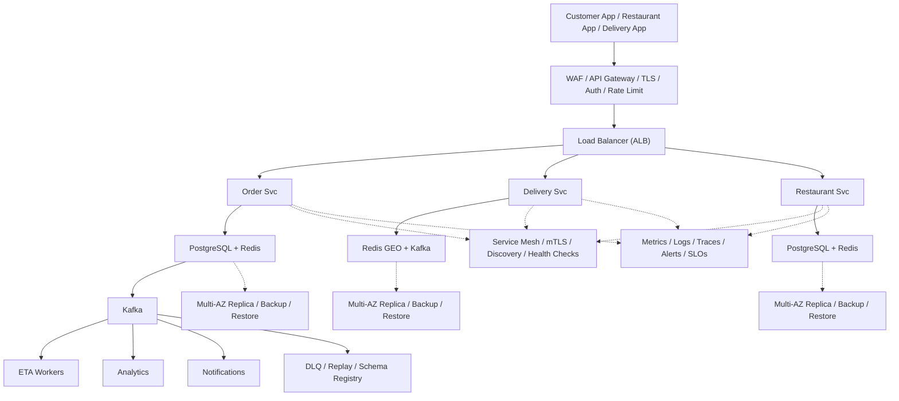

# System Design: Food Delivery (Zomato/Uber Eats)

## Overview

A food delivery platform supporting restaurant discovery, order placement, real-time tracking, and delivery partner management.

### Key Numbers

- 50M+ monthly active users
- 500K+ restaurant partners
- 5M+ orders per day
- 2M+ delivery partners

---

## Requirements

### Functional Requirements

- Browse restaurants/menus by location
- Place orders with address and payment
- Track delivery partner in real-time
- Rate restaurant and partner
- Support scheduled orders

### Non-Functional Requirements

- Latency: Search < 200ms
- Throughput: 1M+ orders/day
- Availability: 99.99% uptime
- Consistency: Strong for orders
- Scale: 10M+ users, 500K+ partners

---

## High-Level Architecture

### Architecture Diagram



### Data Flow

1. Customer browses restaurants - Restaurant Svc filters by area
2. Customer places order - Order Svc stores in PostgreSQL (ACID)
3. Delivery Svc matches nearest driver via Redis GEO
4. Driver accepts - real-time GPS tracking via WebSocket
5. Restaurant confirms - prepares food - driver picks up
6. Kafka events: order_status, location, delivery - Analytics
7. Notifications: order confirmed, driver assigned, delivered

## Microservices

### 1. Restaurant Service

- **Responsibility**: Restaurant catalog, menu management, availability, ratings
- **Tech**: Go / Java
- **DB**: PostgreSQL (restaurants), Elasticsearch (search)

### 2. Order Service

- **Responsibility**: Order creation, lifecycle, tracking, cancellation
- **Tech**: Java / Spring Boot
- **DB**: PostgreSQL (orders)
- **Pattern**: Order state machine

### 3. Matching Service

- **Responsibility**: Match delivery partners to orders, optimize routes
- **Tech**: Go
- **DB**: Redis (driver location), PostgreSQL (matching history)

### 4. Location Service

- **Responsibility**: Real-time driver/customer location tracking
- **Tech**: Go
- **DB**: Redis GEO (driver locations)

### 5. Payment Service

- **Responsibility**: Payment processing, refunds, wallet management
- **Tech**: Java / Spring Boot
- **DB**: PostgreSQL (financial records)

### 6. Notification Service

- **Responsibility**: Order updates, delivery alerts, promotions
- **Tech**: Node.js
- **Channels**: FCM, SMS, Email

---

## Database Design

### PostgreSQL

```sql
CREATE TABLE restaurants (
    restaurant_id   UUID PRIMARY KEY,
    name            VARCHAR(255) NOT NULL,
    address         TEXT,
    latitude        DECIMAL(10,8),
    longitude       DECIMAL(11,8),
    rating          DECIMAL(3,2),
    is_open         BOOLEAN DEFAULT TRUE,
    avg_prep_time   INT DEFAULT 30,
    created_at      TIMESTAMP DEFAULT NOW()
);

CREATE TABLE menu_items (
    item_id         UUID PRIMARY KEY,
    restaurant_id   UUID REFERENCES restaurants(restaurant_id),
    name            VARCHAR(255),
    description     TEXT,
    price           DECIMAL(10,2),
    category        VARCHAR(100),
    is_available    BOOLEAN DEFAULT TRUE
);

CREATE TABLE orders (
    order_id        UUID PRIMARY KEY,
    customer_id     UUID NOT NULL,
    restaurant_id   UUID REFERENCES restaurants(restaurant_id),
    driver_id       UUID,
    status          VARCHAR(20) DEFAULT 'placed',
    total_amount    DECIMAL(10,2),
    delivery_fee    DECIMAL(10,2),
    delivery_address JSONB,
    created_at      TIMESTAMP DEFAULT NOW()
);

CREATE TABLE order_items (
    order_item_id   UUID PRIMARY KEY,
    order_id        UUID REFERENCES orders(order_id),
    item_id         UUID REFERENCES menu_items(item_id),
    quantity        INT,
    price           DECIMAL(10,2)
);
```

---

## Scaling Tiers

### Tier 1: 1K - 10K Users

| Component | Choice |
| ----------- | -------- |
| **Compute** | 2-4 EC2 (t3.large) |
| **Database** | PostgreSQL RDS |
| **Cache** | Redis (single) |
| **Location** | Redis GEO |
| **Queue** | Redis Streams |

### Tier 2: 10K - 1M Users

| Component | Choice |
| ----------- | -------- |
| **Compute** | ECS (20-50 containers) |
| **Database** | PostgreSQL (read replicas) + Redis Cluster |
| **Search** | Elasticsearch |
| **Queue** | Kafka (3 brokers) |
| **Location** | Redis GEO Cluster |

### Tier 3: 1M - 10M+ Users

| Component | Choice |
| ----------- | -------- |
| **Compute** | Multi-region K8s (500+ pods) |
| **Database** | PostgreSQL (sharded) + Cassandra |
| **Cache** | Redis Cluster (30+ nodes) |
| **Location** | S2 Cells + Redis GEO |
| **Queue** | Kafka (15+ brokers) |
| **ML** | Route optimization, demand prediction |

---

---

## Key Design Decisions

### 1. Why Redis GEO for Driver Location?

- Sub-millisecond proximity queries (GEORADIUS)
- Native support for geo-indexed data
- Real-time updates without database overhead

### 2. Why Composite Scoring for Matching?

- Pure distance-based ignores driver quality
- Composite score (70% proximity + 30% rating) balances speed and quality
- Prevents always assigning to the closest driver

### 3. Why Zone-Based Surge Pricing?

- Simple to understand and implement
- Easy to adjust thresholds per zone
- Prevents price gouging while balancing supply/demand

### 4. Why WebSocket for Real-Time Tracking?

- Bidirectional communication (push location updates)
- Lower latency than polling (3s vs 10s)
- Reduces server load (no repeated HTTP requests)

## Failure Modes & Recovery

| Failure | Impact | Recovery |
| --------- | -------- | ---------- |
| Driver location stale | Map inaccurate | GPS ping every 5s, Kalman filter |
| Menu outdated | Order sold out item | Real-time inventory sync, sold-out flag |
| Surge pricing stuck | 3x pricing for hours | Price cap with TTL, manual override |
| Payment failure | Order placed but not charged | Retry with backoff, reconciliation |
| Driver assignment slow | Waits 5+ minutes | Expand radius, increase incentive |
| Traffic data delayed | ETA wildly inaccurate | Multiple data sources, real-time API |

---

## Cost Estimation (1M Users)

| Component | Specification | Monthly Cost |
| ----------- | -------------- | ------------- |
| API Servers | 20x c5.xlarge | $2,800 |
| PostgreSQL | db.r5.xlarge + 3 replicas | $4,800 |
| Redis GEO Cluster | 6x cache.r5.xlarge | $4,800 |
| Kafka Cluster | 6x kafka.m5.large | $2,400 |
| Google Maps API | 30M requests/day | $9,000 |
| Elasticsearch | 10x m5.xlarge | $4,200 |
| CDN | 10TB/month transfer | $800 |
| Payment Gateway | Stripe fees ~2.9% | variable |
| **Total** | | **~$28,800/month** |

---

## Trade-off Analysis

| Approach A | Approach B | Winner | Reason |
| ----------- | ----------- | -------- | -------- |
| Redis GEO | PostGIS | Redis GEO | Sub-ms nearby restaurant searches |
| Kafka | RabbitMQ | Kafka | Higher throughput for order events |
| Go | Python for matching | Go | Faster driver matching algorithm |
| Stripe | PayPal | Stripe | Better API for payment processing |
| WebSocket | Long polling | WebSocket | Real-time delivery tracking |

---

## Key Metrics to Monitor

| Metric | Description | Target |
| -------- | ------------- | -------- |
| **Order-to-Delivery Time** | Total time from order to delivery | < 45 minutes |
| **ETA Accuracy** | Predicted vs actual delivery time | ±5 minutes |
| **Driver Match Rate** | % of orders matched to driver | > 95% |
| **Surge Pricing Frequency** | % of orders with surge pricing | < 10% |
| **Real-Time Tracking Latency** | Location update delay | < 3 seconds |
| **Restaurant Prep Time** | Average food preparation time | < 20 minutes |
| **Order Acceptance Rate** | % of orders accepted by restaurants | > 90% |
| **Cancellation Rate** | Orders cancelled by user/driver | < 5% |
| **Peak Hour Capacity** | Max orders during rush hour | Monitored |
| **Driver Utilization** | % of drivers actively delivering | > 70% |

---

## Deep Dive Prompts

- How do you find the nearest delivery partner within 5 minutes?
- How does ETA calculation work with real-time traffic data?
- How do you handle surge pricing during peak hours?
- How do you prevent food from getting cold during delivery?

---

## Key Techniques & Patterns

| Technique | Description | Used In |
| ----------- | ------------- | ---------- |
| Haversine Distance Calculation | Applied in this system | Architecture + LLD |
| Geospatial Indexing (Geohash) | Applied in this system | Architecture + LLD |
| Real-time GPS Tracking | Applied in this system | Architecture + LLD |
| Dynamic Surge Pricing | Applied in this system | Architecture + LLD |
| Order State Machine | Applied in this system | Architecture + LLD |
| Route Optimization | Applied in this system | Architecture + LLD |

## Common Interview Follow-ups

**Q: How does real-time driver tracking work?**
A: GPS ping 5s, Kalman filter, WebSocket push, ETA recalc

**Q: How does driver matching work?**
A: Haversine + ETA prediction, expand radius, incentive increase

**Q: How do you handle surge pricing?**
A: Demand/supply per geo-cell, price cap with TTL, auto-reset

---

## Low-Level Design (LLD) - Algorithms & Data Structures

### 1. ETA Calculation (Haversine + Traffic)

```text
const R = 6371; // Earth's radius in km

function haversineDistance(lat1, lon1, lat2, lon2) {
  // Great-circle distance between two points on Earth
  // Time Complexity: O(1)
  const dLat = ((lat2 - lat1) * Math.PI) / 180;
  const dLon = ((lon2 - lon1) * Math.PI) / 180;
  const a =
    Math.sin(dLat / 2) ** 2 +
    Math.cos((lat1 * Math.PI) / 180) *
    Math.cos((lat2 * Math.PI) / 180) *
    Math.sin(dLon / 2) ** 2;
  const c = 2 * Math.asin(Math.sqrt(a));
  return R * c;
}

function calculateETA(pickup, dropoff, trafficMultiplier = 1.0, avgSpeedKmh = 30, prepTime = 15) {
  const distance = haversineDistance(pickup.lat, pickup.lon, dropoff.lat, dropoff.lon);
  const travelHours = (distance / avgSpeedKmh) * trafficMultiplier;
  const travelMinutes = travelHours * 60;
  return Math.round(travelMinutes + prepTime);
}
```

### 2. Driver Assignment (Nearest + Rating)

```text
class DriverMatcher {
  // Match order to optimal driver using proximity + rating

  constructor(redisClient) {
    this.r = redisClient;
  }

  async findDriver(restaurantLocation, maxDistanceKm = 5) {
    // Query nearby available drivers using Redis GEO
    const nearby = await this.r.georadius(
      'driver:locations',
      restaurantLocation.lon,
      restaurantLocation.lat,
      maxDistanceKm,
      'km', 'WITHDIST', 'ASC'
    );

    const candidates = [];
    for (const [driverId, distance] of nearby) {
      const status = await this.r.hget(`driver:${driverId}`, 'status');
      if (status !== 'available') continue;

      const rating = parseFloat(await this.r.hget(`driver:${driverId}`, 'rating') || '5.0');

      // Composite score: 70% proximity + 30% rating (higher = better)
      const proximityScore = 1.0 / (parseFloat(distance) + 0.1);
      const composite = proximityScore * 0.7 + (rating / 5.0) * 0.3;

      candidates.push({ driverId, distance: parseFloat(distance), rating, score: composite });
    }

    // Return top 3 candidates sorted by score
    return candidates.sort((a, b) => b.score - a.score).slice(0, 3);
  }
}
```

### 3. Real-Time Location Tracking

```text
class SurgePricing {
  // Dynamic delivery fee based on demand/supply per zone
  // Time Complexity: O(1) per calculation
  constructor(redisClient) {
    this.r = redisClient;
  }

  async getMultiplier(zoneId) {
    const demand = parseInt(await this.r.get(`zone:${zoneId}:demand`) || '0');
    const supply = parseInt(await this.r.get(`zone:${zoneId}:supply`) || '1');
    const ratio = demand / Math.max(supply, 1);

    if (ratio <= 1.0) return 1.0;   // No surge
    if (ratio <= 1.5) return 1.2;
    if (ratio <= 2.0) return 1.5;
    return 2.0;  // Max surge
  }
}
```

### 4. Surge Pricing Algorithm

```text
class SurgePricing {
    // Dynamic pricing based on supply/demand ratio.
    getMultiplier(zoneId) {
      const demand = metrics.getDemand(zoneId);
      const supply = Math.max(metrics.getAvailableDrivers(zoneId), 1);
      return Math.min(1 + Math.max(demand / supply - 1, 0) * 0.5, 2);
    }
}
```

```text
class LocationTracker {
  // Track driver location in real-time using Redis GEO + Kafka
  // Time Complexity: O(log N) per update, O(N + log M) per geo query
  constructor(redisClient, kafkaProducer) {
    this.r = redisClient;
    this.kafka = kafkaProducer;
  }

  async updateLocation(driverId, lat, lon) {
    // Update Redis GEO (for real-time queries)
    await this.r.geoadd('driver:locations', lon, lat, driverId);

    // Update driver details
    await this.r.hset(`driver:${driverId}`, {
      lat: lat.toString(),
      lon: lon.toString(),
      updated_at: Math.floor(Date.now() / 1000).toString()
    });

    // Persist to Kafka (for analytics and history)
    await this.kafka.produce('driver.locations', {
      driverId, lat, lon,
      timestamp: Math.floor(Date.now() / 1000)
    });
  }

  async getNearbyDrivers(location, radiusKm = 5) {
    return this.r.georadius(
      'driver:locations', location.lon, location.lat,
      radiusKm, 'km', 'WITHDIST', 'ASC'
    );
  }
}
```

### 2. Matching Algorithm

```text
class PaymentService {
  // Process payment with idempotency and retry logic
  // Time Complexity: O(1) per transaction
  constructor(dbClient, stripeClient) {
    this.db = dbClient;
    this.stripe = stripeClient;
  }

  async processPayment(orderId, amount, currency = 'usd') {
    // Check idempotency (prevent double charge)
    const existing = await this.db.getPayment(orderId);
    if (existing) return existing;

    // Process via Stripe
    const charge = await this.stripe.charges.create({
      amount: Math.round(amount * 100),
      currency,
      metadata: { orderId },
      idempotencyKey: orderId
    });
    await this.db.savePayment(orderId, charge);
    return charge;
  }
}

```

### 2. Matching Algorithm

```text
class MatchingService {
  // Match order to nearest available driver
  // Time Complexity: O(K log K) where K = nearby drivers
  constructor(redisGeo, dbClient) {
    this.geo = redisGeo;
    this.db = dbClient;
  }

  async findDriver(restaurantLocation, maxDistanceKm = 5) {
    // Query nearby available drivers
    const nearby = await this.geo.georadius(
      'driver:locations', restaurantLocation.lon, restaurantLocation.lat,
      maxDistanceKm, 'km', 'WITHDIST', 'ASC'
    );

    const candidates = [];
    for (const [driverId, distance] of nearby) {
      const status = await this.db.getDriverStatus(driverId);
      if (status !== 'available') continue;

      const rating = await this.db.getDriverRating(driverId);
      const proximityScore = 1.0 / (parseFloat(distance) + 0.1);
      const composite = proximityScore * 0.7 + (rating / 5.0) * 0.3;

      candidates.push({ driverId, distance: parseFloat(distance), rating, score: composite });
    }

    return candidates.sort((a, b) => b.score - a.score).slice(0, 3);
  }
}

const delivery = new DeliveryService(); console.log("Delivery service ready");
```
