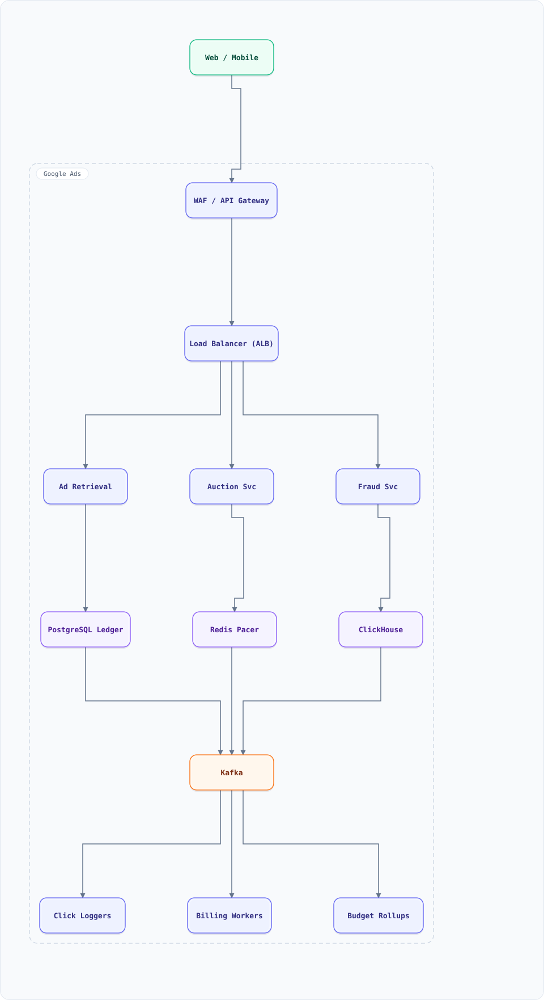

<div align="center">

# System Design: Google Ads (Auction, Bidding & Budget Pacing)

</div>

> [!TIP]
> **TL;DR** — An ad platform: advertisers bid on keywords, an auction runs per search/session in <100ms with quality scoring and budget pacing, click/billing events flow through exactly-once accounting. The hardest "money" system: zero tolerance for overcharging, plus fraud everywhere.

## Overview

Search ads work like this: query arrives → keyword match → retrieve eligible ads → score `bid × quality` → run **generalized second-price (GSP) auction** → serve winner(s) → log clicks → nightly billing. The design core: an auction correct to the cent, a **budget pacer** that spends budgets smoothly across the day, and click-stream accounting that never double-charges.

### Key Numbers

| Metric | Value |
| :--- | :--- |
| **Auctions/second** | 1M+ (search) / 5M+ (display real-time bidding) |
| **Auction latency** | < 100ms P99 (inside search latency budget) |
| **Advertisers** | 1M+ active campaigns |
| **Daily spend** | $1B+ across the platform |

---

## Requirements

### Functional Requirements

- Advertiser sets keywords, bids, creatives, budgets, targeting
- Auction per query: match → rank → price → serve
- Budget pacing (daily budget spread across the day, run out ~never early)
- Click/billing ledger: exactly-once charges per (click_id)
- Impression/click analytics for advertisers (delayed, aggregated)
- Invalid-traffic (fraud) filtering before billing

### Non-Functional Requirements

| Attribute | Target |
| :--- | :--- |
| **Auction latency** | < 100ms P99 within search results |
| **Billing correctness** | 100% — never overcharge; duplicates reconciled |
| **Pacing accuracy** | daily budget ±10% |
| **Fraud filtering** | pre-billing, near-real-time |

---

## High-Level Architecture

### Architecture Diagram



**Interactive diagram:** [diagrams/system-design/google-ads.architecture.html](diagrams/system-design/google-ads.architecture.html) — pan/zoom, search, dark/light theme, PNG/SVG export.


**Interactive diagram:** [diagrams/system-design/google-ads.architecture.html](diagrams/system-design/google-ads.architecture.html) — pan/zoom, search, dark/light theme, PNG/SVG export.

### Data Flow

1. Query → Ad Retrieval: keyword match (inverted index over ads, not docs — reuse of search-engine principles), geo/language filters
2. Scoring: `rank = bid × quality_score` (CTR prediction via ML, landing quality, relevance)
3. **Auction Svc** runs GSP: sort by rank; winner pays `(next_rank/below-threshold) / quality + ε`
4. Pacer: per-campaign token bucket (spend rate) — campaigns near budget bid less aggressively late in day
5. Serve → log impression/click events to Kafka (keyed by click_id)
6. Billing consumers: dedup by click_id (idempotent), fraud filter, ledger append (double-entry), nightly rollups
7. Fraud Svc scores clicks (rate, bot patterns, conversion quality); suspicious clicks flagged pre-ledger

## Microservices

| Service | Tech Stack | Database | Pattern |
| --------- | ------------ | ---------- | ---------- |
| Ad Retrieval | C++/Rust | Inverted ad index | Scatter-gather |
| Auction Service | C++ | In-memory campaign cache | GSP + pacer |
| Click Logger | Go | Kafka → ledger | Exactly-once |
| Billing Ledger | Java | PostgreSQL (double-entry) | Idempotent append |
| Fraud Service | Python | Redis + Kafka | Streaming detection |
| Analytics | Java | ClickHouse | OLAP rollups |

---

## Database Design

### PostgreSQL (billing ledger — double-entry)

```sql
CREATE TABLE ledger_entries (
  entry_id UUID DEFAULT gen_random_uuid(),
  account_id BIGINT,            -- advertiser account
  click_id UUID UNIQUE,         -- idempotency: one charge per click
  delta_cents BIGINT,           -- negative = charge
  currency TEXT, ts TIMESTAMPTZ,
  CHECK (delta_cents < 0)
);
CREATE TABLE campaign_budgets (
  campaign_id BIGINT PRIMARY KEY, daily_budget_cents BIGINT,
  spent_today_cents BIGINT DEFAULT 0, day_key DATE, pacing_factor NUMERIC
);
```

### Redis (auction hot path)

```bash
campaign:{id}:pacer   -> token bucket state (spend rate, tokens)
campaign:{id}:cache   -> bids, keywords, creative (JSON, refreshed via CDC)
geo:{region}:topads   -> precomputed candidates for hot queries
```

---

## Scaling Tiers

| Tier | Users | Infrastructure | Monthly Cost |
| ------ | ------- | -------------- | ------------- |
| 1K-10K | 10K | Single auction svc + PostgreSQL ledger | $500 |
| 10K-1M | 1M | Auction fleet + Redis + Kafka + ledger HA + fraud | $15,000 |
| 1M-10M+ | 10M+ | Multi-region auction + 100+ retrieval shards + ClickHouse + ML CTR farm | $500,000 |

---

## Key Techniques & Patterns

- **GSP auction**: rank by bid×quality, charge next-highest's price — truthful enough, dominant industry design
- **Token-bucket pacing**: budget = bucket of tokens per day, spend events consume tokens (reuses rate-limiter math)
- **Idempotency**: click_id UNIQUE on ledger — duplicate Kafka events never double-charge
- **Exactly-once semantics**: ledger as the boundary; upstream at-least-once + dedup at sink
- **Fraud Ring Detection**: streaming click-graph clustering (reuses fraud-detection doc)
- **Count-Min Sketch**: heavy-hitter detection for click floods per advertiser

---

## Key Design Decisions

1. **Second-price intuition, GSP mechanics**: charge just enough to beat the runner-up × quality — simple, stable, incentive-compatible enough
2. **Pacer as rate limiter over money**: budgets are enforced probabilistically per auction, not by stopping mid-day
3. **Ledger is append-only + idempotent**: reconciliation = replay + sum; correctness over convenience
4. **CTR prediction at auction time**: quality score refreshed in batch (minutes), not per auction — auction stays deterministic and fast
5. **Fraud before billing**: charge, then refund = support nightmare + trust loss; filter first

---

## Failure Modes & Recovery

| Failure | Impact | Mitigation |
| --------- | -------- | ----------- |
| Duplicate click events | Double charge | click_id UNIQUE + reconciliation sweeps |
| Pacer bug | Budget blown by 9am | Pacing factor clamp; hard budget check at charge |
| Auction latency spike | Slower search | Precomputed top-ads cache; degrade to cached winners |
| Fraud false positive | Legit charges dropped | Threshold tiers; human review queue; advertiser appeal |
| Ledger partition split-brain | Wrong balances | Single-writer per account; quorum commit |

---

## Cost Estimation (1M Users)

| Component | Configuration | Monthly Cost |
| ----------- | -------------- | ------------- |
| Auction fleet (20) | c7g.4xlarge | $7,000 |
| Retrieval shards (10 ×2) | r7g.2xlarge | $4,000 |
| Redis cluster | cache.r7g.large ×6 | $1,800 |
| Kafka + billing consumers | m7g.large ×6 | $1,800 |
| PostgreSQL ledger (HA) | db.r7g.4xlarge | $2,500 |
| ClickHouse analytics | i4i.2xlarge ×3 | $3,000 |
| **Total** | | **~$20,100** |

---

## Trade-off Analysis

| Decision | Option A | Option B | Choice | Why |
| ---------- | ---------- | ---------- | -------- | ----- |
| Auction type | First-price | GSP (second × quality) | GSP | Industry standard, stable equilibrium |
| CTR model | Per-auction ML | Batch-refreshed score | Batch | Auction must be <100ms and deterministic |
| Pacing | Hard stop at budget | Token bucket | Token bucket | Smooth spend, wins more auctions |
| Click dedup | At consumer | UNIQUE at ledger | Both | Defense in depth for money |
| Fraud | Post-billing refund | Pre-billing filter | Pre-billing | Trust + cost |

---

## Key Metrics to Monitor

1. Auction latency P99; drop rate under load
2. Pacing accuracy per campaign (budget ±10%)
3. Click dedup rate (Kafka duplicates caught)
4. Ledger reconciliation deltas (target: 0)
5. Fraud flag rate & precision (false-positive rate)
6. Revenue and fill rate per region
7. CTR model freshness (minutes since refresh)

---

## Deep Dive Prompts

1. Design real-time bidding (RTB) for display: 100ms budget across DSP/SSP hops.
2. How would you design ad "quality score" training and serving?
3. Design frequency capping across devices without third-party cookies.
4. How would you support private auctions/PMPs and header bidding?
5. Design attribution: last-click vs multi-touch in a privacy-first world.

---

## Common Interview Follow-ups

1. Why is second-price "truthful" and first-price not (historically)?
2. What happens to the ledger during a regional Kafka outage?
3. How do you A/B test auction changes without corrupting revenue metrics?
4. How do you handle an advertiser spending $1M/minute (heavy hitter)?
5. Why dedup at the ledger rather than trusting Kafka transactions?

---

## Low-Level Design (LLD) - Algorithms & Data Structures

### GSP Auction + Token-Bucket Pacer

```text
// GSP: rank by bid*quality; winner pays (nextRank/ownQuality) + epsilon
function gspAuction(bids) {
  // bids: [{advertiser, bid_cents, quality}] (0 < quality <= 10)
  const ranked = [...bids].sort((a, b) => b.bid_cents * b.quality - a.bid_cents * a.quality);
  return ranked.map((b, i) => {
    const next = ranked[i + 1];
    const price = next
      ? Math.ceil((next.bid_cents * next.quality) / b.quality) + 1
      : b.bid_cents;                                   // last ad pays reserve
    return { ...b, rank: i + 1, price_cents: Math.min(price, b.bid_cents) };
  });
}

console.log(gspAuction([
  { advertiser: "A", bid_cents: 100, quality: 4 },    // rank 8.0 -> pays 176
  { advertiser: "B", bid_cents: 400, quality: 7 },    // rank 28.0 -> pays 121
  { advertiser: "C", bid_cents: 120, quality: 1 },    // rank 1.2 -> reserve
].sort((a, b) => b.bid_cents * b.quality - a.bid_cents * a.quality)));

// Daily-budget token bucket pacer: smooth spend across the day
class BudgetPacer {
  constructor(dailyBudgetCents, dayMs = 864e5) {
    this.daily = dailyBudgetCents; this.dayMs = dayMs;
    this.spent = 0; this.dayStart = Date.now();
  }
  pacingFactor() {
    const elapsed = Math.min((Date.now() - this.dayStart) / this.dayMs, 1);
    const remainingBudget = this.daily - this.spent;
    const expectedSpend = this.daily * elapsed;
    return Math.max(0.1, Math.min(2.0, expectedSpend / (expectedSpend + remainingBudget - expectedSpend || 1)));
  }
  canCharge(cents) { return this.spent + cents <= this.daily; }
  charge(cents) { if (this.canCharge(cents)) { this.spent += cents; return true; } return false; }
}

const p = new BudgetPacer(10000);
p.charge(4000); p.charge(6000);
console.log(p.charge(1)); // false: hard budget respected
```

### Campaign Budget Pacing (spend the money, don't blow it by 9 a.m.)

A $1,000/day campaign with unconstrained bidding spends it in the first hour on early clicks — the advertiser goes dark for 23 hours. Pacing smooths delivery across the day.

```js
class Pacer {
  constructor(dailyBudgetCents, dayStartTs = Date.now()) {
    this.budget = dailyBudgetCents;
    this.spent = 0;
    this.dayStart = dayStartTs;
  }
  // target spend ∝ elapsed fraction of day (flat pacing; real systems bend toward
  // high-conversion hours using per-hour historical multipliers)
  targetSpend(now = Date.now()) {
    const dayMs = 864e5;
    const frac = Math.min(1, (now - this.dayStart) / dayMs);
    return this.budget * frac;
  }
  // probability of bidding on the next impression (X GawP style throttle)
  bidProbability(now = Date.now()) {
    const target = this.targetSpend(now);
    const remainingBudget = this.budget - this.spent;
    if (remainingBudget <= 0) return 0;                       // day done — stop bidding
    const runRate = this.spent / Math.max(1, (now - this.dayStart) / 6e4); // cents/min so far
    const allowedRate = Math.max(0, (target - this.spent)) / Math.max(1, 864e5 - (now - this.dayStart)) / 6e4;
    return Math.min(1, allowedRate / Math.max(1e-9, runRate)); // >1 = ahead of target, bid free; <1 = throttle
  }
  recordSpend(cents, now = Date.now()) {
    if (now - this.dayStart >= 864e5) { this.spent = 0; this.dayStart += 864e5; } // day rollover
    this.spent += cents;
  }
}
const p = new Pacer(100_000);                    // $1,000/day
p.recordSpend(40_000);                           // spent $400 in the first hour
console.log(p.bidProbability().toFixed(2));      // < 1 → throttling to stay on pace
```

Production details: pacing state lives in the **bidding service** keyed by campaign, updated by the click/stream aggregator every few seconds (stale pace is how budgets blow); underspend is as bad as overspend (missed conversions), so real pacers *front-load* slightly toward proven high-value hours (a non-uniform target curve from historical per-hour value); and the pacer only gates *entry* to the auction — bid shading (§GSP doc section) still decides the final price.

## Do's & Don'ts

| ✅ Do | ❌ Don't |
| :-- | :-- |
| Pin down the key numbers before drawing boxes | Don't hand-wave the hardest component — google ads lives or dies there |
| Justify the functional requirements choice against one alternative out loud | Don't default to the trendiest store without a consistency/scale argument |
| State the failure mode of non-functional requirements explicitly (what breaks first?) | Don't present a sunny-day design only — the follow-up question is always "and when it fails?" |
| Anchor capacity numbers before proposing shards/replicas | Don't introduce a component you can't cost or size with the numbers on the board |

*More cross-topic rules: [Interview Q&A §81](interview-qa.md#81-universal-dos--donts) · Concepts: [Networking](networking.md) · [Operating Systems](operating-systems.md)*
