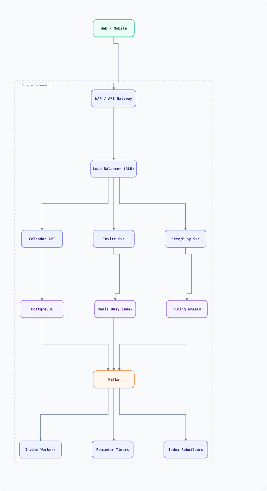

<div align="center">

# System Design: Google Calendar (Scheduling & Free-Busy)

</div>

> [!TIP]
> **TL;DR** — A calendar platform: events with recurrence and time zones, cross-user free/busy queries, invites with RSVP state machines, and conflict resolution — deceptively hard because the data model (recurrence × timezones × invites) explodes quietly.

## Table of Contents

<details>
<summary><b>📑 Jump to a section</b></summary>

1. [Overview](#overview)
2. [Requirements](#requirements)
3. [High-Level Architecture](#high-level-architecture)
4. [Microservices](#microservices)
5. [Database Design](#database-design)
6. [Scaling Tiers](#scaling-tiers)
7. [Key Techniques & Patterns](#key-techniques--patterns)
8. [Key Design Decisions](#key-design-decisions)
9. [Failure Modes & Recovery](#failure-modes--recovery)
10. [Cost Estimation (1M Users)](#cost-estimation-1m-users)
11. [Trade-off Analysis](#trade-off-analysis)
12. [Key Metrics to Monitor](#key-metrics-to-monitor)
13. [Deep Dive Prompts](#deep-dive-prompts)
14. [Common Interview Follow-ups](#common-interview-follow-ups)
15. [Low-Level Design (LLD) - Algorithms & Data Structures](#low-level-design-lld---algorithms--data-structures)
16. [Do's & Don'ts](#dos--donts)

</details>

---


## Overview

Calendar looks like CRUD and isn't. The hard parts: recurring events (RRULE expansion over infinite horizons), time zones with DST shifting per-attendee, free/busy queries across organizations without leaking event details, and invite/RSVP state across guests' own calendars. This is a data-modeling interview more than a scaling one.

### Key Numbers

| Metric | Value |
| :--- | :--- |
| **Events/day** | 500M+ (mostly recurring instances) |
| **Free/busy queries** | 50K / second (meeting scheduling) |
| **Attendees/event** | 2–500 (company all-hands larger) |
| **Recurring events** | ~40% of all events |

---

## Requirements

### Functional Requirements

- Create/edit/delete events with attendees, location, conferencing, attachments
- Recurrence: daily/weekly/monthly patterns with exceptions ("skip Dec 25")
- Invitations with RSVP (yes/no/maybe) synced to each guest's calendar
- Free/busy lookup across domains (without revealing event content)
- Reminders (popup/email) and notifications on change
- Multi-calendar per user with per-calendar sharing granularity

### Non-Functional Requirements

| Attribute | Target |
| :--- | :--- |
| **Free/busy latency** | < 300ms P99 |
| **Consistency** | invitation state converges across guests |
| **Timezone correctness** | DST-safe per-attendee rendering |
| **Availability** | 99.99% (business runs on it) |

---

## High-Level Architecture

### Architecture Diagram



**Interactive diagram:** [diagrams/system-design/google-calendar.architecture.html](diagrams/system-design/google-calendar.architecture.html) — pan/zoom, search, dark/light theme, PNG/SVG export.


**Interactive diagram:** [diagrams/system-design/google-calendar.architecture.html](diagrams/system-design/google-calendar.architecture.html) — pan/zoom, search, dark/light theme, PNG/SVG export.

### Data Flow

1. Event write → Calendar API → PostgreSQL (event + recurrence rule) → outbox → Kafka
2. Invite service fans invites to guest calendars (each guest's calendar holds an "attendee copy" row pointing at the master)
3. Free/busy service maintains **per-user busy-interval index** (interval tree per user, updated from change stream)
4. Reminders are future-dated jobs in the delayed-job scheduler (timing wheels)
5. Timezone rendering: store UTC + IANA tz + recurrence in RRULE; render per-viewer
6. RSVP changes propagate master → attendee copies via events (conflict rules: organizer owns time, guest owns RSVP)

## Microservices

| Service | Tech Stack | Database | Pattern |
| --------- | ------------ | ---------- | ---------- |
| Calendar API | Java | PostgreSQL | CRUD + outbox |
| Invite Service | Go | PostgreSQL + Kafka | Saga (RSVP propagation) |
| Free/Busy Service | Go | In-memory interval trees + Redis | Index + serve |
| Reminder Service | Go | Timing wheel (Redis) | Scheduled jobs |
| Notification Service | Go | Kafka | Event-driven |

---

## Database Design

### PostgreSQL

```sql
CREATE TABLE calendars (
  id UUID PRIMARY KEY, owner_id BIGINT, timezone TEXT, sharing_scope TEXT
);
CREATE TABLE events (
  id UUID PRIMARY KEY, calendar_id UUID, creator_id BIGINT,
  title TEXT, location TEXT,
  start_utc TIMESTAMPTZ NOT NULL, end_utc TIMESTAMPTZ NOT NULL,
  timezone TEXT DEFAULT 'UTC',            -- IANA, for rendering
  recurrence TEXT,                         -- RRULE string, NULL if one-off
  recurrence_timezone TEXT,
  updated_at TIMESTAMPTZ DEFAULT now()
);
CREATE TABLE event_exceptions (           -- "skip Dec 25" overrides
  event_id UUID, original_date DATE, override JSONB,  -- NULL = cancelled instance
  PRIMARY KEY (event_id, original_date)
);
CREATE TABLE attendees (
  event_id UUID, user_id BIGINT,
  status TEXT CHECK (status IN ('invited','yes','no','maybe')),
  response_at TIMESTAMPTZ, PRIMARY KEY (event_id, user_id)
);
CREATE TABLE attendee_copies (            -- event on a guest's own calendar
  user_id BIGINT, master_event_id UUID, master_calendar_id UUID,
  status TEXT, PRIMARY KEY (user_id, master_event_id)
);
CREATE INDEX idx_busy ON events (calendar_id, start_utc, end_utc)
  WHERE recurrence IS NULL;               -- busy index base for one-offs
```

---

## Scaling Tiers

| Tier | Users | Infrastructure | Monthly Cost |
| ------ | ------- | -------------- | ------------- |
| 1K-10K | 10K | 2 app + PostgreSQL primary/replica | $250 |
| 10K-1M | 1M | 8 app + PostgreSQL shards + Redis + Kafka | $5,000 |
| 1M-10M+ | 10M+ | 30 app + 16 PG shards + Redis + Kafka + ES (search) | $45,000 |

---

## Key Techniques & Patterns

- **RRULE expansion on demand**: never materialize infinite recurrences; expand a window (e.g., 90 days) and cache
- **Interval trees for free/busy**: per-user balanced interval index, O(log n + k) overlap queries
- **Saga Pattern**: invite propagation master→copies, RSVP copy→master, with defined conflict rules
- **Outbox Pattern**: event changes published reliably to Kafka
- **Delayed Job Scheduler**: reminders as future jobs (reuse of the timing-wheel doc)
- **Idempotency**: RSVP updates keyed by (event, user, sequence) to survive retries

---

## Key Design Decisions

1. **Store RRULE + UTC + IANA tz, not expanded instances**: exceptions and DST handled at render; storage stays small
2. **Attendee copies as first-class rows**: each guest sees/edits their copy; organizer master stays authoritative for time
3. **Free/busy as derived index**: rebuilt from the change stream; serves without touching event details (privacy boundary)
4. **PostgreSQL over Cassandra**: events are strongly consistent, relational (calendars→events→attendees), and modest in size per user
5. **Busy intervals, not events, are the query unit**: cross-org scheduling only ever sees opaque intervals

---

## Failure Modes & Recovery

| Failure | Impact | Mitigation |
| --------- | -------- | ----------- |
| Free/busy index stale | Double-booked meetings | Rebuild from events; staleness alert; interval version checks |
| RRULE expansion bug | Wrong instance dates | Golden-file tests across DST transitions |
| Invite propagation loop | Ping-pong RSVP updates | Directed propagation only (master→copy, copy→master), sequence numbers |
| Clock/timezone drift | Shifted meetings | Store IANA tz per event; render-time conversion only |
| Reminder scheduler down | Missed reminders | Persisted timing wheels; catch-up scan on recovery |

---

## Cost Estimation (1M Users)

| Component | Configuration | Monthly Cost |
| ----------- | -------------- | ------------- |
| App (8) | c7g.xlarge | $1,100 |
| PostgreSQL (sharded ×4, HA) | db.r7g.2xlarge | $2,800 |
| Redis | cache.r7g.large ×3 | $700 |
| Kafka (3) | m7g.large | $900 |
| Elasticsearch (search) | r7g.large ×3 | $800 |
| **Total** | | **~$6,300** |

---

## Trade-off Analysis

| Decision | Option A | Option B | Choice | Why |
| ---------- | ---------- | ---------- | -------- | ----- |
| Recurrence storage | Pre-expand instances | RRULE + exceptions | RRULE | Infinite horizon, tiny storage |
| Free/busy | Query events directly | Derived interval index | Index | Fast, privacy-preserving |
| Invites | Shared event row | Per-guest copies | Copies | Guest autonomy; matches real semantics |
| Primary store | Cassandra | PostgreSQL | PostgreSQL | ACID invites, relational model |
| Reminders | Cron scan | Timing wheel | Timing wheel | Precise, no table scans |

---

## Key Metrics to Monitor

1. Free/busy latency P99 and index staleness
2. Invite propagation lag & failure rate
3. RRULE expansion cache hit ratio
4. Reminder fire punctuality (fire − target time)
5. RSVP convergence time across guests
6. Event CRUD error rates by calendar shard

---

## Deep Dive Prompts

1. Design "find a slot for 8 people across 3 time zones" (constraint intersection at scale).
2. How do you handle a meeting whose organizer is deleted as a user?
3. Design delegation — an assistant managing an exec's calendar.
4. How would you support calendar-level E2E encryption while keeping free/busy working?
5. Design natural-language event creation ("lunch with Ana next Thursday").

---

## Common Interview Follow-ups

1. Why is storing per-instance expanded events a scaling trap?
2. How do you keep 500-attendee meeting RSVPs from hot-looping the master event?
3. How do you merge a user's external iCal feed without melting the busy index?
4. What breaks when a country abolishes DST overnight?
5. How do you test recurrence code? (property tests across DST boundaries)

---

## Low-Level Design (LLD) - Algorithms & Data Structures

### RRULE Expansion + Free/Busy Intersection

```text
// Weekly RRULE with exceptions, expanded lazily over a window.
function expandWeekly(rrule, windowStartMs, windowEndMs) {
  const out = [];
  const { startMs, intervalWeeks, byDay, count, untilMs, except = [] } = rrule;
  let week = new Date(startMs);
  week.setUTCHours(0, 0, 0, 0);
  const startDay = week.getTime();
  let made = 0;
  for (let w = 0; made < count && startMs + w * intervalWeeks * 6048e5 <= (untilMs ?? windowEndMs); w++) {
    for (const day of byDay) {                    // e.g. [1,3] = Mon,Wed (0=Sun)
      const t = startDay + w * intervalWeeks * 6048e5 + day * 864e5 + (startMs % 864e5);
      if (t < windowStartMs || t > windowEndMs) continue;
      if (except.includes(t)) continue;           // cancelled instance
      out.push(t); made++;
      if (made >= count) break;
    }
  }
  return out;
}

// Interval tree node for free/busy: check if [s,e) is free
function isFree(intervals, s, e) {
  return !intervals.some(([a, b]) => s < b && a < e);
}

const r = { startMs: Date.UTC(2026, 8, 21, 10), intervalWeeks: 1, byDay: [1, 3], count: 6, except: [Date.UTC(2026, 8, 23, 10)] };
console.log(expandWeekly(r, Date.UTC(2026, 8, 1), Date.UTC(2026, 9, 31)));
console.log(isFree([[Date.UTC(2026, 8, 21, 9), Date.UTC(2026, 8, 21, 11)]], Date.UTC(2026, 8, 21, 11), Date.UTC(2026, 8, 21, 12))); // true
```

### Recurrence Expansion (RFC 5545 without the infinite loop)

A yearly rule ("Jan 1, forever") can't be stored as rows. Store the **rule**, expand a bounded window on read, and cache the expansion.

```js
function expandRRULE(dueTs, freq, interval, count, untilTs, windowStartTs, windowEndTs) {
  // bounded expansion: only materialize occurrences inside [windowStart, windowEnd]
  const out = [];
  const step = { daily: 864e5, weekly: 7 * 864e5, monthly: 30.44 * 864e5, yearly: 365.25 * 864e5 }[freq] * interval;
  let t = dueTs;
  if (count) { // bounded series: walk occurrences directly
    for (let i = 0; i < count && t <= untilTs; i++, t += step) if (t >= windowStartTs && t <= windowEndTs) out.push(t);
    return out;
  }
  // infinite series: jump straight into the window (no walking from 1970)
  if (t < windowStartTs) t = windowStartTs + ((t - windowStartTs) % step + step) % step;
  while (t <= windowEndTs) { out.push(t); t += step; }
  return out;   // caller writes back the expanded rows with a watermark = windowEnd
}
console.log(expandRRULE(Date.UTC(2026, 0, 1), 'monthly', 1, null, null,
                        Date.UTC(2026, 8, 1), Date.UTC(2026, 8, 30)).length); // ~1 (Sept 2026)
```

Production notes: real systems expand with a **materialized-occurrences cache** (expand 90 days ahead on write, background job extends the watermark before it lapses — same shape as the feed-materializer in §42); DST is handled by storing *local time + IANA zone* and re-localizing each occurrence (never store epoch-shifted recurring events); exceptions (single-instance edits/deletes) are stored as `EXDATE`/override rows keyed `(series_id, original_time)` and filtered at expansion.

## Do's & Don'ts

| ✅ Do | ❌ Don't |
| :-- | :-- |
| Pin down the key numbers before drawing boxes | Don't hand-wave the hardest component — google calendar lives or dies there |
| Justify the functional requirements choice against one alternative out loud | Don't default to the trendiest store without a consistency/scale argument |
| State the failure mode of non-functional requirements explicitly (what breaks first?) | Don't present a sunny-day design only — the follow-up question is always "and when it fails?" |
| Anchor capacity numbers before proposing shards/replicas | Don't introduce a component you can't cost or size with the numbers on the board |

*More cross-topic rules: [Interview Q&A §81](interview-qa.md#81-universal-dos--donts) · Concepts: [Networking](networking.md) · [Operating Systems](operating-systems.md)*

---

<nav>← [google ads](system-design-google-ads.md) · [📖 All guides](README.md) · [google docs](system-design-google-docs.md) →</nav>
