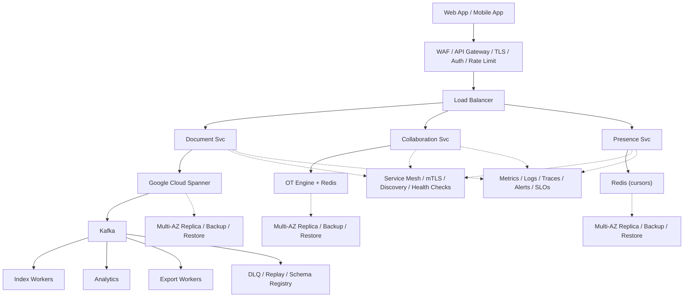

# System Design: Google Docs

## Overview

Real-time collaborative document editor with OT/CRDT conflict resolution.

### Key Numbers

- 1B+ users, 500M+ docs/day, <100ms sync, 50+ concurrent editors

---

## Requirements

### Functional Requirements

- Create/edit rich-text documents with formatting
- Real-time collaboration with multiple cursors
- Offline editing with sync on reconnect
- Comments, suggestions, track changes
- Version history and rollback
- Export to PDF, DOCX, HTML

### Non-Functional Requirements

- Sync latency < 100ms, doc open < 500ms
- 10M+ concurrent documents, 99.99% availability

---

## High-Level Architecture

### Architecture Diagram



### Data Flow

1. User opens document - Document Service loads from Spanner
2. WebSocket to Collaboration Service (OT/CRDT engine)
3. User types operation - OT transforms against concurrent ops
4. Server applies operation, broadcasts to all connected users
5. Presence Service tracks cursors, selections in real-time
6. Version history stored as operation log (append-only)
7. Kafka events: edit, share, comment - Analytics + indexing

## Microservices

| Service | Responsibility | Tech Stack | Pattern |
| --------- | --------------- | ------------ | --------- |
| Document Service | CRUD, version history | Node.js, PostgreSQL | Event Sourcing |
| Sync Service | Real-time OT/CRDT sync | Go, WebSocket | Operational Transform |
| Presence Service | Cursors, online users | Redis, WebSocket | Pub/Sub |
| Comment Service | Threaded comments | Node.js, PostgreSQL | CQRS |
| Export Service | PDF, DOCX, HTML export | Python, Puppeteer | Worker Queue |
| Storage Service | Document blob storage | GCS, CDN | Object Storage |

---

## Database Design

```sql
CREATE TABLE documents (
    doc_id UUID PRIMARY KEY, owner_id BIGINT NOT NULL,
    title VARCHAR(500), content JSONB, version BIGINT DEFAULT 0,
    created_at TIMESTAMP DEFAULT NOW(), updated_at TIMESTAMP DEFAULT NOW()
);

CREATE TABLE operations (
    op_id BIGSERIAL PRIMARY KEY, doc_id UUID REFERENCES documents(doc_id),
    user_id BIGINT NOT NULL, op_type VARCHAR(20), position INT,
    content TEXT, version BIGINT, created_at TIMESTAMP DEFAULT NOW()
);

CREATE TABLE comments (
    comment_id UUID PRIMARY KEY, doc_id UUID REFERENCES documents(doc_id),
    user_id BIGINT NOT NULL, parent_id UUID, content TEXT,
    resolved BOOLEAN DEFAULT FALSE, created_at TIMESTAMP DEFAULT NOW()
);
```

---

## Scaling Tiers

### 1K - 10K Users ($500/mo)

- Single PostgreSQL, 2 Redis, GCS for storage, single sync server

### 10K - 1M Users ($20K/mo)

- PostgreSQL read replicas, Redis cluster, OT sharded by doc, CDN

### 1M - 10M+ Users ($800K/mo)

- PG cluster sharded, 100+ Redis, multi-region OT servers, GCS multi-region

---

## Key Design Decisions

| Decision | Choice | Why |
| ---------- | -------- | ----- |
| Conflict Resolution | Operational Transformation | Proven for text editing, deterministic |
| Storage Format | JSON operations log | Enables version history and undo |
| Sync Protocol | WebSocket + heartbeat | Bidirectional real-time sync |
| Offline Support | Local op queue + merge | Never lose user edits |
| Cursor Presence | Redis pub/sub | Low-latency cursor sharing |

---

## Failure Modes & Recovery

| Failure | Impact | Recovery |
| --------- | -------- | ---------- |
| OT Server crash | Sync stops | Save-only mode, queue locally |
| Database failure | State lost | Restore from op log replay |
| Redis failure | Presence lost | Rebuild from client heartbeats |
| Network partition | Split-brain | OT guarantees convergence |
| Op log overflow | Slow lookups | Archive old ops to cold storage |

---

## Cost Estimation (1M Users)

| Component | Monthly Cost |
| ----------- | ------------- |
| Compute (OT + Doc servers) | $8,000 |
| PostgreSQL cluster | $3,000 |
| Redis cluster (50GB) | $2,500 |
| GCS (10TB) + CDN | $285 |
| Monitoring | $1,500 |
| Total | ~$15,285 |

---

## Trade-off Analysis

| Trade-off | Option A | Option B | Winner | Why |
| ----------- | ---------- | ---------- | -------- | ----- |
| Conflict Resolution | OT | CRDT | OT | Proven for text editing |
| Storage Model | Snapshot | Op Log | Op Log | Version history + undo |
| Sync Protocol | WebSocket | SSE | WebSocket | Bidirectional, lower latency |
| Offline Strategy | Conflict-free | LWW | Conflict-free | Never lose edits |

---

## Key Metrics to Monitor

| Metric | Target | Alert Threshold |
| -------- | -------- | ----------------- |
| Sync Latency P99 | < 100ms | > 200ms |
| Document Open Time | < 500ms | > 2s |
| Conflict Resolution Rate | < 0.1% | > 1% |
| Offline Sync Success | > 99.9% | < 99% |

---

## Deep Dive Prompts

1. **How does OT handle 50 concurrent editors on the same line?**
2. **Explain OT vs CRDTs for collaborative editing.**
3. **How to implement offline editing with sync on reconnect?**
4. **Design version history and rollback system.**
5. **How to handle large documents without perf degradation?**
6. **Explain cursor presence system for showing other users cursors.**

---

## Key Techniques & Patterns

| Technique | Description | Used In |
| ----------- | ------------- | ---------- |
| Operational Transformation (OT) | Applied in this system | Architecture + LLD |
| CRDT for Offline | Applied in this system | Architecture + LLD |
| WebSocket for Real-time Sync | Applied in this system | Architecture + LLD |
| Version History (Op Log) | Applied in this system | Architecture + LLD |
| Cursor Presence | Applied in this system | Architecture + LLD |
| Conflict Resolution | Applied in this system | Architecture + LLD |

## Common Interview Follow-ups

**Q: How does OT handle conflicting edits on the same position?**
A: The OT server receives operations in causal order. When two users edit the same position, transformation functions reconcile the operations. Regardless of arrival order, the final document state is identical.

**Q: How do you handle offline editing?**
A: Operations are queued locally using the same OT engine. On reconnect, pending operations are sent to the server, transformed against concurrent edits, and broadcast to other clients.

**Q: How do you prevent edit conflicts in formatting?**
A: Formatting operations are represented as spans with start/end positions. Concurrent overlapping spans are merged, and both formats are applied.

---

## Low-Level Design (LLD)

### 1. Operational Transformation Engine

```text
class OTEngine {
  constructor(docId) {
    this.docId = docId;
    this.version = 0;
    this.operations = [];
  }

  apply(operation) {
    let transformed = { ...operation };

    for (const prev of this.operations) {
      if (prev.version >= (transformed.baseVersion ?? 0)) {
        transformed = this.transform(transformed, prev);
      }
    }

    transformed.version = ++this.version;
    this.operations.push(transformed);
    return transformed;
  }

  transform(op1, op2) {
    if (op1.type === "insert" && op2.type === "insert") {
      if (op1.position <= op2.position) return { ...op1 };
      return { ...op1, position: op1.position + op2.content.length };
    }

    if (op1.type === "delete" && op2.type === "insert") {
      if (op1.position < op2.position) return { ...op1 };
      return { ...op1, position: op1.position + op2.content.length };
    }

    return { ...op1 };
  }
}
```

### 2. Document Sync Manager

```text
class SyncManager {
  constructor(ws, docId, userId) {
    this.ws = ws;
    this.docId = docId;
    this.userId = userId;
    this.pendingOps = [];
    this.version = 0;
    this.doc = [];
  }

  sendOperation(op) {
    const operation = {
      ...op,
      baseVersion: this.version,
      userId: this.userId,
    };

    this.pendingOps.push(operation);
    this.ws.send(JSON.stringify({ type: "op", operation }));
  }

  receiveOperation(op) {
    let transformed = { ...op };

    for (const pending of this.pendingOps) {
      transformed = this.transform(transformed, pending);
    }

    this.version = Math.max(this.version, transformed.version ?? this.version + 1);
    this.applyToDocument(transformed);
    this.pendingOps = this.pendingOps.filter((pending) => pending.id !== transformed.id);
  }

  transform(op1, op2) {
    if (op1.type === "insert" && op2.type === "insert") {
      if (op1.position <= op2.position) return { ...op1 };
      return { ...op1, position: op1.position + op2.content.length };
    }

    if (op1.type === "delete" && op2.type === "insert") {
      if (op1.position < op2.position) return { ...op1 };
      return { ...op1, position: op1.position + op2.content.length };
    }

    return { ...op1 };
  }

  applyToDocument(op) {
    if (op.type === "insert") {
      this.doc.splice(op.position, 0, ...op.content.split(""));
    } else if (op.type === "delete") {
      this.doc.splice(op.position, op.length);
    }
  }
}

const ws = {
  send(payload) {
    console.log("Sent:", payload);
  },
};

const sync = new SyncManager(ws, "doc-42", "user-7");
sync.sendOperation({ id: "op-1", type: "insert", position: 0, content: "Hello" });
console.log("Document sync ready");
```
