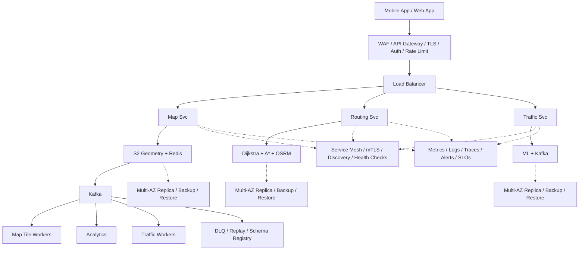

# System Design: Google Maps (Navigation & Mapping Service)

## Overview

Google Maps is a comprehensive mapping and navigation service providing map rendering, location search, turn-by-turn directions, real-time traffic updates, ETA estimation, Street View, and Points of Interest (POI) discovery.

### Key Numbers

- 1B+ monthly active users
- 200M+ road segments in the road graph
- 50M+ km of mapped roads
- 200M+ Points of Interest
- 1B+ map tile requests per day
- Sub-100ms route computation

---

## Requirements

### Functional Requirements

- Search for locations by address, name, or coordinates with autocomplete
- Display interactive maps with zoom levels (street to satellite view)
- Compute fastest route between source and destination (driving, walking, cycling, transit)
- Provide turn-by-turn navigation with voice guidance
- Show real-time traffic conditions and incident reports
- Display ETA based on current traffic and historical patterns
- Find nearby POIs (restaurants, gas stations, hospitals) ranked by relevance
- Support offline map download for selected regions

### Non-Functional Requirements

- Latency: Map tiles < 100ms, route computation < 500ms, search < 200ms
- Throughput: 10M+ concurrent users, 1B+ tile requests/day
- Availability: 99.99% (navigation is safety-critical)
- Consistency: Eventually consistent for traffic data (5-10s lag)
- Accuracy: ETA within 10% of actual arrival time

---

## High-Level Architecture

### Architecture Diagram



### Data Flow

1. User opens map - Map Service renders tiles from CDN cache
2. User requests route - Routing Service computes with A*/Dijkstra
3. Traffic Service overlays real-time congestion (Kafka GPS feed)
4. ETA updated every 30 seconds based on live traffic
5. Turn-by-turn navigation - WebSocket streams next maneuvers
6. Kafka events: GPS pings, route requests - ML traffic model
7. Analytics: popular routes, traffic patterns, tile requests

## Microservices

| Service | Responsibility | Tech Stack | Pattern |
| --------- | --------------- | ------------ | --------- |
| Map Tile Service | Pre-render and serve map tiles | Go, Cloud Storage, CloudFront | CQRS, CDN Edge Cache |
| Routing Service | Compute shortest/optimal paths | C++, Contraction Hierarchies | Graph Algorithm Service |
| Traffic Service | Aggregate real-time GPS signals | Kafka, Apache Flink, Redis | Stream Processing |
| ETA Service | Predict arrival time using ML | Python, TensorFlow, Redis | ML Inference Service |
| Search Service | Location autocomplete, geocoding | Elasticsearch, Redis, Trie | Search + Autocomplete |
| POI Service | Points of Interest discovery | PostgreSQL/PostGIS, Redis | Geo Query Service |
| Navigation Service | Turn-by-turn voice guidance | Go, WebSocket | Real-time Session |
| Offline Service | Manage map downloads | S3, CDN, Device Sync | Sync Service |

---

## Database Design

```sql
CREATE TABLE road_segments (
    segment_id BIGSERIAL PRIMARY KEY,
    start_lat DOUBLE PRECISION, start_lng DOUBLE PRECISION,
    end_lat DOUBLE PRECISION, end_lng DOUBLE PRECISION,
    road_name VARCHAR(255), road_type VARCHAR(50),
    speed_limit INT, length_meters DOUBLE PRECISION,
    created_at TIMESTAMP DEFAULT NOW()
);

CREATE TABLE road_graph (
    segment_id BIGINT REFERENCES road_segments(segment_id),
    from_node BIGINT, to_node BIGINT,
    weight_sec DOUBLE PRECISION, distance_m DOUBLE PRECISION,
    PRIMARY KEY (segment_id, from_node, to_node)
);

CREATE TABLE traffic_updates (
    update_id BIGSERIAL PRIMARY KEY,
    segment_id BIGINT REFERENCES road_segments(segment_id),
    avg_speed_kph DOUBLE PRECISION,
    congestion VARCHAR(20), incident_type VARCHAR(50),
    reported_at TIMESTAMP DEFAULT NOW()
);

CREATE TABLE poi (
    poi_id BIGSERIAL PRIMARY KEY,
    name VARCHAR(255), category VARCHAR(100),
    lat DOUBLE PRECISION, lng DOUBLE PRECISION,
    rating DECIMAL(2,1), address TEXT,
    created_at TIMESTAMP DEFAULT NOW()
);
```

---

## Scaling Tiers

### 1K - 10K Users ($500/mo)

- Single PostgreSQL with PostGIS, 2 Redis instances
- Map tiles from S3 + CloudFront
- Single routing server (in-memory road graph)

### 10K - 1M Users ($20K/mo)

- PostgreSQL read replicas, Redis cluster
- Road graph sharded by geohash
- Kafka for real-time GPS stream processing

### 1M - 10M+ Users ($800K/mo)

- PostGIS cluster with geospatial sharding
- 100+ Redis instances for tile/route/traffic cache
- Kafka cluster with Flink for stream processing
- 1000+ CDN edge nodes globally

---

## Key Techniques & Patterns

| Technique | Description | Used In |
| ----------- | ------------- | ---------- |
| Contraction Hierarchies | Fastest path algorithm for road networks | Routing Service |
| Geohash Indexing | Spatial indexing for proximity queries | POI Service, Search |
| Consistent Hashing | Distribute road graph across nodes | Routing Service |
| Redis Caching | Cache frequent routes and tiles | All services |
| Kafka Stream Processing | Real-time GPS signal aggregation | Traffic Service |
| CDN Edge Caching | Serve pre-rendered tiles globally | Map Tile Service |
| ML ETA Prediction | Combine real-time + historical data | ETA Service |
| PostGIS Geospatial | SQL-based spatial queries | POI Service |
| SOLID Principles | Single Responsibility per microservice | All services |
| Circuit Breaker | Graceful degradation on failure | All services |

---

## Key Design Decisions

| Decision | Choice | Why |
| ---------- | -------- | ----- |
| Road Graph | Contraction Hierarchies | 1000x faster than Dijkstra |
| Tile Rendering | Pre-rendered + On-demand | 95% cache hit rate |
| Traffic Processing | Apache Flink | Sub-second latency for GPS aggregation |
| Geospatial Index | Geohash + Quadtree | Efficient proximity queries |
| ETA Prediction | ML model + historical | Combines real-time with patterns |
| Map Storage | Cloud Storage + CDN | Petabytes of tile data globally |

---

## Failure Modes & Recovery

| Failure | Impact | Recovery |
| --------- | -------- | ---------- |
| Traffic Service down | No real-time traffic | Serve stale data (5 min old) |
| Routing Service crash | No route computation | Pre-computed routes for top pairs |
| CDN edge failure | Slow tile loading | Route to next-nearest edge |
| GPS signal flood | Traffic Service overloaded | Auto-scale Flink, sample 10% |
| Road graph corruption | Incorrect routing | Restore from daily snapshot |
| ML ETA model drift | Inaccurate ETAs | Retrain, fall back to historical |

---

## Cost Estimation (1M Users)

| Component | Monthly Cost |
| ----------- | ------------- |
| CDN (CloudFront, 100TB) | $8,500 |
| Compute (routing + traffic) | $12,000 |
| PostgreSQL/PostGIS cluster | $3,000 |
| Redis cluster (100GB) | $4,000 |
| Kafka + Flink streaming | $6,000 |
| ML inference (ETA model) | $5,000 |
| S3 (tile storage, 50TB) | $1,150 |
| Monitoring | $2,000 |
| Total | ~$41,650 |

---

## Trade-off Analysis

| Trade-off | Option A | Option B | Winner | Why |
| ----------- | ---------- | ---------- | -------- | ----- |
| Routing | Dijkstra (exact) | Contraction Hierarchies | CH | 1000x faster, <1% loss |
| Tile Storage | Pre-render all | On-demand | Hybrid | 95% cache hit |
| Traffic Data | GPS only | Crowdsourced + sensors | Hybrid | Better coverage |
| ETA Model | Rule-based | ML + historical | ML | 15% more accurate |
| Graph Partitioning | Geographic | Random | Geographic | Minimizes cross-shard |

---

## Key Metrics to Monitor

| Metric | Target | Alert Threshold |
| -------- | -------- | ----------------- |
| Tile Cache Hit Rate | > 95% | < 90% |
| Route Computation P99 | < 500ms | > 1s |
| Traffic Update Latency | < 5s | > 10s |
| ETA Accuracy (MAPE) | < 10% | > 15% |
| GPS Signal Processing | > 1M/sec | < 500K/sec |
| Autocomplete P99 | < 100ms | > 200ms |

---

## Deep Dive Prompts

1. **How does Google Maps compute routes across 200M+ segments in < 500ms?**
2. **Explain Contraction Hierarchies and why it outperforms A*.**
3. **How would you handle traffic from 10M+ GPS signals per second?**
4. **Design the ETA prediction system combining real-time + historical.**
5. **How does tile pre-rendering work for 20+ zoom levels?**
6. **Explain geohashing for efficient proximity queries.**

---

## Common Interview Follow-ups

**Q: How do you handle route recalculation when traffic changes mid-navigation?**
A: Navigation Service subscribes to Traffic Service via WebSocket. When a segment on the active route changes congestion, ETA Service re-evaluates the remaining route. If faster alternative exists, client is notified.

**Q: How does Google Maps handle new roads or construction zones?**
A: New road segments ingested from OpenStreetMap, municipal data feeds, and satellite imagery. System uses GPS traces from early users to validate. Traffic patterns bootstrapped from similar road types.

**Q: How would you design offline maps?**
A: Offline Service downloads pre-rendered tiles + road graph for user-selected bounding box. Device runs simplified routing engine (A* on local graph). Traffic unavailable offline, ETAs use historical averages.

---

## Low-Level Design (LLD)

### 1. Dijkstras Shortest Path

```text
class RoadGraph {
  constructor() {
    this.adjacency = new Map();
  }

  addEdge(from, to, weight, segmentId) {
    if (!this.adjacency.has(from)) this.adjacency.set(from, []);
    this.adjacency.get(from).push({ to, weight, segmentId });
  }

  dijkstra(source, destination) {
    const dist = new Map();
    const prev = new Map();
    const visited = new Set();
    const pq = [{ node: source, dist: 0 }];
    dist.set(source, 0);

    while (pq.length > 0) {
      pq.sort((a, b) => a.dist - b.dist);
      const { node: u } = pq.shift();
      if (visited.has(u)) continue;
      visited.add(u);
      if (u === destination) break;

      for (const { to: v, weight } of (this.adjacency.get(u) || [])) {
        const newDist = dist.get(u) + weight;
        if (!dist.has(v) || newDist < dist.get(v)) {
          dist.set(v, newDist);
          prev.set(v, u);
          pq.push({ node: v, dist: newDist });
        }
      }
    }

    const path = [];
    let current = destination;
    while (current !== undefined) {
      path.unshift(current);
      current = prev.get(current);
    }
    return { path, distance: dist.get(destination) };
  }
}
```

### 2. Geohash Index for Proximity Queries

```text
class GeohashIndex {
  constructor(precision = 7) {
    this.precision = precision;
    this.buckets = new Map();
  }

  encode(lat, lng) {
    const BASE32 = "0123456789bcdefghjkmnpqrstuvwxyz";
    let minLat = -90, maxLat = 90, minLng = -180, maxLng = 180;
    let geohash = "", bit = 0, ch = 0;
    while (geohash.length < this.precision) {
      if (bit % 2 === 0) {
        const mid = (minLng + maxLng) / 2;
        if (lng >= mid) { ch |= (1 << (4 - bit % 5)); minLng = mid; }
        else { maxLng = mid; }
      } else {
        const mid = (minLat + maxLat) / 2;
        if (lat >= mid) { ch |= (1 << (4 - bit % 5)); minLat = mid; }
        else { maxLat = mid; }
      }
      bit++;
      if (bit % 5 === 0) { geohash += BASE32[ch]; ch = 0; }
    }
    return geohash;
  }

  insert(lat, lng, poiId) {
    const hash = this.encode(lat, lng);
    if (!this.buckets.has(hash)) this.buckets.set(hash, []);
    this.buckets.get(hash).push({ lat, lng, poiId });
  }

  haversine(lat1, lng1, lat2, lng2) {
    const R = 6371;
    const dLat = (lat2 - lat1) * Math.PI / 180;
    const dLng = (lng2 - lng1) * Math.PI / 180;
    const a = Math.sin(dLat / 2) ** 2 +
      Math.cos(lat1 * Math.PI / 180) * Math.cos(lat2 * Math.PI / 180) *
      Math.sin(dLng / 2) ** 2;
    return R * 2 * Math.atan2(Math.sqrt(a), Math.sqrt(1 - a));
  }
}

const routing = new RoutingService(); console.log("Routing service ready");
```
