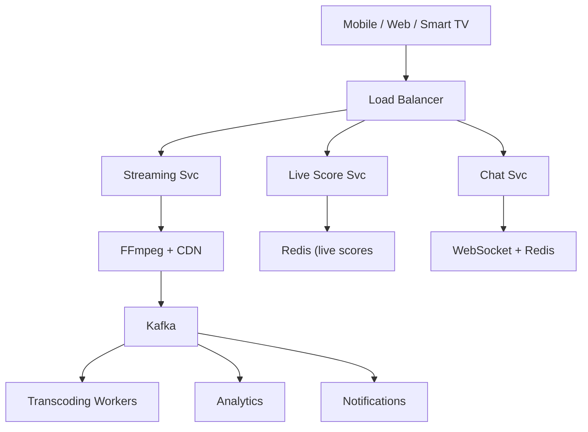

# System Design: Hotstar (Live Streaming Platform)

## Overview

Hotstar (now Disney+ Hotstar) is a large-scale video streaming platform supporting live sports (cricket, football), entertainment shows, and Video-on-Demand (VOD). It must handle massive concurrent live viewership (e.g., 25M+ for IPL matches), adaptive bitrate streaming, low-latency live delivery, and personalized content recommendations.

### Key Numbers

- 400M+ registered users
- 25M+ concurrent live viewers during peak events
- 100K+ hours of content
- Sub-3-second live stream latency

---

## Requirements

### Functional Requirements

- Stream live sports (cricket, football) with < 3s latency
- Stream VOD with adaptive bitrate
- Live cricket with real-time score overlay
- Search/browse with personalized recommendations
- Multi-device viewing with playback sync

### Non-Functional Requirements

- Latency: Live stream < 3s, VOD start < 2s
- Throughput: 10M+ concurrent live viewers
- Availability: 99.99% during live events
- Consistency: Eventually consistent for recs
- Scale: 100M+ registered users

---

---

---

## High-Level Architecture

### Architecture Diagram



### Data Flow

1. User requests live match - CDN routes to nearest edge server
2. Live Score Service pushes real-time scores via Redis pub/sub
3. WebSocket Chat Service handles live commentary for millions
4. Kafka ingests viewing events from all CDN edge nodes
5. Transcoding Workers encode incoming stream at multiple bitrates
6. Analytics pipeline processes viewership in real-time (Flink)
7. Notifications service alerts users of match start, wickets, goals

## Microservices

### 1. Auth & Identity Service

- **Responsibility**: User registration, login (email/phone/social), JWT token management, session management, device fingerprinting
- **Tech**: Go / Node.js
- **DB**: PostgreSQL (users, sessions)
- **Cache**: Redis (session tokens, rate limits)

### 2. Content Management Service

- **Responsibility**: Content catalog CRUD, metadata management, content categorization, editorial featured content, content lifecycle (upload -> transcode -> publish)
- **Tech**: Java / Spring Boot
- **DB**: MongoDB (flexible content schemas, nested metadata)
- **Cache**: Redis (hot content metadata)

### 3. Live Stream Ingest Service

- **Responsibility**: RTMP/SRT ingest from broadcast sources, stream health monitoring, multi-bitrate stream splitting, DRM token generation
- **Tech**: Go / Rust + Nginx-RTMP / SRS
- **DB**: Redis (active stream state)
- **Protocol**: RTMP -> HLS/DASH segments

### 4. Transcoding Service

- **Responsibility**: Adaptive bitrate transcoding, codec conversion (H.264/H.265/AV1), thumbnail/extraction, quality ladder generation
- **Tech**: FFmpeg + AWS Elemental MediaConvert / custom GPU cluster
- **Queue**: Kafka (transcode job queue)
- **Storage**: S3 (transcoded segments)

### 5. Stream Delivery / Playback Service

- **Responsibility**: HLS/DASH manifest generation, ABR (adaptive bitrate) logic, DRM license proxy (Widevine/FairPlay), CDN manifest serving, player analytics
- **Tech**: Go / Node.js
- **CDN**: CloudFront + Akamai (multi-CDN)
- **Cache**: Redis (manifest caching)

### 6. User Profile & Preference Service

- **Responsibility**: User profiles, watch history, continue watching, content preferences, parental controls, multi-profile support
- **Tech**: Go
- **DB**: Cassandra (write-heavy watch history, time-series pattern)
- **Cache**: Redis (user preferences)

### 7. Recommendation Service

- **Responsibility**: Personalized content recommendations, trending/popular content, collaborative filtering, content-based filtering, "Top 10" lists
- **Tech**: Python (ML models), TensorFlow/PyTorch
- **DB**: PostgreSQL (ML features), Redis (recommendation cache)
- **Pipeline**: Spark/Flink for model training, real-time inference

### 8. Subscription & Billing Service

- **Responsibility**: Plan management, payment processing, invoice generation, promo codes, free trial management, subscription lifecycle
- **Tech**: Java / Spring Boot
- **DB**: PostgreSQL (ACID for financial data)
- **Integrations**: Stripe, Razorpay, Apple IAP, Google Play Billing

### 9. Notification Service

- **Responsibility**: Push notifications (FCM/APNs), email (SendGrid), SMS, in-app notifications, event-based triggers (new episode, live match starting)
- **Tech**: Node.js
- **Queue**: Kafka consumer
- **DB**: PostgreSQL (notification history)

### 10. Search Service

- **Responsibility**: Full-text search, autocomplete, faceted search (genre, language, year), search analytics, "Did you mean?" corrections
- **Tech**: Go / Python
- **DB**: Elasticsearch (full-text indexing)
- **Cache**: Redis (popular search results)

### 11. Analytics & Metrics Service

- **Responsibility**: Real-time viewership dashboards, content performance metrics, A/B test analysis, CDN analytics, revenue reporting
- **Tech**: Flink (streaming) + Spark (batch)
- **DB**: ClickHouse (OLAP), S3 (data lake)
- **Pipeline**: Kafka -> Flink -> ClickHouse

### 12. Ad Service

- **Responsibility**: Dynamic ad insertion (DAI), ad targeting, ad tracking/impression counting, VAST/VMAP compliance, ad-free subscription enforcement
- **Tech**: Go / Node.js
- **DB**: PostgreSQL (campaign data), Redis (ad cache)
- **Integrations**: Google DFP/Ad Manager, programmatic DSPs

---

## Database Design

### PostgreSQL (Users & Billing)

```sql
-- Users
CREATE TABLE users (
    user_id         UUID PRIMARY KEY DEFAULT gen_random_uuid(),
    email           VARCHAR(255) UNIQUE,
    phone           VARCHAR(20) UNIQUE,
    password_hash   VARCHAR(255),
    name            VARCHAR(255) NOT NULL,
    avatar_url      TEXT,
    country         VARCHAR(3),
    preferred_lang  VARCHAR(10) DEFAULT 'en',
    is_verified     BOOLEAN DEFAULT FALSE,
    created_at      TIMESTAMP DEFAULT NOW(),
    updated_at      TIMESTAMP DEFAULT NOW()
);

-- Subscriptions
CREATE TABLE subscriptions (
    subscription_id UUID PRIMARY KEY DEFAULT gen_random_uuid(),
    user_id         UUID REFERENCES users(user_id),
    plan_id         UUID REFERENCES plans(plan_id),
    status          VARCHAR(20) NOT NULL,
    started_at      TIMESTAMP NOT NULL,
    expires_at      TIMESTAMP,
    auto_renew      BOOLEAN DEFAULT TRUE,
    payment_method  VARCHAR(50),
    created_at      TIMESTAMP DEFAULT NOW()
);

-- Plans
CREATE TABLE plans (
    plan_id         UUID PRIMARY KEY DEFAULT gen_random_uuid(),
    name            VARCHAR(100) NOT NULL,
    price_monthly   DECIMAL(10,2),
    price_yearly    DECIMAL(10,2),
    currency        VARCHAR(3) DEFAULT 'INR',
    max_quality     VARCHAR(10),
    concurrent_streams INT DEFAULT 1,
    features        JSONB,
    is_active       BOOLEAN DEFAULT TRUE,
    created_at      TIMESTAMP DEFAULT NOW()
);

-- Payments
CREATE TABLE payments (
    payment_id      UUID PRIMARY KEY DEFAULT gen_random_uuid(),
    user_id         UUID REFERENCES users(user_id),
    subscription_id UUID REFERENCES subscriptions(subscription_id),
    amount          DECIMAL(10,2) NOT NULL,
    currency        VARCHAR(3) NOT NULL,
    gateway         VARCHAR(50),
    gateway_txn_id  VARCHAR(255),
    status          VARCHAR(20),
    created_at      TIMESTAMP DEFAULT NOW()
);
```

### MongoDB (Content Catalog)

```text
// Content Document
{
  content_id: "uuid",
  title: "IPL 2026 - MI vs CSK",
  type: "live",
  description: "...",
  thumbnail_url: "https://cdn.hotstar.com/...",
  backdrop_url: "https://cdn.hotstar.com/...",
  genres: ["Sports", "Cricket"],
  languages: ["Hindi", "English", "Tamil"],
  cast: ["Player A", "Player B"],
  rating: "U/A",
  duration_minutes: null,
  release_date: ISODate("2026-03-15"),
  is_premium: true,
  live_info: {
    start_time: ISODate("2026-03-15T14:00:00Z"),
    ingest_url: "rtmp://ingest.hotstar.com/live/...",
    stream_status: "scheduled",
    viewer_count: 0,
    max_viewers: 0
  },
  vod_info: {
    total_duration: 7200,
    seasons: 1,
    transcoding_status: "completed"
  },
  stream_urls: {
    hls: "https://cdn.hotstar.com/hls/...",
    dash: "https://cdn.hotstar.com/dash/...",
    drm: {
      widevine: "https://drm.hotstar.com/widevine/...",
      fairplay: "https://drm.hotstar.com/fairplay/..."
    }
  },
  metadata: {
    view_count: 5200000,
    like_count: 120000,
    rating_avg: 4.7,
    rating_count: 25000,
    trending_score: 98.5
  },
  tags: ["ipl", "cricket", "live-sport"],
  created_at: ISODate(),
  updated_at: ISODate()
}

```

### Cassandra (Watch History - Write-Heavy Time Series)

```cql
CREATE TABLE watch_history (
    user_id         UUID,
    content_id      UUID,
    watched_at      TIMESTAMP,
    progress_seconds INT,
    total_duration  INT,
    device_type     TEXT,
    completed       BOOLEAN,
    PRIMARY KEY ((user_id), watched_at, content_id)
) WITH CLUSTERING ORDER BY (watched_at DESC);

CREATE TABLE continue_watching (
    user_id         UUID,
    content_id      UUID,
    progress_seconds INT,
    total_duration  INT,
    updated_at      TIMESTAMP,
    PRIMARY KEY ((user_id), updated_at, content_id)
) WITH CLUSTERING ORDER BY (updated_at DESC);
```

### Redis (Caching & Real-Time)

```
# Session cache
SETEX session:{user_id}:{device_id} 86400 {jwt_token}

# Content metadata cache
SETEX content:{content_id} 3600 {json_metadata}

# Live viewer count (atomic increment)
INCR live:viewers:{content_id}

# Rate limiting (sliding window)
ZADD ratelimit:{user_id} {timestamp} {request_id}

# Recommendation cache
SETEX recommendations:{user_id} 1800 {json_array}
```

---

## Scaling Tiers

### Tier 1: 1K - 10K Users (MVP / Prototype)

**Goal**: Validate core streaming + VOD functionality

| Component | Choice | Why |
| ----------- | -------- | ----- |
| **Compute** | 2-4 EC2 instances (t3.large) | Handle initial traffic |
| **Database** | PostgreSQL on RDS (db.t3.medium) | Single DB for all data |
| **Cache** | Redis ElastiCache (cache.t3.small) | Session + metadata cache |
| **CDN** | CloudFront (free tier + pay-per-use) | Global delivery |
| **Storage** | S3 (Standard) | Content storage |
| **Transcoding** | FFmpeg on EC2 (c5.xlarge) | Single worker process |
| **Ingest** | Nginx-RTMP on single server | Live stream ingest |
| **Queue** | Redis Streams | Simple job queue |
| **Monitoring** | CloudWatch + basic Grafana | Uptime & error tracking |
| **Load Balancer** | ALB | Single region |
| **CI/CD** | GitHub Actions | Deploy to EC2/ECS |

**Architecture**: Modular monolith or 2-3 services. Single database. Manual transcoding queue.
**Cost**: ~$200-500/month

---

### Tier 2: 10K - 1M Users (Growth Phase)

**Goal**: Handle live events with 50K-500K concurrent viewers

| Component | Choice | Why |
| ----------- | -------- | ----- |
| **Compute** | ECS/EKS (20-100 containers) | Auto-scaling services |
| **Database** | PostgreSQL RDS (r5.2xlarge, read replicas x3) | Read scaling for catalog |
| **NoSQL** | MongoDB Atlas (M40) | Flexible content metadata |
| **Time Series** | Cassandra (3-node cluster) | Write-heavy watch history |
| **Cache** | Redis Cluster (6 nodes) | High-throughput caching |
| **CDN** | Multi-CDN (CloudFront + Akamai) | Redundancy + performance |
| **Search** | Elasticsearch (3-node cluster) | Full-text content search |
| **Transcoding** | AWS Elemental MediaConvert + custom GPU fleet | Parallel transcoding |
| **Ingest** | Nginx-RTMP cluster (3 nodes) | Live stream redundancy |
| **Queue** | Kafka (3 brokers) | Event streaming backbone |
| **Analytics** | ClickHouse (single node) | Real-time analytics |
| **Monitoring** | Prometheus + Grafana + Jaeger | Full observability stack |
| **Load Balancer** | ALB + Route53 | Multi-AZ, DNS routing |
| **CI/CD** | GitHub Actions + ArgoCD | GitOps deployments |

**Architecture**: 8-10 microservices. Event-driven with Kafka. Database per service. CQRS for read-heavy paths.
**Cost**: ~$5K-20K/month

---

### Tier 3: 1M - 10M+ Users (Global Scale)

**Goal**: 25M+ concurrent viewers during IPL, multi-region, 99.99% uptime

| Component | Choice | Why |
| ----------- | -------- | ----- |
| **Compute** | Multi-region K8s (EKS) - 500+ pods per region | Global auto-scaling |
| **Database** | PostgreSQL (Citus sharding) + Aurora Global | Global consistency + scale |
| **NoSQL** | MongoDB Sharded Cluster (6 shards) | Petabyte-scale content |
| **Time Series** | Cassandra (20+ nodes, multi-DC) | Billion-row watch history |
| **Cache** | Redis Cluster (30+ nodes per region) | Sub-ms latency globally |
| **CDN** | Custom edge + CloudFront + Akamai + Fastly | 4+ CDN providers |
| **Search** | Elasticsearch Cross-Cluster (15+ nodes) | Global search |
| **Transcoding** | Custom GPU farm (100+ P4d instances) + MediaConvert | 1000+ parallel streams |
| **Ingest** | Regional ingest PoPs (5+ regions) | Ingest closest to broadcast |
| **Queue** | Kafka (12+ brokers, MirrorMaker 2) | Cross-region replication |
| **Analytics** | Flink + ClickHouse Cluster + S3 Data Lake | Petabyte analytics |
| **ML Pipeline** | SageMaker + Spark | Real-time recommendations |
| **Service Mesh** | Istio | mTLS, traffic management |
| **Feature Flags** | LaunchDarkly | Gradual rollouts |
| **Chaos Engineering** | Litmus Chaos | Resilience testing |

**Architecture**: Globally distributed microservices. Active-active multi-region. Custom CDN edge nodes in ISPs. ML-driven everything.
**Cost**: ~$500K-2M+/month

---

## Key Design Decisions

### 1. Why Cassandra for Watch History?

- Write-heavy workload (every watch event)
- Time-series access pattern (recent history first)
- Linear horizontal scalability
- Tunable consistency per query

### 2. Why Multi-CDN?

- Single CDN outage cannot take down live events (IPL final = $100M+ revenue)
- Each CDN has different ISP peering strengths
- Geographic performance optimization

### 3. Why Kafka over RabbitMQ?

- Event replay capability (reprocess analytics)
- Higher throughput (millions of events/sec)
- Ordered logs for sequential processing
- Consumer groups for parallel processing

### 4. Why Custom Transcoding Pipeline?

- AWS Elemental is expensive at scale ($0.12/minute)
- Custom GPU farm 60% cheaper at 1M+ hours/month
- Fine-grained control over encoding presets

### 5. Live vs VOD Separation

- Live: Optimized for low latency, real-time delivery
- VOD: Optimized for caching, storage efficiency
- Different scaling patterns and infrastructure

---

## Failure Modes & Recovery

| Failure | Impact | Recovery |
| --------- | -------- | ---------- |
| CDN edge fails during live cricket | 50M viewers buffer | Multi-CDN failover, origin shield |
| Kafka broker down during event | Live score delayed | Replication factor 3, consumer rebalance |
| EMQX bridge disconnects | Score stops updating | Auto-reconnect, MQTT QoS 1, Redis fallback |
| Redis cluster split-brain | Viewer count wrong | Sentinel failover, HyperLogLog merge |
| Transcoding backlog | VOD delayed hours | Auto-scale workers, priority queue |
| Payment timeout | Charged but no access | Idempotency key + retry + reconciliation |

---

## Cost Estimation (1M Users)

| Component | Specification | Monthly Cost |
| ----------- | -------------- | ------------- |
| Live Streaming Servers | 20x c5.2xlarge (transcoding) | $2,400 |
| Open Connect CDN | 100TB/month transfer | $15,000 |
| Kafka Cluster | 6x kafka.m5.large | $2,400 |
| Redis Cluster | 6x cache.r5.xlarge | $4,800 |
| PostgreSQL | db.r5.2xlarge + 3 replicas | $6,000 |
| EMQX Brokers | 5x MQTT nodes | $1,500 |
| EMQX Reverse Bridge | 3x bridge nodes | $900 |
| API Servers | 15x c5.xlarge | $2,100 |
| Monitoring | Prometheus + Grafana | $500 |
| **Total** | | **~$35,600/month** |

---

## Trade-off Analysis

| Approach A | Approach B | Winner | Reason |
| ----------- | ----------- | -------- | -------- |
| Wowza (commercial) | NGINX-RTMP (open source) | Wowza | Better support for LL-HLS, commercial SLA for live events |
| Kafka | RabbitMQ | Kafka | 10x higher throughput for 1M+ events/second during live matches |
| Redis Pub/Sub | Kafka Streams for chat | Redis Pub/Sub | Sub-ms latency for real-time chat fan-out |
| CloudFront | Akamai | CloudFront | Better AWS integration, lower cost for Indian traffic |
| Cassandra | PostgreSQL for views | Cassandra | Write-heavy workload, linear scalability for time-series data |

---

## Key Metrics to Monitor

| Metric | Target |
| -------- | -------- |
| Stream startup time | < 2 seconds |
| Buffer ratio | < 1% |
| Live stream latency | < 3 seconds |
| Concurrent stream capacity | 25M+ |
| CDN cache hit ratio | > 95% |
| API response time (p99) | < 200ms |
| Transcode queue depth | < 100 pending |
| Error rate | < 0.1% |
| Availability | 99.99% |

---

## Deep Dive Prompts

- How do you handle 100M concurrent viewers during IPL final without any buffering?
- What happens when a CDN edge server fails mid-match? How does failover work?
- How do you achieve sub-3-second latency for live cricket scoring updates?
- How do you handle chat messages from 10M+ concurrent viewers?

---

## Key Techniques & Patterns

| Technique | Description | Used In |
| ----------- | ------------- | ---------- |
| Adaptive Bitrate Streaming | Applied in this system | Architecture + LLD |
| CDN Edge Caching | Applied in this system | Architecture + LLD |
| WebSocket for Live Chat | Applied in this system | Architecture + LLD |
| Kafka Event Streaming | Applied in this system | Architecture + LLD |
| Token Bucket Rate Limiting | Applied in this system | Architecture + LLD |
| Redis HyperLogLog for View Counts | Applied in this system | Architecture + LLD |

## Common Interview Follow-ups

**Q: How do you handle 10M concurrent viewers for cricket final?**
A: CDN pre-warming, origin shield, multi-CDN failover, Kafka for score updates, Redis HyperLogLog for viewer count

**Q: How does live cricket score update with < 3s latency?**
A: EMQX reverse bridge, Kafka streaming, Redis cache, WebSocket push

**Q: How do you scale transcoding for 1000+ live events?**
A: Auto-scale on Kubernetes, priority queue, pre-recorded gets lower priority

---

## Low-Level Design (LLD) - Algorithms & Data Structures

### 1. HLS Segment Naming Convention

```
# Pattern: {content_id}/{quality}/{timestamp}.{extension}

# Example:
live/match_123/1080p/segment_00001.ts
live/match_123/720p/segment_00001.ts
live/match_123/480p/segment_00001.ts

# Manifest file (playlist.m3u8):
#EXTM3U
#EXT-X-VERSION:3
#EXT-X-TARGETDURATION:6
#EXT-X-MEDIA-SEQUENCE:1001
#EXTINF:6.0,
segment_1001.ts
#EXTINF:6.0,
segment_1002.ts
```

### 2. Adaptive Bitrate (ABR) Selection Algorithm

```text
class TokenBucket {
  // Rate limiter using token bucket algorithm
  // Time Complexity: O(1) per request
  constructor(capacity, refillRate) {
    this.capacity = capacity;        // Max tokens
    this.tokens = capacity;          // Current tokens
    this.refillRate = refillRate;    // Tokens per second
    this.lastRefill = Date.now();
  }

  consume(tokens = 1) {
    this.refill();
    if (this.tokens >= tokens) {
      this.tokens -= tokens;
      return true;  // Request allowed
    }
    return false;   // Rate limited
  }

  refill() {
    const now = Date.now();
    const elapsed = (now - this.lastRefill) / 1000;
    const newTokens = elapsed * this.refillRate;
    this.tokens = Math.min(this.capacity, this.tokens + newTokens);
    this.lastRefill = now;
  }
}
```

### 3. Stream Key Generation (DRM Token)

```text
class StreamManager {
  // Manage live stream encoding and CDN distribution
  // Time Complexity: O(1) for resolution selection
  constructor(cdnClient) {
    this.cdn = cdnClient;
  }

  async selectResolution(bandwidth, deviceType = 'mobile') {
    // Adaptive bitrate based on bandwidth
    const bitrateMap = {
      mobile: { 500: '360p', 1500: '720p', 3000: '1080p' },
      desktop: { 1000: '480p', 3000: '1080p', 6000: '4K' }
    };
    const map = bitrateMap[deviceType] || bitrateMap.mobile;
    
    for (const [threshold, quality] of Object.entries(map).reverse()) {
      if (bandwidth >= parseInt(threshold)) return quality;
    }
    return '360p';  // Lowest quality as fallback
  }

  async startTranscoding(streamId) {
    // Trigger transcoding pipeline for all resolutions
    const resolutions = ['360p', '480p', '720p', '1080p'];
    const tasks = resolutions.map(res => 
      this.cdn.transcode(streamId, res)
    );
    return Promise.all(tasks);
  }
}
```

### 4. Live Viewer Count (Exact Count with Redis)

```text
function get_exact_viewer_count(content_id) {
    // Exact viewer count using Redis HyperLogLog + SET
    return cached;
  }
}

```

### Next Algorithm

```text
class LiveChat {
  constructor(redisClient, pubsubClient) {
    this.r = redisClient;
    this.pubsub = pubsubClient;
  }

  async sendMessage(streamId, userId, message) {
    // Rate limit: max 5 messages per minute per user
    const key = `chat:${streamId}:${userId}`;
    const count = await this.r.incr(key);
    await this.r.expire(key, 60);
    if (count > 5) throw new Error('Rate limited');
    
    // Store and broadcast
    const chatMsg = { userId, message, timestamp: Date.now() };
    await this.r.lpush(`chat:stream:${streamId}`, JSON.stringify(chatMsg));
    await this.r.ltrim(`chat:stream:${streamId}`, 0, 999);  // Keep last 1000
    
    // Publish to all subscribers
    await this.pubsub.publish(`stream:${streamId}:chat`, chatMsg);
    return chatMsg;
  }

  async getRecentMessages(streamId, limit = 50) {
    const messages = await this.r.lrange(`chat:stream:${streamId}`, 0, limit - 1);
    return messages.map(m => JSON.parse(m));
  }
}
```

Low        | 480p       | 1.2 Mbps | H.264  | 30
Medium     | 720p       | 2.5 Mbps | H.264  | 30
High       | 720p       | 3.5 Mbps | H.265  | 30
Very High  | 1080p      | 5.0 Mbps | H.265  | 30
Ultra HD   | 4K         | 12 Mbps  | H.265  | 60

# Per-title adjustment for cricket

# Fast motion (boundaries)

```

```text
class ViewTracker {
  // Track concurrent viewers using Redis HyperLogLog
  // Time Complexity: O(1) per count
  constructor(redisClient) {
    this.r = redisClient;
  }

  async recordView(streamId, userId) {
    // Use HyperLogLog for approximate unique count
    const key = `views:${streamId}:${this.getCurrentMinute()}`;
    await this.r.pfadd(key, userId);
    await this.r.expire(key, 3600);  // 1 hour TTL
  }

  async getConcurrentViewers(streamId) {
    // Sum views from last 5 minutes
    const now = this.getCurrentMinute();
    let total = 0;
    for (let i = 0; i < 5; i++) {
      const key = `views:${streamId}:${now - i}`;
      total += await this.r.pfcount(key);
    }
    return total;
  }

  getCurrentMinute() {
    return Math.floor(Date.now() / 1000 / 60);
  }
}
```

```
### Real-World Insights & Best Practices (2024-2025)

### Hotstar's Actual Architecture (Based on Engineering Blog)

**Emoji/Chat System (5 Billion Emojis in Real Time)**:
- API Server: Go language with local buffer for incoming emojis
- Writes to local buffer first, returns success to client immediately
- Buffer data asynchronously written in batches to Kafka using Goroutines
- Apache Spark processes emoji stream from Kafka (micro-batching)
- Spark aggregates emojis over smaller intervals for real-time experience
- Python consumers read normalized emojis from Kafka
- EMQX (MQTT) message broker delivers emojis over persistent connections
- Single EMQX machine handles 250K connections

**Reverse Bridge Architecture (Scaling EMQX)**:
- EMQX internally uses Mnesia (distributed DB), limited to few machines
- Could not scale beyond 2M concurrent connections with single cluster
- Solution: Multi-cluster system with reverse bridge
- Each cluster has 1 publish node + many subscribe nodes
- Golang service on each cluster subscribes to main publish node
- Forwards emojis to publish node on every cluster (reverse bridge)
- Autoscaling changes subscriber node count for scalability

**Key Takeaway**: Simple tech stack with proven technologies is enough for high scalability. Hotstar uses Go, Kafka, Spark, EMQX - all battle-tested.

### Streaming Architecture Best Practices

1. **Ingest Layer**: RTMP/SRT ingest with automatic fallback
2. **Transcoding**: Per-title encoding (not fixed bitrate ladder)
3. **CDN**: Multi-CDN strategy with real-time failover
4. **Player**: Client-side ABR with server-side hints
5. **Monitoring**: Real-time QoE metrics (buffer ratio, startup time)
6. **DRM**: Multi-DRM (Widevine + FairPlay) for device coverage
7. **Low Latency**: LL-HLS (Low Latency HLS) for <3s delay
8. **Edge Computing**: Processing closer to users for live events

### Scale Numbers to Remember

| Metric | Hotstar Peak | Netflix Peak |
|--------|-------------|--------------|
| Concurrent Users | 25M+ (IPL 2023) | 260M subscribers |
| Emojis/sec | 100K+ | N/A |
| CDN Appliances | N/A | 1000+ in ISPs |
| Content Library | 100K+ hours | 100K+ titles |
| Bandwidth | 5+ Tbps peak | 15% of global internet |

---

### Live Cricket Match System (Deep Dive)

### Live Match Data Flow

```

Broadcast Camera / TV Feed
        |
        v
+------------------+     +------------------+
|  Ingest Server   |     |  Live Score      |
|  (RTMP/SRT)      |     |  API (Official)  |
+--------+---------+     +--------+---------+
         |                        |
         v                        v
+------------------+     +------------------+
|  Transcoding     |     |  Kafka Producer  |
|  Pipeline        |     |  (Score Events)  |
|  (HLS/DASH)      |     +--------+---------+
+--------+---------+              |
         |                        v
         v                +------------------+
+------------------+     |  Kafka Cluster   |
|  CDN Delivery    |     |  (Score Events)  |
|  (Multi-CDN)     |     +--------+---------+
+------------------+              |
                                 v
                    +------------------+     +------------------+
                    |  Score Processor |     |  Redis Score     |
                    |  (Flink/Spark)   |---->|  Store (Realtime)|
                    +------------------+     +--------+---------+
                                                    |
                                                    v
                                            +------------------+
                                            |  Client Push     |
                                            |  (WebSocket/     |
                                            |   MQTT)          |
                                            +------------------+

```

### Live Score Service (Redis-Based)

**Why Redis for Live Scores?**
- Sub-millisecond reads (25M+ users reading scores simultaneously)
- Atomic operations for score updates
- TTL for automatic match expiry
- Pub/Sub for real-time score push to clients

**Redis Data Structures for Live Cricket:**

```

# Current Match Score (Hash)

HSET match:{match_id}:score
    runs 185
    wickets 3
    overs 18.4
    run_rate 9.89
    required_rate 12.50
    last_updated 1725206400

# Ball-by-Ball Commentary (List - last 10 balls)

LPUSH match:{match_id}:balls {json_ball}
LTRIM match:{match_id}:balls 0 9

# Current Batsman Stats (Hash)

HSET match:{match_id}:batsman:{player_id}
    runs 45
    balls 32
    fours 5
    sixes 2
    strike_rate 140.62

# Current Bowler Stats (Hash)

HSET match:{match_id}:bowler:{player_id}
    overs 3.4
    maidens 0
    runs 28
    wickets 1
    economy 7.58

# Match Status (String)

SET match:{match_id}:status "live" EX 28800

# Live Viewer Count (Atomic)

INCR match:{match_id}:viewers

# Fall of Wickets (List)

RPUSH match:{match_id}:wickets {json_wicket}

# Partnership Data (Hash)

HSET match:{match_id}:partnership
    runs 67
    balls 45
    batsman_a "Player A"
    batsman_b "Player B"

```

### Kafka Topics for Live Cricket Events

```

# Topic: live.score.events

# Partition by: match_id (ensures ordering per match)

# Retention: 24 hours

# Event Types

1. ball.delivered
   - ball_type: "regular", "wide", "no_ball", "bye", "leg_bye"
   - runs: 0-6
   - wicket: true/false
   - batsman_id, bowler_id

2. wicket.fallen
   - player_id, dismissal_type, caught_by, bowled_by
   - score_at_fall: {runs, wickets, overs}

3. over.completed
   - over_number, runs_in_over, wickets_in_over
   - current_score: {runs, wickets, overs}

4. milestone.reached
   - milestone_type: "50", "100", "5_wickets"
   - player_id, team_id

5. match.status.changed
   - status: "toss", "innings_break", "rain_delay", "completed"
   - winner_id, margin

```

### Live Commentary Service

```

# Commentary stored in Redis (last 50 entries per match)

LPUSH match:{match_id}:commentary {json_commentary}
LTRIM match:{match_id}:commentary 0 49

# Each commentary entry

{
  "ball_number": "18.4",
  "timestamp": 1725206400,
  "text": "FOUR! Virat Kohli drives through extra cover",
  "emoji_reaction": "🔥",
  "player_id": "virat_kohli",
  "event_type": "boundary",
  "runs": 4
}

const stream = new StreamService(); console.log("Stream service ready");

```

### Live Emoji/Reaction System

**Architecture (from Hotstar Engineering Blog):**

```

Client sends emoji
    |
    v
Go API Server (local buffer)
    |
    | Async batch write (Goroutines)
    v
Kafka (emoji topic)
    |
    | Spark micro-batching (1-2 second windows)
    v
Kafka (aggregated emoji topic)
    |
    v
Python Consumer
    |
    v
EMQX (MQTT) PubSub
    |
    v
All connected clients (persistent WebSocket)

```

**Scale:**
- 5 billion emojis during 2019 Cricket World Cup
- 100K+ emojis per second at peak
- EMQX handles 250K connections per machine
- Reverse bridge architecture for multi-cluster scaling

### Live Match Alert System

```

# Alert Types

1. Wicket Alert -> Push notification to all viewers
2. Boundary Alert -> In-app toast notification
3. Milestone Alert -> Full-screen celebration overlay
4. Match Result -> Push notification + email digest
5. Rain Delay Alert -> In-app banner notification

# Kafka Topics

- match.alerts.wicket
- match.alerts.boundary
- match.alerts.milestone
- match.alerts.status

```

### Live Match Database Design (Cassandra)

```cql
-- Ball-by-ball data (write-heavy, time-series)
CREATE TABLE ball_by_ball (
    match_id        UUID,
    innings         INT,
    over_number     INT,
    ball_number     INT,
    batsman_id      UUID,
    bowler_id       UUID,
    runs_scored     INT,
    is_wicket       BOOLEAN,
    dismissal_type  TEXT,
    ball_type       TEXT,
    commentary      TEXT,
    created_at      TIMESTAMP,
    PRIMARY KEY ((match_id, innings), over_number, ball_number)
);

-- Match summary (for post-match queries)
CREATE TABLE match_summary (
    match_id        UUID,
    team_a_id       UUID,
    team_b_id       UUID,
    winner_id       UUID,
    margin          TEXT,
    toss_winner     UUID,
    toss_decision   TEXT,
    score_a         TEXT,
    score_b         TEXT,
    man_of_match    UUID,
    played_at       TIMESTAMP,
    PRIMARY KEY (match_id)
);
```

### Live Streaming Latency Optimization

| Technique | Latency | Use Case |
| ----------- | --------- | ---------- |
| Standard HLS | 15-30s | VOD content |
| Low Latency HLS (LL-HLS) | 3-5s | Live sports |
| CMAF (Common Media) | 2-4s | Live sports |
| WebRTC | <1s | Interactive (chat) |
| Custom TCP | 1-2s | Premium live sports |

**Hotstar's Approach:**

- LL-HLS for standard live streams (3-5s latency)
- Custom low-latency protocol for premium matches (1-2s)
- Edge computing at CDN nodes for manifest generation
- Pre-fetch next segment before current one ends

### Live Match Scaling Strategy

**Pre-Match (30 min before):**

- Pre-warm CDN caches with match manifest
- Scale up WebSocket connections
- Pre-load match metadata in Redis
- Notify all subscribed users

**During Match (3-4 hours):**

- Auto-scale transcoding workers
- Scale WebSocket gateway (100K+ connections per node)
- Monitor CDN performance per region
- Real-time viewer count tracking

**Post-Match:**

- Scale down transcoding workers
- Archive match data to cold storage
- Generate highlight clips (auto-extract key moments)
- Update recommendation models with match data

---

---
