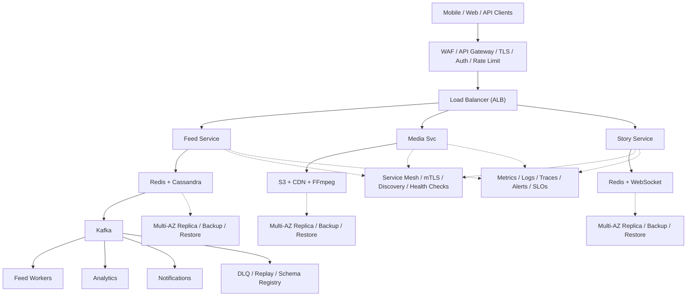

# System Design: Instagram

## Overview

A photo/video sharing social platform supporting content upload, following, personalized feed, stories, likes/comments, and search for 2B+ users.

### Key Numbers

- 2B+ monthly active users
- 500M+ daily stories
- 100M+ photos/videos uploaded daily
- Peak: 1M+ likes per second

---

## Requirements

### Functional Requirements

- Post photos/videos with filters
- Follow users and see feed
- Like, comment, share posts
- Direct messages with media
- Stories that disappear after 24h

### Non-Functional Requirements

- Latency: Feed < 200ms, upload < 5s
- Throughput: 100M+ photos/day
- Availability: 99.99% uptime
- Consistency: Eventually consistent feed
- Scale: 2B+ monthly active users

---

## High-Level Architecture

### Architecture Diagram



### Data Flow

1. User posts photo - Media Service uploads to S3, transcodes
2. Fan-out pushes to all followers feeds (write-heavy)
3. Feed Service reads from Redis cache (< 50ms latency)
4. Stories: ephemeral content with 24h TTL in Redis
5. Explore: ML-based discovery from engagement signals
6. Kafka events: impressions, likes, shares - Analytics
7. Notifications: likes, comments, follows, story views

## Microservices

### 1. Auth Service

- **Responsibility**: Registration, login, OAuth, JWT tokens
- **Tech**: Node.js / Go
- **DB**: PostgreSQL

### 2. User Service

- **Responsibility**: Profiles, follow/unfollow, block list, settings
- **Tech**: Go
- **DB**: PostgreSQL (users), Redis (follow graph cache)

### 3. Post Service

- **Responsibility**: Create/delete posts, caption, tags, location, comments, likes
- **Tech**: Go / Java
- **DB**: Cassandra (posts, write-heavy)
- **Cache**: Redis (post metadata)

### 4. Feed Service (Critical)

- **Responsibility**: Home feed generation, timeline assembly, ranking
- **Tech**: Java / Go
- **DB**: Redis (pre-computed feeds), Cassandra (feed metadata)
- **Pattern**: Fan-out-on-write for regular users, fan-out-on-read for celebrities

### 5. Media Service

- **Responsibility**: Image/video upload, resizing, thumbnail generation, CDN upload
- **Tech**: Go / Python
- **Storage**: S3 (original + processed)
- **Queue**: Kafka (async processing)
- **CDN**: CloudFront / Akamai

### 6. Search Service

- **Responsibility**: User search, hashtag search, location search
- **Tech**: Python / Go
- **DB**: Elasticsearch

### 7. Notification Service

- **Responsibility**: Push notifications, in-app notifications, email digests
- **Tech**: Node.js
- **Queue**: Kafka consumer
- **Channels**: FCM, APNs, SendGrid

### 8. Stories Service

- **Responsibility**: Story upload, story feed, story views, story reactions
- **Tech**: Go
- **DB**: Cassandra (stories, time-series)
- **Cache**: Redis (story feed)

---

## Database Design

### PostgreSQL (Users & Social Graph)

```sql
CREATE TABLE users (
    user_id         UUID PRIMARY KEY DEFAULT gen_random_uuid(),
    username        VARCHAR(50) UNIQUE NOT NULL,
    email           VARCHAR(255) UNIQUE,
    phone           VARCHAR(20),
    name            VARCHAR(255),
    bio             TEXT,
    avatar_url      TEXT,
    is_verified     BOOLEAN DEFAULT FALSE,
    is_private      BOOLEAN DEFAULT FALSE,
    followers_count INT DEFAULT 0,
    following_count INT DEFAULT 0,
    post_count      INT DEFAULT 0,
    created_at      TIMESTAMP DEFAULT NOW()
);

CREATE TABLE follows (
    follower_id     UUID REFERENCES users(user_id),
    followee_id     UUID REFERENCES users(user_id),
    created_at      TIMESTAMP DEFAULT NOW(),
    PRIMARY KEY (follower_id, followee_id)
);
```

### Cassandra (Posts & Media)

```cql
CREATE TABLE posts (
    user_id         UUID,
    post_id         TIMEUUID,
    caption         TEXT,
    media_urls      LIST<TEXT>,
    media_type      TEXT,
    location        TEXT,
    tags            SET<TEXT>,
    likes_count     COUNTER,
    comments_count  COUNTER,
    created_at      TIMESTAMP,
    PRIMARY KEY ((user_id), post_id)
) WITH CLUSTERING ORDER BY (post_id DESC);

CREATE TABLE feed (
    user_id         UUID,
    post_id         TIMEUUID,
    author_id       UUID,
    created_at      TIMESTAMP,
    PRIMARY KEY ((user_id), created_at, post_id)
) WITH CLUSTERING ORDER BY (created_at DESC);
```

### Redis

```
# Feed cache (pre-computed home feed)
LPUSH feed:{user_id} {post_json}
LTRIM feed:{user_id} 0 499

# Like status
SADD likes:{post_id} {user_id}

# Follow graph cache
SADD following:{user_id} {followee_id}
SCARD followers:{user_id}

# Post metadata cache
SETEX post:{post_id} 3600 {json}
```

---

## Scaling Tiers

### Tier 1: 1K - 10K Users

| Component | Choice |
| ----------- | -------- |
| **Compute** | 2-4 EC2 (t3.large) |
| **Database** | PostgreSQL RDS |
| **Cache** | Redis ElastiCache |
| **Media** | S3 + CloudFront |
| **Feed** | On-read (pull model) |
| **Queue** | Redis Streams |

### Tier 2: 10K - 1M Users

| Component | Choice |
| ----------- | -------- |
| **Compute** | ECS (20-50 containers) |
| **Database** | PostgreSQL + Cassandra (3 nodes) |
| **Cache** | Redis Cluster (12 nodes) |
| **Media** | S3 + multi-CDN |
| **Feed** | Hybrid fan-out |
| **Queue** | Kafka (3 brokers) |
| **Search** | Elasticsearch (3 nodes) |

### Tier 3: 1M - 10M+ Users

| Component | Choice |
| ----------- | -------- |
| **Compute** | Multi-region K8s (500+ pods) |
| **Database** | Cassandra (50+ nodes) + PostgreSQL (sharded) |
| **Cache** | Redis Cluster (30+ nodes) |
| **Media** | S3 + custom edge CDN |
| **Feed** | Fan-out-on-write + celebrity hybrid |
| **Queue** | Kafka (15+ brokers) |
| **ML** | SageMaker (feed ranking) |

---

## Key Design Decisions

### 1. Fan-Out-on-Write vs Fan-Out-on-Read

- **Write**: Pre-compute feed when post is created (fast reads, slow writes)
- **Read**: Generate feed when user opens app (slow reads, fast writes)
- **Hybrid**: Fan-out-on-write for regular users, on-read for celebrities (1M+ followers)

### 2. Why Cassandra for Posts?

- Write-heavy workload (100M+ posts/day)
- Time-series access pattern (recent posts first)
- Partition by user_id for even distribution

### 3. Why Redis for Feed Cache?

- Sub-millisecond reads for feed loading
- List data structure is perfect for timeline
- TTL for automatic feed expiry

### 4. Image Processing Pipeline

- Upload to S3 -> Lambda triggers resize -> Generate thumbnails (150x150, 640x640, 1080x1080) -> Upload to CDN
- Use blurhash for placeholder images

### 5. Like Count Strategy

- Use Redis INCR for real-time count (eventual consistency OK)
- Periodically sync to Cassandra for durability
- Use SET for unique like tracking (prevent double likes)

---

## Failure Modes & Recovery

| Failure | Impact | Recovery |
| --------- | -------- | ---------- |
| Feed slow for celebrity | Followers see delay | Fan-out-on-read for celebrities, pre-computed cache |
| Media CDN failure | Cannot load images | Multi-CDN failover, lazy loading |
| Story expiration storm | Millions expire simultaneously | Distributed expiration with jitter |
| Like count inconsistency | Wrong number | Eventual consistency, reconciliation |
| Abuse false positive | Legitimate account suspended | Human review queue, appeal process |
| DM storage overflow | Media conversations exhaust storage | Tiered storage, auto-archive old |

---

## Cost Estimation (1M Users)

| Component | Specification | Monthly Cost |
| ----------- | -------------- | ------------- |
| API Servers | 50x c5.xlarge | $7,000 |
| PostgreSQL | db.r5.2xlarge + 8 replicas | $10,400 |
| Redis Cluster | 24x cache.r5.xlarge | $19,200 |
| Kafka Cluster | 12x kafka.m5.large | $4,800 |
| S3 Media Storage | 500TB | $11,500 |
| CDN | 200TB/month transfer | $16,000 |
| Feed Service | 30x c5.xlarge | $4,200 |
| ML Ranking | GPU instances | $5,000 |
| Stories Service | 10x c5.xlarge | $1,400 |
| **Total** | | **~$79,500/month** |

---

## Trade-off Analysis

| Approach A | Approach B | Winner | Reason |
| ----------- | ----------- | -------- | -------- |
| Redis GEO | PostGIS | Redis GEO | Sub-ms location queries for nearby posts |
| Fan-out-on-write | Fan-out-on-read | Hybrid | Normal users: push, celebrities: pull |
| Sharp | ImageMagick | Sharp | 5x faster image processing in Node.js |
| PostgreSQL | MongoDB | PostgreSQL | ACID compliance for user data |
| Kafka | RabbitMQ | Kafka | Higher throughput for post events | s |

---

## Key Metrics to Monitor

| Metric | Target |
| -------- | -------- |
| Feed load time (p99) | < 500ms |
| Image upload success rate | > 99.9% |
| Feed generation latency | < 200ms |
| Like/comment latency | < 100ms |
| CDN cache hit ratio | > 95% |
| API response time (p99) | < 200ms |
| Story view latency | < 300ms |
| Search latency (p99) | < 500ms |
| System availability | 99.95% |
| Image processing queue depth | < 1000 |

---

---

## Deep Dive Prompts

- How does fan-out-on-write work for accounts with 100M+ followers?
- How does EdgeRank algorithm rank posts in the feed?
- How do you handle 100M+ photo uploads per day?
- How does the Explore page discover content for new users?

---

## Key Techniques & Patterns

| Technique | Description | Used In |
| ----------- | ------------- | ---------- |
| Fan-out on Write/Read Hybrid | Applied in this system | Architecture + LLD |
| CDN for Media | Applied in this system | Architecture + LLD |
| Redis Feed Cache | Applied in this system | Architecture + LLD |
| Graph API for Social | Applied in this system | Architecture + LLD |
| Image Processing Pipeline | Applied in this system | Architecture + LLD |
| Hashtag Inverted Index | Applied in this system | Architecture + LLD |

## Common Interview Follow-ups

**Q: How does fan-out-on-write work for stories?**
A: Redis sorted sets with 24h TTL, pre-computed story ring, fan-out for < 1000 followers

**Q: How does EdgeRank-like feed ranking work?**
A: Affinity score, weight (photo/video/link), time decay, ML personalization

**Q: How do you handle 100M+ photos/day upload?**
A: Chunked upload to S3, compression, processing pipeline, CDN delivery

---

## Low-Level Design (LLD) - Algorithms & Data Structures

### 1. Fan-Out-on-Write Algorithm

```text
class FeedService {
  constructor(redisClient, dbClient) { this.r = redisClient; this.db = dbClient; }
  async fanout(post, authorId) {
    const followers = await this.db.getFollowers(authorId);
    if (followers.length > 10000) return { strategy: 'pull', notified: 0 };
    const pipe = this.r.pipeline();
    for (const fid of followers) { pipe.lpush('feed:' + fid, post.id); pipe.ltrim('feed:' + fid, 0, 999); }
    await pipe.exec();
    return { strategy: 'push', notified: followers.length };
  }
  async getFeed(userId, cursor, limit = 20) {
    const ids = await this.r.lrange('feed:' + userId, cursor || 0, limit - 1);
    return this.db.getPostsByIds(ids);
  }
}

const feed = new FeedService(); console.log("Feed service ready");
```

### 2. Home Feed Generation (Hybrid)

```text
function get_home_feed(user_id, cursor=undefined, limit=20) {
    // Hybrid feed generation:
    // 3. Rank by EdgeRank-like algorithm
    // // Step 1: Get pre-computed feed
    // // Step 3: Merge && deduplicate
    // // Step 4: Fetch post details
    // // Step 5: Rank by EdgeRank
    // // Step 6: Paginate

```

### 3. EdgeRank-like Ranking Algorithm

```text
function rank_posts(posts, user_id) {
    // Instagram-style ranking:
        // // Content type: Does user prefer this type?
        // // Final score
            // affinity * 0.4 +
            // timeliness * 0.3 +
            // engagement_score * 0.2 +
            // content_type_score * 0.1
    // // Sort by score descending

```

### 4. Image Processing Pipeline

```text
function process_image(image_url) {
    // Image processing pipeline:
    // 1. Download original
    // 4. Upload to CDN
    // // Step 1: Download
    // // Step 2: Resize
    // // Step 4: Upload to CDN

```
