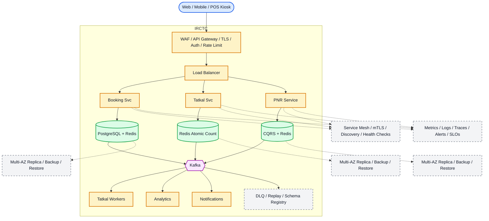

# System Design: IRCTC (Indian Railway Catering and Tourism Corporation)

## Overview

IRCTC powers one of the world's largest online train ticket booking platforms, serving 8.5 billion passengers annually across 13,500 trains and 7,300 stations. The system must handle extreme concurrency during Tatkal booking windows (10 AM for AC classes, 11 AM for non-AC) when millions of users compete for limited seats in seconds.

### Key Numbers

- 8.5 billion passengers annually
- 13,500 passenger trains
- 7,300 railway stations
- 5 billion page views per month
- 20 million tickets processed monthly
- 2 million+ concurrent users during Tatkal
- 5 class types: 1AC, 2AC, 3AC, Sleeper, General

---

## Requirements

### Functional Requirements

- Search trains by source, destination, date, class, and quota
- Real-time seat availability with +/- 3 days view
- Book tickets with passenger details and berth preferences
- Tatkal booking with high concurrency handling
- Cancel tickets with refund processing
- PNR status tracking via SMS/email
- Multiple payment methods (UPI, cards, net banking, wallets)
- Onboard services (meals, bedrolls, wheelchair)
- Waitlist and RAC (Reservation Against Cancellation) management

### Non-Functional Requirements

- Latency: Search < 500ms, Booking < 2s
- Throughput: 1M+ requests/second during Tatkal
- Availability: 99.99% uptime
- Consistency: Strong for seat allocation (no overselling)
- Scalability: Handle 2M+ concurrent users during peak

---

## High-Level Architecture

### Architecture Diagram



*Solid = data flow, dashed = control plane / monitoring.*

### Data Flow

1. User searches trains - PNR Service queries schedule database
2. Normal booking: seat held in Redis with 15-min TTL
3. Tatkal opens at 10:00 AM - Atomic counter ensures FIFO ordering
4. Booking Service uses SELECT FOR UPDATE (row-level lock)
5. Payment via multiple gateways with retry + idempotency
6. Kafka events: booking, cancellation, waitlist - Analytics
7. Notifications: PNR status updates, chart preparation alerts

## Microservices

### 1. Train Service

- **Responsibility**: Train schedules, routes, station listings, fare calculation
- **Tech**: Java / Spring Boot
- **DB**: PostgreSQL (schedules), Redis (cache)
- **Pattern**: CQRS for read-heavy search queries

### 2. Booking Service

- **Responsibility**: Ticket creation, seat allocation, waitlist/RAC management
- **Tech**: Java / Spring Boot
- **DB**: PostgreSQL (transactions), Redis (atomic counters)
- **Pattern**: Saga pattern for distributed transactions

### 3. Inventory Service

- **Responsibility**: Real-time seat availability, Tatkal quota management
- **Tech**: Go
- **DB**: Redis (atomic counters), PostgreSQL (durable state)
- **Pattern**: Event sourcing for audit trail

### 4. Payment Service

- **Responsibility**: Payment processing, refunds, wallet management
- **Tech**: Java / Spring Boot
- **DB**: PostgreSQL (financial records)
- **Pattern**: Idempotency keys to prevent double charges

### 5. Notification Service

- **Responsibility**: PNR status, booking confirmations, cancellation alerts
- **Tech**: Node.js
- **Channels**: SMS (Twilio), Email (SES), Push (FCM/APNS)

### 6. Status Service

- **Responsibility**: PNR tracking, live train status, platform info
- **Tech**: Go
- **DB**: Redis (real-time), PostgreSQL (historical)

---

## Database Design

### PostgreSQL

```sql
CREATE TABLE trains (
    train_id        UUID PRIMARY KEY,
    train_number    VARCHAR(10) UNIQUE NOT NULL,
    name            VARCHAR(255) NOT NULL,
    source_station  VARCHAR(10) REFERENCES stations(station_code),
    dest_station    VARCHAR(10) REFERENCES stations(station_code),
    days_of_week    INT[],  -- [1,3,5] = Mon,Wed,Fri
    created_at      TIMESTAMP DEFAULT NOW()
);

CREATE TABLE stations (
    station_code    VARCHAR(10) PRIMARY KEY,
    name            VARCHAR(255) NOT NULL,
    city            VARCHAR(100),
    latitude        DECIMAL(10,8),
    longitude       DECIMAL(11,8)
);

CREATE TABLE schedules (
    schedule_id     UUID PRIMARY KEY,
    train_id        UUID REFERENCES trains(train_id),
    station_code    VARCHAR(10) REFERENCES stations(station_code),
    arrival_time    TIME,
    departure_time  TIME,
    day_offset      INT DEFAULT 0,  -- 0 = same day, 1 = next day
    distance_km     INT,
    UNIQUE(train_id, station_code)
);

CREATE TABLE seat_inventory (
    inventory_id    UUID PRIMARY KEY,
    train_id        UUID REFERENCES trains(train_id),
    travel_date     DATE,
    class_type      VARCHAR(5),  -- 1AC, 2AC, 3AC, SL, GEN
    quota           VARCHAR(20),  -- TATKAL, GENERAL, LH, TQ
    total_seats     INT,
    available_seats INT,
    confirmed       INT DEFAULT 0,
    rac             INT DEFAULT 0,
    waitlist        INT DEFAULT 0,
    updated_at      TIMESTAMP DEFAULT NOW(),
    UNIQUE(train_id, travel_date, class_type, quota)
);

CREATE TABLE bookings (
    booking_id      UUID PRIMARY KEY,
    pnr_number      VARCHAR(10) UNIQUE NOT NULL,
    user_id         UUID REFERENCES users(user_id),
    train_id        UUID REFERENCES trains(train_id),
    travel_date     DATE,
    class_type      VARCHAR(5),
    quota           VARCHAR(20),
    status          VARCHAR(20) DEFAULT 'pending',
    total_fare      DECIMAL(10,2),
    created_at      TIMESTAMP DEFAULT NOW(),
    expires_at      TIMESTAMP
);

CREATE TABLE passengers (
    passenger_id    UUID PRIMARY KEY,
    booking_id      UUID REFERENCES bookings(booking_id),
    passenger_name  VARCHAR(255) NOT NULL,
    age             INT NOT NULL,
    gender          CHAR(1),
    berth_preference VARCHAR(10),
    id_type         VARCHAR(20),
    id_number       VARCHAR(50),
    meal_preference VARCHAR(20),
    created_at      TIMESTAMP DEFAULT NOW()
);

CREATE TABLE payments (
    payment_id      UUID PRIMARY KEY,
    booking_id      UUID REFERENCES bookings(booking_id),
    user_id         UUID REFERENCES users(user_id),
    amount          DECIMAL(10,2) NOT NULL,
    currency        VARCHAR(3) DEFAULT 'INR',
    method          VARCHAR(20),
    gateway_ref     VARCHAR(100),
    status          VARCHAR(20) DEFAULT 'pending',
    created_at      TIMESTAMP DEFAULT NOW()
);

CREATE TABLE waitlist_entries (
    entry_id        UUID PRIMARY KEY,
    booking_id      UUID REFERENCES bookings(booking_id),
    train_id        UUID REFERENCES trains(train_id),
    travel_date     DATE,
    class_type      VARCHAR(5),
    queue_position  INT NOT NULL,
    status          VARCHAR(20) DEFAULT 'waiting',
    created_at      TIMESTAMP DEFAULT NOW()
);

CREATE TABLE cancellations (
    cancel_id       UUID PRIMARY KEY,
    booking_id      UUID REFERENCES bookings(booking_id),
    reason          TEXT,
    refund_amount   DECIMAL(10,2),
    refund_status   VARCHAR(20) DEFAULT 'pending',
    cancelled_at    TIMESTAMP DEFAULT NOW()
);

CREATE TABLE tatkal_quota (
    quota_id        UUID PRIMARY KEY,
    train_id        UUID REFERENCES trains(train_id),
    travel_date     DATE,
    class_type      VARCHAR(5),
    tatkal_seats    INT NOT NULL,
    booked          INT DEFAULT 0,
    released_at     TIMESTAMP,
    UNIQUE(train_id, travel_date, class_type)
);
```

### Redis (Atomic Counters & Real-Time)

```
# Tatkal seat counter (atomic DECR for concurrency)
DECR   tatkal:12345:2025-09-05:3AC
# If >= 0: Seat allocated
# If < 0: Sold out, INCR to restore

# Provisional booking hold (15-minute TTL)
SETEX  provisional:{booking_id} 900 {json_booking}

# PNR status cache
SETEX  pnr:{pnr_number} 300 {json_status}

# Search results cache (5 min TTL)
SETEX  search:{source}:{dest}:{date} 300 {json_results}

# Rate limiting per user (sliding window)
ZADD   ratelimit:{user_id} {timestamp} {request_id}

# User session
SETEX  session:{user_id} 86400 {jwt_token}

# Train live status
SETEX  train:live:{train_number} 60 {json_status}
```

---

## Scaling Tiers

### Tier 1: 1K - 10K Users (MVP / Prototype)

**Goal**: Basic train search and booking functionality

| Component | Choice | Why |
| ----------- | -------- | ----- |
| **Compute** | 2-4 EC2 instances (t3.large) | Handle initial traffic |
| **Database** | PostgreSQL on RDS (db.t3.medium) | Single DB for all data |
| **Cache** | Redis ElastiCache (cache.t3.small) | Session + search cache |
| **CDN** | CloudFront (free tier) | Static assets |
| **Queue** | Redis Streams | Simple job queue |
| **Monitoring** | CloudWatch + basic Grafana | Uptime tracking |
| **Load Balancer** | ALB | Single region |
| **CI/CD** | GitHub Actions | Deploy to EC2 |

**Architecture**: Modular monolith or 2-3 services. Single database. Manual Tatkal counter.
**Cost**: ~$200-500/month

---

### Tier 2: 10K - 1M Users (Growth Phase)

**Goal**: Handle normal booking with 100K-500K concurrent users

| Component | Choice | Why |
| ----------- | -------- | ----- |
| **Compute** | ECS/EKS (20-50 containers) | Auto-scaling services |
| **Database** | PostgreSQL RDS (r5.xlarge, 3 read replicas) | Read scaling for search |
| **Cache** | Redis Cluster (6 nodes) | High-throughput counters |
| **CDN** | CloudFront + Akamai | Multi-CDN redundancy |
| **Search** | Elasticsearch (3 nodes) | Full-text station/train search |
| **Queue** | Kafka (3 brokers) | Event streaming backbone |
| **Analytics** | ClickHouse (single node) | Booking analytics |
| **Monitoring** | Prometheus + Grafana | Full observability |
| **Load Balancer** | ALB + Route53 | Multi-AZ, DNS routing |

**Architecture**: 6-8 microservices. Event-driven with Kafka. Database per service. CQRS for search.
**Cost**: ~$5K-20K/month

---

### Tier 3: 1M - 10M+ Users (Global Scale)

**Goal**: 2M+ concurrent users during Tatkal, 99.99% uptime, strong consistency

| Component | Choice | Why |
| ----------- | -------- | ----- |
| **Compute** | Multi-region K8s (EKS) - 200+ pods/region | Global auto-scaling |
| **Database** | PostgreSQL (Citus sharding) + Aurora Global | Consistency + scale |
| **NoSQL** | Cassandra (12+ nodes) | Write-heavy audit logs |
| **Cache** | Redis Cluster (20+ nodes/region) | Sub-ms atomic counters |
| **CDN** | Custom edge + CloudFront + Akamai + Fastly | 4+ CDN providers |
| **Search** | Elasticsearch Cross-Cluster (10+ nodes) | Global search |
| **Queue** | Kafka (9+ brokers, MirrorMaker 2) | Cross-region replication |
| **Analytics** | Flink + ClickHouse Cluster | Real-time Tatkal metrics |
| **Service Mesh** | Istio | mTLS, traffic management |
| **Chaos Engineering** | Litmus Chaos | Resilience testing |
| **Feature Flags** | LaunchDarkly | Gradual rollouts |

**Architecture**: Globally distributed microservices. Active-active multi-region. Redis-based seat allocation with Lua scripts. ML-driven demand forecasting.
**Cost**: ~$200K-800K/month

---

## Key Design Decisions

### 1. Why Redis Atomic Counters for Tatkal?

- DECR is atomic -- no race conditions between 2M+ concurrent users
- Sub-millisecond latency (critical for 10 AM Tatkal window)
- If DECR returns >= 0, seat is provisionally held; < 0 means sold out
- TTL on provisional bookings auto-releases unclaimed seats

### 2. Why Saga Pattern for Booking?

- Booking spans 3+ services (Inventory, Booking, Payment, Notification)
- If payment fails, inventory must be released (compensating transaction)
- Saga orchestrates the distributed transaction with rollback
- Each step publishes events for downstream services

### 3. Why Kafka over RabbitMQ?

- Event replay capability (reprocess failed bookings)
- Higher throughput (1M+ events/sec during Tatkal)
- Ordered logs for sequential processing (seat allocation order matters)
- Consumer groups for parallel processing across services

### 4. Why PostgreSQL over MongoDB?

- Strong ACID compliance for financial transactions (no double-selling)
- Row-level locking for seat allocation
- Referential integrity across bookings, passengers, payments
- Mature replication for read scaling

### 5. Why Tatkal Quota Separation?

- Tatkal seats are a fixed percentage (10-30%) of total capacity
- Separate atomic counter prevents contention with general quota
- Different release times (10 AM AC, 11 AM non-AC) require independent counters
- Cancellation of Tatkal tickets has stricter refund rules

---

## Failure Modes & Recovery
What can go wrong in production, and how the system detects and recovers:

| Failure | Impact | Recovery |
| --------- | -------- | ---------- |
| Redis counter crash during Tatkal | Seat allocation frozen | Redis Sentinel failover < 1s, replica promotion |
| Payment gateway timeout | Booking stuck in provisional | 15-min TTL auto-releases seat, idempotency key prevents double charge |
| Kafka broker down | Booking events delayed | Replication factor 3, consumer rebalance |
| Database primary failover | Writes blocked | Aurora automatic failover < 30s |
| CDN failure | Static assets unreachable | Multi-CDN failover, origin shield |
| Tatkal race condition | Overselling seats | Lua script atomic DECR + conditional check |
| Network partition | Partial booking state | Saga compensating transactions, eventual consistency |
| Refund processing delay | Customer complaints | Async refund queue with retry + reconciliation job |

---

## Cost Estimation (1M Users)
Rough monthly cost of running this design for one million users:

| Component | Specification | Monthly Cost |
| ----------- | -------------- | ------------- |
| API Servers | 15x c5.xlarge | $2,100 |
| PostgreSQL | db.r5.2xlarge + 3 replicas | $6,000 |
| Redis Cluster | 6x cache.r5.xlarge | $4,800 |
| Kafka Cluster | 6x kafka.m5.large | $2,400 |
| Elasticsearch | 3x m5.xlarge | $1,800 |
| CDN | 100TB/month transfer | $15,000 |
| SMS/Email | 5M SMS + 10M emails | $2,000 |
| Monitoring | Prometheus + Grafana | $500 |
| Load Balancer | ALB | $300 |
| **Total** | | **~$34,900/month** |

---

## Trade-off Analysis
The alternatives considered, and which one won and why:

| Approach A | Approach B | Winner | Reason |
| ----------- | ----------- | -------- | -------- |
| Redis atomic counters | PostgreSQL row locks | Redis | 100x faster for Tatkal concurrent access |
| Saga pattern | 2PC (Two-Phase Commit) | Saga | No global lock, better throughput under load |
| Kafka | RabbitMQ | Kafka | Event replay + higher throughput for 1M+ bookings |
| PostgreSQL | MongoDB | PostgreSQL | ACID transactions critical for financial correctness |
| Elasticsearch | PostgreSQL FTS | Elasticsearch | Better fuzzy search for station/train names |
| Redis GEO | PostGIS | Redis | Sub-ms proximity queries for nearby stations |
| WebSocket | Long-polling | WebSocket | Real-time PNR status push without repeated requests |

---

## Key Metrics to Monitor
The metrics that signal system health, with alert thresholds:

| Metric | Target |
| -------- | -------- |
| Search response time (p99) | < 500ms |
| Booking completion time | < 2s |
| Tatkal booking success rate | > 95% |
| Seat allocation accuracy | 100% (zero overselling) |
| Payment success rate | > 99.5% |
| PNR status update latency | < 5s |
| Error rate | < 0.1% |
| Availability | 99.99% |
| Tatkal concurrent users | 2M+ |
| Refund processing time | < 7 business days |

---

## Deep Dive Prompts

- How do you handle 2M+ concurrent users during Tatkal without overselling seats?
- What happens when Redis crashes mid-Tatkal? How do you prevent seat misallocation?
- How do you implement the 15-minute provisional booking timeout reliably?
- How do you handle partial failures in the booking Saga (payment succeeds but notification fails)?
- How do you ensure refund processing does not lose money during system failures?
- How do you handle the half-open distributed transaction problem when the orchestrator crashes?

---

## Key Techniques & Patterns
The recurring techniques and patterns this design applies, mapped to where they are used:

| Technique | Description | Used In |
| ----------- | ------------- | ---------- |
| Atomic Seat Allocation (Redis DECR) | Applied in this system | Architecture + LLD |
| Tatkal Quota Management | Applied in this system | Architecture + LLD |
| Waitlist/RAC Priority Queue | Applied in this system | Architecture + LLD |
| Saga for Distributed Transactions | Applied in this system | Architecture + LLD |
| Event Sourced PNR Status | Applied in this system | Architecture + LLD |
| Dynamic Fare Calculation | Applied in this system | Architecture + LLD |

## Common Interview Follow-ups

**Q: How does Tatkal booking handle 2M concurrent users at 10:00 AM?**
A: Redis atomic DECR for instant seat allocation. Lua script for atomic check-and-decrement. Separate counters per train/date/class/quota. 15-min TTL auto-releases unclaimed seats.

**Q: What prevents overselling seats?**
A: Redis atomic counter guarantees only N bookings succeed (where N = available seats). DB transaction as final consistency check. Event sourcing for audit trail.

**Q: How do you handle payment failure after seat allocation?**
A: Saga compensating transaction releases the seat. 15-min TTL as safety net. Idempotency key prevents duplicate charges. Reconciliation job catches orphaned bookings.

**Q: How do you handle refund processing at scale?**
A: Async refund queue with priority (Tatkal refunds processed first). Idempotent refund operations. Reconciliation job matches refunds against payment gateway records.

**Q: How do you ensure PNR status is always accurate?**
A: Event sourcing -- every status change is an immutable event. PNR status is derived from event log. Redis cache with 5-min TTL for fast reads. Push notification on status change.

**Q: How do you handle the race condition when two users try to book the last seat?**
A: Redis DECR is atomic -- exactly one user gets DECR >= 0, the other gets DECR < 0. No double-booking possible. The loser sees sold out immediately.

---

## Low-Level Design (LLD) - Algorithms & Data Structures

### 1. Tatkal Seat Allocation (Redis Atomic Counter)

```text
class TatkalSeatAllocator {
  constructor(redisClient) {
    this.r = redisClient;
    this.PROVISIONAL_TTL = 900;
  }

  async attemptBooking(trainId, date, classType, userId) {
    const key = `tatkal:${trainId}:${date}:${classType}`;
    const remaining = await this.r.decr(key);

    if (remaining >= 0) {
      const bookingId = this.generateBookingId();
      const provisional = {
        bookingId, trainId, date, classType, userId,
        status: 'provisional',
        createdAt: Date.now()
      };
      await this.r.setex(
        `provisional:${bookingId}`,
        this.PROVISIONAL_TTL,
        JSON.stringify(provisional)
      );
      return { success: true, bookingId, remaining };
    } else {
      await this.r.incr(key);
      return { success: false, reason: 'SOLD_OUT' };
    }
  }

  generateBookingId() {
    const chars = 'ABCDEFGHIJKLMNOPQRSTUVWXYZ0123456789';
    let id = '';
    for (let i = 0; i < 10; i++) {
      id += chars.charAt(Math.floor(Math.random() * chars.length));
    }
    return id;
  }
}
```

### 2. Waitlist Management (Priority Queue)

```text
class WaitlistManager {
  constructor(redisClient) {
    this.r = redisClient;
  }

  async addToWaitlist(trainId, date, classType, bookingId, priority = 0) {
    const key = `waitlist:${trainId}:${date}:${classType}`;
    const score = priority * 1e12 + Date.now();
    await this.r.zadd(key, score, bookingId);
    const position = await this.r.zrank(key, bookingId);
    return { position: position + 1 };
  }

  async promoteFromWaitlist(trainId, date, classType, count = 1) {
    const key = `waitlist:${trainId}:${date}:${classType}`;
    const promoted = [];
    for (let i = 0; i < count; i++) {
      const entries = await this.r.zpopmin(key, 1);
      if (entries.length === 0) break;
      promoted.push(entries[0].value);
    }
    return promoted;
  }

  async getWaitlistPosition(trainId, date, classType, bookingId) {
    const key = `waitlist:${trainId}:${date}:${classType}`;
    const position = await this.r.zrank(key, bookingId);
    return position !== null ? position + 1 : -1;
  }
}
```

### 3. PNR Status Tracker (Event Sourcing)

```text
class PNRStatusTracker {
  constructor(redisClient, kafkaProducer) {
    this.r = redisClient;
    this.kafka = kafkaProducer;
  }

  async updateStatus(pnrNumber, newStatus, details = {}) {
    const event = {
      pnr: pnrNumber,
      status: newStatus,
      details,
      timestamp: Date.now(),
      version: await this.r.incr(`pnr:${pnrNumber}:version`)
    };

    await this.r.rpush(`pnr:${pnrNumber}:events`, JSON.stringify(event));
    await this.r.set(`pnr:${pnrNumber}:current`, JSON.stringify({
      status: newStatus,
      updatedAt: event.timestamp,
      version: event.version
    }));

    await this.kafka.produce({
      topic: 'pnr.status.changed',
      key: pnrNumber,
      value: JSON.stringify(event)
    });

    return event;
  }

  async getStatus(pnrNumber) {
    const current = await this.r.get(`pnr:${pnrNumber}:current`);
    return current ? JSON.parse(current) : null;
  }

  async getFullHistory(pnrNumber) {
    const events = await this.r.lrange(`pnr:${pnrNumber}:events`, 0, -1);
    return events.map(e => JSON.parse(e));
  }
}
```

### 4. Fare Calculator (Dynamic Pricing)

```text
class FareCalculator {
  calculateFare(distanceKm, classType, quota, demandMultiplier = 1.0) {
    const baseRatePerKm = {
      '1AC': 4.70, '2AC': 3.50, '3AC': 2.40, 'SL': 1.10, 'GEN': 0.45
    };

    const tatkalSurcharge = {
      '1AC': 0.30, '2AC': 0.30, '3AC': 0.25, 'SL': 0.20, 'GEN': 0.10
    };

    const base = baseRatePerKm[classType] * distanceKm;
    let fare = base;

    if (quota === 'TATKAL') {
      fare += base * (tatkalSurcharge[classType] || 0);
    }

    fare *= demandMultiplier;
    fare = Math.max(fare, 15);

    return Math.round(fare * 100) / 100;
  }
}
```

### 5. Booking Saga Orchestrator

```text
class BookingSaga {
  constructor(inventory, booking, payment, notification) {
    this.inventory = inventory;
    this.booking = booking;
    this.payment = payment;
    this.notification = notification;
  }

  async execute(request) {
    const sagaId = `saga:${Date.now()}:${Math.random().toString(36).slice(2)}`;
    const steps = [];
    let step = 0;

    try {
      steps[0] = await this.inventory.allocate(request);
      step = 1;
      steps[1] = await this.booking.createProvisional(request);
      step = 2;
      steps[2] = await this.payment.charge({
        ...request.payment,
        bookingId: steps[1].bookingId,
        idempotencyKey: sagaId
      });
      step = 3;
      steps[3] = await this.booking.confirm(steps[1].bookingId);
      step = 4;
      steps[4] = await this.notification.sendConfirmation({
        pnr: steps[3].pnrNumber, userId: request.userId
      });
      return { success: true, sagaId, pnr: steps[3].pnrNumber };
    } catch (error) {
      for (let i = step - 1; i >= 0; i--) {
        try {
          if (i === 1) await this.booking.cancelProvisional(steps[1].bookingId);
          if (i === 0) await this.inventory.release(request);
        } catch (e) { console.error(`Compensation ${i} failed:`, e.message); }
      }
      return { success: false, sagaId, failedAt: step, error: error.message };
    }
  }
}

const booking = new BookingService(); console.log("Booking service ready");
```

---

### Real-World Insights & Best Practices

**Tatkal Booking Flow (2024-2025)**:

1. User logs in with CAPTCHA + OTP (prevents bots)
2. Pre-fills train details before Tatkal window opens
3. At 10:00 AM: Redis atomic DECR for instant seat allocation
4. If seat available: Redirect to payment (15-min countdown)
5. Payment confirmed: DB transaction finalizes booking
6. If payment fails: Seat auto-releases via TTL

**Anti-Bot Measures**:

- CAPTCHA on every search/booking
- OTP verification for Tatkal
- Rate limiting per user (5 bookings per hour)
- Device fingerprinting for bot detection
- IP-based rate limiting (100 requests/min)

**Key Takeaway**: Redis atomic counters + Lua scripts handle the massive Tatkal concurrency. PostgreSQL ensures ACID compliance for financial correctness. The 15-minute provisional booking window prevents seat hoarding while allowing time for payment processing.

---

### Tatkal Booking Flow Chart

```
User (Pre-fills details before 10 AM)
    |
    v
+------------------+     +------------------+
|   API Gateway    |     |   Rate Limiter   |
|  (CAPTCHA+OTP)   |     | (5 req/user/hr)  |
+--------+---------+     +--------+---------+
         |                        |
         v                        v
+------------------+     +------------------+
| Booking Service  |     | Inventory Svc    |
| (Validate OTP)   |---> | (Redis DECR)     |
+--------+---------+     +--------+---------+
         |                        |
         |   success              v
         |              +------------------+
         v              |  Provisional     |
+------------------+   |   Hold (15 min)  |
| Payment Service  |   +------------------+
|  (UPI/Card/Net)  |
+--------+---------+
         |
         |   success
         v
+------------------+     +------------------+
|  DB Transaction  |     |  Notification    |
| (Final Confirm)  |---> |   (SMS/Email)    |
+------------------+     +------------------+
```

### PNR Status State Machine

```
INITIAL -> CHART_PREPARED -> CONFIRMED -> JOURNEY_COMPLETE
    |           |              |
    v           v              v
WAITLIST -> RAC -> CONFIRMED -> CANCELLED
    |                  |
    v                  v
CANCELLED          REFUNDED
```

---

### Scale Numbers to Remember

| Metric | IRCTC Peak | Hotstar Peak |
| -------- | ----------- | -------------- |
| Concurrent Users | 2M+ (Tatkal 10 AM) | 25M+ (IPL) |
| Requests/sec | 1M+ | 500K+ |
| Daily Bookings | 500K+ | N/A |
| Tatkal Seats/sec | 10K+ | N/A |
| Refund Processing | 100K+/day | N/A |
