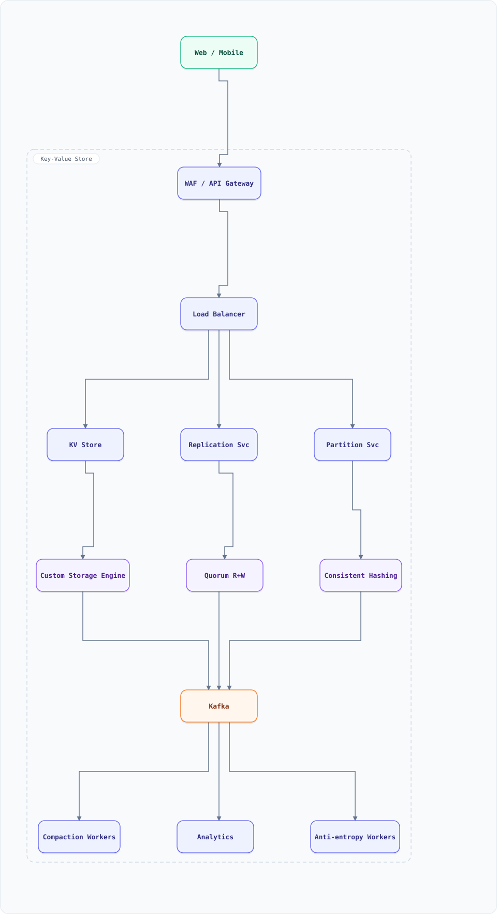

<div align="center">

# System Design: Key-Value Store (DynamoDB)

</div>

> [!TIP]
> **TL;DR** — Distributed key-value store providing eventually consistent reads/writes with high availability.

## Table of Contents

<details>
<summary><b>📑 Jump to a section</b></summary>

1. [Overview](#overview)
2. [Requirements](#requirements)
3. [High-Level Architecture](#high-level-architecture)
4. [Microservices](#microservices)
5. [Database Design](#database-design)
6. [Scaling Tiers](#scaling-tiers)
7. [Key Design Decisions](#key-design-decisions)
8. [Failure Modes & Recovery](#failure-modes--recovery)
9. [Cost Estimation (1M Users)](#cost-estimation-1m-users)
10. [Trade-off Analysis](#trade-off-analysis)
11. [Key Metrics to Monitor](#key-metrics-to-monitor)
12. [Deep Dive Prompts](#deep-dive-prompts)
13. [Key Techniques & Patterns](#key-techniques--patterns)
14. [Common Interview Follow-ups](#common-interview-follow-ups)
15. [Low-Level Design (LLD)](#low-level-design-lld)
16. [Do's & Don'ts](#dos--donts)

</details>

---


## Overview

Distributed key-value store providing eventually consistent reads/writes with high availability.

### Key Numbers

- 10M+ ops/sec
- < 10ms P99 latency
- 99.99% availability
- Multi-region replication

---

## Requirements

### Functional Requirements

- put(key, value) - Store value with key
- get(key) - Retrieve value by key
- delete(key) - Remove key-value pair
- Support TTL for automatic expiration

### Non-Functional Requirements

| Attribute | Target |
| :--- | :--- |
| **Latency** | < 10ms P99 |
| **Throughput** | 10M+ ops/sec |
| **Availability** | 99.99% (AP system) |
| **Consistency** | Eventually consistent |

---

## High-Level Architecture

### Architecture Diagram



**Interactive diagram:** [diagrams/system-design/key-value-store.architecture.html](diagrams/system-design/key-value-store.architecture.html) — pan/zoom, search, dark/light theme, PNG/SVG export.


*Solid = data flow, dashed = control plane / monitoring.*

### Data Flow

1. Client puts/gets key - Partition Service hashes to node
2. Consistent hashing determines shard placement
3. Write: replicate to N nodes, wait for W acknowledgments
4. Read: query R nodes, return latest by vector clock
5. Conflict resolution: vector clocks detect concurrent writes
6. Anti-entropy: Merkle trees sync replicas in background
7. Compaction: merge SSTables to reclaim space

## Microservices
How the system is decomposed into independently deployed services:

| Service | Responsibility | Tech Stack | Pattern |
| --------- | --------------- | ------------ | --------- |
| Coordinator | Request routing, quorum logic | Go | Consistent Hashing |
| Storage Engine | LSM Tree / B-Tree persistence | C++ | Write-Ahead Log |
| Replication Mgr | Replicate writes across nodes | Go | Quorum Consensus |
| Failure Detector | Detect node failures | Go | Phi Accrual |
| Anti-Entropy | Repair inconsistencies | Go | Merkle Tree Diff |
| Membership Service | Cluster membership, gossip | Go | Gossip Protocol |

---

## Database Design
The data stores, schemas, and access patterns behind each service:

```sql
CREATE TABLE nodes (
    node_id VARCHAR(50) PRIMARY KEY, datacenter VARCHAR(50),
    rack VARCHAR(50), status VARCHAR(20) DEFAULT active,
    joined_at TIMESTAMP DEFAULT NOW()
);

CREATE TABLE key_ranges (
    range_id BIGSERIAL PRIMARY KEY, start_hash BIGINT NOT NULL,
    end_hash BIGINT NOT NULL, owner_node VARCHAR(50),
    replica_nodes TEXT[]
);
```

---

## Scaling Tiers

### 1K - 10K Users ($500/mo)

- Single node, replication factor 1, SSD storage

### 10K - 1M Users ($20K/mo)

- 3-node cluster, replication factor 3, Quorum W=2 R=2

### 1M - 10M+ Users ($800K/mo)

- Multi-datacenter cluster (9+ nodes), Merkle tree anti-entropy

---

## Key Design Decisions
The choices that shape this architecture, and why each was made:

| Decision | Choice | Why |
| ---------- | -------- | ----- |
| Consistency | Eventual (AP) | High availability for reads/writes |
| Replication | Quorum (W+R > N) | Tunable consistency levels |
| Failure Detection | Phi Accrual | Adaptive thresholds, fewer false positives |
| Anti-Entropy | Merkle Trees | Efficient inconsistency detection |
| Storage | LSM Tree | Optimized for write-heavy workloads |

---

## Failure Modes & Recovery
What can go wrong in production, and how the system detects and recovers:

| Failure | Impact | Recovery |
| --------- | -------- | ---------- |
| Node failure | Partial unavailability | Gossip detects, hint-handed-off writes |
| Network partition | Split-brain writes | Vector clocks detect conflicts |
| Datacenter failure | Regional outage | Cross-datacenter replication continues |
| Hot partition | Single node overload | Range splitting, virtual nodes |

---

## Cost Estimation (1M Users)
Rough monthly cost of running this design for one million users:

| Component | Monthly Cost |
| ----------- | ------------- |
| Storage nodes (9x) | $6,000 |
| Coordinator nodes (3x) | $2,000 |
| Cross-DC bandwidth | $1,000 |
| Monitoring | $500 |
| Total | ~$9,500 |

---

## Trade-off Analysis
The alternatives considered, and which one won and why:

| Trade-off | Option A | Option B | Winner | Why |
| ----------- | ---------- | ---------- | -------- | ----- |
| Consistency | Strong (CP) | Eventual (AP) | AP | Higher availability |
| Replication | Sync | Quorum | Quorum | Tunable consistency |
| Conflict Resolution | Vector Clocks | LWW | Vector Clocks | Detect true conflicts |
| Storage | LSM Tree | B-Tree | LSM Tree | Better write throughput |

---

## Key Metrics to Monitor
The metrics that signal system health, with alert thresholds:

| Metric | Target | Alert Threshold |
| -------- | -------- | ----------------- |
| Read Latency P99 | < 10ms | > 50ms |
| Write Latency P99 | < 15ms | > 50ms |
| Replication Lag | < 100ms | > 1s |
| Anti-Entropy Rate | > 99% | < 95% |
| Node Availability | > 99.9% | < 99% |

---

## Deep Dive Prompts

1. **How does consistent hashing handle node failures?**
2. **Explain quorum reads/writes and tunable consistency.**
3. **How do vector clocks detect causal conflicts?**
4. **Design the Merkle tree anti-entropy process.**
5. **How does gossip protocol propagate membership?**
6. **Explain CAP theorem trade-offs in a KV store.**

---

## Key Techniques & Patterns
The recurring techniques and patterns this design applies, mapped to where they are used:

| Technique | Description | Used In |
| ----------- | ------------- | ---------- |
| Consistent Hash Ring | Applied in this system | Architecture + LLD |
| Vector Clocks | Applied in this system | Architecture + LLD |
| Quorum Consensus | Applied in this system | Architecture + LLD |
| Merkle Tree Anti-Entropy | Applied in this system | Architecture + LLD |
| Gossip Protocol | Applied in this system | Architecture + LLD |
| LSM Tree Storage | Applied in this system | Architecture + LLD |

## Common Interview Follow-ups

**Q: How do you handle concurrent write conflicts?**
A: Use vector clocks to track causal ordering. When two versions are concurrent, return both to the client for resolution. For simpler cases, use last-writer-wins.

**Q: How does quorum consensus work?**
A: With N replicas, set W write and R read replicas. If W + R > N, you get strong consistency. Common: W=N (durable writes), R=1 (fast reads).

---

## Low-Level Design (LLD)

### 1. Consistent Hash Ring

```text
class ConsistentHashRing {
  constructor() {
    this.ring = new Map();
    this.sortedKeys = [];
  }

  addNode(node, vnodes = 150) {
    for (let i = 0; i < vnodes; i++) {
      const hash = this.hash(node + ":" + i);
      this.ring.set(hash, node);
      this.sortedKeys.push(hash);
    }
    this.sortedKeys.sort((a, b) => a - b);
  }

  getNode(key) {
    const hash = this.hash(key);
    for (const k of this.sortedKeys) {
      if (k >= hash) return this.ring.get(k);
    }
    return this.ring.get(this.sortedKeys[0]);
  }

  hash(key) {
    let h = 0;
    for (let i = 0; i < key.length; i++) {
      h = (h * 31 + key.charCodeAt(i)) & 0xffffffff;
    }
    return h;
  }
}
```

### 2. Vector Clock

```text
class VectorClock {
  constructor() {
    this.clock = new Map();
  }

  increment(nodeId) {
    this.clock.set(nodeId, (this.clock.get(nodeId) || 0) + 1);
  }

  merge(other) {
    for (const [node, time] of other.clock) {
      this.clock.set(node, Math.max(this.clock.get(node) || 0, time));
    }
  }

  happensBefore(other) {
    let dominated = false;
    for (const [node, time] of this.clock) {
      if (time > (other.clock.get(node) || 0)) return false;
      if (time < (other.clock.get(node) || 0)) dominated = true;
    }
    return dominated;
  }

  isConcurrent(other) {
    return !this.happensBefore(other) && !other.happensBefore(this);
  }
}

const kv = new KeyValueStore(); console.log("KV store ready");
```

## Do's & Don'ts

| ✅ Do | ❌ Don't |
| :-- | :-- |
| Pin down the key numbers before drawing boxes | Don't hand-wave the hardest component — key value store lives or dies there |
| Justify the functional requirements choice against one alternative out loud | Don't default to the trendiest store without a consistency/scale argument |
| State the failure mode of non-functional requirements explicitly (what breaks first?) | Don't present a sunny-day design only — the follow-up question is always "and when it fails?" |
| Anchor capacity numbers before proposing shards/replicas | Don't introduce a component you can't cost or size with the numbers on the board |

*More cross-topic rules: [Interview Q&A §81](interview-qa.md#81-universal-dos--donts) · Concepts: [Networking](networking.md) · [Operating Systems](operating-systems.md)*

---

<nav>← [irctc](system-design-irctc.md) · [📖 All guides](README.md) · [leaderboard](system-design-leaderboard.md) →</nav>
