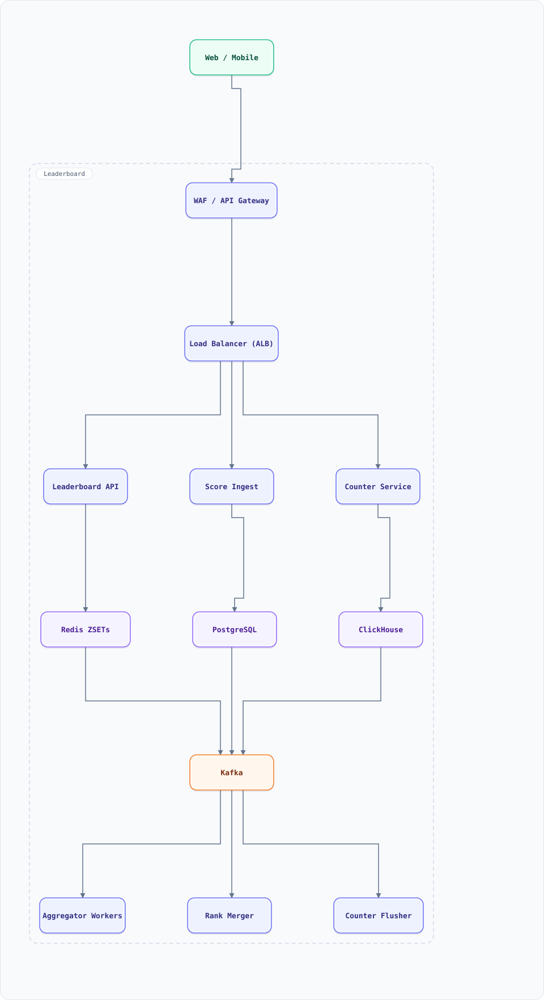

<div align="center">

# System Design: Leaderboard (Real-Time Ranked Counters)

</div>

> [!TIP]
> **TL;DR** — A leaderboard service (game scores, like counters, trending lists) that absorbs millions of score updates per second and answers top-K and rank queries in milliseconds — the canonical "counting at scale" problem.

## Table of Contents

<details>
<summary><b>📑 Jump to a section</b></summary>

1. [Overview](#overview)
2. [Requirements](#requirements)
3. [High-Level Architecture](#high-level-architecture)
4. [Microservices](#microservices)
5. [Database Design](#database-design)
6. [Scaling Tiers](#scaling-tiers)
7. [Key Techniques & Patterns](#key-techniques--patterns)
8. [Key Design Decisions](#key-design-decisions)
9. [Failure Modes & Recovery](#failure-modes--recovery)
10. [Cost Estimation (1M Users)](#cost-estimation-1m-users)
11. [Trade-off Analysis](#trade-off-analysis)
12. [Key Metrics to Monitor](#key-metrics-to-monitor)
13. [Deep Dive Prompts](#deep-dive-prompts)
14. [Common Interview Follow-ups](#common-interview-follow-ups)
15. [Low-Level Design (LLD) - Algorithms & Data Structures](#low-level-design-lld---algorithms--data-structures)
16. [Do's & Don'ts](#dos--donts)

</details>

---


## Overview

Players post score updates ("user X gained 12 points"); viewers fetch top-K boards, a user's rank, and users around a rank. The hard part: a single hot key (global board, a viral post's like counter) cannot live on one shard.

### Key Numbers

| Metric | Value |
| :--- | :--- |
| **Score updates** | 100K–1M / second |
| **Top-K queries** | 50K / second, K ≤ 100 |
| **Rank queries** | 20K / second (`zrevrank`) |
| **Board lifetime** | daily/weekly resets, seasonal |

---

## Requirements

### Functional Requirements

- Post score updates (absolute set, increment, decrement)
- Top-K with ties broken deterministically (earlier achiever wins)
- Exact rank and users around a given rank
- Multiple board types (global, per-country, per-season) with TTL resets

### Non-Functional Requirements

| Attribute | Target |
| :--- | :--- |
| **Update latency** | < 50ms visible on the board |
| **Top-K latency** | < 10ms P99 |
| **Accuracy** | Exact for games; approximate (±0.1%) acceptable for like-counts |
| **Hot key tolerance** | One board with 50M concurrent participants |

---

## High-Level Architecture

### Architecture Diagram



**Interactive diagram:** [diagrams/system-design/leaderboard.architecture.html](diagrams/system-design/leaderboard.architecture.html) — pan/zoom, search, dark/light theme, PNG/SVG export.


### Data Flow

1. Score update hits Leaderboard API → validated → written to Kafka (partitioned by `user_id`)
2. Aggregator consumers apply increments to per-user aggregates in Redis `ZSET` shards
3. Global boards are **sharded by score band** (e.g., deciles recomputed hourly) so no single ZSET holds 50M members
4. Top-K: each shard returns its local top-K; a **top-K heap merge** produces the global top-K
5. Rank query: locate the user's shard, get local rank, add sizes of all strictly-higher bands
6. Like counters: distributed hot counter (sharded sub-counters) with periodic flush to Postgres; reads use approximate/counter cache

## Microservices

| Service | Tech Stack | Database | Pattern |
| --------- | ------------ | ---------- | ---------- |
| Leaderboard API | Go | Redis | ZSET facade |
| Score Ingest | Node.js | Kafka producer | Event-driven |
| Aggregator Workers | Go | Redis + Kafka consumer | Stream aggregation |
| Rank Calculator | Rust | Redis | Shard + merge |
| Counter Service (likes) | Go | Redis + PostgreSQL | Distributed counter |

---

## Database Design

### Redis

```bash
ZSET  board:global:shard{0..31}     member=user_id score=points
ZSET  board:country:IN:shard{0..7}  member=user_id score=points
HASH  user:season:{user_id}         points, last_update
INCR  likes:post:{post_id}:c{0..15}  # sharded hot counter
ZSET  board:archive:2026-09-20      (daily snapshot, TTL 30d)
```

### PostgreSQL

```sql
CREATE TABLE scores (
  user_id   BIGINT,
  season_id INT,
  points    BIGINT DEFAULT 0,
  updated_at TIMESTAMPTZ DEFAULT now(),
  PRIMARY KEY (user_id, season_id)
);
CREATE TABLE counter_rollups (
  entity_type TEXT, entity_id BIGINT, window_start TIMESTAMPTZ,
  count BIGINT, PRIMARY KEY (entity_type, entity_id, window_start)
);
```

---

## Scaling Tiers

| Tier | Users | Infrastructure | Monthly Cost |
| ------ | ------- | --------------- | ------------- |
| 1K-10K | 10K | 1 app + single Redis ZSET | $100 |
| 10K-1M | 1M | 3 app + Redis Cluster (3 shards) + Kafka | $2,500 |
| 1M-10M+ | 10M+ | 12 app + 32-shard Redis + Kafka + ClickHouse archive | $30,000 |

---

## Key Techniques & Patterns

- **Top-K heap merge**: local top-K per shard, global merge in O(K log S)
- **Score-band sharding**: hot global board split by score range instead of user hash
- **Distributed hot counter**: 16 sub-counters under one logical key, summed at read
- **Sliding Window Counter**: fair "last 24h" scoreboards
- **Redis Caching**: board pages cached at the API layer (1–5s TTL is fine)
- **Fan-out on Read**: boards rebuilt on demand, not pushed

---

## Key Design Decisions

1. **Redis ZSETs, not a sorted SQL query**: O(log N) insert + O(log N) rank, exactly the primitives needed
2. **Score bands over user-hash shards**: user-hash puts the global board on one shard; bands distribute the hot key
3. **Kafka between ingest and aggregates**: absorbs bursts, gives replay for recomputing boards
4. **Approximate likes, exact game scores**: product tolerance differs; approximation is 10× cheaper
5. **Deterministic tie-breaks**: `(score, timestamp)` tuple in the ZSET score prevents flapping ranks

---

## Failure Modes & Recovery

| Failure | Impact | Mitigation |
| --------- | -------- | ----------- |
| Redis shard down | Board partial | Replica promotion; boards rebuildable from Kafka + rollups |
| Duplicate update events | Inflated scores | Idempotency key (event_id) at aggregator |
| Hot user (cheater flood) | Shard overload | Per-user rate limit; anomaly flagging |
| Band boundaries stale | Slightly wrong band | Hourly rebalance; correctness unaffected |
| Kafka lag | Stale boards | Lag alert; serve last snapshot with staleness tag |

---

## Cost Estimation (1M Users)

| Component | Configuration | Monthly Cost |
| ----------- | -------------- | ------------- |
| API (6) | c7g.large | $600 |
| Redis Cluster (6 shards ×2) | cache.r7g.large | $1,800 |
| Kafka (3 brokers) | m7g.large | $900 |
| PostgreSQL (rollups) | db.r7g.large | $400 |
| **Total** | | **~$3,700** |

---

## Trade-off Analysis

| Decision | Option A | Option B | Choice | Why |
| ---------- | ---------- | ---------- | -------- | ----- |
| Rank store | SQL `ORDER BY` | Redis ZSET | ZSET | O(log N) rank + top-K built in |
| Global board | One big ZSET | Score-band shards | Bands | Kills the hot key |
| Like counts | Exact every write | Sharded approx | Approx | 10× cheaper, product-acceptable |
| Updates | Sync to Redis | Via Kafka | Via Kafka | Burst absorption + replay |
| Ties | By user_id | By timestamp | Timestamp | Fairer, deterministic |

---

## Key Metrics to Monitor

1. Update ingest rate & Kafka consumer lag
2. Top-K latency P99 (< 10ms)
3. Redis shard CPU & per-band key distribution
4. Counter drift (sharded sum vs rollup table)
5. Idempotent-duplicate rate
6. Cheater/flood flag rate
7. Board snapshot staleness

---

## Deep Dive Prompts

1. Design a leaderboard where ranks must be **exactly consistent** across all regions.
2. How would you support "rank change since yesterday" efficiently? (snapshot diff)
3. Design the like counter for a post that gets 1M likes/minute.
4. How would you add prizes/anti-fraud audit to a real-money tournament board?
5. How do you handle time-zone-local daily resets without a thundering herd?

---

## Common Interview Follow-ups

1. Why not Couchbase/Cloud Spanner for ranks?
2. How would you paginate ranks 10,000–10,100?
3. How do you prevent vote-brigading in real time?
4. What if a shard dies mid-tournament? (replay from Kafka)
5. How do you archive last season without blocking writes?

---

## Low-Level Design (LLD) - Algorithms & Data Structures

### Top-K Heap Merge Across Shards

```text
class TopKMerger {
  constructor(k) { this.k = k; }

  merge(shardLists) {
    // min-heap of {score, ts, user, shardIdx}; keep size <= k
    const heap = []; // [score, ts, user, shardIdx, posInList]
    const push = (item) => {
      heap.push(item);
      heap.sort((a, b) => b[0] - a[0] || a[1] - b[1]); // max score first, earliest ts wins ties
    };
    shardLists.forEach((list, si) => {
      if (list.length) push([list[0][1], list[0][2], list[0][0], si, 0]);
    });
    const out = [];
    while (heap.length && out.length < this.k) {
      heap.sort((a, b) => b[0] - a[0] || a[1] - b[1]);
      const [score, ts, user, si, pos] = heap.shift();
      out.push({ user, score, ts });
      const list = shardLists[si];
      if (pos + 1 < list.length) push([list[pos + 1][1], list[pos + 1][2], list[pos + 1][0], si, pos + 1]);
    }
    return out; // deterministic top-K: score desc, earlier ts wins ties
  }
}

const shards = [
  [["u1", 100, 5], ["u4", 90, 7]],
  [["u2", 100, 3], ["u5", 70, 9]],
  [["u3", 95, 6]],
];
console.log(new TopKMerger(3).merge(shards)); // u2 (earlier 100), u1, u3
```

### Sharded Hot Counter (the 1M-likes/minute follow-up)

A single `INCR likes:post:42` serializes on one Redis node. Shard the counter, sum on read — writes scale linearly with shard count.

```js
class ShardedCounter {
  constructor(redis, key, shards = 16) {
    this.redis = redis; this.key = key; this.shards = shards;
    this.local = new Array(shards).fill(0);   // batch flushes: 1 INCRBY per shard per flush
  }
  bucket(userId) {
    // hash userId (string) → stable bucket
    let h = 0;
    for (const c of String(userId)) h = (h * 31 + c.charCodeAt(0)) | 0;
    return Math.abs(h) % this.shards;
  }
  like(userId, n = 1) { this.local[this.bucket(userId)] += n; }
  async flush() {                                     // called every ~100ms per node
    const pipe = this.redis.pipeline();
    this.local.forEach((v, i) => v && pipe.incrby(`${this.key}:c${i}`, v));
    this.local.fill(0);
    await pipe.exec();
  }
  async read() {                                      // eventually-consistent total
    const vals = await this.redis.mget(this.shards.map((_, i) => `${this.key}:c${i}`));
    return vals.reduce((s, v) => s + (Number(v) || 0), 0);
  }
}
```

Follow-up arithmetic: 1M likes/minute ≈ 16.7K/s; 16 shards ≈ 1K/s per shard — trivial for Redis. Read path serves the sharded sum for "live" views and the PostgreSQL `counter_rollups` table for historical; a periodic reconciler corrects drift between the two.

## Do's & Don'ts

| ✅ Do | ❌ Don't |
| :-- | :-- |
| Pin down the key numbers before drawing boxes | Don't hand-wave the hardest component — leaderboard lives or dies there |
| Justify the functional requirements choice against one alternative out loud | Don't default to the trendiest store without a consistency/scale argument |
| State the failure mode of non-functional requirements explicitly (what breaks first?) | Don't present a sunny-day design only — the follow-up question is always "and when it fails?" |
| Anchor capacity numbers before proposing shards/replicas | Don't introduce a component you can't cost or size with the numbers on the board |

*More cross-topic rules: [Interview Q&A §81](interview-qa.md#81-universal-dos--donts) · Concepts: [Networking](networking.md) · [Operating Systems](operating-systems.md)*

---

<nav>← [key value store](system-design-key-value-store.md) · [📖 All guides](README.md) · [linkedin](system-design-linkedin.md) →</nav>
