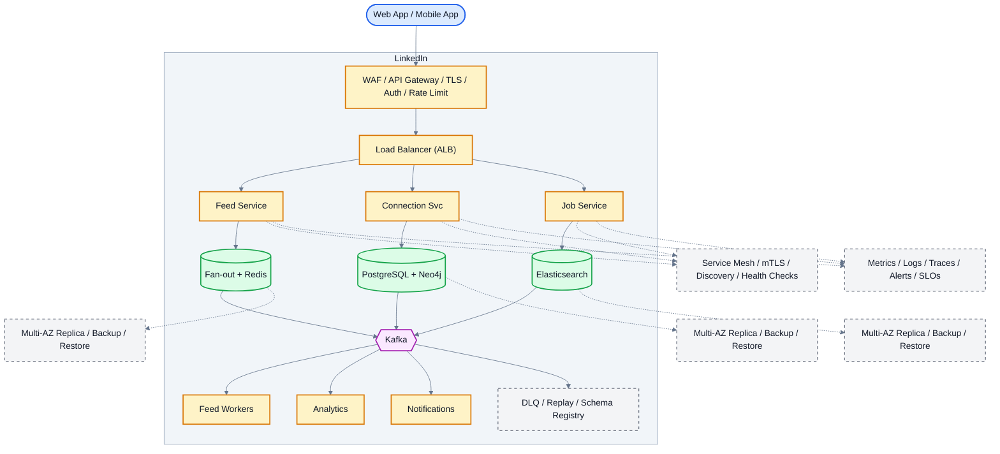

# System Design: LinkedIn (Professional Networking Platform)

## Overview

Professional networking platform with job matching, feed, messaging, learning, and recruiter tools for 900M+ members.

### Key Numbers

- 900M+ members, 55M+ companies, 20M+ job postings
- Feed P99 < 200ms, 10M+ messages/day

---

## Requirements

### Functional Requirements

- Professional profile with experience, skills, education
- Connection requests and professional graph
- Personalized news feed with posts and articles
- Job search, Easy Apply, and alerts
- InMail messaging and chat
- Learning courses and certifications

### Non-Functional Requirements

- Latency: Feed < 200ms, Search < 100ms
- Throughput: 10M+ concurrent users
- Availability: 99.99%
- Scale: 900M+ members

---

## High-Level Architecture

### Architecture Diagram



*Solid = data flow, dashed = control plane / monitoring.*

### Data Flow

1. User posts update - Feed Service fans out to connections feeds
2. Connection suggestions: Neo4j graph traversal (2nd-degree)
3. Job matching: ML model matches profile to job postings
4. Feed ranking: ML sorts by relevance, recency, engagement
5. InMail: messaging via WebSocket (read receipts, typing)
6. Kafka events: post, like, connection - Analytics
7. Notifications: job alerts, connection requests, endorsements

## Microservices
How the system is decomposed into independently deployed services:

| Service | Tech Stack | Database | Pattern |
| --------- | ------------ | ---------- | ---------- |
| Feed Service | Node.js | Redis + Cassandra | Fan-out on Read |
| Connection Service | Go | Neo4j | Graph Traversal |
| Job Service | Java Spring Boot | PostgreSQL + ES | Saga + CQRS |
| Messaging Service | Elixir/Phoenix | Cassandra | WebSocket |
| Search Service | Go | Elasticsearch | BM25 + ML |
| Learning Service | Node.js | PostgreSQL | Event Sourcing |
| Notification Service | Go | Redis Queue | Fan-out |
| Profile Service | Java | PostgreSQL + Redis | CQRS |

---

## Database Design

### PostgreSQL (Relational)

```sql
CREATE TABLE profiles (
    profile_id    BIGSERIAL PRIMARY KEY,
    user_id       BIGINT NOT NULL,
    headline      VARCHAR(200),
    summary       TEXT,
    location      VARCHAR(100),
    industry      VARCHAR(100),
    profile_pic   VARCHAR(500),
    created_at    TIMESTAMP DEFAULT NOW()
);

CREATE TABLE experiences (
    experience_id BIGSERIAL PRIMARY KEY,
    profile_id    BIGINT REFERENCES profiles(profile_id),
    title         VARCHAR(200),
    company       VARCHAR(200),
    location      VARCHAR(100),
    start_date    DATE,
    end_date      DATE,
    description   TEXT
);

CREATE TABLE connections (
    connection_id  BIGSERIAL PRIMARY KEY,
    requester_id   BIGINT NOT NULL,
    connectee_id   BIGINT NOT NULL,
    status         VARCHAR(20) DEFAULT pending,
    created_at     TIMESTAMP DEFAULT NOW(),
    UNIQUE(requester_id, connectee_id)
);

CREATE TABLE jobs (
    job_id        BIGSERIAL PRIMARY KEY,
    company_id    BIGINT NOT NULL,
    title         VARCHAR(200),
    description   TEXT,
    location      VARCHAR(200),
    salary_min    INT,
    salary_max    INT,
    job_type      VARCHAR(50),
    posted_at     TIMESTAMP DEFAULT NOW(),
    status        VARCHAR(20) DEFAULT active
);
```

### Cassandra (Wide Column)

```sql
CREATE TABLE feed_items (
    user_id      BIGINT,
    feed_type    VARCHAR(20),
    created_at   TIMESTAMP,
    post_id      BIGINT,
    author_id    BIGINT,
    content      TEXT,
    like_count   INT,
    comment_count INT,
    PRIMARY KEY ((user_id, feed_type), created_at)
);

CREATE TABLE messages (
    thread_id    UUID,
    sender_id    BIGINT,
    message_id   TIMEUUID,
    content      TEXT,
    msg_type     VARCHAR(20),
    PRIMARY KEY ((thread_id), message_id)
);
```

### Redis

```bash
feed:{user_id}         -> SortedSet
profile:{profile_id}   -> Hash
connection:{user_id}   -> Set
online:{user_id}       -> String with TTL
rate_limit:{user_id}   -> Hash
```

---

## Scaling Tiers
How the architecture grows from MVP to global scale:

| Tier | Users | Infrastructure | Monthly Cost |
| ------ | ------- | --------------- | ------------- |
| 1K-10K | 10K | 2 Node.js + PG + Redis | $300 |
| 10K-1M | 1M | 10 app + PG cluster + Redis + ES | $15,000 |
| 1M-10M+ | 10M+ | 50+ app + sharded PG + Cassandra + Neo4j | $500,000 |

---

## Key Techniques & Patterns

- **Fan-out on Read**: Feed generated at read time for regular users
- **Consistent Hashing**: Distribute feed data across Redis cluster
- **Redis Caching**: Hot profiles cached, LRU eviction
- **SOLID Principles**: Each microservice owns its domain
- **CAP Theorem**: CP for connections, AP for feed
- **Graph Database (Neo4j)**: 2nd-degree connections
- **Event-Driven Architecture**: Kafka events for feed updates
- **CQRS**: Separate read/write paths

---

## Key Design Decisions

1. **Fan-out on Read vs Write**: Read for regular users, Write for influencers
2. **Neo4j vs PostgreSQL**: Neo4j for complex graph traversals
3. **Cassandra for Messages**: Write-heavy, time-series pattern
4. **Elasticsearch for Jobs**: Full-text search with faceted filtering

---

## Failure Modes & Recovery
What can go wrong in production, and how the system detects and recovers:

| Failure | Impact | Mitigation |
| --------- | -------- | ----------- |
| Redis Cache Failure | Feed slow | Read replica + failover |
| Neo4j Crash | No graph traversal | Replicated cluster |
| Kafka Broker Down | Events delayed | Multi-broker + RF=3 |
| ES Cluster Split | Search degraded | Multi-node + replicas |
| Fan-out Storm | Spike after viral post | Rate limit + async queue |

---

## Cost Estimation (1M Users)
Rough monthly cost of running this design for one million users:

| Component | Configuration | Monthly Cost |
| ----------- | -------------- | ------------- |
| App Servers (10x) | c5.2xlarge | $3,500 |
| PostgreSQL | r5.xlarge | $2,000 |
| Cassandra (6 nodes) | i3.xlarge | $4,300 |
| Redis (6 nodes) | r5.xlarge | $3,200 |
| Neo4j (3 nodes) | r5.2xlarge | $3,600 |
| Elasticsearch (6) | r5.xlarge | $4,300 |
| Kafka (6 brokers) | m5.xlarge | $2,500 |
| CDN + LB | CloudFront + ALB | $800 |
| **Total** | | **~$24,200** |

---

## Trade-off Analysis
The alternatives considered, and which one won and why:

| Decision | Option A | Option B | Choice | Why |
| ---------- | ---------- | ---------- | -------- | ----- |
| Feed Model | Fan-out on write | Fan-out on read | Hybrid | Write for <1K followers |
| Graph DB | Neo4j | PostgreSQL | Neo4j | Complex traversals |
| Messages | PostgreSQL | Cassandra | Cassandra | Write-heavy, TTL |
| Search | PG FTS | Elasticsearch | ES | Faceted search + ML |
| Real-time | Polling | WebSocket | WebSocket | Low latency |

---

## Key Metrics to Monitor

1. Feed P50/P99 latency (target: <200ms)
2. Connection recommendation accuracy
3. Job match rate (applied / viewed)
4. Message delivery latency
5. Feed freshness (seconds since latest post)
6. Search relevance score (NDCG)
7. Kafka consumer lag
8. Cache hit rate (Redis)
9. Daily active users / DAU ratio
10. Connection request acceptance rate

---

## Deep Dive Prompts

1. How would you design the LinkedIn feed to handle both regular users and influencers with 10M+ followers?
2. How would you implement People You May Know recommendations using graph traversals?
3. How would you handle the job matching algorithm at scale?
4. How would you design real-time messaging with read receipts?
5. How would you implement LinkedIn search with faceted filtering and ML ranking?

---

## Common Interview Follow-ups

1. How would you handle a viral post from a celebrity reaching 10M followers?
2. How would you implement Open to Work feature efficiently?
3. How would you design LinkedIn Learning course recommendations?
4. How would you handle duplicate job postings across companies?
5. How would you implement the professional graph for recruiter tools?

---

## Low-Level Design (LLD) - Algorithms & Data Structures

### Fan-out on Read Feed Generator

```text
class FeedGenerator {
  constructor(redis, db) {
    this.redis = redis;
    this.db = db;
  }

  async generateFeed(userId, page = 0, limit = 20) {
    const cacheKey = "feed:" + userId;
    const start = page * limit;
    const end = start + limit - 1;

    const cachedIds = await this.redis.zrevrange(cacheKey, start, end);
    if (cachedIds.length > 0) {
      return this.db.getPostsByIds(cachedIds);
    }

    const connections = await this.db.getConnections(userId);
    const recentPosts = await this.db.getRecentPosts(connections, 100);

    const scored = recentPosts.map(post => ({
      ...post,
      score: this.calculateScore(post, userId)
    }));
    scored.sort((a, b) => b.score - a.score);

    await this.redis.del(cacheKey);
    for (const post of scored.slice(0, 500)) {
      await this.redis.zadd(cacheKey, post.score, post.postId);
    }
    await this.redis.expire(cacheKey, 3600);

    return scored.slice(start, start + limit);
  }

  calculateScore(post, userId) {
    const recency = Math.max(0, 1 - (Date.now() - post.timestamp) / (24 * 3600 * 1000));
    const affinity = post.authorId === userId ? 1 : 0.5;
    const engagement = Math.log(post.likeCount + post.commentCount + 1);
    return recency * 0.4 + affinity * 0.3 + engagement * 0.3;
  }
}

const feed = new FeedGenerator(); console.log("Feed generator ready");
```
