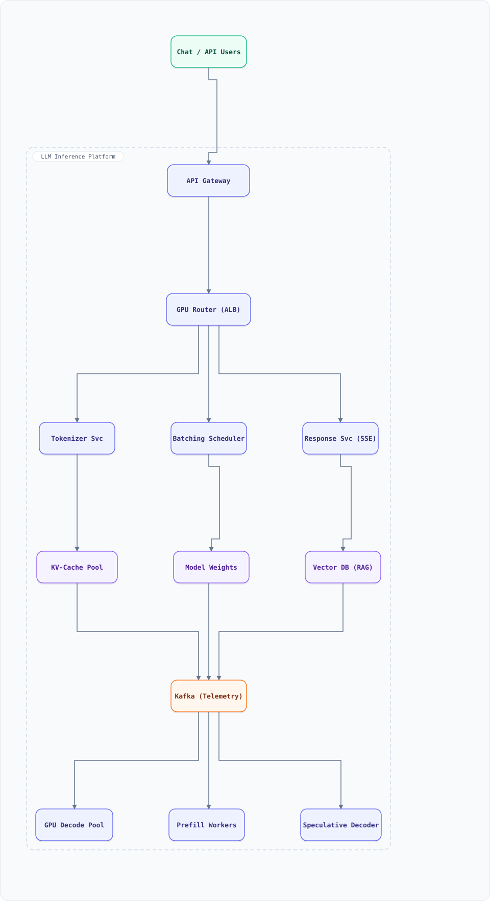

<div align="center">

# System Design: LLM Inference Platform (Production Serving)

</div>

> [!TIP]
> **TL;DR** — Design the serving platform behind a production LLM product: stream tokens to millions of users while serving GPU-expensive autoregressive models.

## Table of Contents

<details>
<summary><b>📑 Jump to a section</b></summary>

1. [Overview](#overview)
2. [Requirements](#requirements)
3. [High-Level Architecture](#high-level-architecture)
4. [Microservices](#microservices)
5. [Database Design](#database-design)
6. [Scaling Tiers](#scaling-tiers)
7. [Key Techniques & Patterns](#key-techniques--patterns)
8. [Key Design Decisions](#key-design-decisions)
9. [Failure Modes & Recovery](#failure-modes--recovery)
10. [Cost Estimation (1M users)](#cost-estimation-1m-users)
11. [Trade-off Analysis](#trade-off-analysis)
12. [Key Metrics to Monitor](#key-metrics-to-monitor)
13. [Production Readiness Checklist](#production-readiness-checklist)
14. [Deep Dive Prompts](#deep-dive-prompts)
15. [Common Interview Follow-ups (with answers)](#common-interview-follow-ups-with-answers)
16. [Low-Level Design (LLD) - Algorithms & Data Structures](#low-level-design-lld---algorithms--data-structures)
17. [Do's & Don'ts](#dos--donts)

</details>

---


## Overview

Design the serving platform behind a production LLM product: stream tokens to millions of users while serving GPU-expensive autoregressive models. The core problems are unlike any classical system design — **GPU memory is the scarce resource** (KV-cache, not weights, dominates at batch), requests are **stateful streaming sessions**, latency splits into **TTFT** (time-to-first-token) and **TPOT** (time-per-output-token), and rate limiting must be denominated in **tokens**, not requests. The platform must pack requests onto GPUs (continuous batching), reuse prefix caches, survive GPU failure mid-stream, and keep cost per million tokens economically viable.

### Key Numbers

| Metric | Value |
| ------ | ----- |
| DAU | 10M+ users, ~500K concurrent sessions peak |
| Requests | 50K req/sec peak, ~2K tokens avg output per request |
| Tokens generated | ~100B output tokens/day |
| Model | 70B-parameter class, FP8 weights (~70 GB), plus smaller draft models |
| GPU fleet | 2,000+ H100-class GPUs (tensor-parallel groups of 8) |
| Latency SLO | TTFT p95 < 800 ms, TPOT p95 < 50 ms (streaming feel) |
| KV-cache per token | ~0.3-0.5 MB/token/seq (70B, 80 layers, GQA) — 1M tokens ≈ 400 GB |
| Utilization target | > 65% MFU (model FLOPs utilization) during peak |
| Cost pressure | $/1M output tokens is the north-star business metric |

## Requirements

### Functional Requirements

- Accept prompts via HTTP/SSE, stream tokens incrementally until `[DONE]`
- Multi-turn conversations: append to prior context with cached prefixes
- Model zoo: serve multiple model sizes with per-model quotas; A/B model versions
- Attachments/RAG: retrieval-augmented context injection before prefill
- Token accounting per API key/user for billing and abuse control
- Speculative decoding with draft models; structured output (JSON mode) support

### Non-Functional Requirements

- TTFT p95 < 800 ms; TPOT p95 < 50 ms (≥ 20 tok/sec per stream)
- No mid-stream drops: client reconnects resume via conversation/seq ID where feasible
- GPU failure degrades capacity linearly; requests in flight rerouted or replayed from saved state
- Horizontal scale: add GPU nodes → add capacity; queueing absorbs bursts, never silent drops
- Observability: per-request token/latency/cost traces; per-GPU MFU and KV-cache utilization

## High-Level Architecture

### Architecture Diagram



**Interactive diagram:** [diagrams/system-design/llm-inference.architecture.html](diagrams/system-design/llm-inference.architecture.html) — pan/zoom, search, dark/light theme, PNG/SVG export.


*Solid = prompt/token flow, dashed = control plane / monitoring.*

### Data Flow

1. Client opens an SSE stream; **API Gateway** authenticates, checks the **token-budget rate limiter** (sliding window per key), and routes to the least-loaded GPU group
2. **Tokenizer Svc** tokenizes the prompt; prefix hash checked against the **KV-Cache Pool** (page table lookup) — a hit skips re-prefill of the shared prefix
3. **Batching Scheduler** admits the request into a running batch (continuous batching: requests join/leave every decode step, no batch boundary waits)
4. **GPU Decode Pool** runs tensor-parallel decode; each step emits one token per active sequence, streamed via the **Response Svc**
5. **Prefill Workers** handle long prompts (chunked prefill, separated from decode to protect TPOT); **Speculative Decoder** drafts k tokens with a small model, verifies in one target forward pass
6. Telemetry (tokens, latency, cache hits) streams to Kafka for billing and SLO dashboards

## Microservices

| Service | Responsibility | Scaling |
| :--- | :--- | :--- |
| API Gateway | Auth, quota, routing, SSE termination | Stateless, N replicas |
| Tokenizer Svc | Prompt → token IDs, prefix hashing | Stateless, CPU |
| Batching Scheduler | Continuous batching, admission control | Per GPU-group scheduler |
| Prefill/Decode Pools | Chunked prefill; autoregressive decode | GPU fleets, TP=8 groups |
| KV-Cache Manager | Paged KV-cache, prefix cache, eviction | GPU/NVMe memory tier |
| Response Svc | Token fan-out to SSE clients | Stateless, N replicas |
| Usage Pipeline | Token metering, billing events | Kafka consumers |

## Database Design

### KV-Cache (PagedAttention-style)

```
seq_8812: [page_0][page_1]...[page_41]   # 16 pages/GB-class pool per GPU
prefix_cache: hash(prefix_tokens) -> [(gpu, page_id), ...]  # shared read-only pages
eviction: LRU on (last_used, refcount==0), preserve pinned sessions
```

- Paged KV-cache: logical blocks of fixed token count, copy-on-write when sequences fork (beam/n-best)
- Prefix cache: system prompts and multi-turn history reused across requests; hit = skip prefill entirely
- Offload: evicted-but-recent pages spill to NVMe; re-hydration on cache hit is still cheaper than re-prefill for long contexts

### Conversation & Metadata Stores (PostgreSQL + Redis)

```sql
CREATE TABLE conversations (
  conv_id     UUID PRIMARY KEY,
  user_id     BIGINT NOT NULL,
  model       VARCHAR(32) NOT NULL,
  seq         INT NOT NULL DEFAULT 0,       -- last streamed token index
  created_at  TIMESTAMPTZ DEFAULT now()
);
CREATE TABLE messages (
  msg_id     BIGSERIAL PRIMARY KEY,
  conv_id    UUID REFERENCES conversations(conv_id),
  role       VARCHAR(8) NOT NULL,            -- user | assistant | system
  content    TEXT NOT NULL,
  token_len  INT NOT NULL,
  seq        INT NOT NULL
);
```

- Redis: token-budget buckets per API key (`INCRBY` + expiry), session affinity hints, SSE resume pointers (`conv:seq`)

## Scaling Tiers

How the serving platform grows from pilot to global scale:

| Tier | Users | Infrastructure | Monthly Cost |
| ------ | ------- | --------------- | -------------- |
| 1K-10K | 100 req/sec | 4 × L40S (single-GPU serving), 1 scheduler | $8,000 |
| 10K-1M | 2K req/sec | 64 × A100/H100 TP=4 groups + prefix cache + Kafka metering | $220,000 |
| 1M-10M+ | 50K req/sec | 2,000+ GPUs TP=8, multi-region, speculative decoding, NVMe KV offload | $5,000,000+ |

## Key Techniques & Patterns

- **Continuous batching**: requests join/leave the batch at every decode step — no batch-padding waits; the single biggest throughput lever (2-5× vs static batching)
- **PagedAttention KV-cache**: treat KV as virtual memory (blocks + page table) — eliminates fragmentation, enables prefix sharing and copy-on-write
- **Chunked prefill + decode separation**: long prompts prefill in chunks on dedicated workers so decode TPOT stays smooth
- **Prefix caching**: hash the token prefix → reuse KV pages; multi-turn chat hits are near 100% per turn
- **Speculative decoding**: draft k tokens with a small model, verify in one target pass — 2-3× decode speedup at identical output distribution
- **Token-based rate limiting**: sliding-window token buckets per key (input+output), not request counts
- **Quantization & sharding**: FP8/INT8 weights, tensor parallelism within a node, pipeline/stream parallelism across nodes
- **Backpressure by admission control**: the scheduler admits only what fits (batch slots × KV budget); queue exposes position, nothing silently drops

## Key Design Decisions

| Decision | Rationale | Trade-off |
| :--- | :--- | :--- |
| Continuous batching over static | 2-5× throughput at same TPOT | Complex scheduler state machine |
| PagedAttention KV management | Fragmentation → ~0; prefix sharing possible | Page-table overhead per step (small) |
| Separate prefill/decode pools | Protects TPOT from long-prompt prefill spikes | Duplicated GPU pools; KV hand-off between pools |
| Streaming-first (SSE) | Perceived latency is TTFT only | Stateful long-lived connections need resumability design |
| Token-metered quotas | One 100K-token prompt ≠ one "request" | Billing pipeline must consume the meter stream |
| FP8 weights + KV quantization | ~2× more tokens per GPU | Marginal quality risk; measured per model release |

## Failure Modes & Recovery

| Failure | Detection | Recovery |
| :--- | :--- | :--- |
| GPU dies mid-stream | NVML heartbeat / kernel errors | Scheduler drains the group; in-flight streams resume from last committed page on a replica; client SSE retries with Last-Event-ID |
| Scheduler overload | Queue depth + KV headroom alarm | Admission control throttles new sessions (429 + Retry-After), decodes never preempted mid-token |
| Prefix cache thrash | Hit-rate drop | Pin hot system-prompt pages; per-model cache partitioning |
| Tokenizer/SSE tier down | Health checks | Stateless replicas; gateway reconnects, conversation store provides resume seq |
| Kafka metering lag | Consumer lag | Billing tolerates minutes of lag; idempotent token events by (req_id, chunk_seq) |
| Regional GPU outage | Multi-region health | Traffic shifts to other regions; latency SLO relaxes with explicit banner |

## Cost Estimation (1M users)

| Component | Spec | Monthly |
| ------ | ------ | ------ |
| H100 GPU pool | 180 GPUs (TP=8 × ~22 groups, peak-usable) | $900,000 |
| CPU serving tier | Gateways, schedulers, tokenizer, SSE | $45,000 |
| Storage | Conversation store + NVMe KV offload, 200 TB | $25,000 |
| Kafka + telemetry | 6 brokers + metrics pipeline | $12,000 |
| Networking | GPU fabric (IB/RoCE), LB, egress | $60,000 |
| **Total** | | **~$1,040,000** |

At ~40B output tokens/day ≈ 1.2T/mo, that lands near **$0.85 per 1M output tokens** of pure infra — the number that determines product margin.

## Trade-off Analysis

| Decision | Gain | Cost |
| :--- | :--- | :--- |
| Continuous batching | 2-5× GPU throughput | Scheduler complexity; tail TPOT jitter |
| Prefix caching (shared pages) | Big TTFT win on multi-turn | Copy-on-write page lifecycle to manage |
| Speculative decoding | 2-3× decode speed | Draft model must be tuned per target; wasted verify flops on rejection |
| Separate prefill pool | Smooth TPOT (streaming feel) | Idle prefill GPUs off-peak; KV hand-off |
| Smaller model fallback | Capacity surge absorption | Quality dip; must route by request tier |

## Key Metrics to Monitor

- **Latency**: TTFT p50/p95, TPOT p50/p95, end-to-end stream duration
- **Throughput**: output tok/sec per GPU, MFU per group, batch occupancy
- **Cache**: prefix-cache hit rate, KV-cache utilization %, eviction rate, offload re-hydrations
- **Quality/ops**: tokens/request, rejection rate of speculative drafts, GPU error rate, queue depth + wait time

## Production Readiness Checklist

- [ ] **HA** — multi-region GPU pools behind a global LB; scheduler per GPU-group with leader election; regional drain on degradation, never silent
- [ ] **DR** — conversation store PITR; KV checkpoints persisted to NVMe so group loss never loses committed tokens; region failover RTO < 5 min
- [ ] **Security** — API-key auth at the edge, mTLS internally; prompt/response payloads never logged at full fidelity (PII scrubbing in telemetry)
- [ ] **Safety** — output content-filtering tier; per-key abuse auto-quarantine; jailbreak detection hooks before admission
- [ ] **Capacity** — admission control load-tested at 2× peak; token-budget limits enforced pre-admission; alarm at 80% KV utilization
- [ ] **Cost guardrails** — per-key $ budgets, auto-throttle on runaway generations, per-model unit-economics dashboards
- [ ] **Observability** — TTFT/TPOT SLO burn alerts; per-request cost traces; MFU + prefix-cache-hit dashboards

## Deep Dive Prompts

- Derive KV-cache size per token and compute how many concurrent 8K-context sessions fit on one 80 GB GPU.
- Design the scheduler's admission rule: given TPOT SLO, how much KV headroom must stay free?
- How would you implement JSON-mode/structured output without breaking streaming?
- Design multi-region serving: how do you route a European user at 03:00 UTC with 30% idle US GPUs?
- How does beam search interact with PagedAttention copy-on-write?

## Common Interview Follow-ups (with answers)

**Q1. Why is rate limiting denominated in tokens, not requests?**
One request can be a 50-token chat or a 100K-token document analysis; costs differ by 3 orders of magnitude. Token buckets (sliding window per API key, counting prompt + generated tokens) align limits with actual GPU cost. Practically: `ZADD` each request's token spend into a per-key sorted set keyed by timestamp, `ZREMRANGEBYSCORE` the expired window, `ZCARD`/sum the rest. Output tokens are metered as generated, so runaway generations self-throttle.

**Q2. What exactly is TTFT vs TPOT, and why separate SLOs?**
TTFT = time to first token — dominated by queueing + prefill over the prompt. TPOT = average time per generated token after that — dominated by decode step time. Users perceive them differently: TTFT is "did it start?" (feels broken if > 1 s), TPOT is "does it stream smoothly?" (feels laggy if < 20 tok/s). They conflict — a long prefill can finish fast in a batch but stall everyone's decode — hence chunked prefill and separate pools.

**Q3. Why is continuous batching so much faster than static batching?**
Static batching waits for the longest sequence in a batch before admitting new requests — GPUs run at low occupancy while short sequences pad. Continuous batching admits/removes sequences at every decode step: the batch is always full, so throughput is 2-5× higher at the same TPOT. The cost is a scheduler that can swap sequences in and out mid-flight, which PagedAttention's page-table state model makes possible.

**Q4. How does the KV-cache actually constrain capacity?**
Decode is memory-bandwidth-bound: each step reads all KV state of all active sequences. KV size ≈ 2 × layers × kv_heads × head_dim × bytes_per_element × context_len. For a 70B model that's ~0.3-0.5 MB per token — a 32K-context sequence alone can hold ~12 GB. So an 80 GB GPU holds the 70 GB of FP8 weights plus KV for only a handful of long sessions — capacity engineering is KV management: paging, quantized KV, prefix sharing, and offload.

**Q5. A GPU dies while a user's stream is mid-generation. Walk me through recovery.**
The scheduler drains the group and stops admitting; healthy GPUs finish their batches. The failed group's in-flight streams have their last committed KV pages persisted (checkpoint per N tokens to NVMe). The conversation store holds `seq` — the last delivered token index. On client retry with Last-Event-ID (or proactive Response Svc failover), the request is re-admitted on another group, re-prefills the prompt with its prefix cache, and regenerates from `seq`, deduplicating by token index. Users see a brief stall, not a broken chat.

**Q6. How do you decide between a bigger GPU fleet and a smarter cache?**
Measure the prefix-cache hit rate against token spend. At 60% hit rate, 60% of prefill compute is already free — for chat workloads with shared system prompts, cache ROI usually beats hardware ROI by an order of magnitude. Track $/1M tokens as the single number: every technique (continuous batching, prefix cache, speculative decode, quantization) is judged by its delta on that metric per quality point preserved.

## Low-Level Design (LLD) - Algorithms & Data Structures

### Continuous Batching Scheduler + Token-Bucket Rate Limiter

The scheduler maintains an active set with KV budgets; each "step" decodes one token for every active sequence and admits queued requests whose KV footprint fits. The limiter is a sliding-window token bucket per API key.

```javascript
// Minimal continuous-batching scheduler with KV-budget admission + token rate limiter.
class TokenRateLimiter {
  constructor(windowMs = 60000, maxTokens = 100000) {
    this.windowMs = windowMs; this.maxTokens = maxTokens;
    this.spends = new Map(); // apiKey -> [ [ts, tokens], ... ]
  }
  admit(apiKey, tokens, now = Date.now()) {
    const arr = (this.spends.get(apiKey) ?? []).filter(([ts]) => now - ts < this.windowMs);
    const used = arr.reduce((s, [, t]) => s + t, 0);
    if (used + tokens > this.maxTokens) { this.spends.set(apiKey, arr); return false; }
    arr.push([now, tokens]); this.spends.set(apiKey, arr); return true;
  }
}

class ContinuousBatcher {
  constructor({ kvBytesPerToken = 400_000, kvBudgetBytes = 48 * 1024 ** 3, maxBatch = 256 }) {
    this.kvBytesPerToken = kvBytesPerToken;
    this.kvBudget = kvBudgetBytes;         // KV budget per GPU group
    this.maxBatch = maxBatch;
    this.active = [];                      // { id, promptTokens, genTokens, maxTokens }
    this.queue = [];
    this.completed = [];
  }
  kvFootprint(s) {
    return (s.promptTokens + s.genTokens) * this.kvBytesPerToken; // grows as we generate
  }
  #usedKV() { return this.active.reduce((s, x) => s + this.kvFootprint(x), 0); }
  submit(s) { this.queue.push(s); }
  step() {
    // 1) decode one token for every active sequence
    for (const s of this.active) {
      s.genTokens += 1;
      if (s.genTokens >= s.maxTokens) s.done = true;
    }
    // 2) retire finished sequences
    const done = this.active.filter(s => s.done);
    this.active = this.active.filter(s => !s.done);
    this.completed.push(...done.map(s => ({ id: s.id, genTokens: s.genTokens })));
    // 3) admit queued requests while KV headroom + batch slots allow
    let used = this.#usedKV();
    while (this.queue.length && this.active.length < this.maxBatch) {
      const next = this.queue[0];
      const need = (next.promptTokens + 1) * this.kvBytesPerToken;
      if (used + need > this.kvBudget) break;          // admission control, never mid-token preemption
      this.active.push({ ...next, genTokens: 1 }); used += need;
      this.queue.shift();
    }
    return { active: this.active.length, completedNow: done.length, kvUsedGB: +(used / 1024 ** 3).toFixed(1) };
  }
}

// --- demo: two users, one over-quota; batch drains deterministically (deterministic output) ---
const lim = new TokenRateLimiter(60000, 10000);
console.log('userA 8k prompt admitted:', lim.admit('A', 8000));
console.log('userA over-quota admitted:', lim.admit('A', 5000));
console.log('userB 8k prompt admitted:', lim.admit('B', 8000));

const b = new ContinuousBatcher({});
b.submit({ id: 'r1', promptTokens: 2000, maxTokens: 8 });
b.submit({ id: 'r2', promptTokens: 500,  maxTokens: 3 });
for (let i = 0; i < 9; i++) console.log(`step ${i + 1}:`, JSON.stringify(b.step()));
console.log('completed:', JSON.stringify(b.completed));
```

Expected: user A's second request is rejected by the token limiter while user B passes; the batcher admits both requests, retires `r2` at step 3 and `r1` at step 8 (each visible as a `completedNow: 1` pulse), with KV usage dropping after each retirement — demonstrating admission control, continuous batching, and retirement in one trace.

## Do's & Don'ts

| ✅ Do | ❌ Don't |
| :-- | :-- |
| Pin down the key numbers before drawing boxes | Don't hand-wave the hardest component — llm inference lives or dies there |
| Justify the functional requirements choice against one alternative out loud | Don't default to the trendiest store without a consistency/scale argument |
| State the failure mode of non-functional requirements explicitly (what breaks first?) | Don't present a sunny-day design only — the follow-up question is always "and when it fails?" |
| Anchor capacity numbers before proposing shards/replicas | Don't introduce a component you can't cost or size with the numbers on the board |

*More cross-topic rules: [Interview Q&A §81](interview-qa.md#81-universal-dos--donts) · Concepts: [Networking](networking.md) · [Operating Systems](operating-systems.md)*

---

<nav>← [linkedin](system-design-linkedin.md) · [📖 All guides](README.md) · [messaging app](system-design-messaging-app.md) →</nav>
