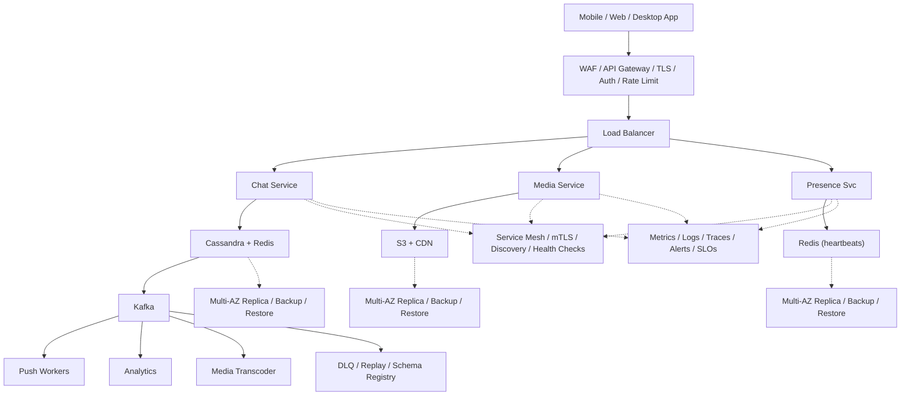

# System Design: Messaging Application (WhatsApp)

## Overview

A real-time messaging platform supporting one-to-one and group messaging, media sharing, online/offline status, delivery receipts, and push notifications for 2B+ users globally.

### Key Numbers

- 2B+ registered users
- 100B+ messages per day
- 500M+ daily active users
- Peak: 10M+ messages per second

---

## Requirements

### Functional Requirements

- Send/receive text, images, videos, docs
- Group chats up to 1024 members
- Online/offline status and typing indicators
- End-to-end encryption
- Multi-device delivery

### Non-Functional Requirements

- Latency: Message delivery < 200ms
- Throughput: 100B+ messages/day
- Availability: 99.99% uptime
- Consistency: Message ordering
- Scale: 2B+ users, 180+ countries

---

## High-Level Architecture

### Architecture Diagram



### Data Flow

1. User sends message - WebSocket Gateway routes to Chat Service
2. Chat Service stores in Cassandra (write-heavy, time-series)
3. If recipient online - push via WebSocket (< 200ms delivery)
4. If recipient offline - queue in Cassandra + send push notification
5. Media messages - upload to S3, generate thumbnail, share CDN URL
6. Group message - fan-out to all group members conversation queues
7. Kafka events - Analytics (message volume, DAU) + Media transcoding

## Microservices

### 1. Auth Service

- **Responsibility**: Registration (phone OTP), JWT tokens, device management
- **Tech**: Go / Node.js
- **DB**: PostgreSQL
- **Cache**: Redis (sessions)

### 2. WebSocket Gateway (Chat Connection Service)

- **Responsibility**: Persistent WebSocket connections, message routing, heartbeats, reconnection handling
- **Tech**: Go / Erlang (Elixir)
- **Protocol**: WebSocket (primary), XMPP fallback
- **Cache**: Redis (user -> server mapping)

### 3. Chat Service

- **Responsibility**: One-to-one messaging, group messaging, message ordering, delivery receipts
- **Tech**: Go
- **DB**: Cassandra (message store, write-heavy)
- **Cache**: Redis (recent messages, unread counts)

### 4. User Service

- **Responsibility**: Profile management, contact sync, online/offline/presence status, block list
- **Tech**: Go
- **DB**: PostgreSQL (profiles), Redis (presence)

### 5. Group Service

- **Responsibility**: Group creation, member management, admin roles, group settings
- **Tech**: Go
- **DB**: PostgreSQL (group metadata), Redis (group membership cache)

### 6. Media Service

- **Responsibility**: Image/video/audio upload, thumbnail generation, compression, CDN upload
- **Tech**: Node.js / Go
- **Storage**: S3 (media files)
- **Queue**: Kafka (async processing)

### 7. Notification Service

- **Responsibility**: Push notifications (FCM/APNs), offline message delivery, notification batching
- **Tech**: Node.js
- **Queue**: Kafka consumer
- **DB**: PostgreSQL (notification preferences)

### 8. Delivery Service

- **Responsibility**: Message delivery tracking, retry logic, offline queue, read receipts
- **Tech**: Go
- **DB**: Redis (delivery state), Cassandra (delivery log)

---

## Database Design

### PostgreSQL (Users & Groups)

```sql
CREATE TABLE users (
    user_id         UUID PRIMARY KEY DEFAULT gen_random_uuid(),
    phone           VARCHAR(20) UNIQUE NOT NULL,
    name            VARCHAR(255),
    avatar_url      TEXT,
    about           TEXT,
    last_seen       TIMESTAMP,
    is_online       BOOLEAN DEFAULT FALSE,
    created_at      TIMESTAMP DEFAULT NOW()
);

CREATE TABLE groups (
    group_id        UUID PRIMARY KEY DEFAULT gen_random_uuid(),
    name            VARCHAR(255),
    description     TEXT,
    avatar_url      TEXT,
    creator_id      UUID REFERENCES users(user_id),
    max_members     INT DEFAULT 256,
    created_at      TIMESTAMP DEFAULT NOW()
);

CREATE TABLE group_members (
    group_id        UUID REFERENCES groups(group_id),
    user_id         UUID REFERENCES users(user_id),
    role            VARCHAR(20) DEFAULT 'member',
    joined_at       TIMESTAMP DEFAULT NOW(),
    PRIMARY KEY (group_id, user_id)
);
```

### Cassandra (Messages - Write-Heavy Time Series)

```cql
CREATE TABLE messages (
    conversation_id UUID,
    message_id      TIMEUUID,
    sender_id       UUID,
    message_type    TEXT,
    content         TEXT,
    media_url       TEXT,
    reply_to        UUID,
    status          TEXT,
    created_at      TIMESTAMP,
    PRIMARY KEY ((conversation_id), message_id)
) WITH CLUSTERING ORDER BY (message_id DESC);

CREATE TABLE conversations (
    user_id         UUID,
    conversation_id UUID,
    last_message    TEXT,
    last_message_at TIMESTAMP,
    unread_count    INT DEFAULT 0,
    is_pinned       BOOLEAN DEFAULT FALSE,
    PRIMARY KEY ((user_id), last_message_at, conversation_id)
) WITH CLUSTERING ORDER BY (last_message_at DESC);
```

### Redis (Real-Time State)

```
# User -> WebSocket server mapping
HSET user:server {user_id} {server_id}

# Online presence
SETEX presence:{user_id} 300 "online"

# Unread count
INCR unread:{user_id}:{conversation_id}

# Typing indicator (expires in 5 seconds)
SETEX typing:{conversation_id}:{user_id} 5 "1"

# Recent messages cache
LPUSH recent:{conversation_id} {message_json}
LTRIM recent:{conversation_id} 0 99
```

---

## Scaling Tiers

### Tier 1: 1K - 10K Users (MVP)

| Component | Choice |
| ----------- | -------- |
| **Compute** | 2-4 EC2 (t3.large) |
| **Database** | PostgreSQL RDS (single) |
| **Cache** | Redis (single) |
| **WebSocket** | Single server (socket.io) |
| **Media** | S3 + CloudFront |
| **Queue** | Redis Streams |
| **Push** | Firebase Cloud Messaging |

### Tier 2: 10K - 1M Users (Growth)

| Component | Choice |
| ----------- | -------- |
| **Compute** | ECS (20-50 containers) |
| **Database** | PostgreSQL (read replicas) + Cassandra (3 nodes) |
| **Cache** | Redis Cluster (6 nodes) |
| **WebSocket** | Socket.IO cluster (10+ servers) |
| **Media** | S3 + multi-CDN |
| **Queue** | Kafka (3 brokers) |
| **Search** | Elasticsearch (group search) |
| **Push** | FCM + APNs + SendGrid |

### Tier 3: 1M - 10M+ Users (Global)

| Component | Choice |
| ----------- | -------- |
| **Compute** | Multi-region K8s (500+ pods) |
| **Database** | Cassandra (50+ nodes, multi-DC) |
| **Cache** | Redis Cluster (30+ nodes per region) |
| **WebSocket** | Custom Gateway (100K+ connections per node) |
| **Media** | S3 + Open Connect-style edge |
| **Queue** | Kafka (15+ brokers, multi-DC) |
| **Service Mesh** | Istio |
| **Chaos** | Litmus Chaos |

---

## Key Design Decisions

### 1. Why Cassandra for Messages?

- Write-heavy workload (100B+ messages/day)
- Time-series access pattern (recent messages first)
- Linear horizontal scalability
- Multi-DC replication for global availability

### 2. Why WebSocket over HTTP Polling?

- Bi-directional real-time communication
- Lower latency (no HTTP overhead per message)
- Lower bandwidth (no headers per message)
- Server can push messages instantly

### 3. Why Fan-Out on Group (Not Per User)?

- Group messages go to group, not individual users
- Reduces write amplification for group chats
- Each member pulls from group conversation

### 4. Message Ordering

- Use server-generated timestamp (TIMEUUID)
- Per-conversation ordering (not global)
- Handle clock skew with logical timestamps

### 5. Why Not Kafka for Message Delivery?

- Kafka is for async processing, not real-time delivery
- WebSocket Gateway handles real-time delivery directly
- Kafka used for: notifications, analytics, media processing

---

## Failure Modes & Recovery
What can go wrong in production, and how the system detects and recovers:

| Failure | Impact | Recovery |
| --------- | -------- | ---------- |
| WebSocket gateway crash | 1M users disconnected | Graceful shutdown, auto-reconnect, session migration |
| Message queue backlog | Messages delayed > 30s | Auto-scale workers, priority for 1:1 over group |
| E2E key exchange failure | New device cannot decrypt | Key backup to cloud, multi-device sync |
| Presence service down | All users appear offline | Stale presence with TTL, graceful degradation |
| Media storage outage | Images/videos fail to send | Local cache fallback, retry queue |
| Database hot key | Single shard overloaded | Split hot group, cache metadata |

---

## Cost Estimation (1M Users)
Rough monthly cost of running this design for one million users:

| Component | Specification | Monthly Cost |
| ----------- | -------------- | ------------- |
| WebSocket Gateway | 100x c5.xlarge | $14,000 |
| PostgreSQL | db.r5.2xlarge + 10 replicas | $12,000 |
| Redis Cluster | 24x cache.r5.xlarge | $19,200 |
| Kafka Cluster | 12x kafka.m5.large | $4,800 |
| S3 Media Storage | 200TB | $4,600 |
| CDN | 50TB/month transfer | $4,000 |
| Presence Service | 20x c5.xlarge | $2,800 |
| E2E Key Server | 5x c5.large | $700 |
| Signal Protocol | Open source | $0 |
| **Total** | | **~$62,100/month** |

---

## Trade-off Analysis
The alternatives considered, and which one won and why:

| Approach A | Approach B | Winner | Reason |
| ----------- | ----------- | -------- | -------- |
| Cassandra | PostgreSQL | Cassandra | Write-heavy workload, linear scalability |
| Signal Protocol | MLS | Signal Protocol | Battle-tested, better mobile support |
| Redis presence | Database presence | Redis | Sub-ms heartbeat updates |
| WebSocket | Long polling | WebSocket | True real-time, lower latency |
| S3 | Google Cloud Storage | S3 | Better integration with existing stack |

---

## Key Metrics to Monitor
The metrics that signal system health, with alert thresholds:

| Metric | Target |
| -------- | -------- |
| Message delivery latency | < 200ms |
| WebSocket connection success | > 99.9% |
| Message delivery success rate | > 99.99% |
| Media upload success rate | > 99.9% |
| Online presence accuracy | > 99% |
| API response time (p99) | < 200ms |
| Message ordering accuracy | 100% |
| Push notification delivery | > 95% |
| System availability | 99.99% |
| WebSocket connections per server | 2M+ |

---

---

## Deep Dive Prompts

- How does end-to-end encryption work with the Signal Protocol?
- How do you handle message ordering across multiple devices?
- How does presence system work for billions of users?
- How do you sync messages across 5+ devices per user?

---

## Key Techniques & Patterns
The recurring techniques and patterns this design applies, mapped to where they are used:

| Technique | Description | Used In |
| ----------- | ------------- | ---------- |
| WebSocket for Real-time | Applied in this system | Architecture + LLD |
| Message Queue (Kafka) | Applied in this system | Architecture + LLD |
| Redis for Presence | Applied in this system | Architecture + LLD |
| End-to-End Encryption | Applied in this system | Architecture + LLD |
| Fan-out for Group Messages | Applied in this system | Architecture + LLD |
| Offline Message Storage | Applied in this system | Architecture + LLD |

## Common Interview Follow-ups

**Q: How does E2E encryption work across devices?**
A: Signal Protocol X3DH, per-device keys, multi-device sync via cloud backup

**Q: How do you handle message ordering in groups?**
A: Vector clocks for causal order, server sequence numbers, client conflict resolution

**Q: How does presence work for 2B users?**
A: Redis TTL heartbeat, WebSocket as presence signal, graceful degradation

---

## Low-Level Design (LLD) - Algorithms & Data Structures

### 1. Message Ordering (Vector Clocks)

```text
class MessageService {
  constructor(redisClient, dbClient) { this.r = redisClient; this.db = dbClient; }
  async sendMessage(senderId, receiverId, content) {
    const encrypted = Buffer.from(content).toString('base64');
    const msg = await this.db.saveMessage({ senderId, receiverId, content: encrypted, timestamp: Date.now(), status: 'sent' });
    const online = await this.r.exists('online:' + receiverId);
    if (online) { await this.r.publish('messages:' + receiverId, JSON.stringify(msg)); await this.db.updateMessageStatus(msg.id, 'delivered'); }
    return msg;
  }
  async getConversation(userId1, userId2, limit = 50) { return this.db.getMessages(userId1, userId2, limit); }
}
```

### 2. Message Deduplication (Idempotency)

```text
class PresenceService {
  constructor(redisClient) { this.r = redisClient; this.THRESHOLD = 90; }
  async setOnline(userId) { await this.r.setex('online:' + userId, this.THRESHOLD, Date.now().toString()); await this.r.sadd('online:users', userId); }
  async heartbeat(userId) { await this.r.expire('online:' + userId, this.THRESHOLD); }
  async setOffline(userId) { await this.r.del('online:' + userId); await this.r.srem('online:users', userId); }
  async isOnline(userId) { return this.r.exists('online:' + userId); }
  async getOnlineUsers() { return this.r.smembers('online:users'); }
}

const chat = new ChatService(); console.log("Chat service ready");
```

### 3. Connection Routing (Consistent Hashing)

```text
class ConnectionRouter {
    // Route users to WebSocket servers using consistent hashing
    // - User always connects to same server (session affinity)
    // - On server failure, minimal remapping

```

### 4. Offline Message Queue

```text
function deliver_message(recipient_id, message) {
    // Deliver message to recipient
    // - If online: push via WebSocket
    // - If offline: store in offline queue and enqueue a push notification
    // - On delivery success, remove the queued message

    if (user_is_online(recipient_id)) {
        send_via_websocket(recipient_id, message);
    } else {
        enqueue_offline_message(recipient_id, message);
        send_push_notification(recipient_id, "New message");
    }
}
```

### 5. Typing Indicator (Debounced)

```text
function handle_typing_event(user_id, conversation_id, is_typing) {
    // Typing indicator with debounce
    // - Client sends start/stop typing
    // - Server broadcasts to other participants
    // - Auto-expires after 5 seconds

    if (is_typing) {
        debounce_broadcast(conversation_id, user_id, "typing_started");
    } else {
        debounce_broadcast(conversation_id, user_id, "typing_stopped");
    }
}
```

### Real-World Insights (2024-2025)

### WhatsApp Architecture Facts

- Uses Ejabberd (XMPP) server written in Erlang
- Erlang handles 2M connections per server
- Signal Protocol for end-to-end encryption
- Messages stored on device, not server (after delivery)
- Fallback: XMPP -> HTTP long-polling for unreliable networks

### Key Patterns

- **Connection Affinity**: User is always routed to same WebSocket server via consistent hashing
- **Offline Queue**: Messages queued in Cassandra, delivered when user reconnects
- **Message Dedup**: Client-generated message ID prevents duplicates on retry
- **Receipt Chain**: Sent -> Delivered -> Read (each is a separate message)

### Scale Numbers

| Metric | Value |
| -------- | ------- |
| Messages/day | 100B+ |
| Peak messages/sec | 10M+ |
| Connections per server | 2M (Erlang) |
| Media messages/day | 5B+ |
| Group size limit | 1024 members |

---
