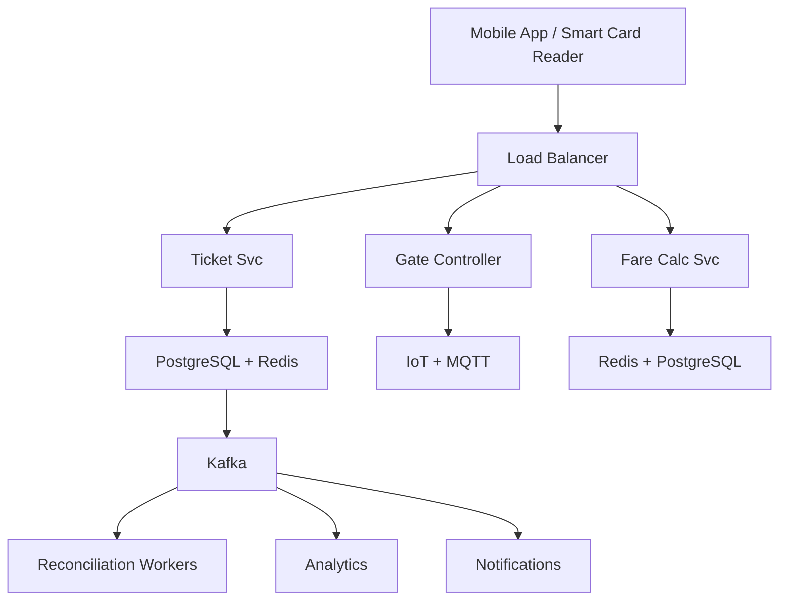

# System Design: Metro Ticketing System

## Overview

A metro transit ticketing system supporting smart cards, QR code tickets, fare calculation, and real-time passenger tracking.

### Key Numbers
- 10M+ daily passengers
- 500+ metro stations
- 1M+ smart card transactions per day
- 99.99% uptime required (critical infrastructure)

---


## Requirements

### Functional Requirements
- Tap NFC/QR at entry gate
- Tap at exit to deduct fare
- Calculate fare by distance
- Daily/weekly/monthly pass
- Real-time train schedules

### Non-Functional Requirements
- Latency: Gate < 500ms
- Throughput: 100K+ taps/sec
- Availability: 99.99% uptime
- Consistency: Strong for balance
- Scale: 10M+ passengers, 500+ stations

---


---

---

## High-Level Architecture

### Architecture Diagram



### Data Flow

1. User books ticket - Ticket Service generates QR/NFC token
2. Entry gate: scanner validates token - stores entry in Redis
3. Exit gate: scanner reads exit station - Fare Calc computes charge
4. Fare deducted from wallet/account (ACID transaction)
5. Kafka events: entry, exit, fare - Reconciliation pipeline
6. Analytics: peak hours, station traffic, revenue reports
7. Dynamic pricing: peak vs off-peak fare adjustment
## Microservices

### 1. Ticket Service
- **Responsibility**: Ticket generation, validation, QR code/NFC handling
- **Tech**: Go
- **DB**: PostgreSQL (tickets), Redis (validation cache)

### 2. Fare Service
- **Responsibility**: Fare calculation, zone-based pricing, daily caps
- **Tech**: Go
- **DB**: PostgreSQL (fare rules), Redis (cached fares)

### 3. Card Service
- **Responsibility**: Smart card management, balance tracking, recharging
- **Tech**: Java / Go
- **DB**: PostgreSQL (card accounts)

### 4. Gate Controller Service
- **Responsibility**: Entry/exit validation, anti-passback, real-time status
- **Tech**: Go (embedded systems)
- **DB**: Redis (real-time validation)

### 5. Settlement Service
- **Responsibility**: Daily settlement, revenue sharing, reconciliation
- **Tech**: Java
- **DB**: PostgreSQL (settlement records)

---

## Database Design

### PostgreSQL

```sql
-- Smart Cards
CREATE TABLE cards (
    card_id         UUID PRIMARY KEY,
    card_number     VARCHAR(20) UNIQUE NOT NULL,
    user_id         UUID,
    balance         DECIMAL(10,2) DEFAULT 0.00,
    status          VARCHAR(20) DEFAULT 'active',
    last_used_at    TIMESTAMP,
    created_at      TIMESTAMP DEFAULT NOW()
);

-- Transactions (Entry/Exit)
CREATE TABLE transactions (
    transaction_id  UUID PRIMARY KEY,
    card_id         UUID REFERENCES cards(card_id),
    station_id      UUID NOT NULL,
    entry_station   UUID,
    exit_station    UUID,
    entry_time      TIMESTAMP,
    exit_time       TIMESTAMP,
    fare            DECIMAL(10,2),
    status          VARCHAR(20), -- entry, exit, completed
    created_at      TIMESTAMP DEFAULT NOW()
);

-- Fare Rules
CREATE TABLE fare_rules (
    rule_id         UUID PRIMARY KEY,
    from_zone       INT,
    to_zone         INT,
    base_fare       DECIMAL(10,2),
    per_km_rate     DECIMAL(10,2),
    peak_multiplier DECIMAL(3,2) DEFAULT 1.5,
    daily_cap       DECIMAL(10,2),
    created_at      TIMESTAMP DEFAULT NOW()
);

-- Stations
CREATE TABLE stations (
    station_id      UUID PRIMARY KEY,
    name            VARCHAR(255),
    zone            INT,
    latitude        DECIMAL(10,8),
    longitude       DECIMAL(11,8),
    line            VARCHAR(50),
    is_active       BOOLEAN DEFAULT TRUE
);
```

---

## Scaling Tiers

### Tier 1: 1K - 10K Users

| Component | Choice |
|-----------|--------|
| **Compute** | 2 EC2 (t3.large) |
| **Database** | PostgreSQL RDS |
| **Cache** | Redis (single) |
| **Gate** | Simple NFC readers |

### Tier 2: 10K - 1M Users

| Component | Choice |
|-----------|--------|
| **Compute** | ECS (10-20 containers) |
| **Database** | PostgreSQL (read replicas) |
| **Cache** | Redis Cluster (6 nodes) |
| **Gate** | Smart gate controllers |

### Tier 3: 1M - 10M+ Users

| Component | Choice |
|-----------|--------|
| **Compute** | Multi-region K8s (100+ pods) |
| **Database** | PostgreSQL (sharded) + Cassandra |
| **Cache** | Redis Cluster (30+ nodes) |
| **Gate** | Edge computing at each station |

---

## Key Design Decisions

### 1. Why Redis for Gate Validation?
- Sub-millisecond reads (< 10ms required)
- Gate must open in < 500ms
- DB fallback for cold cards

### 2. Why Zone-Based Pricing?
- Simple to implement and understand
- Easy to adjust prices per zone
- Daily caps prevent overcharging

### 3. Why Anti-Passback?
- Prevents card sharing
- Ensures accurate passenger counting
- Required for revenue integrity

### 4. Why QR Codes + NFC?
- QR codes: Cheaper hardware, works with phones
- NFC: Faster, works with smart cards
- Both: Redundancy for reliability

---


---

## Failure Modes & Recovery

| Failure | Impact | Recovery |
|---------|--------|----------|
| NFC gate reader offline | Passengers cannot tap in/out | Offline mode: cache balance locally, sync when back online |
| Anti-passback state corrupted | Wrong fare charged, stuck passengers | Manual override by station staff + state reconciliation |
| Redis cache failure | Balance check slow, gates delay | Fallback to PostgreSQL with connection pooling |
| Fare calculation error | Over/under charging passengers | Audit log + automated refund for discrepancies |
| Kafka consumer lag | Analytics dashboard stale | Auto-scale consumers + alert on lag > threshold |
| Wallet balance race condition | Double-spend possible | Distributed lock + idempotency key on transactions |


## Cost Estimation (1M Users)

| Component | Specification | Monthly Cost |
|-----------|--------------|-------------|
| Gate Controllers | 500x edge devices | $25,000 |
| NFC Readers | 1000x hardware | $50,000 (amortized) |
| API Servers | 10x c5.xlarge | $1,400 |
| PostgreSQL | db.r5.xlarge + 3 replicas | $4,800 |
| Redis Cluster | 6x cache.r5.xlarge | $4,800 |
| Kafka Cluster | 6x kafka.m5.large | $2,400 |
| QR Code Service | 3x c5.large | $420 |
| Real-time Displays | 500x screens | $15,000 (amortized) |
| **Total** |  | **~$103,820/month** |

---

## Trade-off Analysis

| Approach A | Approach B | Winner | Reason |
|-----------|-----------|--------|--------|
| NFC | QR Code | Both | NFC for speed, QR for backup |
| Redis state | Database state | Redis | Sub-ms anti-passback checks |
| Zone fare | Distance fare | Zone fare | Simpler, more predictable |
| HMAC | UUID for tickets | HMAC | Tamper-proof, verifiable offline |
| MQTT | HTTP for gates | MQTT | Lightweight, better for IoT |

---

## Key Metrics to Monitor

| Metric | Description | Target |
|--------|-------------|--------|
| **Gate Tap Latency** | Time from tap to gate open | < 500ms |
| **Fare Calculation Time** | Time to compute fare | < 50ms |
| **Anti-Passback Violations** | Invalid taps blocked | Monitored |
| **QR Code Validation Rate** | Successful QR scans | > 99% |
| **Daily Cap Accuracy** | Correctly applied spending limits | 100% |
| **Gate Availability** | % of time gates are operational | > 99.9% |
| **Peak Hour Throughput** | Taps per second during rush hour | > 50/sec/gate |
| **Balance Deduction Accuracy** | Correct fare charged | 100% |
| **Card Read Failure Rate** | Failed NFC/QR reads | < 1% |
| **Offline Mode Usage** | Taps processed while offline | Monitored |

## Deep Dive Prompts
- How does anti-passback prevent fare evasion?
- How do you handle offline gate operation during network outages?
- How does zone-based fare calculation work?
- How do you validate NFC/QR tickets in under 500ms?

---


## Key Techniques & Patterns

| Technique | Description | Used In |
|-----------|-------------|----------|
| QR Code Generation | Applied in this system | Architecture + LLD |
| Tap-In/Tap-Out State Machine | Applied in this system | Architecture + LLD |
| Fare Calculation by Distance | Applied in this system | Architecture + LLD |
| Real-time Train Tracking | Applied in this system | Architecture + LLD |
| Dynamic Seat Allocation | Applied in this system | Architecture + LLD |
| Payment Gateway Integration | Applied in this system | Architecture + LLD |

## Common Interview Follow-ups

**Q: How does anti-passback prevent evasion?**
A: State machine tracks entry/exit, prevents re-entry without exit, Redis state

**Q: How do you calculate zone-based fare?**
A: Entry/exit zones, distance matrix in Redis, daily cap auto-applied

**Q: How do you handle gate validation < 500ms?**
A: Local Redis cache on gate, async sync, offline mode with last-known balance

---

## Low-Level Design (LLD) - Algorithms & Data Structures

### 1. Anti-Passback State Machine

```text
class GateController {
  constructor(nfcReader, dbClient) { this.nfc = nfcReader; this.db = dbClient; }
  async tapIn(cardId, gateId) {
    const card = await this.db.getCard(cardId);
    if (!card || card.balance <= 0) return { allowed: false, reason: 'insufficient_balance' };
    const lastEntry = await this.db.getLastEntry(cardId);
    if (lastEntry && !lastEntry.exited) return { allowed: false, reason: 'already_inside' };
    await this.db.recordEntry({ cardId, gateId, entryTime: Date.now() });
    return { allowed: true, station: gateId };
  }
  async tapOut(cardId, gateId) {
    const entry = await this.db.getUnexitedEntry(cardId);
    if (!entry) return { allowed: false, reason: 'no_entry_found' };
    const fare = this.calcFare(entry.station, gateId);
    await this.db.deductBalance(cardId, fare);
    await this.db.recordExit({ cardId, gateId, exitTime: Date.now(), fare });
    return { allowed: true, fare, newBalance: await this.db.getBalance(cardId) };
  }
  calcFare(from, to) { return Math.abs(from.charCodeAt(0) - to.charCodeAt(0)) + 10; }
}

const event = new EventService(); console.log("Event service ready");
```

### 2. Zone-Based Fare Calculation

```text
class FareCalculator {
    // Calculate metro fare based on entry/exit zones.
    // Fare validation steps:
    // Fare Matrix:
    // - Zone 1 -> Zone 1: $1.00
    // - Zone 1 -> Zone 2: $1.50
    // - Zone 1 -> Zone 3: $2.00
    // - Daily cap: $5.00

```

### 3. QR Code Generation (HMAC-Secured)

```text
const hmac = require('hmac');
const hashlib = require('crypto');
const time = require('time');
const qrcode = require('qrcode');

class QRCodeGenerator {
    // QR Payload:
    // - card_id
    // - timestamp

```

### 4. Daily Cap Algorithm

```text
class DailyCap {
    // Apply daily spending cap to prevent overcharging.
    // Daily cap enforcement is applied here.
    // Algorithm:
    // 1. Track daily total per card
    // 2. On each tap-out, check if cap reached
    // 3. If cap reached, remaining rides are free

```


---

### Key Algorithms

### 1. Fare Calculation (Zone-Based)

```text
function calculate_fare(entry_station_id, exit_station_id, card_id, travel_time) {
    // Metro fare calculation:
    // 1. Determine zones (entry && exit)
    // 2. Calculate zone-based fare
    // 3. Apply peak/off-peak multiplier
    // 4. Apply daily cap
    // // Step 1: Zone distance
    // // Step 2: Base fare from fare rules
    // // Step 3: Peak/off-peak
    // // Step 4: Daily cap

```

### 2. Anti-Passback (Prevent Tailgating)

```text
function validate_entry(card_id, station_id) {
    // Anti-passback: Prevent using the same card at the same station twice
    // - Check the last transaction for that card
    // - If the last action was not an exit, reject entry
    // - Otherwise allow the new entry and record the transaction

    last = get_last_transaction(card_id);
    if (last && last.station_id == station_id && last.type != "exit") {
        return "deny";
    }
    return "allow";
}
```

### 3. QR Code Ticket Generation

```text
function generate_qr_ticket(user_id, journey_type) {
    // Generate a QR code ticket:
    // - Build payload with user_id, timestamp, journey_type
    // - Sign payload with private key
    // - Encode signed payload as QR code

    payload = {
        user_id: user_id,
        journey_type: journey_type,
        timestamp: now()
    };
    signed = sign(payload);
    return generate_qr(signed);
}
```

### 4. Real-Time Validation (Gate Controller)

```text
function validate_at_gate(card_id, gate_type) {
    // Validate the fare and opening state for the gate
    // 1. Check if the card is active and valid
    // 2. Record the entry/exit event
    // 3. Open the gate if validation passes
    // 4. Fall back to the DB if cache is stale

    if (cache_has_valid_state(card_id)) {
        return open_gate(gate_type);
    }
    return validate_from_db(card_id, gate_type);
}
```

---
