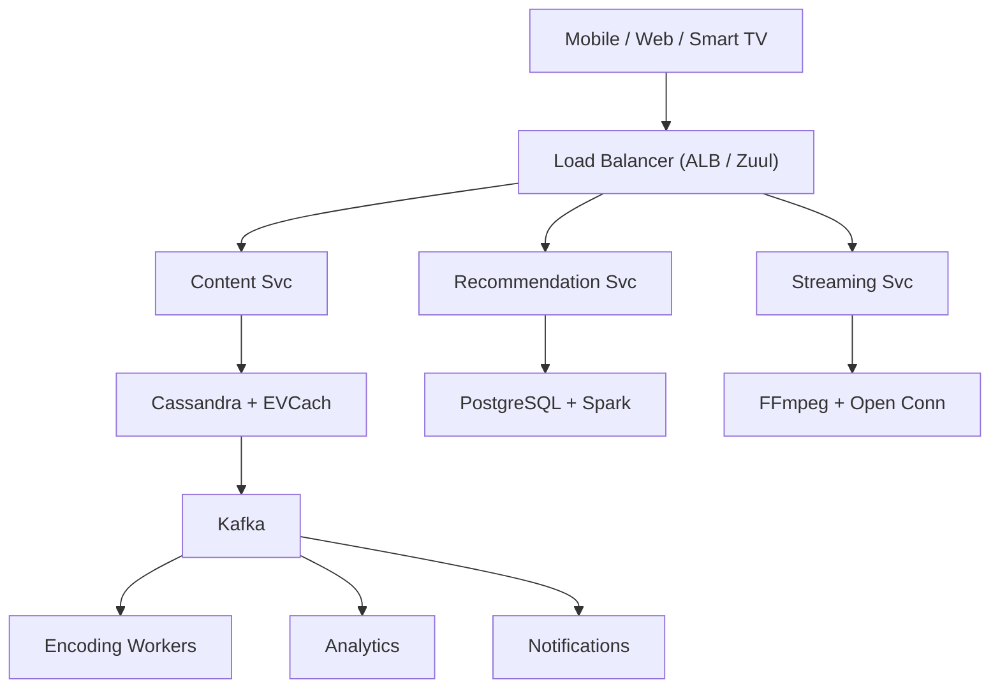

# System Design: Netflix (Video Streaming Platform)

## Overview

Netflix is the world's leading subscription-based video streaming platform with 260M+ subscribers across 190+ countries. The system must deliver personalized content recommendations, support multiple concurrent streams per household, handle massive content libraries, and maintain 99.99% availability with sub-second startup times.

### Key Numbers

- 260M+ subscribers globally
- 100K+ titles in content library
- 1 billion+ hours streamed per month
- 1000+ Open Connect CDN appliances in ISPs
- Supports 2000+ device types

---

## Requirements

### Functional Requirements

- Stream video with ABR based on network
- Browse/search with personalized recs
- Download for offline viewing
- Manage profiles with watch history
- Multi-device playback with resume

### Non-Functional Requirements

- Latency: Video start < 2s, seek < 500ms
- Throughput: 250M+ subscribers
- Availability: 99.99% uptime
- Consistency: Eventually consistent recs
- Scale: 15% of global bandwidth

---

---

---

## High-Level Architecture

### Architecture Diagram



### Data Flow

1. Client sends request to API Gateway
2. Content Service fetches catalog from Cassandra (cached in EVCache)
3. Recommendation Service runs ML model, returns personalized rows
4. User clicks Play - Streaming Service generates DRM license + manifest
5. Open Connect CDN serves video segments (ABR adaptive quality)
6. Kafka events: play, pause, seek - Analytics pipeline (Flink to S3)
7. Encoding Workers transcode new uploads into per-title bitrate ladders

## Microservices

### 1. Auth & Identity Service

- **Responsibility**: User authentication, JWT tokens, household management, device registration, DRM license proxy
- **Tech**: Go / Node.js
- **DB**: PostgreSQL (accounts, household), Redis (sessions)
- **External**: OAuth (Facebook, Google, Apple)

### 2. Content Discovery Service

- **Responsibility**: Content browsing, search results, category pages, "Continue Watching", "Top 10", personalized rows
- **Tech**: Java / Spring Boot
- **DB**: Cassandra (denormalized content views per user)
- **Cache**: EVCache (Netflix's custom memcached)

### 3. Content Metadata Service

- **Responsibility**: Title metadata, cast/crew, ratings, genres, synopsis, artwork assets, content relationships (sequels, related)
- **Tech**: Java / Spring Boot
- **DB**: Cassandra (content catalog, multi-model)
- **Search**: Elasticsearch (metadata indexing)

### 4. User Profile Service

- **Responsibility**: Profile management (up to 5 per household), viewing preferences, language settings, maturity levels, My List
- **Tech**: Go
- **DB**: Cassandra (profile data), Redis (active profile cache)

### 5. Playback Service

- **Responsibility**: Stream URL generation, DRM license issuance, quality adaptation (ABR), buffering optimization, offline download tokens
- **Tech**: Go / C++
- **CDN**: Open Connect (Netflix's custom CDN)
- **Cache**: Redis (stream manifests)

### 6. Recommendation Service

- **Responsibility**: Personalized row ordering, "Because you watched..." suggestions, trending content, "Top 10" per country, new release suggestions
- **Tech**: Python (ML inference), TensorFlow/PyTorch
- **DB**: PostgreSQL (model features), Redis (cached recommendations)
- **Pipeline**: Spark (batch training), real-time inference

### 7. Billing Service

- **Responsibility**: Subscription management, payment processing, gift cards, plan changes, invoicing, tax calculation
- **Tech**: Java / Spring Boot
- **DB**: PostgreSQL (ACID for financial data)
- **Integrations**: Stripe, PayPal, in-app purchases

### 8. Analytics & Events Service

- **Responsibility**: Viewing events collection, quality of experience (QoE) metrics, A/B test analysis, content performance, revenue analytics
- **Tech**: Flink (streaming) + Spark (batch)
- **DB**: S3 (data lake), Presto/Trino (interactive queries), ClickHouse (dashboards)
- **Pipeline**: Kafka -> Flink -> S3/Hive

### 9. Notification Service

- **Responsibility**: New content alerts, download completion, payment reminders, personalized recommendations via email/push
- **Tech**: Node.js
- **Channels**: FCM/APNs (push), SendGrid (email), Twilio (SMS)
- **Queue**: Kafka consumer

### 10. A/B Testing Platform

- **Responsibility**: Experiment assignment, feature flag management, statistical analysis, experiment lifecycle management
- **Tech**: Go (assignment engine), Python (analysis)
- **DB**: PostgreSQL (experiment configs), Redis (assignment cache)

### 11. Encoding Pipeline Service

- **Responsibility**: Per-title encoding, adaptive bitrate ladder generation, AV1/H.265/VP9 encoding, thumbnail extraction, trailer generation
- **Tech**: FFmpeg (custom build), distributed workers
- **Queue**: Kafka (encoding jobs)
- **Storage**: S3 (encoded segments)

### 12. Device & Platform Service

- **Responsibility**: Device registration, capability detection, codec support, UI rendering rules per device, platform-specific features
- **Tech**: Go
- **DB**: PostgreSQL (device registry), Redis (capability cache)

---

## Database Design

### PostgreSQL (Accounts & Billing)

```sql
-- Accounts (Household-level)
CREATE TABLE accounts (
    account_id      UUID PRIMARY KEY DEFAULT gen_random_uuid(),
    email           VARCHAR(255) UNIQUE NOT NULL,
    password_hash   VARCHAR(255) NOT NULL,
    plan_id         UUID REFERENCES plans(plan_id),
    country         VARCHAR(3),
    currency        VARCHAR(3),
    status          VARCHAR(20) DEFAULT 'active',
    household_size  INT DEFAULT 1,
    max_profiles    INT DEFAULT 5,
    created_at      TIMESTAMP DEFAULT NOW(),
    updated_at      TIMESTAMP DEFAULT NOW()
);

-- Plans
CREATE TABLE plans (
    plan_id             UUID PRIMARY KEY DEFAULT gen_random_uuid(),
    name                VARCHAR(50) NOT NULL, -- Mobile, Basic, Standard, Premium
    price_monthly       DECIMAL(10,2) NOT NULL,
    price_yearly        DECIMAL(10,2),
    max_streams         INT NOT NULL, -- 1, 2, 4
    max_resolution      VARCHAR(10), -- 720p, 1080p, 4K
    max_downloads       INT, -- number of devices for offline
    simultaneous_devices INT NOT NULL,
    is_active           BOOLEAN DEFAULT TRUE
);

-- Payments
CREATE TABLE payments (
    payment_id      UUID PRIMARY KEY DEFAULT gen_random_uuid(),
    account_id      UUID REFERENCES accounts(account_id),
    amount          DECIMAL(10,2) NOT NULL,
    currency        VARCHAR(3) NOT NULL,
    method          VARCHAR(50),
    gateway         VARCHAR(50),
    gateway_txn_id  VARCHAR(255),
    status          VARCHAR(20),
    billing_period  VARCHAR(20), -- monthly, yearly
    created_at      TIMESTAMP DEFAULT NOW()
);
```

### Cassandra (Content Catalog & User Data)

```cql
-- Content Catalog (multi-model, read-heavy)
CREATE TABLE content_catalog (
    content_id      UUID,
    title           TEXT,
    content_type    TEXT, -- movie, series, episode, documentary
    genres          SET<TEXT>,
    languages       SET<TEXT>,
    rating          TEXT, -- PG, PG-13, R
    maturity_rating INT,
    duration_min    INT,
    release_year    INT,
    synopsis        TEXT,
    cast_list       LIST<TEXT>,
    director        TEXT,
    artwork_urls    MAP<TEXT, TEXT>, -- {"poster": "url", "backdrop": "url", "thumb": "url"}
    is_premium      BOOLEAN,
    countries_available SET<TEXT>,
    PRIMARY KEY (content_id)
);

-- Viewing History (per profile, time-series)
CREATE TABLE viewing_history (
    profile_id      UUID,
    watched_at      TIMESTAMP,
    content_id      UUID,
    episode_id      UUID,     -- null for movies
    progress_pct    INT,      -- 0-100
    duration_watched INT,     -- seconds
    device_type     TEXT,
    completed       BOOLEAN,
    PRIMARY KEY ((profile_id), watched_at, content_id)
) WITH CLUSTERING ORDER BY (watched_at DESC);

-- Continue Watching (latest state per content per profile)
CREATE TABLE continue_watching (
    profile_id      UUID,
    content_id      UUID,
    episode_id      UUID,
    progress_seconds INT,
    total_duration  INT,
    updated_at      TIMESTAMP,
    PRIMARY KEY ((profile_id), updated_at, content_id)
) WITH CLUSTERING ORDER BY (updated_at DESC);

-- My List (user's saved content)
CREATE TABLE my_list (
    profile_id      UUID,
    added_at        TIMESTAMP,
    content_id      UUID,
    PRIMARY KEY ((profile_id), added_at, content_id)
) WITH CLUSTERING ORDER BY (added_at DESC);
```

### MongoDB (Analytics Events)

```text
// Viewing Event (write-heavy, append-only)
{
  event_id: ObjectId,
  account_id: "uuid",
  profile_id: "uuid",
  content_id: "uuid",
  event_type: "play", // play, pause, resume, seek, complete, abandon
  timestamp: ISODate(),
  position_seconds: 1234,
  total_duration: 7200,
  device_type: "smart_tv",
  device_model: "Samsung QN90",
  app_version: "8.12.0",
  stream_quality: {
    bitrate: 5000,
    resolution: "1920x1080",
    codec: "h265",
    bandwidth_actual: 6200
  },
  buffering_events: [
    { at_second: 342, duration_ms: 1200 },
    { at_second: 1205, duration_ms: 800 }
  ],
  ab_test_assignments: {
    "ui_layout_v2": "control",
    "autoplay_next": "variant_a"
  },
  geo: {
    country: "US",
    region: "California",
    isp: "Comcast"
  }
}

```

### Redis / EVCache

```
# Session store
SETEX session:{account_id}:{device_id} 86400 {jwt_token}

# Content metadata cache (hot content)
SETEX content:{content_id} 3600 {json_metadata}

# User recommendations (per profile)
SETEX recommendations:{profile_id} 1800 {json_array}

# Active stream state (for multi-device enforcement)
HSET stream:{account_id} {device_id} {stream_id}
EXPIRE stream:{account_id} 7200

# Rate limiting
ZADD ratelimit:{account_id} {timestamp} {request_id}

# A/B test assignment cache
SETEX abtest:{account_id}:{experiment_id} 604800 {variant}
```

### S3 (Data Lake / Object Storage)

```
s3://netflix-data-lake/
  raw/viewing_events/          # Kafka -> S3 (Parquet)
  processed/                   # ETL output
  ml/training_data/            # ML feature stores
  ml/models/                   # Trained model artifacts
  content/encoded/             # Transcoded video segments
  content/thumbnails/          # Extracted thumbnails
  content/trailers/            # Pre-rendered trailers
```

---

## Scaling Tiers

### Tier 1: 1K - 10K Users (MVP / Prototype)

**Goal**: Validate core streaming, basic recommendations, single-region

| Component | Choice | Why |
| ----------- | -------- | ----- |
| **Compute** | 4-6 EC2 instances (c5.xlarge) | Streaming + API servers |
| **Database** | PostgreSQL RDS (db.r5.large) | All data in one DB |
| **Cache** | Redis ElastiCache (cache.t3.medium) | Session + metadata |
| **CDN** | CloudFront | Basic content delivery |
| **Storage** | S3 (Standard) | Content + thumbnails |
| **Transcoding** | FFmpeg on EC2 (g4dn.xlarge) | Basic encoding pipeline |
| **Search** | PostgreSQL FTS (full-text search) | Simple search |
| **Queue** | Redis Streams | Basic event queue |
| **Analytics** | PostgreSQL (materialized views) | Basic dashboards |
| **ML** | Simple collaborative filtering | Basic recommendations |
| **Monitoring** | CloudWatch + Grafana | Uptime tracking |
| **CI/CD** | GitHub Actions | Simple deploys |

**Architecture**: Modular monolith. Single PostgreSQL. Simple encoding pipeline.
**Cost**: ~$500-1K/month

---

### Tier 2: 10K - 1M Users (Growth Phase)

**Goal**: Multi-device support, personalized recommendations, quality streaming

| Component | Choice | Why |
| ----------- | -------- | ----- |
| **Compute** | ECS/EKS (50-200 containers) | Auto-scaling microservices |
| **Database** | PostgreSQL RDS (r5.4xlarge, 3 read replicas) | Read-heavy workloads |
| **NoSQL** | Cassandra (6-node cluster) | Content catalog + viewing history |
| **Cache** | Redis Cluster (12 nodes) + EVCache | High-throughput caching |
| **CDN** | CloudFront + Akamai | Multi-CDN for redundancy |
| **Search** | Elasticsearch (6-node cluster) | Full-text search + autocomplete |
| **Transcoding** | AWS Elemental MediaConvert + custom GPU fleet | Parallel encoding |
| **Queue** | Kafka (6 brokers) | Event streaming backbone |
| **Analytics** | ClickHouse + S3 (data lake) | Real-time + batch analytics |
| **ML Pipeline** | SageMaker (recommendations) | Personalized content |
| **A/B Testing** | Custom platform | Feature experimentation |
| **Monitoring** | Prometheus + Grafana + Jaeger | Full observability |
| **Service Mesh** | Linkerd | mTLS + traffic management |
| **CI/CD** | GitHub Actions + ArgoCD | GitOps deployments |

**Architecture**: 10-12 microservices. Event-driven with Kafka. Cassandra for read-heavy workloads. ML-powered recommendations.
**Cost**: ~$10K-50K/month

---

### Tier 3: 1M - 10M+ Users (Global Scale)

**Goal**: 260M+ subscribers, 1000+ CDN nodes, 99.99% uptime, personalized everything

| Component | Choice | Why |
| ----------- | -------- | ----- |
| **Compute** | Multi-region K8s (1000+ pods per region) | Global auto-scaling |
| **Database** | PostgreSQL (Vitess sharding) + Aurora Global | Global consistency |
| **NoSQL** | Cassandra (50+ nodes, multi-DC) | Petabyte-scale catalog |
| **Cache** | EVCache (Netflix custom, 100+ nodes) + Redis | Sub-ms latency globally |
| **CDN** | Open Connect (1000+ appliances in ISPs) + multi-CDN | ISP-level delivery |
| **Search** | Elasticsearch Cross-Cluster (30+ nodes) | Global search |
| **Transcoding** | Per-title encoding farm (200+ GPU instances) | Optimize per title |
| **Queue** | Kafka (30+ brokers, multi-DC) | Cross-region events |
| **Analytics** | Flink + Presto/Trino + S3 Data Lake | Petabyte analytics |
| **ML Platform** | Custom (real-time inference, 100ms latency) | Personalized everything |
| **A/B Testing** | Global experimentation platform (1000+ concurrent tests) | Data-driven decisions |
| **Service Mesh** | Istio (multi-cluster) | mTLS + traffic management |
| **Observability** | OpenTelemetry + custom (Atlas) | Full stack visibility |
| **Feature Flags** | Custom platform | Gradual rollouts |
| **Chaos Engineering** | Chaos Monkey + Conductor | Resilience testing |
| **Traffic Management** | Zuul + Ribbon + Eureka | Client-side load balancing |

**Architecture**: Globally distributed. Active-active multi-region. Open Connect CDN in ISPs. ML-driven everything. Chaos engineering for resilience.
**Cost**: ~$1M-3M+/month (Netflix spends ~$1B/year on AWS + CDN)

---

## Key Design Decisions

### 1. Why Cassandra for Content Catalog?

- Multi-datacenter replication (global availability)
- Tunable consistency (eventual for catalog, strong for viewing history)
- Linear scalability (260M+ users, billions of viewing events)
- Denormalized data model (pre-computed views for fast reads)

### 2. Why Open Connect CDN (Custom)?

- Netflix serves 15%+ of global internet bandwidth
- Appliances placed directly in ISP networks (reduce transit cost)
- Custom encoding per-title (optimize bitrate for each piece of content)
- Direct ISP relationships for peering agreements

### 3. Why Per-Title Encoding?

- Traditional encoding: fixed bitrate ladder for all content
- Per-title: analyze each title's complexity, assign optimal bitrate
- Result: 20-30% bandwidth savings with same quality
- Each title gets its own optimal encoding ladder

### 4. Why Zuul + Ribbon + Eureka?

- Client-side load balancing (Ribbon) avoids extra network hop
- Eureka for service discovery (dynamic scaling)
- Zuul for routing, monitoring, security
- All Netflix OSS (battle-tested at scale)

### 5. Why EVCache over Redis?

- EVCache is Netflix's custom distributed cache (built on memcached)
- Optimized for Netflix's access patterns
- Multi-region replication
- Better performance at Netflix's scale (100K+ ops/sec per node)

---

## Failure Modes & Recovery

| Failure | Impact | Recovery |
| --------- | -------- | ---------- |
| Open Connect CDN fails | Regional streaming degradation | Multi-CDN fallback, manifest redirect |
| EVCache split | Watch history out of sync | CRDT conflict resolution |
| Zuul overload | All API requests fail | Circuit breaker, bulkhead isolation |
| Transcoding stuck | New content delayed | Dead letter queue, retry with backoff |
| Recommendation drift | Irrelevant suggestions | A/B testing, auto rollback |
| Payment delay | Charged but no access | Idempotency, grace period |

---

## Cost Estimation (1M Users)

| Component | Specification | Monthly Cost |
| ----------- | -------------- | ------------- |
| Open Connect CDN | 200TB/month transfer | $30,000 |
| Transcoding Farm | 50x c5.4xlarge | $12,000 |
| EVCache Cluster | 12x cache.r5.xlarge | $9,600 |
| Zuul Gateway | 10x m5.xlarge | $2,800 |
| PostgreSQL | db.r5.2xlarge + 5 replicas | $8,000 |
| Kafka Cluster | 12x kafka.m5.large | $4,800 |
| S3 Storage | 500TB | $11,500 |
| API Servers | 30x c5.xlarge | $4,200 |
| Chaos Monkey | Netflix OSS | $0 |
| **Total** | | **~$82,900/month** |

---

## Trade-off Analysis

| Approach A | Approach B | Winner | Reason |
| ----------- | ----------- | -------- | -------- |
| Cassandra | MongoDB | Cassandra | Multi-master, 99.99% availability, linear scalability |
| EVCache | Redis | EVCache | Custom Memcached fork, 99.99% hit rate at Netflix scale |
| Open Connect | CloudFront | Open Connect | Embedded in ISPs, 10x better than third-party CDN |
| SageMaker | Custom ML | SageMaker | Managed service, faster experimentation |
| Kafka | Kinesis | Kafka | Better ecosystem, exactly-once semantics |

---

## Key Metrics to Monitor

| Metric | Target |
| -------- | -------- |
| Stream startup time (TTFS) | < 2 seconds |
| Rebuffer ratio | < 0.1% |
| Stream completion rate | > 85% |
| CDN cache hit ratio | > 99% |
| API response time (p99) | < 100ms |
| Recommendation click-through | > 15% |
| Encoding queue depth | < 50 pending |
| Error rate | < 0.01% |
| Availability | 99.99% |
| Concurrent stream capacity | 260M+ |

---

## Deep Dive Prompts

- How does Netflix's Open Connect CDN achieve 99.99% availability?
- How does per-title encoding save 20-30% bandwidth without quality loss?
- How does Chaos Monkey ensure resilience without affecting user experience?
- How do you handle 700B+ events/day for real-time recommendations?

---

## Key Techniques & Patterns

| Technique | Description | Used In |
| ----------- | ------------- | ---------- |
| Content-Based Filtering | Applied in this system | Architecture + LLD |
| CDN with Origin Shield | Applied in this system | Architecture + LLD |
| Kafka for Event Processing | Applied in this system | Architecture + LLD |
| Redis Cache for Recommendations | Applied in this system | Architecture + LLD |
| Microservices with Service Mesh | Applied in this system | Architecture + LLD |
| CQRS for Read/Write Separation | Applied in this system | Architecture + LLD |

## Common Interview Follow-ups

**Q: How does Netflix achieve 99.99% uptime?**
A: Netflix OSS (Zuul, Eureka, Ribbon, Hystrix), Chaos Monkey, circuit breakers

**Q: How does per-title encoding save 20% bandwidth?**
A: Unique encoding ladder per title based on complexity, AB comparison testing

**Q: How does recommendation handle cold start?**
A: Collaborative filtering for existing, content-based for new, A/B testing

---

## Low-Level Design (LLD) - Algorithms & Data Structures

### 1. Per-Title Encoding Algorithm

```text
class ContentBasedFilter {
  // Recommend content based on user viewing history
  // Time Complexity: O(N * M) where N = genres, M = titles
  constructor(userProfile, contentCatalog) {
    this.profile = userProfile;      // {genre: weight, ...}
    this.catalog = contentCatalog;   // [{id, genres, rating}, ...]
  }

  recommend(topK = 10) {
    const scored = this.catalog.map(item => {
      let score = 0;
      for (const genre of item.genres) {
        score += (this.profile[genre] || 0) * item.rating;
      }
      return { ...item, score };
    });
    
    return scored
      .sort((a, b) => b.score - a.score)
      .slice(0, topK);
  }
}
```

### 2. Recommendation Algorithm (Collaborative Filtering)

```text
function get_recommendations(user_id, top_n=10) {
    // Netflix-style collaborative filtering:
    // 1. Find similar users (user-based CF)
    // 2. Get what they watched that target user hasn't
    // 3. Rank by predicted rating
    // // Step 1: Get user's watch history
    // // Step 4: Predict ratings using weighted average
    // // Step 5: Return top N

```

### 3. ABR Algorithm (Netflix-Specific)

```text
function netflixABR(bandwidthEstimates, bufferLevel, deviceType) {
  // Netflix ABR: Bandwidth-based + buffer-based hybrid
  
  // Weighted bandwidth estimation
  const weightedBW = bandwidthEstimates.slice(-5).reduce((sum, bw, i) => {
    return sum + bw * (i + 1) / 15;  // Recent samples weighted higher
  }, 0);
  
  // Buffer-based adjustment
  if (bufferLevel < 10) return '360p';
  if (bufferLevel < 20) return '480p';
  if (bufferLevel < 30) return '720p';
  
  // Bandwidth-based selection
  const bitrateMap = {
    'mobile': {1000: '480p', 2500: '720p', 5000: '1080p'},
    'tv': {2500: '720p', 5000: '1080p', 8000: '4K'},
    'web': {1500: '480p', 3000: '720p', 6000: '1080p'}
  };
  
  const map = bitrateMap[deviceType] || bitrateMap['web'];
  for (const [threshold, quality] of Object.entries(map).sort((a, b) => b[0] - a[0])) {
    if (weightedBW >= parseInt(threshold)) return quality;
  }
  return '360p';
}

const svc = new ContentService(); console.log("Content Service initialized");
```

### 4. Content Popularity Scoring (Trending)

```text
function calculate_trending_score(content_id, window_hours=24) {
        // completion_rate * 0.3 +
        // recency * 0.1

```

### 5. Session Affinity (Sticky Sessions)

```text
function get_server_for_user(user_id) {
    // - On server failure, remap to next server

```

### Content Delivery Flow

```
User clicks "Play"
    |
    v
Playback Service
    |
    | 1. Check DRM license
    | 2. Get stream manifest (HLS/DASH)
    | 3. Select optimal CDN node
    v
Open Connect CDN (nearest to user)
    |
    | Serve video segments (2-10 second chunks)
    v
Client Player (ABR logic)
    |
    | Adjust quality based on bandwidth
    | Buffer 30-60 seconds ahead
    v
Play video to user
```

---

### Real-World Insights & Best Practices (2024-2025)

### Netflix's Actual Architecture (Based on Engineering Blog)

**Migration from Monolith to Microservices**:

- Started as monolith on own data centers
- Migrated to AWS + microservices after 2008 major outage
- Reasons: difficult to find bugs, vertical scaling limits, single points of failure
- Now runs 1000+ microservices on AWS

**Circuit Breaker Pattern (Hystrix)**:

- Netflix created Hystrix for circuit breaker pattern
- Prevents cascading failures when one microservice fails
- Fault injection testing (Chaos Monkey) verifies circuit breaker works
- Fallback to static page when service is down
- Exponential backoff prevents thundering herd

**Stateless vs Stateful Services**:

- Stateless services: replicated + autoscaled (failure not notable)
- Stateful services: replicated writes across data centers, route reads locally
- Hybrid services (cache): partition with consistent hashing, request-level caching, fallback to DB

**Chaos Engineering**:

- Chaos Monkey: randomly kills instances in production
- Simian Army: suite of chaos tools
- Tests autoscaling, circuit breakers, and resilience
- Netflix spends significant engineering on failure testing

**Polyglot Architecture**:

- Different services use different languages (Java, Python, Go, Node.js)
- Cost: extra operational complexity, learning curve
- Benefit: best tool for each job
- Netflix limits centralized support to critical services

### Netflix's Current Tech Stack (2024-2025)

| Component | Technology |
| ----------- | ----------- |
| API Gateway | Zuul (Netflix OSS) |
| Service Discovery | Eureka (Netflix OSS) |
| Load Balancing | Ribbon (client-side, Netflix OSS) |
| Circuit Breaker | Hystrix (Netflix OSS, now Resilience4j) |
| Caching | EVCache (custom, built on memcached) |
| CDN | Open Connect (custom, 1000+ appliances) |
| Database | Cassandra, MySQL, PostgreSQL |
| Cache | Redis, EVCache (30M+ req/sec) |
| Queue | Kafka |
| ML | Custom (TensorFlow, PyTorch) |
| Cloud | AWS (primary), multi-cloud CDN |
| Monitoring | Atlas (custom metrics) |
| CI/CD | Spinnaker (Netflix OSS) |
| Containers | Titus (Netflix OSS, on AWS) |

### Netflix OSS Projects (Battle-Tested at Scale)

1. **Zuul**: API gateway with dynamic routing, monitoring, security
2. **Eureka**: Service discovery for REST-based services
3. **Ribbon**: Client-side load balancing with IRUL rules
4. **Hystrix**: Circuit breaker with fallback and latency tracking
5. **EVCache**: Distributed caching (memcached-based)
6. **Titus**: Container management platform (on AWS)
7. **Spinnaker**: Multi-cloud continuous delivery platform
8. **Conductor**: Workflow orchestration engine
9. **Chaos Monkey**: Random instance termination for resilience

### Key Lessons from Netflix's Evolution

1. **Start Simple**: Netflix started with 3 servers and a monolith
2. **Migrate Incrementally**: Moved to microservices one piece at a time
3. **Automate Everything**: CI/CD, testing, deployment, monitoring
4. **Embrace Failure**: Chaos engineering makes systems more reliable
5. **Invest in Tooling**: Netflix built and open-sourced their own tools
6. **Data-Driven Decisions**: A/B testing at massive scale (1000+ concurrent experiments)
7. **Domain-Driven Design**: Moving from microservice-first to domain-driven (2024-2025 trend)

---

---
