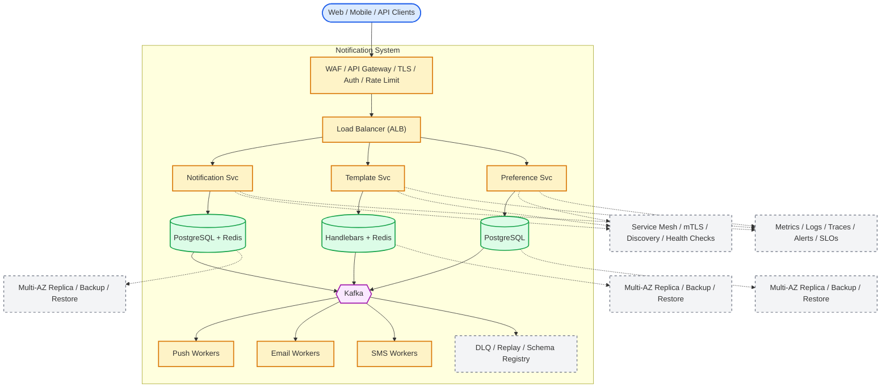

# System Design: Notification System

## Overview

A multi-channel notification system supporting push, email, SMS, and in-app notifications for millions of users.

### Key Numbers

- 10B+ notifications per day
- 1M+ notifications per second at peak
- 95%+ delivery rate

---

## Requirements

### Functional Requirements

- Send push notifications (iOS/Android)
- Send SMS via carrier
- Send email with templates
- Notification preferences
- Schedule optimal delivery

### Non-Functional Requirements

- Latency: Push < 1s, SMS < 10s
- Throughput: 10M+ notifications/day
- Availability: 99.99% uptime
- Consistency: At-least-once delivery
- Scale: 500M+ registered devices

---

---

---

## High-Level Architecture

### Architecture Diagram



*Solid = data flow, dashed = control plane / monitoring.*

### Data Flow

1. Service publishes event to Kafka notification topic
2. Notification Service consumes event, checks user preferences
3. Template Service renders notification content (per channel)
4. Priority routing: critical -> immediate, bulk -> batched
5. Push Workers: FCM/APNs, email: SendGrid, SMS: Twilio
6. Delivery tracking: sent -> delivered -> opened (read receipts)
7. Analytics: delivery rate, open rate, click-through rate

## Microservices

### 1. Notification API

- **Responsibility**: Accept notification requests, validate, enqueue
- **Tech**: Go / Node.js
- **DB**: PostgreSQL (notification templates)

### 2. Preference Service

- **Responsibility**: User notification preferences, opt-out management
- **Tech**: Go
- **DB**: PostgreSQL (preferences), Redis (cache)

### 3. Push Service

- **Responsibility**: FCM (Android), APNs (iOS), Web Push
- **Tech**: Node.js
- **External**: Firebase Cloud Messaging, Apple Push Notification Service

### 4. Email Service

- **Responsibility**: Email rendering, sending, tracking
- **Tech**: Node.js
- **External**: SendGrid, SES, Mailgun

### 5. SMS Service

- **Responsibility**: SMS sending, delivery tracking
- **Tech**: Node.js
- **External**: Twilio, Nexmo, AWS SNS

### 6. In-App Service

- **Responsibility**: Real-time in-app notifications, notification center
- **Tech**: Go
- **DB**: Cassandra (notifications), Redis (unread count)

---

## Database Design

### PostgreSQL

```sql
CREATE TABLE notifications (
    notification_id UUID PRIMARY KEY DEFAULT gen_random_uuid(),
    user_id         UUID NOT NULL,
    type            VARCHAR(50) NOT NULL,
    channel         VARCHAR(20) NOT NULL,
    title           VARCHAR(255),
    body            TEXT,
    data            JSONB,
    status          VARCHAR(20) DEFAULT 'pending',
    scheduled_at    TIMESTAMP,
    sent_at         TIMESTAMP,
    created_at      TIMESTAMP DEFAULT NOW()
);

CREATE TABLE notification_templates (
    template_id     UUID PRIMARY KEY DEFAULT gen_random_uuid(),
    name            VARCHAR(100) UNIQUE NOT NULL,
    channel         VARCHAR(20) NOT NULL,
    subject         VARCHAR(255),
    body_template   TEXT NOT NULL,
    variables       JSONB,
    created_at      TIMESTAMP DEFAULT NOW()
);

CREATE TABLE user_preferences (
    user_id         UUID PRIMARY KEY,
    push_enabled    BOOLEAN DEFAULT TRUE,
    email_enabled   BOOLEAN DEFAULT TRUE,
    sms_enabled     BOOLEAN DEFAULT FALSE,
    quiet_hours_start TIME,
    quiet_hours_end   TIME,
    updated_at      TIMESTAMP DEFAULT NOW()
);
```

### Cassandra (In-App Notifications)

```cql
CREATE TABLE in_app_notifications (
    user_id         UUID,
    notification_id UUID,
    type            TEXT,
    title           TEXT,
    body            TEXT,
    is_read         BOOLEAN DEFAULT FALSE,
    created_at      TIMESTAMP,
    PRIMARY KEY ((user_id), created_at, notification_id)
) WITH CLUSTERING ORDER BY (created_at DESC);
```

---

## Scaling Tiers

### Tier 1: 1K - 10K Users

| Component | Choice |
| ----------- | -------- |
| **Compute** | 2 EC2 (t3.large) |
| **Database** | PostgreSQL RDS |
| **Queue** | Redis Streams |
| **Push** | FCM + APNs directly |
| **Email** | SendGrid |

### Tier 2: 10K - 1M Users

| Component | Choice |
| ----------- | -------- |
| **Compute** | ECS (10-20 containers) |
| **Database** | PostgreSQL + Cassandra (3 nodes) |
| **Queue** | Kafka (3 brokers) |
| **Push** | FCM + APNs + dedicated workers |
| **Email** | SendGrid + SES |

### Tier 3: 1M - 10M+ Users

| Component | Choice |
| ----------- | -------- |
| **Compute** | Multi-region K8s (100+ pods) |
| **Database** | Cassandra (20+ nodes) + PostgreSQL (sharded) |
| **Queue** | Kafka (15+ brokers) |
| **Push** | Custom push infrastructure |
| **Email** | Multi-provider (SendGrid + SES + custom SMTP) |
| **SMS** | Multi-provider (Twilio + Nexmo) |

---

---

## Key Design Decisions

### 1. Why Multi-Channel Delivery?

- Different users prefer different channels (push, email, SMS)
- Redundancy ensures delivery even if one channel fails
- Cost optimization (push is free, SMS is expensive)

### 2. Why Exponential Backoff with Jitter?

- Prevents thundering herd on retry storms
- Jitter spreads retries across time window
- Exponential increase avoids overwhelming failing services

### 3. Why Per-User Rate Limiting?

- Prevents notification fatigue (spam)
- Different limits for different channels (SMS < push < email)
- Protects users and maintains engagement

### 4. Why Batch Low-Priority Notifications?

- Reduces API calls (email batching saves 80% of calls)
- Better user experience (hourly digest vs constant pings)
- High-priority notifications still sent immediately

## Failure Modes & Recovery
What can go wrong in production, and how the system detects and recovers:

| Failure | Impact | Recovery |
| --------- | -------- | ---------- |
| FCM/APNs delivery failure | Push not delivered | Retry with backoff, SMS fallback |
| Email provider rate limit | Batch emails delayed | Multi-provider failover, queue-based |
| SMS carrier outage | SMS fails in region | Multi-carrier fallback, priority queuing |
| Preference sync lag | User unsubscribes but still receives | Immediate local cache, eventual sync |
| Template rendering failure | Broken formatting sent | Validation before send, plain text fallback |
| Priority delayed | Critical alerts stuck behind marketing | Separate queues per priority level |

---

## Cost Estimation (1M Users)
Rough monthly cost of running this design for one million users:

| Component | Specification | Monthly Cost |
| ----------- | -------------- | ------------- |
| API Servers | 10x c5.xlarge | $1,400 |
| PostgreSQL | db.r5.xlarge + 2 replicas | $3,600 |
| Redis Cluster | 6x cache.r5.xlarge | $4,800 |
| Kafka (queues) | 6x kafka.m5.large | $2,400 |
| FCM/APNs | Push delivery fees | $500 |
| Twilio (SMS) | 1M SMS/month | $500 |
| SendGrid (Email) | 1M emails/month | $90 |
| Worker Nodes | 20x c5.xlarge | $2,800 |
| **Total** | | **~$16,090/month** |

---

## Trade-off Analysis
The alternatives considered, and which one won and why:

| Approach A | Approach B | Winner | Reason |
| ----------- | ----------- | -------- | -------- |
| FCM | WebPush | FCM | Better Android support, higher delivery rate |
| SES | SendGrid | SES | Lower cost at scale |
| Twilio | Nexmo | Twilio | Better global coverage |
| Redis priority | Database priority | Redis | Sub-ms priority operations |
| Kafka | SQS | Kafka | Higher throughput for notification events |

---

## Key Metrics to Monitor
The metrics that signal system health, with alert thresholds:

| Metric | Description | Target |
| -------- | ------------- | -------- |
| **Delivery Rate** | % of notifications successfully delivered | > 99% |
| **Delivery Latency** | Time from trigger to delivery | < 1s (push), < 30s (email) |
| **Dedup Rate** | % of duplicate notifications blocked | > 95% |
| **Rate Limit Hits** | Users hitting rate limits | < 1% |
| **Channel Error Rate** | Failures per provider (FCM/APNs/SendGrid) | < 1% |
| **Batch Efficiency** | % of notifications batched vs immediate | Monitored |
| **User Opt-out Rate** | Users disabling notifications | < 5% |
| **Template Render Time** | Time to render notification template | < 10ms |
| **Provider Failover** | Automatic switch on provider failure | < 30 seconds |
| **DLQ Depth** | Dead letter queue notifications | < 100 |

---

## Deep Dive Prompts

- How do you handle notification delivery across multiple channels?
- How do you prevent duplicate notifications?
- How do you implement exponential backoff for failed deliveries?
- How do you handle notification preferences for millions of users?

---

## Key Techniques & Patterns
The recurring techniques and patterns this design applies, mapped to where they are used:

| Technique | Description | Used In |
| ----------- | ------------- | ---------- |
| Multi-Channel Delivery (Push/SMS/Email) | Applied in this system | Architecture + LLD |
| Template Engine | Applied in this system | Architecture + LLD |
| Rate Limiting | Applied in this system | Architecture + LLD |
| Preference Management | Applied in this system | Architecture + LLD |
| Retry with Backoff | Applied in this system | Architecture + LLD |
| Delivery Tracking | Applied in this system | Architecture + LLD |

## Common Interview Follow-ups

**Q: How do you handle FCM/APNs failures?**
A: Retry with backoff, SMS fallback for critical, delivery tracking

**Q: How do you scale to 500M+ devices?**
A: Shard by user ID, separate queues per channel, priority queuing

**Q: How do you handle notification preferences?**
A: Immediate local cache, eventual sync, per-channel opt-in/out

---

## Low-Level Design (LLD) - Algorithms & Data Structures

### 1. Exponential Backoff with Jitter

```text
class NotificationRouter {
  constructor(fcmClient, apnsClient, emailClient) { this.fcm = fcmClient; this.apns = apnsClient; this.email = emailClient; }
  async send(notification) {
    const { userId, channel, title, body } = notification;
    switch (channel) {
      case 'push':
        const devices = await this.getDevices(userId);
        for (const d of devices) {
          if (d.platform === 'android') await this.fcm.send({ to: d.token, notification: { title, body } });
          else await this.apns.send({ token: d.token, alert: { title, body } });
        }
        break;
      case 'email':
        await this.email.send({ to: notification.email, subject: title, text: body });
        break;
      case 'sms':
        await this.sendSMS(userId, body);
        break;
    }
    return { sent: true, channel };
  }
  async getDevices(userId) { return [{ token: 'dummy', platform: 'android' }]; }
  async sendSMS(userId, body) { return { sent: true }; }
}
```

### 2. Notification Deduplication

```text
const hashlib = require('crypto');
const time = require('time');

class NotificationDedup {
    // Prevents duplicate notifications using idempotency keys.
    // Storage: Redis SET with TTL

```

### 3. Priority Queue for Notification Batching

```text
const heapq = require('heapq');
const { defaultdict } = require('collections');

class NotificationBatcher {
    // Batches notifications by user to reduce API calls.

```

### 4. Rate Limiter per User

```text
class UserRateLimiter {
    // Per-user notification rate limiting.
    // Prevents notification fatigue && spam.
    // Enforce per-channel notification limits.
    // Limits:
    // - Push: 50/day, 10/hour
    // - SMS: 5/day
    // - Email: 20/day

```

---

### Key Algorithms

### 1. Notification Deduplication

```text
function send_notification(notification) {
    // Prevent duplicate notifications using an idempotency key
    // - If the same notification ID is seen again, skip sending
    // - Otherwise enqueue and dispatch to the selected channel

    if (already_processed(notification.id)) {
        return "duplicate";
    }
    mark_processed(notification.id);
    dispatch(notification);
    return "sent";
}
```

### 2. Rate Limiting (Per User)

```text
function check_notification_rate(user_id, channel) {
    // Rate limit notifications per user
    // - Max 10 push notifications per hour
    // - Max 3 emails per day
    // - Max 1 SMS per day

    limit = get_limit_for(channel);
    current = count_recent_notifications(user_id, channel);
    return current < limit ? "allow" : "deny";
}
```

### 3. Quiet Hours

```text
function is_quiet_hours(user_id) {
    // Check if the recipient is in a quiet-hours window
    // Example: no push notifications between 11 PM and 7 AM local time

    local_time = get_local_time(user_id);
    return local_time >= 23 || local_time < 7;
}
```

### 4. Template Rendering

```text
function render_notification(template_name, variables) {
    // Render notification from template
    // - Supports variables and conditionals
    // - Returns JSON payload for the delivery channel

    template = load_template(template_name);
    rendered = substitute_variables(template, variables);
    return { body: rendered.body, title: rendered.title };
}
```

---
