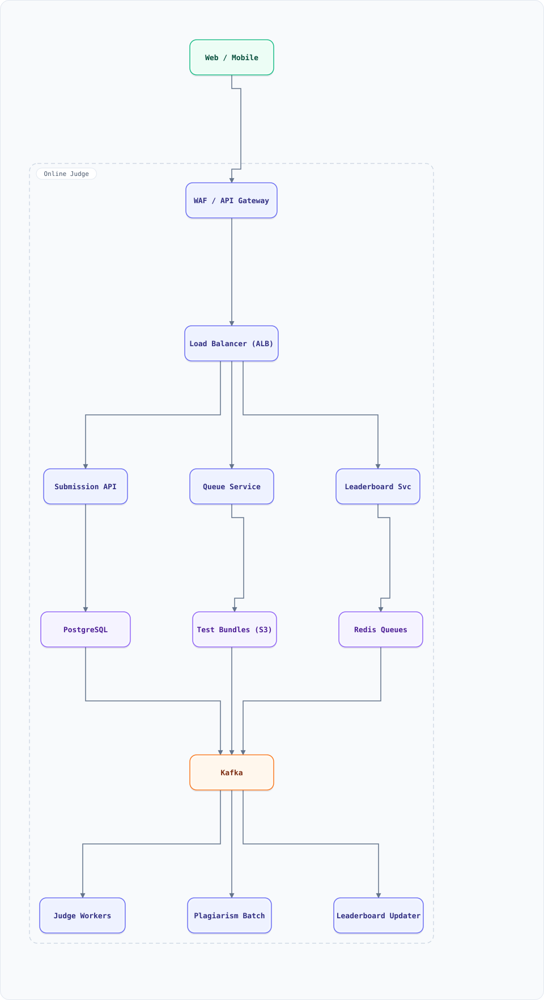

<div align="center">

# System Design: Online Judge (LeetCode-style Code Execution)

</div>

> [!TIP]
> **TL;DR** — A code-execution platform: run untrusted user code in sandboxed microVMs against hidden test cases, with queues, per-language runtimes, anti-cheat, and result streaming — a scheduling + security problem where the workload is actively adversarial.

## Overview

Users submit code; the judge compiles and runs it against test suites inside **isolated sandboxes** (seccomp, no network, resource caps), enforcing time/memory limits per test, then returns verdicts (Accepted/Wrong Answer/TLE/MLE/RE). The hard parts: adversarial code (fork bombs, crypto-mining, exfil attempts), fairness under load (contests), and fast feedback during high-stakes interviews.

### Key Numbers

| Metric | Value |
| :--- | :--- |
| **Submissions** | 50K–500K / day, 10K/s contest spikes |
| **Tests per submission** | 20–150 test cases |
| **Per-run limits** | 1–10s CPU, 128–512MB memory |
| **Languages** | 20+ runtimes |
| **Sandbox** | microVM or gVisor per run |

---

## Requirements

### Functional Requirements

- Submit code in any supported language; get verdict + runtime + memory stats
- Run against sample (public) and hidden tests; anti-cheat fingerprints
- Contest mode: leaderboard with strict ordering; submission freeze at end
- Interview mode: co-editor + live run (low latency priority)
- Plagiarism detection (MOSS-style) across submissions

### Non-Functional Requirements

| Attribute | Target |
| :--- | :--- |
| **Run latency** | < 3s P50, < 10s P99 per submission |
| **Isolation** | no network, fs read-only except workdir, seccomp profile |
| **Fairness** | one user can't starve the queue (contests) |
| **Reproducibility** | same code + tests → same verdict |

---

## High-Level Architecture

### Architecture Diagram



**Interactive diagram:** [diagrams/system-design/online-judge.architecture.html](diagrams/system-design/online-judge.architecture.html) — pan/zoom, search, dark/light theme, PNG/SVG export.


**Interactive diagram:** [diagrams/system-design/online-judge.architecture.html](diagrams/system-design/online-judge.architecture.html) — pan/zoom, search, dark/light theme, PNG/SVG export.

### Data Flow

1. Submit → API → validate + store → enqueue to **per-language queue** (compilers warm)
2. Worker picks submission → prepares sandbox: microVM boot from per-language image, workdir mounted
3. Compile stage (if needed) → run each test with limits (CPU time, wall time, memory, output size, process count)
4. Verdicts stream back per test (user sees progress); stop early on WA/RE/TLE (optimization: full suite only for AC)
5. Stats (runtime, memory peaks) recorded; **anti-cheat**: runtime fingerprints, paste-detection, randomized hidden tests
6. Results → PostgreSQL + Redis (leaderboard ZSET reuses leaderboard doc) → Kafka (analytics/plagiarism)

## Microservices

| Service | Tech Stack | Database | Pattern |
| --------- | ------------ | ---------- | ---------- |
| Submission API | Go | PostgreSQL | Validation + idempotent enqueue |
| Judge Workers | Go + Firecracker/gVisor | none (stateless) | Sandbox per run |
| Queue Service | Java | Redis Streams / Kafka | Per-language queues |
| Test Case Store | Go | S3 + PostgreSQL | Versioned test data |
| Leaderboard Svc | Go | Redis ZSET + PostgreSQL | Top-K merge (leaderboard doc) |
| Plagiarism Svc | Python | Elasticsearch | Offline batch |

---

## Database Design

### PostgreSQL

```sql
CREATE TABLE submissions (
  id UUID PRIMARY KEY, user_id BIGINT, problem_id BIGINT,
  language TEXT, code_key TEXT, status TEXT,      -- queued|compiling|running|graded
  verdict TEXT, runtime_ms INT, memory_kb INT, submitted_at TIMESTAMPTZ
);
CREATE TABLE test_results (
  submission_id UUID, test_idx INT, verdict TEXT,
  runtime_ms INT, memory_kb INT, stderr_key TEXT,  -- S3 ref, truncated
  PRIMARY KEY (submission_id, test_idx)
);
CREATE TABLE problems (
  problem_id BIGINT PRIMARY KEY, test_bundle_key TEXT, time_limit_ms INT,
  memory_limit_mb INT, checksum TEXT              -- tests versioned; checksum for fairness disputes
);
```

### Redis

```bash
queue:lang:python       -> stream of submission ids
leaderboard:contest:42  -> ZSET user -> score (reuses leaderboard patterns)
sandbox:lang:{lang}     -> warm microVM pool (per-language)
```

---

## Scaling Tiers

| Tier | Users | Infrastructure | Monthly Cost |
| ------ | ------- | -------------- | ------------- |
| 1K-10K | 10K | 2 judge workers + PostgreSQL + Redis | $400 |
| 10K-1M | 1M | 20 workers (K8s) + queue svc + S3 tests | $8,000 |
| 1M-10M+ | 10M+ | 200 workers + warm pools + contest surge capacity + ES | $60,000 |

---

## Key Techniques & Patterns

- **Sandbox isolation**: microVM/gVisor, seccomp, no network, cgroup limits — adversarial tenants
- **Per-language queues**: compile-time diversity; Python never waits behind Rust
- **Early-exit on failure**: first WA/RE stops the suite (only AC runs all 150 tests)
- **Idempotency**: submission IDs prevent double-queue on client retry
- **Warm sandbox pools**: per-language microVM pools (serverless doc's warm-worker pattern)
- **Reservoir Sampling**: sampled runtimes for problem difficulty calibration

---

## Key Design Decisions

1. **microVM per run, not per user session**: maximum isolation for actively hostile payloads
2. **Early-exit grading**: 99% of wrong answers never run the full suite → 3× capacity win
3. **Test data in S3 + checksums**: reproducibility and dispute audits; tests versioned like code
4. **Fair queueing per user**: contests don't let one user's 50 submissions starve others
5. **Anti-cheat at multiple layers**: fingerprints, randomized tests, plagiarism batch — no single defense

---

## Failure Modes & Recovery

| Failure | Impact | Mitigation |
| --------- | -------- | ----------- |
| Sandbox escape attempt | Security incident | Defense in depth: microVM + seccomp + no-net + egress audit |
| Fork bomb / resource abuse | Worker DoS | Process limits + cgroup caps; kill sandbox on breach |
| Worker dies mid-run | Stuck submission | Lease on submission; requeue after expiry; partial results discarded |
| Contest traffic spike | Long queues | Surge workers (pre-provisioned, warm); fair scheduling |
| Test bundle tampering | Verdict integrity | Immutable versioned bundles + checksums |
| Malicious output (zip bomb) | Disk fill | Output size caps; streamed truncation |

---

## Cost Estimation (1M Users)

| Component | Configuration | Monthly Cost |
| ----------- | -------------- | ------------- |
| Judge workers (30) | c7g.2xlarge | $4,500 |
| Queue + API (6) | c7g.large | $500 |
| S3 test bundles | 2TB | $50 |
| PostgreSQL (HA) | db.r7g.large | $350 |
| Redis + Kafka | m7g.large ×3 | $900 |
| **Total** | | **~$6,300** |

---

## Trade-off Analysis

| Decision | Option A | Option B | Choice | Why |
| ---------- | ---------- | ---------- | ---------- | ----- |
| Isolation | Docker + seccomp | microVM/gVisor | microVM | Users are adversaries |
| Execution | Shared interpreter | Per-run sandbox | Per-run | Reproducibility + isolation |
| Grading | Run all tests | Early-exit on failure | Early-exit | 3× throughput for free |
| Queues | Single queue | Per-language | Per-language | Compile diversity |
| Verdicts | Polling | Streamed per-test | Streamed | UX during contests |

---

## Key Metrics to Monitor

1. Queue depth per language; wait time P99
2. Run latency P50/P99 per language
3. Sandbox security events (target: investigate all)
4. Worker utilization & warm-pool hit rate
5. Early-exit rate (capacity planning signal)
6. Verdict reproducibility check failures
7. Plagiarism flag rate per contest

---

## Deep Dive Prompts

1. Design the anti-cheat system end-to-end (fingerprints, paste-detection, Plagiarism Svc).
2. How would you support GPU workloads (CUDA judge) with fair scheduling?
3. Design "interview mode": 2-user collaborative editor + live runs < 1s.
4. How do you let users define custom test cases safely?
5. Design AI-code detection for hiring platforms (and why it's ultimately statistical).

---

## Common Interview Follow-ups

1. Why microVM over Docker for the judge?
2. How do you enforce wall-clock vs CPU-time limits (sleep-cheating)?
3. How do you handle a language runtime with 30s cold start (warm pools)?
4. What if a user submits infinite-output code?
5. How do contests prevent verdict-side-channel cheating? (uniform latency injection)

---

## Low-Level Design (LLD) - Algorithms & Data Structures

### Fair Queuing + Early-Exit Grader

```text
// Fair queuing: round-robin across users so one spammer can't starve a contest
class FairQueue {
  constructor() { this.byUser = new Map(); this.order = []; this.rr = 0; }

  push(sub) {
    if (!this.byUser.has(sub.userId)) { this.byUser.set(sub.userId, []); this.order.push(sub.userId); }
    this.byUser.get(sub.userId).push(sub);
  }
  pop() {
    for (let i = 0; i < this.order.length; i++) {
      const u = this.order[(this.rr + i) % this.order.length];
      const q = this.byUser.get(u);
      if (q.length) { this.rr = (this.rr + i + 1) % this.order.length; return q.shift(); }
    }
    return null;
  }
}

// Early-exit grading: stop suite on first hard failure
function grade(tests, runFn) {
  const results = [];
  for (let i = 0; i < tests.length; i++) {
    const r = runFn(tests[i]);                       // sandboxed run with limits
    results.push({ test: i, verdict: r.verdict });
    if (r.verdict !== "AC" && r.verdict !== "WA-silent") break;  // WA stops early
  }
  const allAC = results.every(r => r.verdict === "AC");
  return { verdict: allAC ? "AC" : results.at(-1).verdict, results };
}

const q = new FairQueue();
q.push({ userId: "u1", id: "s1" }); q.push({ userId: "u1", id: "s2" });
q.push({ userId: "u2", id: "s3" });
console.log([q.pop(), q.pop(), q.pop()].map(s => s.id)); // s1, s3, s2 — u2 not starved

console.log(grade([1, 2, 3], (t) => ({ verdict: t === 2 ? "WA" : "AC" })).verdict); // WA (stopped at test 2)
```

### Submission Verdict Pipeline (the LLD behind "Accepted")

Every submission is an untrusted program. The verdict pipeline is queueing + sandboxing + deterministic comparison.

```js
const RLIMITS = { cpuMs: 2000, wallMs: 4000, memMB: 256, fsizeMB: 8, procs: 1, net: 'none' };

function judge(submission, tests, sandboxRun) {
  // sandboxRun(code, stdin, rlimits) → {stdout, exitCode, killed, usage:{cpuMs, memMB}}
  // 1. compile verdict (separate, shorter limits)
  // 2. per-test: run with stdin = test.input, capture stdout
  // 3. verdict precedence: runtime-error > time-limit-exceeded > memory-limit > wrong-answer > accepted
  for (const test of tests) {
    const r = sandboxRun(submission.code, test.input, RLIMITS);
    if (r.killed === 'wall' || r.killed === 'cpu') return 'Time Limit Exceeded';
    if (r.killed === 'mem')  return 'Memory Limit Exceeded';
    if (r.exitCode !== 0)    return 'Runtime Error';
    if (!diff(r.stdout, test.expectedOutput)) return 'Wrong Answer';   // diff = exact or token-tolerant
  }
  return 'Accepted';
}
function diff(actual, expected) {
  const norm = s => s.trim().replace(/\s+/g, ' ');   // trailing whitespace/newlines tolerated
  return norm(actual) === norm(expected);
}
console.log(diff('1 2 3\n', ' 1  2 3'));            // true — whitespace-tolerant compare
```

Production notes: sandboxing is **gVisor/Firecracker + cgroups + seccomp + rootless namespaces** (never bare Docker — kernel escape = pwned judge); TLE is detected on **CPU time**, wall clock only as a backstop (an I/O-blocked process burning wall time shouldn't fail an honest solution); tests execute in **parallel workers with per-test timeout budgets** and stop at first fatal verdict; and the queue is priority-fair per user (one user can't submit-storm the judge fleet — token bucket per account, see the rate-limiter doc).
