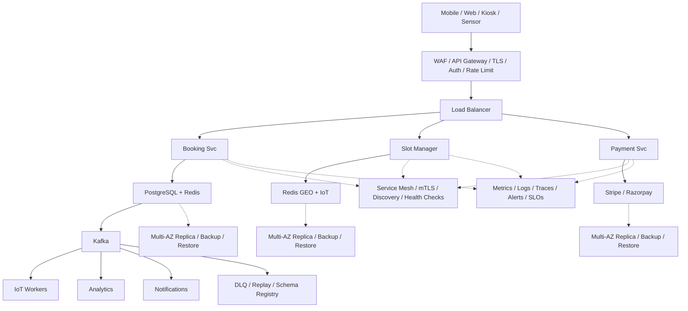

# System Design: Smart Parking System

## Overview

A smart parking management system that enables real-time parking spot discovery, reservation, guided navigation, automated entry/exit, and payment processing. The system manages parking lots across multiple cities with IoT sensors for real-time occupancy tracking.

### Key Numbers

- 50K+ parking spots across 500+ lots
- 1M+ registered users
- 100K+ daily reservations
- Real-time sensor updates every 5 seconds

---

## Requirements

### Functional Requirements

- Search spots by location
- Reserve and pay for slots
- Navigation to reserved spot
- ANPR entry/exit
- Dynamic pricing

### Non-Functional Requirements

- Latency: Search < 200ms
- Throughput: 10K searches/sec
- Availability: 99.99% uptime
- Consistency: Strong for reservations
- Scale: 50K+ spots, 1M+ users

---

## High-Level Architecture

### Architecture Diagram



### Data Flow

1. User searches for nearby parking - Proximity Service returns slots
2. Slot Manager holds slot temporarily (Redis TTL = 10 min)
3. User confirms booking - Payment Service processes transaction
4. IoT sensors detect vehicle entry/exit - update slot status
5. Kafka events: slot_status, entry, exit - Analytics dashboard
6. Auto-release: TTL expires without payment, slot returns to pool
7. Notifications: booking confirmation, reminders, receipt

## Microservices

| Service | Responsibility | Tech Stack | Database |
| --------- | --------------- | ------------ | ---------- |
| Reservation Service | Book/cancel/extend slots | Node.js, Express | PostgreSQL |
| Slot Management | Real-time slot map, availability | Go, Redis GEO | Redis + PostGIS |
| IoT Gateway | Sensor ingestion, MQTT broker | EMQX, Kafka Connect | TimescaleDB |
| Payment Service | Process payments, refunds | Node.js, Stripe SDK | PostgreSQL |
| Navigation Service | Route to spot, indoor navigation | Python, Google Maps API | Redis GEO |
| Geofence Service | Entry/exit detection, ANPR | Python, OpenCV | PostgreSQL + PostGIS |
| Dynamic Pricing | Surge pricing, demand forecasting | Python, scikit-learn | Redis + PostgreSQL |
| Notification Service | Push/SMS/email alerts | Node.js, FCM/SNS | Redis |
| Analytics Service | Occupancy prediction, reporting | Python, TimescaleDB | TimescaleDB |
| Admin Service | Lot management, pricing config | React, Node.js | PostgreSQL |

---

## Database Design

### PostgreSQL (Reservation + Lot Data)

```sql
CREATE TABLE parking_lots (
  id BIGSERIAL PRIMARY KEY,
  name VARCHAR(255) NOT NULL,
  address TEXT,
  location GEOGRAPHY(POINT, 4326),
  total_spots INT NOT NULL,
  hourly_rate DECIMAL(10,2),
  operating_hours JSONB,
  created_at TIMESTAMP DEFAULT NOW()
);

CREATE TABLE parking_spots (
  id BIGSERIAL PRIMARY KEY,
  lot_id BIGINT REFERENCES parking_lots(id),
  spot_number VARCHAR(10) NOT NULL,
  floor INT,
  zone CHAR(1),
  spot_type VARCHAR(20),
  status VARCHAR(20) DEFAULT 'available',
  sensor_id VARCHAR(50),
  location GEOGRAPHY(POINT, 4326),
  UNIQUE(lot_id, spot_number)
);
CREATE INDEX idx_spot_location ON parking_spots USING GIST(location);
CREATE INDEX idx_spot_status ON parking_spots(lot_id, status);

CREATE TABLE reservations (
  id BIGSERIAL PRIMARY KEY,
  user_id BIGINT REFERENCES users(id),
  spot_id BIGINT REFERENCES parking_spots(id),
  lot_id BIGINT REFERENCES parking_lots(id),
  status VARCHAR(20) DEFAULT 'active',
  start_time TIMESTAMP NOT NULL,
  end_time TIMESTAMP,
  actual_exit_time TIMESTAMP,
  amount_due DECIMAL(10,2),
  payment_id BIGINT,
  plate_number VARCHAR(20),
  version INT DEFAULT 0,
  created_at TIMESTAMP DEFAULT NOW()
);
CREATE INDEX idx_res_user ON reservations(user_id, status);
CREATE INDEX idx_res_spot ON reservations(spot_id, status);

CREATE TABLE payments (
  id BIGSERIAL PRIMARY KEY,
  reservation_id BIGINT REFERENCES reservations(id),
  user_id BIGINT REFERENCES users(id),
  amount DECIMAL(10,2) NOT NULL,
  currency VARCHAR(3) DEFAULT 'USD',
  status VARCHAR(20) DEFAULT 'pending',
  payment_method VARCHAR(50),
  idempotency_key VARCHAR(64) UNIQUE,
  created_at TIMESTAMP DEFAULT NOW()
);
```

### Redis (Real-time Slot Map)

```
GEOADD parking:spots:lot:101 73.8567 19.0760 "spot-A12"
GEORADIUS parking:spots:lot:101 73.857 19.076 2 km WITHCOORD COUNT 10 ASC
HSET parking:slot:101:A12 status occupied timestamp 1693555200
SET pricing:lot:101:peak 1.5 EX 300
```

---

## Scaling Tiers

### 1K - 10K Users

- 1 API server + 1 PostgreSQL + 1 Redis
- Single MQTT broker for sensor data
- Estimated cost: ~$500/month

### 10K - 1M Users

- 5-10 API servers behind ALB
- PostgreSQL primary + 2 read replicas, partitioned by lot_id
- Redis Cluster (3 nodes) for slot map
- Kafka (3 brokers) for sensor events
- 5-10 IoT gateways per region
- Estimated cost: ~$15,000/month

### 1M - 10M+ Users

- 50+ API servers across regions
- PostgreSQL sharded by region
- Redis Cluster per region with GEO
- Kafka (12+ brokers) with partitioning by lot_id
- Edge computing for ANPR processing
- Multi-region IoT gateways with local MQTT brokers
- CDN for static assets + map tiles
- Estimated cost: ~$150,000/month

---

## Key Design Decisions

| Decision | Choice | Why |
| ---------- | -------- | ----- |
| Slot availability | Redis GEO | Sub-millisecond geospatial queries for nearest-spot search |
| Sensor protocol | MQTT over TCP | Lightweight pub/sub ideal for low-power IoT sensors |
| Reservation concurrency | Optimistic locking | Prevents double-booking without distributed locks |
| Payment calculation | Event-driven via Kafka | Decouples sensor detection from billing |
| Dynamic pricing | ML + Redis cache | Demand forecasting with fast cache lookup |
| Entry/exit detection | ANPR + sensor fusion | Camera for plate recognition, magnetic as backup |

---

## Failure Modes & Recovery

| Failure | Impact | Recovery |
| --------- | -------- | ---------- |
| IoT sensor offline | Stale spot status | Fallback to last-known + admin alert |
| Kafka broker down | Delayed sensor events | Replication factor 3 + consumer retry |
| PostgreSQL down | Reservations fail | Auto-failover via Patroni |
| Redis cluster split | Slot map inconsistency | Sentinel auto-failover + rebuild from PG |
| ANPR misreads plate | Wrong vehicle entry/exit | Manual override + sensor cross-validation |
| Payment gateway timeout | Unclear reservation state | Idempotency key + retry + reconciliation |

---

## Cost Estimation (1M Users)

| Component | Specification | Monthly Cost |
| ----------- | -------------- | ------------- |
| API Servers | 10x c5.large | $1,200 |
| PostgreSQL | db.r5.xlarge + 2 replicas | $3,000 |
| Redis Cluster | 6x cache.r5.large | $3,600 |
| Kafka | 6x kafka.m5.large | $2,400 |
| TimescaleDB | db.t3.xlarge | $800 |
| IoT Gateways | 50x edge devices | $2,500 |
| CDN | 5TB/month transfer | $400 |
| ANPR Cameras | Hardware amortized | $5,000 |
| **Total** | | **~$18,900/month** |

---

## Trade-off Analysis

| Approach A | Approach B | Winner | Reason |
| ----------- | ----------- | -------- | -------- |
| Redis GEO for slot search | PostGIS queries | Redis GEO | 10x faster for real-time spatial queries |
| MQTT for sensors | HTTP polling | MQTT | 90% less bandwidth, push-based, IoT-optimized |
| Optimistic locking | Pessimistic locks | Optimistic | Higher throughput, no lock contention at scale |
| ANPR cameras | Bluetooth beacons | ANPR | No user hardware needed, works with any vehicle |
| Static pricing | ML-based surge pricing | ML-based | Better revenue optimization, adapts to demand |

---

## Key Metrics to Monitor

| Metric | Target | Alert Threshold |
| -------- | -------- | ---------------- |
| Spot search latency (p99) | < 200ms | > 500ms |
| Reservation success rate | > 99.9% | < 99.5% |
| Sensor data freshness | < 5s | > 15s |
| IoT gateway uptime | > 99.9% | < 99% |
| Double-booking incidents | 0 | > 0 |
| Payment processing time | < 3s | > 10s |
| ANPR accuracy | > 98% | < 95% |
| Kafka consumer lag | < 1000 | > 10000 |
| Dynamic pricing accuracy | > 90% prediction | < 80% |
| Active reservations/sec | track | spike detection |

---

## Deep Dive Prompts

- How would you handle a parking lot with 5,000 spots during a concert event?
- What happens when the Kafka cluster goes down mid-entry?
- How do you sync sensor data across multiple IoT gateways?
- How would you design surge pricing for a stadium parking lot?

---

## Key Techniques & Patterns

| Technique | Description | Used In |
| ----------- | ------------- | ---------- |
| Geospatial Query (PostGIS) | Applied in this system | Architecture + LLD |
| Real-time Availability (Redis) | Applied in this system | Architecture + LLD |
| License Plate OCR | Applied in this system | Architecture + LLD |
| Payment Processing | Applied in this system | Architecture + LLD |
| Slot Reservation with TTL | Applied in this system | Architecture + LLD |
| Dynamic Pricing | Applied in this system | Architecture + LLD |

## Common Interview Follow-ups

**Q: How do you prevent double-booking?**
A: Optimistic locking with version column, retry on conflict

**Q: How do you handle sensor failures?**
A: Sensor fusion, heartbeat monitoring, fallback to last-known state

**Q: How does indoor navigation work?**
A: BLE beacons for floor positioning, Redis GEO outdoor, BLE triangulation indoor

---

## Low-Level Design (LLD)

### 1. Redis GEO Slot Search Algorithm

```text
class ParkingSlotSearcher {
  constructor(redisClient) {
    this.redis = redisClient;
  }

  async findNearestSlots(lotId, lat, lng, radiusKm = 2, count = 10) {
    const key = `parking:spots:lot:${lotId}`;

    const spots = await this.redis.georadius(
      key, lng, lat, radiusKm * 1000, 'm',
      'WITHCOORD', 'WITHDIST', 'ASC', 'COUNT', count
    );

    const available = [];
    for (const spot of spots) {
      const status = await this.redis.hget(
        `parking:slot:${lotId}:${spot.name}`, 'status'
      );
      if (status === 'available') {
        available.push({
          spotId: spot.name,
          distance: parseFloat(spot.dist),
          coordinates: [parseFloat(spot.x), parseFloat(spot.y)]
        });
      }
    }
    return available;
  }

  async updateSpotStatus(lotId, spotId, status) {
    const slotKey = `parking:slot:${lotId}:${spotId}`;
    await this.redis.hset(slotKey, 'status', status, 'timestamp', Date.now());

    if (status !== 'available') {
      await this.redis.zrem(`parking:spots:lot:${lotId}`, spotId);
    } else {
      const coords = await this.redis.hget(slotKey, 'coords');
      if (coords) {
        const [lng, lat] = JSON.parse(coords);
        await this.redis.geoadd(`parking:spots:lot:${lotId}`, lng, lat, spotId);
      }
    }
  }
}
```

### 2. Reservation State Machine

```text
const TRANSITIONS = {
  available:  { reserve: 'reserved' },
  reserved:   { occupy: 'occupied', cancel: 'available', expire: 'available' },
  occupied:   { exit: 'exiting', extend: 'occupied' },
  exiting:    { payment_complete: 'available' },
};

function transition(currentState, action) {
  const next = TRANSITIONS[currentState]?.[action];
  if (!next) throw new Error(`Invalid: ${currentState} --${action}--> ?`);
  return next;
}

let state = 'available';
state = transition(state, 'reserve');          // reserved
state = transition(state, 'occupy');           // occupied
state = transition(state, 'exit');             // exiting
state = transition(state, 'payment_complete'); // available
```

### 3. Dynamic Pricing Algorithm

```text
function calculatePrice(baseRate, occupancy, hour, isWeekend, events) {
  let multiplier = 1.0;

  if (hour >= 8 && hour <= 18) multiplier *= 1.5;
  else if (hour >= 18 && hour <= 22) multiplier *= 1.2;
  else multiplier *= 0.8;

  if (occupancy > 0.9) multiplier *= 2.0;
  else if (occupancy > 0.7) multiplier *= 1.5;
  else if (occupancy > 0.5) multiplier *= 1.2;

  if (isWeekend) multiplier *= 1.3;
  if (events > 0) multiplier *= (1 + events * 0.2);

  return Math.round(baseRate * multiplier * 100) / 100;
}
```

### 4. Anti-Passback State Machine (Entry/Exit)

```text
class AntiPassback {
  constructor(redisClient) {
    this.redis = redisClient;
  }

  async checkEntry(plateNumber, lotId) {
    const last = await this.redis.hgetall(`vehicle:${plateNumber}:last`);

    if (last.lotId === lotId && last.action === 'enter') {
      return { allowed: false, reason: 'Already inside this lot' };
    }

    await this.redis.hset(`vehicle:${plateNumber}:last`,
      'lotId', lotId,
      'action', 'enter',
      'timestamp', Date.now()
    );
    return { allowed: true };
  }

  async checkExit(plateNumber, lotId) {
    const last = await this.redis.hgetall(`vehicle:${plateNumber}:last`);

    if (last.lotId !== lotId || last.action !== 'enter') {
      return { allowed: false, reason: 'Not inside this lot' };
    }

    await this.redis.hset(`vehicle:${plateNumber}:last`,
      'lotId', lotId,
      'action', 'exit',
      'timestamp', Date.now()
    );
    return { allowed: true };
  }
}
```

### 5. IoT Sensor Ingestion Pipeline

```text
class SensorIngestionPipeline {
  constructor(mqttClient, kafkaProducer) {
    this.mqtt = mqttClient;
    this.kafka = kafkaProducer;
  }

  start() {
    this.mqtt.subscribe('sensors/+/+/status', { qos: 1 });

    this.mqtt.on('message', async (topic, payload) => {
      const parts = topic.split('/');
      const [, lotId, spotId] = parts;
      const data = JSON.parse(payload.toString());

      await this.kafka.send({
        topic: 'sensor.occupied',
        messages: [{
          key: lotId,
          value: JSON.stringify({
            lotId, spotId,
            occupied: data.occupied,
            timestamp: Date.now(),
            sensorId: data.sensorId
          })
        }]
      });
    });
  }
}

const spot = new SpotService(); console.log("Spot service ready");
```
