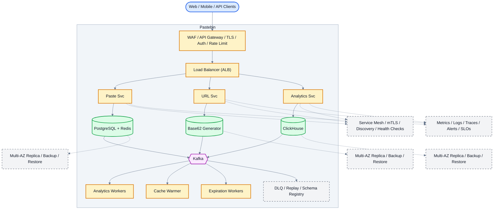

# System Design: Pastebin (Text Sharing Service)

## Overview

Text sharing service allowing users to paste code/text snippets and share via unique URLs.
Handles 500M+ monthly views, 10M+ pastes/day, write-heavy workload.

### Key Numbers

- 10M+ pastes/day, 500M+ page views/month
- Write:Read ratio = 1:10
- Average paste size: 10KB, max 10MB

---

## Requirements

### Functional Requirements

- Create paste with title, content, expiry, visibility
- Retrieve paste by short URL
- Set expiration (10 min to forever)
- Public or private (unlisted) pastes
- Syntax highlighting for code
- Raw view and download

### Non-Functional Requirements

- Latency: < 100ms for paste retrieval
- Availability: 99.99%
- Durability: Never lose a paste
- Scale: 10M pastes/day, 100M reads/day

---

## High-Level Architecture

### Architecture Diagram



*Solid = data flow, dashed = control plane / monitoring.*

### Data Flow

1. User creates paste - Paste Service generates unique short URL
2. URL from pre-generated Base62 pool (Distributed ID Generator)
3. Paste content stored in S3, metadata in PostgreSQL + Redis
4. User visits short URL - URL Service redirects (301/302)
5. Cache hit: sub-ms redirect, miss: PostgreSQL fallback
6. Expiration Worker deletes pastes past their TTL
7. Analytics: views, referrers, language distribution

## Microservices
How the system is decomposed into independently deployed services:

| Service | Tech Stack | Database | Pattern |
| --------- | ------------ | ---------- | ---------- |
| Paste Service | Node.js + Express | DynamoDB | CRUD |
| URL Service | Go | Redis Counter | Base62 |
| Storage Service | Node.js | S3 + DynamoDB | Content Store |
| Expiration Service | Go | Redis TTL | Scheduled Cleanup |
| Analytics Service | Python | ClickStream | Event Tracking |

---

## Database Design

### DynamoDB

```
Table: pastes
  PK: paste_id (String) - 7-char Base62
  SK: user_id (String)
  Attributes: title, content_url (S3 key), language,
              visibility, created_at, expires_at

Table: users
  PK: user_id (String)
  Attributes: email, name, api_key, created_at
```

### Redis

```bash
paste:{paste_id}     -> Hash (cached paste metadata)
counter:{date}       -> Atomic counter for ID generation
rate_limit:{user_id} -> Hash (sliding window)
```

---

## Scaling Tiers
How the architecture grows from MVP to global scale:

| Tier | Users | Infrastructure | Monthly Cost |
| ------ | ------- | --------------- | ------------- |
| 1K-10K | 10K | 2 Node.js + DynamoDB + S3 | $200 |
| 10K-1M | 1M | 6 app + DynamoDB + S3 + Redis + CDN | $5,000 |
| 1M-10M+ | 10M+ | 20+ app + DynamoDB On-Demand + S3 + ES | $50,000 |

---

## Key Techniques & Patterns

- **Base62 Encoding**: 7-char short URLs (62^7 = 3.5 trillion unique URLs)
- **CDN Caching**: CloudFront caches public pastes at edge
- **Redis Caching**: Hot pastes cached, LRU eviction
- **SOLID Principles**: Single responsibility per microservice
- **Consistent Hashing**: Distribute paste storage across nodes
- **DynamoDB Auto-scaling**: On-demand capacity for write spikes
- **S3 Lifecycle**: Move old pastes to IA/Glacier for cost savings
- **Read-Heavy Optimization**: CDN + Redis cache for 99% read hits

---

## Key Design Decisions

1. **Base62 Short URLs**: 7 chars = 3.5T unique URLs, collision-resistant
2. **DynamoDB over RDS**: Serverless, auto-scaling, no DB management
3. **S3 for Content**: Cheap, durable, unlimited scale for paste text
4. **CDN for Reads**: 99% read traffic served from edge, <50ms
5. **Redis TTL for Expiry**: Native TTL support, no polling needed

---

## Failure Modes & Recovery
What can go wrong in production, and how the system detects and recovers:

| Failure | Impact | Mitigation |
| --------- | -------- | ----------- |
| DynamoDB Throttling | Paste creation fails | On-demand + backoff |
| S3 Outage | Pastes unreadable | Multi-region replication |
| Redis Cache Miss | Slower reads | DynamoDB fallback |
| CDN Down | Higher latency | Origin servers handle traffic |
| URL Collision | Duplicate URL | Atomic counter + retry |

---

## Cost Estimation (1M Users)
Rough monthly cost of running this design for one million users:

| Component | Configuration | Monthly Cost |
| ----------- | -------------- | ------------- |
| App Servers (6x) | t3.medium | $300 |
| DynamoDB | On-Demand | $1,500 |
| S3 (1TB stored) | Standard | $23 |
| Redis (2 nodes) | t3.medium | $150 |
| CloudFront | 100GB transfer | $85 |
| Lambda (Expiration) | 10M invocations | $20 |
| **Total** | | **~$2,078** |

---

## Trade-off Analysis
The alternatives considered, and which one won and why:

| Decision | Option A | Option B | Choice | Why |
| ---------- | ---------- | ---------- | -------- | ----- |
| URL Scheme | Hash (MD5) | Counter (Base62) | Base62 | No collisions, sequential |
| Storage | PostgreSQL | DynamoDB + S3 | DynamoDB + S3 | Serverless, auto-scale |
| Expiry | DB Cleanup Job | Redis TTL | Redis TTL | Native, no polling |
| Read Cache | App-level cache | CDN | CDN | Edge caching, <50ms |
| Content | DB BLOB | S3 | S3 | Unlimited scale, cheap |

---

## Key Metrics to Monitor

1. Paste creation latency (P99 < 500ms)
2. Paste retrieval latency (P99 < 100ms)
3. Cache hit rate (Redis + CDN)
4. S3 read/write latency
5. DynamoDB read/write capacity utilization
6. URL collision rate (should be 0)
7. Expired paste cleanup latency
8. CDN cache hit ratio
9. Error rate (4xx + 5xx)
10. Pastes created per second

---

## Deep Dive Prompts

1. How would you design a URL shortener that handles 1B URLs with zero collisions?
2. How would you implement syntax highlighting for 50+ languages at scale?
3. How would you handle paste expiration across distributed systems?
4. How would you design paste versioning (edit history)?
5. How would you implement real-time collaboration on a paste?

---

## Common Interview Follow-ups

1. How would you handle a viral paste that gets 1M views in an hour?
2. How would you detect and prevent malicious content in pastes?
3. How would you implement paste analytics (views, unique visitors)?
4. How would you handle rate limiting for API users vs web users?
5. How would you implement paste sharing with access control?

---

## Low-Level Design (LLD) - Algorithms & Data Structures

### Base62 URL Generator

```text
class URLGenerator {
  constructor() {
    this.charset = "abcdefghijklmnopqrstuvwxyzABCDEFGHIJKLMNOPQRSTUVWXYZ0123456789";
    this.base = this.charset.length;
    this.counter = 0;
  }

  encode(num) {
    if (num === 0) return this.charset[0];
    let result = "";
    while (num > 0) {
      result = this.charset[num % this.base] + result;
      num = Math.floor(num / this.base);
    }
    return result.padStart(7, "a");
  }

  decode(shortUrl) {
    let result = 0;
    for (const char of shortUrl) {
      result = result * this.base + this.charset.indexOf(char);
    }
    return result;
  }

  generate() {
    return this.encode(this.counter++);
  }
}

const url = new URLGenerator(); console.log("URL generator:", url.generate());
```
