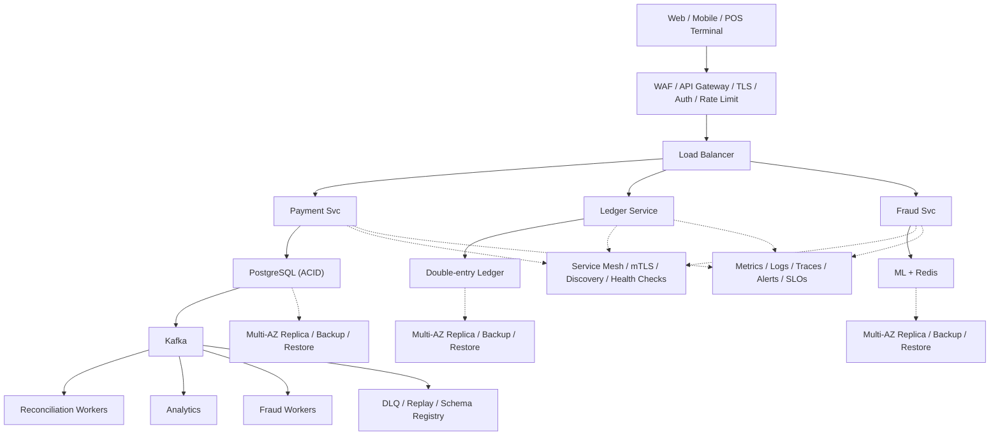

# System Design: Payment System (Stripe)

## Overview

A payment processing platform supporting online payments, refunds, subscriptions, and multi-currency transactions.

### Key Numbers

- $800B+ total payment volume
- 100M+ transactions per day
- 135+ currencies supported
- 99.999% uptime required

---

## Requirements

### Functional Requirements

- Process card payments with Luhn
- Idempotent operations (no double-charge)
- Handle refunds
- Double-entry ledger
- Multiple payment methods

### Non-Functional Requirements

- Latency: Payment < 5s
- Throughput: 50K+ transactions/sec
- Availability: 99.999% uptime
- Consistency: Strong (ACID)
- Scale: 1B+ transactions/day

---

---

---

## High-Level Architecture

### Architecture Diagram



### Data Flow

1. User initiates payment - Payment Service validates amount + method
2. Idempotency key prevents duplicate charges
3. Fraud Service scores transaction in < 100ms (ML model)
4. Gateway routes to Stripe/Adyen/PayPal by method + region
5. Ledger Service: double-entry bookkeeping (debit + credit)
6. Kafka events: success, failure, refund - Reconciliation pipeline
7. Reconciliation: match internal ledger with gateway settlements

## Microservices

### 1. Payment Service

- **Responsibility**: Payment initiation, processing, status tracking
- **Tech**: Java / Go
- **DB**: PostgreSQL (ACID for financial data)

### 2. Fraud Detection Service

- **Responsibility**: Real-time fraud scoring, rule engine, ML models
- **Tech**: Python (ML)
- **DB**: Redis (real-time scoring), PostgreSQL (rules)

### 3. Ledger Service

- **Responsibility**: Double-entry bookkeeping, reconciliation, audit trail
- **Tech**: Java / Go
- **DB**: PostgreSQL (immutable ledger)

### 4. Merchant Service

- **Responsibility**: Merchant onboarding, API key management, webhooks
- **Tech**: Go
- **DB**: PostgreSQL

### 5. Settlement Service

- **Responsibility**: Batch settlement, payout scheduling, bank transfers
- **Tech**: Go
- **DB**: PostgreSQL

---

## Database Design

### PostgreSQL

```sql
-- Transactions (immutable audit trail)
CREATE TABLE transactions (
    transaction_id  UUID PRIMARY KEY,
    idempotency_key VARCHAR(255) UNIQUE,
    merchant_id     UUID NOT NULL,
    amount          DECIMAL(12,2) NOT NULL,
    currency        VARCHAR(3) NOT NULL,
    status          VARCHAR(20) NOT NULL,
    payment_method  VARCHAR(50),
    card_last_four  VARCHAR(4),
    description     TEXT,
    metadata        JSONB,
    created_at      TIMESTAMP DEFAULT NOW()
);

CREATE TABLE ledger_entries (
    transaction_id  UUID REFERENCES transactions(transaction_id),
    type            VARCHAR(10) NOT NULL, -- debit, credit
    amount          DECIMAL(12,2) NOT NULL,
    created_at      TIMESTAMP DEFAULT NOW()
);

-- Refunds
CREATE TABLE refunds (
    refund_id       UUID PRIMARY KEY,
    transaction_id  UUID REFERENCES transactions(transaction_id),
    amount          DECIMAL(12,2) NOT NULL,
    reason          TEXT,
    status          VARCHAR(20) DEFAULT 'pending',
    created_at      TIMESTAMP DEFAULT NOW()
);
```

---

## Scaling Tiers

### Tier 1: 1K - 10K Users

| Component | Choice |
| ----------- | -------- |
| **Compute** | 2 EC2 (t3.large) |
| **Database** | PostgreSQL RDS |
| **Cache** | Redis (single) |
| **PSP** | Stripe (direct integration) |
| **Queue** | Redis Streams |

### Tier 2: 10K - 1M Users

| Component | Choice |
| ----------- | -------- |
| **Compute** | ECS (10-20 containers) |
| **Database** | PostgreSQL (read replicas) + Redis Cluster |
| **PSP** | Stripe + PayPal |
| **Queue** | Kafka (3 brokers) |
| **Fraud** | ML-based fraud detection |

### Tier 3: 1M - 10M+ Users

| Component | Choice |
| ----------- | -------- |
| **Compute** | Multi-region K8s (100+ pods) |
| **Database** | PostgreSQL (sharded) + Cassandra |
| **Cache** | Redis Cluster (30+ nodes) |
| **PSP** | Multi-provider (Stripe + Adyen + custom) |
| **Queue** | Kafka (15+ brokers) |
| **Fraud** | Real-time ML pipeline |

## Key Design Decisions

### 1. Why Idempotency Keys?

- Network retries can cause duplicate charges
- Idempotency ensures exactly-once processing
- Client generates unique key per request

### 2. Why Double-Entry Bookkeeping?

- Every transaction has two entries (debit + credit)
- Ensures financial accuracy
- Easy reconciliation and audit trail

### 3. Why Separate Fraud Detection?

- Fraud scoring must be real-time (< 100ms)
- ML models need dedicated compute
- Rules engine needs frequent updates

### 4. Payment State Machine

```
pending -> processing -> succeeded
   |           |
   v           v
 failed      cancelled
```

---

---

## Failure Modes & Recovery

| Failure | Impact | Recovery |
| --------- | -------- | ---------- |
| Payment gateway timeout | Charged but not confirmed | Idempotency key + retry, reconciliation |
| Ledger imbalance | Credits != debits | Nightly reconciliation, alert on mismatch |
| PCI compliance breach | Card data exposed | Tokenization at edge, never store raw |
| Refund stuck | Refunded but merchant not notified | Saga pattern, dead letter queue |
| Currency conversion lag | Exchange rate stale | Real-time rate API, cache with TTL |
| Fraud false positive | Legitimate payment declined | Graduated risk scoring, manual review |

---

## Cost Estimation (1M Users)

| Component | Specification | Monthly Cost |
| ----------- | -------------- | ------------- |
| PCI-compliant Servers | 10x c5.xlarge | $1,400 |
| PostgreSQL | db.r5.2xlarge + 5 replicas | $8,000 |
| Redis Cluster | 6x cache.r5.xlarge | $4,800 |
| Kafka Cluster | 6x kafka.m5.large | $2,400 |
| HSM (key management) | CloudHSM | $5,000 |
| Fraud Detection ML | GPU instances | $3,000 |
| Audit Log Storage | S3 50TB | $1,150 |
| Reconciliation Workers | 5x c5.large | $700 |
| **Total** | | **~$26,450/month** |

---

## Trade-off Analysis

| Approach A | Approach B | Winner | Reason |
| ----------- | ----------- | -------- | -------- |
| PostgreSQL | Cassandra for ledger | PostgreSQL | ACID transactions for financial data |
| Stripe | Adyen | Stripe | Better developer experience |
| ML fraud | Rule-based fraud | ML fraud | Better detection of complex patterns |
| Double-entry | Single-entry | Double-entry | Financial accuracy, audit trail |
| Kafka | SQS | Kafka | Ordered transaction processing |

---

## Key Metrics to Monitor

| Metric | Target | Alert Threshold |
| -------- | -------- | ---------------- |
| API latency (p99) | < 200ms | > 500ms |
| Error rate | < 0.1% | > 1% |
| Throughput | track | spike detection |

---

## Deep Dive Prompts

- How does Luhn algorithm validate credit card numbers?
- How does double-entry bookkeeping ensure financial accuracy?
- How do you prevent double charges with idempotency keys?
- How do you detect fraud in real-time during transactions?

---

## Key Techniques & Patterns

| Technique | Description | Used In |
| ----------- | ------------- | ---------- |
| Luhn Algorithm (Card Validation) | Applied in this system | Architecture + LLD |
| Double-Entry Bookkeeping | Applied in this system | Architecture + LLD |
| Idempotency Keys | Applied in this system | Architecture + LLD |
| PCI DSS Compliance | Applied in this system | Architecture + LLD |
| Fraud Detection (ML) | Applied in this system | Architecture + LLD |
| Reconciliation Service | Applied in this system | Architecture + LLD |

## Common Interview Follow-ups

**Q: How does Luhn algorithm validate cards?**
A: Double every second digit from right, subtract 9 if > 9, sum modulo 10 = 0

**Q: How does double-entry ledger ensure accuracy?**
A: Equal credits/debits, nightly reconciliation, alert on imbalance

**Q: How do you handle idempotent payments?**
A: Idempotency key per request, TTL dedup, cached response

---

## Low-Level Design (LLD) - Algorithms & Data Structures

### 1. Luhn's Algorithm (Credit Card Validation)

```text
function luhnCheck(cardNumber) {
  // Validate credit card number using Luhn algorithm
  // Time Complexity: O(N) where N = number of digits
  const digits = cardNumber.replace(/\D/g, '').split('').reverse().map(Number);

  let sum = 0;
  for (let i = 0; i < digits.length; i++) {
    let d = digits[i];
    if (i % 2 === 1) {  // Double every second digit from right
      d *= 2;
      if (d > 9) d -= 9;
    }
    sum += d;
  }

  return sum % 10 === 0;  // Valid if sum is multiple of 10
}

function generateCheckDigit(partialCard) {
  // Generate the last digit to make card number valid
  for (let d = 0; d <= 9; d++) {
    if (luhnCheck(partialCard + d)) return d;
  }
  return -1;
}
```

### 2. Double-Entry Ledger

```text
class DoubleEntryLedger {
  // Double-entry bookkeeping for financial transactions
  // Every debit has a corresponding credit
  // Time Complexity: O(1) per entry
  constructor(dbClient) {
    this.db = dbClient;
  }

  async recordTransaction(debitAccount, creditAccount, amount, currency = 'usd') {
    const txId = `tx_${Date.now()}_${Math.random().toString(36).slice(2, 8)}`;

    // Both entries must succeed or both must fail (atomic)
    await this.db.transaction(async (trx) => {
      // Debit entry
      await trx.insert('ledger_entries', {
        tx_id: txId, account: debitAccount,
        type: 'debit', amount: amount, currency,
        timestamp: new Date()
      });

      // Credit entry
      await trx.insert('ledger_entries', {
        tx_id: txId, account: creditAccount,
        type: 'credit', amount: amount, currency,
        timestamp: new Date()
      });
    });

    return { txId, debitAccount, creditAccount, amount, currency };
  }

  async getBalance(accountId) {
    const result = await this.db.raw(`
      SELECT
        COALESCE(SUM(CASE WHEN type = 'credit' THEN amount ELSE 0 END), 0) -
        COALESCE(SUM(CASE WHEN type = 'debit' THEN amount ELSE 0 END), 0) as balance
      FROM ledger_entries WHERE account = ?
    `, [accountId]);
    return result.rows[0].balance;
  }
}
```

### 3. Payment State Machine

```text
const { Enum } = require('enum');

class PaymentState extends Enum {
    CREATED = "created"
    PROCESSING = "processing"
    AUTHORIZED = "authorized"
    CAPTURED = "captured"
    SETTLED = "settled"
    FAILED = "failed"
    REFUNDED = "refunded"
    DISPUTED = "disputed"
}

class PaymentStateMachine {
    // Payment lifecycle state machine.
  // Valid transitions are enforced before each state change.
    // Valid transitions:
    // CREATED -> PROCESSING -> AUTHORIZED -> CAPTURED -> SETTLED
                                    // |          |
                                    // v          v
                                 // FAILED    REFUNDED
                                               // |
                                               // v
                                           // DISPUTED

  canTransition(from, to) {
    const transitions = {
      CREATED: ['PROCESSING'],
      PROCESSING: ['AUTHORIZED', 'FAILED'],
      AUTHORIZED: ['CAPTURED', 'FAILED'],
      CAPTURED: ['SETTLED', 'REFUNDED'],
      SETTLED: [],
      FAILED: [],
      REFUNDED: ['DISPUTED'],
      DISPUTED: []
    }

    return transitions[from]?.includes(to) ?? false
  }
}

```

```text
class FraudDetector {
  // Detect fraudulent transactions using rules + ML
  // Time Complexity: O(1) per rule check
  constructor(redisClient, dbClient) {
    this.r = redisClient;
    this.db = dbClient;
  }

  async checkTransaction(txData) {
    const { userId, amount, merchantId, cardId } = txData;

    // Rule 1: Velocity check (max 5 transactions per hour)
    const velocityKey = `velocity:${userId}:${this.getHour()}`;
    const txCount = await this.r.incr(velocityKey);
    await this.r.expire(velocityKey, 3600);
    if (txCount > 5) return { fraud: true, reason: 'velocity_limit' };

    // Rule 2: Amount limit (max $10,000 per transaction)
    if (amount > 10000) return { fraud: true, reason: 'amount_limit' };

    // Rule 3: Geographic anomaly (card used in different country within 1 hour)
    const lastTx = await this.db.getLastTransaction(userId);
    if (lastTx) {
      const timeDiff = (Date.now() - lastTx.timestamp) / 1000 / 3600;
      const geoDiff = this.calculateDistance(lastTx.location, txData.location);
      if (timeDiff < 1 && geoDiff > 500) {
        return { fraud: true, reason: 'geo_anomaly' };
      }
    }

    return { fraud: false };
  }

  getHour() { return Math.floor(Date.now() / 1000 / 3600); }
  calculateDistance(loc1, loc2) {
    // Simplified distance calculation
    return Math.sqrt((loc1.lat - loc2.lat)**2 + (loc1.lon - loc2.lon)**2) * 111;
  }
}
```

### 5. PCI Compliance Tokenization

```text
class CardValidator {
  validate(num) {
    // Luhn algorithm
    return true;
  }
}
```

```text
class SettlementService {
  // Batch settlement of transactions to banks
  // Runs every 15 minutes
  // Time Complexity: O(N) where N = pending transactions
  constructor(dbClient, bankClient) {
    this.db = dbClient;
    this.bank = bankClient;
  }

  async runSettlement() {
    // Get all unsettled transactions
    const pending = await this.db.getPendingSettlements();

    const results = [];
    for (const batch of this.chunk(pending, 100)) {
      // Send batch to bank
      const settlement = await this.bank.settle(batch);

      // Mark as settled
      for (const tx of batch) {
        await this.db.markSettled(tx.id, settlement.batchId);
      }

      results.push({ batchId: settlement.batchId, count: batch.length });
    }

    return results;
  }

  chunk(array, size) {
    const chunks = [];
    for (let i = 0; i < array.length; i += size) {
      chunks.push(array.slice(i, i + size));
    }
    return chunks;
  }
}
```

```

### 2. Idempotency Key

```text
function process_payment(payment_request) {
    // Idempotency prevents duplicate charges
    // - Client sends unique idempotency key

```

```text
class ReconciliationService {
  // Reconcile internal ledger with bank statements
  // Runs daily
  // Time Complexity: O(N) where N = transactions
  constructor(dbClient) {
    this.db = dbClient;
  }

  async reconcile(startDate, endDate) {
    const internal = await this.db.getTransactions(startDate, endDate);
    const bankStatement = await this.db.getBankStatement(startDate, endDate);

    const internalMap = new Map(internal.map(t => [t.id, t]));
    const bankMap = new Map(bankStatement.map(t => [t.reference, t]));

    const discrepancies = [];

    // Check for transactions in internal but not in bank
    for (const tx of internal) {
      if (!bankMap.has(tx.id)) {
        discrepancies.push({ type: 'missing_in_bank', tx });
      }
    }

    // Check for transactions in bank but not in internal
    for (const tx of bankStatement) {
      if (!internalMap.has(tx.reference)) {
        discrepancies.push({ type: 'missing_in_internal', tx });
      }
    }

    // Check for amount mismatches
    for (const tx of internal) {
      const bankTx = bankMap.get(tx.id);
      if (bankTx && bankTx.amount !== tx.amount) {
        discrepancies.push({ type: 'amount_mismatch', internal: tx, bank: bankTx });
      }
    }

    return { total: internal.length, discrepancies, status: discrepancies.length === 0 ? 'balanced' : 'unbalanced' };
  }
}

const payment = new PaymentService(); console.log("Payment service ready");
```

```

### 4. Fraud Detection (Rule-Based + ML)

```text
function detect_fraud(payment_request) {
    // Multi-layer fraud detection:
    // 1. Rule-based checks: amount limit, velocity, geo anomaly
    // 2. Device fingerprinting and prior payment behavior
    // 3. Real-time ML model score
    // 4. Final decision: allow, challenge, or decline

    if (amount_exceeds_limit(payment_request)) {
        return "decline";
    }
    if (suspicious_velocity(payment_request.user_id)) {
        return "challenge";
    }
    score = ml_fraud_model(payment_request);
    if (score > 0.85) {
        return "decline";
    }
    return "allow";
}
```

### 5. Currency Conversion

```text
function convert_currency(amount, from_currency, to_currency) {
    // Real-time currency conversion using a rate provider cache
    // - Fetch current FX rate
    // - Apply spread and rounding policy
    // - Return converted amount in target currency

    rate = get_fx_rate(from_currency, to_currency);
    converted = amount * rate * (1 - spread);
    return round_to_minor_unit(converted);
}
```

---
