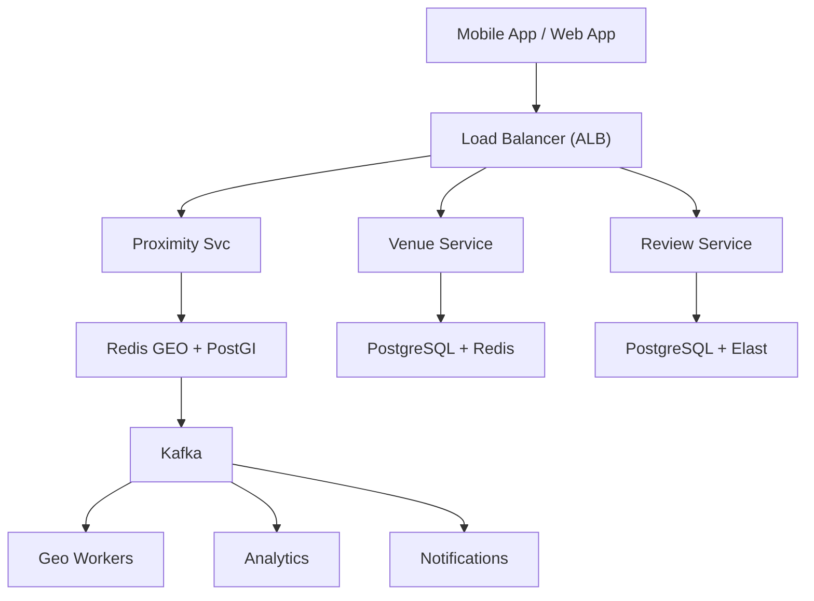

# System Design: Proximity / Nearby Service

## Overview

A geospatial service that finds nearby users, drivers, restaurants, or stores based on geographic location with sub-second response times.

### Key Numbers
- 100M+ location updates per minute
- 10M+ queries per minute for nearby search
- 1M+ moving entities tracked simultaneously
- Sub-second response time

---


## Requirements

### Functional Requirements
- Search nearby venues within radius
- View venue details and reviews
- Get directions to venue
- Save favorites and share
- Filter by cuisine, price, rating

### Non-Functional Requirements
- Latency: Nearby search < 200ms
- Throughput: 100K+ searches/sec
- Availability: 99.99% uptime
- Consistency: Eventually consistent venue data
- Scale: 100M+ venues, 500M+ users

---


---

---

## High-Level Architecture

### Architecture Diagram



### Data Flow

1. User opens app - Proximity Service queries Redis GEO
2. Returns top-10 venues within 5km, sorted by distance + rating
3. Venue Service loads details: hours, photos, menu from cache
4. User checks in - Kafka event - update venue popularity score
5. Reviews stored in PostgreSQL, indexed in Elasticsearch
6. Geohash-based caching: hot areas cached in Redis
7. Analytics: check-in patterns, popular times, trending venues
## Microservices

### 1. Location Ingestion Service
- **Responsibility**: Receive location updates from devices, validate, normalize, publish to Kafka
- **Tech**: Go
- **Queue**: Kafka (location updates)
- **Rate Limiting**: Per-device rate limiting

### 2. Location Storage Service
- **Responsibility**: Store latest location per entity, update geospatial index, handle high write throughput
- **Tech**: Go
- **DB**: Redis (latest location + GEO index), PostgreSQL/PostGIS (persistent)
- **Pattern**: Write-behind to persistent store

### 3. Nearby Search Service
- **Responsibility**: Find nearby entities within radius, sort by distance, filter by attributes
- **Tech**: Go
- **DB**: Redis GEO (GEORADIUS), PostGIS (complex queries)
- **Cache**: Redis (recent search results)

### 4. Geofence Service
- **Responsibility**: Define geographic boundaries, trigger events when entities enter/exit geofences
- **Tech**: Python / Go
- **DB**: PostGIS (polygon storage)
- **Queue**: Kafka (geofence events)

### 5. ETA Calculation Service
- **Responsibility**: Estimate time of arrival, route optimization, traffic-aware routing
- **Tech**: Go / Python
- **External**: Google Maps API / OSRM / Mapbox

---

## Database Design

### Redis (Primary - Real-Time)

```
# Store location (Geo Hash)
GEOADD entities:locations {longitude} {latitude} {entity_id}

# Find nearby entities (5km radius, max 10 results)
GEORADIUS entities:locations {lon} {lat} 5 km ASC COUNT 10 WITHDIST WITHCOORD

# Store latest location details
HSET entity:{entity_id} lat {lat} lng {lng} speed {speed} heading {heading} updated_at {ts}

# Geofence membership
SADD geofence:{zone_id} {entity_id}

# Location history (last N updates)
LPUSH location:history:{entity_id} {json}
LTRIM location:history:{entity_id} 0 99
```

### PostGIS (Persistent - Complex Queries)

```sql
-- Entities table with geospatial index
CREATE TABLE entities (
    entity_id       UUID PRIMARY KEY,
    entity_type     VARCHAR(50),
    latitude        DECIMAL(10,8) NOT NULL,
    longitude       DECIMAL(11,8) NOT NULL,
    location        GEOMETRY(POINT, 4326) NOT NULL,
    speed           DECIMAL(5,2),
    heading         DECIMAL(5,2),
    updated_at      TIMESTAMP DEFAULT NOW()
);

-- Geospatial index
CREATE INDEX idx_entities_location ON entities USING GIST (location);

-- Find nearby entities (PostGIS query)
SELECT entity_id, ST_Distance(
    location, ST_Point({lon}, {lat})::geography
) AS distance_meters
FROM entities
WHERE ST_DWithin(
    location, ST_Point({lon}, {lat})::geography, 5000
)
ORDER BY distance_meters
LIMIT 10;

-- Geofences table
CREATE TABLE geofences (
    zone_id         UUID PRIMARY KEY,
    name            VARCHAR(255),
    boundary        GEOMETRY(POLYGON, 4326),
    zone_type       VARCHAR(50),
    created_at      TIMESTAMP DEFAULT NOW()
);
```

### S2 Geometry (Google's Spatial Index)

```
# S2 Cell Hierarchy
Level 0:  ~5,000 km cells (continent)
Level 6:  ~1,000 km cells (country)
Level 10: ~10 km cells (city)
Level 15: ~100 m cells (neighborhood)
Level 20: ~1 m cells (street)

# Entity stored in multiple S2 cells at different levels
# Enables efficient proximity search at various distances
```

---

## Scaling Tiers

### Tier 1: 1K - 10K Users

| Component | Choice |
|-----------|--------|
| **Compute** | 2 EC2 (t3.large) |
| **Database** | Redis GEO (single) |
| **Persistent** | PostgreSQL + PostGIS |
| **Queue** | Redis Streams |
| **ETA** | Google Maps API |

### Tier 2: 10K - 1M Users

| Component | Choice |
|-----------|--------|
| **Compute** | ECS (10-30 containers) |
| **Database** | Redis Cluster (6 nodes) |
| **Persistent** | PostgreSQL + PostGIS (read replicas) |
| **Queue** | Kafka (3 brokers) |
| **Search** | Elasticsearch (geo queries) |
| **ETA** | Mapbox / OSRM |

### Tier 3: 1M - 10M+ Users

| Component | Choice |
|-----------|--------|
| **Compute** | Multi-region K8s (200+ pods) |
| **Database** | Redis Cluster (30+ nodes) |
| **Persistent** | PostgreSQL + PostGIS (sharded) |
| **Queue** | Kafka (15+ brokers) |
| **Index** | S2 Cells + Quadtree |
| **ETA** | Custom routing engine |

---

## Key Design Decisions

### 1. Why Redis GEO over PostGIS for Hot Queries?
- Redis GEO: O(log N) for GEORADIUS, sub-millisecond
- PostGIS: O(N) for complex polygon queries, millisecond-range
- Use Redis for hot nearby searches, PostGIS for complex spatial queries

### 2. Why S2 Cells over Geohashing?
- S2 cells are hierarchical (multi-level)
- Better for variable-radius searches
- Used by Google Maps internally
- Supports polygon containment checks

### 3. Why Kafka for Location Updates?
- 100M+ updates/minute needs durable queue
- Decouples ingestion from processing
- Enables replay for index rebuilding

### 4. Location Update Frequency
- Moving vehicles: every 4 seconds (Uber standard)
- Walking users: every 30 seconds
- Stationary users: every 5 minutes
- Battery-aware adaptive frequency

### 5. Write-Behind Pattern
- Write to Redis immediately (fast)
- Async batch write to PostgreSQL (durable)
- 5-10 second delay acceptable for persistent store

---

## Failure Modes & Recovery

| Failure | Impact | Recovery |
|---------|--------|----------|
| Geohash edge case | Venues near boundary missed | Search 8 neighboring cells, Haversine fallback |
| Redis GEO stale | Closed venue still shows | TTL on data, periodic re-indexing |
| Venue data inconsistency | Rating differs search vs detail | Single source PostgreSQL, cache invalidation |
| Search spike lunch hours | Search takes > 500ms | Auto-scale replicas, CDN cache popular areas |
| Maps API quota exceeded | Directions unavailable | Cached routes, basic distance fallback |
| Review spam attack | Fake reviews flood venue | Rate limiting, ML spam detection |

---


## Cost Estimation (1M Users)

| Component | Specification | Monthly Cost |
|-----------|--------------|-------------|
| API Servers | 20x c5.xlarge | $2,800 |
| PostgreSQL + PostGIS | db.r5.xlarge + 3 replicas | $4,800 |
| Redis GEO Cluster | 6x cache.r5.xlarge | $4,800 |
| Elasticsearch | 15x m5.xlarge | $6,300 |
| Google Maps API | 20M requests/day | $6,000 |
| CDN | 20TB/month transfer | $1,600 |
| Venue Data Pipeline | Kafka + workers | $2,400 |
| **Total** |  | **~$28,700/month** |

---

## Trade-off Analysis

| Approach A | Approach B | Winner | Reason |
|-----------|-----------|--------|--------|
| Redis GEO | PostGIS | Redis GEO | Sub-ms proximity queries |
| Geohash | Quadtree | Geohash | Simpler, better for distributed systems |
| Haversine | Euclidean | Haversine | Accurate for earth-surface distances |
| Elasticsearch | PostgreSQL | Elasticsearch | Better geo-query support |
| Redis cache | Database cache | Redis | Sub-ms cached results |

---

## Key Metrics to Monitor

| Metric | Target |
|--------|--------|
| Nearby search latency (p99) | < 100ms |
| Location update latency | < 50ms |
| Location accuracy | < 10 meters |
| ETA accuracy | +/- 2 minutes |
| Geofence trigger latency | < 5s |
| API response time (p99) | < 200ms |
| Location updates per second | 1M+ |
| Nearby query throughput | 10K+ qps |
| System availability | 99.95% |
| Redis GEO query latency | < 10ms |

---


---

## Deep Dive Prompts
- How does Geohash index enable fast proximity queries?
- How do you calculate accurate distance using Haversine formula?
- How do you handle cache invalidation for location-based data?
- How do you scale to 100M+ venue searches per day?

---


## Key Techniques & Patterns

| Technique | Description | Used In |
|-----------|-------------|----------|
| Geohash Indexing | Applied in this system | Architecture + LLD |
| Quadtree for Spatial Queries | Applied in this system | Architecture + LLD |
| Redis GEO Commands | Applied in this system | Architecture + LLD |
| Geofencing | Applied in this system | Architecture + LLD |
| Haversine Distance | Applied in this system | Architecture + LLD |
| Geospatial Sharding | Applied in this system | Architecture + LLD |

## Common Interview Follow-ups

**Q: How do you handle geohash edge cases?**
A: Search 8 neighboring cells, Haversine fallback, bounding box query

**Q: How do you scale to 100K+ queries/sec?**
A: Redis GEO O(log N), CDN cache popular areas, read replicas

**Q: How do you keep venue data fresh?**
A: TTL invalidation, periodic re-indexing, crowd-sourced updates

---

## Low-Level Design (LLD) - Algorithms & Data Structures

### 1. Geohash Algorithm

```text
class GeoService {
  // Find nearby venues using Redis GEO
  // Time Complexity: O(log N + M) where M = results
  constructor(redisClient) {
    this.r = redisClient;
  }

  async findNearby(lat, lon, radiusKm = 5) {
    const results = await this.r.georadius(
      'venues:locations', lon, lat, radiusKm, 'km', 'WITHDIST', 'ASC'
    );
    
    const venues = [];
    for (const [venueId, distance] of results.slice(0, 50)) {
      const details = await this.r.hgetall('venue:' + venueId);
      if (details && Object.keys(details).length > 0) {
        venues.push({ venueId, distance: parseFloat(distance), ...details });
      }
    }
    return venues;
  }

  async addVenue(venueId, lat, lon, metadata) {
    await this.r.geoadd('venues:locations', lon, lat, venueId);
    await this.r.hset('venue:' + venueId, metadata);
  }

  async getDistance(venue1, venue2) {
    return this.r.geodist('venues:locations', venue1, venue2, 'km');
  }
}

const geo = new GeoService(); console.log("Geo service ready");
```

### 2. Haversine Distance Formula

```text
const math = require('math');

function haversine_distance(lat1, lng1, lat2, lng2) {
    // Calculate distance between two points on Earth
    // Returns distance in kilometers

```

### 3. Quadtree (Spatial Index)

```text
class Quadtree {
    // Quadtree for efficient spatial queries
    // - Recursively subdivides space into 4 quadrants

```

### 4. S2 Cell ID (Google's Spatial Index)

```text
function get_s2_cell(lat, lng, level=15) {

```
