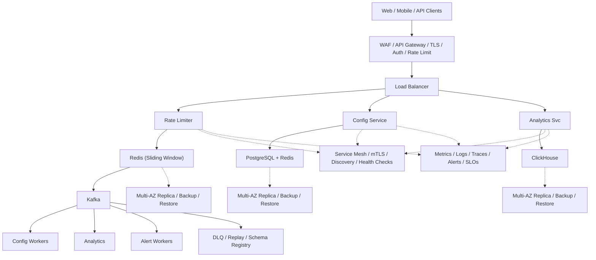

# System Design: Rate Limiter

## Overview

A distributed rate limiting system that controls API request rates per user/IP/API key to prevent abuse and ensure fair usage.

### Key Numbers

- 10M+ API requests per second
- 100K+ rate limit rules
- Sub-millisecond decision time

---

## Requirements

### Functional Requirements

- Limit API requests per user/IP/key
- Support token bucket and sliding window
- Return HTTP 429 with Retry-After
- Real-time usage statistics
- Distributed rate limiting

### Non-Functional Requirements

- Latency: Rate check < 1ms
- Throughput: 10M+ requests/sec
- Availability: 99.99% uptime
- Consistency: Soft consistency
- Scale: 100K+ rate limit keys

---

---

## High-Level Architecture

### Architecture Diagram



### Data Flow

1. API request hits Rate Limiter before reaching backend
2. Redis sliding window counter checks request count
3. Under limit: increment counter, forward request
4. Over limit: return 429 Too Many Requests + Retry-After
5. Config Service: dynamic limit changes per API key / tier
6. Analytics: rate limit hits, false positives, capacity planning
7. Alerts when approaching limits (80% threshold)

## Microservices

| Service | Responsibility | Tech | DB |
| --------- | --------------- | ------ | ----- |
| **API Gateway** | Rate limit check at edge | NGINX/Kong/Envoy | Redis |
| **Rule Engine** | Manage rate limit rules | Go/Node.js | PostgreSQL |
| **Counter Service** | Increment/reset counters | Go | Redis |
| **Analytics Service** | Track rate limit metrics | Python | ClickHouse |
| **Config Service** | Dynamic rule updates | Go | etcd/Consul |

---

## Database Design

### PostgreSQL: Rate Limit Rules

```sql
CREATE TABLE rate_limit_rules (
    id              SERIAL PRIMARY KEY,
    rule_name       VARCHAR(100) NOT NULL,
    resource        VARCHAR(100) NOT NULL,  -- API endpoint or resource
    limit_type      VARCHAR(20) NOT NULL,   -- 'per_user', 'per_ip', 'global'
    max_requests    INT NOT NULL,
    window_seconds  INT NOT NULL,
    algorithm       VARCHAR(20) DEFAULT 'sliding_window_counter',
    is_active       BOOLEAN DEFAULT true,
    created_at      TIMESTAMP DEFAULT NOW(),
    updated_at      TIMESTAMP DEFAULT NOW()
);

CREATE INDEX idx_rules_resource ON rate_limit_rules(resource);
CREATE INDEX idx_rules_active ON rate_limit_rules(is_active);
```

### Redis: Rate Limit Counters

```redis
-- Sliding Window Counter (per user per resource)
SET rate:user:123:api:/v1/posts:window:1725148800 42
EXPIRE rate:user:123:api:/v1/posts:window:1725148800 120

-- Token Bucket (per user)
HSET rate:token:user:123 tokens 85 last_refill 1725148800 capacity 100 refill_rate 10

-- Fixed Window (per IP)
INCR rate:ip:192.168.1.1:window:1725148800
EXPIRE rate:ip:192.168.1.1:window:1725148800 60
```

## Scaling Tiers

### Tier 1: 1K - 10K Users

| Component | Choice |
| ----------- | -------- |
| **Redis** | Single Redis instance |
| **Algorithm** | Fixed Window or Token Bucket |
| **Placement** | Application layer |

### Tier 2: 10K - 1M Users

| Component | Choice |
| ----------- | -------- |
| **Redis** | Redis Cluster (6 nodes) |
| **Algorithm** | Sliding Window Counter |
| **Placement** | API Gateway + Application |

### Tier 3: 1M - 10M+ Users

| Component | Choice |
| ----------- | -------- |
| **Redis** | Redis Cluster (30+ nodes, multi-region) |
| **Algorithm** | Token Bucket + Sliding Window |
| **Placement** | Multi-layer (Gateway + App + DB) |
| **Sync** | Redis Pub/Sub for cross-region sync |

---

---

## Key Design Decisions

### 1. Where to Place Rate Limiter?

- **API Gateway**: Centralized, easy to manage
- **Application Layer**: More granular control
- **Both**: Defense in depth

### 2. Rate Limit Keys

- Per user: `rate:{user_id}`
- Per IP: `rate:{ip_address}`
- Per API key: `rate:{api_key}`
- Per endpoint: `rate:{endpoint}:{user_id}`

### 3. Rate Limit Response

```text
// HTTP 429 Too Many Requests
{
    "error": "rate_limit_exceeded",
    "message": "Too many requests",
    "retry_after": Math.floor(30 / seconds)
}

```

### 4. Redis Lua Script (Atomic)

```lua
-- Atomic rate limiting in Redis
local key = KEYS[1]
local limit = tonumber(ARGV[1])
local window = tonumber(ARGV[2])

local current = tonumber(redis.call('GET', key) or '0')
if current + 1 > limit then
    return 0  -- Reject
else
    redis.call('INCR', key)
    redis.call('EXPIRE', key, window)
    return 1  -- Allow
end
```

### 5. Rate Limit Headers

```
X-RateLimit-Limit: 100
X-RateLimit-Remaining: 95
X-RateLimit-Reset: 1625206400
Retry-After: 30
```

---

## Failure Modes & Recovery

| Failure | Impact | Recovery |
| --------- | -------- | ---------- |
| Redis cluster down | Limiter fails open | Fail-open design, local memory fallback |
| Clock skew across nodes | Sliding window inaccurate | NTP sync, logical timestamps |
| Hot key popular API | Single Redis shard overloaded | Local caching, sharded keys |
| Config change propagation | Nodes enforce old limits | Kafka broadcast, version stamps |
| Race condition on counter | Over/under count requests | Redis INCR atomic, Lua script |
| Client bypasses limit | Multiple IPs | Session-based limiting, API key + IP + user |

---

## Cost Estimation (1M Users)

| Component | Specification | Monthly Cost |
| ----------- | -------------- | ------------- |
| Redis Cluster | 6x cache.r5.xlarge | $4,800 |
| Rate Limiter Nodes | 10x c5.xlarge | $1,400 |
| Config Service | 3x c5.large | $420 |
| Kafka (config broadcast) | 3x kafka.m5.large | $1,200 |
| Monitoring | Prometheus + Grafana | $500 |
| **Total** | | **~$8,320/month** |

---

## Trade-off Analysis

| Approach A | Approach B | Winner | Reason |
| ----------- | ----------- | -------- | -------- |
| Token bucket | Fixed window | Token bucket | Allows bursts, smoother rate limiting |
| Sliding window | Fixed window | Sliding window | More accurate request counting |
| Redis | Database | Redis | Sub-ms operations for rate limiting |
| Lua script | Application logic | Lua script | Atomic operations, no race conditions |
| Local + distributed | Distributed only | Local + distributed | Faster local checks, global coordination |

---

## Key Metrics to Monitor

| Metric | Target | Alert Threshold |
| -------- | -------- | ---------------- |
| API latency (p99) | < 200ms | > 500ms |
| Error rate | < 0.1% | > 1% |
| Throughput | track | spike detection |

---

## Deep Dive Prompts

- How does token bucket algorithm handle traffic bursts?
- How do you implement distributed rate limiting across multiple servers?
- How do you prevent race conditions in rate limiting?
- How do you handle rate limit violations gracefully?

---

## Key Techniques & Patterns

| Technique | Description | Used In |
| ----------- | ------------- | ---------- |
| Token Bucket Algorithm | Applied in this system | Architecture + LLD |
| Sliding Window Counter | Applied in this system | Architecture + LLD |
| Fixed Window Counter | Applied in this system | Architecture + LLD |
| Distributed Rate Limiting (Redis) | Applied in this system | Architecture + LLD |
| Rate Limit Headers | Applied in this system | Architecture + LLD |
| Graceful Degradation | Applied in this system | Architecture + LLD |

## Common Interview Follow-ups

**Q: What happens when Redis goes down?**
A: Fail-open design, local memory fallback, alert ops

**Q: How do you handle distributed rate limiting?**
A: Redis atomic INCR, Lua script, consistent hashing

**Q: Which algorithm is best?**
A: Token bucket for bursts, sliding window for accuracy, leaky bucket for smooth output

---

## Low-Level Design (LLD) - Algorithms & Data Structures

### 1. Token Bucket Algorithm

```text
class TokenBucket {
  // Token bucket rate limiter
  // Time Complexity: O(1) per request
  constructor(capacity, refillRate) {
    this.capacity = capacity;      // Max burst size
    this.tokens = capacity;        // Current available tokens
    this.refillRate = refillRate;  // Tokens added per second
    this.lastRefill = Date.now();
  }

  consume(tokens = 1) {
    this.refill();
    if (this.tokens >= tokens) {
      this.tokens -= tokens;
      return { allowed: true, remaining: Math.floor(this.tokens) };
    }
    return { allowed: false, remaining: 0, retryAfter: this.retryTime(tokens) };
  }

  refill() {
    const now = Date.now();
    const elapsed = (now - this.lastRefill) / 1000;
    this.tokens = Math.min(this.capacity, this.tokens + elapsed * this.refillRate);
    this.lastRefill = now;
  }

  retryTime(tokens) {
    const deficit = tokens - this.tokens;
    return Math.ceil((deficit / this.refillRate) * 1000);  // ms until tokens available
  }
}

class SlidingWindowCounter {
  // Sliding window rate limiter using two fixed windows
  // Time Complexity: O(1) per request
  constructor(windowSizeSec, maxRequests) {
    this.windowSize = windowSizeSec;
    this.maxRequests = maxRequests;
    this.prevCount = 0;
    this.currCount = 0;
    this.windowStart = Math.floor(Date.now() / 1000 / windowSizeSec) * windowSizeSec;
  }

  allow() {
    this.rollWindow();
    if (this.currCount < this.maxRequests) {
      this.currCount++;
      return true;
    }
    return false;
  }

  rollWindow() {
    const now = Math.floor(Date.now() / 1000);
    const currentWindow = Math.floor(now / this.windowSize) * this.windowSize;

    if (currentWindow > this.windowStart) {
      // Shift windows
      const elapsed = (currentWindow - this.windowStart) / this.windowSize;
      this.prevCount = elapsed >= 2 ? 0 : this.currCount;
      this.currCount = 0;
      this.windowStart = currentWindow;
    }
  }
}
```

### 2. Sliding Window Log Algorithm

```text
const redis = require('redis');
const time = require('time');

class SlidingWindowLog {
    // Sliding Window Log: stores timestamp of each request in a sorted set.
    // Most accurate but highest memory usage.

```

### 3. Sliding Window Counter Algorithm

```text
const redis = require('redis');
const math = require('math');

class SlidingWindowCounter {
    // Sliding Window Counter: weighted count of previous + current window.
    // Good balance of accuracy && memory.

```

### 4. Leaky Bucket Algorithm

```text
const { deque } = require('collections');
const time = require('time');
const threading = require('threading');

class LeakyBucket {
    // Leaky Bucket: processes requests at a fixed rate through a FIFO queue.
    // Requests that exceed queue capacity are dropped.
    // Smooths bursty traffic into a steady output stream.

```

### 5. Fixed Window Counter Algorithm

```text
const redis = require('redis');
const math = require('math');

class FixedWindowCounter {
    // Fixed Window Counter: simplest algorithm, counts requests in fixed time buckets.

```

### 6. Distributed Rate Limiter with Consistent Hashing

```text
const crypto = require('crypto');

class DistributedRateLimiter {
  /**
   * Routes rate limit checks to specific Redis shards using consistent hashing.
   * Ensures all requests for the same user hit the same Redis node.
   */
  constructor(redisNodes, windowSeconds, maxRequests) {
    this.nodes = redisNodes.sort();
    this.window = windowSeconds;
    this.maxRequests = maxRequests;
  }

  getShard(userId) {
    const hash = parseInt(crypto.createHash('md5').update(userId).digest('hex').slice(0, 8), 16);
    return this.nodes[hash % this.nodes.length];
  }

  async allow(userId, ruleId) {
    const shard = this.getShard(userId);
    const key = `ratelimit:${ruleId}:${userId}`;
    const now = Math.floor(Date.now() / 1000);
    const windowStart = now - this.window;

    // Lua script for atomic check-and-increment
    const luaScript = `
      redis.call('ZREMRANGEBYSCORE', KEYS[1], 0, ARGV[1])
      local count = redis.call('ZCARD', KEYS[1])
      if count < tonumber(ARGV[2]) then
        redis.call('ZADD', KEYS[1], ARGV[3], ARGV[3])
        redis.call('EXPIRE', KEYS[1], ARGV[4])
        return 1
      end
      return 0
    `;

    const result = await shard.eval(luaScript, 1, key, windowStart, this.maxRequests, now, this.window * 2);
    return result === 1;
  }
}

const limiter = new RateLimiter(); console.log("Rate limiter ready");
```

---

---

### Rate Limiting Strategies

| Strategy | Use Case | Accuracy | Memory |
| ---------- | ---------- | ---------- | -------- |
| Token Bucket | API rate limiting | High | Low |
| Sliding Window Log | Strict rate limiting | Highest | High |
| Sliding Window Counter | General purpose | High | Low |
| Fixed Window Counter | Simple limits | Medium | Lowest |
| Leaky Bucket | Traffic shaping | High | Low |

---
