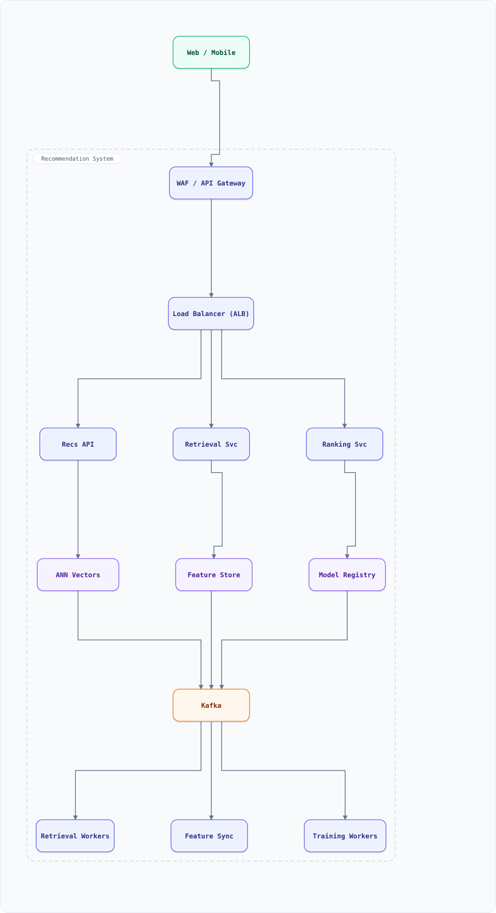

<div align="center">

# System Design: Recommendation System (Two-Stage Ranking Funnel)

</div>

> [!TIP]
> **TL;DR** — A production recommender for feeds/e-commerce/video: candidate generation from multiple retrievers → feature enrichment → ML ranking → re-ranking with business logic. The classic "How does YouTube/Netflix/Amazon decide what to show" system, from embeddings to serving.

## Overview

A recommender can't score a 1B-item catalog per request. The answer is a **funnel**: cheap retrievers (collaborative filtering, embeddings ANN, trending, co-visitation) produce ~1,000 candidates; a feature store enriches them; an ML ranker (GBM/two-tower/sequence model) scores top candidates; business re-ranking applies diversity, freshness, and policy. Offline training loops close the cycle.

### Key Numbers

| Metric | Value |
| :--- | :--- |
| **Catalog** | 100M+ items |
| **Requests** | 50K / second |
| **Funnel** | 1B items → 1K candidates → 100 ranked → 20 shown |
| **Serving latency** | < 150ms P99 end-to-end |

---

## Requirements

### Functional Requirements

- Personalized ranked list per user, per surface (home, "more like this", email)
- Multiple retrievers: item-CF, two-tower embeddings ANN, trending, co-visitation, editorial
- Real-time user signals (last N clicks/watches) influence ranking immediately
- Business rules: diversity, exploration (ε-greedy), freshness, brand/policy exclusions
- Feedback loop: impressions/clicks logged → training pipeline → model updates

### Non-Functional Requirements

| Attribute | Target |
| :--- | :--- |
| **Latency** | < 150ms P99 (retrieval 30ms, rank 60ms, rest overhead) |
| **Freshness** | new items recommendable within minutes |
| **Cold start** | trending/editorial fallback for logged-out & new users |
| **Throughput** | 50K QPS with GPU ranker pool |

---

## High-Level Architecture

### Architecture Diagram



**Interactive diagram:** [diagrams/system-design/recommendation-system.architecture.html](diagrams/system-design/recommendation-system.architecture.html) — pan/zoom, search, dark/light theme, PNG/SVG export.


**Interactive diagram:** [diagrams/system-design/recommendation-system.architecture.html](diagrams/system-design/recommendation-system.architecture.html) — pan/zoom, search, dark/light theme, PNG/SVG export.

### Data Flow

1. Request → Recs API → **Retrieval Svc**: parallel retrievers (ANN on two-tower embeddings, i2i co-visitation, trending, editorial) each return ≤ 200 candidates, unioned
2. **Feature Svc** (online store: Redis) enriches candidates: user features, item features, cross features (user×item)
3. **Ranker** (GPU pool) scores candidates with the served model; scores → policy layer
4. **Re-ranker** applies diversity (category cap), exploration, dedup vs recently shown, business boosts
5. All served impressions/clicks → Kafka → lake → training pipeline; embeddings refreshed nightly, models weekly, features streaming

## Microservices

| Service | Tech Stack | Database | Pattern |
| --------- | ------------ | ---------- | ---------- |
| Recs API | Go | Redis | Funnel orchestrator |
| Retrieval Service | Rust + Faiss | Vector index (RAM) | ANN retrieval |
| Feature Service | Java | Redis online + Hive offline | Online/offline parity |
| Ranking Service | Python + ONNX/TensorRT | GPU pool + model registry | Batch scoring |
| Training Pipeline | Python | Data lake + MLflow | Periodic retrain |

---

## Database Design

### Vector store + feature store

```bash
# ANN vector index (Faiss/HNSW shards, in-memory, replicated)
item_embeddings:{shard}    -> HNSW graph (item_id -> 128-dim vector)

# Feature store (Redis online store)
user:{id}:seq              -> last 50 item_ids (trimmed list)
user:{id}:features         -> hash: tenure, prefs, device
item:{id}:features         -> hash: ctr, freshness, category
cross:{user}:{item}        -> hash: cf_affinity, view_count_30d

# Offline (lake tables, training)
impressions  (user_id, item_id, ts, position, clicked, watched_pct)
```

---

## Scaling Tiers

| Tier | Users | Infrastructure | Monthly Cost |
| ------ | ------- | -------------- | ------------- |
| 1K-10K | 10K | Single ranker + Postgres co-occurrence | $300 |
| 10K-1M | 1M | ANN 2 nodes + Redis + CPU ranker pool + Kafka | $6,000 |
| 1M-10M+ | 10M+ | 20 ANN shards + GPU ranker pool + feature store + Kafka + lake | $80,000 |

---

## Key Techniques & Patterns

- **Two-stage funnel**: retrieval (cheap, recall-oriented) → ranking (expensive, precision-oriented)
- **Two-tower embeddings**: user tower & item tower precomputed offline; serving = ANN lookup
- **Approximate Nearest Neighbor (HNSW)**: sub-5ms retrieval over 100M vectors
- **Feature store**: online (Redis, <10ms) / offline (lake) parity is the #1 production pitfall
- **Reservoir Sampling**: exploration candidates; **Count-Min Sketch**: frequency capping
- **Event-Driven Architecture**: impression/click streams power the training loop

---

## Key Design Decisions

1. **Retrieve-then-rank, always**: scoring 1B items is physically impossible in 150ms — the funnel is the only architecture
2. **Multi-retriever union**: no single retriever has recall; CF + ANN + trending covers popularity tail + personal
3. **Feature parity discipline**: same transformation code online and offline; skew = silent model rot
4. **GPU ranking pool with batching**: rankers batch across concurrent requests (continuous batching analog)
5. **Policy in re-ranker, not ranker**: the ML model optimizes engagement; humans own diversity/policy — don't mix objectives

---

## Failure Modes & Recovery

| Failure | Impact | Mitigation |
| --------- | -------- | ----------- |
| ANN index stale | New items never retrieved | Streaming index updates; publish-on-ingest |
| Feature store down | Ranker degrades | Fallback to prior features; serve trending |
| GPU pool saturated | Latency spike | Batch queue + drop to CPU model; shed exploration |
| Feedback loop skew | Model drifts | Guardrail metrics (diversity, discovery) + A/B holdout |
| Embedding drift after retrain | Serving mismatch | Canary model rollout; shadow scoring |

---

## Cost Estimation (1M Users)

| Component | Configuration | Monthly Cost |
| ----------- | -------------- | ------------- |
| Retrieval/ANN (10 shards) | r7g.4xlarge | $8,000 |
| GPU rankers (4 × L4) | g6.xlarge | $3,500 |
| Feature store (Redis cluster) | cache.r7g.xlarge ×6 | $2,500 |
| Kafka + stream jobs | m7g.large ×3 | $900 |
| Training (spot GPUs) | on-demand bursts | $2,000 |
| **Total** | | **~$16,900** |

---

## Trade-off Analysis

| Decision | Option A | Option B | Choice | Why |
| ---------- | ---------- | ---------- | -------- | ----- |
| Candidate source | One strong model | Multi-retriever union | Multi | Recall compounds; failure isolated |
| Item embeddings | Serve-time compute | Offline two-tower | Offline | 100M items must be precomputed |
| Ranker | Big deep model | GBM/deep hybrid | Hybrid | Deep-only costs latency; GBM wins on tabular |
| Exploration | None | ε-greedy re-rank | ε-greedy | Cheap discovery, bounded risk |
| Features | Compute at request | Precompute + cache | Precompute | P99 budget dies otherwise |

---

## Key Metrics to Monitor

1. CTR / conversion / watch-time per surface
2. Funnel counts per stage (1B→1K→100→20) per request
3. Retrieval recall@k vs full-catalog baseline (sampled)
4. Feature staleness & online/offline parity checks
5. Ranker latency & GPU utilization
6. Diversity metrics (category entropy) & policy violation rate
7. Model drift alerts (score distribution shift)

---

## Deep Dive Prompts

1. Design the embeddings refresh without service interruption (versioned index swap).
2. How would you add "explain this recommendation" without exposing internals?
3. Design session-based recommendations (transformer over last-N events).
4. How do you serve recommendations for a brand-new user in 0 interactions?
5. Design cross-surface dedup (don't recommend what the email already showed).

---

## Common Interview Follow-ups

1. Why a funnel — why not end-to-end neural retrieval+ranking?
2. How do you prevent the "popularity hole" (rich-get-richer)?
3. Where do vector databases fit vs custom ANN?
4. How do you A/B test recommenders correctly (interleaving, position bias)?
5. How does this differ for Netflix (titles) vs Amazon (items) vs Uber (drivers)?

---

## Low-Level Design (LLD) - Algorithms & Data Structures

### Mini Two-Tower Retrieval + Diversity Re-Rank

```text
// Two-tower: dot(userVec, itemVec) over a tiny ANN grid; then MMR-style re-rank.
const items = {
  i1: { v: [0.9, 0.1], cat: "tech" }, i2: { v: [0.8, 0.2], cat: "tech" },
  i3: { v: [0.1, 0.9], cat: "art" },  i4: { v: [0.6, 0.6], cat: "news" },
};
const userVec = [0.85, 0.15];

function dot(a, b) { return a.reduce((s, x, i) => s + x * b[i], 0); }
function retrieve(catalog, uVec, k = 3) {
  return Object.entries(catalog)
    .map(([id, it]) => [id, dot(uVec, it.v)])
    .sort((a, b) => b[1] - a[1]).slice(0, k);
}

// MMR re-rank: relevance minus similarity to already-picked (diversity)
function mmr(candidates, picked, lambda = 0.7) {
  let best = null, bestScore = -Infinity;
  for (const [id, rel] of candidates) {
    if (picked.has(id)) continue;
    const maxSim = [...picked].reduce((m, p) => Math.max(m, dot(items[id].v, items[p].v)), 0);
    const s = lambda * rel - (1 - lambda) * maxSim;
    if (s > bestScore) { bestScore = s; best = id; }
  }
  return best;
}

let candidates = retrieve(items, userVec, 3), picked = new Set(), result = [];
while (picked.size < 3 && candidates.length) {
  const id = mmr(candidates, picked);
  picked.add(id); result.push(id);
  candidates = candidates.filter(([i]) => i !== id);
}
console.log(result); // diverse: not all-tech, e.g. ["i1", "i4", "i3"]
```

### Two-Tower Retrieval with ANN (candidate generation in single-digit ms)

The modern retriever: encode user and items as vectors in the same space, then ANN-search only the item index. Millisecond candidate generation over hundreds of millions of items.

```js
// dot-product scorer shared by index build and query path
const dot = (a, b) => a.reduce((s, v, i) => s + v * b[i], 0);

class TwoTowerANN {
  constructor(itemVectors, k = 200, probes = 8) {   // itemVectors: Map itemId → f32[64]
    this.items = [...itemVectors.entries()];
    this.k = k; this.probes = probes;
    // coarse quantizer: sqrt(N) buckets by L2 k-means (illustrative: hash by leading dims)
    this.buckets = new Map();
    for (const [id, v] of this.items) {
      const key = v.slice(0, 4).map(x => x > 0 ? 1 : 0).join('');
      if (!this.buckets.has(key)) this.buckets.set(key, []);
      this.buckets.get(key).push([id, v]);
    }
  }
  candidates(userVec) {
    // probe the coarse cells nearest the user vector (real: IVF-PQ/HNSW; same shape)
    const uKey = userVec.slice(0, 4).map(x => x > 0 ? 1 : 0).join('');
    const probeKeys = [...this.buckets.keys()].sort((a, b) =>
      (a === uKey ? 0 : 1) - (b === uKey ? 0 : 1)).slice(0, this.probes);
    const scored = [];
    for (const key of probeKeys)
      for (const [id, v] of this.buckets.get(key))
        scored.push([dot(userVec, v), id]);
    scored.sort((a, b) => b[0] - a[0]);
    return scored.slice(0, this.k);                  // 200 candidates → ranker re-scores with the heavy model
  }
}
const items = new Map([['i1', [1,0,1,0,.2]], ['i2', [0,1,0,1,.9]], ['i3', [1,0,1,1,.1]]]);
console.log(new TwoTowerANN(items).candidates([1,0,1,0,.3])[0][1]); // i1
```

Pipeline economics: retrieval narrows 500M items → 200 in ~5 ms (ScaNN/HNSW, sharded + replicated in RAM); the ranker (a cross-encoder with hundreds of features) then re-scores only those 200 at ~50 ms. Two-stage = quality where it's cheap, speed where it's expensive — the same shape as the WAND trick in the search-engine doc.
