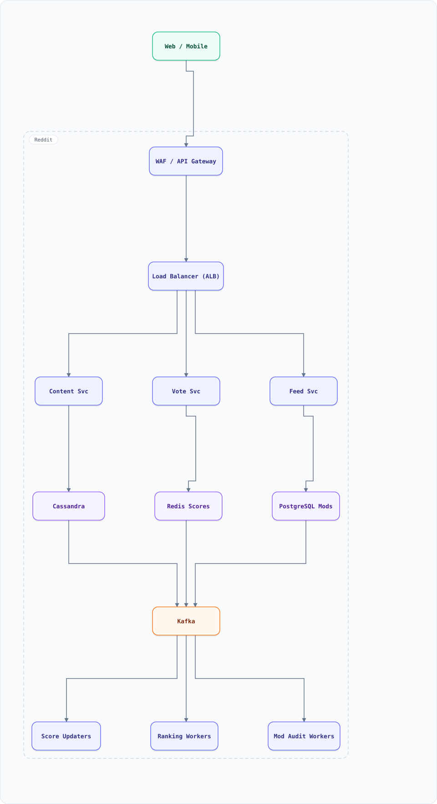

<div align="center">

# System Design: Reddit (Threaded Discussions & Ranking)

</div>

> [!TIP]
> **TL;DR** — A community/link-aggregation platform: threaded comment trees, vote-based ranking with time decay, per-subreddit feeds, and moderation. Distinct from Twitter/Instagram because the core object is a **mutable tree**, not a flat feed.

## Overview

Users post links/text to subreddits; others vote and reply **in nested threads**. Feeds rank by score decayed over time (the classic Reddit "hot" algorithm), comment trees render lazily, and moderation (removal, locking, flair) mutates content after the fact. The design problems: hierarchical storage, decaying ranking, vote dedup, and vote-brigading defense.

### Key Numbers

| Metric | Value |
| :--- | :--- |
| **Posts/day** | 2M+ |
| **Comments/day** | 25M+ (trees avg depth 5, max 30+) |
| **Votes/day** | 100M+ |
| **Subreddits** | 100K+ active, 15K+ highly active |

---

## Requirements

### Functional Requirements

- Create posts (link/text) in subreddits; edit/delete later
- Nested commenting (reply-to-reply, arbitrary depth)
- Upvote/downvote posts and comments; change/cancel votes
- Feeds: home (subscribed), r/all, per-subreddit; sorted hot/new/top/rising
- Moderation: remove, lock, ban, flair, distinguishing mod actions

### Non-Functional Requirements

| Attribute | Target |
| :--- | :--- |
| **Vote latency** | counted within seconds, but ranking updates batched |
| **Feed latency** | < 200ms P99 |
| **Comment tree render** | lazy-load by depth — never load a 10K-comment tree at once |
| **Consistency** | eventual for scores; strong for vote dedup per user |

---

## High-Level Architecture

### Architecture Diagram



**Interactive diagram:** [diagrams/system-design/reddit.architecture.html](diagrams/system-design/reddit.architecture.html) — pan/zoom, search, dark/light theme, PNG/SVG export.


**Interactive diagram:** [diagrams/system-design/reddit.architecture.html](diagrams/system-design/reddit.architecture.html) — pan/zoom, search, dark/light theme, PNG/SVG export.

### Data Flow

1. Post/comment writes go to Content Service → Cassandra (partitioned by post/subreddit)
2. Votes go to Vote Service: one vote per (user, target) enforced via Cassandra LWT; emitted to Kafka
3. Score aggregates updated in Redis; hot-rank scores recomputed on a schedule (every few minutes per post, decaying)
4. Feed queries fan out to per-subreddit post lists (cached), merge and rank at read time
5. Comment trees fetched by `post_id` page-by-page (depth pagination), cached hot paths
6. Moderation actions mutate content rows and emit audit events

## Microservices

| Service | Tech Stack | Database | Pattern |
| --------- | ------------ | ---------- | ---------- |
| Content Service | Java | Cassandra | Tree storage |
| Vote Service | Go | Cassandra LWT + Redis | Idempotency |
| Feed Service | Go | Redis + Cassandra | Fan-out on read |
| Ranking Service | Python | Redis | Time-decay scoring |
| Mod Service | Java | PostgreSQL | Audit log |

---

## Database Design

### Cassandra

```
posts:            PK (subreddit, bucket, post_id) bucket by month
comments_by_post: PK (post_id, parent_path, comment_id)
                  parent_path = materialized path "root.1.4.2"
votes:            PK (target_id, user_id) -> dir(+1/-1)  (dedup + LWT)
scores:           PK (post_id) -> upvotes, downvotes, hot_score
```

### Redis

```bash
feed:{subreddit}:{sort}   -> ZSET of post_ids by score
hot:{post_id}             -> cached hot score
tree:{post_id}:{page}     -> cached comment tree page (TTL 30s)
```

---

## Scaling Tiers

| Tier | Users | Infrastructure | Monthly Cost |
| ------ | ------- | -------------- | ------------- |
| 1K-10K | 10K | 2 app + PostgreSQL (posts, comments, votes) | $300 |
| 10K-1M | 1M | 6 app + Cassandra 3 + Redis + Kafka | $6,000 |
| 1M-10M+ | 10M+ | 20 app + Cassandra 12 + Redis cluster + Kafka + ES search | $60,000 |

---

## Key Techniques & Patterns

- **Time-decay ranking**: hot = f(score, age) — the signature algorithm (below)
- **Materialized paths**: comment trees stored as `parent_path` strings for subtree queries
- **Idempotency**: one vote per user per target via LWT / conditional insert
- **Fan-out on Read**: feeds ranked at request time from cached post lists
- **Hot Keys & Thundering Herd**: viral posts cached aggressively, request coalescing
- **Event-Driven Architecture**: vote events → score updater → ranking recompute

---

## Key Design Decisions

1. **Cassandra for comments/votes**: write-heavy, huge volume, query-by-key access patterns
2. **Materialized path over adjacency list**: subtree fetch = one range scan, no recursion
3. **Batched ranking recompute**: voting is high-frequency; re-ranking every vote is waste — decaying scores recomputed on a timer
4. **Lazy tree pagination**: never materialize 10K-comment threads in one response
5. **Separate vote dedup from aggregates**: strict dedup per user, approximate-at-the-edge aggregates

---

## Failure Modes & Recovery

| Failure | Impact | Mitigation |
| --------- | -------- | ----------- |
| Vote dedup fails | Double-counted votes | LWT + reconciliation job |
| Viral post | Tree page cache stampede | Request coalescing + pre-warm on trend signal |
| Cassandra node loss | Partial comment reads | RF=3, hinted handoff, repair |
| Ranking worker down | Stale hot order | Serve last scores with staleness marker |
| Brigade attack | Manipulated ranking | Vote-pattern anomaly detection, rate limits |

---

## Cost Estimation (1M Users)

| Component | Configuration | Monthly Cost |
| ----------- | -------------- | ------------- |
| App (10) | c7g.xlarge | $1,400 |
| Cassandra (6) | i4i.large | $2,500 |
| Redis (3) | cache.r7g.large | $700 |
| Kafka (3) | m7g.large | $900 |
| Elasticsearch | r7g.large ×3 | $800 |
| **Total** | | **~$6,300** |

---

## Trade-off Analysis

| Decision | Option A | Option B | Choice | Why |
| ---------- | ---------- | ---------- | -------- | ----- |
| Comment storage | Adjacency list | Materialized path | Path | Subtree = single scan |
| Vote store | PostgreSQL row lock | Cassandra LWT | LWT | Write volume at scale |
| Feed | Fan-out on write | Fan-out on read | On read | Subreddit-centric, not follower-centric |
| Ranking | Compute per vote | Periodic recompute | Periodic | Decays make per-vote compute pointless |
| Tree render | Full tree JSON | Depth-paginated | Paginated | Threads can hit 10K+ comments |

---

## Key Metrics to Monitor

1. Votes/second, dedup rejection rate
2. Feed latency P99 per sort type
3. Comment tree fetch depth distribution
4. Ranking recompute lag
5. Cache hit ratio on tree/feed caches
6. Vote-ring detection alerts
7. Cassandra read/write latency, repair status

---

## Deep Dive Prompts

1. How would you implement "best" comment sorting (Wilson score, confidence interval)?
2. Design cross-posting without duplicating storage.
3. How do you count views without counting bots?
4. Design subreddit recommendation ("communities you may like").
5. How do you make r/all ranking region- and language-aware?

---

## Common Interview Follow-ups

1. How would you handle a subreddit going viral mid-Sunday? (cache, coalesce, scale read replicas)
2. How do you store edit history for comments? (event sourcing trade-off)
3. How do you prevent vote manipulation rings? (graph clustering — see fraud-detection)
4. Why not Neo4j for comment trees?
5. How do you delete a 1M-comment tree? (tombstone by post_id, async GC)

---

## Low-Level Design (LLD) - Algorithms & Data Structures

### Reddit "Hot" Ranking (time-decayed score)

```text
function hotScore(up, down, postTimeMs) {
  const score = up - down;
  const order = Math.log10(Math.max(Math.abs(score), 1));
  const sign = score > 0 ? 1 : score < 0 ? -1 : 0;
  const seconds = (postTimeMs - 1134028003650) / 1000; // Reddit epoch
  return sign * order + seconds / 12500; // 12500s ≈ 3.47h half-life-ish decay
}

// top 3 of (10 up/0 down, 4h old) vs (100 up/5 down, 8h old)
const now = Date.now();
console.log(hotScore(10, 0, now - 4 * 3600e3).toFixed(2));
console.log(hotScore(100, 5, now - 8 * 3600e3).toFixed(2));

// deterministic comment-tree page: depth-first with sibling ordering by score
function flattenTree(comments, parentId = null, depth = 0, out = []) {
  const kids = comments
    .filter(c => c.parent === parentId)
    .sort((a, b) => hotScore(b.up, b.down, b.ts) - hotScore(a.up, a.down, a.ts));
  for (const c of kids) {
    out.push({ id: c.id, depth });
    flattenTree(comments, c.id, depth + 1, out);
  }
  return out;
}
```

### Comment-Tree Materialization (fetch any subtree in one query)

Adjacency lists (`parent_id`) need recursive CTEs per read. Precompute a **path prefix** (`/1/4/17/`) so an entire subtree is a single indexed range scan.

```sql
CREATE TABLE comments (
  comment_id BIGINT PRIMARY KEY,
  post_id    BIGINT NOT NULL,
  parent_id  BIGINT,            -- NULL = top-level
  path       LTREE NOT NULL,    -- 'root.1.4.17'  (ancestor chain of ids)
  depth      INT  NOT NULL,
  score      INT DEFAULT 0,
  body       TEXT,
  created_at TIMESTAMPTZ DEFAULT now()
);
CREATE INDEX ON comments (post_id, path);        -- subtree range scan
CREATE INDEX ON comments (post_id, score DESC);  -- "best" ranking

-- entire reply tree under comment 17, depth ≤ 6, in ONE query:
SELECT * FROM comments
WHERE post_id = 42 AND path <@ 'root.1.4.17' AND depth <= 6
ORDER BY path;
```

Why Reddit-style ranking pairs well with this: `score` is denormalized and updated by the vote pipeline; hotness = `log10(max(|score|,1)) + sign(score)·(age_hours)/12.5` — computed at read time per visible page (a page shows ~200 comments, so 200 log() calls beat maintaining a sorted structure per parent). Deletion keeps the row, nulls the body, and flags `deleted` — children keep their path (threads don't vanish).
