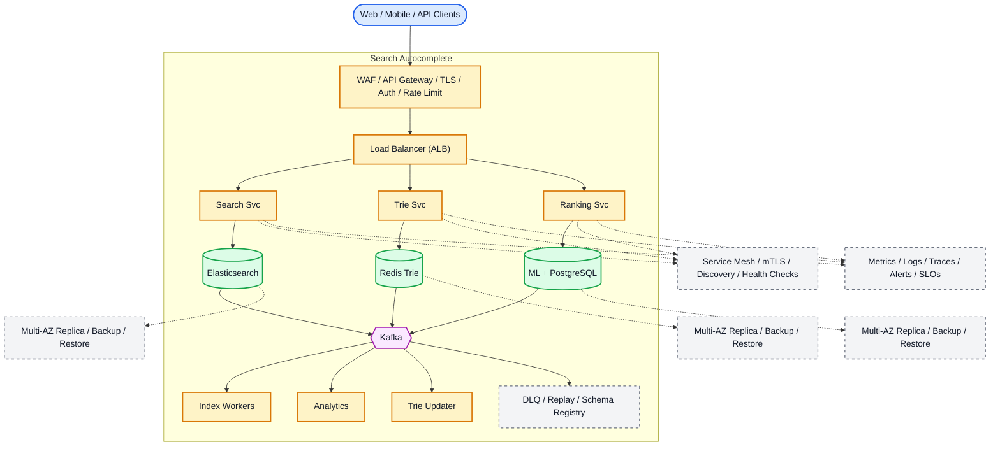

# System Design: Search Autocomplete (Typeahead)

## Overview

A real-time search autocomplete system providing instant suggestions as users type, with < 100ms response time.

### Key Numbers

- 100M+ queries per day
- < 100ms response time
- 10M+ unique search terms
- 100K+ QPS at peak

---

## Requirements

### Functional Requirements

- Show suggestions after 2 chars
- Rank by popularity and recency
- Typo tolerance and fuzzy matching
- Cache popular prefixes
- Track analytics for ranking

### Non-Functional Requirements

- Latency: Suggestion < 100ms
- Throughput: 100K+ queries/sec
- Availability: 99.99% uptime
- Consistency: Eventually consistent
- Scale: 10B+ queries, 1M+ prefixes

---

---

---

## High-Level Architecture

### Architecture Diagram



*Solid = data flow, dashed = control plane / monitoring.*

### Data Flow

1. User types query - Trie Service returns top-5 suggestions (< 50ms)
2. Trie stored in Redis (in-memory, sub-ms lookups)
3. Ranking Service applies ML model: popularity + personalization
4. Full search - Search Service queries Elasticsearch cluster
5. Kafka events: click, impression - update trie popularity scores
6. Background: Trie Updater rebuilds trie hourly from click data
7. Analytics: query volume, CTR, zero-result rate

## Microservices

### 1. Autocomplete Service

- **Responsibility**: Suggest completions as user types
- **Tech**: Go (high performance)
- **DB**: Redis (Trie cache), PostgreSQL (query history)

### 2. Analytics Service

- **Responsibility**: Track search queries, compute popularity
- **Tech**: Python / Flink
- **DB**: ClickHouse (OLAP), Kafka (event stream)

### 3. Trending Service

- **Responsibility**: Real-time trending searches, boost recent popular queries
- **Tech**: Go
- **DB**: Redis (sorted sets)

---

## Database Design

### PostgreSQL

```sql
-- Search Queries (for analytics)
CREATE TABLE search_queries (
    query_id        BIGSERIAL PRIMARY KEY,
    query_text      TEXT NOT NULL,
    user_id         UUID,
    result_count    INT,
    clicked_result  VARCHAR(255),
    searched_at     TIMESTAMP DEFAULT NOW()
);

-- Popular Terms (pre-computed)
CREATE TABLE popular_terms (
    term_id         SERIAL PRIMARY KEY,
    term            VARCHAR(255) UNIQUE NOT NULL,
    frequency       INT DEFAULT 0,
    last_updated    TIMESTAMP DEFAULT NOW()
);
```

### Redis (Trie Cache)

```
# Trie structure in Redis
# Key: trie:{prefix}
# Value: sorted set of completions (score = popularity)

# Example: typing "net"
ZADD trie:net 1000000 "netflix"
ZADD trie:net 500000 "netscape"
ZADD trie:net 200000 "netflix login"

# Get completions for prefix "net"
ZREVRANGE trie:net 0 9 WITHSCORES

# Trending searches
ZADD trending:1min {score} {query}
ZADD trending:5min {score} {query}
```

---

## Scaling Tiers

### Tier 1: 1K - 10K Users

| Component | Choice |
| ----------- | -------- |
| **Compute** | 2 EC2 (t3.large) |
| **Trie** | In-memory (single server) |
| **Cache** | Local cache |
| **Analytics** | PostgreSQL |

### Tier 2: 10K - 1M Users

| Component | Choice |
| ----------- | -------- |
| **Compute** | ECS (10-20 containers) |
| **Trie** | Sharded by prefix |
| **Cache** | Redis Cluster (6 nodes) |
| **Analytics** | ClickHouse |

### Tier 3: 1M - 10M+ Users

| Component | Choice |
| ----------- | -------- |
| **Compute** | Multi-region K8s (100+ pods) |
| **Trie** | Distributed trie (custom) |
| **Cache** | Redis Cluster (30+ nodes) |
| **Analytics** | ClickHouse + Kafka |
| **ML** | Personalized suggestions |

---

## Key Design Decisions

### 1. Why Trie over Elasticsearch?

- Trie: O(L) lookup, in-memory, sub-millisecond
- Elasticsearch: Full-text search, but higher latency
- Use Trie for autocomplete, ES for full search

### 2. Why Cache Popular Prefixes?

- 90% of queries are for top 10% prefixes
- Cache hit ratio > 90%
- Reduces trie lookup load

### 3. Why Analytics Pipeline?

- Popular queries change over time
- Need to update trie frequencies
- Trending topics need real-time tracking

### 4. Why Personalization?

- Same prefix, different suggestions per user
- User history influences suggestions
- A/B test personalization algorithms

---

---

## Failure Modes & Recovery
What can go wrong in production, and how the system detects and recovers:

| Failure | Impact | Recovery |
| --------- | -------- | ---------- |
| Trie node corruption | Returns garbage | Rebuild from analytics, popularity fallback |
| Cache stampede popular prefix | All requests hit trie | Request coalescing, stale-while-revalidate |
| Personalization stale | Suggestions not adapting | Online learning pipeline, periodic refresh |
| Analytics lag | Trending queries not appearing | Near-real-time aggregation, manual boost |
| Typo tolerance aggressive | Irrelevant suggestions | Edit distance tuning, click feedback |
| Multi-language broken | Non-English returns English | Language detection, per-language trie |

---

## Cost Estimation (1M Users)
Rough monthly cost of running this design for one million users:

| Component | Specification | Monthly Cost |
| ----------- | -------------- | ------------- |
| API Servers | 10x c5.xlarge | $1,400 |
| Redis Cluster | 12x cache.r5.xlarge | $9,600 |
| Elasticsearch | 15x m5.xlarge | $6,300 |
| PostgreSQL | db.r5.xlarge + 2 replicas | $3,600 |
| Kafka (analytics) | 3x kafka.m5.large | $1,200 |
| Trie Service | 10x c5.xlarge | $1,400 |
| Analytics Workers | 5x c5.large | $700 |
| **Total** | | **~$24,200/month** |

---

## Trade-off Analysis
The alternatives considered, and which one won and why:

| Approach A | Approach B | Winner | Reason |
| ----------- | ----------- | -------- | -------- |
| Redis Trie | Elasticsearch prefix | Redis Trie | O(K) lookup, in-memory speed |
| TF-IDF | BM25 | TF-IDF | Better for short queries |
| Redis cache | Database cache | Redis | Sub-ms response for hot queries |
| Min-Heap | Sort | Min-Heap | O(N log K) for top-K suggestions |
| Kafka | SQS | Kafka | Higher throughput for query logging |

---

## Key Metrics to Monitor
The metrics that signal system health, with alert thresholds:

| Metric | Description | Target |
| -------- | ------------- | -------- |
| **Autocomplete Latency** | Time to return suggestions | < 50ms (p99) |
| **Cache Hit Rate** | % of prefix lookups from cache | > 90% |
| **Trie Lookup Time** | Time for prefix search | < 10ms |
| **Suggestion Relevance** | % of clicks on top-3 suggestions | > 70% |
| **Trie Update Latency** | Time to update trie with new queries | < 1 minute |
| **Personalization Lift** | CTR improvement from personalization | > 15% |
| **Memory Usage** | Trie memory footprint | < 10GB |
| **Query Coverage** | % of queries with suggestions | > 85% |
| **Trending Detection Speed** | Time to detect trending query | < 5 minutes |
| **Suggestion Freshness** | Average age of suggestions | < 24 hours |

## Deep Dive Prompts

- How does Trie data structure achieve O(K) prefix lookup?
- How do you handle fuzzy matching for typos?
- How do you rank suggestions by time-decay and popularity?
- How do you cache hot queries for sub-50ms responses?

---

## Key Techniques & Patterns
The recurring techniques and patterns this design applies, mapped to where they are used:

| Technique | Description | Used In |
| ----------- | ------------- | ---------- |
| Trie Data Structure | Applied in this system | Architecture + LLD |
| Frequency-Based Ranking | Applied in this system | Architecture + LLD |
| Distributed Caching | Applied in this system | Architecture + LLD |
| Real-time Updates | Applied in this system | Architecture + LLD |
| Personalization | Applied in this system | Architecture + LLD |
| Multi-language Support | Applied in this system | Architecture + LLD |

## Common Interview Follow-ups

**Q: How does Trie work for autocomplete?**
A: Prefix tree, traverse to node, collect children, rank by popularity

**Q: How do you handle typo tolerance?**
A: Levenshtein edit distance, fuzzy matching threshold, phonetic matching

**Q: How do you rank suggestions in real-time?**
A: Popularity with time decay, user history personalization, CTR feedback

---

## Low-Level Design (LLD) - Algorithms & Data Structures

### 1. Trie Data Structure

```text
class TrieNode {
  constructor() { this.children = {}; this.isEnd = false; this.frequency = 0; }
}
class Trie {
  constructor() { this.root = new TrieNode(); }
  insert(word) {
    let node = this.root;
    for (const ch of word.toLowerCase()) {
      if (!node.children[ch]) node.children[ch] = new TrieNode();
      node = node.children[ch];
    }
    node.isEnd = true;
    node.frequency++;
  }
  search(prefix) {
    let node = this.root;
    for (const ch of prefix.toLowerCase()) {
      if (!node.children[ch]) return [];
      node = node.children[ch];
    }
    return this._collect(node, prefix, []).sort((a, b) => b.freq - a.freq).slice(0, 10);
  }
  _collect(node, prefix, results) {
    if (node.isEnd) results.push({ word: prefix, freq: node.frequency });
    for (const [ch, child] of Object.entries(node.children)) {
      this._collect(child, prefix + ch, results);
    }
    return results;
  }
}
```

### 2. Top-K with Min-Heap

```text
class SearchRanker {
  constructor(redisClient) { this.r = redisClient; }
  async rank(query, results) {
    const scores = [];
    for (const r of results) {
      const clicks = parseInt(await this.r.get('clicks:' + r.id) || '0');
      const freshness = (Date.now() - r.createdAt) / (1000 * 3600 * 24);
      const score = clicks * 0.7 + (1 / (freshness + 1)) * 0.3;
      scores.push({ ...r, score });
    }
    return scores.sort((a, b) => b.score - a.score);
  }
}

const trie = new TrieService(); console.log("Trie service ready");
```

### 3. Prefix Ranking with Time Decay

```text
const time = require('time');
const math = require('math');

class DecayRanker {
    // Recent queries get higher scores even with lower frequency.

```

### 4. Personalized Suggestions

```text
class PersonalizedRanker {
    // Personalize suggestions based on user history.
  // Blend user history into the final ranking.
    // Strategy:
    // 1. Get generic top-K suggestions for prefix
    // 2. Boost suggestions that match user's search history

```

### Data Structures Summary

| Component | Data Structure | Time | Space |
| ----------- | --------------- | ------ | ------- |
| **Prefix Lookup** | Trie | O(L) | O(ALPHABET *L* N) |
| **Top-K Selection** | Min-Heap | O(N log K) | O(K) |
| **Trending Score** | Time Decay Formula | O(1) | O(1) |
| **Personalization** | User History (Sorted Set) | O(K) | O(U * H) |
| **Analytics** | ClickHouse (Columnar) | O(1) aggregate | O(N) |

---

### Key Algorithms

### 1. Trie Data Structure (Implementation)

```text
class TrieNode {

```

### 2. Trie Caching (Redis)

```text
class CachedAutocomplete {
    // Cache trie results in Redis
    // - Cache popular prefixes
    // - Invalidate on new data

```

### 3. Popularity Scoring

```text
function calculate_popularity_score(query, time_window_hours=24) {
    // Popularity score = frequency * recency_boost
    // - More recent searches get higher boost
    // - Prevents stale popular queries from dominating

```

### 4. Trending Boost

```text
function get_trending_boost(query) {
    // Boost trending queries in autocomplete
    // - Check 1-min, 5-min, 15-min windows
    // - Weight recent trends higher

```

### 5. Analytics Pipeline

```text
function record_search(query, user_id, result_count) {
    // Record search for analytics
    // - Track popular queries
    // - Update trie frequencies
    // - Compute trending topics
        // "query": query,
        // "user_id": user_id,
        // "result_count": result_count,
    // // Update trie frequency
    // // Update trending

```

---
