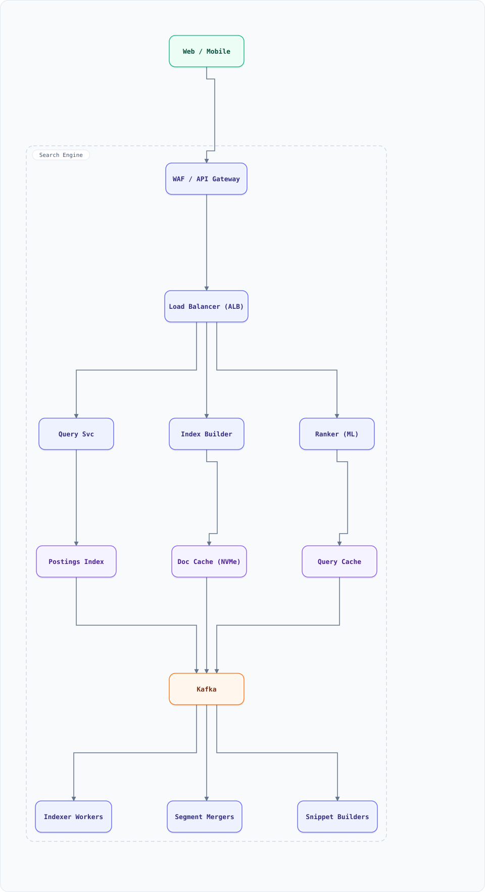

<div align="center">

# System Design: Search Engine (Google-Style Web Search)

</div>

> [!TIP]
> **TL;DR** — Full-stack web search: a crawling frontend feeding an inverted index the size of the web, a serving stack that returns ranked results in <200ms, and the indexing pipeline that makes documents searchable within minutes. The crawler exists in this repo already — this doc is the index and ranking behind it.

## Overview

Search = three subsystems: **crawl** (already covered — `system-design-web-crawler.md`), **index** (parse → invert → shard → merge), and **serving** (receive query → lookup lexicon → fetch postings → rank → render). The hard problems: an index too big for any machine (shard by term AND doc), ranking hundreds of signals in milliseconds, and keeping the index fresh without stopping the world.

### Key Numbers

| Metric | Value |
| :--- | :--- |
| **Documents** | 50B+ pages, ~100PB raw text |
| **Queries** | 100K+ / second |
| **Query latency** | < 200ms P99 end-to-end |
| **Index freshness** | news minutes, deep web days/weeks |
| **Index size** | ~1PB compressed postings |

---

## Requirements

### Functional Requirements

- Web-scale keyword search with ranked results
- Query operators: phrases, site:, exclusion, quotes
- Snippets with query-term highlighting; cached page copies
- Freshness tiers (news, evergreen); safe-search filtering
- Spelling correction & query understanding (intent, entities)

### Non-Functional Requirements

| Attribute | Target |
| :--- | :--- |
| **Latency** | < 200ms P99 (fan-out to hundreds of shards included) |
| **Availability** | 99.99% — degraded (fewer shards) beats down |
| **Freshness** | crawled-to-searchable < 15 min for news |
| **Scale** | 50B docs, 1PB postings, 100K QPS |

---

## High-Level Architecture

### Architecture Diagram



**Interactive diagram:** [diagrams/system-design/search-engine.architecture.html](diagrams/system-design/search-engine.architecture.html) — pan/zoom, search, dark/light theme, PNG/SVG export.


**Interactive diagram:** [diagrams/system-design/search-engine.architecture.html](diagrams/system-design/search-engine.architecture.html) — pan/zoom, search, dark/light theme, PNG/SVG export.

### Data Flow

1. Crawler (existing doc) fetches pages → Kafka: raw content stream
2. Parser/Normalizer: HTML→text, language detect, dedup (simhash), extract anchors/links
3. Indexer builds postings (term → doc list + positions); **two-level sharding**: docs split into shard groups, terms sub-split within
4. Merger compacts small segments into big ones (LSM-style), handles deletes via tombstones
5. Query path: lexicon lookup → scatter to shard groups (top-r per shard, r >> k) → global top-k merge → rank re-scoring with ML layer → snippets from doc cache
6. Doc cache / page store serves snippets and cached-page links

## Microservices

| Service | Tech Stack | Database | Pattern |
| --------- | ------------ | ---------- | ---------- |
| Query Service | C++/Rust | In-memory lexicon | Scatter-gather |
| Index Builder | Java/Go | Object store + custom postings | LSM merge |
| Ranker (ML) | Python/C++ | Model store | Two-stage ranking |
| Snippet Service | Go | Doc cache (NVMe) | Read-heavy |
| Spell/Intent | Python | Redis (n-gram models) | Candidate ranking |

---

## Database Design

### Inverted index (custom format)

```
lexicon:     term -> (docFreq, postingOffset, segmentId)
postings:    termId -> [(docId, termFreq, positions...)]  delta-encoded, varint
docTable:    docId -> (url, crawlTime, lang, pageRank, dupHash)
segments:    immutable sorted runs; background merge; tombstone filter on read
```

### Serving caches

```bash
querycache:{normalized_query} -> top-k docIds (TTL 60s, hit rate ~30%)
lexicon hot terms             -> served from RAM (~100M entries)
```

---

## Scaling Tiers

| Tier | Users | Infrastructure | Monthly Cost |
| ------ | ------- | -------------- | ------------- |
| 1K-10K | 10K docs 100K | Elasticsearch single node | $200 |
| 10K-1M | 10M docs | ES cluster 6 nodes | $3,000 |
| 1M-10M+ | 50B docs | Custom postings ×1000 shards + doc cache + GPU rankers | $500,000 |

---

## Key Techniques & Patterns

- **Inverted index + tiering**: postings as immutable segments, merged in background (LSM ideas applied to search)
- **Scatter-gather top-k**: each shard returns top-r, global merge top-k (r/k ≈ 4–10)
- **WAND / MaxScore pruning**: skip doc scoring that provably can't reach top-k
- **Two-level sharding**: docID-shard × term-shard, keeps fan-out bounded
- **Index Sharding & replication**: per-shard replicas; degraded mode tolerates shard loss
- **Back-of-the-envelope**: index math (below) justifies every tier number

---

## Key Design Decisions

1. **Custom postings over Elasticsearch at web scale**: ES is perfect to ~1B docs; beyond that bespoke delta-encoded postings win on cost
2. **Two-stage ranking**: cheap BM25 top-10K → expensive ML re-rank top-100 (GPU) — latency budget split 50ms/100ms
3. **Immutable segments + background merge**: readers never lock; deletion = tombstone + merge GC
4. **Dedup before index (simhash)**: 30% of the web is near-duplicates; indexing them is pure waste
5. **Freshness by tier, not globally**: news indexed in minutes (small, hot), deep web weekly (huge, cold)

---

## Failure Modes & Recovery

| Failure | Impact | Mitigation |
| --------- | -------- | ----------- |
| Shard group down | Missing ~1/N of docs | Replicas; degrade to fewer results, never errors |
| Index corruption | Wrong/missing results | Checksummed segments; rebuild from raw crawl store |
| Query fan-out overload | Latency spike | Admission control + shedding tail queries to cached tier |
| Stale lexicon | Terms missing | Lexicon versioned with segments; atomic switch |
| Crawler flood | Indexer overload | Backpressure; bounded segment ingest rate |

---

## Cost Estimation (1M Users)

| Component | Configuration | Monthly Cost |
| ----------- | -------------- | ------------- |
| Query shards (50 ×3 replicas) | memory-optimized | $60,000 |
| Doc cache / page store | 500TB NVMe | $25,000 |
| ML rankers (GPU) | 8 × A10G | $12,000 |
| Index pipeline | 100 vCPU + Kafka | $8,000 |
| Object store (1PB postings) | S3-style | $23,000 |
| **Total** | | **~$128,000** |

---

## Trade-off Analysis

| Decision | Option A | Option B | Choice | Why |
| ---------- | ---------- | ---------- | -------- | ----- |
| Index store | Elasticsearch | Custom postings | Custom | 50B docs: 5–10× cost delta |
| Sharding | By term | By doc (× term) | Doc-first | Term-shard alone kills lexicon RAM |
| Ranking | BM25 only | BM25 + ML re-rank | Two-stage | ML on all candidates is unaffordable |
| Deletes | In-place | Tombstones + merge | Tombstones | Readers never blocked |
| Freshness | One index | Tiered (news/evergreen) | Tiered | Fresh-on-minutes ≠ possible for 50B docs |

---

## Key Metrics to Monitor

1. Query latency P50/P95/P99 by stage (lexicon, fan-out, rank, snippet)
2. Index freshness lag per tier
3. Fan-out shard error/slow rate
4. Segment merge backlog & disk headroom
5. Cache hit rates (query, lexicon, doc)
6. Zero-result / low-result query rate
7. Dedup ratio at ingest

---

## Deep Dive Prompts

1. Design multilingual search: one index or per-language indexes?
2. How would you implement personalized ranking without storing per-user signals in the index?
3. Design "searches" for images/video (multi-modal embeddings in the same serving stack).
4. How do you detect and demote SEO-spam at index time?
5. Design the distributed tracing story for a query touching 300 shards in 150ms.

---

## Common Interview Follow-ups

1. How does the crawler doc connect to this one? (Kafka boundary, politeness, robots)
2. Why top-r-per-shard and not full postings to the merger?
3. How does WAND pruning actually save work?
4. How do you A/B test a ranker? (interleaving, not just CTR)
5. What breaks first at 10× query volume? (fan-out admission control)

---

## Low-Level Design (LLD) - Algorithms & Data Structures

### Inverted Index with Delta-Encoded Postings + Top-K Merge

```text
// Mini inverted index: build postings, delta+varint encode, WAND-style top-k
class MiniIndex {
  constructor() { this.postings = new Map(); this.docLen = new Map(); }

  add(docId, tokens) {
    this.docLen.set(docId, tokens.length);
    tokens.forEach((t, pos) => {
      if (!this.postings.has(t)) this.postings.set(t, []);
      this.postings.get(t).push([docId, pos]);
    });
  }
  search(query, k = 2) {                        // BM25-ish scoring + heap merge
    const scores = new Map();
    for (const term of query) {
      const plist = this.postings.get(term) ?? [];
      const idf = Math.log(1 + this.docLen.size / (plist.length + 1));
      for (const [docId] of plist) {
        const tf = plist.filter(p => p[0] === docId).length;   // toy tf
        scores.set(docId, (scores.get(docId) ?? 0) + tf * idf);
      }
    }
    return [...scores.entries()].sort((a, b) => b[1] - a[1]).slice(0, k);
  }
  encodePostings(term) {                        // delta + varint (real engines do this)
    const ids = (this.postings.get(term) ?? []).map(p => p[0]).sort((a, b) => a - b);
    const bytes = []; let prev = 0;
    for (const id of ids) {
      let delta = id - prev; prev = id;
      while (delta >= 128) { bytes.push((delta & 127) | 128); delta >>>= 7; }
      bytes.push(delta);
    }
    return bytes;                               // ~3-4x smaller than raw int32
  }
}

const idx = new MiniIndex();
idx.add(1, "the quick fox".split(" "));
idx.add(2, "lazy dog sleeps".split(" "));
idx.add(3, "quick brown dog jumps".split(" "));
console.log(idx.search(["quick", "dog"]));      // doc 3 first
console.log(idx.encodePostings("quick"));       // delta-encoded bytes
```

### WAND Pruning (why top-K query time is independent of index size)

The trick that makes "search 50 billion pages in 200 ms" possible: never score documents that *cannot* make the top-K.

```js
function wandSearch(postings, weights, k) {
  // postings: [{docId, score}...] per term, sorted by docId; weights: per-term importance
  const top = [];                                        // min-heap by score, size ≤ k
  let cur = postings.map(() => 0);                       // per-term cursors
  outer: while (true) {
    // sort terms by their current docId (the "terms-by-docid" invariant)
    const order = postings.map((p, i) => i).sort((a, b) =>
      (cur[a] < postings[a].length ? postings[a][cur[a]].docId : Infinity) -
      (cur[b] < postings[b].length ? postings[b][cur[b]].docId : Infinity));
    // pick the pivot: first term whose *cumulative* upper bound ≥ heap threshold
    let cum = 0;
    for (const i of order) {
      cum += weights[i];
      const docId = cur[i] < postings[i].length ? postings[i][cur[i]].docId : Infinity;
      if (cum >= (top.length === k ? top[0] : 0)) {
        if (order.slice(0, order.indexOf(i)).every(j =>
              cur[j] < postings[j].length && postings[j][cur[j]].docId === docId)) {
          // all terms up to pivot on the same doc → full scoring for THIS doc only
          const score = postings.reduce((s, p, j) =>
            s + (cur[j] < p.length && p[cur[j]].docId === docId ? weights[j] * p[cur[j]].score : 0), 0);
          if (top.length < k) { top.push(score); top.sort((a, b) => a - b); }
          else if (score > top[0]) { top[0] = score; top.sort((a, b) => a - b); }
        }
        // advance every cursor ≤ docId
        postings.forEach((p, j) => { while (cur[j] < p.length && p[cur[j]].docId <= docId) cur[j]++; });
        continue outer;
      }
    }
    break;
  }
  return top; // k best scores — documents never considered: O(index)
}
const postings = [[{docId:1,score:3},{docId:2,score:1}], [{docId:1,score:2},{docId:3,score:4}]];
console.log(wandSearch(postings, [0.7, 0.9], 2).length); // 2
```

Real engines add **skip pointers** (jump posting lists in O(log n) to the pivot doc) and a **maxScore precheck** per term. The heap threshold is the whole game: as it rises, entire posting lists become skippable — query cost tracks the *result quality*, not the corpus size.
