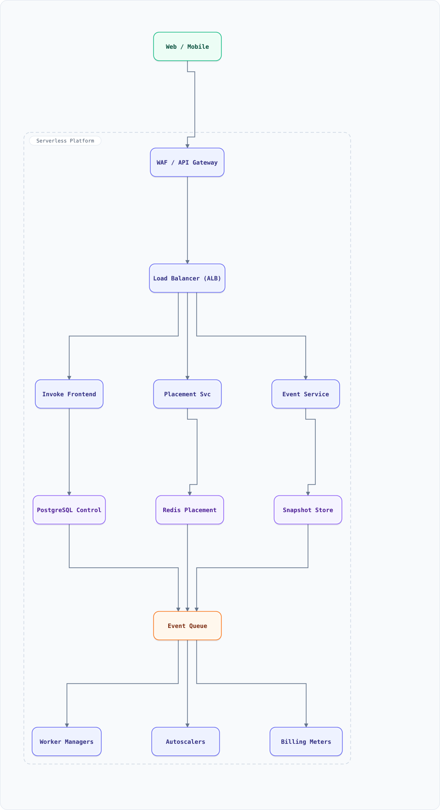

<div align="center">

# System Design: Serverless Platform (AWS Lambda-style)

</div>

> [!TIP]
> **TL;DR** — A Function-as-a-Service platform: users upload code, the platform runs it on demand in milliseconds using microVM snapshots (Firecracker-style), scales from zero to thousands of workers, and bills per 1ms — a scheduling and isolation problem disguised as "just run my function."

## Overview

Serverless = a container/microVM orchestrator with brutal constraints: cold-start < 100ms, per-1ms billing, security isolation between strangers' code, and traffic that can spike 100× in a minute. The design core: **warm worker pools**, **microVM snapshots restore**, **predictive pre-warming**, and per-request scheduling — where the scheduler is the product.

### Key Numbers

| Metric | Value |
| :--- | :--- |
| **Invocations** | 100K+ / second per region |
| **Cold start** | < 100ms (snapshot restore), < 1s (full init) |
| **Function size** | 50MB–10GB (incl. layers) |
| **Billing granularity** | 1ms of CPU+memory |
| **Isolation** | microVM (KVM) per worker |

---

## Requirements

### Functional Requirements

- Upload/deploy function code + config (memory, timeout, env, VPC)
- Invoke sync (response) and async (events, queues, streams)
- Scale to zero; scale out on load; per-function concurrency limits
- Logs + metrics emitted automatically
- Versions/aliases with weighted traffic shifting

### Non-Functional Requirements

| Attribute | Target |
| :--- | :--- |
| **Cold-start** | < 100ms for snapshot-restored workers |
| **Isolation** | tenant-level (KVM microVMs, not just containers) |
| **Multi-tenancy** | thousands of tenants per fleet, noisy-neighbor-proof |
| **Billing accuracy** | per-1ms, auditable |

---

## High-Level Architecture

### Architecture Diagram



**Interactive diagram:** [diagrams/system-design/serverless.architecture.html](diagrams/system-design/serverless.architecture.html) — pan/zoom, search, dark/light theme, PNG/SVG export.


**Interactive diagram:** [diagrams/system-design/serverless.architecture.html](diagrams/system-design/serverless.architecture.html) — pan/zoom, search, dark/light theme, PNG/SVG export.

### Data Flow

1. Invoke → Frontend → auth → **Placement Svc** decides: warm worker with matching (function, memory) → reuse; else cold path
2. Cold path: **Worker Manager** pulls image layers (cached at host NVMe), restores microVM **snapshot** (memory pages mmap'd), runs init hooks
3. Sync invoke: response streamed back through frontend; async: event → queue → invoke workers
4. **Autoscaler** (per function): tracks concurrency + queue depth; predictive pre-warm from traffic forecast (weekly seasonality)
5. Sandbox teardown: wipe state, return host resources; snapshots make this cheap
6. Billing meter: per-worker CPU/memory-time; 1ms resolution; async pipeline to billing

## Microservices

| Service | Tech Stack | Database | Pattern |
| --------- | ------------ | ---------- | ---------- |
| Invoke Frontend | Rust | Redis (route cache) | Admission + routing |
| Placement Service | Go | PostgreSQL + Redis | Bin-packing scheduler |
| Worker Manager | Go | none (host agent) | Firecracker lifecycle |
| Event Service | Java | Kafka | Async dispatch |
| Billing Meter | Go | ClickHouse | Usage aggregation |

---

## Database Design

### Control plane (PostgreSQL) + host state

```sql
CREATE TABLE functions (
  fn_id UUID PRIMARY KEY, tenant_id BIGINT, runtime TEXT,
  memory_mb INT, timeout_s INT, code_key TEXT, version INT
);
CREATE TABLE fn_versions (
  fn_id UUID, version INT, snapshot_key TEXT, layer_keys TEXT[],
  created_at TIMESTAMPTZ, PRIMARY KEY (fn_id, version)
);
CREATE TABLE concurrency_limits (
  fn_id UUID, max_concurrent INT, reserved INT, PRIMARY KEY (fn_id)
);
```

### Host/worker state (Redis)

```bash
worker:{host}:free            -> sorted set of worker slots (by memory)
fn:{fn_id}:warm_workers       -> set of warm worker ids (per AZ)
fn:{fn_id}:inflight           -> counter (admission + scaling signal)
snapshot:{fn}:{version}       -> S3 key of memory snapshot + page cache
```

---

## Scaling Tiers

| Tier | Users | Infrastructure | Monthly Cost |
| ------ | ------- | -------------- | ------------- |
| 1K-10K | 10K | AWS Lambda (use managed) | pay-per-use |
| 10K-1M | 1M | 20 hosts + placement + Redis + Kafka | $6,000 |
| 1M-10M+ | 10M+ | 2,000 hosts multi-AZ + snapshot CDN + placement sharding | $400,000 |

---

## Key Techniques & Patterns

- **MicroVM snapshots**: memory serialized once at init; restore = mmap pages → ~90ms cold start
- **Predictive pre-warming**: forecast per-function traffic (weekly seasonality); pre-place workers before the spike
- **Bin-packing placement**: functions onto hosts (memory is the constraint); swaps cost warm workers
- **Continuous Batching Scheduler**: group concurrent invokes onto shared GPU/CPU (analog of the LLM-inference doc)
- **Hot Keys & Thundering Herd**: viral functions = one function consuming a fleet; per-fn concurrency limits
- **Backpressure**: queue-depth-based admission during cold-start storms

---

## Key Design Decisions

1. **Firecracker microVMs over containers**: strangers' code on shared hardware needs hardware virtualization, not namespaces
2. **Snapshot-first cold start**: init once at deploy time, restore everywhere — the single biggest UX win
3. **Warm pool per (function, AZ), not global**: cross-AZ worker reuse adds latency; local pools absorb bursts
4. **Scale-to-zero via snapshot eviction**: idle workers torn down; snapshots in object storage make re-warm cheap
5. **Per-1ms metering from the hypervisor**: billing from host agent, not function runtime (untrusted)

---

## Failure Modes & Recovery

| Failure | Impact | Mitigation |
| --------- | -------- | ----------- |
| Host failure | All workers on host die | Frontend retries on another host; async events redeliver |
| Snapshot corruption | Function won't start | Checksummed snapshots; fall back to full init |
| Cold-start storm (viral fn) | Queue explodes | Pre-warm burst pool; admission control; queue-time alerts |
| Noisy neighbor (CPU steal) | Latency for others | cgroup/VM-level CPU quotas; placement diversity |
| Placement DB partition | No new placements | Frontend serves from warm cache; degrade to local pools |

---

## Cost Estimation (1M Users)

| Component | Configuration | Monthly Cost |
| ----------- | -------------- | ------------- |
| Worker hosts (40) | i4i.4xlarge NVMe | $14,000 |
| Placement + frontend (10) | c7g.xlarge | $1,200 |
| Snapshot store | 20TB S3-style | $450 |
| Kafka + billing pipeline | m7g.large ×3 | $900 |
| **Total** | | **~$16,550** |

---

## Trade-off Analysis

| Decision | Option A | Option B | Choice | Why |
| ---------- | ---------- | ---------- | -------- | ----- |
| Isolation | Containers | Firecracker microVM | MicroVM | Multi-tenant security bar |
| Cold start | Full init each time | Snapshot restore | Snapshot | 10× faster UX |
| Placement | Per-request bin-pack | Warm pools | Warm pools | Placement is too slow for hot path |
| Scale signal | CPU | Concurrency + queue depth | Concurrency | Matches billing + load truth |
| Billing | Function-reported | Hypervisor-metered | Hypervisor | Untrusted runtime can't lie |

---

## Key Metrics to Monitor

1. Cold-start P99 (snapshot restore path)
2. Warm-worker reuse rate
3. Queue depth + admission delay per function
4. Placement bin-packing efficiency (host memory utilization)
5. Snapshot restore failure rate
6. Billing meter drift vs actual CPU-time
7. Per-tenant isolation violations (target: 0)

---

## Deep Dive Prompts

1. Design VPC networking for serverless (ENI cold-start problem, NAT costs).
2. How would you support stateful functions (durable execution, Temporal-style)?
3. Design the GPU variant: fractional GPUs across tenants (MIG slicing + scheduling).
4. How does the platform prevent covert channels between tenants?
5. Design "provisioned concurrency" economics: who pays for idle warmth?

---

## Common Interview Follow-ups

1. Why not containers? (shared kernel escape risk across tenants)
2. What limits minimum cold-start? (page-in + init hooks + networking)
3. How do you route an invoke to the same worker for connection reuse? (session affinity trade-off)
4. How do you handle a function that pins 10GB memory at 100K QPS?
5. Compare with Cloud Run / Knative-style container-per-tenant designs.

---

## Low-Level Design (LLD) - Algorithms & Data Structures

### Placement + Predictive Pre-Warm

```text
// Bin-packing placement: best-fit by memory over free worker slots
class Placement {
  constructor() { this.slots = [{ host: "h1", memFree: 3000 }, { host: "h2", memFree: 7000 }]; }

  place(fnId, memMb) {
    let best = null;
    for (const s of this.slots) {
      if (s.memFree >= memMb && (!best || s.memFree < best.memFree)) best = s; // tightest fit
    }
    if (!best) return { ok: false };
    best.memFree -= memMb;
    return { ok: true, host: best.host };
  }
}

// Predictive pre-warm: keep warm = forecast(nextWindow) with safety margin
function forecastInvocations(historyPerMin, seasonality = 1.0) {
  const avg = historyPerMin.reduce((a, b) => a + b, 0) / historyPerMin.length;
  const trend = (historyPerMin.at(-1) - historyPerMin[0]) / historyPerMin.length;
  return Math.max(0, Math.ceil((avg + trend) * seasonality * 1.2)); // 20% headroom
}

const p = new Placement();
console.log(p.place("fn-img-resize", 1500));            // h1 (tightest fit)
console.log(forecastInvocations([10, 12, 11, 13, 40])); // pre-warm target

// Scale-to-zero: evict idle warm workers (LRU)
function evictIdle(warmWorkers, maxIdleMs = 15 * 60e3) {
  const now = Date.now();
  return warmWorkers.filter(w => now - w.lastUse < maxIdleMs);
}
```

### Cold-Start Telemetry & Pre-Warm Governor

Cold starts are the FaaS tax; production platforms watch the p99 and pre-warm just enough — never fleets of idle containers.

```js
class PreWarmGovernor {
  constructor(opts = {}) {
    this.window = [];                    // recent invocation timestamps (ms)
    this.maxWindowMs = 60_000;
    this.warmPool = [];                  // ready instances
    this.spawnMs = opts.spawnMs ?? 400;  // cold-start cost
    this.maxIdle = opts.maxIdle ?? 30;   // never keep more than this warm
  }
  record(ts = Date.now()) {
    this.window.push(ts);
    while (this.window[0] < ts - this.maxWindowMs) this.window.shift();
    const rps = this.window.length / (this.maxWindowMs / 1000);
    // demand = arrival rate × spawn time (Little's law) + headroom; cap the pool
    const target = Math.min(this.maxIdle, Math.ceil(rps * (this.spawnMs / 1000)) + 1);
    while (this.warmPool.length < target) this.warmPool.push({ readyAt: ts + this.spawnMs });
    while (this.warmPool.length > target && this.warmPool[0].readyAt <= ts) this.warmPool.shift();
    return { rps: +rps.toFixed(1), warm: this.warmPool.length };
  }
  acquire(ts = Date.now()) {
    const idx = this.warmPool.findIndex(w => w.readyAt <= ts);
    if (idx >= 0) return { cold: false, waitMs: 0 };
    this.warmPool.push({ readyAt: ts + this.spawnMs });       // cold serve + replace
    return { cold: true, waitMs: this.spawnMs };
  }
}
const g = new PreWarmGovernor();
for (let i = 0; i < 50; i++) g.record();          // burst of 50 req in the last window
console.log(JSON.stringify(g.record()));          // {"rps":0.8,"warm":2} — pool sized to demand, capped at 30
console.log(g.acquire());                         // { cold: true, waitMs: 400 } — none ready YET
console.log(g.acquire(Date.now() + 400).cold);    // false — after spawn time, served warm
```

Real systems add snapshot-restore (Firecracker VM snapshots restore in ~10 ms vs 400 ms boot), tiered pre-warming by function popularity (top-100 functions always warm, tail on demand), and **keep-alive pingers** on cloud FaaS where the provider reaps idle instances at 10–15 min.
