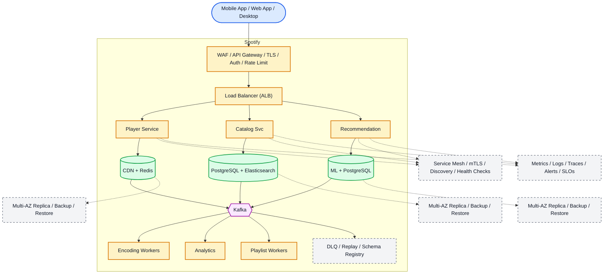

# System Design: Spotify (Music Streaming Platform)

## Overview

Music streaming service with personalized playlists, podcast hosting, social features, and offline listening for 600M+ users.

### Key Numbers

- 600M+ users (220M+ premium)
- 100M+ tracks
- 5M+ podcasts
- Sub-200ms audio start
- 4B+ playlist saves

---

## Requirements

### Functional Requirements

- Stream music with adaptive bitrate quality
- Create, share, and discover playlists
- Personalized recommendations (Discover Weekly, Release Radar)
- Search tracks, artists, albums, podcasts
- Social features: follow artists, share activity
- Offline download for premium users

### Non-Functional Requirements

- Latency: Audio start < 200ms, search < 100ms
- Throughput: 20M+ concurrent streams
- Availability: 99.99%
- Consistency: Eventually consistent for recommendations
- Scale: 600M+ registered users

---

## High-Level Architecture

### Architecture Diagram



*Solid = data flow, dashed = control plane / monitoring.*

### Data Flow

1. User searches - Catalog Service queries Elasticsearch
2. Recommendation ML builds personalized Discover Weekly
3. User plays track - Player Service streams from CDN
4. Offline mode: DRM-encrypted tracks downloaded locally
5. Scrobble events - Kafka - Analytics (listening history)
6. Playlist management: collaborative playlists via CDC
7. Encoding pipeline: transcode to multiple bitrates per track

## Microservices
How the system is decomposed into independently deployed services:

| Service | Responsibility | Tech Stack | Pattern |
| --------- | --------------- | ------------ | --------- |
| Audio Service | Stream audio with adaptive bitrate | Go, CDN | P2P + CDN |
| Recommendation Service | Discover Weekly, Release Radar | Python, TensorFlow | ML Pipeline |
| Playlist Service | Create, share, collaborative playlists | Java, Cassandra | Event Sourcing |
| Search Service | Track, artist, album search | Elasticsearch, Redis | Search + Autocomplete |
| Social Service | Follow, activity feed, sharing | Node.js, Neo4j | Fan-out |
| Library Service | User library, history, downloads | PostgreSQL, Redis | CQRS |

---

## Database Design
The data stores, schemas, and access patterns behind each service:

```sql
CREATE TABLE tracks (
    track_id UUID PRIMARY KEY, title VARCHAR(255),
    artist_id UUID, album_id UUID, duration_ms INT,
    isrc VARCHAR(20), explicit BOOLEAN DEFAULT FALSE,
    preview_url TEXT, created_at TIMESTAMP DEFAULT NOW()
);

CREATE TABLE playlists (
    playlist_id UUID PRIMARY KEY, owner_id UUID NOT NULL,
    name VARCHAR(255), description TEXT,
    is_public BOOLEAN DEFAULT TRUE,
    created_at TIMESTAMP DEFAULT NOW()
);

CREATE TABLE user_library (
    user_id UUID, track_id UUID,
    added_at TIMESTAMP DEFAULT NOW(),
    PRIMARY KEY (user_id, track_id)
);
```

---

## Scaling Tiers

### 1K - 10K Users ($500/mo)

- Single PostgreSQL, 2 Redis, S3 for audio storage

### 10K - 1M Users ($20K/mo)

- PostgreSQL read replicas, Redis cluster
- CDN for audio delivery, Kafka for events
- Elasticsearch for search

### 1M - 10M+ Users ($800K/mo)

- Cassandra for playlists, Neo4j for social graph
- 100+ Redis instances for caching
- Multi-region CDN, ML recommendation pipeline

---

## Key Techniques & Patterns
The recurring techniques and patterns this design applies, mapped to where they are used:

| Technique | Description | Used In |
| ----------- | ------------- | ---------- |
| Adaptive Bitrate Streaming | Adjust quality based on bandwidth | Audio Service |
| CDN Edge Caching | Serve audio from edge locations | Audio Service |
| Collaborative Filtering | User-item matrix for recommendations | Recommendation |
| Content-Based Filtering | Audio feature analysis for similar tracks | Recommendation |
| Redis Caching | Cache hot playlists and user sessions | All services |
| Kafka Event Streaming | Process play events for analytics | All services |
| Elasticsearch | Full-text search for tracks/artists | Search Service |
| Graph Database (Neo4j) | Social connections and follows | Social Service |
| SOLID Principles | Single Responsibility per microservice | All services |
| Circuit Breaker | Graceful degradation on failure | All services |

---

## Key Design Decisions
The choices that shape this architecture, and why each was made:

| Decision | Choice | Why |
| ---------- | -------- | ----- |
| Audio Format | Ogg Vorbis / AAC | Better compression than MP3 |
| Recommendation | Collaborative + Content-based | Hybrid improves accuracy |
| Playlist Storage | Cassandra | High write throughput, wide columns |
| Social Graph | Neo4j | Efficient graph traversals for follows |
| Search | Elasticsearch | Full-text + autocomplete support |
| Offline Storage | S3 + DRM | Encrypted downloads for premium |

---

## Failure Modes & Recovery
What can go wrong in production, and how the system detects and recovers:

| Failure | Impact | Recovery |
| --------- | -------- | ---------- |
| CDN node failure | Audio playback fails | Route to next-nearest edge |
| Recommendation Svc down | No personalized recs | Fall back to popular tracks |
| Cassandra failure | Playlist unavailable | Serve from Redis cache |
| Kafka broker down | Event processing stops | Queue events, process later |
| Search index corrupt | No search results | Rebuild from database |

---

## Cost Estimation (1M Users)
Rough monthly cost of running this design for one million users:

| Component | Monthly Cost |
| ----------- | ------------- |
| CDN (audio delivery, 50TB) | $4,000 |
| Compute (6 microservices) | $8,000 |
| Cassandra cluster | $3,000 |
| Redis cluster (50GB) | $2,500 |
| Elasticsearch cluster | $2,000 |
| ML inference (recommendations) | $3,000 |
| S3 (audio storage, 100TB) | $2,300 |
| Monitoring | $1,000 |
| Total | ~$25,800 |

---

## Trade-off Analysis
The alternatives considered, and which one won and why:

| Trade-off | Option A | Option B | Winner | Why |
| ----------- | ---------- | ---------- | -------- | ----- |
| Audio Format | MP3 | Ogg Vorbis | Ogg | Better compression, smaller files |
| Recommendation | Collaborative | Content-based | Hybrid | Best of both approaches |
| Playlist Storage | PostgreSQL | Cassandra | Cassandra | High write throughput |
| Social Graph | PostgreSQL | Neo4j | Neo4j | Efficient graph traversals |
| Offline | Stream only | Download + DRM | Download | Premium feature, user retention |

---

## Key Metrics to Monitor
The metrics that signal system health, with alert thresholds:

| Metric | Target | Alert Threshold |
| -------- | -------- | ----------------- |
| Audio Start Latency P99 | < 200ms | > 500ms |
| Search Latency P99 | < 100ms | > 300ms |
| Stream Buffering Rate | < 0.1% | > 1% |
| Recommendation CTR | > 5% | < 2% |
| CDN Cache Hit Rate | > 95% | < 85% |

---

## Deep Dive Prompts

1. **How does Spotify achieve sub-200ms audio start time?**
2. **Explain the recommendation algorithm for Discover Weekly.**
3. **How would you handle collaborative playlists with conflict resolution?**
4. **Design the offline download and DRM system.**
5. **How does adaptive bitrate streaming work?**
6. **Explain the social activity feed architecture.**

---

## Common Interview Follow-ups

**Q: How does Spotify handle 20M concurrent streams?**
A: CDN edge caching serves audio from nearby nodes. Adaptive bitrate adjusts quality based on bandwidth. Client-side caching stores recently played tracks. Load balancer distributes across streaming servers.

**Q: How do recommendations work?**
A: Collaborative filtering analyzes user-item interactions (plays, saves, skips). Content-based filtering analyzes audio features (tempo, key, energy). Hybrid approach combines both with contextual signals (time of day, device).

---

## Low-Level Design (LLD)

### 1. Adaptive Bitrate Selector

```text
class AdaptiveBitrate {
  constructor() {
    this.qualities = [
      { kbps: 96, label: "low" },
      { kbps: 160, label: "normal" },
      { kbps: 320, label: "high" }
    ];
  }

  selectQuality(bandwidthKbps, bufferSeconds) {
    if (bufferSeconds < 5) return this.qualities[0];
    if (bufferSeconds < 15) return this.qualities[1];
    for (let i = this.qualities.length - 1; i >= 0; i--) {
      if (bandwidthKbps >= this.qualities[i].kbps * 1.5) {
        return this.qualities[i];
      }
    }
    return this.qualities[0];
  }
}
```

### 2. Playlist Manager

```text
class PlaylistManager {
  constructor(cassandraClient) {
    this.db = cassandraClient;
  }

  async addTrack(playlistId, trackId, position) {
    await this.db.execute(
      "INSERT INTO playlist_tracks (playlist_id, position, track_id) VALUES (?, ?, ?)",
      [playlistId, position, trackId]
    );
    await this.db.execute(
      "UPDATE playlists SET updated_at = NOW() WHERE playlist_id = ?",
      [playlistId]
    );
  }

  async getTracks(playlistId, limit = 50) {
    const result = await this.db.execute(
      "SELECT * FROM playlist_tracks WHERE playlist_id = ? ORDER BY position LIMIT ?",
      [playlistId, limit]
    );
    return result.rows;
  }
}

const audio = new AudioService(); console.log("Audio service ready");
```
