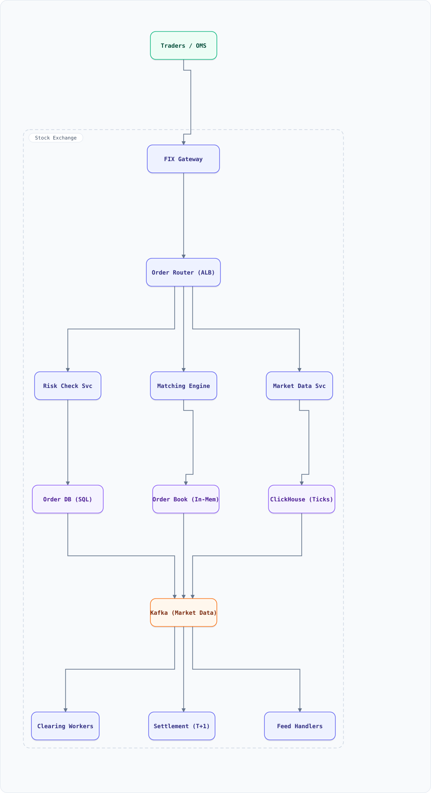

<div align="center">

# System Design: Stock Exchange (Matching Engine)

</div>

> [!TIP]
> **TL;DR** — Design the core trading platform of a stock exchange (NSE / NASDAQ / BSE-style): order intake from broker OMSs, a deterministic matching engine that runs a continuous two-sided auction per symbol, tick-by-tick market data dissemination, and T+1 clearing & settlement.

## Table of Contents

<details>
<summary><b>📑 Jump to a section</b></summary>

1. [Overview](#overview)
2. [Requirements](#requirements)
3. [High-Level Architecture](#high-level-architecture)
4. [Microservices](#microservices)
5. [Database Design](#database-design)
6. [Scaling Tiers](#scaling-tiers)
7. [Key Techniques & Patterns](#key-techniques--patterns)
8. [Key Design Decisions](#key-design-decisions)
9. [Failure Modes & Recovery](#failure-modes--recovery)
10. [Cost Estimation (1M users)](#cost-estimation-1m-users)
11. [Trade-off Analysis](#trade-off-analysis)
12. [Key Metrics to Monitor](#key-metrics-to-monitor)
13. [Production Readiness Checklist](#production-readiness-checklist)
14. [Deep Dive Prompts](#deep-dive-prompts)
15. [Common Interview Follow-ups (with answers)](#common-interview-follow-ups-with-answers)
16. [Low-Level Design (LLD) - Algorithms & Data Structures](#low-level-design-lld---algorithms--data-structures)
17. [Do's & Don'ts](#dos--donts)

</details>

---


## Overview

Design the core trading platform of a stock exchange (NSE / NASDAQ / BSE-style): order intake from broker OMSs, a deterministic matching engine that runs a continuous two-sided auction per symbol, tick-by-tick market data dissemination, and T+1 clearing & settlement. Unlike generic e-commerce systems, the hot path is measured in **microseconds**, every fill must be **exactly-once and reproducible**, and the whole day's activity must be auditable to the last event.

### Key Numbers

| Metric | Value |
| ------ | ----- |
| Registered traders | 10M+ (via ~500 broker members) |
| Active during market hours | 500K concurrent sessions |
| Instruments listed | ~2,000 symbols |
| Peak order rate | 2M orders/sec (index rebalancing, IPO listing days) |
| Matching latency | p99 < 50 µs engine-side, < 1 ms end-to-end |
| Market data feed | 5-10M updates/sec fan-out |
| Trading window | 6.25 h/day, 250 days/yr |
| Data volume | ~30B order events/yr, ~5 TB/day tick history |
| Downtime budget | 99.99% during market hours ≈ 95 s/year |

## Requirements

### Functional Requirements

- Place, cancel, and replace limit and market orders per symbol
- Continuous matching with **price-time priority**; hidden/iceberg order support
- Order book depth (top-N levels) and full tick-by-tick market data feed
- Opening/closing auctions, price bands, and market-wide circuit breakers (halts)
- Pre-trade risk checks: margin, position limits, fat-finger notional/price checks
- Clearing netting and T+1 settlement with corporate actions support
- Complete audit trail of every order state transition

### Non-Functional Requirements

- **Correctness above all**: no duplicate fills, no lost orders, total ordering per symbol
- Deterministic engine: replaying the day's log reproduces every fill bit-for-bit
- p99 end-to-end order-to-ack < 1 ms; engine tick < 50 µs
- 99.99% availability during market hours; graceful degradation of non-critical paths
- Horizontally scalable **by symbol** (symbols never interact in matching)
- Regulator-grade auditability: immutable event log, ≥ 7-year retention

## High-Level Architecture

### Architecture Diagram



**Interactive diagram:** [diagrams/system-design/stock-exchange.architecture.html](diagrams/system-design/stock-exchange.architecture.html) — pan/zoom, search, dark/light theme, PNG/SVG export.


*Solid = order/market-data flow, dashed = control plane / monitoring.*

### Data Flow

1. Broker OMS connects over FIX; **FIX Gateway** authenticates, throttles, assigns sequence numbers
2. **Order Router** maps symbol → shard and hands the order to the shard's sequencer
3. **Risk Check Service** validates margin/notional/price-band in < 100 µs (rejects are cheap, halts are the backstop)
4. **Matching Engine** (single writer per symbol) crosses the order against the in-memory book; fills emit execution reports to both sides
5. Trades and book updates flow to **Kafka**: market-data consumers aggregate depth, ClickHouse stores tick history, clearing workers net obligations
6. **Feed Handlers** normalize the exchange-native format for subscribers; stale-quote suppression protects consumers

## Microservices

| Service | Responsibility | Scaling |
| :--- | :--- | :--- |
| FIX Gateway | FIX sessions, TLS, throttle, ClOrdID dedup | Stateless, N replicas |
| Order Router | Symbol → shard routing, sequencer hand-off | Stateless, N replicas |
| Risk Check Service | Pre-trade margin/limit/band checks | Stateless, colocated with engine |
| Matching Engine | Per-symbol continuous auction, µs latency | Sharded by symbol, single writer |
| Market Data Service | Top-of-book, depth aggregation, fan-out | Stateless, N replicas |
| Clearing & Settlement | Netting per member, T+1 obligations | Batch workers |
| Surveillance Service | Spoofing/layering/wash-trade detection | Stream consumers |

## Database Design

### Order Store (PostgreSQL)

```sql
CREATE TABLE orders (
  order_id     BIGSERIAL PRIMARY KEY,
  cl_ord_id    VARCHAR(64) NOT NULL,
  member_id    INT NOT NULL,
  symbol       VARCHAR(16) NOT NULL,
  side         CHAR(1) CHECK (side IN ('B','S')),
  price        NUMERIC(12,4),
  quantity     INT NOT NULL,
  state        VARCHAR(12) NOT NULL,   -- NEW, WORKING, FILLED, CANCELLED, REJECTED
  seq_no       BIGINT NOT NULL,        -- sequencer position, immutable
  created_at   TIMESTAMPTZ NOT NULL DEFAULT now(),
  UNIQUE (member_id, cl_ord_id)
);
CREATE TABLE executions (
  exec_id      BIGSERIAL PRIMARY KEY,
  symbol       VARCHAR(16) NOT NULL,
  symbol_seq   BIGINT NOT NULL,        -- deterministic per-symbol order
  buy_order_id BIGINT NOT NULL REFERENCES orders(order_id),
  sell_order_id BIGINT NOT NULL REFERENCES orders(order_id),
  price        NUMERIC(12,4) NOT NULL,
  quantity     INT NOT NULL,
  UNIQUE (symbol, symbol_seq)
);
CREATE INDEX idx_orders_symbol_state ON orders (symbol, state);
```

### In-Memory Order Book (hot path)

- Per symbol: bids sorted descending, asks ascending — a skip list / treap per side, O(log P) insert, FIFO deque per price level
- The book is **derived state**: event-sourced from the sequencer log, so crash recovery = replay from the last snapshot + checkpoint

### Tick Store (ClickHouse)

- Append-only `trades` / `book_updates` tables partitioned by day; ~5 TB/day raw, downsampled 1s/1m/1h rollups for charts; 7-year retention on 1-minute aggregates

## Scaling Tiers

How the architecture grows from a pilot venue to a national exchange:

| Tier | Users | Infrastructure | Monthly Cost |
| ------ | ------- | --------------- | ------------- |
| 1K-10K | Pilot, 50 symbols | 1 matching node + PostgreSQL + single Kafka | $2,000 |
| 10K-1M | 500 symbols, 1 venue | 8 engine shards + PG HA + 3-broker Kafka + ClickHouse | $20,000 |
| 1M-10M+ | 2,000+ symbols, multi-venue | 32 shards + kernel-bypass NICs + active-active DCs + surveillance | $200,000 |

## Key Techniques & Patterns

- **Event sourcing + deterministic replay**: the engine is a pure fold over the sequencer log; recovery and regulator audit come free
- **Single-writer principle**: one thread per symbol book — zero locks, zero contention on the hot path
- **Symbol sharding**: orders route by symbol; symbols are independent, so shards scale linearly
- **Sequencer (total-order broadcast)**: a purpose-built ultra-low-latency log stamps a global order; the foundation of determinism
- **Kernel-bypass networking** (DPDK / `io_uring` busy-poll) and GC-free hot paths (object pooling) to kill tail latency
- **Circuit breakers & price bands**: index-level halts and per-instrument bands convert crashes into auctions
- **Idempotency keys** (ClOrdID + member) at the gateway; exactly-once fill identity = (symbol, symbol_seq)

## Key Design Decisions

| Decision | Rationale | Trade-off |
| :--- | :--- | :--- |
| Single-threaded engine per symbol | Determinism, no locks, µs latency | Per-symbol throughput ceiling — acceptable: 2M orders/s ÷ 2,000 symbols |
| In-memory books + log replay | Matching in µs; recovery via replay | Replay engine + snapshot checkpointing must be built and tested |
| Kafka for downstream, not matching | Matching path uses the purpose-built sequencer; Kafka gives durable replayable feeds for MD/clearing/analytics | Two log systems to operate |
| SQL order store | Strong audit story, regulator-friendly | Lower ingest ceiling than NoSQL — fine, it's off the hot path |
| T+1 netting | Settlement legs collapse per member, capital efficiency | Members see net, not gross, obligations |

## Failure Modes & Recovery

| Failure | Detection | Recovery |
| :--- | :--- | :--- |
| Matching engine crash | Heartbeat loss on mesh | Standby replays sequencer log from last snapshot — seconds, no fills lost |
| FIX gateway down | Session timeouts | Clients reconnect with sequence reset / gap-fill; orders in flight deduped by ClOrdID |
| Kafka broker loss | ISR shrink | RF = 3, `min.insync.replicas = 2`; feed consumers replay from offsets |
| Market-data feed lag | Sequence-gap monitors | Consumers suppress stale quotes, snapshot + gap-fill on recovery |
| Exchange-wide event | Volatility monitor | Circuit breaker halts trading, reopens with an auction price-discovery phase |
| Sequencer SPOF | Replicated log quorum | Raft-replicated sequencer: leader fails, follower with committed log takes over |

## Cost Estimation (1M users)

| Component | Spec | Monthly |
| ------ | ------ | ------ |
| Matching shards | 16 bare-metal nodes, kernel-bypass NICs | $24,000 |
| Gateways / routers / MD | 30 nodes | $9,000 |
| PostgreSQL HA | 3-node cluster + replicas | $4,000 |
| Kafka + ClickHouse | 9 brokers, 6 CH nodes, 300 TB | $18,000 |
| Colocation + cross-connects | 2 DCs, low-latency links | $22,000 |
| Surveillance / risk / ops | 15 nodes + tooling | $8,000 |
| **Total** | | **~$85,000** |

## Trade-off Analysis

| Decision | Gain | Cost |
| :--- | :--- | :--- |
| In-memory book | µs matching | Recovery machinery (snapshots + replay) |
| Single-writer per symbol | Determinism, zero contention | Vertical headroom per symbol |
| UDP multicast market data | Lowest fan-out latency | No delivery guarantee — need snapshot + gap-fill protocol |
| Event-sourced everything | Perfect audit & replay | Storage growth; replay tooling |
| Price-time priority (FIFO) | Fairness, regulatory trust | No size priority; queue-jumping bot arms race at the front |

## Key Metrics to Monitor

- **Engine**: matches/sec per shard, p99 tick time, book depth, sequencer lag
- **Gateway**: active FIX sessions, reject ratio, cancel-to-trade ratio (spoofing signal)
- **Market**: top-of-book spread, near-band proximity (circuit-breaker risk)
- **Infra**: NIC drops, sequencer fsync time, hot-path GC pauses (target: 0)

## Production Readiness Checklist

- [ ] **HA** — active-active DCs with a Raft-quorum sequencer; hot-standby engine shards replaying the log; no single-writer SPOF
- [ ] **DR** — daily snapshots + archived sequencer log; RTO < 60 s, RPO = 0 (no fill loss); failover rehearsed in weekly game days
- [ ] **Security** — FIX over TLS with session-level auth; HSM-backed member keys; surveillance on insider-trading patterns
- [ ] **Compliance** — immutable 7-year event log; regulator replay audit passed; MiFID/SEC-style reporting pipelines tested
- [ ] **Risk controls** — pre-trade risk enforced engine-side (not bypassable at the gateway); per-member kill switch + market-wide halt drilled
- [ ] **Latency** — p99 tick < 50 µs verified at 2× peak; kernel-bypass paths monitored for degradation
- [ ] **Ops** — zero-GC hot path verified; change freeze during market hours; deterministic-replay regression suite on every engine release

## Deep Dive Prompts

- Design the sequencer in detail — what happens when it fails over mid-day?
- How do opening/closing auctions discover price? Implement the reference-price rule.
- How would you add stop-loss orders? (Trigger book + conditional activation)
- How do you detect layering/spoofing from the order-event stream?
- How would you migrate the engine to a new version without losing the day?

## Common Interview Follow-ups (with answers)

**Q1. Why not distribute a single symbol's book across nodes?**
Matching is a serial dependency chain: every fill depends on the exact book state at that instant. Splitting one book means distributed consensus per order — a Raft round adds milliseconds, two orders of magnitude over budget. So we shard *by symbol* (independent workloads scale out) and keep one symbol on one writer. Cross-symbol concerns (portfolio risk, surveillance) run asynchronously off the sequencer stream.

**Q2. What is price-time priority and why does it matter?**
At each price level, resting orders fill in arrival order; better prices fill first across levels. It is the fairness contract of the venue — and because the engine is deterministic, every member can replay the same feed and verify they'd get the same fills. That verifiability is a regulatory requirement, not just a nicety.

**Q3. How do you achieve exactly-once fills?**
Three layers: (1) gateway dedups resubmissions on `(member_id, ClOrdID)`; (2) the engine stamps every execution with a monotonically increasing `(symbol, symbol_seq)` under the sequencer's total order; (3) all state is event-sourced, so a replayed log yields identical execution IDs. Downstream consumers dedup on `(symbol, symbol_seq)` — effectively exactly-once *effects* on an at-least-once transport.

**Q4. A trader submits an order 1000× the market price. What happens?**
Pre-trade risk rejects it in < 100 µs: per-instrument price bands (±% around last trade), max-notional caps per member, max order value. Cheap rejects beat expensive halts; the market-wide circuit breaker remains the backstop for systemic moves.

**Q5. Why keep PostgreSQL at all if the book is in-memory?**
The book is *derived* state — the source of truth is the sequencer log plus the SQL stores. Postgres holds the canonical order/executions ledger for audit, regulatory reporting, member portals, and settlement. It sits off the hot path (async writes), so its latency ceiling doesn't matter.

## Low-Level Design (LLD) - Algorithms & Data Structures

### Price-Time Matching Engine

Bids live in a max-heap of price levels (asks: min-heap); each level is a FIFO deque of resting orders. Matching pops the best pair of levels while they cross. Insert is O(log P), match is O(fills).

```javascript
// Deterministic price-time matching engine for one symbol.
class MatchingEngine {
  constructor(symbol) {
    this.symbol = symbol;
    this.seq = 0;                      // per-symbol execution sequence
    this.bids = [];                    // max-heap by price
    this.asks = [];                    // min-heap by price
    this.executions = [];
    this.orderQty = new Map();         // orderId -> remaining qty (0 = done)
  }
  #cmp(a, b, side) {
    if (a.price !== b.price) return side === 'B' ? b.price - a.price : a.price - b.price;
    return a.ts - b.ts;                // time priority
  }
  #push(heap, side, order) {
    heap.push(order);
    let i = heap.length - 1;
    while (i > 0) {
      const p = (i - 1) >> 1;
      if (this.#cmp(heap[i], heap[p], side) < 0) { [heap[i], heap[p]] = [heap[p], heap[i]]; i = p; }
      else break;
    }
  }
  #pop(heap, side) {
    const top = heap[0], last = heap.pop();
    if (heap.length) {
      heap[0] = last;
      let i = 0;
      for (;;) {
        const l = 2 * i + 1, r = l + 1;
        let m = i;
        if (l < heap.length && this.#cmp(heap[l], heap[m], side) < 0) m = l;
        if (r < heap.length && this.#cmp(heap[r], heap[m], side) < 0) m = r;
        if (m === i) break;
        [heap[i], heap[m]] = [heap[m], heap[i]]; i = m;
      }
    }
    return top;
  }
  #best(heap, side) { return heap.length ? heap[0] : null; }
  addOrder({ id, side, price, qty }) {
    this.orderQty.set(id, qty);
    let remaining = qty;
    // Match against the opposite side while prices cross.
    const opp = side === 'B' ? this.asks : this.bids;
    while (remaining > 0 && opp.length) {
      const best = this.#best(opp, side === 'B' ? 'S' : 'B');
      const crossed = side === 'B' ? price >= best.price : price <= best.price;
      if (!crossed) break;
      const makerId = best.id;
      const makerQty = this.orderQty.get(makerId);
      const fill = Math.min(remaining, makerQty);
      remaining -= fill;
      this.orderQty.set(makerId, makerQty - fill);
      this.executions.push({
        seq: ++this.seq, taker: id, maker: makerId,
        price: best.price, qty: fill,
      });
      if (this.orderQty.get(makerId) === 0) this.#pop(opp, side === 'B' ? 'S' : 'B');
    }
    if (remaining > 0) this.#push(side === 'B' ? this.bids : this.asks, side, { id, side, price, ts: ++this.seq, qty: remaining });
    else this.orderQty.set(id, 0);
    return remaining; // qty left resting (0 = fully filled)
  }
}

// --- demo: BTC-style crossing scenario (deterministic output) ---
const eng = new MatchingEngine('ACME');
eng.addOrder({ id: 1, side: 'S', price: 100.0, qty: 50 });   // resting ask
eng.addOrder({ id: 2, side: 'S', price: 100.0, qty: 30 });   // FIFO behind order 1
eng.addOrder({ id: 3, side: 'B', price: 100.0, qty: 60 });   // crosses both
const leftover = eng.addOrder({ id: 4, side: 'B', price: 99.5, qty: 10 }); // rests
console.log('executions:', JSON.stringify(eng.executions));
console.log('order 4 resting qty:', leftover);
console.log('top of book bid:', eng.bids[0]?.price, 'asks left:', eng.asks.length);
```

Expected: order 3 fills 50 @ 100.0 against order 1 (time priority) then 10 @ 100.0 against order 2; order 4 rests at 99.5 — printout shows exactly that, reproducibly.

## Do's & Don'ts

| ✅ Do | ❌ Don't |
| :-- | :-- |
| Pin down the key numbers before drawing boxes | Don't hand-wave the hardest component — stock exchange lives or dies there |
| Justify the functional requirements choice against one alternative out loud | Don't default to the trendiest store without a consistency/scale argument |
| State the failure mode of non-functional requirements explicitly (what breaks first?) | Don't present a sunny-day design only — the follow-up question is always "and when it fails?" |
| Anchor capacity numbers before proposing shards/replicas | Don't introduce a component you can't cost or size with the numbers on the board |

*More cross-topic rules: [Interview Q&A §81](interview-qa.md#81-universal-dos--donts) · Concepts: [Networking](networking.md) · [Operating Systems](operating-systems.md)*

---

<nav>← [spotify](system-design-spotify.md) · [📖 All guides](README.md) · [ticketing system](system-design-ticketing-system.md) →</nav>
