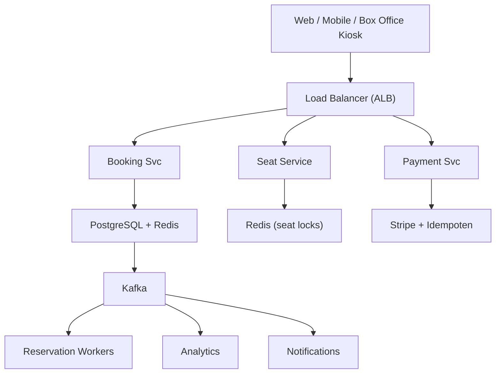

# System Design: Ticketing / Hotel Reservation System (BookMyShow)

## Overview

A ticket booking and hotel reservation platform supporting search, availability checking, seat/room selection, reservation with concurrency control, payment processing, and booking confirmation.

### Key Numbers

- 50M+ monthly active users
- 100K+ events/shows
- Peak: 50K+ concurrent users during flash sales
- 1M+ tickets sold per day

---

## Requirements

### Functional Requirements

- Search/browse events
- Select seats from seating chart
- Reserve seats during checkout
- Process payment and generate QR
- Transfer or resell tickets

### Non-Functional Requirements

- Latency: Seat select < 200ms
- Throughput: 100K tickets/min flash sales
- Availability: 99.99% uptime
- Consistency: Strong for seat booking
- Scale: 10M+ events, 500M+ tickets/year

---

---

---

## High-Level Architecture

### Architecture Diagram



### Data Flow

1. User selects event - Seat Service returns available seats from Redis
2. User selects seat - Redis atomic lock (SETEX, 10 min TTL)
3. User confirms - Booking Service creates reservation (ACID)
4. Payment Service processes with idempotency key
5. On payment success - Kafka event - Ticket generation (QR code)
6. Reservation expired - TTL auto-releases seat back to pool
7. Notifications: booking confirmation, reminder, cancellation

## Microservices

### 1. Auth Service

- **Responsibility**: User registration, login, OAuth, role-based access
- **Tech**: Node.js / Go
- **DB**: PostgreSQL

### 2. Search Service

- **Responsibility**: Event/show search, autocomplete, filters (date, genre, location)
- **Tech**: Go / Python
- **DB**: Elasticsearch
- **Cache**: Redis (popular searches)

### 3. Inventory Service (Critical)

- **Responsibility**: Seat/room availability, real-time inventory, pricing, hold management
- **Tech**: Java / Go
- **DB**: PostgreSQL (ACID), Redis (distributed locks)
- **Pattern**: Optimistic locking with version numbers

### 4. Booking Service (Critical)

- **Responsibility**: Seat selection, temporary hold, booking lifecycle, cancellation
- **Tech**: Java / Spring Boot
- **DB**: PostgreSQL (ACID transactions)
- **Cache**: Redis (seat locks with TTL)

### 5. Payment Service

- **Responsibility**: Payment processing, refunds, invoice generation
- **Tech**: Java / Spring Boot
- **DB**: PostgreSQL (financial records)
- **Integrations**: Stripe, Razorpay, Google Pay

### 6. Notification Service

- **Responsibility**: Booking confirmation, reminders, cancellation alerts
- **Tech**: Node.js
- **Channels**: Email (SendGrid), SMS (Twilio), Push (FCM)

### 7. Analytics Service

- **Responsibility**: Sales dashboards, demand forecasting, revenue reporting
- **Tech**: Python
- **DB**: ClickHouse, S3 (data lake)

---

## Database Design

### PostgreSQL

```sql
-- Events/Shows
CREATE TABLE events (
    event_id        UUID PRIMARY KEY DEFAULT gen_random_uuid(),
    title           VARCHAR(255) NOT NULL,
    type            VARCHAR(50), -- movie, concert, sport, hotel
    venue           VARCHAR(255),
    city            VARCHAR(100),
    event_date      TIMESTAMP NOT NULL,
    total_seats     INT NOT NULL,
    available_seats INT NOT NULL,
    base_price      DECIMAL(10,2),
    status          VARCHAR(20) DEFAULT 'active',
    created_at      TIMESTAMP DEFAULT NOW()
);

-- Seats/Rooms
CREATE TABLE seats (
    seat_id         UUID PRIMARY KEY DEFAULT gen_random_uuid(),
    event_id        UUID REFERENCES events(event_id),
    section         VARCHAR(10),
    row_label       VARCHAR(5),
    seat_number     VARCHAR(10),
    seat_type       VARCHAR(20), -- premium, standard, vip
    price           DECIMAL(10,2),
    status          VARCHAR(20) DEFAULT 'available',
    version         INT DEFAULT 1,
    UNIQUE(event_id, section, row_label, seat_number)
);

-- Reservations (Temporary Hold)
CREATE TABLE reservations (
    reservation_id  UUID PRIMARY KEY DEFAULT gen_random_uuid(),
    user_id         UUID NOT NULL,
    event_id        UUID REFERENCES events(event_id),
    seat_ids        UUID[] NOT NULL,
    status          VARCHAR(20) DEFAULT 'held',
    held_until      TIMESTAMP NOT NULL,
    total_amount    DECIMAL(10,2),
    created_at      TIMESTAMP DEFAULT NOW()
);

-- Bookings (Confirmed)
CREATE TABLE bookings (
    booking_id      UUID PRIMARY KEY DEFAULT gen_random_uuid(),
    user_id         UUID NOT NULL,
    event_id        UUID REFERENCES events(event_id),
    seat_ids        UUID[] NOT NULL,
    reservation_id  UUID REFERENCES reservations(reservation_id),
    status          VARCHAR(20) DEFAULT 'confirmed',
    total_amount    DECIMAL(10,2),
    payment_id      UUID,
    booked_at       TIMESTAMP DEFAULT NOW()
);

-- Optimistic locking for seat updates
UPDATE seats
SET status = 'held', version = version + 1
WHERE seat_id = ? AND status = 'available' AND version = ?;
```

### Redis (Distributed Locks & Inventory)

```
# Seat lock (10 minute TTL)
SETNX lock:seat:{seat_id} {user_id}
EXPIRE lock:seat:{seat_id} 600

# Inventory counter per event
HINCRBY event:{event_id}:inventory {section} -1

# Rate limiting per user
ZADD ratelimit:{user_id} {timestamp} {request_id}

# Reservation TTL
SETEX reservation:{reservation_id} 600 {json_data}
```

---

## Scaling Tiers

### Tier 1: 1K - 10K Users

| Component | Choice |
| ----------- | -------- |
| **Compute** | 2 EC2 (t3.large) |
| **Database** | PostgreSQL RDS (single) |
| **Cache** | Redis (single) |
| **Search** | PostgreSQL FTS |
| **Queue** | Redis Streams |
| **Payment** | Stripe |

### Tier 2: 10K - 1M Users

| Component | Choice |
| ----------- | -------- |
| **Compute** | ECS (10-30 containers) |
| **Database** | PostgreSQL (r5.xlarge, 3 read replicas) |
| **Cache** | Redis Cluster (6 nodes) |
| **Search** | Elasticsearch (3 nodes) |
| **Queue** | Kafka (3 brokers) |
| **Locking** | Redis distributed locks |

### Tier 3: 1M - 10M+ Users

| Component | Choice |
| ----------- | -------- |
| **Compute** | Multi-region K8s (200+ pods) |
| **Database** | PostgreSQL (Citus sharding) |
| **Cache** | Redis Cluster (20+ nodes) |
| **Search** | Elasticsearch Cross-Cluster |
| **Queue** | Kafka (9+ brokers) |
| **Inventory** | Event-sourced inventory |

---

## Key Design Decisions

### 1. Why Optimistic Locking Over Pessimistic?

- Pessimistic locks block other users (bad for flash sales)
- Optimistic: try update, retry on version conflict
- Works well when conflicts are rare (< 5%)

### 2. Why Temporary Hold (Reservation)?

- Seat held for 10 minutes during checkout
- Prevents seat from being sold to another user
- Auto-release if payment not completed (TTL expiry)

### 3. Why Event-Sourcing for Inventory?

- Every inventory change is an immutable event
- Easy to audit and replay
- Handles flash sale spikes gracefully

### 4. Flash Sale Strategy

- Queue users during high demand
- Show queue position and estimated wait time
- Use virtual waiting room (CloudFlare Waiting Room)

### 5. Payment-Booking Consistency

- Saga pattern: Reserve -> Pay -> Confirm
- If payment fails, release hold
- Idempotency key prevents double charges

---

## Failure Modes & Recovery

| Failure | Impact | Recovery |
| --------- | -------- | ---------- |
| Seat double-sell flash sale | Two users get same seat | Optimistic locking, seat hold TTL |
| Payment timeout after hold | Seat locked but payment fails | Hold timer 10 min, auto release |
| Bot scalper bypasses rate limit | Bots buy all tickets | CAPTCHA, device fingerprinting |
| QR code duplication | Two people use same ticket | Cryptographic QR, scan-at-venue verify |
| Seat hold race condition | Two users hold same seat | Distributed lock, atomic check-and-hold |
| Refund delay | Refunded but seat not released | Saga pattern, auto seat release |

---

## Cost Estimation (1M Users)

| Component | Specification | Monthly Cost |
| ----------- | -------------- | ------------- |
| API Servers | 15x c5.xlarge | $2,100 |
| PostgreSQL | db.r5.2xlarge + 3 replicas | $6,000 |
| Redis Cluster | 6x cache.r5.xlarge | $4,800 |
| Kafka Cluster | 6x kafka.m5.large | $2,400 |
| Elasticsearch | 10x m5.xlarge | $4,200 |
| Payment Gateway | Stripe fees ~2.9% | variable |
| QR Code Service | 3x c5.large | $420 |
| Seat Hold Service | 5x c5.xlarge | $700 |
| CDN | 10TB/month transfer | $800 |
| **Total** | | **~$21,420/month** |

---

## Trade-off Analysis

| Approach A | Approach B | Winner | Reason |
| ----------- | ----------- | -------- | -------- |
| Optimistic locking | Pessimistic locking | Optimistic | Better concurrency for seat selection |
| Redis queue | Database queue | Redis | Sub-ms queue operations |
| HMAC QR | UUID QR | HMAC QR | Tamper-proof, verifiable offline |
| Stripe | PayPal | Stripe | Better API for ticketing |
| Kafka | SQS | Kafka | Ordered event processing |

---

## Key Metrics to Monitor

| Metric | Target |
| -------- | -------- |
| Seat lock acquisition time | < 100ms |
| Booking success rate | > 99.9% |
| Double-booking incidents | 0 |
| Payment success rate | > 99.5% |
| Search latency (p99) | < 300ms |
| API response time (p99) | < 200ms |
| Flash sale throughput | 50K+ concurrent |
| Reservation expiry accuracy | 100% |
| System availability | 99.95% |
| Inventory accuracy | > 99.99% |

---

---

## Deep Dive Prompts

- How do you prevent double-booking for seats during flash sales?
- How does the virtual waiting room handle 100x traffic spikes?
- How do you generate tamper-proof QR codes for tickets?
- How do you handle seat locks with optimistic concurrency?

---

## Key Techniques & Patterns

| Technique | Description | Used In |
| ----------- | ------------- | ---------- |
| Seat Locking with Redis | Applied in this system | Architecture + LLD |
| Optimistic Concurrency Control | Applied in this system | Architecture + LLD |
| Payment Saga Pattern | Applied in this system | Architecture + LLD |
| Real-time Seat Updates (WebSocket) | Applied in this system | Architecture + LLD |
| Idempotency Keys | Applied in this system | Architecture + LLD |
| Rate Limiting for Flash Sales | Applied in this system | Architecture + LLD |

## Common Interview Follow-ups

**Q: How do you prevent seat double-sell?**
A: Optimistic locking, 10-min seat hold TTL, atomic check-and-hold distributed lock

**Q: How does seat hold timer work?**
A: Redis TTL, background job releases expired holds, payment required within window

**Q: How do you handle bot scalpers?**
A: CAPTCHA, device fingerprinting, velocity rate limiting, behavioral analysis

---

## Low-Level Design (LLD) - Algorithms & Data Structures

### 1. Optimistic Locking (Seat Booking)

```text
class SeatLock {
  constructor(redisClient, dbClient) { this.r = redisClient; this.db = dbClient; }
  async lockSeat(eventId, seatId, userId, ttl = 600) {
    const lockKey = 'lock:' + eventId + ':' + seatId;
    const locked = await this.r.set(lockKey, userId, 'EX', ttl, 'NX');
    if (!locked) return { locked: false, reason: 'seat_locked' };
    await this.db.updateSeatStatus(eventId, seatId, 'locked');
    return { locked: true, expiresAt: Date.now() + ttl * 1000 };
  }
  async unlockSeat(eventId, seatId, userId) {
    const lockKey = 'lock:' + eventId + ':' + seatId;
    const owner = await this.r.get(lockKey);
    if (owner !== userId) return { unlocked: false, reason: 'not_owner' };
    await this.r.del(lockKey);
    await this.db.updateSeatStatus(eventId, seatId, 'available');
    return { unlocked: true };
  }
  async confirmBooking(eventId, seatId, userId) {
    await this.unlockSeat(eventId, seatId, userId);
    await this.db.updateSeatStatus(eventId, seatId, 'booked');
    return { confirmed: true };
  }
}

const event = new EventService(); console.log("Event service ready");
```

### 2. Flash Sale Queue (Virtual Waiting Room)

```text
class FlashSaleQueue {
    // Virtual waiting room for flash sales
    // - Queue users during high demand
    // - Process in order with rate limiting

```

### 3. Seat Hold with TTL

```text
function hold_seat(seat_id, user_id, ttl_seconds = 600) {
    // Hold a seat for a limited time to prevent orphaned reservations
    // 1. Check whether the seat is already held by someone else
    // 2. If available, write a lock with TTL
    // 3. Return success or conflict

    if (seat_is_available(seat_id)) {
        set_seat_lock(seat_id, user_id, ttl_seconds);
        return "held";
    }
    return "conflict";
}
```

### 4. Payment-Order Saga Pattern

```text
class BookingSaga {
    // Saga pattern for booking flow:
    // 1. Hold seats
    // 2. Process payment
    // 3. Confirm booking
    // 4. If any step fails, compensate (rollback)
    // 5. Emit audit events for reconciliation
}
```
