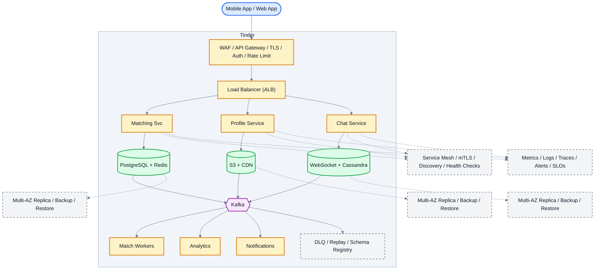

# System Design: Tinder (Dating App)

## Overview

A location-based dating platform supporting profile discovery, swiping, matching, messaging, and preferences for 50M+ daily active users.

### Key Numbers

- 50M+ daily active users
- 1.8B+ swipes per day
- 26M+ matches per day
- 1.5B+ messages per day

---

## Requirements

### Functional Requirements

- Swipe right to like, left to pass
- View profiles with photos and bio
- Match with mutual swipes
- Send messages to matches
- Set preferences (distance, age)

### Non-Functional Requirements

- Latency: Profile < 200ms, swipe < 100ms
- Throughput: 100M+ swipes/day
- Availability: 99.99% uptime
- Consistency: Strong for matches
- Scale: 75M+ monthly users, 190+ countries

---

---

---

## High-Level Architecture

### Architecture Diagram



*Solid = data flow, dashed = control plane / monitoring.*

### Data Flow

1. User creates profile - Profile Service stores in PostgreSQL
2. Discovery: Matching Service loads profiles from nearby users
3. User swipes - Like/Pass stored in PostgreSQL (bilateral check)
4. If both liked - Match created - push notification to both
5. Matched users - Chat Service opens WebSocket conversation
6. Kafka events: swipe patterns - ML model improves recommendations
7. Analytics: match rate, conversation rate, retention metrics

## Microservices

### 1. Profile Service

- **Responsibility**: Profile creation, photo upload, bio, preferences, verification
- **Tech**: Go
- **DB**: PostgreSQL (profiles), S3 (photos)

### 2. Discovery Service (Critical)

- **Responsibility**: Generate swipe deck, location-based filtering, preference matching, avoid showing same profile
- **Tech**: Go / Python
- **DB**: Redis (swipe deck, seen profiles), PostgreSQL (location index)

### 3. Matching Service (Critical)

- **Responsibility**: Determine matches (both swiped right), prevent duplicate matches, match notifications
- **Tech**: Go
- **DB**: Cassandra (matches, write-heavy), Redis (match cache)
- **Queue**: Kafka (match events)

### 4. Chat Service

- **Responsibility**: One-to-one messaging between matched users, message history
- **Tech**: Go
- **DB**: Cassandra (messages), Redis (recent messages)

### 5. Notification Service

- **Responsibility**: Match notifications, new message alerts, daily recommendations
- **Tech**: Node.js
- **Channels**: FCM, APNs

### 6. ML Ranking Service

- **Responsibility**: Profile ranking (Elo score), recommendation optimization, behavioral analysis
- **Tech**: Python (ML), TensorFlow
- **DB**: Redis (scores), PostgreSQL (features)

---

## Database Design

### PostgreSQL (Profiles & Location)

```sql
CREATE TABLE profiles (
    profile_id      UUID PRIMARY KEY DEFAULT gen_random_uuid(),
    user_id         UUID UNIQUE NOT NULL,
    name            VARCHAR(255) NOT NULL,
    age             INT,
    gender          VARCHAR(20),
    bio             TEXT,
    photos          TEXT[],
    interests       TEXT[],
    latitude        DECIMAL(10,8),
    longitude       DECIMAL(11,8),
    location        GEOMETRY(POINT, 4326),
    elo_score       DECIMAL(5,2) DEFAULT 1000,
    is_active       BOOLEAN DEFAULT TRUE,
    created_at      TIMESTAMP DEFAULT NOW()
);

CREATE INDEX idx_profiles_location ON profiles USING GIST (location);

-- Swipe tracking
CREATE TABLE swipes (
    swiper_id       UUID NOT NULL,
    swiped_id       UUID NOT NULL,
    direction       VARCHAR(10), -- left, right, super
    created_at      TIMESTAMP DEFAULT NOW(),
    PRIMARY KEY (swiper_id, swiped_id)
);
```

### Cassandra (Matches & Messages)

```cql
CREATE TABLE matches (
    user_a_id       UUID,
    user_b_id       UUID,
    matched_at      TIMESTAMP,
    source          TEXT, -- swipe, super_like
    PRIMARY KEY ((user_a_id), matched_at, user_b_id)
) WITH CLUSTERING ORDER BY (matched_at DESC);

CREATE TABLE messages (
    match_id        UUID,
    message_id      TIMEUUID,
    sender_id       UUID,
    content         TEXT,
    created_at      TIMESTAMP,
    PRIMARY KEY ((match_id), message_id)
) WITH CLUSTERING ORDER BY (message_id DESC);
```

### Redis

```
# Discovery deck (pre-computed swipe deck per user)
LPUSH deck:{user_id} {profile_id_1} {profile_id_2} ...

# Seen profiles (prevent showing same profile)
SADD seen:{user_id} {profile_id}

# Swipe record (for match detection)
HSET swipes:{user_id} {target_id} "right" | "left"

# Location index
GEOADD profiles:locations {lon} {lat} {profile_id}

# Elo score cache
SETEX elo:{profile_id} 3600 {score}
```

---

## Scaling Tiers

### Tier 1: 1K - 10K Users

| Component | Choice |
| ----------- | -------- |
| **Compute** | 2-4 EC2 (t3.large) |
| **Database** | PostgreSQL RDS |
| **Cache** | Redis (single) |
| **Media** | S3 + CloudFront |
| **Queue** | Redis Streams |
| **ML** | Simple Elo scoring |

### Tier 2: 10K - 1M Users

| Component | Choice |
| ----------- | -------- |
| **Compute** | ECS (20-50 containers) |
| **Database** | PostgreSQL + Cassandra (3 nodes) |
| **Cache** | Redis Cluster (12 nodes) |
| **Media** | S3 + multi-CDN |
| **Queue** | Kafka (3 brokers) |
| **ML** | SageMaker (ranking) |

### Tier 3: 1M - 10M+ Users

| Component | Choice |
| ----------- | -------- |
| **Compute** | Multi-region K8s (500+ pods) |
| **Database** | Cassandra (50+ nodes) + PostgreSQL (sharded) |
| **Cache** | Redis Cluster (30+ nodes) |
| **Queue** | Kafka (15+ brokers) |
| **ML** | Real-time recommendation engine |
| **Geo** | S2 Cells + custom spatial index |

---

## Key Design Decisions

### 1. Pre-Computed Discovery Deck

- Generate 100+ profiles per user in advance
- Store in Redis list (LPUSH)
- User swipes from deck, refill when low
- Avoids real-time query on every swipe

### 2. Swipe-to-Match Detection

- When user A swipes right on user B
- Check if user B already swiped right on user A (HGET swipes:{B} {A})
- If yes: MATCH! Notify both users
- If no: Store A's swipe, continue

### 3. Elo Score for Profile Ranking

- Higher Elo = shown more frequently
- Elo increases when right-swiped
- Elo decreases when left-swiped
- Creates natural quality ranking

### 4. Why Cassandra for Matches?

- Write-heavy (26M matches/day)
- Time-series access (recent matches first)
- Partition by user_id for even distribution

### 5. Anti-Abuse

- Rate limit swipes (100/day for free users)
- Shadow ban for spam/abuse
- Photo verification (face match)

---

## Failure Modes & Recovery
What can go wrong in production, and how the system detects and recovers:

| Failure | Impact | Recovery |
| --------- | -------- | ---------- |
| Elo score drift | Matches become irrelevant | Weekly recalibration, A/B test weights |
| Deck generation slow | Spinning wheel | Pre-computed decks, background refresh |
| Match notification delayed | Miss time-sensitive match | Priority push, SMS fallback |
| Location inaccurate | Matched 100km away | GPS + WiFi triangulation, distance threshold |
| Super like abuse | Spam super likes | Daily limit, cooldown, behavioral analysis |
| Payment failure | Premium not unlocked | Grace period, retry, manual activation |

---

## Cost Estimation (1M Users)
Rough monthly cost of running this design for one million users:

| Component | Specification | Monthly Cost |
| ----------- | -------------- | ------------- |
| API Servers | 20x c5.xlarge | $2,800 |
| PostgreSQL | db.r5.xlarge + 3 replicas | $4,800 |
| Redis Cluster | 6x cache.r5.xlarge | $4,800 |
| Elasticsearch | 10x m5.xlarge | $4,200 |
| S3 Photo Storage | 50TB | $1,150 |
| CDN | 20TB/month transfer | $1,600 |
| ML Matching | GPU instances | $3,000 |
| Kafka Cluster | 6x kafka.m5.large | $2,400 |
| Geo Service | 5x c5.xlarge | $700 |
| **Total** | | **~$25,450/month** |

---

## Trade-off Analysis
The alternatives considered, and which one won and why:

| Approach A | Approach B | Winner | Reason |
| ----------- | ----------- | -------- | -------- |
| Redis GEO | PostGIS | Redis GEO | Sub-ms proximity queries |
| Cassandra | PostgreSQL | Cassandra | Write-heavy swipe workload |
| Redis set intersection | Database join | Redis set | O(min(N,M)) mutual like detection |
| WebSocket | Long polling | WebSocket | True real-time chat |
| Custom Elo | ML ranking | Custom Elo | Simpler, more interpretable |

---

## Key Metrics to Monitor
The metrics that signal system health, with alert thresholds:

| Metric | Target |
| -------- | -------- |
| Discovery deck load time | < 200ms |
| Swipe processing latency | < 100ms |
| Match detection latency | < 500ms |
| Profile load time (p99) | < 300ms |
| Chat message delivery | < 200ms |
| API response time (p99) | < 200ms |
| Match success rate | > 30% |
| Deck refill latency | < 1s |
| System availability | 99.95% |
| Location query accuracy | < 100m |

---

---

## Deep Dive Prompts

- How does Elo scoring work for profile ranking?
- How do you detect mutual likes in real-time?
- How do you handle 1.8B+ swipes per day?
- How does discovery deck avoid showing the same profile twice?

---

## Key Techniques & Patterns
The recurring techniques and patterns this design applies, mapped to where they are used:

| Technique | Description | Used In |
| ----------- | ------------- | ---------- |
| Elo Rating System | Applied in this system | Architecture + LLD |
| Swipe Recommendation Algorithm | Applied in this system | Architecture + LLD |
| Geospatial Matching | Applied in this system | Architecture + LLD |
| Redis for Swipe Queue | Applied in this system | Architecture + LLD |
| Like/Pass State Machine | Applied in this system | Architecture + LLD |
| Photo Verification | Applied in this system | Architecture + LLD |

## Common Interview Follow-ups

**Q: How does Elo scoring work for matchmaking?**
A: Rating from swipe outcomes, adjusted by opponent rating, personalized discovery deck

**Q: How do you handle cold start?**
A: Popular profiles in area, bio/interest matching, accelerate from early swipes

**Q: How does super like prevent abuse?**
A: Daily limit, cooldown period, behavioral analysis, premium gets more

---

## Low-Level Design (LLD) - Algorithms & Data Structures

### 1. Elo Score Algorithm (Matchmaking)

```text
class MatchingEngine {
  constructor(redisClient, dbClient) { this.r = redisClient; this.db = dbClient; }
  async getDiscoveryDeck(userId, count = 20) {
    const user = await this.db.getUser(userId);
    const prefs = user.preferences || {};
    const candidates = await this.db.findCandidates({
      ageMin: prefs.ageMin || 18, ageMax: prefs.ageMax || 50,
      distanceKm: prefs.distance || 50, excludeIds: user.swipedIds || []
    });
    return candidates.map(c => ({
      ...c, score: this.calcElo(user.eloScore, c.eloScore) * this.calcCompat(user, c)
    })).sort((a, b) => b.score - a.score).slice(0, count);
  }
  calcElo(my, their) { return 1 / (1 + Math.pow(10, (their - my) / 400)); }
  calcCompat(u1, u2) {
    let s = 1.0;
    if (u1.interests && u2.interests) s += u1.interests.filter(i => u2.interests.includes(i)).length * 0.1;
    return s;
  }
}
```

### 2. Discovery Deck Generation

```text
function generate_discovery_deck(user_id, deck_size=100) {
    // - Elo-based ranking
    // - Exclude already seen profiles
        // "profiles:locations",
    // // Step 2: Filter by preferences
            // continue
            // continue
            // continue
    // // Step 3: Rank by Elo score
    // // Step 4: Take top N
    // // Step 5: Store in Redis

```

### 3. Match Detection Algorithm

```text
class SwipeService {
  constructor(redisClient, dbClient) { this.r = redisClient; this.db = dbClient; }
  async swipe(swiperId, swipedId, direction) {
    await this.db.recordSwipe(swiperId, swipedId, direction);
    if (direction === 'right') {
      const reverse = await this.db.getSwipe(swipedId, swiperId);
      if (reverse && reverse.direction === 'right') {
        const matchId = 'match_' + Date.now() + '_' + Math.random().toString(36).substr(2, 9);
        await this.db.createMatch({ matchId, users: [swiperId, swipedId], createdAt: new Date() });
        await this.r.publish('notifications', JSON.stringify({ type: 'match', users: [swiperId, swipedId] }));
        return { matched: true, matchId };
      }
    }
    return { matched: false };
  }
}

const match = new MatchService(); console.log("Match service ready");
```

### 4. Super Like Priority Algorithm

```text
function handle_super_like(super_liker_id, target_id) {
    // Super Like algorithm:
    // - Prioritized in target's discovery deck
    // - Shown with special animation
    // - Higher match probability
    // // Store super like
    // // Send special notification
    // // Boost super liker's Elo slightly

```
