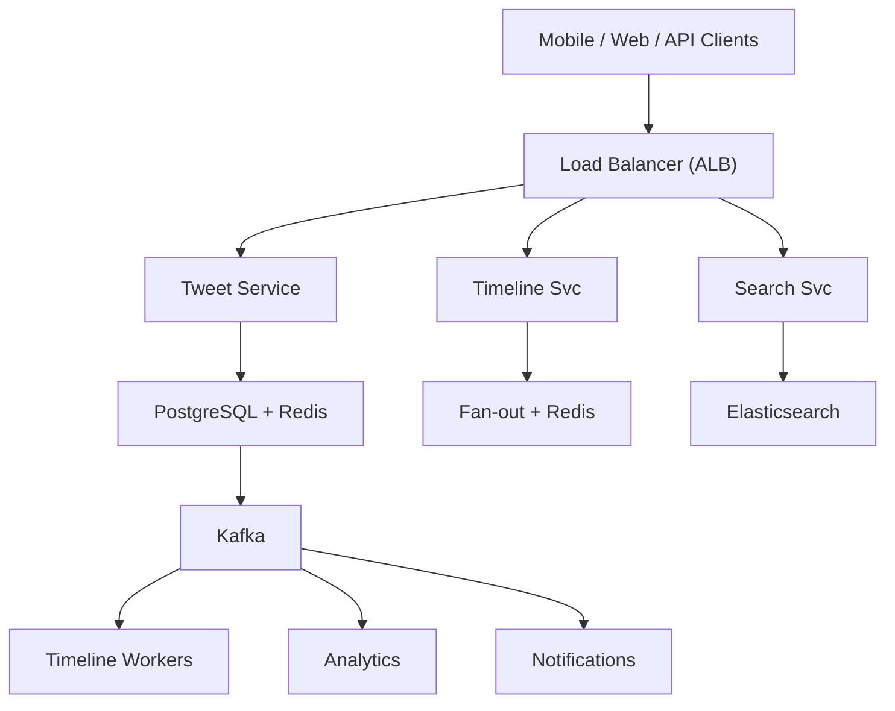

# System Design: Twitter / X

## Overview

A social media platform supporting tweet posting, following, personalized timeline, likes/retweets, search, and trending topics for 500M+ users.

### Key Numbers
- 500M+ monthly active users
- 500M+ tweets per day
- Peak: 100K+ tweets per second
- Trending: 1M+ tweets per topic per hour

---


## Requirements

### Functional Requirements
- Post tweets (text, images, videos) 280 chars
- Follow/unfollow and see timeline
- Like, retweet, and reply
- Search tweets and trending topics
- Notifications for mentions and likes

### Non-Functional Requirements
- Latency: Timeline < 200ms, publish < 500ms
- Throughput: 500M+ tweets/day
- Availability: 99.99% uptime
- Consistency: Eventually consistent timeline
- Scale: 400M+ monthly active users

---

## High-Level Architecture

### Architecture Diagram



### Data Flow

1. User posts tweet - Tweet Service stores in PostgreSQL
2. Fan-out pushes tweet to all followers timelines (Redis)
3. Celebrity fan-out: pull-based (read from DB on timeline load)
4. Search Service indexes tweet in Elasticsearch (async via Kafka)
5. Timeline Service serves cached Redis timeline in < 50ms
6. Kafka events: impressions, clicks, likes - Analytics
7. Notifications: mentions, follows, retweets via push + email
## Microservices

### 1. Tweet Service
- **Responsibility**: Create/delete tweets, retweets, quote tweets, thread support
- **Tech**: Go / Java
- **DB**: Cassandra (tweets, write-heavy)
- **Cache**: Redis (tweet metadata)

### 2. Timeline Service (Critical)
- **Responsibility**: Home timeline generation, fan-out-on-write, timeline caching
- **Tech**: Java / Go
- **DB**: Redis (pre-computed timelines), Cassandra (timeline store)
- **Pattern**: Fan-out-on-write for normal users, fan-out-on-read for celebrities

### 3. Fan-out Service
- **Responsibility**: Push tweets to follower timelines, handle celebrity edge cases
- **Tech**: Go
- **Queue**: Kafka (fan-out events)
- **Pattern**: Async fan-out with write-behind

### 4. Search Service
- **Responsibility**: Tweet search, user search, hashtag search, autocomplete
- **Tech**: Python / Go
- **DB**: Elasticsearch
- **Cache**: Redis (popular searches)

### 5. Trending Service
- **Responsibility**: Real-time trending topics, hashtag counting, trending algorithms
- **Tech**: Python / Go
- **DB**: Redis (counters, sorted sets), ClickHouse (analytics)
- **Pattern**: Sliding window counting (1min, 5min, 15min, 60min)

### 6. Notification Service
- **Responsibility**: Like/retweet/reply notifications, follow notifications, digest emails
- **Tech**: Node.js
- **Queue**: Kafka consumer
- **Channels**: FCM, APNs, Email

### 7. User Service
- **Responsibility**: Profiles, follow/unfollow, block/mute, settings
- **Tech**: Go
- **DB**: PostgreSQL (users), Redis (follow graph)

---

## Database Design

### PostgreSQL (Users & Social Graph)

```sql
CREATE TABLE users (
    user_id         UUID PRIMARY KEY DEFAULT gen_random_uuid(),
    username        VARCHAR(50) UNIQUE NOT NULL,
    email           VARCHAR(255) UNIQUE,
    name            VARCHAR(255),
    bio             TEXT,
    avatar_url      TEXT,
    is_verified     BOOLEAN DEFAULT FALSE,
    followers_count INT DEFAULT 0,
    following_count INT DEFAULT 0,
    tweet_count     INT DEFAULT 0,
    created_at      TIMESTAMP DEFAULT NOW()
);

CREATE TABLE follows (
    follower_id     UUID REFERENCES users(user_id),
    followee_id     UUID REFERENCES users(user_id),
    created_at      TIMESTAMP DEFAULT NOW(),
    PRIMARY KEY (follower_id, followee_id)
);
```

### Cassandra (Tweets - Write-Heavy)

```cql
CREATE TABLE tweets (
    user_id         UUID,
    tweet_id        TIMEUUID,
    content         TEXT,
    media_urls      LIST<TEXT>,
    reply_to        UUID,
    retweet_of      UUID,
    like_count      COUNTER,
    retweet_count   COUNTER,
    reply_count     COUNTER,
    created_at      TIMESTAMP,
    PRIMARY KEY ((user_id), tweet_id)
) WITH CLUSTERING ORDER BY (tweet_id DESC);

CREATE TABLE timeline (
    user_id         UUID,
    tweet_id        TIMEUUID,
    author_id       UUID,
    created_at      TIMESTAMP,
    PRIMARY KEY ((user_id), created_at, tweet_id)
) WITH CLUSTERING ORDER BY (created_at DESC);
```

### Redis

```
# Home timeline (pre-computed)
LPUSH timeline:{user_id} {tweet_id_1} {tweet_id_2} ...
LTRIM timeline:{user_id} 0 399

# Like status
SADD likes:{tweet_id} {user_id}

# Retweet status
SADD retweets:{tweet_id} {user_id}

# Trending (sorted set by score)
ZADD trending:1min {score} {hashtag}
ZADD trending:5min {score} {hashtag}
ZADD trending:60min {score} {hashtag}

# Tweet cache
SETEX tweet:{tweet_id} 3600 {json}

# Follow graph cache
SADD following:{user_id} {followee_id}
```

### Elasticsearch (Search)

```json
{
  "mappings": {
    "properties": {
      "tweet_id": { "type": "keyword" },
      "content": { "type": "text", "analyzer": "english" },
      "user_id": { "type": "keyword" },
      "hashtags": { "type": "keyword" },
      "mentions": { "type": "keyword" },
      "created_at": { "type": "date" },
      "like_count": { "type": "integer" },
      "retweet_count": { "type": "integer" }
    }
  }
}
```

---

## Scaling Tiers

### Tier 1: 1K - 10K Users

| Component | Choice |
|-----------|--------|
| **Compute** | 2-4 EC2 (t3.large) |
| **Database** | PostgreSQL RDS |
| **Cache** | Redis (single) |
| **Feed** | On-read (pull model) |
| **Search** | PostgreSQL FTS |
| **Queue** | Redis Streams |

### Tier 2: 10K - 1M Users

| Component | Choice |
|-----------|--------|
| **Compute** | ECS (20-50 containers) |
| **Database** | PostgreSQL + Cassandra (6 nodes) |
| **Cache** | Redis Cluster (12 nodes) |
| **Feed** | Hybrid fan-out |
| **Search** | Elasticsearch (6 nodes) |
| **Queue** | Kafka (3 brokers) |

### Tier 3: 1M - 10M+ Users

| Component | Choice |
|-----------|--------|
| **Compute** | Multi-region K8s (500+ pods) |
| **Database** | Cassandra (50+ nodes) + PostgreSQL (sharded) |
| **Cache** | Redis Cluster (30+ nodes) |
| **Feed** | Fan-out-on-write + celebrity hybrid |
| **Search** | Elasticsearch Cross-Cluster (15+ nodes) |
| **Queue** | Kafka (15+ brokers) |
| **Trending** | Custom sliding window counters |

---

## Key Design Decisions

### 1. Fan-Out-on-Write vs Fan-Out-on-Read
- **Write (Push)**: When user tweets, push to all followers' timelines
  - Pro: Fast timeline reads (pre-computed)
  - Con: Celebrity problem (1M followers = 1M writes per tweet)
- **Read (Pull)**: When user opens timeline, fetch from followed users
  - Pro: No write amplification
  - Con: Slow timeline reads
- **Hybrid**: Fan-out-on-write for normal users, on-read for celebrities

### 2. Why Cassandra for Tweets?
- Write-heavy (500M+ tweets/day)
- Time-series access (recent tweets first)
- Partition by user_id for even distribution

### 3. Trending Algorithm
- Count hashtags in sliding windows (1min, 5min, 15min, 60min)
- Score = (count in 1min * 4) + (count in 5min * 3) + (count in 15min * 2) + (count in 60min * 1)
- Decay older counts to favor emerging trends

### 4. Why Not Store Tweets in PostgreSQL?
- 500M+ tweets/day = billions of rows
- Write-heavy workload (not PostgreSQL's strength)
- Cassandra handles this scale naturally

### 5. Tweet Ordering
- Use TIMEUUID (server-generated timestamp)
- Per-user ordering (not global)
- Handle clock skew with logical timestamps

---

## Failure Modes & Recovery

| Failure | Impact | Recovery |
|---------|--------|----------|
| Fan-out overloaded | Timeline delayed for millions | Shard by user ID, priority queue |
| Trending false positives | Fake trends | Human review, velocity threshold |
| Bloom filter spike | Duplicate tweets | Rebuild filter, content hash fallback |
| Kafka consumer lag | Timeline not updating | Auto-scale consumers, priority partitioning |
| Redis sorted set overflow | Trending unavailable | TTL on old entries, LRU eviction |
| Search index corrupt | Cannot find tweets | Rebuild from Kafka, serve from cache |

---


## Cost Estimation (1M Users)

| Component | Specification | Monthly Cost |
|-----------|--------------|-------------|
| API Servers | 100x c5.xlarge | $14,000 |
| PostgreSQL | db.r5.2xlarge + 10 replicas | $12,000 |
| Redis Cluster | 24x cache.r5.xlarge | $19,200 |
| Kafka Cluster | 24x kafka.m5.large | $9,600 |
| Elasticsearch | 30x m5.xlarge | $12,600 |
| S3 Storage | 100TB | $2,300 |
| CDN | 100TB/month transfer | $8,000 |
| Fan-out Workers | 50x c5.xlarge | $7,000 |
| Trending Service | 10x c5.xlarge | $1,400 |
| **Total** |  | **~$86,100/month** |

---

## Trade-off Analysis

| Approach A | Approach B | Winner | Reason |
|-----------|-----------|--------|--------|
| Fan-out-on-write | Fan-out-on-read | Hybrid | Write for regular users, read for celebrities (10M+ followers) |
| Neo4j | PostgreSQL for graph | Neo4j | O(1) relationship queries vs O(N) for SQL |
| Redis Lists | Cassandra for timeline | Redis Lists | Sub-ms reads for timeline serving |
| Elasticsearch | Solr | Elasticsearch | Better real-time indexing, more active development |
| Kafka | RabbitMQ | Kafka | Higher throughput for 100B+ events/day |

---

## Key Metrics to Monitor

| Metric | Target |
|--------|--------|
| Timeline load time (p99) | < 500ms |
| Tweet creation latency | < 200ms |
| Fan-out throughput | 1M+ tweets/sec |
| Search latency (p99) | < 500ms |
| Trending update frequency | Every 1 minute |
| Like/retweet latency | < 100ms |
| API response time (p99) | < 200ms |
| CDN cache hit ratio | > 95% |
| System availability | 99.95% |
| Tweet ordering accuracy | 100% |

---


---

## Deep Dive Prompts
- How do you handle fan-out for a celebrity with 100M followers?
- How does trending topics work with real-time hashtag counting?
- How do you prevent spam and abuse at scale?
- How do you handle 500M+ tweets/day with real-time search?

---


## Key Techniques & Patterns

| Technique | Description | Used In |
|-----------|-------------|----------|
| Fan-out on Write/Read Hybrid | Applied in this system | Architecture + LLD |
| Graph Database (Neo4j) | Applied in this system | Architecture + LLD |
| Redis Timeline Cache | Applied in this system | Architecture + LLD |
| Kafka for Tweet Processing | Applied in this system | Architecture + LLD |
| Trending Topics with Count-Min Sketch | Applied in this system | Architecture + LLD |
| Reverse Index for Search | Applied in this system | Architecture + LLD |

## Common Interview Follow-ups

**Q: How does fan-out-on-write work for celebrities?**
A: Normal: push to all followers. Celebrities (>10K): fan-out-on-read at timeline load

**Q: How does trending algorithm work?**
A: Sliding window with time-decay, velocity detection, spam filtering via IP reputation

**Q: How do you handle timeline read amplification?**
A: Hybrid fan-out, pre-computed timeline cache with TTL

---

## Low-Level Design (LLD) - Algorithms & Data Structures

### 1. Fan-Out-on-Write Algorithm

```text
class FanoutService {
  // Push tweet to all followers' timelines
  constructor(redisClient, dbClient) {
    this.r = redisClient;
    this.db = dbClient;
  }

  async fanout(tweet, authorId) {
    const followers = await this.db.getFollowers(authorId);
    
    // Celebrity threshold: skip fan-out, use pull-based timeline
    if (followers.length > 10000) {
      await this.db.flagCelebrityTweet(tweet.id, authorId);
      return { strategy: 'pull', notified: 0 };
    }

    // Fan-out-on-write: push to each follower's timeline
    const pipeline = this.r.pipeline();
    for (const followerId of followers) {
      pipeline.lpush(`timeline:${followerId}`, tweet.id);
      pipeline.ltrim(`timeline:${followerId}`, 0, 999);  // Keep last 1000
    }
    await pipeline.exec();
    
    return { strategy: 'push', notified: followers.length };
  }

  async getTimeline(userId, cursor = 0, limit = 20) {
    // Pull timeline from Redis (pre-computed) or generate on-the-fly
    const tweetIds = await this.r.lrange(`timeline:${userId}`, cursor, cursor + limit - 1);
    return this.db.getTweetsByIds(tweetIds);
  }
}
```

### 2. Trending Algorithm (Reservoir Sampling + Decay)

```text
class TrendingService {
  // Calculate trending topics using HyperLogLog + time decay
  // Time Complexity: O(1) per count, O(T) for top-K where T = unique topics
  constructor(redisClient) {
    this.r = redisClient;
  }

  async countHashtag(hashtag) {
    // Use HyperLogLog for approximate unique count
    const key = `trending:${hashtag}:${this.getCurrentWindow()}`;
    await this.r.pfadd(key, Date.now().toString());
    await this.r.expire(key, 86400);  // 24h TTL
  }

  async getTrending(topK = 10) {
    // Get all trending hashtags and score by time-decayed count
    const keys = await this.r.keys('trending:*');
    const scored = [];
    
    for (const key of keys) {
      const count = await this.r.pfcount(key);
      const hashtag = key.split(':')[1];
      const window = parseInt(key.split(':')[2]);
      const age = (Date.now() / 1000 - window) / 3600;  // hours
      const decayedScore = count / (1 + age * 0.1);  // Decay over time
      scored.push({ hashtag, score: decayedScore });
    }
    
    return scored.sort((a, b) => b.score - a.score).slice(0, topK);
  }

  getCurrentWindow() {
    return Math.floor(Date.now() / 1000 / 3600) * 3600;  // 1-hour windows
  }
}
```

### 3. Home Timeline Generation (Hybrid)

```text
function get_home_timeline(user_id, cursor=undefined, limit=20) {
    // Hybrid timeline generation:
    // 3. Rank by relevance
    // Step 1: Get pre-computed timeline
    const timeline = await this.redis.lrange(`timeline:${userId}`, 0, -1);
    return timeline;
  }
}

```

### Algorithm 2

```text
class TimelineService {
  // Generate user timeline from pre-computed fan-out or on-the-fly
  // Time Complexity: O(1) for cached, O(F) for fan-out-on-read
  constructor(redisClient, dbClient) {
    this.r = redisClient;
    this.db = dbClient;
  }

  async getTimeline(userId, cursor = null, limit = 20) {
    // Try cached timeline first (fan-out-on-write)
    const cacheKey = `timeline:${userId}`;
    const tweetIds = await this.r.lrange(cacheKey, cursor || 0, limit - 1);
    
    if (tweetIds.length > 0) {
      return this.db.getTweetsByIds(tweetIds);
    }
    
    // Fallback: fan-out-on-read (celebrity tweets)
    const following = await this.db.getFollowing(userId);
    const tweets = await this.db.getRecentTweets(following, limit);
    return tweets.sort((a, b) => b.timestamp - a.timestamp).slice(0, limit);
  }
}
```
        // Some comment
```

```text
class SpamDetector {
  // Detect spam tweets using rate limiting + content analysis
  // Time Complexity: O(1) per check
  constructor(redisClient) {
    this.r = redisClient;
  }

  async isSpam(userId, tweetContent) {
    // Check 1: Rate limit (max 10 tweets per hour)
    const tweetCount = await this.r.incr(`user:${userId}:tweets:${this.getHour()}`);
    await this.r.expire(`user:${userId}:tweets:${this.getHour()}`, 3600);
    if (tweetCount > 10) return { spam: true, reason: 'rate_limit' };
    
    // Check 2: Duplicate content (exact or near-duplicate)
    const contentHash = this.hashContent(tweetContent);
    const isDuplicate = await this.r.exists(`content:${contentHash}`);
    if (isDuplicate) return { spam: true, reason: 'duplicate_content' };
    
    // Check 3: Suspicious patterns (excessive hashtags, mentions, links)
    const hashtags = (tweetContent.match(/#/g) || []).length;
    const mentions = (tweetContent.match(/@/g) || []).length;
    const links = (tweetContent.match(/https?:\/\//g) || []).length;
    if (hashtags > 10 || mentions > 15 || links > 5) {
      return { spam: true, reason: 'suspicious_patterns' };
    }
    
    return { spam: false };
  }

  getHour() { return Math.floor(Date.now() / 1000 / 3600); }
  hashContent(text) { return text.toLowerCase().trim().slice(0, 100); }
}

const fanout = new FanoutService(); console.log("Fan-out service ready");
```
    // // Dedup: prevent double like
    // // Real-time count
        // "tweet_id": tweet_id,
        // "user_id": user_id,
        // "action": "like"
```
