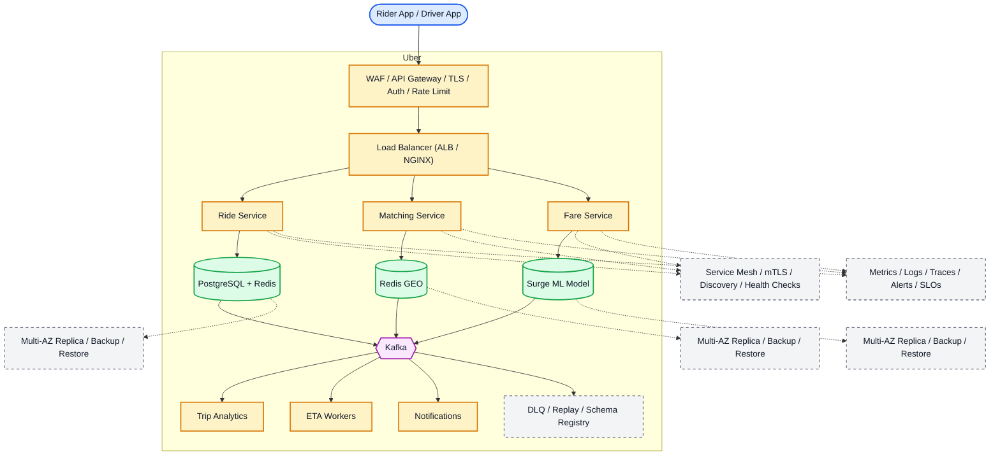

# System Design: Uber (Ride-Hailing System)

## Overview

A ride-hailing platform supporting real-time location tracking, driver matching, trip management, fare calculation, and payment for millions of riders and drivers.

### Key Numbers

- 130M+ monthly active users
- 5M+ active drivers
- 23M+ trips per day
- Peak: 1M+ ride requests per hour

---

## Requirements

### Functional Requirements

- Request ride by entering destination
- Match nearest driver within 2-min ETA
- Real-time GPS tracking during trip
- Auto-process payment after trip
- Rate driver and provide feedback

### Non-Functional Requirements

- Latency: Driver match < 10s, GPS < 5s
- Throughput: 20M+ daily rides
- Availability: 99.99% uptime
- Consistency: Strong for payments
- Scale: 100M+ users, 70+ countries

---

## High-Level Architecture

### Architecture Diagram



*Solid = data flow, dashed = control plane / monitoring.*

### Data Flow

1. Rider enters pickup + destination, requests ride
2. Matching Service finds nearest drivers via Redis GEORADIUS (5km)
3. Fare Service calculates ETA + surge multiplier
4. Driver accepts - Trip state machine: requested -> in_progress
5. Location Service ingests GPS from driver every 4s via Kafka
6. Trip completes - Payment Service charges rider, pays driver
7. Kafka events feed Analytics + real-time surge pricing updates

## Microservices

### 1. Location Service (Critical)

- **Responsibility**: Ingest driver locations every 4s, store in geospatial index, update real-time positions
- **Tech**: Go
- **DB**: Redis GEO (hot), PostGIS (persistent)
- **Queue**: Kafka (location stream)
- **Pattern**: Write-behind, adaptive frequency

### 2. Trip Service

- **Responsibility**: Ride requests, trip lifecycle, trip tracking, trip history
- **Tech**: Java / Go
- **DB**: PostgreSQL (trips), Redis (active trips)
- **Pattern**: Trip state machine

### 3. Matching Service (Critical)

- **Responsibility**: Find nearby drivers, send ride requests, handle acceptance/timeout, driver ranking
- **Tech**: Go
- **DB**: Redis (driver availability), PostgreSQL (matching history)
- **Pattern**: Fan-out to nearby drivers, first-accept wins

### 4. Fare Service

- **Responsibility**: Dynamic pricing (surge), ETA calculation, fare estimation, toll calculation
- **Tech**: Python / Go
- **DB**: Redis (surge multipliers), PostgreSQL (fare rules)
- **External**: Google Maps API / OSRM

### 5. Payment Service

- **Responsibility**: Payment processing, split payments, tips, refunds, driver payouts
- **Tech**: Java / Spring Boot
- **DB**: PostgreSQL (financial records)
- **Integrations**: Stripe, PayPal, Razorpay

### 6. Notification Service

- **Responsibility**: Ride updates, driver arrived, trip completed, promotions
- **Tech**: Node.js
- **Channels**: FCM, APNs, SMS (Twilio)
- **Queue**: Kafka consumer

### 7. ETA Service

- **Responsibility**: Real-time ETA calculation, route optimization, traffic-aware routing
- **Tech**: Go / Python
- **External**: Google Maps Distance Matrix, OSRM

---

## Database Design

### Redis (Real-Time Location & Matching)

```
# Driver location index (Geo)
GEOADD drivers:locations {lon} {lat} {driver_id}

# Find nearest 5 drivers within 5km
GEORADIUS drivers:locations {lon} {lat} 5 km ASC COUNT 5 WITHDIST

# Driver status
HSET driver:{driver_id} status "available" car_type "sedan" rating 4.8

# Active trip tracking
HSET trip:{trip_id} rider_loc "{lat},{lng}" driver_loc "{lat},{lng}" eta 5

# Surge pricing per zone
HSET surge:zones {zone_id} {multiplier}
```

### PostgreSQL (Trips & Payments)

```sql
CREATE TABLE trips (
    trip_id         UUID PRIMARY KEY DEFAULT gen_random_uuid(),
    rider_id        UUID NOT NULL,
    driver_id       UUID,
    status          VARCHAR(20) DEFAULT 'requested',
    pickup_lat      DECIMAL(10,8) NOT NULL,
    pickup_lng      DECIMAL(11,8) NOT NULL,
    dropoff_lat     DECIMAL(10,8) NOT NULL,
    dropoff_lng     DECIMAL(11,8) NOT NULL,
    pickup_address  TEXT,
    dropoff_address TEXT,
    fare_estimate   DECIMAL(10,2),
    fare_actual     DECIMAL(10,2),
    surge_multiplier DECIMAL(3,2) DEFAULT 1.0,
    distance_km     DECIMAL(5,2),
    duration_min    INT,
    requested_at    TIMESTAMP DEFAULT NOW(),
    accepted_at     TIMESTAMP,
    started_at      TIMESTAMP,
    completed_at    TIMESTAMP
);

CREATE TABLE payments (
    payment_id      UUID PRIMARY KEY DEFAULT gen_random_uuid(),
    trip_id         UUID REFERENCES trips(trip_id),
    rider_id        UUID NOT NULL,
    driver_id       UUID,
    amount          DECIMAL(10,2) NOT NULL,
    tip             DECIMAL(10,2) DEFAULT 0,
    method          VARCHAR(50),
    status          VARCHAR(20),
    created_at      TIMESTAMP DEFAULT NOW()
);
```

---

## Scaling Tiers

### Tier 1: 1K - 10K Users

| Component | Choice |
| ----------- | -------- |
| **Compute** | 2-4 EC2 (t3.large) |
| **Database** | PostgreSQL RDS |
| **Cache** | Redis (single) |
| **Location** | Redis GEO |
| **ETA** | Google Maps API |
| **Queue** | Redis Streams |

### Tier 2: 10K - 1M Users

| Component | Choice |
| ----------- | -------- |
| **Compute** | ECS (20-50 containers) |
| **Database** | PostgreSQL (read replicas) + PostGIS |
| **Cache** | Redis Cluster (12 nodes) |
| **Location** | Redis GEO Cluster |
| **Queue** | Kafka (3 brokers) |
| **ETA** | OSRM + Google Maps |

### Tier 3: 1M - 10M+ Users

| Component | Choice |
| ----------- | -------- |
| **Compute** | Multi-region K8s (500+ pods) |
| **Database** | PostgreSQL (sharded) + PostGIS |
| **Cache** | Redis Cluster (30+ nodes) |
| **Location** | S2 Cells + Redis GEO |
| **Queue** | Kafka (15+ brokers) |
| **ETA** | Custom routing engine |
| **ML** | Surge pricing model |

---

## Key Design Decisions

### 1. Why Kafka for Location Stream?

- 5M drivers x 1 update/4s = 1.25M events/sec
- Kafka handles this throughput easily
- Enables replay for analytics
- Decouples location ingestion from matching

### 2. Driver Matching Algorithm

- Find N nearest available drivers (Redis GEORADIUS)
- Send ride request to nearest driver first
- If declined/timeout (30s), send to next nearest
- First driver to accept wins (distributed lock)

### 3. Surge Pricing

- Real-time demand/supply ratio per zone
- If demand > supply: increase multiplier
- Update every 2 minutes
- Stored in Redis for fast reads

### 4. Why Redis for Active Trips?

- Sub-millisecond reads for real-time tracking
- TTL for automatic trip expiry
- GEO for driver location queries

### 5. Trip State Machine

```
requested -> accepted -> arrived -> in_progress -> completed
    |           |                        |
    v           v                        v
 cancelled   cancelled               cancelled
```

---

## Failure Modes & Recovery
What can go wrong in production, and how the system detects and recovers:

| Failure | Impact | Recovery |
| --------- | -------- | ---------- |
| Redis GEO corruption | Wrong driver matches | Rebuild from PostgreSQL, PostGIS fallback |
| Surge pricing stuck | Pricing at 3x for hours | Price cap with TTL, manual override |
| GPS delayed > 30s | Inaccurate location | Kalman filter, ETA recalc |
| Payment failure | Trip not charged | Retry with backoff, reconciliation |
| Matching overwhelmed | No drivers found | Queue riders, expand radius, surge pricing |
| Maps API down | No directions | Cached routes, fallback ETA |

---

## Cost Estimation (1M Users)
Rough monthly cost of running this design for one million users:

| Component | Specification | Monthly Cost |
| ----------- | -------------- | ------------- |
| API Servers | 50x c5.xlarge | $7,000 |
| PostgreSQL | db.r5.2xlarge + 5 replicas | $8,000 |
| Redis GEO Cluster | 12x cache.r5.xlarge | $9,600 |
| Kafka Cluster | 12x kafka.m5.large | $4,800 |
| Google Maps API | 50M requests/day | $15,000 |
| Elasticsearch | 15x m5.xlarge | $6,300 |
| Machine Learning | GPU instances for surge | $3,000 |
| CDN | 50TB/month transfer | $4,000 |
| Monitoring | Prometheus + Grafana + PagerDuty | $2,000 |
| **Total** | | **~$59,700/month** |

---

## Trade-off Analysis
The alternatives considered, and which one won and why:

| Approach A | Approach B | Winner | Reason |
| ----------- | ----------- | -------- | -------- |
| Redis GEO | PostGIS | Redis GEO | Sub-ms queries vs 10-50ms for PostGIS |
| Custom matching | Google OR-Tools | Custom matching | Domain-specific optimization for ride matching |
| Kafka | SQS | Kafka | Higher throughput for 1M+ location updates/second |
| Google Maps | HERE Maps | Google Maps | Most accurate routing and ETA data |
| Stripe | Adyen | Stripe | Better developer experience, wider coverage |

---

## Key Metrics to Monitor
The metrics that signal system health, with alert thresholds:

| Metric | Target |
| -------- | -------- |
| Driver matching latency | < 5s |
| Location update throughput | 1.25M+ events/sec |
| ETA accuracy | +/- 2 minutes |
| Trip request to acceptance | < 30s |
| Surge pricing update frequency | Every 2 min |
| Payment success rate | > 99.5% |
| API response time (p99) | < 200ms |
| Driver location accuracy | < 10 meters |
| System availability | 99.99% |
| Real-time tracking latency | < 1s |

---

---

## Deep Dive Prompts

- How do you match a rider to the nearest driver within 10 seconds?
- How does surge pricing work in real-time across thousands of geo-cells?
- How do you handle 5M+ drivers sending GPS coordinates every 4 seconds?
- How do you predict ETA accurately considering traffic and road conditions?

---

## Key Techniques & Patterns
The recurring techniques and patterns this design applies, mapped to where they are used:

| Technique | Description | Used In |
| ----------- | ------------- | ---------- |
| Surge Pricing Algorithm | Applied in this system | Architecture + LLD |
| ETA Calculation (Graph) | Applied in this system | Architecture + LLD |
| Real-time Location Tracking | Applied in this system | Architecture + LLD |
| Driver-Rider Matching | Applied in this system | Architecture + LLD |
| Trip State Machine | Applied in this system | Architecture + LLD |
| Geospatial Indexing | Applied in this system | Architecture + LLD |

## Common Interview Follow-ups

**Q: How does driver matching work at scale?**
A: Redis GEO spatial indexing, geohash proximity, 2-minute ETA radius, distributed lock

**Q: How does surge pricing work?**
A: Supply/demand ratio per geo-cell, price multiplier with cap, exponential smoothing

**Q: How do you handle GPS quality issues?**
A: Kalman filter, sensor fusion, confidence score, fallback to last-known-good

---

## Low-Level Design (LLD) - Algorithms & Data Structures

### 1. Driver Matching Algorithm

```text
class SurgePricing {
  // Dynamic pricing based on supply/demand ratio per zone
  // Time Complexity: O(1) per calculation
  constructor(redisClient) {
    this.r = redisClient;
  }

  async getMultiplier(zoneId) {
    // Get current demand (pending rides) and supply (available drivers)
    const demand = parseInt(await this.r.get(`zone:${zoneId}:demand`) || '0');
    const supply = parseInt(await this.r.get(`zone:${zoneId}:supply`) || '1');

    const ratio = demand / Math.max(supply, 1);

    // Apply thresholds (capped at 3x)
    if (ratio <= 1.0) return 1.0;   // No surge
    if (ratio <= 1.5) return 1.2;
    if (ratio <= 2.0) return 1.5;
    if (ratio <= 3.0) return 2.0;
    return 3.0;  // Max surge
  }

  async updateDemand(zoneId) {
    // Increment demand counter with TTL
    await this.r.incr(`zone:${zoneId}:demand`);
    await this.r.expire(`zone:${zoneId}:demand`, 300);  // 5 min TTL
  }
}
```

### 2. Ride Request Flow (Distributed Lock)

```text
class RideService {
  // Handle ride request: find nearest drivers, accept, track
  // Time Complexity: O(K log K) where K = nearby drivers
  constructor(redisClient, dbClient) {
    this.r = redisClient;
    this.db = dbClient;
  }

  async requestRide(riderId, pickup, dropoff) {
    // Find nearest available drivers within 5km
    const nearby = await this.r.georadius(
      'driver:locations', pickup.lon, pickup.lat, 5, 'km', 'WITHDIST', 'ASC'
    );

    const candidates = [];
    for (const [driverId, dist] of nearby) {
      const status = await this.r.hget(`driver:${driverId}`, 'status');
      if (status !== 'available') continue;
      const rating = parseFloat(await this.r.hget(`driver:${driverId}`, 'rating') || '5.0');
      candidates.push({ driverId, distance: parseFloat(dist), rating });
    }

    // Return top 3 closest drivers
    return candidates.sort((a, b) => a.distance - b.distance).slice(0, 3);
  }
}
```

### 3. Surge Pricing Algorithm

```text
function calculate_surge_multiplier(zone_id) {
    // Dynamic surge pricing based on demand/supply ratio
    // - Updated every 2 minutes
    // - Smoothed to prevent jarring changes
    return multiplier;
  }
}

```

### Algorithm 2

```text
class SurgePricing {
  // Dynamic pricing based on demand/supply ratio
  // Updated every 2 minutes via background job
  // Time Complexity: O(1) per calculation
  constructor(redisClient) {
    this.r = redisClient;
  }

  async getMultiplier(zoneId) {
    const demand = parseInt(await this.r.get(`zone:${zoneId}:demand`) || '0');
    const supply = parseInt(await this.r.get(`zone:${zoneId}:supply`) || '1');
    const ratio = demand / Math.max(supply, 1);

    if (ratio <= 1.0) return 1.0;
    if (ratio <= 1.5) return 1.2;
    if (ratio <= 2.0) return 1.5;
    if (ratio <= 3.0) return 2.0;
    return 3.0;  // Max surge cap
  }
}
```

    // // Step 3: Traffic multiplier
        // "free_flow": 1.0,
        // "light": 1.2,
        // "mode": "fastest"
    return routes;
  }
}

```

### Algorithm 3

```text
function calculateETA(pickup, dropoff, trafficMultiplier = 1.0) {
  const R = 6371;  // Earth radius in km
  const dLat = ((dropoff.lat - pickup.lat) * Math.PI) / 180;
  const dLon = ((dropoff.lon - pickup.lon) * Math.PI) / 180;
  const a = Math.sin(dLat/2)**2 + Math.cos(pickup.lat * Math.PI/180) *
            Math.cos(dropoff.lat * Math.PI/180) * Math.sin(dLon/2)**2;
  const distance = R * 2 * Math.asin(Math.sqrt(a));

  const avgSpeedKmh = 30;  // City average
  const travelMinutes = (distance / avgSpeedKmh) * 60 * trafficMultiplier;
  return Math.round(travelMinutes);
}
```

        // // Side effects

```
```text
class TripStateMachine {
  // Trip lifecycle: requested -> accepted -> arrived -> in_progress -> completed
  // Time Complexity: O(1) per transition
  constructor() {
    this.transitions = {
      requested:  ['accepted', 'cancelled'],
      accepted:   ['arrived', 'cancelled'],
      arrived:    ['in_progress'],
      in_progress: ['completed'],
      completed:  [],
      cancelled:  []
    };
  }

  canTransition(from, to) {
    return this.transitions[from]?.includes(to) ?? false;
  }

  async transition(tripId, to, dbClient) {
    const trip = await dbClient.getTrip(tripId);
    if (!this.canTransition(trip.status, to)) {
      throw new Error(`Invalid transition: ${trip.status} -> ${to}`);
    }
    await dbClient.updateTripStatus(tripId, to);
    return { tripId, from: trip.status, to, timestamp: Date.now() };
  }
}

const pricing = new SurgePricing(); console.log("Surge pricing ready");
```
